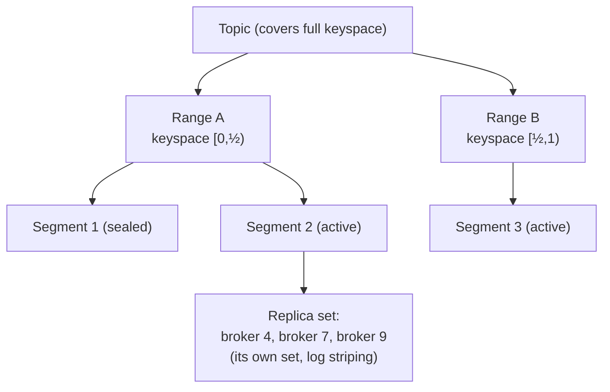
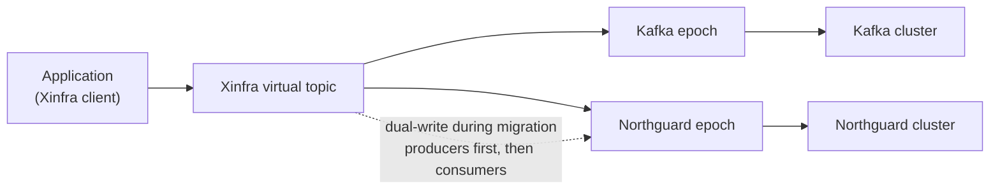

# LinkedIn: Northguard and Xinfra — Rebuilding Log Storage Past Kafka's Scaling Walls

> LinkedIn *invented* Apache Kafka 15 years ago to move replayable event streams
> between services. It worked so well the whole company built on it — and 15 years
> later it was groaning under **32 trillion records a day, 17 PB/day, 400K topics,
> 10K+ machines across 150 clusters**. Rather than keep bolting clusters together,
> LinkedIn built **Northguard**, a new log-storage system that shards its own
> metadata and self-balances data, and **Xinfra**, a virtualization layer that lets
> them migrate off Kafka *transparently* — one topic can live as a "Kafka epoch" and
> a "Northguard epoch" at the same time. This case study is a goldmine of senior
> ideas: *how do you scale the metadata plane, not just the data plane? How do you
> make replication fine-grained and self-balancing? And how do you migrate a
> company-wide bus with zero downtime?* All facts come from LinkedIn's engineering
> post "Introducing Northguard and Xinfra."

## The problem: Kafka couldn't grow with LinkedIn anymore

Start with the shape of the thing. A **log** here is an append-only, replayable
sequence of records — producers write to the end, consumers read forward and can
rewind. Kafka is a distributed log: it's the pipe every LinkedIn service publishes
to and subscribes from. LinkedIn grew from **90 million members in 2010 to over 1.2
billion today**, and the log infrastructure grew with it until it hit walls.

The scale Kafka reached at LinkedIn: **over 32T records/day at 17 PB/day on 400K
topics distributed across 10K+ machines within 150 clusters.** At that size, five
distinct problems stacked up:

- **Scalability** — metadata and cluster-size limits meant the only way to grow was
  to *spin up yet another cluster*.
- **Operability** — running **over 100 clusters** required a whole ecosystem of
  management services just to keep the lights on.
- **Availability** — the **partition** (Kafka's unit of parallelism and replication)
  is a *heavyweight* thing to replicate and move around.
- **Consistency** — often traded away to preserve availability.
- **Durability** — the guarantees weren't strong enough for the most critical apps.

The recurring theme: Kafka scales the *data* plane reasonably, but the *control*
plane (metadata, cluster membership, the coordinator) and the *unit of replication*
(the partition) don't scale with it.

## Why the naive fix broke: "just add more clusters"

The path of least resistance — and what LinkedIn actually did for years — was to
**keep adding clusters**. When one cluster's metadata or size hit a ceiling, you
stood up another and sharded topics across them by hand.

This "works" but rots from two directions at once:

1. **The metadata bottleneck moves, it doesn't disappear.** Kafka's cluster state is
   coordinated by effectively **one controller** per cluster. That controller is a
   scaling ceiling: past some number of partitions/topics it becomes the limit. Adding
   clusters just gives you *more* single-controller ceilings to manage, not a bigger
   one.
2. **Operational cost grows super-linearly.** Every new cluster needs the surrounding
   ecosystem — placement, balancing, monitoring, capacity planning — and cross-cluster
   topic placement becomes a human decision. **100+ clusters** is a full-time
   ecosystem, not a fleet you can ignore.

And the deeper structural problem stays put: the **partition is a heavyweight unit
for replication.** When a broker dies, whole partitions must be re-replicated and
rebalanced; a partition is coarse-grained, so recovery and balancing move data in
big lumps. You can't fix that by adding clusters — you have to change the unit.

> [!KEY-TAKEAWAY]
> Kafka's walls weren't in the storage — they were in the **metadata plane** (one
> controller per cluster) and the **granularity of replication** (the whole
> partition). Northguard's two central bets follow directly: **shard the metadata**
> across many coordinators, and make the **replicated unit small and self-balancing**
> (segments and ranges instead of partitions).

## Northguard's data model: records, segments, ranges, topics

Northguard runs as a cluster of **brokers** (the servers that store and serve data).
It achieves scale by **sharding both data and metadata, keeping global state
minimal, and using a decentralized membership protocol.** The cleverness starts with
a nested data model — learn these four nouns and the rest follows:

- **Record** — a key, a value, and user-defined headers, all just byte sequences.
  The granular unit that producers write.
- **Segment** — a *sequence of records*, and crucially **the unit of replication**.
  A segment is either **active** (still being appended to) or **sealed** (immutable).
  A segment gets sealed when a replica fails, when it reaches **1 GB**, or when it has
  been active for **over an hour**. Because a segment is small and self-contained,
  re-replicating one is cheap — this is the direct answer to "partitions are
  heavyweight."
- **Range** — Northguard's log abstraction: a sequence of segments over a
  **contiguous keyspace range**. A range can be **split or merged** following a
  **"buddy memory allocator" pattern** (the same halve/coalesce idea an OS memory
  allocator uses), so a hot range can be split without touching its neighbors.
- **Topic** — a named collection of ranges that together cover the *full keyspace*.

The payoff mechanism is **log striping**: a log is broken into segments, and *each
segment has its own replica set*. So when you add a new broker to the cluster, it
**organically starts becoming a replica for new segments** — the system balances
**"by design"** rather than needing an external balancer to shuffle partitions
around. New capacity absorbs new writes automatically.

**Storage policies** define retention and placement constraints via *broker
attributes*. Note a deliberate gotcha: Northguard has **no native rack or datacenter
concept** — admins encode locality themselves through attributes. That's a
flexibility-vs-guardrails trade the post calls out.

## Sharded metadata: DS-RSM, vnodes, and coordinators

This is Northguard's answer to the one-controller ceiling. Instead of a single
controller holding all cluster state, Northguard spreads metadata across many
independent, replicated shards:

- **vnode** — a **Raft-backed replicated state machine** that holds *one shard* of
  the metadata. (Raft is a consensus protocol that keeps a set of replicas agreeing on
  an ordered log of state changes; a "replicated state machine" is the standard way to
  build a consistent, fault-tolerant service on top of it.)
- **Coordinator** — the **leader of a vnode**, holding the *business logic*. The
  coordinator drives self-healing: when a segment loses a replica, the coordinator
  arranges a new one.
- **DS-RSM** (**Dynamically-Sharded Replicated State Machine**) — the scheme that
  places vnodes over a **consistent-hash ring**. Topics are hashed by name;
  ranges and segments are hashed by range ID. Metadata is thus spread evenly and can
  grow by adding vnodes.

The scaling contrast is the headline: where Kafka is bottlenecked at **1 controller**,
Northguard runs **N (128+) coordinators**. The metadata plane now scales horizontally
like the data plane.

For **cluster membership and failure detection**, Northguard uses the **SWIM
protocol** — nodes randomly probe each other to detect failures and use
infection-style ("gossip") dissemination to spread membership changes. This is
decentralized: there's no single membership master to become a bottleneck or a single
point of failure.

Two protocol details worth knowing: **metadata protocols are unary** (simple
request/response), while **produce, consume, and replication are sessionized
streaming protocols** using pipelining and windowing for throughput. And the
**segment storage engine is pluggable** — the primary "fps store" uses a
write-ahead log (WAL), one file per segment, **Direct I/O**, and a **RocksDB sparse
index**. Direct I/O bypasses the OS page cache to avoid double buffering, which means
the application has to do its own caching — a classic trade.

## Ranges vs. partitions: why splitting beats a fixed grid

Here's the subtle design win that's great interview material. In Kafka you pick a
partition count up front; growing it is painful. Why did Northguard choose
*splittable ranges* over *indexed partitions*?

Because **repartitioning a partitioned topic needs a "stop-the-world" synchronization
barrier** — everyone has to pause while the mapping from keys to partitions is
rebuilt. **Splitting a range only interrupts the clients producing to the *one range
being split*** — everyone else keeps going. It's a local operation, not a global one.

And ordering is not sacrificed: Northguard preserves **happens-before guarantees
across splits and merges**. Even better, because ranges follow the buddy-allocator
pattern, **buddy-style ranges align across topics**, so a stream-join across two
topics doesn't need a costly reshuffle stage — the keyspaces already line up.

## Durability: fsync-before-ack

One concrete, quotable upgrade. Kafka at LinkedIn does **lazy syncs — flushing to
disk every 10 seconds / 20k records** — meaning an ack can be returned before data is
durably on disk. Northguard **fsyncs before it acks**, tuned at **10 milliseconds /
20k records / 10 MB**. So an acknowledged write in Northguard is genuinely on disk,
which is why the post says Northguard **meets LinkedIn's existing Kafka SLOs but with
better durability.** (The post gives no specific end-to-end latency numbers beyond
these sync-timing figures.)

## Xinfra: virtualize the bus so you can migrate under it

Northguard is only half the story. You can't rip out a system the whole company
depends on — so LinkedIn built **Xinfra** (pronounced "ZIN-frah"), a **virtualized
Pub/Sub layer that supports both Northguard *and* Kafka.** It's the indirection layer
that decouples applications from physical clusters.

The key concept is the **epoch**. A **Xinfra topic** captures its change history as a
sequence of epochs, and a single topic can have a **Kafka epoch and a Northguard
epoch at the same time.** Clients talk to the virtual Xinfra topic; Xinfra federates
many physical clusters under one virtual cluster and routes to the right epoch. That
makes the underlying migration **transparent to users**.

How Xinfra keeps its own metadata:

- **Xinfra-metadata-service** stores all metadata in **MySQL**.
- **ZooKeeper** provides consistency and membership for the service.
- **Vitess** (sharded MySQL) plus a **coalescing buffer** handle checkpoints
  (consumer offsets) at scale.
- **Couchbase** is the caching layer.

**The migration itself** uses **dual-writes and staged cutover**: create the new
epoch in the target system, migrate **producers first**, then **consumers**. Dual
writes mean you can **roll back** and they **preserve ordering** during the switch.
The reported result: **over 90% of applications now run Xinfra clients**, and they've
migrated **thousands of topics accounting for trillions of records per day.**

> [!INTERVIEW]
> The migration pattern is the transferable lesson: **virtualize the resource, then
> move the implementation under the virtual name.** An epoch that can be "Kafka" or
> "Northguard" is exactly like a DNS name that can point at old or new servers, or a
> feature-flagged data-access layer. Dual-write + staged producer-then-consumer
> cutover + rollback is the zero-downtime migration playbook — and it only works
> because Xinfra sits *between* apps and clusters from the start.

## Concrete numbers from the post

| Metric | Value |
|---|---|
| Members (2010 → today) | 90 million → over **1.2 billion** |
| Kafka scale | **32T records/day**, **17 PB/day**, **400K topics** |
| Kafka footprint | **10K+ machines**, **150 clusters** (100+ needing management ecosystem) |
| Metadata coordinators (Kafka → Northguard) | **1 controller → N (128+) coordinators** |
| Cluster count reduction | **80%+ fewer** clusters |
| Segment seal triggers | **1 GB**, active **> 1 hour**, or replica failure |
| Kafka durability (lazy sync) | flush every **10 s / 20k records** |
| Northguard durability (fsync before ack) | **10 ms / 20k records / 10 MB** |
| Xinfra client adoption | **over 90%** of applications |
| Topics migrated | **thousands**, **trillions of records/day** |

## Trade-offs and gotchas, gathered

- **Segments/ranges add management complexity.** Fine-grained replication kills the
  resource-skew problem of coarse partitions and self-balances, but now you have far
  more objects (segments, replica sets, ranges) to track and coordinate.
- **Ranges beat partitions for elasticity, at a cost.** Splitting only interrupts
  producers to the split range (vs. a stop-the-world barrier for repartitioning), but
  the system must maintain happens-before ordering across splits/merges.
- **No native rack/DC awareness.** Admins encode locality via broker attributes and
  storage policies — flexible, but you can misconfigure durability domains.
- **Direct I/O trade.** Bypassing the OS page cache avoids double buffering but forces
  application-level caching.
- **Durability vs. throughput.** fsync-before-ack (Northguard) is safer than Kafka's
  lazy 10-second sync, but syncing on the write path costs latency you must budget for.
- **Migration has temporary overhead.** Dual-writes across hundreds of thousands of
  topics add cost during the transition, and zero downtime is a hard constraint —
  correctness is verified with **deterministic simulation testing** that injects
  faults like network partitions, disk corruption, and packet loss.

## Common follow-up questions

- "What was actually broken about Kafka at LinkedIn scale?" Not the storage — the
  **metadata plane** (one controller per cluster is a scaling ceiling) and the
  **replication unit** (the partition is heavyweight to move and recover). Adding
  clusters just multiplied single-controller ceilings and the ops burden of 100+
  clusters.
- "Why segments and ranges instead of partitions?" A segment is a small, immutable
  unit of replication, so re-replication and balancing move small lumps and happen
  automatically as brokers join (log striping). A range can be split/merged locally
  (buddy-allocator style), so scaling a hot key range doesn't stop the world like
  repartitioning a Kafka topic does.
- "How does Northguard scale metadata past one controller?" DS-RSM: many **vnodes**
  (Raft replicated state machines), each owning a metadata shard, placed on a
  consistent-hash ring. The vnode leader is the **coordinator**. Kafka's 1 controller
  becomes **128+ coordinators**.
- "What is an epoch in Xinfra and why does it matter?" An epoch is one entry in a
  Xinfra topic's change history. One virtual topic can hold a Kafka epoch and a
  Northguard epoch simultaneously, so clients see a stable virtual name while the
  physical backing migrates underneath — transparently.
- "How do they migrate a topic with zero downtime?" Create the new epoch in the
  target, **dual-write**, cut over **producers first then consumers**. Dual writes
  preserve ordering and allow rollback. Result: 90%+ of apps on Xinfra clients,
  thousands of topics moved.
- "How much better is durability, concretely?" Kafka lazily flushes every 10 s /
  20k records (ack can precede disk); Northguard **fsyncs before ack** at 10 ms / 20k
  records / 10 MB — an acked write is truly on disk, while still meeting Kafka's SLOs.
- "How do they gain confidence in a system this critical?" Deterministic simulation
  testing that injects network partitions, disk corruption, and packet loss — you
  replay the exact fault sequence to reproduce and fix bugs.

## References

- LinkedIn Engineering — "Introducing Northguard and Xinfra":
  https://www.linkedin.com/blog/engineering/infrastructure/introducing-northguard-and-xinfra
- Background concepts: Apache Kafka documentation (partitions, controller); Raft
  consensus; SWIM membership protocol; buddy memory allocator.
