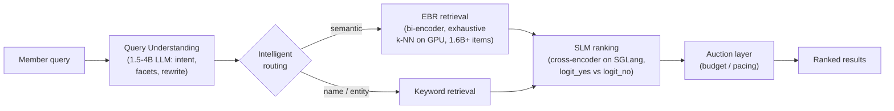

# LinkedIn: Reimagining the Search Stack with LLMs at Query-per-Second Scale

> LinkedIn's search box is how members find jobs, people, and knowledge. For years
> it ran on **keyword matching** — exact word overlap between what you typed and what
> a posting said. That is fast and cheap, but it can't read intent: search "growth
> marketer who's done B2B SaaS" and keyword overlap flails. LinkedIn wanted search
> that feels *"relevant, intuitive, personalized, and predictive"* — which means
> putting **large language models (LLMs)** in the path. The catch: their search
> serves *"millions of real-time queries per second,"* and a naive LLM stack there
> would be ruinously slow and expensive. This case study is about how they got LLM
> quality *while keeping inference cost comparable to the old machine-learning
> models* — a masterclass in distillation, pruning, and precompute. All facts come
> from LinkedIn's engineering post "Reimagining LinkedIn's Search Stack."

## The problem: LLM-quality search at millions of queries per second

Search is central to LinkedIn's mission of connecting professionals to opportunity.
The bar they set was search that is relevant, intuitive, personalized, and
predictive. Modern LLMs can deliver exactly that kind of understanding — they grasp
that "growth marketer" and "demand-gen lead" are near-synonyms, and they can read a
1,000-word job description and judge whether it fits a query.

The problem is *where* you'd put them. LinkedIn's search handles **millions of
real-time queries per second**. A large LLM might take hundreds of milliseconds to
score a single query-document pair; multiply by millions of QPS and the fan-out
across candidate documents, and the compute bill and latency both explode. So the
real engineering question isn't "can an LLM improve search quality?" (obviously yes)
— it's *"how do we get LLM-level quality at RecSys-level cost and latency?"*
(**RecSys** = recommender-system models, the lightweight ranking models search
teams have used for a decade). That framing drives every decision below.

Two terms you'll need. **Retrieval** is the first stage: from tens of millions of
documents, cheaply pull a few hundred *candidates* that might match. **Ranking** is
the second stage: score those candidates precisely and order them. Retrieval must be
cheap-and-broad; ranking can be expensive-and-precise because it sees far fewer
items.

## The naive approach and why it broke: keyword matching + brittle NER

The legacy system relied on **keyword matching** — exact word overlap between queries
and postings. Two failure modes:

- **Vocabulary gap.** If the member's words don't literally appear in the document,
  the document isn't found, even when it's a perfect fit. "Laid-off looking for
  remote" won't match a posting that says "distributed team, open to displaced
  candidates."
- **No intent understanding.** Keyword overlap can't tell that a query is a *person's
  name* versus a *skill* versus a *company* — so it can't route or personalize.

Query understanding — figuring out what the member actually wants — was handled by
*"multiple brittle NER and heuristic components."* **NER** (named-entity recognition)
tags spans of text as a person, company, title, etc.; stacking several
narrow NER models plus hand-written heuristics is fragile: each piece has its own
failure modes, they disagree, and adding a new capability means another brittle box.

How much room was there to improve? The old **RecSys ranking baseline scored a Click
AUC of 0.61**. (**AUC**, area under the ROC curve, measures ranking quality on a
0.5–1.0 scale, where 0.5 is random and 1.0 is perfect; **Click AUC** asks "does the
model rank items the member will click above ones they won't?") 0.61 is only modestly
better than a coin flip at ordering by click — a clear signal the model wasn't
capturing intent.

## The rebuild: a four-stage LLM pipeline

The new stack is a pipeline of four stages, each using the *right size* of model for
its job. Read them in order of how a query flows through.

**1. Query Understanding — one unified LLM layer.** The brittle NER-and-heuristic
stack is replaced by a single **fine-tuned LLM layer** using **1.5–4B-parameter
models** ("B" = billion parameters; these are *small* by frontier-LLM standards,
chosen so they're cheap enough to run inline). One model handles intent
classification, facet extraction, and profile-aware query rewriting. On top sits an
**intelligent routing layer**: it classifies the query and routes ambiguous,
semantic queries to embedding-based retrieval, but sends name/entity lookups (where
you want an *exact* match, not a fuzzy one) to keyword retrieval.

**2. Embedding-Based Retrieval (EBR) — cheap-and-broad.** This is the retrieval
stage. LinkedIn fine-tunes an open-source LLM into an **embedding model** with a
**dual-tower (bi-encoder) architecture**. (An **embedding** is a vector — a list of
numbers — that captures meaning, so similar things sit close together. A **dual-tower
/ bi-encoder** encodes the query and the document *separately* into vectors, so
document vectors can be **precomputed offline** and only the query is embedded at
request time.) Job embeddings are precomputed and stored in **GPU-backed indexes**,
and retrieval does an **exhaustive k-nearest-neighbor (k-NN) search** using
**dot-product similarity** on **CUDA-enabled GPUs** — comparing the query vector
against *every* item vector, over **1.6B+ items**. Exhaustive (brute-force) search on
GPU is fast enough here and avoids the recall loss of approximate methods.

**3. SLM Ranking — expensive-and-precise.** The ranking stage uses a **Cross-Encoder
Small Language Model (SLM)**. (A **cross-encoder** feeds the query *and* the document
into the model *together*, so it can reason about their interaction — far more
accurate than a bi-encoder, but it can't be precomputed, so you only run it on the
few hundred candidates retrieval hands you.) It's a decoder-only model served on
**SGLang** (an inference-serving engine for LLMs) and it scores relevance by
comparing the model's `logit_yes` vs. `logit_no` outputs — essentially "how strongly
does the model say *yes, this is relevant*?"

**4. Auction Layer.** Finally, an auction applies **budget/pacing strategies**,
balancing relevance and engagement against business metrics before the results are
shown.

## Foundation first: build the judge before the models

The subtle, senior move here is *sequencing*. Before building any retrieval or
ranking model, LinkedIn built an **LLM-based, product-policy-grounded quality
evaluation framework** — a way to *judge* whether a result is good, grounded in
product policy. Every downstream model is trained and measured against this judge, so
"better" has a stable definition.

But a large LLM judge is itself too slow: big judges *"cannot meet our throughput
needs."* So the judge is **distilled** down to an **8B evaluator**. To trust it, they
calibrate against human product managers and require a **weighted Cohen's Kappa ≥
0.8** (Cohen's Kappa measures agreement beyond chance; ≥0.8 is "strong agreement") —
i.e. the automated judge agrees with expert humans strongly enough to stand in for
them.

## Making it fast and cheap: distillation, pruning, compression

This is the heart of the case study — the techniques that turn LLM quality into
RecSys cost. Four levers, each with a measured trade-off.

**Distillation.** Train a big, slow **teacher** model, then train a small, fast
**student** to mimic it. LinkedIn distills a **7B teacher down to 0.6B and 1.7B
students**, using **multi-teacher, multi-task distillation** with **KL divergence**
(a measure of how far the student's output distribution is from the teacher's — you
minimize it). Remarkably, the distilled **0.6B student nearly matches the 1.7B
teachers**: NDCG@10 0.9239 (student) vs. 0.9484 (relevance teacher), Apply AUC 0.8007
vs. 0.8049, Click AUC 0.6704 vs. 0.6772. (**NDCG@10** grades the ordering quality of
the top 10 results.)

**Pruning.** Remove parts of the network to shrink it. LinkedIn chose **structured
pruning** (removing whole neurons, attention heads, or layers) over **unstructured
pruning** (zeroing individual weights) — because unstructured pruning *"often provides
no meaningful speedup without specialized hardware"* (sparse weights don't run faster
on normal GPUs). Pruning hurts accuracy, so they **fine-tune again afterward** to
recover it.

**Context compression.** Job descriptions are *long* — **median ≈ 900 tokens, max
> 2,300**, with **~10% truncated** at a 2,048-token limit, and descriptions make up
**over 94% of the SLM's prompt**. Since cross-encoder cost grows **quadratically with
input length**, that text dominates cost. Two moves: (a) **summarize descriptions
offline** with a semantics-preserving, length-aware objective (RL-tuned) — because
simply *dropping* the description *"severely degrades relevance quality"*; and (b)
**embedding compression** — condense each item's text into **a single-token
embedding** while keeping key raw fields (title, company, location, name) intact.

The throughput payoff is dramatic, and it costs quality:

| Ranking setup | NDCG@10 | Throughput (items/sec/GPU) |
|---|---|---|
| SLM with raw text | 0.9432 | 290 |
| Pruned SLM + summarized text | 0.9218 | 2,200 |
| SLM with embedding compression | 0.9239 | 22,000 |

Going from raw text to embedding compression is a **~76x throughput gain (290 →
22,000 items/sec/GPU)** for a **modest NDCG@10 drop (0.9432 → 0.9239)**. That trade —
give up a little ranking precision to serve dozens of times more traffic per GPU — is
what makes LLM search affordable.

**Hybrid precompute.** The last lever is *when* you compute. Anything that doesn't
depend on the live query is done ahead of time: **item embeddings and summaries are
precomputed offline** (via **Spark + Flyte**), lower-latency updates run **nearline**
(via **Flink**), phrase embeddings for snippets live in the **Venice** key-value
store, and reasoning outputs are cached in **Couchbase**. Online, you only pay for the
query-dependent work.

> [!KEY-TAKEAWAY]
> The whole rebuild is one idea applied over and over: **push work off the online
> path.** Distill big models into small ones; prune and compress so each GPU serves
> more; and precompute everything that doesn't depend on the live query (embeddings,
> summaries, snippets). That is how LinkedIn got LLM-quality search *"while keeping
> inference costs comparable to traditional RecSys models."*

## Training signals: contrastive + ranking loss, multi-task

The retrieval embedding model is trained with **InfoNCE contrastive loss** (pull the
query close to relevant items, push it away from irrelevant ones) plus a
**margin-based ranking loss**, using **hard positives and hard negatives mined from
LLM-judged data** — "hard" examples are the confusable near-misses that teach the
model the most. Ranking is trained **multi-task over 6+ tasks of member actions**
(click, apply, and other engagement signals), so one model learns several outcomes at
once rather than optimizing a single proxy.

## Concrete numbers from the post

| Metric | Value |
|---|---|
| Query volume | *"millions of real-time queries per second"* |
| EBR retrieval corpus | **1.6B+ items**, exhaustive k-NN on GPU |
| Query-understanding models | **1.5–4B** parameters |
| Evaluator judge | **8B** (distilled) |
| Teacher → students | **7B → 0.6B / 1.7B** |
| Judge reliability | weighted Cohen's Kappa **≥ 0.8** |
| Job description length | median **≈ 900 tokens**, max **> 2,300** |
| Truncation | **~10%** truncated at 2,048-token limit |
| Description share of prompt | **> 94%** |
| Legacy RecSys Click AUC | **0.61** |
| New Job-Ranking Click AUC | **0.67** |
| Distilled 0.6B SLM | NDCG@10 **0.9239**, Apply AUC **0.8007**, Click AUC **0.6704** |
| Throughput (raw → compressed) | **290 → 22,000** items/sec/GPU (~76x) |
| EBR baseline | NDCG@10 **0.838** |
| Overall impact | *"double-digit improvements in search quality and member engagement"* |
| Contributors | **100+** team members |

## Trade-offs and gotchas, gathered

- **Quality vs. throughput is the master dial.** Embedding compression buys ~76x
  throughput for a real NDCG@10 drop (0.9432 → 0.9239). LinkedIn judged the quality
  loss worth the cost savings — but it *is* a loss, not a free lunch.
- **You can't just drop the long text.** Descriptions are >94% of the prompt and the
  obvious cost target, but removing them *"severely degrades relevance quality."* The
  fix is *summarize offline*, not *delete online* — keep the meaning, pay the cost
  once.
- **Structured pruning, not unstructured.** Unstructured pruning gives "no meaningful
  speedup without specialized hardware," so structured pruning (whole heads/layers)
  is the only kind that actually runs faster on their GPUs — and it needs post-pruning
  fine-tuning to recover accuracy.
- **Bi-encoder vs. cross-encoder is a retrieval/ranking split.** Bi-encoders are
  precomputable and cheap → use for retrieval over 1.6B items. Cross-encoders are
  accurate but non-precomputable → use only on the few hundred survivors.
- **The judge must be fast too.** A large LLM judge can't meet throughput needs, so
  even the *evaluation* model is distilled (to 8B) — and validated against human PMs
  (Kappa ≥ 0.8) so the shortcut doesn't corrupt the training signal.
- **Cross-encoder cost is quadratic in input length**, which is exactly why long job
  descriptions had to be compressed rather than fed raw.

## Common follow-up questions

- **"Why not just put a big LLM directly in the query path?"** At millions of QPS,
  a large LLM's latency and compute cost are prohibitive. The entire design — distill
  to small models, prune, compress context, precompute embeddings/summaries — exists
  to hit LLM quality at RecSys cost.
- **"Why a bi-encoder for retrieval but a cross-encoder for ranking?"** Bi-encoders
  encode query and document separately, so document vectors precompute offline and
  retrieval over 1.6B items stays cheap. Cross-encoders read query and document
  together for far higher accuracy but can't be precomputed — so you only run them on
  the few hundred candidates retrieval returns.
- **"Why exhaustive k-NN instead of approximate nearest neighbor?"** Brute-force
  dot-product search on CUDA GPUs is fast enough at their scale and avoids the recall
  loss that approximate methods (ANN) introduce — you compare against every item
  vector, so you never miss a good candidate to an index approximation.
- **"How do they compress job descriptions without wrecking quality?"** Two ways:
  summarize descriptions offline with a semantics-preserving, length-aware objective,
  and condense each item into a single-token embedding while keeping key raw fields
  (title, company, location). Dropping the text outright severely degrades relevance,
  so they preserve meaning rather than discard it.
- **"What did they build first, and why?"** An LLM-based, product-policy-grounded
  evaluation framework (the judge), distilled to an 8B model and calibrated to human
  PMs at Cohen's Kappa ≥ 0.8. With a stable definition of "good," every downstream
  retrieval and ranking model can be trained and measured consistently.
- **"How big was the quality win?"** Job-Ranking Click AUC rose from a 0.61 RecSys
  baseline to 0.67, and LinkedIn reports "double-digit improvements in search quality
  and member engagement" overall — achieved while keeping inference cost comparable to
  the traditional RecSys models.

## References

- LinkedIn Engineering — "Reimagining LinkedIn's Search Stack":
  https://www.linkedin.com/blog/engineering/search/reimagining-linkedins-search-stack
- Background reading referenced by the post: efficient LLM inference infrastructure
  (arXiv:2510.22101), context compression (arXiv:2512.07846), query understanding
  (arXiv:2509.09690).
