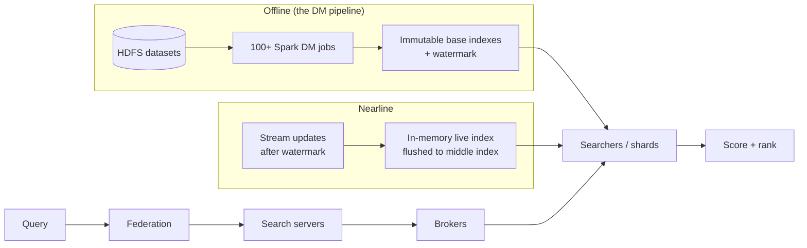

# LinkedIn: Optimizing Sales Navigator's Search Pipeline with Spark

> Sales Navigator is LinkedIn's sales-prospecting product, and behind its search box
> sits one of LinkedIn's largest search systems. To answer a query fast, the system
> relies on a **search index** that has to be rebuilt in bulk offline — a huge nightly
> batch job that reads raw datasets and packs them into the data structures the search
> servers read at query time. That rebuild job is a data-manipulation (**DM**) pipeline
> that grew to **over 100 jobs** running on **Apache Spark**. This case study walks how
> LinkedIn engineers cut the pipeline's total runtime **from 6–7 hours down to around
> three hours** — not by throwing more machines at it, but by pruning the job graph,
> fixing data skew, tuning shuffles, and picking the right join strategy. It is a
> goldmine of senior-interview ideas about large-scale batch processing: *how do you
> speed up a Spark pipeline when you can't just add more executors?* All facts are drawn
> from LinkedIn's engineering post "Optimizing LinkedIn Sales Navigator's search pipeline
> with Spark."

## The problem: rebuild a giant search index faster, without more compute

Start with why the pipeline exists. LinkedIn consolidated its separate search use cases
into a centralized **search-as-a-service**. The Sales Navigator search system was among
the largest of those, and the offline job that builds its index — the **DM pipeline**
(DM = data manipulation, the batch transforms that turn raw source data into a
query-ready index) — needed to run faster. The business reason is direct: a faster
pipeline means customers "get quicker access to updated search results," so a sales
rep sees fresh data about prospects sooner.

Two pieces of vocabulary before we go further. A **search index** is a data structure
that maps search terms to the documents containing them so lookups are fast; the core
one here is an **inverted index**, where each term points to a **posting list** of
document IDs. **Sharding** splits that index across many machines so it fits and serves
in parallel — each **shard** holds a slice of the documents.

The workload has a specific shape. The pipeline reads datasets ranging **from a few MBs
to hundreds of TBs**, and some jobs **union more than 20 datasets** together. It runs
**over 100 DM jobs**, and the largest single job needs **approximately 5,000 executors**
(an **executor** is one Spark worker process, a JVM that runs tasks and holds data in
memory). The jobs read and write data in **Avro** format and are orchestrated by
**Azkaban** (LinkedIn's batch workflow scheduler).

## The three components of the search system

Before the optimization story, it helps to see where the batch pipeline sits. The
search system has three parts:

- **Offline** — periodic large-scale batch jobs load datasets from **HDFS** (Hadoop
  Distributed File System), transform them, and build **immutable base indexes** stored
  in shards. Postings in each inverted list are sorted by document ID. These jobs also
  emit **watermarks** — epoch-millisecond timestamps marking how current the index is.
  *This is the DM pipeline this case study optimizes.*
- **Nearline** — stream processing captures updates that arrive *after* the watermark,
  building an in-memory **live index** that is periodically flushed to disk as a
  "middle index." This keeps results fresh between full offline rebuilds.
- **Serving** — a query flows through a mid-tier **federation** layer → **search
  servers** → **brokers** (which fan the query out across partitions) → **searchers**
  (each owning one shard) → scoring and ranking. There are two cluster groups: **live**
  (production) and **dark** (canary), with a **response validator** comparing their
  outputs to catch regressions.

## The naive approach and why it broke: just add executors

The DM pipeline previously ran on **MapReduce** and was migrated to Spark. The obvious
way to make a slow Spark pipeline faster is to give it more compute. That did not work
here, for two reasons:

1. **Resource caps per job.** LinkedIn enforces **resource caps per Spark job** so a
   shared cluster stays fairly allocated across teams. Some jobs — including the one
   needing ~5,000 executors — were **already at those limits**. You cannot add what you
   are not allowed to request.
2. **Tuning every job by hand is impractical.** With over 100 interdependent jobs,
   tuning each one individually was infeasible, and changes cascade: a job's runtime
   depends on its upstream dependencies, so a local fix may not move the finish line.

That pushed the team toward **holistic optimization** — treat the whole pipeline as one
system with a critical path, not a bag of independent jobs.

> [!KEY-TAKEAWAY]
> When you can't add resources, speed comes from removing work and removing waste:
> prune the job graph, fix skew so executors finish together, right-size shuffles, and
> avoid unnecessary shuffles with the correct join strategy — then attack the critical
> path first.

## Job-graph pruning: do less work before tuning anything

The first lever is structural, not configurational: **critical-path analysis**. Before
tuning individual jobs, the team identified bottlenecks — the longest job on a parallel
branch, or a job that many others depend on — because those are what actually gate the
pipeline's finish time.

The concrete win: **consolidating three jobs into one** removed redundant reads/writes
and intermediate materialization and saved **over 30 minutes**. Fewer jobs means fewer
Spark applications to schedule, fewer datasets written to HDFS and re-read, and a
shorter dependency chain on the critical path.

## Fixing data skew with repartitioning

**Data skew** is when work is unevenly distributed across executors: a few executors get
far more data than the rest, so everyone waits on those stragglers. Union-heavy jobs
(remember, some union more than 20 datasets) are prone to it because the combined data
does not land evenly across partitions.

How to spot it: watch the Spark UI's **Shuffle Read** metric — if a handful of
executors read a disproportionate share of the shuffled data, you have skew. (A
**shuffle** is the redistribution of data across the network between stages, e.g. so
that all rows with the same key end up together.)

The fix is **repartitioning** on a high-cardinality, uniformly distributed column. Here,
repartitioning by **search document ID** cut one job **from around 2 hours to just 30
minutes**, and afterward each executor's shuffle read was balanced at about **4.3 GB**.
Document ID is a good repartition key precisely because it is unique and evenly spread.

## Tuning shuffle partitions

Choosing a good repartition key is not enough; the *number* of shuffle partitions
matters too. Spark's `spark.sql.shuffle.partitions` controls how many partitions a
shuffle produces. **Too few partitions causes skew even with a good key** — each
partition is forced to hold too much — while a value that is too low also wastes cluster
resources.

A reasonable starting point is roughly **executor count × cores per executor**, so there
is at least one partition's worth of work per core. Getting this right on one job cut it
by **more than 30 minutes**.

## Broadcast joins for size-mismatched tables

When you join a small table against a large one, a normal (shuffle) join redistributes
*both* tables across the network by join key — expensive. A **broadcast join** avoids
that: Spark copies the **small (build) table** to every executor, which then joins it
locally against its slice of the **large (probe) table**. No shuffle of the big table.

The win: **broadcasting a ~40 MB table cut a job from over 1 hour to around 20 minutes**.
Spark auto-broadcasts tables under a default threshold of **10 MB**
(`spark.sql.autoBroadcastJoinThreshold`), so the team raised the threshold (or hinted the
join) to catch this ~40 MB table. LinkedIn's rule of thumb: **tables less than 40 MB are
potential broadcast candidates**.

> [!WARNING]
> Broadcasting is not free. The build table is copied to every executor, so a table that
> is too large risks **OutOfMemory** errors and network saturation. In LinkedIn's
> experience, broadcasting tables **over 2 GB resulted in significant performance
> degradation**. Broadcast small; shuffle-join big.

## Running joins in parallel with `.par`

Some jobs union or join many DataFrames sequentially, one after another. Scala's `.par`
converts a collection to a **parallel collection**, so those joins run **concurrently**
instead of in sequence. Applying it reduced a job by **around 30 minutes**.

There is a subtlety about *where* the work runs. The **orchestration** of the parallel
joins happens on the **driver** (the process that coordinates the Spark application), and
the driver can become a bottleneck when a job juggles **20+ DataFrames**. The joins
themselves run on **executors**, which must have enough resources to actually run in
parallel. So `.par` only pays off when both the driver and the executors have headroom.

## Auto-tuning memory with Right-Sizing

Manually picking executor memory for 100+ jobs is a losing game, so LinkedIn uses a
rule-based auto-tuning tool called **Right-Sizing**. It analyzes **the last 30 days** of
a job's historical runs and adjusts **executor memory and memory overhead** accordingly.
It also detects **recurring OutOfMemory** patterns and flags those jobs for deeper
investigation rather than blindly increasing memory forever. This turns per-job memory
tuning from manual guesswork into a data-driven, continuous process.

## Trade-offs and gotchas

- **Pruning vs. modularity.** Consolidating three jobs into one saved 30+ minutes, but
  merged jobs are bigger and harder to reason about and reuse. Consolidate on the
  critical path where it pays; keep independent branches modular.
- **Repartition key choice is load-bearing.** Repartitioning on a low-cardinality or
  skewed column re-introduces skew. The key must be high-cardinality and uniform (search
  document ID worked; a boolean flag would not).
- **Shuffle partitions are a two-sided error.** Too few → skew and stragglers; too many →
  scheduling overhead and tiny wasteful tasks. Anchor to cores available, then measure.
- **Broadcast has a ceiling.** Great under ~40 MB, dangerous over 2 GB. Know your table
  sizes before hinting a broadcast.
- **`.par` needs headroom on both sides.** With 20+ DataFrames the driver orchestrating
  the parallelism becomes the bottleneck, and executors need spare capacity or the
  "parallel" joins just queue.
- **Configs go stale.** The team's own takeaway: evolving architectures need "ongoing
  tuning and adjustments" — a config that was optimal last quarter can be wrong now as
  data volumes and dependencies shift.

## Common follow-up questions

**Why not just request more executors for the slow jobs?**
Because LinkedIn enforces resource caps per Spark job for fair cluster sharing, and the
largest jobs were already at their cap (the biggest needs ~5,000 executors). Speed had to
come from doing less work and reducing waste, not from more compute.

**How do you know a job is skewed rather than just big?**
Look at the Spark UI's Shuffle Read per executor. If most executors read a similar amount
but a few read far more (and finish far later), that is skew. If everyone reads a lot
evenly, the job is genuinely large and you need repartitioning-for-parallelism or more
resources, not skew mitigation.

**When should I use a broadcast join instead of a shuffle join?**
When one side is small enough to fit in each executor's memory — LinkedIn treats tables
under ~40 MB as candidates. Broadcasting copies the small table everywhere and skips
shuffling the large table. Don't broadcast large tables: over 2 GB caused significant
degradation and risks OutOfMemory.

**What's the difference between repartitioning and tuning shuffle partitions?**
Repartitioning changes *which key* redistributes the data (fixing uneven key
distribution). Shuffle-partition tuning changes *how many* output partitions a shuffle
produces. You often need both: a good key spread across an appropriate number of
partitions, roughly executor count × cores per executor.

**Why start with critical-path analysis instead of tuning the slowest job?**
Because the pipeline's finish time is set by its critical path, not by any single slow
job. Speeding up a job that isn't on the critical path (or that has slack because it runs
in parallel with a longer branch) buys nothing. Consolidating jobs and cutting
dependencies on the critical path is what actually moves the total runtime.

**Does `.par` make everything faster?**
No. It only helps when independent joins can genuinely run at the same time and both the
driver (orchestration) and executors (the actual joins) have spare capacity. With 20+
DataFrames the driver can become the bottleneck, negating the benefit.

## References

- LinkedIn Engineering — "Optimizing LinkedIn Sales Navigator's search pipeline with
  Spark" (Chunxu Tang, with Yanji Jia, Puneet Singh Ahluwalia, and Yuou Lei; July 23,
  2025):
  https://www.linkedin.com/blog/engineering/infrastructure/optimizing-linkedin-sales-navigators-search-pipeline-with-spark
