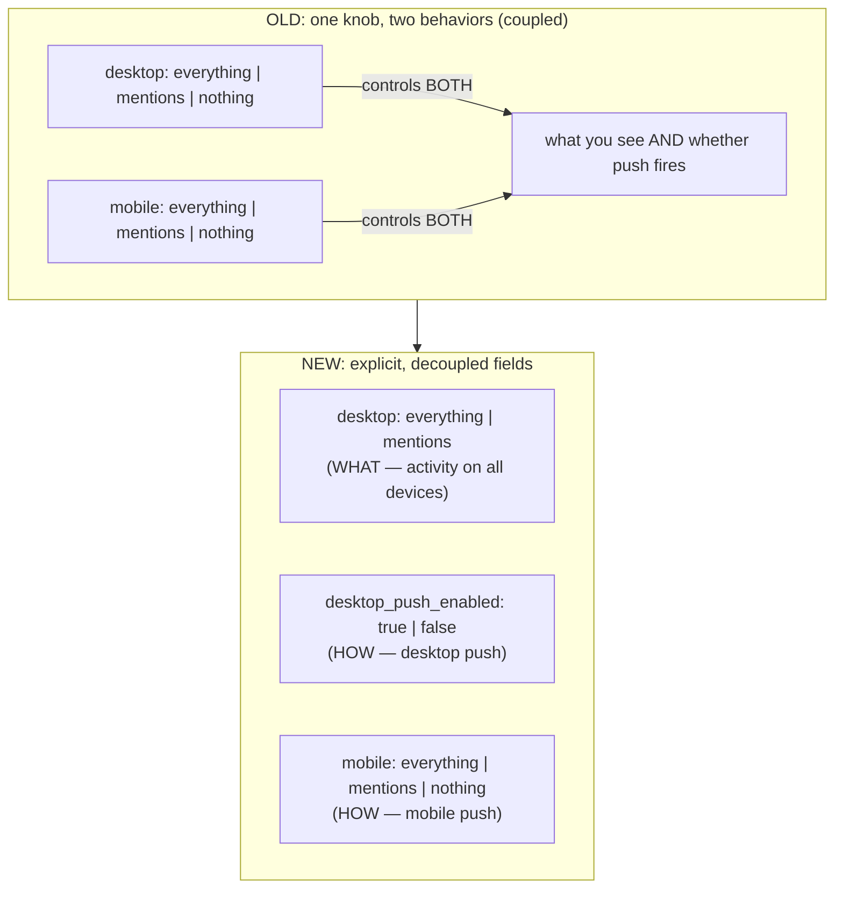

# Slack: Rebuilding Notifications for Correctness Across Devices

> Slack is a workplace chat app where you belong to many channels, and every message
> in every channel is a potential ping. Notifications are the product's nervous
> system: too many and people mute Slack entirely; too few and they miss the message
> that mattered. Slack's own data put notification problems among the *"top three
> drivers"* of customer-support tickets. This is a beautiful case study in a problem
> that looks like UI polish but is really **distributed state and safe migration**:
> how do you rebuild the rules that decide *whether to interrupt a human*, keep those
> rules consistent across a phone and a laptop that don't share memory, and migrate
> millions of live users without ever misfiring a notification? Everything here is
> drawn from Slack's engineering post "How Slack Rebuilt Notifications" — note that
> the post is largely qualitative, so where it gives no hard number we say so rather
> than invent one.

## The problem: one decision, two devices, millions of users

Start with the mental model. Every time a message lands, Slack must answer two
separate questions for each member of that channel:

1. **What** should this person be made aware of? (every message? only mentions and
   direct messages? nothing?)
2. **How** should they find out? (a push notification that buzzes their phone? a
   silent badge count? just an in-app highlight they'll see when they look?)

A **push notification** is the intrusive kind — the banner and buzz delivered by
Apple's or Google's push service even when the app is closed. A **badge** is the
little unread count on the app icon. **In-app activity** is the highlight you see
only once you open Slack. The crucial insight the whole rebuild rests on: *what* to
notify about and *how* to deliver it are **different decisions**, and the old system
had tangled them together.

Layer on the hard part: a user runs Slack on a laptop *and* a phone at the same
time. Those are two separate clients with two separate local states, and the
"correct" behavior — notify me on my phone but stay quiet on my desktop while I'm at
my desk — depends on preferences that must mean the *same thing* on both. When those
preferences drift out of sync, the user gets buzzed on the wrong device, or misses a
mention, and trust erodes.

> [!KEY-TAKEAWAY]
> The senior-interview version of this problem: "Design a preference system that
> cleanly separates *what to notify* from *how to deliver*, stays consistent across
> independent clients, and can be migrated for millions of live users without a
> single misfired notification." Slack's answer is a **decoupled, explicit-state
> schema** rolled out with a **read-time migration** so it's reversible. We'll build
> that up piece by piece.

## Why the old system broke: four tangled mental models

The legacy notification system had accreted for years, and it failed for four
concrete reasons the post calls out:

- **Four conflicting mental models.** Desktop and mobile had *separate* preference
  systems that used different words for the same idea. "Nothing" on mobile did not
  mean the same thing as "Off" on desktop. Users had to hold two incompatible models
  in their heads.
- **Hidden coupling between *what* and *how*.** Because the setting that controlled
  *what you were notified about* was welded to *how you received it*, dialing down
  push meant also sacrificing in-app awareness. You couldn't say "keep highlighting
  activity in the app, just stop buzzing my phone" — the knobs were the same knob.
- **Inconsistent state across clients.** Settings didn't reliably sync between
  desktop and mobile, so the two devices could quietly disagree about what you
  wanted.
- **Power users underserved.** Advanced controls (like "badge all unreads") were
  scattered and hidden, so the people who most wanted fine-grained control couldn't
  find it.

The lesson worth stating out loud: **when one setting secretly controls two
independent behaviors, no amount of UI polish can make it understandable.** The fix
had to be structural, in the data model — not just a nicer settings screen.

## The core move: decouple "what" from "how"

The redesign's central idea is to split that overloaded setting into an explicit
hierarchy of independent choices:

- **What to notify you about** — *All new messages*, *Mentions and DMs* (the new
  default), or *Mute*. (A **DM** is a direct message; a **mention** is when someone
  types your name, e.g. `@you`.)
- **How to receive push** — desktop **and** mobile (default), desktop only, mobile
  only, or disabled entirely.
- **Advanced** — mobile-specific and badge controls for power users.

Now the two questions from the top are answered by two independent settings. You can
choose "Mentions and DMs" for *what*, and "mobile only" for *how* — stay aware
everywhere, but only buzz the phone. That combination was literally impossible to
express in the old coupled model.

You can see the decoupling directly in the schema change. The old preferences stored
one field per device that mixed both concerns:

- `desktop`: `everything` | `mentions` | `nothing`  (controls push *on desktop*)
- `mobile`: `everything` | `mentions` | `nothing`  (controls push *on mobile*)

The new schema separates the "what" from the per-device "how":

- `desktop`: `everything` | `mentions`  — this now drives **activity awareness on
  both desktop and mobile** (the *what*)
- `desktop_push_enabled`: `true` | `false`  — a dedicated toggle for desktop push
  (the *how*)
- `mobile`: `everything` | `mentions` | `nothing`  — push on mobile

Notice what disappeared: the `nothing` value on `desktop`. In the old model, `nothing`
was doing double duty — "don't tell me about it" *and* "don't push it." In the new
model those are two fields, so `nothing` on desktop is no longer needed; suppressing
push is what the new boolean is for.

## The migration: change behavior at read time, not in the database

Here is the deepest engineering idea in the post, and the best interview material.
Millions of live users had preferences stored under the old schema. The obvious
migration is a **database backfill**: write a script that rewrites every user's rows
from the old shape to the new shape — for instance, turning the old `off` into the
new `mentions`-with-push-disabled.

Slack deliberately did **not** do a wholesale value migration for the risky
`off` → `mentions` transformation. Their stated reason: it was *"too risky for
rollback."* Once you've bulk-rewritten millions of rows, undoing it if something
goes wrong is another mass rewrite — and in the meantime you may have changed how
notifications behave for real people mid-conversation.

Instead they used a **read-time strategy**: leave the stored data mostly as-is, and
put the translation logic in the *code path that reads the preference*. When the
server evaluates a user whose old value was `off`, the read-time logic makes it
*behave as* "mentions, with push disabled." The old bytes on disk didn't have to
change for the behavior to change.

Why is this safer? Because the migration lives in code, not in data. If the new
behavior is wrong, you roll back the *code* — one deploy — and every user instantly
reverts to the old behavior, because their underlying data was never destructively
rewritten. There's no second mass-mutation to unwind.

For the genuinely new field, `desktop_push_enabled`, they *did* run a **backfill** —
but a purely additive one: set the new boolean based on whether the user previously
had `off`, so nobody's experience changed on day one. Additive backfills are safe in
a way that destructive value-rewrites are not: they add a column's worth of derived
state without clobbering the source of truth.

> [!INTERVIEW]
> If an interviewer asks "how would you migrate a preference/flag for millions of
> live users?", the senior answer echoes Slack's: *"Prefer a read-time
> transformation over a destructive backfill for anything reversible-critical. Keep
> the old data intact and translate on read, so rollback is a single code deploy
> rather than a second mass mutation. Use additive backfills only for genuinely new
> derived fields. And make the safety-critical direction fail closed — a disabled
> push must stay disabled even mid-rollback."* That framing — **reversibility as a
> first-class design goal** — is what separates a staff-level migration answer from
> "I'll write a backfill script."

## Correctness across devices: explicit state over clever sync

The old system had tried to keep desktop and mobile in step with a **sync
parameter** — a bit of implicit "make these two match" cleverness. Slack removed it
and instead stored **explicit desktop and mobile values**. The principle they state:
*"Clarity beats cleverness."*

Why does explicit state win here? Implicit sync is a source of ambiguity: when the
two clients disagree, which one wins, and when? That ambiguity is exactly what
produced settings drifting between devices. Storing the intended value for each
surface explicitly means every client reads the same unambiguous source of truth and
renders it the same way — a mention notifies you on mentions, full stop, and the push
toggle independently decides whether that also buzzes a given device. In-app activity
stays consistent across clients while push remains customizable per platform.

> [!WARNING]
> Preferences are a data-integrity surface, not just UI. Slack hit a bug where a
> single **malformed field** silently reset users' preferences to "Mentions" — and
> the fix required cleaning the bad data *and* flushing memcache (an in-memory cache
> that had served the corrupt value onward). Their takeaway: *"Tiny schema issues can
> cause major UX bugs."* When your schema decides whether to interrupt a human,
> validate writes strictly and treat cache invalidation as part of correctness.

## The client rebuild: shared components, auto-save

Decoupling the data model was only half the job; the settings *screens* had also
diverged. Slack rebuilt the client UI on **reusable React components** so desktop and
mobile render the same preference model from the same building blocks, instead of
each platform maintaining its own bespoke screens. The oldest iOS settings pages —
which had drifted furthest — were rewritten to match the desktop layout.

They also replaced the manual **Save** button with **auto-save**: a change to a
preference persists immediately. This is a small UX detail with a correctness angle —
there's no window where a user thinks they changed a setting but never committed it,
and no half-saved state to reconcile across devices.

## What actually changed for users (the numbers, honestly)

The post is candid that most of its impact is described qualitatively; there is very
little hard quantitative data. The concrete figures it does give:

- Notifications were *"one of the top three drivers"* of customer-experience
  (support) tickets — the motivation for the whole project.
- **Settings engagement increased 5x** after the launch, and stayed elevated for
  weeks — users were actually opening and adjusting the new controls.
- Some internal technical discussion threads ran *"100+ replies"* — a proxy for how
  much design debate the rebuild took.
- *"Millions of users"* were migrated, with no exact count given.
- The majority of users settled on the new *"Mentions and DMs"* default — *"better
  defaults meant fewer workarounds."*

Deliberately **absent**: any latency figures, notification/message throughput,
server or node counts, or device-count breakdowns. If an interview answer needs
those, this post does not supply them — don't fabricate them.

## Trade-offs and gotchas, gathered

- **Read-time migration vs. bulk backfill (the big one).** Read-time translation
  keeps rollback to a single code deploy and never destroys the source data — at the
  cost of carrying translation logic in the read path (a little permanent
  complexity, and old values that linger on disk). Slack judged that cost well worth
  the reversibility for a risky transition.
- **Explicit state vs. implicit sync.** Storing per-surface values explicitly is more
  data to write, but removes the ambiguity that caused cross-device drift. Clarity
  beats cleverness.
- **Fail-closed on the safety-critical direction.** `push_enabled: false` had to mean
  *no push* under every condition — including mid-rollback. When in doubt about a
  notification, the safe default is silence, not noise.
- **Schema fragility is a UX bug.** A malformed field reset preferences and required
  a cache flush to fully fix. Preference schemas need strict validation and
  disciplined cache invalidation.
- **Additive backfills are safe; destructive ones aren't.** The new
  `desktop_push_enabled` was backfilled because it only *added* derived state; the
  risky `off`→`mentions` value change was handled at read time precisely because it
  *mutated* meaning.

## Common follow-up questions

- **"Why decouple *what* from *how* instead of just adding more presets?"** Because
  the confusion was structural: one field controlled two independent behaviors, so
  no preset could express "aware everywhere, quiet on this device." Splitting the
  fields makes the previously-impossible combinations expressible and the model
  understandable.
- **"Why translate at read time instead of migrating the database?"** Reversibility.
  A destructive bulk rewrite of millions of rows is hard to undo and changes behavior
  mid-flight; read-time logic keeps the original data intact so a rollback is one
  code deploy. They reserved backfill for the purely additive new field.
- **"How do you keep two devices consistent without a sync mechanism?"** Store
  explicit per-surface values and a single unambiguous source of truth that every
  client reads and renders identically. The implicit "sync" parameter was itself the
  source of drift, so removing it *improved* consistency.
- **"A malformed preference field reset users to Mentions — what's the systemic
  fix?"** Treat the preference schema as a data-integrity surface: validate writes
  strictly, version the schema, and make cache invalidation (flushing memcache) part
  of the incident fix, since caches can keep serving the corrupt value after the data
  is cleaned.
- **"What's the general principle here for interviews?"** Separate policy (*what*)
  from mechanism (*how*); prefer reversible, read-time migrations for risky
  behavioral changes; make safety-critical defaults fail closed; and choose explicit
  state over implicit cleverness when correctness across replicas/clients is on the
  line.

## References

- Slack Engineering — "How Slack Rebuilt Notifications":
  https://slack.engineering/how-slack-rebuilt-notifications/
