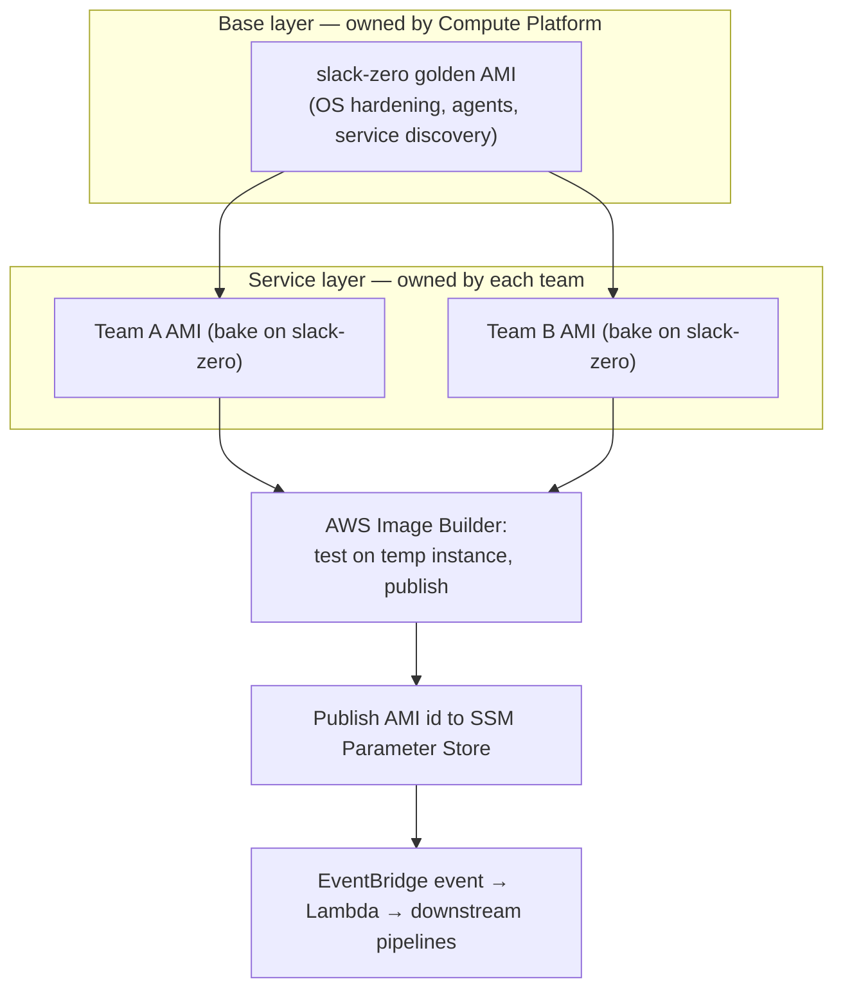
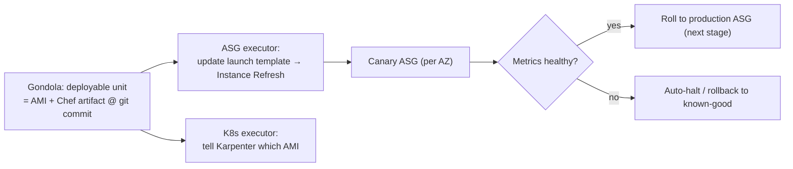

# Slack Shipyard: Making EC2 Instances Immutable, Deployable Artifacts

> Slack runs across *tens of thousands of EC2 instances*. For years those instances
> were **long-lived and continuously mutated** — a Chef agent woke up on a schedule,
> re-checked each box, and reapplied its desired configuration. That works until it
> doesn't: instances drift, deployments become scary, and no two machines are quite
> the same. **Shipyard** is Slack's next-generation EC2 platform that flips the model:
> instead of endlessly patching mutable servers, you **build a new machine image and
> replace the old instance**. This is a gorgeous, concrete lesson in a pattern every
> senior interview loves — *immutable infrastructure* — plus the messy real-world
> exceptions (secrets, break-glass access, long-lived data nodes) that make it hard.
> Everything here is drawn from Slack's engineering post
> "Shipyard: How We Built Slack's Next-Generation EC2 Platform" (July 2026).

## The problem: continuously mutating servers eventually fights you

Start with the mental model. **EC2** is Amazon's rentable virtual server. An **AMI**
(Amazon Machine Image) is a frozen snapshot — OS, packages, config — that an instance
boots from. **Chef** is a configuration-management tool: you write "recipes"
describing the desired state of a machine, and a Chef agent makes the machine match.

Slack's legacy model ran **scheduled Chef jobs**: every so often each long-lived
instance re-ran Chef, which checked its configuration and reapplied the desired state,
reverting anything unexpected. The intent was good — keep machines from drifting — but
the model has three built-in problems that only get worse at scale:

- **Continuous background load.** Every instance is constantly re-evaluating and
  re-enforcing itself, forever.
- **Risk of unintended overwrites.** A Chef run can silently revert a change someone
  made for a good reason, so behavior is hard to reason about.
- **Inevitable drift.** Because instances live for months and keep changing, no two
  are truly identical — the classic "snowflake server" problem. Deployments at the
  service level become difficult and coordinating changes across layers gets complex.

Containers helped some workloads, but Slack notes **"not everything could migrate
easily."** They still needed a huge fleet of plain EC2 instances — and they wanted
those instances to gain the things containers gave them: **immutability, progressive
rollouts, and automated safety.**

> [!KEY-TAKEAWAY]
> The interview version of this problem: "How do you stop server drift and make
> deploys safe on a fleet you can't fully containerize?" Shipyard's answer is
> **immutable infrastructure** — treat a server as a *deployable artifact* (an image
> you build, version, test, and replace) rather than a mutable pet you keep patching.
> The hard part isn't the happy path; it's handling the exceptions (secrets,
> emergencies, un-cyclable data nodes) *without* re-introducing drift.

## The core shift: from "configure the server" to "build and replace it"

The central idea of Shipyard is one sentence: **treat infrastructure as deployable
artifacts rather than endlessly mutable instances.** Concretely, that means the unit
of change is no longer "run Chef on the running box to nudge it toward desired state."
It's "**bake a new AMI, launch fresh instances from it, and terminate the old ones.**"

This is what people call **immutable infrastructure**: once an instance is running you
don't change it in place — if you need a change, you roll a new image and replace the
instance. The wins are exactly the pains from the last section, inverted: no drift
(every instance from an image is identical), safer deploys (you can roll forward and
back by swapping images), and a smaller attack surface (short-lived instances give
attackers less time to establish persistence). Slack reports instances **"become
operational in seconds rather than minutes"** under the new model.

Shipyard is built from a set of internal systems, each owning one job:

| System | Job |
|---|---|
| **slack-zero** | The shared "golden" base AMI every service builds on top of |
| **Ship Quick** / **Longshoremen** | The worker fleets that *bake* and *provision* images |
| **Gondola** | Global deployment orchestration (progressive rollouts, rollback) |
| **Peekaboo** | Real-time fleet inventory and visibility |
| **The Reaper** | Lifecycle enforcement — replaces tainted or too-old instances |

## Layered images: a shared golden base plus per-team AMIs

Rather than every team baking a machine from scratch, Slack uses **layered images**.
The Compute Platform team builds **slack-zero**, a shared *golden base image*
containing the OS baseline and hardening, networking and service discovery, monitoring
and security agents, and common tooling. Service teams then build their own AMIs *on
top of* slack-zero.

The base images are described as **"immutable but ephemeral"** — you don't patch them
in place; when the base needs a security fix, the platform team publishes a new
slack-zero, and service teams rebuild their AMIs on top to inherit it. This is a
**shared-responsibility** split: Compute/Security/Monitoring own the base layer;
service teams own incorporating updated bases into their own images.

Slack supports this across **two CPU architectures — AMD64 and ARM (Graviton)** — and
**three operating systems — Ubuntu, RHEL, and Amazon Linux**.

The build pipeline uses **AWS Image Builder** (Slack chose it over Packer) for image
lifecycle management. When a new AMI is published, its ID is written to **SSM
Parameter Store** (AWS's config/parameter service), and an **event-driven** chain —
**EventBridge** events triggering **Lambda** functions — kicks off downstream
pipelines. Image Builder also runs **built-in tests on a temporary instance** before
an image is published, so a broken base never ships.

## Bake vs. provision: split the heavy work from the fast work

A subtle but interview-worthy design choice: Shipyard splits image preparation into
**two phases** so the slow work happens once and the fast work happens per-instance.

- **Bake phase (done once, into the AMI):** install packages and apply the
  consistent, unchanging configuration. This is the heavy, slow work — and because
  it's baked into the image, every instance launched from that image starts identical.
- **Provision phase (done fast, at launch):** a lightweight step that applies the
  things that *must* be per-instance or per-environment — secrets, regional config,
  deployment metadata — then drops config and starts services.

This is *why* instances come up "in seconds rather than minutes": the expensive
package installation already happened at bake time, so boot only does the light
provision work. It's the same reasoning behind Docker layer caching or pre-baked
"golden AMIs" — do expensive, cacheable work once; keep per-instance work minimal.

### The worker fleets: Ship Quick and Longshoremen

Baking and provisioning run on dedicated **worker fleets** managed by a lightweight
process called **Longshoremen**. There are two fleets, and the reason there are two is
a neat bootstrapping puzzle:

- A **vanilla Ubuntu fleet** — used to bake and test *slack-zero itself*, because
  slack-zero **"can't build on top of itself."** You need a clean machine to build the
  golden base.
- A **slack-zero fleet** — used to build the service-team cookbooks on top of the base.

Workers **detach from their Auto Scaling Group, run Chef, stream logs, then
terminate** — an ephemeral worker per job. Both fleets scale automatically.
**Ship Quick** is the developer-facing workflow that lets an engineer bake and
provision a test image quickly.

## Deploying and scaling: replace instances, don't patch them

Because the fleet is immutable, a deployment is **a controlled replacement of
instances, not an in-place patch.** **Gondola** is the global orchestrator that drives
this. A Gondola *deployable unit* has **two parts**:

1. The **AMI** (the baked image), and
2. **"The Chef artifact containing versioned recipes associated with a Git commit"** —
   the recipes, pinned to a specific commit, packaged and fetched at runtime.

The Chef code is packaged to **S3** and pulled down by a **bootstrapper baked into the
image** at launch. Gondola's **executors** then apply the change to the underlying
compute in whatever way that compute type demands:

- For **Auto Scaling Groups (ASGs)**, executors update the **launch template** and use
  **AWS Instance Refresh** to roll instances to the new image.
- For **Kubernetes worker fleets**, they tell **Karpenter** (a K8s node
  autoscaler/provisioner) which AMI to use.

### Progressive rollouts and automated safety

Gondola supports **progressive rollouts with metric-based automated safety checks**:
deploy to a slice, watch the metrics, and **auto-halt or auto-rollback to a known-good
version** if things look bad. The post's example: the **Egress team** runs separate
**canary and production ASGs in each availability zone**, rolled out in **sequential
stages** — a canary catches a bad change before it reaches the full fleet. Slack notes
a simple pipeline is illustrative and that **"real pipelines can include hundreds of
stages."**

## The Reaper: enforcing "short-lived" so drift never creeps back

Immutability only holds if instances actually get *replaced* — otherwise a "temporary"
box lives forever and drifts. **The Reaper** enforces the lifecycle. It acts on **two
inputs**:

1. **External signals** that mark an instance as **"tainted"** (something happened to
   it — see break-glass access below), and
2. **Periodic checks** for instances that have **exceeded their allowed lifespan** (it
   uses Peekaboo to know each instance's age).

When either fires, the Reaper replaces the instance. Crucially it has safety brakes:
**rate limiting scoped by service / region / availability zone** (so it never reaps
too many at once), and a **"big red button"** — a **global pause** implemented as a
control object in **S3** that halts all reaping in an emergency.

> [!WARNING]
> A reaper that's too eager causes **unnecessary churn** — replacing instances for
> changes that don't actually matter, burning capacity and adding deploy noise. Slack
> is making the Reaper **more context-aware** so only *meaningful* changes trigger a
> replacement. The general lesson: any automated "self-healing" actuator needs rate
> limits and a kill switch, or it becomes its own outage source.

## Peekaboo: knowing what's actually running

The old world used the **Chef Server as the source of truth** for what existed. In an
immutable world where instances are constantly launching and terminating, that's too
slow and too coupled. **Peekaboo** is Slack's real-time inventory system, built on
**EventBridge + OpenSearch + Lambda**: it taps cloud events and instance metadata
directly, so it reflects reality within moments. It exposes a **UI, an API, and a
CLI**, and — importantly — it can **track non-Shipyard instances too**, so it's a
single pane of glass during the migration.

## The hard exceptions: where "fully immutable" bends (on purpose)

The elegant part of this case study is the honesty about where pure immutability
doesn't fit. Slack calls the fleet **semi-immutable**, and the exceptions are the best
interview material:

- **Secrets are the exception to immutability.** You can't bake secrets into an image
  and cycle the whole fleet every time a secret rotates. So each instance runs
  **Consul Template** to pull updated secrets from **Vault** *without* replacing the
  instance. The core system and service layers stay consistent; only the runtime
  secrets refresh in place.
- **Emergency config changes** are allowed via **AWS Systems Manager (SSM)** running a
  predefined document that executes Chef recipes on a live box — but this is **"meant
  for emergencies only,"** and afterward the instance is **cycled** (replaced) so the
  fleet returns to a known image.
- **Break-glass (manual) production access** generates a **signal that marks the
  instance for eventual replacement** — so any human who logs in effectively taints
  the box, and the Reaper cleans it up later. Short-lived **SSH certificate**
  workflows back this.

> [!INTERVIEW]
> If an interviewer says "immutable infrastructure sounds clean — what breaks in
> practice?", the senior answer names the exceptions and how you contain them:
> *"Secrets rotate faster than you can re-image, so you refresh them in place (Consul
> Template + Vault) while keeping the OS and app layers immutable. Emergencies need a
> live escape hatch (SSM-run Chef), but you **taint and cycle** the instance
> afterward so drift can't persist. And any human who logs in marks the box for
> replacement. The principle: allow the exception, but make the system
> **self-correct back to the image** — the fleet is *semi*-immutable by design."*

## What's still hard: long-lived instances

Shipyard works great for **short-lived, stateless-ish services** you can cycle freely.
The open challenge Slack calls out is **long-lived instances that can't be cycled
quickly**: **data nodes**, **singletons** like a self-hosted GitHub Enterprise, and
third-party tools like **Atlassian JIRA**. You can't just terminate a database node to
apply a base-image fix. Slack is building **new Gondola deploy executors** aimed at
these cases — the frontier where "replace the instance" needs a gentler answer.

## Trade-offs and gotchas, gathered

- **Immutable vs. semi-immutable:** full immutability is the ideal, but secrets force
  an in-place refresh path (Consul Template + Vault). You accept a narrow, well-scoped
  mutable channel rather than pretending it doesn't exist.
- **Bake vs. provision:** pushing heavy work into the bake phase makes launches fast
  and instances identical, at the cost of a longer, more centralized image build.
- **Replace vs. patch:** rolling new instances is safer and drift-free but costs more
  churn and coordination than patching — which is exactly why the Reaper needs rate
  limits and a kill switch.
- **Source of truth:** moving inventory from Chef Server to an event-driven system
  (Peekaboo) is what makes real-time visibility possible when instances are ephemeral.
- **Escape hatches must self-heal:** SSM emergency changes and break-glass logins are
  allowed *only because* they taint the instance for later replacement — otherwise
  they'd silently re-introduce the snowflake problem.
- **Long-lived state doesn't fit yet:** databases and singletons can't be cycled in
  seconds; that's the acknowledged open problem.

## Common follow-up questions

- **"What exactly is 'immutable infrastructure' and why does Slack want it?"** Once an
  instance is running you never change it in place; to change anything you build a new
  image and replace the instance. It eliminates configuration drift, makes deploys
  reversible (swap images), and shrinks the attack surface with short-lived hosts.
- **"Why split bake and provision?"** Bake does the slow, cacheable work (package
  install, common config) once into the AMI so every instance is identical; provision
  does only the light per-instance work (secrets, regional config) at launch. That's
  why instances come up in seconds rather than minutes.
- **"If instances are immutable, how do secrets get rotated?"** They're the deliberate
  exception: each instance runs Consul Template to pull fresh secrets from Vault
  in-place, so the OS and app layers stay immutable but runtime secrets can refresh
  without cycling the fleet.
- **"How does a deploy actually roll out safely?"** Gondola ships a deployable unit
  (AMI + versioned Chef artifact tied to a git commit) and drives progressive rollouts
  — canary ASGs per AZ, metric-based checks, auto-halt or auto-rollback to a known-good
  version if metrics regress.
- **"Why layer images instead of one big AMI per service?"** A shared golden base
  (slack-zero) centralizes OS hardening, agents, and service discovery so security
  fixes land in one place; teams bake their app on top. It's a shared-responsibility
  split of platform stability plus team flexibility.
- **"What stops a 'temporary' instance from living forever and drifting?"** The Reaper:
  it replaces instances that are tainted (e.g., after a human logs in or an emergency
  SSM change) or that exceed their allowed lifespan, with rate limits and a global
  pause button so it never over-reaps.
- **"What doesn't this model handle well?"** Long-lived instances — data nodes,
  singletons like GitHub Enterprise, third-party apps like JIRA — that can't be cycled
  quickly. New Gondola executors are being built for them.

## References

- Slack Engineering — "Shipyard: How We Built Slack's Next-Generation EC2 Platform"
  (July 2026):
  https://slack.engineering/shipyard-how-we-built-slacks-next-generation-ec2-platform/
- AWS docs — EC2 Image Builder, Auto Scaling Instance Refresh, SSM Parameter Store,
  EventBridge: https://docs.aws.amazon.com/
- Karpenter (Kubernetes node autoscaling): https://karpenter.sh/
