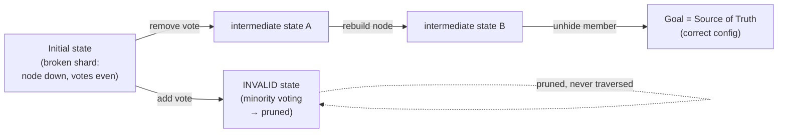

# Stripe: Auto-Remediating a Global MongoDB Fleet with Graph Search and State Machines

> Stripe runs a huge fleet of **MongoDB** clusters (a document database — data lives
> as JSON-like documents rather than rows in tables). Databases fail in a bewildering
> number of ways, and each broken cluster used to mean an on-call engineer running a
> slow, careful manual recovery. This case study is a beautiful lesson in a reframing
> trick that shows up in senior interviews all the time: *when the space of "what's
> broken and how do I fix it safely" is too large to script by hand, stop writing
> recipes and start modeling states + legal moves, then let a graph search find the
> fix.* Everything here is drawn from Stripe's engineering post,
> "How Stripe uses graph search and state machines to auto-remediate a global
> database fleet."

## The problem: too many failure modes to ever script them all

Start with the mental model. A MongoDB cluster is split into **shards** (horizontal
slices of the data so it fits across many machines). Each shard is itself a
**replica set** — several copies of the same data, one taking writes and the others
following along — so that a machine dying doesn't lose the slice. Each member node
carries attributes that decide *how* it participates: whether it has a **vote** in
leader elections, its **priority** (how eager it is to become the write leader),
whether it's **hidden** (serving no client reads), and the size of its **oplog** (the
operation log that followers replay to stay in sync).

Now multiply that by scale. The "2,000" in the post counts **shards**, not whole
clusters — a single sharded cluster contains many shards. Stripe describes a shard
as *"one of 2,000 that collectively processed $1.9 trillion in payments in 2025,"*
spanning *"over 40 distinct shard layouts."* A "layout" is a particular shape of cluster — how many
nodes, in which regions, with which roles. Shards constantly drift into degraded
states: a node dies, votes become uneven, an oplog needs resizing, a replacement node
must be rebuilt.

The killer line from the post: *"The combinatorial explosion of failure modes made it
impossible to anticipate every scenario with static, hand-coded automation."* You
cannot write a runbook for every combination of (which nodes are down) × (which votes
are wrong) × (which oplogs are stale) × (40+ layouts). The math defeats you.

> [!KEY-TAKEAWAY]
> The interview-worthy reframe: instead of asking *"what's the most important issue to
> fix right now?"* (a greedy, one-step-at-a-time question), Stripe asked *"what is a
> complete, safe **sequence** of operations that moves this shard from its broken
> reality to its correct configuration?"* That second question is literally a
> **pathfinding** problem on a graph — and pathfinding is a solved problem.

## Why the naive approach broke: a hard-coded, single-step state machine

Stripe's first system (V1) was a *"single-step, hard-coded state machine"*: a set of
**plugins**, each knowing how to fix one kind of problem, run *"in a carefully ordered
sequence based on hard-coded ranking."* Think of it as a priority list of fixers —
"first fix votes, then fix priority, then rebuild dead nodes" — baked into code.

That design broke in four concrete ways the post calls out:

- **Fragile ordering / circular dependencies.** Fixing problem A sometimes required
  problem B to be fixed first, which required A first. These *"implicit plugin
  dependencies caused circular dependencies"* that needed manual untangling.
- **Multi-failure blind spots.** With several things broken at once, the
  *"single-issue-at-a-time approach couldn't find a valid ordering"* and simply paged
  a human.
- **Layout coupling.** Because plugins hard-coded assumptions about cluster shape,
  *"onboarding a new layout required auditing every plugin"* — the post says this took
  *"about 1 week for each new layout,"* and with 40+ layouts that never ends.
- **Stranded shards.** A canceled or interrupted workflow left *"orphaned states"* —
  a shard stuck half-fixed — that a human had to clean up by hand.

Put plainly: a greedy, hand-ranked fixer can't reason about *ordering* across multiple
simultaneous faults, and every new cluster shape is another pile of code to audit.

## The reframe: model the fleet as a directed graph

Here is the core idea, and the best interview material. Stripe models a shard's world
as a **directed graph** (nodes connected by one-way arrows):

- A **node** in the graph = a possible *state* of the shard — the full snapshot of its
  per-member attributes (voting rights, priority, hidden status) plus shard-level
  properties (oplog sizes, regional distribution, quorum status). *(Careful: "node"
  here means a graph vertex, not a database machine. The post's states encode the
  machines' attributes.)*
- An **edge** = one *atomic operation* you can perform: add or remove a vote, raise or
  lower priority, hide or unhide a member, rebuild a node, resize an oplog. Each edge
  moves the shard from one state to another.

Three special kinds of state anchor the search:

- **Initial state** = the shard's current reality (possibly broken).
- **Goal state** = the *"Source of Truth (SOT)"* — the configuration the shard is
  *supposed* to have.
- **Invalid states** = any configuration that violates a **safety invariant** (a rule
  that must always hold). The post's examples: an *even* number of votes (elections
  can tie), a *minority* of healthy voting nodes (you'd lose **quorum** — the strict
  majority needed to elect a leader and accept writes), or the nonsensical
  *"priority=1 and vote=0"* (eager to lead but not allowed to vote).

Remediation is now simply: **find a path from the Initial state to the Goal state that
never passes through an Invalid state.** The philosophy shift, in Stripe's words:
*"Instead of writing runbooks for anticipated scenarios, we define invariants and
available operations"* — and *"Runbooks encode known recovery procedures; a state
machine discovers novel ones."*



## Pathfinding: from BFS to Dijkstra, and partial remediation

Stripe started with **breadth-first search (BFS)** — explore the graph level by level,
which *"guarantees minimum operations"* (the fewest steps to the goal). BFS treats
every operation as equally cheap, so "shortest path" means "fewest moves."

But BFS has a fatal flaw the post names directly: *"it fails entirely if no complete
path exists."* If the shard simply cannot reach a perfect Goal state right now, BFS
returns nothing — and you're back to paging a human.

So they evolved to **Dijkstra's algorithm** over a *weighted* graph. Dijkstra finds
the lowest-*cost* path when different edges cost different amounts (not just the
fewest edges). This unlocks two things:

1. **Realistic costs.** Some operations are far more expensive than others (see the
   next section), so "cheapest safe path" beats "fewest steps."
2. **Partial remediation.** When no complete path to the Goal exists, Dijkstra can
   return *"the path to the least misconfigured state"* — it fixes everything it
   safely can and *"leaves the ephemeral node for operator attention."* Instead of
   failing wholesale like BFS, the system makes the shard as healthy as possible and
   escalates only the residue.

## Edge weights: cost = misconfiguration × estimated time

How does Dijkstra know an edge's cost? Stripe uses a clean formula:

```
edgeWeight(state, operation) = misconfiguration(state) × estimatedTime(operation)
```

- **`estimatedTime(operation)`** is a constant reflecting how long that real operation
  takes. The post gives actual numbers: `OPTIME_NODE_UPDATE_MONGO_CONFIG = 3`,
  `OPTIME_SHARD_UPDATE_OPLOG = 19`, `OPTIME_NODE_REBUILD = 101`. So *"a node rebuild
  takes roughly 33 times longer than a config change"* (101 ÷ 3). Weighting by time
  steers the search toward paths that avoid slow rebuilds when a cheap config tweak
  would do.
- **`misconfiguration(state)`** scores how broken a state is, computed by *composable
  scoring rules* — each a small, independent check: `DownNodeMisconfigRule`,
  `VotingMisconfigRule`, `PriorityMisconfigRule`, `OplogResizeMisconfigRule`,
  `HiddenStatusMisconfigRule`, `AZMisconfigRule`. New rules compose in without
  rewriting the planner — which is exactly what the old plugin ranking couldn't do.

The elegance: adding a new failure type means adding a scoring rule and an operation
(an edge), not re-auditing an ordered plugin chain. That's why the post reports
onboarding new layouts with *"zero code changes"* — the graph is layout-independent.

## "What you simulate is what you execute": simulation + durable execution

A planner is only trustworthy if the plan it *imagines* matches what actually *runs*.
Stripe's answer is a `CommonContext` interface that the same business logic runs
against in two modes, swapped via `WithExternalDeps`:

- **Simulated mode** — an in-memory implementation. Exploring a graph edge doesn't
  actually rebuild a database node; it just updates an in-memory state. This
  *"transforms minutes of I/O-bound execution into just milliseconds of CPU-bound
  computation,"* letting the planner *"explore hundreds of state transitions per
  second."*
- **Real mode** — backed by **Temporal**, a durable-workflow engine. Temporal
  *"guarantees a workflow interrupted by a deploy, crash, or timeout can resume
  exactly where it left off."*

Because *"what you simulate is what you execute"* — both modes run the identical
business logic — the plan can't drift from reality. And durable execution kills the
old "stranded shard" problem: if a workflow is canceled or the process dies mid-repair,
the system *"can compute a fresh recovery path from whatever intermediate state was
left behind"* rather than leaving an orphaned half-fixed shard.

## Concrete numbers from the post

Stripe gives unusually specific figures — quote these directly:

- **Fleet scale:** this is *"one of 2,000 [shards] that collectively processed $1.9
  trillion in payments in 2025."*
- **Diversity:** *"over 40 distinct shard layouts."*
- **Pager reduction:** *"30% reduction in pager volume (~200 fewer pages per year)."*
- **Downtime avoided:** *"12 fewer days of shards stuck in unhealthy states annually."*
- **Old onboarding cost:** *"about 1 week for each new layout."*
- **Six-month incident baseline:** the old system *"paged operators 124 times for
  misconfigured shards, and 32 times for single-node-down scenarios."*
- **Manual recovery time:** ~15 minutes just to sequence operations, plus *"up to 3
  hours triggering and monitoring each operation."*
- **Blocked-operation cost:** *"an average of one hour per incident."*
- **Operation cost constants:** rebuild (101) vs. oplog resize (19) vs. config update
  (3) — a rebuild is *"roughly 33 times longer than a config change."*
- **Simulation throughput:** *"hundreds of state transitions per second,"* turning
  minutes of I/O into milliseconds of CPU.

## Trade-offs and gotchas

- **BFS vs. Dijkstra.** BFS guarantees the fewest operations but *fails entirely* when
  no full path exists. Dijkstra costs more to compute but supports realistic weights
  and, crucially, **partial remediation** — fix what you safely can, escalate the rest.
- **Invariants are the safety net.** Every intermediate state is validated; states
  violating an invariant (even votes, lost quorum, `priority=1/vote=0`) are pruned so
  the search never routes *through* a dangerous configuration to reach the goal.
- **Simulation fidelity is the whole ballgame.** The "same business logic in both
  modes" design exists precisely so the plan you validated is the plan that executes —
  if simulation and execution used different code, you'd have a trustworthy-looking
  plan that misbehaves in production.
- **Human-in-the-loop only for the residue.** The post does *not* describe a formal
  dry-run mode or a blanket human-approval gate before execution; the escalation point
  is partial remediation — Dijkstra *"leaves the ephemeral node for operator
  attention"* when it can't reach a fully-healthy state.
- **Cost constants are estimates, not measurements.** `estimatedTime` values are fixed
  constants; if real operation times drift far from them, the "cheapest path" the
  planner picks may no longer be genuinely cheapest.

## Common follow-up questions

- **"Why is this a graph problem and not just a smarter priority list?"** A priority
  list is greedy: it picks the single most important fix, ignoring that fix A may
  require fix B first. Ordering across multiple simultaneous faults is exactly what
  graph pathfinding solves — it finds a *whole valid sequence*, and prunes any route
  that would pass through an unsafe state. The old ranked-plugin approach kept hitting
  circular dependencies precisely because it had no notion of a path.
- **"Why switch from BFS to Dijkstra?"** BFS minimizes step count but returns nothing
  when no complete path exists, and it treats a 101-cost rebuild the same as a 3-cost
  config change. Dijkstra weights edges by `misconfiguration × estimatedTime` so it
  prefers genuinely cheaper repairs, and it can return the path to the *least
  misconfigured reachable* state (partial remediation) instead of giving up.
- **"How does this survive a crash mid-repair?"** Real execution runs on Temporal,
  which resumes an interrupted workflow where it left off. And because the planner can
  recompute a path from *any* current state, a shard left in an intermediate state
  just gets a fresh plan from there — no orphaned "stranded shards."
- **"Why does onboarding a new layout need zero code changes now?"** Remediation
  depends only on states, operations, invariants, and scoring rules — none of which
  hard-code a cluster's shape. The old plugins baked in layout assumptions, so each new
  layout meant auditing them all (~1 week each).
- **"What's the risk in the cost model?"** The `estimatedTime` constants are fixed
  guesses. If, say, rebuilds get much faster or oplog resizes much slower in reality,
  Dijkstra's "cheapest path" may stop matching true cost until the constants are
  retuned. It's a pragmatic approximation, not a live measurement.
- **"Where else does this pattern apply?"** Any domain where you must reach a goal
  configuration through safe intermediate steps: Kubernetes reconciliation loops,
  infrastructure-as-code planners, robot motion planning, even build-dependency
  resolution. The shared shape is "states + legal transitions + invariants + search."

## References

- Stripe Engineering — "How Stripe uses graph search and state machines to
  auto-remediate a global database fleet":
  https://stripe.dev/blog/how-stripe-uses-graph-search-and-state-machines-to-auto-remediate-a-global-database-fleet
- Temporal (durable workflow execution referenced in the post): https://temporal.io/
