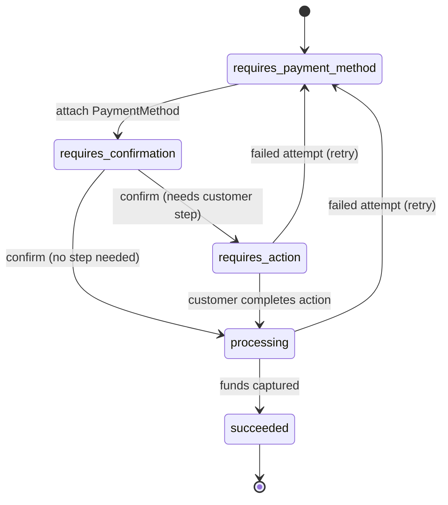

# Stripe: Designing a Payments API That Survives 10 Years of Change

> Stripe's whole pitch was that accepting money online should be as easy as pasting
> "seven lines of code." That's a *product* promise, but under it sits one of the
> hardest **API design** problems there is: how do you hide the wild, inconsistent,
> decades-old mess of global payments behind one stable, pleasant interface — and
> keep it stable while the world of payments keeps shifting under you? This case
> study walks through how Stripe's payments API evolved from 2011 to 2018+, why its
> first, "obvious" abstraction broke as it went global, and the **PaymentIntents /
> PaymentMethods** redesign that fixed it. Everything here is drawn from Stripe's
> engineering post "Payments APIs: The First 10 Years." Every claim here is drawn
> from that post.

## The problem: payments are not one thing, but the API pretended they were

Start with the intuition. When you think "take a card payment," you picture one
instant action: swipe, approved, done. Cards *are* like that — the charge finalizes
immediately and the customer doesn't have to do anything else. But cards are the
exception, not the rule, once you go global.

A **payment method** is just a way a customer pays — a card, a bank debit, a
wallet, a "pay by bank" redirect. They differ along two axes that turn out to
matter enormously:

- **Does it finalize immediately?** A card authorizes in a second. **ACH** (the
  US bank-transfer network, "Automated Clearing House," a system dating to the
  **1970s**) settles *days* later. A Bitcoin payment finalized after **6 blocks —
  about an hour**.
- **Does the customer have to do something mid-payment?** Many European methods
  (like iDEAL) redirect the customer to their bank to authorize. The payment can't
  complete until *they* come back.

Stripe's first API was designed for the one method that is "no" on both axes:
cards. That was a fine starting point, but as the author puts it, those first APIs
were foundational *"because they were the first APIs we had, not because they were
the right abstraction for global payments."*

> [!KEY-TAKEAWAY]
> The core lesson: your first abstraction is almost always shaped by your first
> use case, not by the real problem space. Cards finalize instantly and need no
> customer action — so Stripe's original Charges API assumed *every* payment works
> that way. Going global meant every method that broke those two assumptions had to
> be bolted on awkwardly, until the abstraction itself had to be redesigned.

## The original design: Charges + Tokens (2011–2015)

The first Stripe API had two ideas. A **Token** captured raw card details on the
client (so raw card numbers never touched your server), and a **Charge** used that
token to move money server-side. One synchronous call, one immediate result. This
is what made the "seven lines of code" demo possible.

Concrete history from the post: the 2011 landing-page snippet was **nine lines**,
or **seven** if you dropped the two optional fields (`description` and
`card[cvc]`). It was genuinely that small.

The trouble is what happened to that clean object over time. As Stripe added
features, the `Charge` resource grew from **11 properties to 36** between 2011 and
2018, and the parameters you could pass when *creating* one grew from **5 to 14**.
The abstraction wasn't wrong for cards — it was just quietly accumulating the
weight of everything that *wasn't* a card.

## Why the naive approach broke: bolting new payment types onto a card-shaped API

When Stripe added **ACH and Bitcoin (2015)**, cards' two assumptions both failed,
and the workarounds show the strain:

- ACH and Bitcoin don't finalize instantly, so Stripe had to bolt a **`pending`
  state** onto Charges.
- Bitcoin didn't fit the token/charge shape at all, so it got a Stripe-specific
  **`BitcoinReceiver`** resource — which meant developers now juggled **two state
  machines**, one on the client and one on the server.

The **Sources API (2015–2017)** was Stripe's attempt to unify all payment methods
behind a single `Source` object. It reduced resource sprawl but exposed a brutal
edge case. With a redirect-based method like iDEAL, the flow was: create a Source,
*then* create a Charge from it. If the customer's browser lost connectivity **after
the Source was created but before the Charge was created**, the money that had
already moved got **refunded** — the author calls this *"a conversion nightmare."*
Developers also still had to run *two* integrations in parallel: a synchronous path
and a separate **webhook** path (a webhook is an HTTP callback the payment provider
sends your server when something finishes asynchronously).

The author's analogy is the one to remember: extending a card API to cover all
global payments was like *"trying to build a spaceship by adding parts to a car."*
At some point you stop bolting on parts and redesign the vehicle.

## The redesign: PaymentIntents + PaymentMethods (2018)

The 2018 redesign split the problem into two clean objects along the "how vs. what"
line:

- **PaymentMethod** — the *how*. Static payment credentials (e.g. the card data).
  It carries **no transaction-specific state**; it's just "here's an instrument."
- **PaymentIntent** — the *what*. A **single stateful object** representing one
  attempt to collect a specific amount in a specific currency, tracking the payment
  through its whole life.

The genius is in the PaymentIntent's **state machine**. Instead of forcing every
method into the card's instant-success shape, the states model what *any* method
might need:

`requires_payment_method` → `requires_confirmation` → `requires_action` →
`processing` → `succeeded`.

Two design choices in that machine are worth calling out:

1. **`requires_action`** is a first-class state — it directly models "the customer
   must go do something" (a bank redirect, an authentication step). The card API
   had no place to put this; PaymentIntents makes it normal.
2. **There is no `failed` state.** A failed attempt sends the object *back* to
   `requires_payment_method` so the customer can simply try another card or method.
   Failure is a loop, not a dead end.

### The data flow, and why the webhook moved out of the critical path

The flow: create the PaymentIntent **server-side** → pass its client secret to the
browser → collect a PaymentMethod and **confirm** the intent → handle
`requires_action` if the state demands it → listen for the
`payment_intent.succeeded` event.

The subtle, important win: the **one webhook** developers must handle
(`payment_intent.succeeded`) *"isn't in the critical path to collecting money."*
Contrast that with the Sources world, where a dropped connection between two calls
lost the sale. Here the money-collection path is self-contained; the webhook is
just the reliable confirmation that arrives afterward.

## Keeping old integrations working: layering new over legacy

Here's the constraint that makes payments-API design uniquely hard: you have many
live integrations you can never ask everyone to rewrite at once. So the redesign had
to change the API's *shape* while old code kept working unchanged.

The redesign leaned on this hard during migration. Rather than force a hard cutover,
Stripe **layered PaymentIntents over the legacy APIs**: it kept creating a `Charge`
object for each attempt so existing **analytics and reporting** integrations kept
working untouched. To keep that `Charge` clean while representing many method types,
it introduced **`payment_method_details`**, described as *"a polymorphic, typed
hash"* — one field whose shape depends on the method, instead of dozens of
method-specific columns bloating the resource.

## The migration: two years, and one very costly early mistake

Stripe reports the PaymentIntents rollout *"took almost two years"* (2018–2020) —
a striking number for what is "just" an API redesign, and a reminder that the API is
the easy part; migrating an ecosystem is the hard part.

The redesign itself came out of a focused **three-month design sprint** by a team of
**five** (four engineers plus a PM) in a conference room named **Lynx**.

The most instructive failure was in *how they first tried to migrate developers*.
Their initial idea was to show **two different integration guides based on the
developer's location**. This was *"tremendously confusing,"* especially for EU
developers who followed the card-oriented guide (the wrong path for them) and then
had to start over. The fix that preserved the "seven lines" promise without
splitting the docs was a convenience parameter, **`error_on_requires_action=true`**,
which lets US/Canada card-only users opt into a simple, Charges-like synchronous
flow. The two paths were named honestly: *"card payments without bank
authentication"* versus the default *"global payments integration."*

## Trade-offs and gotchas, gathered

- **PaymentIntents is objectively a harder integration for the simplest case.** For
  a US/Canada card-only merchant it flips the client/server call order and requires
  a webhook — more work than the old one-call Charge. Stripe accepted that cost.
- **The power-to-effort curve is the real trade-off.** Charges was low-effort for
  cards but *"tedious and unpredictable"* for each new method. PaymentIntents costs
  more upfront, but every *additional* method after that is cheap. You pay once for
  a model that scales, instead of paying again per method forever.
- **Fewer resources ≠ simpler.** The Sources API reduced object count but got
  *harder* to use. The post's lesson: consistency, predictability, and packaging
  that *"gradually reveal[s] the power"* matter more than minimizing resource count.
- **The redesign burden lives in migration, not design.** Three months to design,
  almost two years to migrate — and the biggest self-inflicted wound was a confusing
  location-based docs split, not the API itself.
- **An API product is more than the API.** Docs, the **Stripe CLI** (which made
  testing webhooks far less daunting), Stripe Samples, and Dashboard redesigns were
  all *"instrumental"* — the interface alone doesn't make integration easy.

## Common follow-up questions

- "Why not just keep extending the Charges API?" Because cards' two assumptions
  — instant finalization and no customer action — are false for most global methods.
  Each exception forced a workaround (`pending` state, `BitcoinReceiver`, two state
  machines) until the abstraction was carrying more exceptions than rule. Redesign
  beats infinite bolting-on — "a spaceship, not a car with extra parts."
- "What exactly does an idempotency key protect against?" The timeout ambiguity:
  a request that may or may not have succeeded because the response was lost. The key
  lets the client retry safely; the server replays the first result instead of
  re-charging, guaranteeing at-most-once execution for that logical operation.
- "Why does PaymentIntents have no `failed` state?" So a failed attempt returns
  to `requires_payment_method` and the customer can retry with another method in the
  same object — failure is a retry loop, not a terminal dead end that discards the
  intent.
- "Why keep creating `Charge` objects after the redesign?" Backward
  compatibility: thousands of existing analytics/reporting integrations read
  `Charge`. Layering PaymentIntents *over* Charges (one Charge per attempt, plus a
  polymorphic `payment_method_details` hash) let the new model ship without breaking
  the old ecosystem.
- "How can Stripe change the API without breaking old integrations?" Date-based
  versioning: accounts are pinned to the version they integrated against, and Stripe
  translates between that frozen shape and the current internal model — so breaking
  changes never reach un-rewritten code.
- "What's the one design principle to take away?" *"A great API product stays
  out of the developer's way for as long as possible"* — reveal power gradually,
  keep the simple case simple, and don't let your first use case permanently define
  your abstraction.

## References

- Stripe — "Payments APIs: The First 10 Years": https://stripe.dev/blog/payment-api-design
- Stripe API reference — Idempotent requests: https://stripe.com/docs/api/idempotent_requests
- Stripe API reference — API versioning: https://stripe.com/docs/api/versioning
