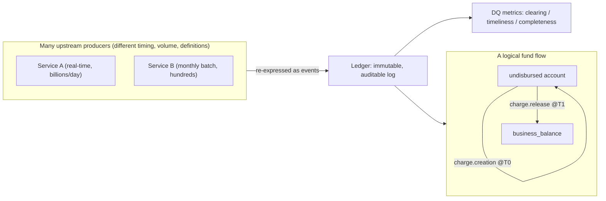

# Stripe: Ledger — Tracking and Validating Money Movement

> Stripe moves money across a worldwide web of banks and payment networks, and it
> must *prove* — to itself and to auditors — that every dollar it thinks moved
> actually moved. **Ledger** is Stripe's immutable, auditable system of record that
> turns that terrifying distributed-correctness problem into, in their words, *"a
> straightforward tabulation exercise."* This is a gorgeous senior-interview case
> study in a question that shows up everywhere money or critical state is
> involved: *how do you know your distributed data is correct — completely, on
> time, and without silent loss — across dozens of independent systems you don't
> fully control?* Everything below is drawn from Stripe's engineering post
> "Ledger: Stripe's system for tracking and validating money movement."

## The problem: proving money moved, across a messy real world

Start with the mental model. Stripe runs what it calls the **Global Payments and
Treasury Network (GPTN)** — a network spanning *"more than 135 currencies and
payment methods"* across *"185 countries,"* connected to many banks and financial
networks. Each partner has its own interfaces, data models, and quirks. Some
report in real time; some report monthly. Some emit billions of events a day;
others emit only hundreds. None of them agree on a single definition of "correct."

Stripe's obligation is blunt: it must demonstrate, internally and to auditors,
that *expected* money movement *actually occurred*. And it has to do that in a
world that is genuinely messy — the post lists malformed reports, partner errors
that propagate downstream, and even macroeconomic shocks like currencies
disappearing or banks collapsing. The realistic goal is not "zero imperfection"
(impossible) but keeping imperfections *"manageable and bounded."*

> [!KEY-TAKEAWAY]
> The interview version of this problem: "You have many independent upstream
> systems producing critical financial data with no shared notion of correctness.
> Build one trustworthy record that can *mathematically* tell you whether the data
> is complete, correct, and timely — and point at exactly where it broke." Stripe's
> answer is an **immutable double-entry ledger** plus three **data-quality (DQ)
> metrics** (clearing, timeliness, completeness).

## Why the naive approach broke: many systems, no shared truth

To make a huge problem tractable, Stripe (like everyone) segments its platform
into discrete services, databases, and APIs. That decomposition is good for
building software but fatal for *proving correctness*, because — in the post's
words — *"there is no intrinsic mechanism forcing these systems to represent or
deliver data in the same way."*

Concretely, the producers diverge on every axis:

- **Timing:** some are real-time, some batch monthly.
- **Volume:** some generate billions of events per day, others only hundreds.
- **Correctness:** each has its own, inconsistent definition of what "right" means.

So you cannot validate money movement by asking each system "are you OK?" — they
answer in different languages. What was missing was a single **unifying validation
mechanism**: one place where every system's money movement is expressed the same
way, so correctness becomes checkable across all of them at once.

## The core idea: model everything as a logical fund flow

Ledger's central abstraction is to model each producer system as a **state
machine** and express its behavior as a **logical fund flow** — *"the movement of
balances (events) between accounts (states)."* Two nouns and one verb carry the
whole design:

- **Accounts** are *"buckets of money."* An account is distinguished by a **type**
  (e.g. `charge_unsubmitted`) and **properties** (e.g. an `id`, a `business`).
  Accounts are the *states* of the state machine.
- **Events** *"move money between accounts"* — e.g. `charge.creation`,
  `charge.release`. Events are the *transitions*.
- A **transaction** records one producer operation. Ledger is a **semantic data
  store**: it models the *actual work the business did*, not a derived reporting
  pipeline sitting downstream of that work.

Because everything upstream is re-expressed as fund flows through accounts,
Ledger **unifies data across separate internal systems and team boundaries** — and
lets you **trace** a single transaction through its full lifecycle, even when the
underlying pieces live in different services.

Worked example from the post: at time `T0`, a `charge.creation` event sets a
balance in an undisbursed account; later at `T1`, a `charge.release` event moves
those funds into the `business_balance` account. The events are **independent** and
are matched together via their `business` and `id` properties — *even if they
arrive out of order.* That "match by identity, order-independent" property is what
makes a distributed, eventually-consistent world tabulate cleanly.

## Immutability: correct by construction, never by mutation

Ledger is *"an immutable and auditable log."* Transactions *"cannot be deleted or
modified."* Past state is not stored as a mutable current value — it is
**reconstructed by replaying events**. If something is wrong, you do **not** run an
`UPDATE`; you **revert and reprocess** — append compensating events that undo and
redo, leaving the full history intact.

This is the audit superpower: because nothing is ever overwritten, the log *is* the
evidence. You can always answer "what did we believe at time X, and why?" by
replaying. The cost — and we'll return to it in trade-offs — is that corrections
are genuinely harder: there is no simple mutation query to patch a mistake.

## Data quality: double-entry bookkeeping as a proof of correctness

Here is the elegant heart of the system. Ledger is built on **double-entry
bookkeeping** — the centuries-old accounting rule that every movement is recorded
as balanced entries — which gives Stripe a *mathematical* proof of correctness
rather than a hopeful one.

The post's analogy: think of money as **water flowing through pipes** (the
processes) into **reservoirs** (the balance sheets). The intermediate *clearing*
pipes should, at steady state, be **empty**. If water is stuck in a clearing pipe,
that's an unresolved balance — a signal that something didn't complete. Correctness
becomes: *"is the right amount of water sitting where it should be, and are the
transit pipes empty?"*

Stripe evaluates **three DQ (data-quality) metrics** per fund flow, measured at a
point in time X:

- **Clearing — "Did the fund flow complete correctly?"** Measures the fraction of
  the Ledger that has zeroed out at steady state. A wrong `id` or `business` value
  means two events *don't match up*, so a clearing balance stays nonzero — instantly
  detectable with a simple query for nonzero clearing accounts.
- **Timeliness — "Did the data arrive on time?"** Measures the delta between when
  data entered the platform and when it arrived in Ledger, checked against a hard
  threshold.
- **Completeness — "Do we have a complete representation of the underlying data
  system?"** Cross-system checks — *every* ID in a producer's database must have a
  matching Ledger event — plus statistical anomaly detection on whether the expected
  volume of data actually showed up.

These roll up into a single unified **DQ score**. Around them Stripe built tooling:
hierarchical alerting, tactical dashboards, automatic **Presto SQL** query
generation, root-cause attribution, ownership reassignment, and a migration utility
that behaves like *"a CI pipeline for ad-hoc data repair operations"* with a
two-phase review-then-commit flow (so even the *fixes* are controlled and audited).

> [!TIP]
> Notice how the three metrics map to three distinct failure modes, and why you
> need all three: **clearing** catches data that's *wrong* (won't balance),
> **timeliness** catches data that's *late*, and **completeness** catches data
> that's *missing entirely*. A single "is it correct?" check would miss the last
> two — late and absent data can both look "correct" in what did arrive.

## Concrete numbers from the post

Stripe gives unusually rich figures — quote these directly in an interview:

- **Scale of a peak event:** Black Friday–Cyber Monday saw **300 million
  transactions** totaling **$18.6B**.
- **Reach:** more than **135 currencies and payment methods** across **185
  countries**.
- **Throughput:** Ledger processes **five billion events per day**.
- **API availability:** the Stripe API runs at **greater than 99.999%**
  availability.
- **The headline DQ guarantees:**
  - **99.99%** of dollar volume is *"fully ingested and verified within four days."*
  - **99.999%** is *"monitored, categorized, and triaged."*
  - **over 99.9999%** *"explainability of money movement."*
- **Growth:** data volume grew **10x**.
- **Targets:** a readiness target of **99.999%** and a timeliness guarantee of
  **99.999%**.
- An illustrative team-level number: a **50% score for Aging Balances** as an
  example of a DQ metric surfaced to an owning team.

The multiple "nines" tiers are worth reading carefully: near-100% of money is
*explained*, a slightly smaller share is *triaged*, and a still-smaller (but huge)
share is *fully verified within a tight four-day window*. The bar drops as the
guarantee gets stricter — a realistic, honest way to state correctness SLAs.

## Trade-offs and gotchas, gathered

- **Ledger's model can drift from upstream reality.** Stripe notes the Ledger
  *"modeling may diverge from upstream data"* — its representation is a model, not
  the source system. This is exactly what the **completeness** check guards against.
- **The long tail needs humans.** Activity beyond the 99.999% line requires
  **manual analysis** — the automation handles the bulk, not the edge.
- **A Ledger alarm usually means a real problem, not a typo.** Stripe emphasizes
  that Ledger issues *"usually reflect real upstream/system/money-movement
  issues,"* not mere transcription errors. Instrumenting Ledger indirectly
  instruments every upstream pipeline.
- **Uncleared problems compound.** Persistent, un-resolved balances *"reduce
  visibility into new problems"* and can corrupt reporting — stale noise hides
  fresh signal, so clearing has to be kept current.
- **Immutability makes fixes harder — on purpose.** No mutation queries; every
  correction is a revert-and-reprocess, gated through the two-phase repair tool.
- **Some failures aren't the owner's fault.** Third-party or infrastructure
  incidents are outside a team's control and are handled by **reassigning
  ownership** and excluding the relevant alerts, rather than pretending the owning
  team broke something.

> [!INTERVIEW]
> If asked "how would you validate correctness across many independent data
> producers?", the staff-level answer echoes Ledger: *"Don't trust each system's
> self-report — re-express every system's activity in one shared, immutable model
> (a double-entry ledger), then let math check it. Balance-to-zero proves
> correctness (clearing), a time-delta threshold proves freshness (timeliness), and
> cross-system ID matching proves nothing was lost (completeness). Make the record
> immutable so it's audit evidence, and correct by compensating entries, never by
> mutation."* That reframing — **turn a distributed-correctness problem into a
> tabulation problem** — is the whole insight.

## Common follow-up questions

- "Why double-entry bookkeeping instead of just storing balances?" Because
  double-entry gives a *mathematical* invariant: entries must balance, and clearing
  accounts must zero out at steady state. That turns "is this correct?" into a query
  ("are any clearing balances nonzero?") instead of a judgment call. A single stored
  balance can be silently wrong; an unbalanced ledger cannot hide.
- "Why make it immutable — isn't that just harder to operate?" Immutability is
  what makes it *auditable*: history can never be quietly rewritten, so the log is
  trustworthy evidence and past state is reconstructible by replay. Corrections
  become explicit compensating events (revert-and-reprocess), which is also an audit
  trail. The operational cost is real and accepted for that guarantee.
- "Clearing, timeliness, completeness — why three separate metrics?" They catch
  three different failure modes. Clearing catches *wrong* data (won't balance),
  timeliness catches *late* data, completeness catches *missing* data. Late and
  absent data can both look fine in whatever did arrive, so a single correctness
  check would miss them.
- "How does completeness actually get checked?" Two ways: a cross-system check
  that every ID in a producer's database has a matching Ledger event, plus
  statistical anomaly detection on whether the expected *volume* of data arrived at
  the expected time — so both individual gaps and bulk shortfalls are caught.
- "What happens when a fund flow doesn't clear?" The unmatched amount stays as a
  nonzero clearing balance (the "stuck water"), a simple query surfaces it, alerting
  routes it to an owner for root-cause attribution, and the fix flows through the
  two-phase repair pipeline. If the cause is a third party, ownership is reassigned
  and the alert excluded.
- "Where else does this pattern apply?" Any system needing provable
  correctness of critical distributed state: event-sourced systems generally,
  reconciliation between microservices, exactly-once accounting, and audit logs.
  The ledger-plus-invariants approach is the reusable core.

## References

- Stripe Engineering — "Ledger: Stripe's system for tracking and validating money
  movement":
  https://stripe.dev/blog/ledger-stripe-system-for-tracking-and-validating-money-movement
- Background concept — double-entry bookkeeping (the invariant Ledger relies on):
  https://en.wikipedia.org/wiki/Double-entry_bookkeeping
