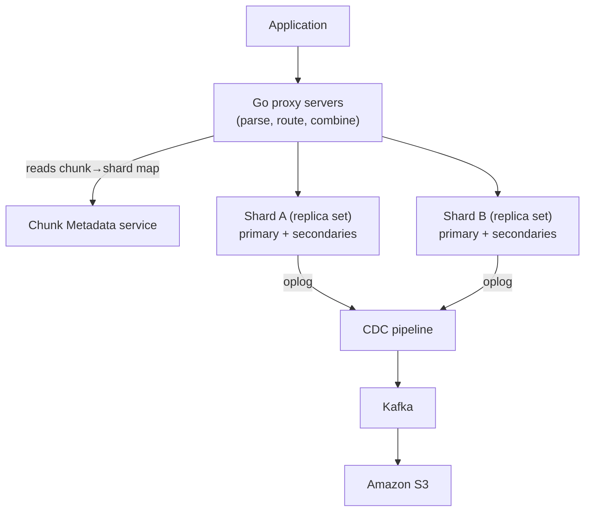

# Stripe: Zero-Downtime Data Migrations on a Custom MongoDB-Based DBaaS

> Stripe stores its data in a self-built database platform called **DocDB** — an
> extension of MongoDB Community plus a fleet of in-house services. The problem
> they set out to solve is one every payments company eventually hits: you have
> too much data for any single machine, so you split it across many servers
> (**shards**), and then you need to *move* data between those servers — to rebalance
> load, to split a hot shard, or to pack idle shards together — **without ever
> taking the database offline** and without the application code even noticing.
> This is a superb senior-interview case study: it's the classic "resharding a live
> database" problem, solved end to end. Everything here comes from Stripe's June
> 2024 engineering post *"How Stripe's document databases supported 99.999% uptime
> with zero-downtime data migrations."*

## The problem: move data between shards while the world keeps writing

Start with the mental model. A **shard** is one server (really a small cluster) that
holds a *slice* of your total data. When one shard gets too hot — too many queries,
too much data — you want to split its data across two shards. When two shards are
mostly idle, you want to merge them to save money. Either way you must physically
copy rows from one shard to another.

The naive way to do that is to stop writes, copy the data, update the routing, and
turn writes back on. For most companies that's a maintenance window. For Stripe it's
unacceptable: they process enormous, money-moving traffic where a stalled write can
mean a failed payment. Their stated bar is a **client-transparent** migration with
**zero downtime** — the application issues the same queries throughout and never
sees an error or a pause.

The financial-data context adds hard constraints the post calls out: the migration
must preserve **consistency** (no lost or duplicated writes), **availability** (the
data stays queryable the whole time), operate at fine **granularity**, and — this is
the subtle one — **not degrade the performance of the source shard** while the copy
is happening, because that shard is still serving live production traffic.

> [!KEY-TAKEAWAY]
> The interview version of this problem: *"How do you migrate a chunk of data from
> one shard to another on a live, high-throughput database with no downtime and no
> data loss?"* Stripe's answer is an orchestrated online-migration pipeline — bulk
> copy a point-in-time snapshot, catch up with asynchronous replication from a
> change stream, verify correctness, then flip routing in **under two seconds**.
> Learn that six-step shape; it is the reusable pattern.

## Why the naive approach broke: MongoDB scaled up, not out

Stripe chose **MongoDB** back in 2011 for developer productivity — a flexible
document model let product teams move fast. But as Stripe grew, they hit the ceiling
of **vertical scaling**: you can only make a single MongoDB machine's CPU, memory,
and disk so big before you run out of bigger boxes. Off-the-shelf managed options
didn't fit their needs, and **MongoDB Atlas** (MongoDB's own managed cloud service)
didn't exist yet when they started.

So the naive path — "just run a bigger database" — dead-ends. The way out is
**horizontal scaling**: spread data across many shards and add more shards as you
grow. But horizontal scaling only pays off if you can *move data between shards
cheaply and safely* as load shifts. That capability — online data movement — is
exactly what Stripe had to build, and it became the **Data Movement Platform**.

## The DocDB architecture: proxies, chunks, and shards

Before the migration pipeline makes sense, you need the platform it runs on. DocDB
is a self-managed database-as-a-service (**DBaaS** — a database you consume like a
service without managing the servers) built from a few layers:

- **Proxy servers (written in Go).** Every application query goes through a proxy.
  The proxy parses the query, figures out which shard(s) hold the data, routes the
  request, and combines results. It also enforces reliability, admission control
  (shedding load), and access control. Crucially, because the app only ever talks to
  the proxy, the proxy can change *where* data lives without the app knowing — this
  is what makes migrations "client-transparent."
- **Shards, deployed as replica sets.** Each shard is a **replica set**: one primary
  (takes writes) plus secondaries (copies that can serve reads and take over on
  failover). A **logical database** (what the app thinks it's talking to) is mapped
  onto **physical databases** that live on these shards.
- **Chunks + a Chunk Metadata service.** Data is divided into **chunks** (contiguous
  ranges of documents). The Chunk Metadata service maps *which chunk lives on which
  shard*, and the proxies read this map to route each query. Migrating data means
  moving a chunk from one shard to another and updating this map.
- **A Change Data Capture (CDC) pipeline.** Every write MongoDB makes is recorded in
  its **oplog** (operation log — an ordered log of every change, MongoDB's version of
  a write-ahead log). Stripe's CDC pipeline streams the oplog into **Kafka** and on
  to **Amazon S3**. This log is the backbone of the migration's catch-up step.

## The Data Movement Platform: six steps to move a chunk with zero downtime

The heart of the story. Moving a chunk from a **source** shard to a **target** shard
is orchestrated by a component called the **Coordinator**, which drives six phases.
The clever part is that the disruptive step is squeezed down to almost nothing.

1. **Registration.** Register the intent to migrate the chunk and build the needed
   **indexes** on the target shard up front, so the target is ready to serve.
2. **Bulk data import.** Take a **point-in-time snapshot** of the chunk on the source
   (a consistent view of the data as of time *T*) and bulk-copy it to the target.
   Reading the snapshot rather than live data keeps the source's live traffic
   unaffected.
3. **Asynchronous replication.** The snapshot is stale the moment it's taken —
   writes kept flowing during the copy. So the platform replays every change since
   *T* by reading from the **CDC/oplog stream** (not by hammering the source directly)
   until the target catches up. This replication is **bidirectional** and uses
   **tagged writes** to prevent infinite loops (a change replicated to the target
   isn't bounced back to the source). Bidirectional means Stripe can **revert traffic
   to the source** if something looks wrong after the switch. Replication supports
   **pause/resume from checkpoints**.
4. **Correctness check.** Compare **point-in-time snapshots** of source and target to
   prove they hold identical data. Using snapshots (rather than reading live) again
   avoids stealing throughput from the production shard.
5. **Traffic switch (the only critical moment).** This is where downtime would
   normally live, and Stripe collapses it. Using **versioned gating**, the Coordinator
   bumps a **version token** on the source so it starts *rejecting* requests for the
   chunk, drains the last bit of replication, then updates the chunk→shard route so
   proxies send traffic to the target. Stripe reports this switch takes **less than
   two seconds**.
6. **Deregistration.** Mark the migration complete and **drop the now-stale data**
   from the source shard.

> [!TIP]
> Notice the pattern: everything expensive (bulk copy, catch-up replication,
> verification) happens **online, in the background, off the critical path**, touching
> only snapshots and the change log so live traffic is untouched. Only the final
> route flip is synchronous — and it's engineered to be so fast (< 2 s) that it's
> shorter than a normal database failover, so from the app's view it's
> indistinguishable from routine operation.

## The 10x bulk-import trick: insert in sorted order

A concrete, teachable optimization. The bulk import step was throughput-limited at
first. Stripe tried the usual levers — bigger batches, storage-engine tuning — with
*little success*. What finally worked was **sorting the documents by their common
index attributes before inserting them**. Because the underlying index is a **B-tree**
(a balanced tree kept in sorted order), inserting keys in sorted order means each new
key lands at the "end" of the tree next to the last one — minimizing random page
splits and cache misses. Stripe reports this gave a **10x** throughput improvement on
bulk loading. It's a great example of an optimization that comes from understanding
the data structure underneath, not from turning knobs.

## Concrete numbers from the post

Stripe grounds the story in real scale — quote these in an interview:

- **99.999% uptime** ("five nines" — roughly five minutes of downtime per year) is
  the headline availability the platform supported.
- **$1 trillion** in total payments volume processed in 2023.
- **Over five million queries per second** served by DocDB.
- **10,000+ distinct query shapes** running over **petabytes** of data.
- **5,000+ collections** spread across **2,000+ database shards**.
- **Traffic switch in less than two seconds** — the only downtime-risking phase.
- **10x** bulk-import throughput gain from sorted-order insertion.
- In a 2023 **bin-packing** (consolidation) effort, Stripe migrated **1.5 petabytes**
  of data and cut the number of shards by **approximately three quarters**.

## Trade-offs and gotchas

- **Bidirectional replication is a deliberate cost.** Two-way sync is more complex
  and needs tagged writes to avoid replication loops — but it buys the ability to
  *roll back* traffic to the source if issues emerge after the switch. Stripe chose
  safety over simplicity here.
- **Read from the change log, never the live source.** Both catch-up replication and
  the correctness check are designed to touch snapshots and the CDC/oplog stream
  instead of the source's live path. This protects the source shard's production
  throughput — but it means you depend on a healthy CDC pipeline (Kafka, S3) and must
  respect oplog-size limits.
- **The critical section must beat a failover.** The whole design hinges on making
  the traffic-switch window (< 2 s) shorter than a planned failover, so it hides
  inside normal operational noise. If that window bloated, "zero downtime" would
  break.
- **Optimizations require knowing the internals.** The 10x win came only after
  batching and engine tuning failed; the real lever was B-tree insert order. Generic
  tuning wasn't enough.
- **You're maintaining a fork.** DocDB is MongoDB Community plus custom services —
  powerful and tailored, but Stripe owns the operational burden that a managed
  service like Atlas would otherwise carry.

## Common follow-up questions

- **"Why not just use MongoDB's built-in sharding / MongoDB Atlas?"** When Stripe
  started (2011), Atlas didn't exist and off-the-shelf options didn't meet their
  needs (financial-grade consistency/availability, their proxy layer, their
  migration guarantees). They'd already invested in a custom platform, so they built
  horizontal scaling into it as the Data Movement Platform.
- **"How is the migration invisible to the application?"** The app only ever talks to
  the Go **proxy layer**, which routes via the chunk→shard map. Migration updates
  that map; the app keeps issuing identical queries and never learns data moved. The
  only observable event is a sub-two-second route switch.
- **"Where does the risk of data loss hide, and how is it handled?"** In the gap
  between the snapshot and "now." Asynchronous replication from the oplog closes that
  gap; a snapshot-based correctness check proves source and target match before the
  switch; and versioned gating stops source writes for the chunk at the instant of
  cutover so nothing is written to the old location afterward.
- **"Why replicate from CDC instead of reading the source directly?"** Reading the
  source's live data for catch-up would steal throughput from production traffic and
  strain the oplog. The CDC stream already captures every change durably (into Kafka
  and S3), so replaying from it is both cheaper on the source and resumable from
  checkpoints.
- **"What is 'versioned gating' actually doing?"** It bumps a version token on the
  source so the source begins rejecting requests for the migrating chunk; that fence
  guarantees no straggler writes hit the source after cutover, giving a clean,
  consistent hand-off before the route is repointed to the target.
- **"How does this pattern generalize?"** It's the canonical online-resharding
  playbook: snapshot + change-log catch-up + verify + fast cutover appears in
  Vitess/MySQL resharding, database logical-replication migrations, and CDC-based
  system migrations everywhere. The specifics differ; the six-step shape does not.

## References

- Stripe Engineering — *"How Stripe's document databases supported 99.999% uptime
  with zero-downtime data migrations"* (June 6, 2024), by Jimmy Morzaria and Suraj
  Narkhede:
  https://stripe.dev/blog/how-stripes-document-databases-supported-99.999-uptime-with-zero-downtime-data-migrations
