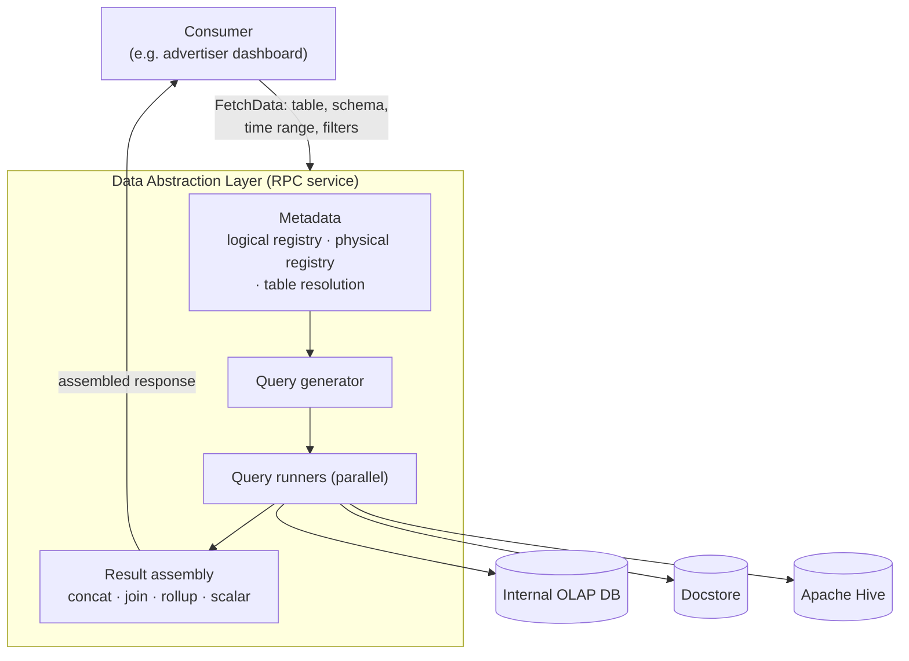

# Uber: A Data Abstraction Layer over Heterogeneous Stores

> Uber built a **Data Abstraction Layer (DAL)** — an RPC service that sits between
> the code asking for data ("consumers") and the many databases that actually store
> it ("producers"). The problem it solves is one every data-heavy company hits:
> queries get *welded* to the exact shape and location of the tables underneath, so
> every schema change or new report becomes a slow, hand-built migration. This is a
> clean, senior-interview lesson in the oldest trick in software — *add a layer of
> indirection* — applied to data access. Everything here is drawn from Uber's
> engineering post "Simplifying Data and Product Integrations with a Data
> Abstraction Layer."

## The problem: queries are welded to the tables underneath

Start with the pain, before any architecture. At Uber, the code that reads data was
tightly bound to the *physical structure* of the datasets it read. A "physical
table" here just means an actual table in a specific database — its exact columns,
its exact storage engine, its exact location.

That coupling hurts because data models never sit still. Tables get versioned
(a `v1` becomes a `v2` that renames a metric, adds a column, or drops one). When
that happens, *every consumer* has to track the change and rewrite its queries. Uber
put it plainly: existing tooling "just can't keep up with constantly evolving
product needs and data models."

The sharpest example is **advertiser reporting** — dashboards where an advertiser
slices ad spend, return-on-ad-spend, and click-through-rate across arbitrary
dimensions and time ranges. Those queries are *flexible and heterogeneous*: they hit
different tables, at different freshnesses, in different databases, depending on what
the user asks. Building each such report by hand against specific tables was, in
Uber's words, "a monumental task."

> [!KEY-TAKEAWAY]
> The DAL's core idea: let consumers say **what** data they want, not **how** to
> fetch it. Consumers query a stable *logical* interface; the DAL figures out which
> physical tables in which databases can satisfy it, generates the queries, runs
> them in parallel, and assembles the result. Producers and consumers can then
> evolve independently — the whole point of an abstraction layer.

## Why the naive approach broke: hand-building reports against physical tables

The pre-DAL approach was the obvious one: for each new report, an engineer manually
wrote queries against the specific tables that held the data. Given how flexible the
requests were and how heterogeneous the storage was (some data in a realtime store,
some in daily-batch tables, spread across multiple database technologies), this did
not scale.

The concrete cost: building a new report "used to take anywhere from several weeks to
a couple of months." Every report was bespoke, and every underlying schema change
threatened to break the reports already built. You were paying the integration tax
over and over.

The lesson worth saying out loud: **when consumers depend on the physical shape of
your data, the shape can never change cheaply.** That realization is what motivates
inserting an abstraction between them.

## The architecture: an RPC service between consumers and producers

The DAL is described as "an RPC service that sits between a data consumer... and a
data producer." (RPC = *remote procedure call*, i.e. a network API you call like a
local function.) Its job is four steps: accept a request, decide which data sources
can answer it, orchestrate the queries, and assemble the response.

It has **two main subsystems**:

- **Metadata** — the registries and logic that resolve *what* to query. This is
  table resolution, a **logical registry** (the abstract interfaces), and a
  **physical registry** (the real tables and where they live).
- **Query engine** — the machinery that *does* the querying: a **query generator**,
  **query runners**, and **result assembly**.

### Logical tables: the interface consumers see

The key abstraction is the **logical table** — "a data interface" that defines the
*shape* of data without saying where it lives. Logical tables are defined in YAML in
terms of:

- **dimensions** — the attributes you group or filter by (e.g. date, campaign), and
- **metrics** — the measured values (e.g. spend, clicks).

Crucially, each metric carries a `source` attribute listing the **candidate physical
tables** that can supply it. So one logical metric can be backed by several real
tables (a realtime one, a daily one, etc.), and the DAL picks among them at query
time.

Consumers call a **`FetchData` endpoint**, passing the logical table name, the schema
(which dimensions and metrics they want), a time range, and filters. A nice touch:
if you *omit* a dimension, the DAL automatically **rolls up** the metrics over it —
aggregation for free.

## Table resolution: choosing which physical tables can answer

Given a request against a logical table, the DAL must decide *which* candidate
physical tables actually satisfy it. This is **table resolution**, and it runs in
three phases that progressively filter the candidates:

1. **Schema eligibility** — discard any candidate that is missing *any* requested
   dimension or *any* requested metric. It literally cannot answer, so it's out.
2. **Dataset availability** — discard candidates whose freshness/retention window
   doesn't intersect the requested time interval. (A daily table that only retains
   90 days can't answer a query about last year.)
3. **Column continuity** — map the time range onto the surviving candidates, and
   **prefer the candidate closest in cardinality** to the request. Roughly: pick the
   table whose granularity best matches what was asked, to avoid over- or
   under-aggregating.

The important insight: a single request often can't be answered by one table.
Because different tables cover different time ranges and granularities, the DAL may
select *several* — which is exactly why it needs a result-assembly stage.

## Query generation, parallel execution, and result assembly

Once the physical tables are chosen, the **query generator** produces the
database-specific query for each one (the DAL knows each engine's dialect), and hands
them to **query runners**. Critically, the runners execute those queries **in
parallel** to keep latency down — a request that fans out to three tables issues
three concurrent queries rather than three sequential ones.

The DAL can even query *different databases simultaneously* — for instance, an
internal OLAP database and **Docstore** (Uber's in-house document store) at the same
time — and merge the results.

**Result assembly** then stitches the partial results into one coherent response
using four operation types:

- **Concatenation** — glue together temporally adjacent data (e.g. realtime "today"
  rows on top of daily "historical" rows).
- **Joins** — combine complementary datasets on their shared dimensions.
- **Rollups** — aggregate metrics up over dimensions the consumer didn't request.
- **Scalar transformations** — virtual/derived columns, normalizations, and
  reference joins (e.g. computing a ratio, or joining in a lookup value).

> [!WARNING]
> For result assembly to combine partial results, the candidate physical tables must
> share the same dimensions. A missing dimension on one table isn't a minor detail —
> it's what disqualifies that table back in the schema-eligibility phase.

## Storage engines and extensibility

The DAL is deliberately **general-purpose and domain-agnostic**. The storage engines
it queries include an internal OLAP database, **Docstore**, and **Apache Hive** —
"and more." New databases are integrated through a **connector interface**, so adding
a store means implementing that interface rather than touching the whole system.

Domain-specific needs are inevitable, and the DAL handles them through **decorator
"extension points"** — hooks that let a specific domain customize behavior in a
controlled way, without forking the core engine. This is what let Uber start the DAL
with ads and later expand it into non-ads domains.

> [!INTERVIEW]
> If asked "how would you let one query API serve many heterogeneous backends without
> a tangle of special cases?", the DAL is a textbook answer: (1) a **logical schema**
> that hides physical layout; (2) a **resolver** that maps a logical request to
> capable physical tables via explicit eligibility rules; (3) a **connector
> interface** so each backend is pluggable; and (4) **extension points** so
> domain-specific behavior is a controlled decorator, not a fork. Name the
> separation of *what* from *how* explicitly — that's the senior framing.

## Concrete numbers from the post

Be honest about what the post quantifies and what it doesn't:

- **Report turnaround dropped from "several weeks to a couple of months" down to
  "under two days."** This is the headline win.
- An example `FetchData` request in the post **produced three queries**, spread
  across realtime and daily tables — a concrete illustration of the fan-out.
- Illustrative dashboard figures appear (ad spend "$178,852.16", ROAS "2,363%", CTR
  "4.91%"), but these are sample UI values, not system metrics.

The post gives **no** figures for QPS, latency, storage size, node counts, or the
total number of tables or services. It also does **not** claim to use caching,
indexing, or Cassandra. If an interviewer presses for those, the honest answer is
that Uber's post doesn't publish them.

## Trade-offs and gotchas, gathered

- **Abstraction cost is real complexity, hidden.** The clean examples belie that
  real "physical table dependency graphs can be multiple layers deep" and span
  multiple database technologies. The layer makes consumers' lives simpler by
  absorbing that complexity itself.
- **Same-dimension requirement:** result assembly only works when the candidate
  physical tables expose the same dimensions — a hard constraint, not a preference.
- **Parallelism isn't free everywhere:** Uber notes that while some parts of async
  execution "extend easily," "some other parts require a bit of sophistication."
- **Domain needs will leak in:** rather than pretend one engine fits all, the DAL
  concedes this and channels it through decorator extension points — controlled
  customization instead of ad-hoc branching.
- **You trade a little query overhead for enormous integration savings:** every
  request now pays for resolution + generation + assembly, but you stop paying the
  weeks-to-months integration tax on every new report and schema change.

## Common follow-up questions

- **"Why not just give consumers a SQL view over the tables?"** A view still binds
  you to specific tables in one database and can't span *heterogeneous* engines
  (OLAP + Docstore + Hive) or pick the best-matching table per request at runtime.
  The DAL resolves across engines and assembles results the way a single view can't.
- **"How does the DAL decide which physical table to use?"** Three-phase table
  resolution: schema eligibility (must have every requested dimension and metric),
  dataset availability (freshness/retention must overlap the time range), then
  column continuity (prefer the candidate closest in cardinality to the request).
- **"Why run the queries in parallel instead of sequentially?"** A single logical
  request often fans out to several physical tables (the post shows one producing
  three queries). Sequential execution would sum their latencies; parallel execution
  is bounded by the slowest single query, which is what keeps the endpoint fast.
- **"What happens when you add a new database technology?"** You implement the
  **connector interface** for it; the metadata/query-engine core doesn't change. That
  pluggability is why the DAL could grow from ads into other domains.
- **"How are domain-specific quirks handled without polluting the core?"** Through
  **decorator extension points** — controlled hooks that customize behavior for a
  domain, keeping the engine general-purpose and domain-agnostic.
- **"What's the catch?"** Every request pays resolution, generation, and assembly
  overhead, and the hidden dependency graphs can be deep. You accept that internal
  complexity in exchange for consumers that no longer break when schemas evolve and
  reports that ship in under two days instead of months.

## References

- Uber Engineering — "Simplifying Data and Product Integrations with a Data
  Abstraction Layer": https://www.uber.com/us/en/blog/data-abstraction-layer/
