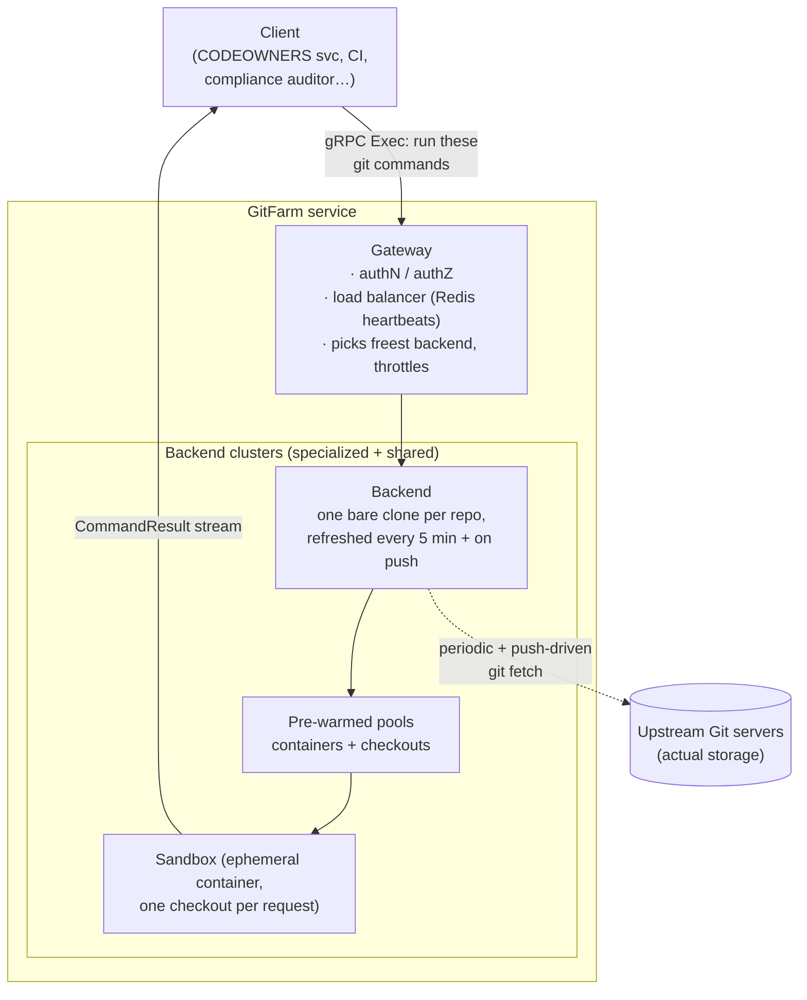

# Uber GitFarm: Git-as-a-Service for Monorepos at Scale

> Uber built **GitFarm** — a "centralized Git client in the cloud" that runs Git
> commands *for* you inside pooled, sandboxed containers and returns the results over
> a network API. The problem it solves is one every company with big repositories
> eventually hits: hundreds of automation systems each keep their own full local
> checkout, so they all pay the same brutal cost — minutes of cloning, gigabytes of
> disk, and tens of CPU cores — just to run a few read-only Git commands, and they
> collectively hammer the upstream Git servers. This is a clean, senior-interview
> lesson in *centralizing an expensive, duplicated capability behind a service* while
> preserving the exact semantics clients depend on. Everything here comes from Uber's
> engineering post "GitFarm: Git-as-a-Service."

## The problem: everyone keeps their own giant checkout

Start with the pain before any architecture. Uber stores its code in **monorepos** —
single, enormous repositories that hold huge swaths of a language's code together
(one for Go, one for Java, one for Python, one for Web, plus Android and iOS). Git
gets invoked against these repos "millions of times per day."

The trouble is that the traditional way to *use* Git is to **clone** the whole
repository to a local disk first. A clone means copying the entire history of the
repo — every commit, every file version — onto your machine. For a monorepo that is
staggeringly expensive. Uber reports that cloning the **Go monorepo takes roughly 15
minutes** and consumes "around 6 CPU cores, 32 GB of memory, and over 40 GB of disk."
A service that needs to touch *all* the major monorepos could burn **16 CPU cores, 64
GB of memory, and 96 GB of storage** — before doing any actual work.

Now multiply that by the "hundreds of automation systems" that read Git constantly:
code-ownership checks, compliance audits, CI (continuous integration) pipelines,
merge tooling. Each keeps its own checkout, each re-fetches the same objects, and all
of them together overload the upstream Git servers. That shared server load is the
real scaling wall — it is a *collective* cost that no single team can fix alone.

> [!KEY-TAKEAWAY]
> GitFarm's core idea: stop making every client own a heavyweight local checkout.
> Instead, run Git commands centrally inside a service that keeps warm, shared,
> pre-materialized checkouts and hands them out in **under 500 milliseconds** over
> gRPC. Clients get native Git behavior with almost none of the setup cost, and the
> upstream servers stop being hammered by thousands of redundant fetches.

## Why the naive fixes broke

Uber first tried the obvious optimizations, and it's worth knowing *why each fell
short* — interviewers love this.

**"Just do a lighter clone."** Git offers **shallow clones** (only recent history),
**partial clones** (fetch file contents lazily), and **single-branch clones** (one
branch only). These shrink the transfer, but they don't remove the core cost: the
server still has to enumerate objects and stream a **packfile** (Git's compressed
bundle of objects) on every request. Worse, these trimmed clones *break* common
operations — you can't compute `merge-base` (the common ancestor of two branches) or
run `bisect` (binary-search through history to find a bad commit) when history is
missing. So you save some bandwidth but lose correctness for real workflows.

**"Offload Git to CI systems (Jenkins/Buildkite)."** These build systems already have
repos synced, so why not run Git there? Because they're far too heavyweight for the
job: you provision a whole build worker and sync a repo just to run a couple of Git
commands. There's no standalone Git API, fetches are redundant across jobs,
long-lived agents accumulate stale refs, and everything is coupled to the build
lifecycle — you can't pre-warm state or do async work outside a build.

The lesson worth saying out loud: **when an expensive resource is duplicated across
hundreds of independent clients, the fix is not to make each copy cheaper — it's to
centralize the resource behind a service that amortizes the cost across everyone.**

## The architecture: a Git client in the cloud, exposed over gRPC

Here's the crucial framing that trips people up: **GitFarm is not a Git server and
does not store repositories.** It's a *client* — it runs `git` commands on behalf of
callers and relies on the real upstream Git servers for actual storage. Think of it
as a shared, always-warm workstation that already has every repo checked out, which
you drive remotely via **gRPC** (a high-performance network API framework that lets a
client call methods on a server as if they were local, and supports streaming).

There are three main pieces:

### The Gateway: authentication, load balancing, throttling

Every request enters through the **Gateway**. It authenticates and authorizes the
caller (denying unprivileged clients), and then acts as a **load balancer**. It
tracks which backends are alive and how loaded they are via **heartbeats stored in
Redis** (an in-memory data store used here as fast shared state). For a given repo it
picks the backend with the *most available checkouts*, marks that checkout occupied,
and releases it when the request finishes. If no backend has capacity, the Gateway
**rejects the request** — deliberate throttling so the system degrades gracefully
instead of collapsing. The Gateway also routes requests to the right **cluster** via
centrally managed placement policies.

### The Backend: one warm bare clone per repo

Each **Backend** node maintains "a single on-disk **bare clone** for each
repository." (A *bare clone* is a repo with all the Git history but no working
files checked out — the shared source that per-request checkouts are cut from.) It
keeps that clone fresh two ways: **push-based, event-driven updates** when code lands,
plus a periodic `git fetch` **every 5 minutes** as a safety net. Freshness is
therefore **eventually consistent** — the backend might lag reality by a few minutes.
A client that needs the absolute latest state can force it by running an explicit
`git fetch` in its session, trading a little latency for guaranteed freshness.

### Sandboxes and pooling: the trick that makes it fast

Each request runs inside a **sandbox** — an ephemeral, isolated container scoped to
the caller's identity, with exactly one checkout. Isolation matters: one caller's
commands can never see or corrupt another's.

But creating these on demand would be far too slow. Uber measured that **spinning up
a container takes 1–2 seconds** and **materializing a checkout can take up to 3
minutes**. So GitFarm keeps **fixed-size pools of pre-warmed containers and
checkouts** ready to go. Acquiring one from the pool drops the overhead to **less
than a second** — and a full Git checkout is available "in under 500 milliseconds,"
with pooled acquisition P95 (the 95th-percentile latency) peaking around **650 ms**.

> [!INTERVIEW]
> The single most important design move here is **pooling**. On-demand provisioning
> was a non-starter because materializing a monorepo checkout takes up to 3 minutes.
> Pre-warming a fixed pool converts that 3-minute cold cost into a sub-second warm
> acquisition. If asked "how do you serve an expensive-to-create resource with low
> latency?", the answer is: pre-create a pool, hand out warm instances, and refill in
> the background. Name the trade-off — you pay to keep idle capacity warm in exchange
> for predictable low latency.

### The API: sessions, Exec, and request chaining

Clients call an **`Exec`** method that opens a **session** bound to one checkout and
runs a sequence of Git commands on it. Each command returns a **`CommandResult`**
correlated by an alias field, and failures surface as **non-zero exit codes** (fatal
errors end the session). GitFarm guarantees **isolation, consistency, and
determinism** within a session.

A nice capability is **request chaining** via bidirectional gRPC streaming: a client
can pipe the output of one command into the next within a single session — for
example, feed the `git merge-base` result straight into a `git push` — with access to
stdin/stdout, without shuttling data back and forth over the network.

### Clustering: isolating noisy neighbors

Rather than one giant shared pool, GitFarm runs **multiple specialized backend
clusters** plus a **generic shared cluster**. This prevents the *noisy-neighbor*
problem, where one heavy workload starves everyone else. New use cases go through
review, sizing, and config tuning before being onboarded onto an appropriate cluster.

## Concrete numbers from the post

The post is generous with figures — quote these in an interview:

- **Full Git checkout available in under 500 ms**; pooled acquisition P95 peaking
  around **650 ms**; acquisition overhead cut to **less than a second** (versus 1–2 s
  to spin a container and **up to 3 minutes** to materialize a checkout).
- **Client-side resource utilization reduced by over 80%.**
- **Go monorepo clone: ~15 minutes**, ~6 CPU cores, 32 GB memory, 40+ GB disk; prior
  cold starts of **10–15 minutes**. Backend sync interval: **every 5 minutes**.
- **CODEOWNERS service (read-heavy):** previously 6 hosts synced every 15 minutes.
  CPU went from **over 70 cores → 16 cores (77% reduction)** (peaking at 136 cores in
  June before the switch); memory **400–600 GB → 32 GB (90%+ reduction)**; startup
  **15–20 minutes → under 1 minute.**
- **Write workflow:** end-to-end **p50 ≈ 25 seconds** — `git fetch` ≈ 5 s, `git push`
  ≈ 12 s. Uber notes the latency is dominated by native Git, not GitFarm overhead.
- **Compliance auditing:** processes **10,000–20,000 events/hour across 9,000
  repositories** (6 primary monorepos plus thousands of smaller ones). The prior
  Buildkite path ran at **p50 110–160 seconds**; GitFarm brought it to **20–30
  seconds**, an **over-80% reduction.**
- In **production since early 2025**.

## Trade-offs and gotchas

- **No global freshness guarantee.** Backends are eventually consistent (refreshed
  every 5 min + on push). A client needing the very latest must pay for an explicit
  `git fetch` — latency traded for freshness. This is fine for most read workloads and
  a conscious choice, not an oversight.
- **Pooling is mandatory, not optional.** Because materialization takes up to 3
  minutes, on-demand provisioning is "impractical." The cost is keeping warm idle
  capacity around and sizing pools correctly per cluster.
- **Session timeout capped at 30 minutes** to stop any one caller from hogging
  resources; extending this is future work. Long-running interactive sessions don't
  fit cleanly today.
- **GitFarm is not an SCM (source-control manager).** It stores nothing; it depends
  entirely on upstream Git servers. If those are down, GitFarm can't invent state.
- **Write latency is inherent, not GitFarm's fault.** The ~25 s write p50 is Git doing
  real work (fetch + push); Uber confirmed near-identical latency versus calling the
  server directly. GitFarm removes the *checkout-management* burden, not the cost of
  the Git operations themselves.

> [!WARNING]
> Don't confuse GitFarm with a Git server. It's a *client-as-a-service*: it runs Git
> commands and holds warm checkouts, but the authoritative repository still lives on
> the upstream Git servers. Every freshness and durability property ultimately traces
> back to those upstreams.

## Common follow-up questions

- "Why not just give each client a shallow or partial clone instead of building a
  service?" Shallow/partial/single-branch clones cut transfer size but the server
  still enumerates objects and streams a packfile per request, and they break
  operations like `merge-base` and `bisect` that need full history. They optimize the
  copy; GitFarm eliminates the per-client copy entirely.
- "How does GitFarm get a checkout ready in under half a second when materializing
  one takes up to 3 minutes?" Pooling. It pre-warms fixed-size pools of containers
  and checkouts, so a request grabs a ready one in under a second instead of building
  it on demand. The 3-minute cost is paid ahead of time, in the background.
- "Is GitFarm a Git server?" No — it's a centralized Git *client*. It stores no
  repositories and relies on upstream Git servers for actual storage; it just runs
  commands against warm local clones on the caller's behalf.
- "How fresh is the data GitFarm serves?" Eventually consistent: each backend
  refreshes its bare clone on push events and via a `git fetch` every 5 minutes.
  Clients needing the latest state run an explicit `git fetch` in-session, paying
  extra latency for guaranteed freshness.
- "How does the Gateway decide where to send a request, and what happens under
  overload?" It tracks backend health/load via heartbeats in Redis, routes to the
  right cluster by placement policy, and picks the backend with the most available
  checkouts for that repo. If none have capacity, it rejects the request — throttling
  so the system degrades gracefully rather than falling over.
- "Why multiple clusters instead of one big pool?" To avoid the noisy-neighbor
  problem — a heavy workload on a specialized cluster can't starve unrelated
  workloads. There's a generic shared cluster plus specialized ones, with onboarding
  review and sizing per use case.
- "What's the headline win?" For the read-heavy CODEOWNERS service: CPU dropped
  77% (70+ cores to 16), memory dropped 90%+ (400–600 GB to 32 GB), and startup fell
  from 15–20 minutes to under a minute — while checkouts became available in under
  500 ms and client-side resource use fell over 80% overall.

## References

- Uber Engineering — "GitFarm: Git-as-a-Service":
  https://www.uber.com/us/en/blog/gitfarm-as-a-service/
