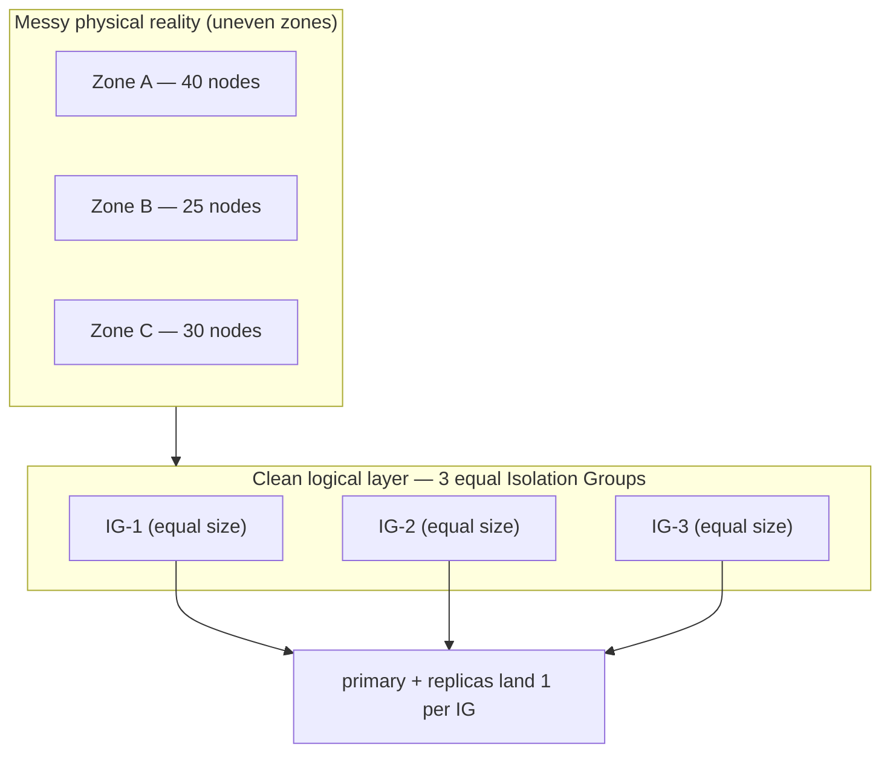

# Uber: Zone-Failure-Resilient Search (OpenSearch)

> Uber runs OpenSearch (an open-source search-and-analytics engine, forked from
> Elasticsearch) for logs, analytics, and lookups. The hard requirement: a whole
> **availability zone** can vanish — a data-center room loses power — and search
> and ingestion must keep working. This is a beautiful, concrete lesson in a
> pattern that shows up in every senior interview: *how do you place replicas so
> that losing a failure domain never takes you down, without drowning in a
> rebalancing storm?* Everything here is drawn from Uber's engineering post
> "Zone-Failure-Resilient OpenSearch at Uber" (June 2026).

## The problem: survive losing a whole zone (and then one more node)

Start with the mental model. A **shard** is one slice of your search index; a big
index is split into many shards so it fits across many machines. Each shard is
copied a few times — one **primary** plus one or more **replicas** — so that if a
machine dies, a copy elsewhere still has the data. An **availability zone** is an
isolated chunk of a data center (its own power and network), and cloud regions are
built from several zones so that one zone failing doesn't take the others with it.

Uber's bar was blunt: a cluster must *"withstand the complete loss of a zone
without impacting core functions such as querying and data ingestion."* And they
set an even harder target they call **"zone + 1"**: a zone dies, and then — before
anything recovers — a single node in a *different* zone also dies. If your design
only just barely survives one zone loss, that follow-on node failure is what
actually takes you down at 3 a.m.

> [!KEY-TAKEAWAY]
> The interview version of this problem: "Place N copies of data across failure
> domains so any one domain can disappear and you still have a full, queryable
> copy — and so recovery is calm, not a stampede." Uber's answer combines three
> ideas: **isolation groups**, **shard allocation awareness**, and **forced**
> awareness. We'll build them up one at a time.

## Why the naive approach broke: mapping shards straight onto physical zones

The obvious first attempt: tell OpenSearch "here are the physical zones; spread
each shard's copies across them." OpenSearch even has a built-in feature for this.
It failed in practice for one stubborn reason — **physical zones have uneven node
counts**. One zone might have 40 machines, another 25, another 30. Real data
centers are lumpy, and Uber notes there are *typically more than 3* physical zones.

When the failure domains are uneven, the placement logic *"would fail to find
valid placements for every shard."* Concretely, the symptoms were:

- **Yellow clusters** — "yellow" in OpenSearch means some replica shards are
  *unassigned* (the primary is up, so you can still serve reads/writes, but you've
  lost redundancy). The balancer couldn't place every copy, so shards sat homeless.
- **Disk skew and hot nodes** — copies piled unevenly onto whatever nodes fit,
  so some machines filled their disks and took more traffic than others.
- Trying to *directly* balance evenly across "more than 3, unequal" zones was too
  complex to be reliable.

The lesson worth stating out loud: **your resilience logic should not depend on the
messy shape of your physical hardware.** That realization drives the whole design.

## Idea 1 — Isolation Groups: a clean logical layer over messy hardware

The fix is a classic move: add a layer of indirection. Instead of placing shards on
*physical zones*, Uber places them on **Isolation Groups (IGs)** — a logical
abstraction over the physical failure domains, built on Uber's in-house
orchestration platform (Odin). Think of an IG as a virtual zone that you define, so
you get to make them well-behaved even when the hardware isn't.

The three properties that make IGs work:

- **Failure-domain awareness** — each IG maps cleanly onto real zones/racks, so
  "different IG" still means "won't fail together."
- **Role-level balancing** — the two node roles (data nodes that hold shards, and
  cluster-manager nodes that coordinate) are each balanced *per role* across the
  IGs. You don't want all your managers in one IG.
- **Stable membership** — when a node dies and is replaced, its replacement is
  *guaranteed the same IG*. This is the subtle, crucial one: shard placement is
  computed against IG identity, so if replacements jumped IGs, every failure would
  silently reshuffle your carefully-balanced layout.

The payoff, in Uber's words: because every IG *"is guaranteed to have the same
number of nodes,"* you get *"100% shard assignment and green cluster health"* — and
the disk skew and hot nodes disappear, because placement is now even by
construction.

**Uber uses 3 isolation groups** for most technologies, including OpenSearch. Three
is the natural choice: it's the minimum that lets you keep a *majority* alive when
one group is lost (2 of 3 survive), and it caps the blast radius — a single zone
failure *"can remove at most ~33% of capacity."*

### How a node learns its Isolation Group (the wiring)

A small but interview-relevant detail — *how* does OpenSearch know which IG a node
is in? Two steps:

1. You define a **custom node attribute** in the node's `opensearch.yml` config
   (e.g. `node.attr.isolation_group: IG-2`).
2. You **enable "awareness"** on that attribute at the cluster level, which tells
   OpenSearch to treat it as a failure domain when placing shards.

Uber automates step 1 at container startup: an **Odin Worker sidecar** (a helper
process that runs alongside the main container) fetches the node's IG from Odin and
generates the `opensearch.yml` — injecting the IG attribute — *before* the
OpenSearch container starts. So the node comes up already knowing its group, with no
manual config.

## Idea 2 — Shard Allocation Awareness: spread the copies across groups

Isolation Groups give you *equal, stable* logical zones. **Shard allocation
awareness** is the native OpenSearch feature that then says: "when you place the
copies of a shard, spread them across different values of this attribute." With
awareness on the `isolation_group` attribute, OpenSearch places a shard's primary
and replicas into *different* IGs — so any one IG can be lost and every shard still
has a surviving copy.

Worked example — how many copies, and where do they land? Uber keeps **at least 3
copies** of every shard on their important clusters: 1 primary + a minimum of 2
replicas, spread across the 3 IGs. So losing one IG leaves 2 copies — still readable,
still writable.

What if a shard has *5* copies but only 3 IGs? You can't put 5 things in 3 buckets
evenly, so awareness lands them **2, 2, 1** — and critically, *the count in any two
IGs never differs by more than 1.* That "never off by more than one" rule is what
keeps the load even and prevents one IG from becoming a hot spot.

> [!TIP]
> Shard allocation awareness has a prerequisite that trips people up: it *"assumes
> a reasonably balanced pool of nodes."* If the groups are lopsided, awareness
> can't place copies evenly and you're back to unassigned shards. This is exactly
> the precondition that Isolation Groups exist to guarantee — the two features are
> a matched pair, not independent options.

## Idea 3 — Forced awareness: choose calm recovery over a rebalancing storm

Here's the deepest idea, and the best interview material. When a zone dies, the
*default* instinct of a distributed system is to immediately re-replicate all the
lost copies onto the surviving machines — "self-heal fast." That sounds good and is
often a trap.

**Forced shard allocation awareness** pre-configures the cluster with the *full*
expected set of attribute values — all 3 IGs — even before all of them are present.
The effect: when an IG is lost, OpenSearch *"refuses to over-allocate shards onto
the remaining groups."* The copies that lived in the dead IG simply stay
**unassigned** (the cluster goes yellow) instead of being frantically rebuilt on the
two survivors.

Why is *not* healing the smart move? Because an aggressive rebalance right after
losing a third of your capacity means the two surviving IGs suddenly absorb a flood
of shard-copy traffic — consuming *"disk I/O, CPU, and network bandwidth"* — on top
of now serving all the live queries with fewer machines. That's precisely the
recipe for **cascading failure**: the recovery effort overloads the survivors and
knocks *them* over too. Uber states the trade-off cleanly: you *"trade immediate
full replication for cluster stability."*

The missing copies get restored when the zone comes back, or when an operator
deliberately updates the awareness config to redistribute — a human decision, made
calmly, not a reflex during the incident.

> [!INTERVIEW]
> If an interviewer asks "a zone just failed — should the system immediately
> re-replicate the lost shards?", the senior answer is: *"Not automatically. You
> just lost ~33% of capacity; an aggressive rebalance floods the survivors with
> I/O and can cascade. Prefer forced awareness — leave those copies unassigned
> (accept 'yellow'), keep serving on the survivors, and restore replication when
> capacity returns or an operator opts in. Stability beats heroics."* That framing
> — **controlled, deterministic recovery over aggressive self-healing** — is what
> separates a staff-level answer from a textbook one.

## The quorum trap: why 5 cluster-managers, not 3

There's a second failure domain hiding in the cluster: the **cluster-manager**
nodes (the coordinators that elect a leader and track cluster state). Leader
election needs a **quorum** — a strict majority — to make decisions. Lose the
quorum and the cluster goes **red**: it stops accepting changes entirely.

Do the "zone + 1" math with the naive **3 managers**, one per IG:

- Zone fails → you lose 1 manager → 2 of 3 remain → 2 is still a majority of 3, so
  you're okay *so far*.
- But now the "+1": one more manager fails → 1 of 3 remains → **1 is not a majority
  → red state, standstill.**

So 3 managers do *not* survive "zone + 1." Uber's fix: run **5 cluster-manager
nodes** and enable `cluster.auto_shrink_voting_configuration: true`, which lets the
cluster shrink its voting set as members leave. Re-run the math:

- Zone fails → lose up to 2 managers → **3 of 5 remain** → 3 is a majority, fine.
- Voting config auto-shrinks so quorum is now judged against 3 (needs 2).
- The "+1" node fails → **2 of 3 remain → still a majority → cluster stays alive.**

That's why the copy count (3+ shard copies) and the manager count (5) are different
numbers: shard survival needs "a copy in a surviving IG," but *quorum* survival
against a compound failure needs the extra managers plus dynamic voting.

## Trade-offs and gotchas, gathered

- **Forced awareness trade-off (the big one):** immediate full replication is
  sacrificed for stability. Missing-IG shards stay unassigned until the zone
  recovers or an admin acts. You accept degraded redundancy ("yellow") *on purpose*
  to protect availability.
- **Balance is a precondition, not a nicety:** awareness only works on a balanced
  node pool — the whole reason IGs are built to be equal-sized.
- **Quorum is a separate failure domain:** getting shard placement right doesn't
  save you if you under-provision managers; 3 managers die to "zone + 1", 5 don't.
- **Stable IG membership matters:** if replacement nodes didn't rejoin the same IG,
  every routine node replacement would silently churn shard placement.
- **Default rebalancing is dangerous at scale:** unchecked redistribution burns
  I/O, CPU, and network on the survivors and risks cascading failure — the thing
  forced awareness is designed to prevent.

## Common follow-up questions

- "Why isolation groups instead of just using the physical zones?" Because
  physical zones are unequal and there are usually more than three; awareness needs
  a balanced, fixed set of failure domains. IGs are an equal-sized logical layer
  that gives placement something clean to reason about, independent of hardware.
- "Why is 'yellow' acceptable during a zone outage?" Yellow means primaries are
  up and the cluster is fully readable and writable — you've only lost *redundancy*,
  not *service*. Trading temporary redundancy for stability is the deliberate
  choice; forcing re-replication instead risks trading it for an *outage*.
- "Why 3 isolation groups specifically?" Three is the minimum that keeps a
  majority alive when one is lost (2 of 3) and caps a single-zone blast radius at
  ~33% of capacity. Fewer can't form a majority; more adds coordination cost for
  little resilience gain at this tier.
- "How does forced awareness differ from plain awareness?" Plain awareness
  spreads copies across whatever attribute values are *present*. Forced awareness
  pre-declares *all expected* values, so when some go missing it refuses to
  over-pack the survivors — the copies stay unassigned instead.
- "Where else does this pattern apply?" Any replicated store choosing replica
  placement across failure domains — Kafka rack-awareness, Cassandra's
  `NetworkTopologyStrategy`, Kubernetes pod topology-spread constraints. Same
  problem, same "spread across domains + don't stampede on failure" answer.

## References

- Uber Engineering — "Zone-Failure-Resilient OpenSearch at Uber" (June 2026):
  https://www.uber.com/us/en/blog/zone-failure-resilient/
- OpenSearch docs — shard allocation awareness (forced awareness, custom node
  attributes): https://opensearch.org/docs/latest/
