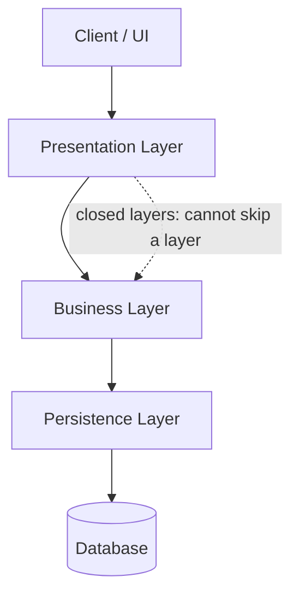
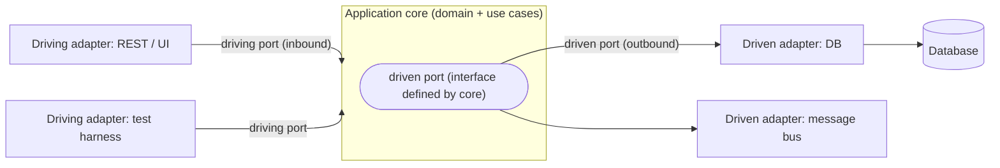
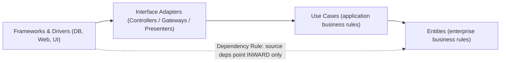
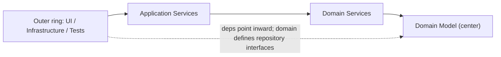
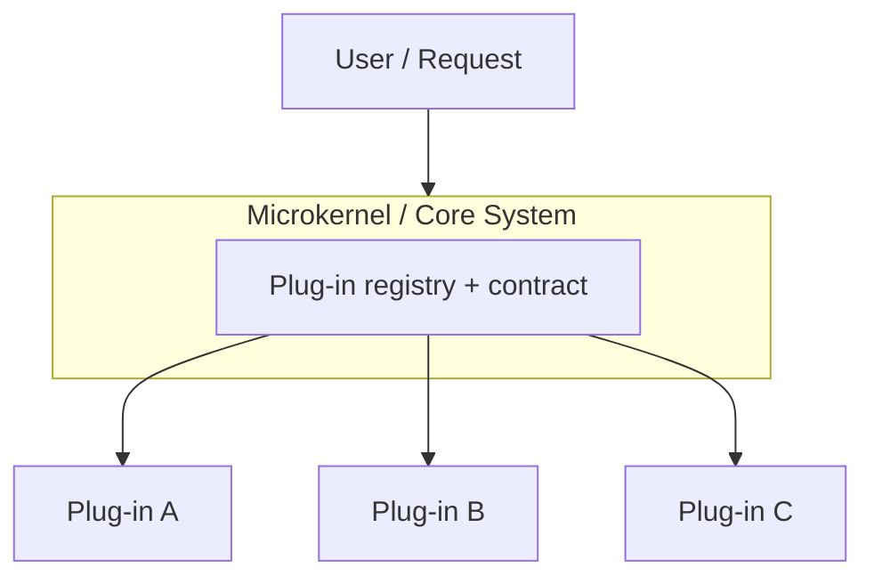
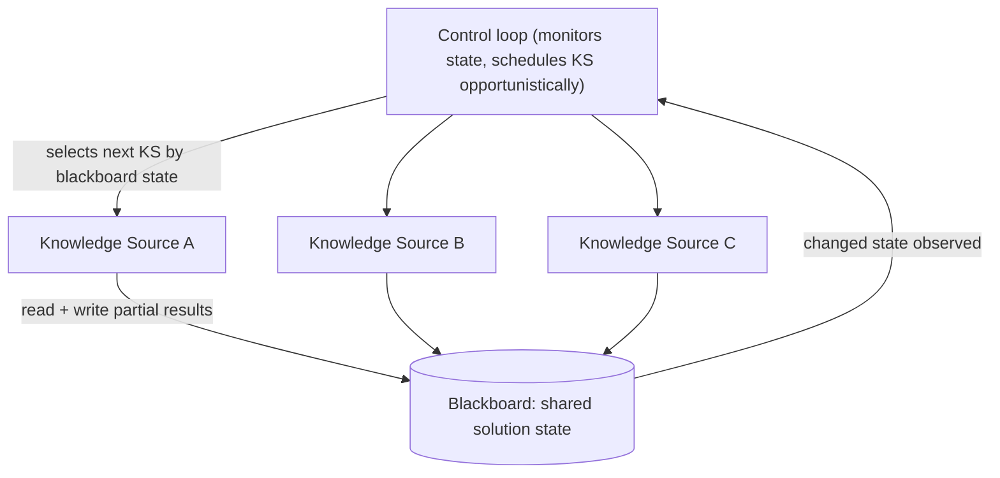
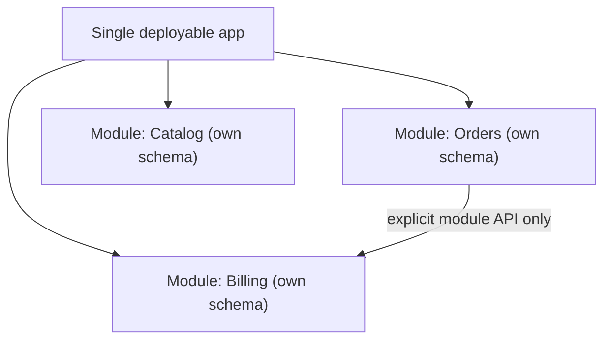
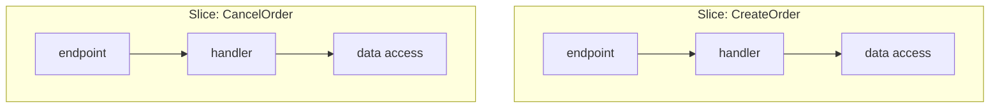

# Code-Organization Architectures (Layered, Hexagonal, Clean, Microkernel)

This topic is the **architectural-STYLE overview** for how a whole application's code and
modules are partitioned: which way dependencies point, how concerns are separated, and how the
app is deployed. It covers the *code-organization* family — Layered/N-Tier, Hexagonal (Ports &
Adapters), Clean, Onion, Microkernel/Plug-in, Blackboard, plus the recognized modern additions
Modular Monolith and Vertical Slice — and gives a brief, cross-referenced treatment of adjacent
system/distribution styles (Microservices, Service-Based/SOA, Event-Driven, Space-Based,
Pipeline, Broker) whose deep dives live in other topics.

> [!KEY-TAKEAWAY]
> The unifying thread across **Hexagonal, Clean, and Onion** is **Dependency Inversion at the
> architecture level**: high-level business policy defines interfaces (ports), low-level
> infrastructure implements them, so *source-code dependencies point inward toward the domain*.
> That single rule is what buys **testability** (fake the infrastructure) and **swappable
> infrastructure** (change the DB or framework without touching business rules). Layered, by
> contrast, points dependencies *down toward the database* — which is exactly the coupling the
> inward-pointing styles were invented to fix.

## Architectural Styles versus Design Patterns

Keep two altitudes distinct — interviewers reward candidates who do:

- **Architectural styles (this `arch-*` group)** describe how an *entire application* is
  structured and deployed: the shape of its modules, the direction of dependencies, and its unit
  of deployment. Example claim: *"the business core must not depend on the database."*
- **Design patterns (the `dp-*` group)** solve *object-level wiring problems inside a single
  module*: how a few classes collaborate. Example: **Repository**, **Adapter**, **Factory**,
  **Observer**.

The two interlock: a style states a *rule*, and design patterns are the *tactics* that obey it.
Clean/Onion say "invert the dependency on persistence"; you *implement* that with the
**Repository** and **Adapter** patterns and wire it with **Dependency Injection**. MVC / MVP /
MVVM and Repository / DTO / Gateway are presentation- and enterprise-level *patterns*, not
application-wide styles — **Deep dive: see `dp-enterprise-application`** and `dp-structural`.

---

## Layered and N-Tier Architecture

**Problem it solves:** Teams need a simple, universally understood default that separates
concerns (UI vs business logic vs data access) so different skill sets can work in parallel and a
change to one concern does not ripple through the others.

**How it works / key components:** Horizontal layers, typically **Presentation → Business →
Persistence → Database**. Each layer has one responsibility. The core rule is **layers of
isolation**: a layer only calls the layer directly below it. Layers are **closed** by default (a
request must pass *through* each layer, so a change in one layer does not force changes in
distant ones). A layer can be made **open** to allow skipping — but every open layer weakens the
isolation contract and must be documented. The **architecture sinkhole anti-pattern** appears
when most requests fall straight through the layers doing no real work (pure pass-through),
adding cost with no value; a small percentage of pass-through is fine, a large percentage means
layered is the wrong style.

**Worked example — the sinkhole, and why "some pass-through is fine."** Compare two requests hitting
the same 3-layer stack:

- `GET /customer/{id}` (a sinkhole request): Presentation just forwards the id -> Business just
  forwards it -> Persistence issues `SELECT * FROM customer WHERE id=?` -> the row bubbles straight
  back up. **3 layer hops, 0 business logic** — every layer was pure overhead.
- `POST /orders` (a request that earns the layers): Presentation validates the JSON -> Business
  checks inventory, applies a promo, computes tax, enforces credit limit -> Persistence writes the
  order + line items in one transaction. **3 hops, real work at every layer.**

Richards' rough **80/20 heuristic**: a *few* sinkhole requests are unavoidable and fine, but if you
audit your endpoints and roughly **80% look like the first case** (only ~20% do real work), the
layers are taxing every call for value they rarely add — that is the **architecture sinkhole
anti-pattern**, and it is the signal that a simpler style (or open layers that let reads skip
straight to persistence) fits the workload better.

> "N-tier" refers to *physical* deployment tiers (separate machines/processes); "layers" are the
> *logical* partitioning. They often coincide but are not the same thing.



**Trade-offs:**
- *Pros:* Simplest to build and understand; excellent starting point; low cost; strong
  *technical* separation of concerns; matches teams organized by technical role.
- *Cons:* Dependencies point **downward toward the database** (the domain depends on
  persistence) → business logic is hard to unit-test in isolation; low deployability (the whole
  monolith redeploys for any change); layers become change-ripple paths; sinkhole risk.
- *-ilities:* Optimizes **simplicity, cost, familiarity**. Weak on **deployability**,
  **scalability** (deploys and scales as one unit), and **evolvability**.
- *Use when:* small apps, MVPs, tight budgets/timelines, teams split by technical skill.
- *Avoid when:* you need independent deployability, high testability of domain logic, or the app
  is large and evolving quickly.

**Differs from adjacent styles:** Layered organizes by **technical concern** and points
dependencies **down to the DB**; Hexagonal/Clean/Onion organize around a **domain core** and
invert dependencies **inward**. Vertical Slice organizes by **feature**, cutting vertically
through the layers instead of stacking them.

---

## Hexagonal Architecture: Ports and Adapters

**Problem it solves:** In layered apps the business logic ends up coupled to the database, the UI
framework, and external APIs, so you cannot test the domain without spinning up infrastructure
and cannot swap a technology without rewriting business code. (Alistair Cockburn, 2005.)

**How it works / key components:** An isolated **application/domain core** talks to the outside
world *only* through **ports** — technology-agnostic interfaces. **Adapters** translate between a
concrete technology and a port. There are two sides:

- **Driving / primary (left) ports:** actors that *drive* the app (UI, REST controller, CLI, test
  harness) call the core through **inbound adapters**.
- **Driven / secondary (right) ports:** things the app *drives* (DB, message bus, external
  services) are reached through **outbound adapters**.

Crucially, driven ports are **defined by the core** and *implemented* by adapters — that is
dependency inversion, so infrastructure depends on the core, never the reverse. The "hexagon" is
symbolic: it signals "many sides / many adapters," not six of anything.



**Worked example — how a use case "calls the DB" while still depending only inward.** This is the
one idea that makes Hexagonal/Clean/Onion click, so trace it in code. The trick is *who defines the
interface*: the core does, and the outer ring implements it.

```java
// ---- core package (domain + use cases): imports NOTHING from infra ----
package shop.core;

public interface OrderRepository {              // (1) the PORT — interface DEFINED in the core
    void save(Order order);
}

public class PlaceOrderService {                // (2) use case depends only on the port…
    private final OrderRepository repo;         //     …so this arrow is core -> core (inward)
    public PlaceOrderService(OrderRepository repo) { this.repo = repo; }
    public void handle(Order order) {
        order.validate();                       //     business rule lives in the Order entity
        repo.save(order);                       //     at runtime this reaches the real DB
    }
}

// ---- infra package (outer ring): depends ON the core ----
package shop.infra;
import shop.core.OrderRepository;               // (3) infra -> core: the import points INWARD
public class JpaOrderRepository implements OrderRepository {   // adapter implements the port
    public void save(Order order) { /* JPA / SQL */ }
}

// ---- wiring (main / DI container): the only place that knows both ----
OrderRepository repo = new JpaOrderRepository();               // choose the concrete adapter
PlaceOrderService svc = new PlaceOrderService(repo);           // inject it
```

Now watch the two arrows point in **opposite** directions — that *is* dependency inversion:

- **Source-code dependency (compile time):** every `import` crosses `infra -> core`
  (`JpaOrderRepository` imports `OrderRepository`). `core` imports nothing from `infra`. Arrow
  points **inward**.
- **Control flow (runtime):** `svc.handle()` -> `repo.save()` -> `JpaOrderRepository.save()` -> DB.
  Execution flows **outward** from the core toward the database.

The payoff falls straight out of this: in a test, inject `class FakeRepo implements OrderRepository`
and `PlaceOrderService` runs with **no database at all**; to migrate DBs, write
`MongoOrderRepository implements OrderRepository` and the core never changes a line. Clean calls the
port an "interface adapter boundary" and Onion calls it a "repository interface on the domain," but
it is the exact same move — inner ring defines the interface, outer ring implements it.

**Trade-offs:**
- *Pros:* Domain is fully unit-testable with fake/in-memory adapters (**highest testability**);
  infrastructure is swappable (change DB or framework without touching the core); **symmetric**
  treatment of every external actor.
- *Cons:* More upfront indirection and boilerplate (ports + adapters + mapping); over-engineering
  for trivial CRUD; the team needs discipline about what truly belongs in the core.
- *-ilities:* Optimizes **testability, evolvability/maintainability, technology independence**.
  Neutral on raw **performance** and **deployability** (usually still one deployable unit).
- *Use when:* rich domain logic, long-lived apps, TDD/DDD teams, need to isolate business rules
  from volatile infrastructure.
- *Avoid when:* a thin CRUD app with no meaningful domain logic.

**Differs from adjacent styles:** Same dependency-inversion goal as Clean/Onion but expressed
with just **ports + adapters** and a **left/right (driving vs driven) symmetry** rather than
concentric rings, and with **no mandated number of layers**. Versus Layered: dependencies point
**inward**, not down. It uses the GoF **Adapter** pattern as a *tactic* — **see
`dp-structural`** — but the style is bigger than the pattern.

---

## Clean Architecture

**Problem it solves:** The same coupling pain as Hexagonal, but stated as an explicit, teachable
rule for large systems: keep enterprise business rules independent of frameworks, UI, DB, and any
external agency, so the system is testable and its structure "screams" the business intent rather
than the framework. (Robert C. Martin, 2012.)

**How it works / key components:** **Concentric circles**, inside out:

1. **Entities** — enterprise-wide business rules (the most general, longest-lived logic).
2. **Use Cases / Interactors** — application-specific business rules that orchestrate entities.
3. **Interface Adapters** — controllers, presenters, gateways that convert between use-case data
   shapes and external formats.
4. **Frameworks & Drivers** — the DB, web framework, UI, devices (the volatile "details").

The **Dependency Rule** is the whole point: *source-code dependencies point only inward; inner
circles know nothing about outer ones.* When control flow must cross a boundary outward-to-inward
(e.g., a use case needs to call the database), you invert it — the inner circle defines an
interface and the outer circle implements it — so the source dependency still points inward.



**Trade-offs:**
- *Pros:* Frameworks/DB/UI become swappable, deferrable "details"; use cases are testable without
  infrastructure; explicit separation of **enterprise rules (entities) vs application rules (use
  cases)**.
- *Cons:* **Heaviest ceremony** — many boundary DTOs, mappers, and interfaces; steep for juniors;
  easy to over-apply to simple systems.
- *-ilities:* Optimizes **testability, independence from frameworks, long-term maintainability**.
  Weak on **speed of initial delivery**.
- *Use when:* large, long-lived, business-critical systems where the business will outlast any
  given framework; strong DDD alignment.
- *Avoid when:* small apps, or when the framework effectively *is* the product.

**Differs from adjacent styles:** Clean is a **generalization/synthesis** of Hexagonal, Onion,
and others; it names **four** concentric rings and, uniquely, separates **entities vs use
cases**. Onion is nearly identical but centers on the **domain model** rather than "entities/use
cases" vocabulary. Hexagonal expresses the same rule with ports/adapters and no mandated ring
count.

---

## Onion Architecture

**Problem it solves:** Traditional layered apps couple everything to data access — the DB sits at
the "bottom" and every layer depends on it. Jeffrey Palermo (2008) wanted to invert that so the
**domain model is the center** and infrastructure is a swappable outer ring.

**How it works / key components:** Concentric rings, center outward: **Domain Model** → **Domain
Services** → **Application Services** → **Outer ring (UI / Infrastructure / Tests)**. The core
rule is identical to Clean/Hexagonal: **all dependencies point toward the center.** The domain
defines interfaces (e.g., repository interfaces) and the outer infrastructure ring *implements*
them. Nothing in an inner ring may reference anything in an outer ring.



**Trade-offs:**
- *Pros:* Domain model has **zero infrastructure dependencies**; repositories/persistence are
  swappable; strong testability; very DDD-friendly.
- *Cons:* Ring boundaries can feel arbitrary; interface proliferation; the same over-engineering
  risk as Clean/Hexagonal.
- *-ilities:* Optimizes **domain purity, testability, maintainability** — the same profile as
  Hexagonal/Clean.
- *Use when:* DDD-centric apps with a rich domain model; enterprise/.NET contexts where the
  pattern originated.
- *Avoid when:* thin CRUD with no real domain.

**Differs from adjacent styles:** Onion, Clean, and Hexagonal are **the same idea (dependency
inversion toward a domain core) with different vocabularies** — see the dedicated comparison
below. Onion's distinguishing claim is that it explicitly names the **domain model** (not
"entities") as the innermost ring and popularized the phrase "dependency inversion at the
architecture level"; it grew directly out of DDD.

---

## Hexagonal versus Clean versus Onion

All three enforce **inward-pointing dependencies toward a technology-agnostic domain core**, and
all three achieve the same payoff: you can **unit-test business rules with fakes** and **swap
infrastructure** without editing the core. They differ only in vocabulary and emphasis:

| Aspect | Hexagonal (Ports & Adapters) | Onion | Clean |
|---|---|---|---|
| Author / year | Alistair Cockburn, 2005 | Jeffrey Palermo, 2008 | Robert C. Martin, 2012 |
| Shape metaphor | Hexagon with ports on the sides | Concentric rings | Concentric rings |
| Innermost element | Application core (domain + use cases) | **Domain model** | **Entities**, then Use Cases |
| Boundary mechanism | **Ports (interfaces) + Adapters** | Interfaces defined by inner rings | Interfaces + the **Dependency Rule** |
| Signature idea | **Driving vs driven** (left/right) symmetry | Domain-model-centric rings | Named **4 rings**; entities vs use cases split |
| Mandated ring/layer count | None | Rings, count flexible | Four rings |

> [!INTERVIEW]
> If an interviewer asks "what's the difference between Hexagonal, Onion, and Clean?", the strong
> answer is: *"They are variations on the same theme — dependency inversion so the domain core
> has no outward dependencies. Hexagonal frames it as ports and adapters with driving/driven
> symmetry; Onion centers the domain model in rings; Clean generalizes both and adds the explicit
> Dependency Rule plus an entities-vs-use-cases split. Pick the vocabulary your team knows; the
> discipline matters more than the diagram."*

**When the distinction actually matters (senior nuance).** "They're the same" is the right default,
but a strong candidate names the two cases where picking one is defensible: choose **Hexagonal** when
the app is genuinely driven by *many symmetric actors* — e.g. the same use case invoked by a REST
controller, a CLI, a Kafka consumer, and a test harness — because the driving/driven symmetry keeps
all four as interchangeable adapters. Choose **Clean** when enterprise-wide business rules must be
*reused across multiple applications*, because its extra ring — **Entities** (enterprise rules)
separated from **Use Cases** (app-specific rules) — is exactly the seam that lets several apps share
the entities layer. Below that scale, the entities-vs-use-cases split is ceremony, and the three are
interchangeable.

> [!WARNING]
> **The anemic-domain-model trap** is the #1 way teams botch Onion/Clean/Hexagonal. They draw all
> the rings, then put every rule in `OrderService` and leave `Order` as a bag of getters/setters —
> a "domain model" with no behavior. Now the ring diagram is decoration: logic that belongs in the
> `Order` entity (validate, applyDiscount, canCancel) has leaked outward into procedural services,
> which is the very coupling the style was meant to prevent. The fix (and the follow-up an
> interviewer wants): behavior lives *with* the data it guards, on the entity — services only
> orchestrate across entities.

---

## Microkernel and Plug-in Architecture

**Problem it solves:** A product must ship a small, stable **core** yet allow features to be
added, replaced, or removed independently — by third parties or over time — **without modifying
or redeploying the core**.

**How it works / key components:** A minimal **core system** (the microkernel) provides only the
general, minimal functionality needed to run, plus a **plug-in registry and a contract**
(interface) that plug-ins must satisfy. **Plug-in components** are independent, self-contained
modules that add domain/feature capability and register against the contract. Plug-ins are ideally
decoupled from *each other* and communicate only through the core; plug-in-to-plug-in
dependencies erode the model. Plug-ins can be in-process (libraries loaded dynamically) or remote
(services). Canonical examples: IDEs (Eclipse, VS Code extensions), web browsers, OS kernels +
device drivers, Jenkins, and insurance/claims rules engines.



**Trade-offs:**
- *Pros:* Excellent **extensibility** and feature isolation; plug-ins deploy/evolve
  independently; enables product customization and third-party ecosystems.
- *Cons:* Designing the right minimal core *and* a stable contract is hard; contract/versioning
  governance overhead; not inherently scalable (the core can bottleneck); plug-in-to-plug-in
  coupling breaks the model.
- *-ilities:* Optimizes **extensibility, evolvability, customizability, testability** (each
  plug-in tested against the contract). Weak on **elastic scalability** and **contract-change
  agility**.
- *Use when:* product platforms, tools/IDEs, and apps with volatile feature sets or many
  optional/customer-specific features.
- *Avoid when:* uniform high-scale workloads with no extension needs.

**Differs from adjacent styles:** Microkernel partitions by **optional feature/extension around a
fixed core**; Layered partitions by technical concern; Hexagonal/Clean/Onion partition around a
domain core with inverted dependencies but provide **no dynamic plug-in registry**. It also
differs from Microservices: plug-ins **extend a shared core** (often in-process), whereas
microservices are independently deployed distributed services.

---

## Blackboard Architecture

**Problem it solves:** Some problems have **no deterministic, known-in-advance algorithm** to reach
a solution — speech recognition, image/sensor interpretation, vision, surveillance, and many AI
problems. You cannot pre-plan a fixed pipeline of steps; instead you must let multiple specialist
strategies **opportunistically** contribute partial results and incrementally converge on an
answer.

**How it works / key components:** Three parts (POSA vol 1 / Garlan & Shaw):

- **Blackboard** — a shared, global data structure (the common knowledge repository) that holds the
  current problem state and all partial/candidate solutions. It is the *only* channel between
  specialists; knowledge sources never call each other directly.
- **Knowledge sources (KS)** — independent, specialized modules, each expert at recognizing when it
  can contribute and at transforming the blackboard state a step closer to a solution. They are
  mutually decoupled and know nothing of one another.
- **Control component (controller / control loop)** — monitors the blackboard and **opportunistically
  selects and schedules** which knowledge source to activate next based on the current state, looping
  until an acceptable solution is reached or no KS can make further progress. Control is data-driven
  (state on the blackboard triggers activation), not a fixed call sequence.



**Trade-offs:**
- *Pros:* Handles ill-defined problems with no algorithmic solution; knowledge sources are
  independently developed and pluggable; supports experimentation with different strategies.
- *Cons:* Hard to test and debug (non-deterministic, opportunistic control); tuning the control
  strategy is difficult; no guarantee of a good/timely solution; the shared blackboard can become a
  contention and coupling point.
- *-ilities:* Optimizes **problem-solving flexibility for non-deterministic/AI workloads**. Weak on
  **predictability, testability, and performance guarantees**.
- *Use when:* speech/image/signal recognition, sensor fusion, diagnostics, and heuristic AI search
  where no fixed algorithm exists.
- *Avoid when:* the problem has a clear deterministic pipeline (use Pipe-and-Filter) or standard
  request/response logic (use Layered/Hexagonal).

**Differs from adjacent styles:** Versus **Pipe-and-Filter** — pipeline runs filters in a *fixed*
order with data flowing forward; Blackboard has **no fixed order**, its control loop picks the next
knowledge source *opportunistically* from the shared state. Versus **Microkernel** — plug-ins
register against a core contract and are invoked to extend features, whereas knowledge sources
coordinate *only* through shared blackboard data under a control loop, never a plug-in registry.
Versus **Event-Driven** — coordination is via a shared global data store polled by a controller,
not via emitted events on a bus.

---

## Modular Monolith

**Problem it solves:** Teams want the strong module boundaries and independent-evolution benefits
people chase with microservices, but **without** the operational cost, network latency, and
distributed-data complexity of going distributed.

**How it works / key components:** A **single deployable unit** internally partitioned into
**well-bounded modules**, ideally aligned to DDD **bounded contexts**. Each module owns its data
and exposes an explicit **in-process API**; cross-module access goes *only* through those APIs —
no reaching into another module's tables or internals. The boundaries are enforced by build
tooling, package/namespace structure, and architecture tests (e.g., ArchUnit), because nothing at
runtime physically stops a shortcut.

Because that enforcement is the whole game, name the concrete toolchain: (1) **separate build
modules** (Maven/Gradle submodules, .NET projects) so `billing` simply does not have `orders` on its
compile classpath — a forbidden call won't compile; (2) **package-private visibility** — expose one
public `OrdersApi` facade and keep the module's entities/repos package-private so they're invisible
outside; (3) **CI architecture tests** (ArchUnit in Java, import-linter in Python) that fail the
build on a banned import. A **boundary violation** looks like `billing.InvoiceService` doing
`new OrderRepository().findById(...)` — reaching into Orders' internals instead of calling
`OrdersApi.getOrder(id)`. Without these guards nothing at runtime stops that shortcut, so the "modular"
monolith silently rots into a big ball of mud.



**Trade-offs:**
- *Pros:* Clear boundaries **plus** simple ops (one deploy, in-process calls, one transaction
  boundary, easy refactoring across modules); a clean **stepping stone** to microservices later.
- *Cons:* Still one deployable — **no independent scaling/deployment** of a module; boundary
  discipline must be actively enforced or it rots into a big ball of mud.
- *-ilities:* Optimizes the **maintainability + simplicity** balance.
- *Use when:* you want microservice-like modularity without distribution cost, or as a migration
  on-ramp toward microservices.
- *Avoid when:* modules truly need independent scaling, deployment cadence, or tech stacks.

**Differs from adjacent styles:** Versus Layered — it partitions **vertically by domain module**,
not horizontally by tech layer. Versus Microservices — logical boundaries in **one process**, not
separate deployables. **Deep dive: see `microservices-monolith-api-design` and
`microservices-ddd-and-boundaries`.**

---

## Vertical Slice Architecture

**Problem it solves:** In layered/onion apps, implementing one feature forces edits across every
horizontal layer (controller + service + repository + DTO), scattering related code and creating
cross-feature coupling. Teams want each feature to be a **self-contained change**.

**How it works / key components:** Organize code by **feature/use-case slice** rather than by
technical layer. Each slice contains everything it needs end-to-end (request → handler → data
access), so slices are largely independent and may even use different internal patterns (one
slice can be a thin CRUD call, another can invoke a rich domain model). It is commonly paired with
**CQRS-style** request handlers — one handler per command/query.



**Trade-offs:**
- *Pros:* High **feature cohesion**, low coupling *between* features, easy to add/remove a whole
  feature; less abstraction ceremony than Clean/Onion.
- *Cons:* Some **duplication** across slices; weaker enforcement of shared domain invariants;
  less established/documented than layered.
- *-ilities:* Optimizes **feature-level maintainability and change isolation**.
- *Use when:* CRUD-plus apps, feature-team ownership, and CQRS-oriented designs.
- *Avoid when:* a rich shared domain model needs central enforcement of invariants (Onion/Clean
  fit better).

**Differs from adjacent styles:** It cuts **vertically per feature**; Layered/Clean/Onion cut
**horizontally by concern/ring**. It is often combined with CQRS — **Deep dive (CQRS): see
`event-driven-cqrs-saga-cdc`.**

---

## Microservices

**Problem it solves:** A single monolith cannot let independent teams deploy and scale their parts
on separate cadences. **Trade-off:** independent **deployability and scalability** per service
versus **distributed-systems complexity** (network failure, data consistency across services,
heavier operations/observability). Best visualized as a `flowchart` topology (services behind an
API gateway, each with its own database).

**Deep dive: see `microservices-monolith-api-design` and `microservices-ddd-and-boundaries`.**

---

## Service-Based Architecture and SOA

**Problem it solves:** Get *some* independent deployability without full microservice granularity
or a database per service. **Trade-off:** fewer, coarser domain services (often over a **shared
database**) are simpler than microservices but offer less isolation; classic **SOA** adds
heavyweight orchestration and an **ESB** (protocol-driven, enterprise reuse) at the cost of
central-bus coupling and governance. Best visualized as a `flowchart`.

**Deep dive: see `microservices-monolith-api-design`; contrast service granularity in
`microservices-ddd-and-boundaries`.**

---

## Event-Driven Architecture

**Problem it solves:** Synchronous request/response coupling limits scalability and
responsiveness. **Trade-off:** high **scalability, decoupling, and resilience** versus harder
reasoning, **eventual consistency**, and difficult debugging of asynchronous flows. Two common
topologies — **broker** (chained, no central coordinator) and **mediator** (central orchestrator)
— are best shown with a `flowchart` or `sequenceDiagram`.

**Deep dive: see `event-driven-cqrs-saga-cdc`.** The asynchronous transport itself — message
queues, pub/sub, and the **Broker** style — is covered in **`message-queues-and-async`.**

---

## Space-Based Architecture

**Problem it solves:** The database becomes the bottleneck under extreme, spiky concurrent load.
**Trade-off:** near-linear **elastic scalability** and high **performance** via a replicated
**in-memory data grid** (tuple space) with asynchronous writes back to the DB, versus significant
**complexity** and eventual-persistence/data-loss risk. Key parts — processing units, virtualized
middleware, and data pumps — are best shown with a `flowchart`.

**Deep dive (in-memory grid / caching): see `caching-and-cdn` and `aws-caching-elasticache-dax`.**

---

## Pipeline and Pipe-and-Filter

**Problem it solves:** Process a stream of data through a sequence of independent transformation
steps that should be **reusable and recombinable**. **Trade-off:** high **composability and
reuse** of filters versus a poor fit for interactive, low-latency, or error-heavy flows. Best
shown with a `flowchart LR` of filters connected by pipes.

**Deep dive (as a distributed/cloud pattern): see `dp-distributed-cloud`.**

---

## Broker

**Problem it solves:** Decouple distributed components so they can interact without knowing each
other's location. **Trade-off:** **location transparency and decoupling** versus the broker
becoming a bottleneck or single point of failure. Best shown with a `flowchart`. (POSA vol 1.)

**Deep dive: see `message-queues-and-async`.**

> [!TIP]
> A few more altitude pointers so you don't mistake patterns for styles:
> **Sidecar / Ambassador** are distributed-system *patterns* → `dp-distributed-cloud`.
> **Serverless** is a deployment style → `aws-serverless-lambda-stepfunctions`.
> **Primary-Replica** replication and sharding (historically called *master-slave*) →
> `databases-sql-nosql-sharding-replication`.

---

## Common follow-up questions

- **"How is an architectural style different from a design pattern?"** A style structures the
  whole application (module shape, dependency direction, deployment unit); a design pattern wires
  a handful of objects inside a module. Repository/Adapter are the *tactics* that implement a
  style's *rule* like "invert the persistence dependency."
- **"Layered points dependencies down; why is that a problem?"** Business logic ends up depending
  on persistence, so you cannot test it without a database and cannot swap the database without
  editing business code. Hexagonal/Clean/Onion invert that so the domain has no outward deps.
- **"Hexagonal vs Clean vs Onion — pick one."** They are the same dependency-inversion idea in
  different vocabularies. Choose the one your team knows; the inward-pointing discipline is what
  matters, not the ring count.
- **"When would you NOT use Clean/Hexagonal?"** Thin CRUD with no real domain logic — the ports,
  adapters, DTOs, and mappers become pure ceremony with no payoff.
- **"Modular monolith or microservices for a new product?"** Usually start modular monolith: you
  get bounded-context boundaries and simple ops, and can extract services later where they truly
  need independent scale or deploy. Going distributed first pays the complexity tax before you
  have the scale to justify it.
- **"What is the architecture sinkhole anti-pattern?"** When most requests pass straight through
  layers doing no business logic — a sign layered is adding cost without value for that workload.
- **"Which style maximizes testability of business rules?"** Hexagonal/Clean/Onion, because the
  domain depends on no infrastructure and can run against fake adapters.
- **"Which style maximizes extensibility for an ecosystem of add-ons?"** Microkernel/Plug-in.
- **"Which style best isolates change to a single feature?"** Vertical Slice.

## References

- Mark Richards, *Software Architecture Patterns* (O'Reilly) — Layered, Microkernel,
  Event-Driven, Space-Based, Microservices, Service-Based.
- Mark Richards & Neal Ford, *Fundamentals of Software Architecture* (O'Reilly) — architecture
  styles, the -ilities, and trade-off analysis.
- Buschmann et al., *Pattern-Oriented Software Architecture, Vol. 1 (POSA)* — Layers, Pipes and
  Filters, Broker, Microkernel.
- Alistair Cockburn, "Hexagonal Architecture (Ports & Adapters)," alistair.cockburn.us (2005).
- Jeffrey Palermo, "The Onion Architecture" series, jeffreypalermo.com (2008).
- Robert C. Martin, "The Clean Architecture," blog.cleancoder.com (2012); *Clean Architecture*
  (2017).
- Martin Fowler, martinfowler.com — *PresentationDomainDataLayering*, *PatternsOfEnterprise
  ApplicationArchitecture*, *MonolithFirst*, event-driven notes.
- microservices.io (Chris Richardson) — Microservices, decomposition, and data patterns.
- Microsoft Azure Architecture Center — Cloud Design Patterns and architecture styles.
- Jimmy Bogard, "Vertical Slice Architecture," jimmybogard.com.
