# Data-Flow & Event-Driven Architectures

This is one topic inside the **Architectural Patterns** group (slugs prefixed
`arch-`). These are **system-level architectural *styles*** — descriptions of how a
*whole application* is structured and deployed and how data/events move through it.
That is a deliberately **different altitude** from the object-level GoF **Design
Patterns** group (`dp-*`), which is about how *classes and objects* inside one process
collaborate. Keep the two straight, because several names collide:

> [!KEY-TAKEAWAY]
> **Altitude matters.** Pipe-and-Filter (a *system* style) is not Chain of
> Responsibility (a `dp-behavioral` object pattern). The Publish-Subscribe *style* is
> not the Observer object pattern. The Mediator *topology* of Event-Driven
> Architecture is not the GoF Mediator pattern. Same intuition, wildly different
> altitude, blast radius, and failure model. In an interview, say which altitude you
> are operating at before you draw a box.

**Pattern vs. full architecture.** Not everything in this family is a whole-application
style. Pipe-and-Filter, Publish-Subscribe, CQRS, Event Sourcing, and Choreography/
Orchestration are frequently **composable patterns** dropped *inside* a larger style;
Event-Driven Architecture (Richards' broker/mediator), Batch/Stream Processing, and
Lambda/Kappa are **whole-application styles**. Each section says which it is.

**Inclusive language.** This topic uses **Primary-Replica** for replication roles
(historically called master-slave) and allowlist/denylist terminology throughout.

**How this topic relates to the deep dives.** Several of these styles have their own
dedicated topics. This page is the **architectural-style *overview*** — the map of the
family and how the styles differ. It gives each overlapping style a 1–2 line
architectural treatment plus an explicit **"Deep dive: see …"** pointer, and does *not*
duplicate the mechanics (partitioning, delivery semantics, saga compensation logic,
watermarks, etc.) that live in those topics.

The family splits into three clusters:

- **(A) Classic data-flow styles** — Pipe-and-Filter, Batch Sequential.
- **(B) Big-data / data-processing architectures** — Batch Processing, Stream
  Processing, Lambda, Kappa.
- **(C) Event-driven styles & patterns** — EDA broker topology, EDA mediator topology,
  Publish-Subscribe/Broker, CQRS, Event Sourcing, Choreography vs. Orchestration,
  Reactive Architecture, Complex Event Processing.

---

## Pipe-and-Filter

**Problem it solves:** you need to transform a stream of data through a *sequence of
independent, reusable steps*, and you want each step to be swappable, individually
testable, and recombinable — without any step knowing what comes before or after it.

**What it is / how it works.** A classic **data-flow** style (Garlan & Shaw; POSA vol.1
"Pipes and Filters"). **Filters** are independent processing components that read data,
transform it, and write it out; **pipes** are the unidirectional connectors (a queue, a
stream, stdin/stdout, a Kafka topic) that carry data between filters. A filter knows
*nothing* about its neighbours — it only knows the shape of the data on its input pipe
and output pipe. That ignorance is the whole point: it makes filters reusable and the
pipeline reconfigurable. The canonical example is a Unix shell pipeline
(`cat | grep | sort | uniq`); compilers (lex → parse → optimize → codegen), ETL jobs,
and stream-processing topologies are all pipe-and-filter.

Four filter roles are usually named: **producer** (source), **transformer** (map),
**tester** (filter/route), and **consumer** (sink).

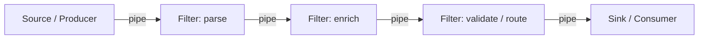

**Trade-offs.**
- **Pros:** high **composability & reuse** (recombine filters into new pipelines);
  excellent **testability** (each filter tested in isolation with a fake pipe); natural
  **concurrency** (filters run as separate stages/processes, overlapping in time);
  loose coupling between steps.
- **Cons:** poor fit for **low-latency, interactive** work (data must traverse every
  stage); **shared state** across filters breaks the model; **error handling spans the
  whole pipe** (where do you report a failure in stage 3?); high-throughput binary data
  can suffer serialization overhead at each pipe boundary.
- **Optimizes (-ilities):** modularity, testability, and reusability above all;
  throughput scales by parallelizing stages.
- **When to use:** transformation-heavy workloads with clear sequential stages — ETL,
  compilers, log/stream processing, media transcoding.
- **When to avoid:** request/response systems needing a single fast round-trip, or
  workflows with rich shared state and cross-step transactions.

**Differs from adjacent styles.** Versus **Batch Sequential** (next): pipe-and-filter
*streams* records incrementally and stages **overlap in time**; batch sequential passes
the *entire* dataset from one step to the next with a hard barrier between steps. Versus
the **Chain of Responsibility** GoF pattern: CoR passes *one request* along handlers
until one handles it and stops — it is an in-process object collaboration, not a
data-transformation topology.

> Deep dive: for pipe-and-filter as a realized *stream-processing* system see
> `realtime-streaming-systems` and `messaging-databases/stream-processing-cdc`; for the
> cloud *pattern* lens (Pipes-and-Filters, Sidecar, Ambassador) see `dp-distributed-cloud`.

---

## Batch Sequential

**Problem it solves:** the mainframe-era need to run a *fixed series of programs* where
each program must **fully complete** and hand its **entire output** to the next before
that next program can start — simple, deterministic bulk processing with no concurrency.

**What it is / how it works.** The other classic **data-flow** style in the Garlan &
Shaw taxonomy, and the direct ancestor of Pipe-and-Filter. Each step is a batch program
that consumes a complete input file, produces a complete output file, and terminates;
the next step then reads that file. There is a **hard barrier** between every stage —
step *N+1* cannot begin until step *N* has written its last record. Think a nightly
sequence of JCL jobs, or a chain of Spark stages materialized to disk between them.

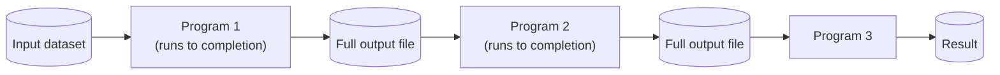

**Trade-offs.**
- **Pros:** conceptually simple and **robust**; each step is restartable from its input
  file; easy to reason about and audit; good for large bulk transforms where latency is
  irrelevant.
- **Cons:** **zero concurrency across steps** and a **whole-dataset barrier** → high
  end-to-end latency; poor resource utilization (later stages idle while earlier ones
  run); no incremental/early results.
- **Optimizes (-ilities):** simplicity and robustness for bulk throughput; sacrifices
  latency and interactivity.
- **When to use:** legacy bulk workflows, staged offline transforms where a clean
  materialized boundary between steps aids debugging and restart.
- **When to avoid:** anything needing overlap, streaming, or timely results.

**Differs from adjacent styles.** The key contrast is with **Pipe-and-Filter**: both
are data-flow, but batch sequential moves the **whole dataset** with a barrier and no
overlap, while pipe-and-filter streams **record-by-record** so stages run
concurrently. Batch Sequential is a *style*; **Batch Processing Architecture** (below)
is the modern big-data realization of the same idea at scale.

---

## Batch Processing Architecture

**Problem it solves:** you must process **very large *bounded* datasets** efficiently on
a schedule, when freshness is not critical — nightly ETL, billing runs, analytics
rollups, ML feature generation, monthly reports.

**What it is / how it works.** A **whole-application data-processing style** (per the
big-data literature: large-volume, time-windowed, autonomous jobs). Data accumulates in
storage (a data lake, warehouse staging, object store); a scheduler triggers a job that
reads a *finite* input, runs a distributed compute engine (MapReduce/Spark/Hive) over
it, and writes results to a serving store. Jobs are **bounded** (known start/end of
data) and **latency-insensitive** — they trade freshness for throughput and cost
efficiency by processing huge volumes in one pass.

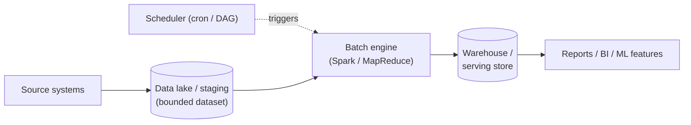

**Trade-offs.**
- **Pros:** highest **throughput per dollar** (amortizes overhead over huge volumes);
  simple mental model (deterministic, idempotent reruns); easy to reprocess history by
  re-running the job.
- **Cons:** **high latency / stale results** — outputs are only as fresh as the last
  run; large jobs create bursty resource demand; a failed late-stage job delays
  everything downstream.
- **Optimizes (-ilities):** throughput, cost-efficiency, and reprocessability; sacrifices
  freshness/latency.
- **When to use:** analytics, billing, EOD reconciliation, training-data prep — anywhere
  hours-old data is fine.
- **When to avoid:** real-time dashboards, fraud detection, anything needing
  sub-minute freshness.

**Differs from adjacent styles.** The defining contrast is **Stream Processing**
(below): batch is **bounded + scheduled**, stream is **unbounded + continuous**.
Lambda/Kappa exist precisely to reconcile the two.

> Deep dive: `aws-analytics-datalake-redshift-emr` (lake/warehouse/EMR mechanics) and
> `messaging-databases/stream-processing-cdc` (batch-vs-stream contrast).

---

## Stream Processing Architecture

**Problem it solves:** you must derive results **continuously** from an **unbounded,
never-ending flow of events** with **low latency** — you cannot wait for a batch window
because the data never "ends" and staleness costs money (fraud, alerting, live metrics).

**What it is / how it works.** A **whole-application data-processing style** built around
an append-only event log (Kafka/Kinesis) and a continuously running stream processor
(Flink, Kafka Streams, Spark Structured Streaming). Instead of "read a finite file, run,
stop," the processor runs forever, consuming events as they arrive and emitting results
incrementally. Because the input is unbounded, the hard problems are **windowing**
(tumbling/sliding/session), **event-time vs. processing-time** with **watermarks** for
late/out-of-order data, **stateful operators** (joins, aggregations) with durable state,
and delivery semantics (**at-least-once vs. exactly-once**).

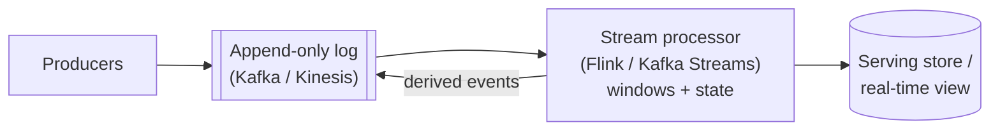

**Trade-offs.**
- **Pros:** **low latency & freshness** (results within ms–seconds); handles infinite
  data; natural fit for event-driven downstreams; elastic horizontal scaling by
  partition.
- **Cons:** **complexity** — windowing, watermarks, out-of-order and late data,
  large durable state, and **exactly-once** are genuinely hard; harder to reason about
  correctness and to reprocess history.
- **Optimizes (-ilities):** latency, freshness, and scalability; costs
  simplicity/operability.
- **When to use:** real-time analytics, fraud/anomaly detection, live dashboards,
  continuous ETL, feeding EDA consumers.
- **When to avoid:** heavy ad-hoc historical analytics, or when hourly freshness is
  fine and batch is far cheaper/simpler.

**Differs from adjacent styles.** Versus **Batch Processing**: unbounded/continuous vs.
bounded/scheduled. Versus **Event-Driven Architecture**: stream processing is about
*computing over* an event flow (transform/aggregate/detect); EDA is about *services
reacting to* events to trigger business actions — related plumbing, different intent.

> Deep dive: `realtime-streaming-systems`, `messaging-databases/stream-processing-cdc`,
> and `messaging-databases/apache-kafka` for the log/partitioning internals.

---

## Lambda Architecture

**Problem it solves:** you want **both** accurate/complete results computed over *all*
historical data **and** fresh low-latency results over recent data, from one big-data
pipeline — batch alone is too stale, streaming alone is historically hard to make
perfectly correct.

**What it is / how it works.** Nathan Marz's big-data architecture with **three layers**
fed by the same immutable master dataset:
- **Batch layer** — stores the immutable, append-only master data and recomputes
  comprehensive **batch views** periodically (accurate but stale).
- **Speed layer** — processes only recent data as a stream to produce **real-time
  views** that fill the gap since the last batch run (fresh but approximate).
- **Serving layer** — indexes both sets of views; queries **merge** the batch view with
  the real-time view to answer with completeness *and* freshness.

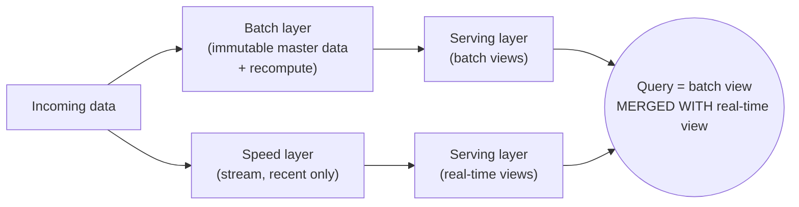

**Worked example — what a merged answer actually looks like.** Query: "how many
`OrderPlaced` events total?" The last batch job ran at **midnight** and counted every
event up to that instant: **batch view = 1,000,000**. Since midnight, the speed layer has
been counting only the new arrivals: **real-time view = 4,200**. It's now 09:15. Neither
view is the answer alone — the serving layer *merges* them:

```
answer = batch_view + speed_view = 1,000,000 + 4,200 = 1,004,200
```

At the next midnight run the batch layer recomputes over *all* the data (now
1,004,200-plus), and the speed-layer counter is **reset to 0** — the fresh, approximate
tail is folded into the accurate, complete base. That reset-and-reabsorb cycle is why a
transient bug in the speed layer self-heals: the batch recompute overwrites it.

**Trade-offs.**
- **Pros:** correctness **and** freshness together; batch layer is a self-healing source
  of truth (a bug is fixed by recomputing from immutable data); tolerant of speed-layer
  approximation.
- **Cons:** you maintain **two code paths** (batch + speed) implementing the *same*
  logic in different frameworks → duplicated logic, double the bugs, high operational
  cost and reconciliation pain.
- **Optimizes (-ilities):** accuracy + availability of fresh results; costs
  maintainability (dual implementation).
- **When to use:** large-scale analytics needing exact historical answers plus a live
  approximation, where teams accept dual maintenance.
- **When to avoid:** when a single replayable log + one stream engine can meet
  correctness needs — prefer Kappa.

**Differs from adjacent styles.** Versus **Kappa**: Lambda keeps a separate batch layer;
Kappa deletes it and does everything (including history) as a stream. Versus plain
**Stream Processing**: Lambda adds the batch recompute path for guaranteed correctness.

> Deep dive: `realtime-streaming-systems`, `aws-analytics-datalake-redshift-emr`.

---

## Kappa Architecture

**Problem it solves:** Lambda's dual code paths are painful — can you get correctness
*and* freshness with a **single codebase** by treating **everything, including
historical reprocessing, as one stream**?

**What it is / how it works.** Jay Kreps' answer ("Questioning the Lambda
Architecture"). Drop the batch layer entirely. Keep an **immutable, long-retention,
replayable log** (Kafka with long/infinite retention) as the system of record. A single
**stream processor** produces the serving views. To "reprocess" — fix a bug, change
logic, or backfill — you don't run a batch job; you **replay the log from the beginning**
through a new version of the stream job into a new output, then cut over. History and
live processing use the *same* code.

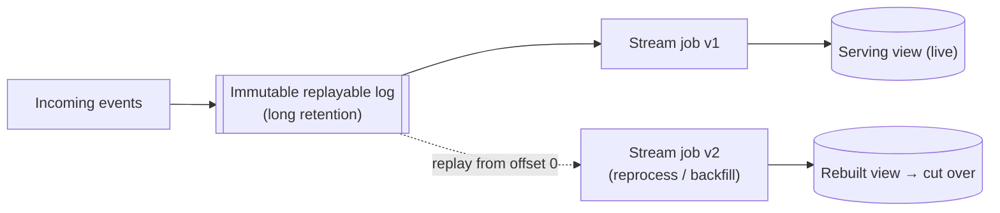

**Worked example — reprocessing is "just replay."** The log holds offsets `0…1,000,000`.
Stream job **v1** has consumed up to offset 1,000,000 and writes a `daily_revenue` view
that currently reads **$48,000** — but you discover v1 double-counted refunds, so the
number is wrong. You don't patch rows in place. You deploy job **v2** (correct refund
logic) pointed at a *fresh* output table and set its start offset to **0**:

```
v2 replays offset 0 → 1,000,000 into daily_revenue_v2
  ... reaches offset 1,000,000, now caught up to live
  daily_revenue_v2 = $45,600   (refunds counted once)
cut over: point readers at daily_revenue_v2, retire v1
```

The same code that processes live events (offsets past 1,000,000 keep flowing into v2)
also rebuilt all of history — no separate batch job, which is exactly Kappa's pitch over
Lambda. The cost is real: replaying a million-plus offsets is a heavy job, and the log
must retain offset 0, which is why Kappa demands long/infinite retention.

**Trade-offs.**
- **Pros:** **one codebase, one framework** → far simpler ops and reasoning than Lambda;
  reprocessing is "just replay"; naturally event-driven end to end.
- **Cons:** requires a **durable, long-retention replayable log** (storage cost, big
  replay jobs); large historical reprocessing can be slow/expensive; **weaker for heavy
  ad-hoc batch/OLAP analytics** that a warehouse does better.
- **Optimizes (-ilities):** maintainability and operational simplicity while keeping
  freshness; costs storage and heavy-analytics ergonomics.
- **When to use:** event-centric systems already built on a log, where stream logic can
  also serve historical needs via replay.
- **When to avoid:** workloads dominated by large ad-hoc historical/OLAP queries — a
  batch/warehouse layer is better there.

**Differs from adjacent styles.** Versus **Lambda**: no separate batch layer — one
stream path with replay. Versus **Event Sourcing**: both center on an immutable,
replayable log, but Event Sourcing is an *application state-persistence* pattern (rebuild
an aggregate's state from its events), while Kappa is a *data-processing pipeline* style
(recompute analytics views from an event stream).

> Deep dive: `realtime-streaming-systems`; `event-driven-cqrs-saga-cdc` for the log /
> event-sourcing relationship.

---

## Batch vs. Stream vs. Lambda vs. Kappa at a glance

The four data-processing styles above are best held side by side — they answer the same
question (turn incoming data into serving views) with different bounded/unbounded and
one-path/two-path choices:

| Dimension | Batch | Stream | Lambda | Kappa |
|---|---|---|---|---|
| **Input** | bounded (finite dataset) | unbounded (continuous) | both (master data + live stream) | unbounded (replayable log) |
| **Latency** | high (hours) | low (ms–seconds) | low for fresh view, high for batch view | low (ms–seconds) |
| **Code paths** | one (batch job) | one (stream job) | **two** (batch + speed, same logic twice) | **one** (stream job, used for live *and* history) |
| **Reprocessing** | re-run the job over the data | hard — no natural history rerun | recompute batch layer from immutable master | **replay the log from offset 0** through a new job |
| **Best for** | analytics, billing, EOD rollups | fraud, live metrics, continuous ETL | needs exact history *and* fresh approximation | event-centric systems on a log wanting one codebase |

Lambda and Kappa both exist to combine batch's correctness with stream's freshness;
Lambda pays for it with duplicated logic, Kappa with storage and heavy replay jobs.

---

## Event-Driven Architecture (Broker topology)

**Problem it solves:** you need to chain **reactive, decoupled processing** across many
services with **no central coordinator**, and you want to maximize scalability and
extensibility — new consumers can join and react to events without anyone changing the
producers.

**What it is / how it works.** One of the two Event-Driven Architecture topologies in
Mark Richards' *Software Architecture Patterns*. Components (event processors) are
strung together through a lightweight **broker** (a queue/topic/log with no business
logic). A processor consumes an event, does its work, and **publishes a new event** that
*other* processors may react to — a chain reaction with no orchestrator deciding the
sequence. There is no component that "knows" the end-to-end workflow; the flow **emerges**
from who subscribes to what.

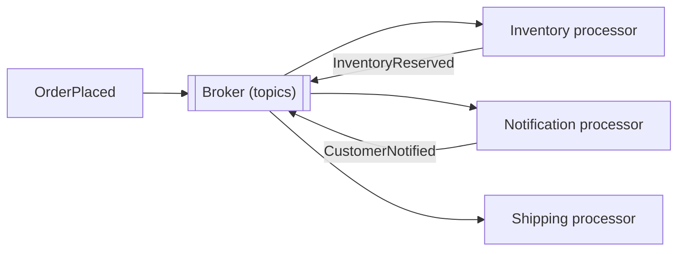

**Trade-offs.**
- **Pros:** highest **scalability, decoupling, and extensibility** — add a new reactor
  by subscribing, no producer changes; high responsiveness; naturally elastic per
  processor.
- **Cons:** **no central control** of a multi-step workflow → hard to monitor overall
  progress, hard to implement restart/recovery and error handling across the chain, no
  single place to see "where did this order get stuck?"; distributed workflows can be
  hard to reason about.
- **Optimizes (-ilities):** scalability, deployability, extensibility, performance;
  costs workflow controllability and observability.
- **When to use:** high-throughput, extensible event flows where steps are largely
  independent and you don't need centralized error handling (e.g., broadcasting domain
  events for many independent reactors).
- **When to avoid:** complex multi-step business processes needing coordinated
  error handling, restart, and end-to-end visibility.

**Differs from adjacent styles.** Versus **Mediator topology** (next): broker has *no*
coordinator; mediator adds one. Versus **Publish-Subscribe** (below): broker topology is
the *EDA application style* (chained event processors); pub/sub is the underlying
*messaging* pattern it usually rides on.

> Deep dive: `event-driven-cqrs-saga-cdc` (EDA/CQRS/saga/CDC mechanics) and
> `message-queues-and-async` (broker/queue delivery semantics).

---

## Event-Driven Architecture (Mediator topology)

**Problem it solves:** you have a **multi-step event workflow** that needs
**coordination, error handling, and restart semantics** — you must know the sequence,
handle failures at each step, and monitor overall progress, which the broker topology
can't give you.

**What it is / how it works.** The other Richards EDA topology. A central **event
mediator** (orchestrator) receives an initiating event, knows the required steps, and
dispatches processing events to the right **event channels/processors** in order,
tracking state and handling failures/retries. The mediator holds the workflow knowledge;
processors stay simple and just do one task when asked. An **ESB / integration hub** and
**AWS Step Functions** are concrete mediators.

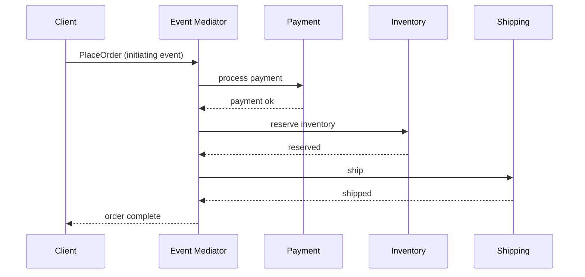

**Trade-offs.**
- **Pros:** **central control**, ordering, and **error handling/restart** — a single
  place to monitor and recover the workflow; easier to reason about complex processes.
- **Cons:** the mediator is a **coupling point and potential bottleneck/SPOF**; less
  **dynamically extensible** than broker (adding a step means changing the mediator);
  can drift toward a "smart pipe, dumb endpoints" anti-pattern (ESB godhead).
- **Optimizes (-ilities):** controllability, recoverability, and observability of
  workflows; costs some scalability/extensibility and adds a central dependency.
- **When to use:** orchestrated business processes with real error-handling and
  visibility needs (order fulfillment, provisioning).
- **When to avoid:** simple, highly extensible fan-out flows where a central
  coordinator is needless coupling — use broker.

**Differs from adjacent styles.** Versus **Broker topology**: presence of a central
coordinator. This is the same tension as **Orchestration vs. Choreography** (below)
applied to EDA topology. Note the *Mediator topology* ≠ the GoF **Mediator** object
pattern (`dp-behavioral`), which mediates object interactions in one process.

> Deep dive: `event-driven-cqrs-saga-cdc`; `aws-serverless-lambda-stepfunctions`
> (Step Functions is a managed mediator/orchestrator).

---

## Publish-Subscribe and Broker

**Problem it solves:** a producer must **broadcast** messages to a **dynamically
varying, unknown set of consumers** without knowing who they are, where they are, or
whether they're online — full **location and temporal decoupling** between sender and
receivers.

**What it is / how it works.** The foundational messaging *pattern* underneath most
event-driven systems (POSA vol.1 **Publisher-Subscriber** and **Broker**). Publishers
send messages tagged by **topic** (or matched by content) to a **broker/message bus**;
**subscribers** register interest and receive matching messages. Producers and consumers
never reference each other — the broker mediates. This gives:
- **Location decoupling** — neither side knows the other's address.
- **Temporal decoupling** — a durable broker holds messages so consumers can be offline
  and catch up later.
- **Fan-out** — one message reaches N subscribers.

Contrast with **point-to-point queues**, where each message goes to exactly one of the
competing consumers (work distribution, not broadcast).

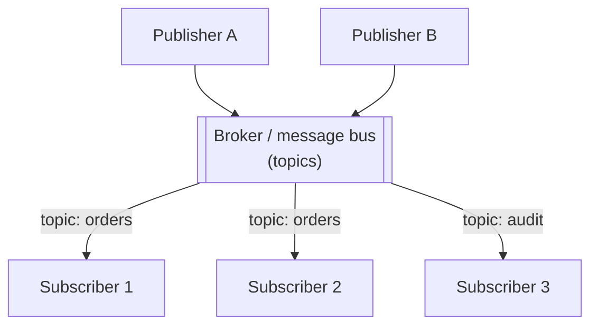

**Trade-offs.**
- **Pros:** strong **decoupling** and **dynamic subscription** (add/remove consumers at
  runtime); natural fan-out and broadcast; temporal decoupling via durable brokers.
- **Cons:** harder **delivery/ordering guarantees** (duplicates, out-of-order,
  at-least-once vs. exactly-once); **debugging** across an async boundary is hard (no
  call stack); the broker becomes **critical shared infrastructure** to secure, scale,
  and keep available.
- **Optimizes (-ilities):** decoupling, extensibility, elasticity; costs traceability
  and simple end-to-end reasoning.
- **When to use:** event broadcast, fan-out notifications, decoupled integration between
  independently evolving services.
- **When to avoid:** strict request/response with immediate results, or when a simple
  point-to-point queue (single consumer, work distribution) is all you need.

> [!INTERVIEW]
> **The dual-write problem — the senior probe you must have an answer for.** A service
> that both commits to its DB *and* publishes an event has two independent writes with no
> shared transaction. If it crashes between them you get an inconsistency: DB updated but
> event lost (downstream never learns), or event published but DB rolled back (a phantom).
> You cannot fix this with a distributed transaction across the DB and the broker in
> practice. Standard fixes: **transactional outbox** — write the event into an `outbox`
> table *in the same DB transaction* as the state change, then a separate relay (often via
> **CDC** tailing the transaction log) publishes rows from the outbox to the broker, so the
> state change and the intent-to-publish commit atomically; **listen-to-yourself** — write
> only the event, then update your own state from consuming it. Pair either with a
> **dead-letter queue** for poison messages that repeatedly fail processing, so one bad
> event doesn't wedge the consumer. Mechanics live in `event-driven-cqrs-saga-cdc`.

**Differs from adjacent styles.** Versus the **EDA broker topology**: pub/sub is the
*messaging mechanism*; the broker topology is the *application style* built on it.
Versus the GoF **Observer** pattern (`dp-behavioral`): Observer is in-process object
notification with direct references and synchronous calls; pub/sub is out-of-process,
brokered, and asynchronous with no direct reference.

> Deep dive: `message-queues-and-async` (queues/pub-sub/delivery semantics), plus
> `messaging-databases/rabbitmq-message-queues` and `messaging-databases/apache-kafka`.

---

## CQRS

**Problem it solves:** a **single data model can't be optimal for both writes and
reads** — writes want a normalized, consistency-enforcing model, while complex/
high-volume reads want denormalized, query-shaped views. Forcing one model to do both
compromises both and couples their scaling.

**What it is / how it works.** **Command Query Responsibility Segregation** (Greg Young /
Fowler) splits the system into a **command side** (handles writes/mutations, enforces
invariants, owns the write model) and a **query side** (serves reads from one or more
**read models/projections** shaped per query). The two sides can use different schemas,
different databases, and scale independently. The read side is typically updated
**asynchronously** from the write side (often via events), which introduces **eventual
consistency** between them. It is frequently — but not necessarily — paired with Event
Sourcing.

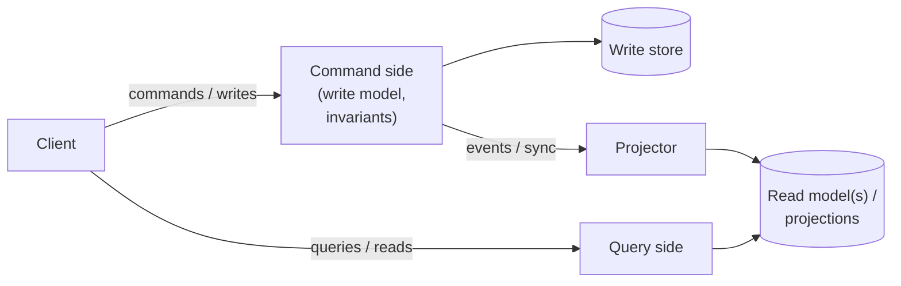

**Worked example — the stale-read a user actually hits.** The projector that updates the
read model lags the write by ~200ms. Trace one user editing their display name:

```
t = 0ms    POST /profile {name: "Sam"}  → command side commits to write store, returns 200
t = 50ms   GET /profile (user refreshes) → query side reads the read model
                                          → projector hasn't caught up yet
                                          → returns OLD name "Samuel"   ← user sees a stale read
t = 200ms  projector applies the ProfileUpdated event → read model now says "Sam"
t = 260ms  GET /profile → returns "Sam"                                 ← consistent again
```

The user "saved" a change and the very next page load still showed the old value — the
classic eventual-consistency surprise. Two standard mitigations: **read-your-writes** —
for *that* user's own request, serve the answer from the write model (or block the read
until the projection catches up), so they always see their own edits; or a
**version/ETag** — the write returns version `v7`, the client polls the read side until
it reports `>= v7` before rendering. Other users, who don't expect immediacy, tolerate
the 200ms lag fine.

**Trade-offs.**
- **Pros:** **independent scaling** of reads vs. writes; each side optimized (write
  model for consistency, read model for query shape); read models can be rebuilt/added
  freely; fits event-driven systems.
- **Cons:** **eventual consistency** between sides (a write may not be immediately
  visible to reads); **more moving parts** (projectors, multiple stores) and higher
  operational complexity; overkill for simple CRUD.
- **Optimizes (-ilities):** read/write scalability and performance; costs consistency
  immediacy and simplicity.
- **When to use:** large read/write asymmetry, complex reporting/query needs over a
  transactional domain, collaborative domains with contention.
- **When to avoid:** simple CRUD apps where a single model (or just read replicas) is
  enough — don't pay the complexity tax.

**Differs from adjacent styles.** Versus **read replicas** (`databases-...-replication`):
replicas serve the *same* schema for read scaling; CQRS uses a *different, query-shaped*
model on the read side. Versus **Event Sourcing**: independent — CQRS separates
read/write models; Event Sourcing changes how state is *stored*. They compose well but
neither requires the other.

> Deep dive: `event-driven-cqrs-saga-cdc` (CQRS + Event Sourcing + saga mechanics).

---

## Event Sourcing

**Problem it solves:** storing only **current, in-place-mutated state** destroys
history — you lose the audit trail, can't answer "what was the state at time T?", can't
replay to fix a bug or build a new view, and you often need those things (finance,
compliance, debugging, analytics).

**What it is / how it works.** Instead of persisting current state and overwriting it,
you persist an **append-only, immutable log of events** ("OrderPlaced," "ItemAdded,"
"OrderShipped"). Current state is a **left fold** over those events: to load an
aggregate, you **replay** its events from the start. To keep replay fast, you take
periodic **snapshots**. New read models can be built at any time by replaying the log
through a new projector. The analogies are a **git history** (commits, not just the
working tree) and an **accounting ledger** (append entries, never erase).

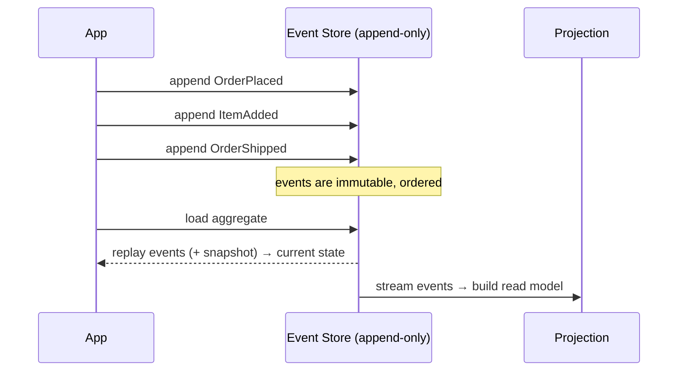

**Worked example — fold a stream into state, then snapshot + tail.** Take a bank
account. The store holds three immutable events; current state is the left fold:

```
start balance = 0
apply Deposited(100) → 0 + 100 = 100
apply Withdrew(30)   → 100 − 30 = 70
apply Deposited(50)  → 70 + 50  = 120     ← current balance
```

There is no "balance" column anywhere — `120` is *derived* by replaying. Now imagine the
account has **53 events** and replaying all of them on every load is wasteful. So you
snapshot: at sequence 50 you persist `snapshot{balance: 900}`. To load, you start from
the snapshot and fold only the **3 tail events** after it (seq 51–53), not all 53:

```
load snapshot(seq 50) → 900
apply Withdrew(200)  → 700
apply Deposited(50)  → 750
apply Withdrew(100)  → 650    ← current balance, from snapshot + 3 events
```

Same answer as a full replay, a fraction of the work. That is why "snapshot + tail" is
the standard read path.

**Trade-offs.**
- **Pros:** complete **audit trail & temporal queries** (state at any point in time);
  **replay** to rebuild state or create new projections; natural fit for CQRS and EDA;
  debugging by replaying exactly what happened.
- **Cons:** **current-state queries** require projections/snapshots (you don't "SELECT"
  current state directly); **schema/event evolution** is hard (old events are immutable —
  need versioning/upcasting); more storage and conceptual overhead; eventual consistency
  on projections.
- **Optimizes (-ilities):** auditability, traceability, and reconstructability; costs
  query ergonomics and evolvability of the event schema.
- **When to use:** domains needing audit/history/temporal reconstruction (finance,
  ledgers, order lifecycles), or where replay-to-new-view is valuable.
- **When to avoid:** simple CRUD with no audit/history need — the overhead isn't worth
  it.

**Differs from adjacent styles.** Versus **CQRS**: orthogonal — Event Sourcing is about
*how state is stored* (events vs. current state); CQRS is about *separating read/write
models*. Versus **CDC**: CDC *derives* an event stream from a DB's existing transaction
log as an integration afterthought; Event Sourcing makes events the **primary source of
truth** by design. Versus a DB **WAL**: the WAL is an internal recovery mechanism, not
the application's domain model.

> Deep dive: `event-driven-cqrs-saga-cdc` (event store, snapshots, CDC contrast).

---

## Choreography vs Orchestration

**Problem it solves:** in a multi-service business process (e.g., a distributed
transaction / **Saga**), **who drives the flow?** Either each service reacts to events
and decides its own next move (**choreography**), or a central conductor tells each
service what to do and when (**orchestration**). Choosing wrong gives you either an
untraceable emergent flow or a coupling bottleneck.

**What it is / how it works.** Two coordination *models* for cross-service workflows
(microservices.io; Azure "Choreography" pattern):
- **Choreography** — no central brain. Each service listens for events and emits its own;
  the workflow is the emergent sum of local reactions. Maximally decoupled.
- **Orchestration** — a central **orchestrator** issues commands to each service in
  sequence, awaits replies, and handles failures/compensation. Centralized control and
  visibility.

This is the **Saga** coordination axis: a choreographed saga vs. an orchestrated saga.

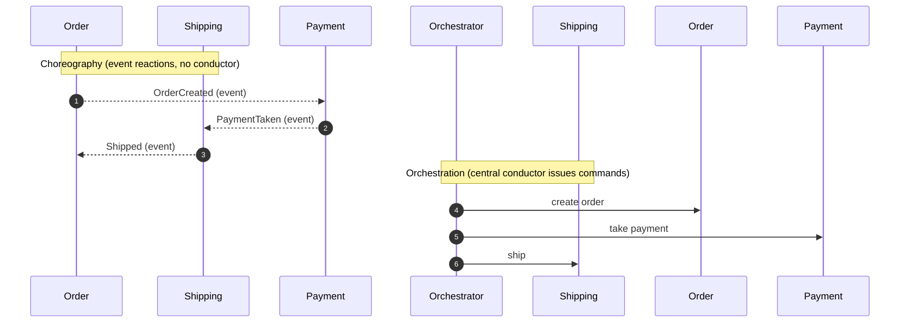

**Trade-offs.**
- **Choreography — pros:** loose coupling, no SPOF, easy to add reactors; **cons:** the
  end-to-end flow is **emergent and hard to trace/monitor**; cyclic event dependencies;
  hard to reason about "what happens next."
- **Orchestration — pros:** explicit, visible, testable flow with **central error
  handling/compensation and restart**; **cons:** orchestrator is a **coupling point /
  potential SPOF**; risks becoming a god-service.
- **Optimizes (-ilities):** choreography → decoupling/extensibility; orchestration →
  controllability/observability/recoverability.
- **When to use:** choreography for simple, few-step, highly independent flows;
  orchestration for complex, many-step flows needing visibility and compensation.
- **When to avoid:** choreography when you need auditable coordinated failure handling;
  orchestration when a central coordinator is needless coupling.

**Differs from adjacent styles.** This is exactly the **EDA broker vs. mediator**
distinction (C1/C2) applied to sagas: choreography ≈ broker, orchestration ≈ mediator.

> Deep dive: `event-driven-cqrs-saga-cdc` (Saga patterns & compensation);
> `aws-serverless-lambda-stepfunctions` (Step Functions = orchestration);
> `microservices-ddd-and-boundaries` (why boundaries drive the choice).

---

## Reactive Architecture

**Problem it solves:** systems must stay **responsive under highly variable load and
partial failure** — a synchronous, thread-per-request, tightly-coupled stack collapses
under bursts and cascades failures. You need one that stretches under load and contains
faults.

**What it is / how it works.** The style codified by the **Reactive Manifesto**, built
on four properties: **Responsive** (bounded latency), **Resilient** (stays responsive
under failure via isolation, replication, delegation), **Elastic** (scales in/out with
load), and **Message-Driven** (an **asynchronous, non-blocking message-passing**
backbone is the *means* that delivers the other three). Practically: non-blocking I/O,
**backpressure** (consumers signal demand so fast producers don't overwhelm slow
consumers — Reactive Streams), bounded resource use, and failure isolation
(bulkheads/supervision). Message-passing decouples components in **time, space, and
failure**.

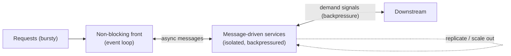

**What breaks without backpressure — a concrete contrast.** A producer emits 10,000
msg/s; the consumer can only handle 1,000 msg/s. With an **unbounded queue** in between,
9,000 msg/s pile up — after 10s that's 90,000 buffered, after a minute ~540,000, and the
heap grows without bound until latency blows up and the process **OOM-crashes**. With
**Reactive Streams demand signalling** the consumer stays in control: it calls
`request(1000)`, the producer sends **at most 1,000** and then *stops* until the consumer
requests more. Throughput self-limits to what the slow side can absorb — memory stays
bounded, nothing crashes, and the pressure propagates upstream (the producer slows, or
sheds load deliberately) instead of silently accumulating.

**Trade-offs.**
- **Pros:** **responsiveness, elasticity, and resilience** under load and failure; high
  resource efficiency (few threads handle many connections); backpressure prevents
  overload collapse.
- **Cons:** **async programming is hard** — non-linear control flow, difficult debugging
  (no clean stack traces), backpressure/streaming complexity, steep learning curve; easy
  to get subtly wrong.
- **Optimizes (-ilities):** responsiveness, elasticity, resilience, resource efficiency;
  costs developer simplicity and debuggability.
- **When to use:** high-concurrency, I/O-bound, latency-sensitive systems (gateways,
  streaming APIs, many long-lived connections) with bursty load.
- **When to avoid:** simple CRUD / low-concurrency services, or CPU-bound work where the
  async model adds complexity without payoff.

**Differs from adjacent styles.** Versus **Event-Driven Architecture**: EDA is about the
*event topology* (who emits/reacts to events); Reactive is the *set of -ilities and the
message-driven discipline* used to build responsive systems — they overlap (both async,
message-driven) but answer different questions. Versus the **Actor model** (Akka/Erlang):
actors are a concrete *concurrency model* that is one common way to *implement* a
reactive system; adjacent, not the same altitude.

> Deep dive: `spring-boot/reactive-webflux` (framework realization);
> `message-queues-and-async`; `networking/realtime-websockets-sse` (long-lived streams).

---

## Complex Event Processing (CEP)

**Problem it solves:** individual low-level events are meaningless alone — you need to
detect **higher-level patterns, correlations, and situations** across **many events over
time**, in **real time** ("3 failed logins from 2 countries within 60s → fraud alert").

**What it is / how it works.** An event-driven **pattern** for real-time correlation. A
**CEP engine** ingests high-volume event streams and continuously evaluates **rules /
pattern queries** (temporal, sequential, aggregate, and correlation conditions across
sliding windows) to emit **derived, higher-level events** when a pattern matches. It is
stateful (it remembers recent events to detect sequences) and is often expressed in an
SQL-like event query language. Distinguish two event styles it works with: **simple
events** (one thing happened) vs. **complex events** (an inferred situation across many).

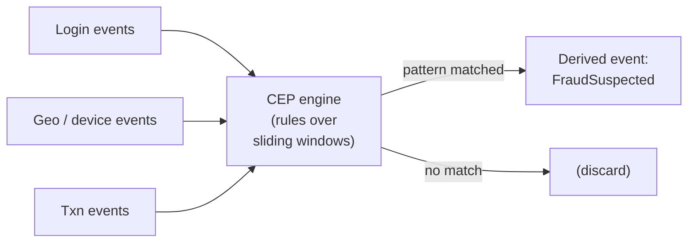

**Trade-offs.**
- **Pros:** powerful **real-time correlation and pattern detection** across many streams;
  declarative rules; turns raw event floods into meaningful business signals.
- **Cons:** **rule-engine complexity** (rules grow tangled and hard to test);
  **state-management overhead** (windows, ordering, late events); tuning for
  high-throughput low-latency is hard.
- **Optimizes (-ilities):** real-time analytical responsiveness and detection latency;
  costs rule maintainability and operational complexity.
- **When to use:** fraud/anomaly detection, algorithmic trading signals, IoT/sensor
  situation detection, real-time monitoring/alerting.
- **When to avoid:** simple per-event handling (a plain consumer suffices) or when
  batch analytics can answer the question without real-time correlation.

**Differs from adjacent styles.** Versus **Stream Processing**: stream processing is
general transformation/aggregation over a stream; CEP specializes in **pattern/
correlation detection** (sequences, temporal rules) and emitting inferred situations —
CEP is often built *on* a stream processor.

> Deep dive: `realtime-streaming-systems`.

---

## Common follow-up questions

- **"Pipe-and-Filter vs. Chain of Responsibility?"** Different altitudes:
  pipe-and-filter is a *system* data-flow style where every stage transforms and passes
  data along; CoR is an *object* pattern where one handler in a chain claims a request
  and stops. Don't conflate the two.
- **"When would you choose Kappa over Lambda?"** When a single replayable log + one
  stream engine can meet your correctness needs — Kappa removes Lambda's dual code paths.
  Stay with Lambda (or add a warehouse) when heavy ad-hoc historical/OLAP analytics
  dominate.
- **"Broker vs. mediator EDA topology?"** Broker = no coordinator, maximal
  scalability/extensibility, weak workflow control; mediator = central orchestrator,
  strong error handling/visibility, coupling/SPOF risk. Same axis as choreography vs.
  orchestration for sagas.
- **"Does CQRS require Event Sourcing (or vice versa)?"** No — they're orthogonal and
  merely compose well. CQRS separates read/write models; Event Sourcing changes how state
  is stored.
- **"Event Sourcing vs. CDC?"** Event Sourcing makes events the primary source of truth
  by design; CDC derives an event stream from a database's existing transaction log after
  the fact. Deep dive: `event-driven-cqrs-saga-cdc`.
- **"Reactive vs. Event-Driven — same thing?"** Overlapping but distinct: EDA is the
  event *topology*; Reactive is the *-ilities discipline* (responsive/resilient/elastic)
  delivered via non-blocking message-passing and backpressure.
- **"Which -ility does this style optimize?"** Be ready to name it: pipe-and-filter →
  modularity/reusability; batch → throughput/cost; stream → latency/freshness; broker EDA
  → scalability/extensibility; mediator EDA → controllability/recoverability; CQRS →
  read/write scalability; Event Sourcing → auditability; Reactive → resilience/elasticity.
- **"How is this group different from the `dp-*` Design Patterns group?"** Altitude:
  `arch-*` styles structure a *whole application/deployment*; `dp-*` patterns structure
  *classes and objects* within a process.

## References

- Mark Richards, *Software Architecture Patterns* (O'Reilly) — Event-Driven Architecture
  (broker vs. mediator topologies), data-flow styles.
- Mark Richards & Neal Ford, *Fundamentals of Software Architecture* (O'Reilly) —
  event-driven, pipes-and-filters, and the architecture-characteristics (-ilities)
  framing.
- Buschmann et al., *Pattern-Oriented Software Architecture, Vol. 1 (POSA)* — Pipes and
  Filters, Publisher-Subscriber, Broker.
- Garlan & Shaw, *An Introduction to Software Architecture* — data-flow taxonomy
  (batch-sequential and pipe-and-filter).
- martinfowler.com — "CQRS," "Event Sourcing," "Reporting Database," "What do you mean
  by Event-Driven?"
- microservices.io — Saga, Choreography vs. Orchestration, CQRS, Event Sourcing.
- Microsoft Azure Architecture Center — Event-Driven, CQRS, Pipes and Filters,
  Choreography, Competing Consumers.
- Jay Kreps, "Questioning the Lambda Architecture" (O'Reilly Radar) — Kappa.
- Nathan Marz, *Big Data* — Lambda Architecture.
- *The Reactive Manifesto* (reactivemanifesto.org).
- Alistair Cockburn (Ports & Adapters), Jeffrey Palermo (Onion), Robert C. Martin (Clean
  Architecture) — referenced as adjacent structural styles in the sibling `arch-*` topics.
