# Distributed & Infrastructure Architectures

This topic surveys the **system-level architectural *styles*** used to structure
and deploy a distributed application across multiple processes, nodes, and
infrastructure tiers. Each style is a *topology* — a decision about *where code
runs, who owns which data, and how the parts talk*.

> [!KEY-TAKEAWAY]
> **Altitude matters.** These are SYSTEM-LEVEL styles — how a *whole
> application* is partitioned across processes/nodes and deployed. That is a
> *different altitude* from the object-level GoF **Design Patterns** group
> (`dp-*`), which structures classes/objects *inside one deployable unit*. A
> single microservice (an arch style) can internally use Repository, Factory,
> and Strategy (design patterns). When an interviewer says "architecture," ask
> *which altitude* — deployment topology or in-process object design.

**Family scope boundary.** This topic covers *distributed / multi-node /
infrastructure* topologies. Application-*internal* structure styles —
Layered/N-tier-*logical*, Modular Monolith, Microkernel/Plugin,
Pipeline/Pipe-and-Filter, and the **Hexagonal / Ports-&-Adapters** (Cockburn) /
**Onion** (Palermo) / **Clean** (Martin) family — are about the internal shape
of *one* deployable and belong to a **separate application-structure `arch-*`
topic**. They are referenced here as adjacent but are not deep-dived.

> [!INTERVIEW]
> The winning move in an architecture interview is never "pick the trendy one."
> It is naming the **forces** (team count, traffic shape, consistency needs,
> ops maturity, blast-radius tolerance) and mapping them to a style's
> trade-offs. Styles move complexity around; they never delete it.

**A term you'll see in every trade-off below: the "-ilities."** Each style ends
with an *-ilities* line. *-ilities* is architecture shorthand for the **quality
attributes / non-functional requirements** a style optimizes or sacrifices —
**scal**ability, **avail**ability, **oper**ability, **evolv**ability,
**test**ability, port**ability**, and so on (they mostly end in "-ility," hence
the nickname). Functional requirements say *what* the system does; the -ilities
say *how well* it does it under scale, failure, and change — and naming which
-ilities a style buys and which it spends is the fastest way to make a trade-off
concrete rather than hand-wavy.

---

## Client-Server and N-Tier

**Problem it solves:** Centralize shared data and logic on a server so that many
clients share *one authoritative source* instead of each holding its own
divergent copy.

**How it works / key components.** A **client** initiates requests; a **server**
holds shared state and services them. Deployment tiers describe how many
physical/process boundaries the request crosses:

- **2-tier** — client talks directly to a database/server (classic desktop app +
  DB). Business logic lives in a **thick client** or in DB stored procedures.
- **3-tier** — presentation (client) → application/business logic tier → data
  tier. The dominant web shape: browser → app server → database.
- **N-tier** — additional tiers (caching, integration, gateway) inserted for
  scale or separation.
- **Thin vs thick client** — a *thin* client (browser) pushes compute to the
  server (more network, central control); a *thick* client (desktop/mobile app)
  does local compute (less network, harder to update, richer offline).

> [!TIP]
> Don't confuse **N-tier deployment** (physical process/host boundaries) with
> **layered logical architecture** (presentation/business/persistence code
> layers *inside* one process). You can run a layered monolith on a single
> host (1 deployment tier) — the layers are logical, the tiers are physical.

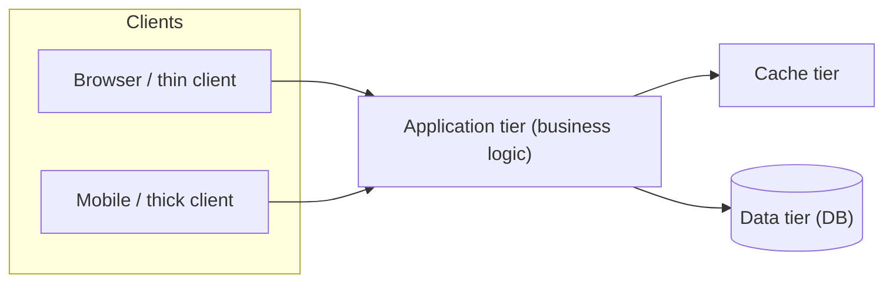

**Trade-offs.**
- *Pros:* simple mental model; central control of data and security; easy
  backup/consistency; strong (single-DB) consistency; cheap to start.
- *Cons:* the server/DB is a **scaling bottleneck and single point of failure**;
  vertical-scaling ceiling; a busy tier throttles everyone.
- *When to use:* the default for most line-of-business and web apps; small–mid
  scale; teams that want simplicity.
- *When to avoid:* extreme scale where one central tier cannot keep up, or when
  you need independent team deploys / fault isolation.
- *-ilities:* optimizes **simplicity** and **consistency**; weaker on
  **scalability** and **availability** (central bottleneck).

**How it differs from adjacent styles.** It is the *foundational* asymmetric
topology — one side serves, the other consumes. **Peer-to-Peer** is its inverse
(every node is both). **Microservices/SOA** partition the *server side* into many
cooperating services. **N-tier logical layering** is code organization, not a
deployment topology.

---

## Peer-to-Peer (P2P)

**Problem it solves:** Remove the central server bottleneck / single point of
failure *entirely*, so capacity and resilience grow with the number of
participants rather than being capped by one server.

**How it works / key components.** Every **peer** is simultaneously a client and
a server (a "servent"): it both requests and serves resources. There is no
central authority. Two families:

- **Unstructured** (e.g. Gnutella) — peers connect ad hoc; lookups use
  **flooding**/random walks. Robust to churn but lookups are expensive and give
  no guarantee a rare item is found.
- **Structured / DHT** (Distributed Hash Table — e.g. Chord, Kademlia) — keys and
  nodes share an ID space; content lookup is **O(log N)** hops with a
  correctness guarantee. Underpins BitTorrent's tracker-less mode and IPFS.
- **Blockchain** applies P2P + consensus so a leaderless network agrees on an
  append-only ledger.

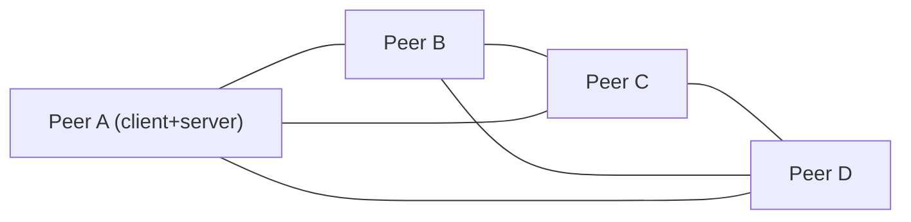

**Worked example — why "O(log N) hops" matters (1,000,000-node DHT).** In a
structured DHT (Chord-style), each hop roughly *halves* the ID-space distance to
the target key. Start with the whole ring of 1,000,000 nodes as candidates and
keep halving: 1,000,000 → 500,000 → 250,000 → … → 1. That takes ⌈log₂(1,000,000)⌉
hops, and since 2²⁰ = 1,048,576 ≈ 1M, the lookup lands on the responsible node in
about **20 hops** — touching ~20 nodes total, with a guarantee the key is found if
it exists. Contrast unstructured **flooding**: a peer with ~8 neighbours that
floods to depth 4 fans out to as many as 8⁴ = 4,096 nodes for *one* query, still
with **no guarantee** a rare item is reached. Same network — ~20 targeted messages
with a guarantee versus thousands of broadcast messages without one. That gap is
the entire reason DHTs exist.

**Trade-offs.**
- *Pros:* no central SPOF; capacity scales with peers; resilient to node churn;
  no central hosting cost.
- *Cons:* **hard consistency, discovery, trust and security**; freeloaders;
  content-lookup guarantees depend on structured vs unstructured; NAT traversal
  pain; hostile-peer / Sybil defense.
- *When to use:* file sharing (BitTorrent), content addressing (IPFS),
  decentralized ledgers (blockchain), collaboration overlays.
- *When to avoid:* when you need authoritative state, strong consistency, or
  central policy/audit control.
- *-ilities:* optimizes **scalability with participants** and **fault tolerance**;
  weak on **consistency** and **security/governance**.

**How it differs from adjacent styles.** It is the *inverse* of Client-Server
(symmetric nodes, no dedicated server). It differs from **Broker** in that P2P
has no central intermediary routing messages. Blockchain-style consensus is a
deep topic — **Deep dive: see `consensus-clocks-and-time`** for leader election,
Paxos/Raft, and logical clocks.

---

## Microservices

**Problem it solves:** Let teams build, deploy, and scale small business
capabilities *independently*, so one large codebase and release no longer forces
every team into lock-step change.

**How it works / key components.** The system is decomposed into many small,
**independently deployable** services organized around **business capabilities**.
The enabling constraint is **database-per-service** (private data — no other
service reads your tables). Services talk over lightweight protocols (REST/gRPC/
messaging) — "**smart endpoints, dumb pipes**." An **API gateway** fronts
clients; observability (tracing, metrics, logs) and CI/CD per service are
prerequisites, not extras.

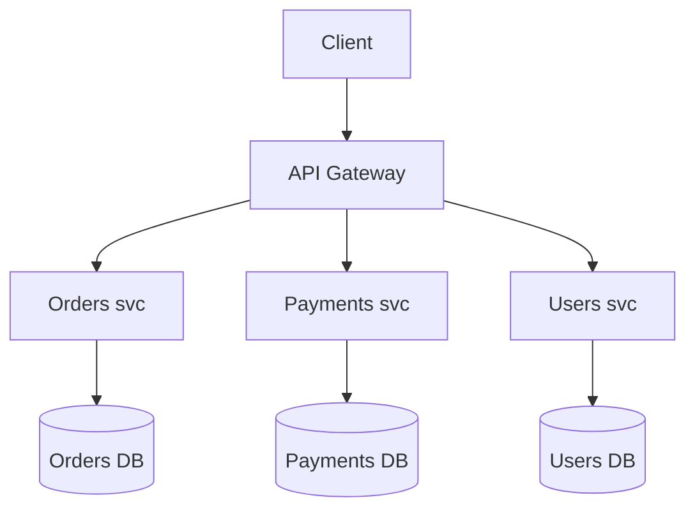

**Architectural treatment (overview only).** Microservices trade a *large
codebase* problem for a *distributed-systems* problem: the in-process function
call becomes a network hop that can fail, adds latency, and has no shared
transaction (hence sagas / eventual consistency). Sharing a database across
services produces a **distributed monolith** — the ops cost of microservices with
none of the independence.

**Worked example — a traced order, with a failure that triggers saga
compensation.** There is no cross-service transaction, so a multi-step flow is
stitched together with local commits plus *compensating* actions on failure.
Trace one order where Payments fails:

1. `Client → Gateway → Orders svc`: Orders writes `order #4711 = PENDING` to its
   *own* DB and commits. (Local commit — no distributed transaction.)
2. `Orders → Inventory svc`: reserve 2 units of SKU-9. Inventory commits
   `reserved += 2`. Success.
3. `Orders → Payments svc`: charge $60. The card is declined — **step fails**.
4. There is no shared rollback, so the saga runs **compensating** steps in
   reverse for what already committed: `Inventory.release(SKU-9, 2)` (undo step 2),
   then `Orders.markFailed(#4711)` → `CANCELLED`.
5. Net effect: inventory is back to its original count and the order ends
   `CANCELLED`. The system is consistent again — but only **eventually**, and
   there was a window where inventory showed 2 units reserved for an order that
   never paid. That window is the price of trading a DB transaction for a saga.

> [!KEY-TAKEAWAY]
> **Deep dive: see `microservices-monolith-api-design`** (decomposition,
> monolith vs modular monolith vs microservices, API design) and
> **`microservices-ddd-and-boundaries`** (bounded contexts, where to cut).

**Trade-offs.**
- *Pros:* independent deploy + independent scaling per service; team autonomy;
  fault isolation; tech heterogeneity.
- *Cons:* heavy **operational and distributed-systems complexity** (network,
  data consistency, observability, testing); latency of hops.
- *When to use:* many teams blocking on each other's deploys; components with
  very different scaling profiles.
- *When to avoid:* small teams / early products (start with a modular monolith).
- *-ilities:* optimizes **deployability** and **scalability**; costs
  **operability** and cross-service **consistency**; **testability** shifts to
  contract/integration testing.

**How it differs from adjacent styles.** Versus **SOA**: microservices are
*fine-grained, autonomous, dumb-pipes*; SOA is *coarse-grained, shared canonical
model, smart ESB*. Versus **monolith**: independent deployability. Versus
**Serverless**: services are long-running and self-managed, not ephemeral
functions on managed infra.

---

## Service-Oriented Architecture (SOA)

**Problem it solves:** Reuse and integrate *heterogeneous enterprise systems*
behind standardized service contracts mediated by a central bus, so mainframes,
ERPs, and new apps can interoperate without point-to-point spaghetti.

**How it works / key components.** Coarse-grained enterprise services expose
contracts; consumers reach them through an **Enterprise Service Bus (ESB)** that
provides routing, transformation, protocol bridging, and orchestration. A
**shared canonical data model** standardizes messages. Governance is centralized;
services are often organized as business / enterprise / infrastructure /
application service tiers.

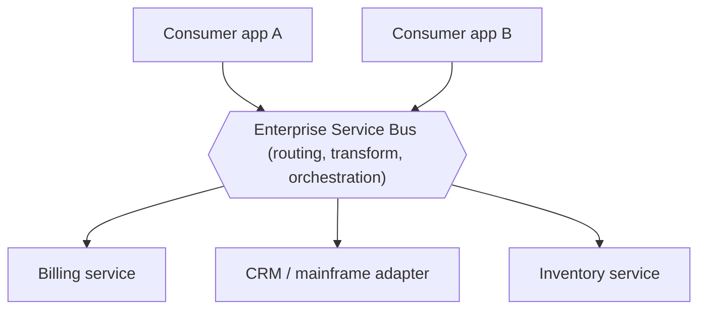

**Trade-offs.**
- *Pros:* enterprise-wide reuse and integration; protocol/format mediation in one
  place; central governance and security.
- *Cons:* the **ESB centralizes logic** ("smart pipes") → coupling and bottleneck;
  a **shared canonical model** couples services to one schema; slow governance;
  hard to change one service without coordination.
- *When to use:* large enterprises integrating many pre-existing heterogeneous
  systems where central governance is a requirement.
- *When to avoid:* green-field products needing team autonomy and rapid
  independent deploys.
- *-ilities:* optimizes **reuse** and **interoperability**; weak on
  **deployability** and **evolvability** (ESB + shared model).

**How it differs from adjacent styles.** SOA is the direct contrast to
**Microservices**: *smart pipes + shared model + coarse services* vs *dumb pipes +
private data + fine services*. The **anti-pattern** to name is the **Distributed
Monolith** — microservices deployment cost with SOA-like coupling (services that
must deploy in lock-step). See `microservices-ddd-and-boundaries` for how bad
boundaries cause it.

---

## Serverless and FaaS

**Problem it solves:** Eliminate server provisioning and idle cost by running
stateless functions *on demand*, billed per invocation, scaling automatically
(including scale-to-zero).

**How it works / key components.** **FaaS** (Functions-as-a-Service) runs small,
stateless, **event-triggered**, ephemeral functions on managed infrastructure;
the platform handles provisioning, scaling, and patching. **BaaS**
(Backend-as-a-Service) supplies managed databases, auth, and storage. State must
live *outside* the function (DB, object store, cache). Functions are wired to
event sources (HTTP, queue, storage event, schedule).

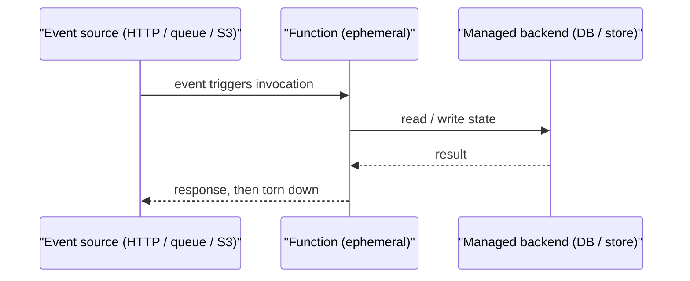

**Architectural treatment (overview only).** Serverless pushes elasticity and ops
to the platform; you pay only for execution. Costs: **cold starts** (the latency
to spin up a fresh runtime for the first request to a new instance — roughly
**tens of milliseconds** for a small interpreted/Node/Python function up to
**one-to-a-few seconds** for a heavy JVM/.NET runtime or a large dependency
bundle), execution-time and memory/state limits, and **vendor lock-in** through
proprietary triggers and services. Orchestrating multi-step workflows needs a
state machine (e.g. Step Functions) rather than in-function loops.

**Worked example — where FaaS stops being cheaper than an always-on VM.** Take a
512 MB function (0.5 GB) that runs 100 ms (0.1 s) per call. Lambda-style pricing
is roughly **$0.0000166667 per GB-second** of compute plus **$0.20 per 1M
requests**:
- compute per call = 0.5 GB × 0.1 s × $0.0000166667 = **$0.000000833**
- request fee per call = $0.20 / 1,000,000 = **$0.000000200**
- total ≈ **$0.00000103 per invocation**, i.e. ~**$1.03 per million calls**.

Now compare a small always-on VM at ~**$30/month**. The crossover is where
monthly invocations N satisfy N × $0.00000103 = $30 → N ≈ **29 million
invocations/month**. Spread evenly that is ~29M / 2.6M s ≈ **11 requests/second**
sustained. Below ~11 req/s of steady load (or for spiky traffic that sits idle
most of the day) serverless wins because you pay nothing while idle; above it,
the idle-free VM you're already fully utilizing is cheaper. This is exactly why
"spiky/low-baseline → serverless, steady high-throughput → provisioned compute"
is the right instinct.

> [!WARNING]
> **Concurrency limits and downstream connection storms.** Auto-scaling to
> thousands of concurrent function instances can *melt the database behind them*:
> if each of 5,000 concurrent invocations opens one connection, that's 5,000
> connections against an RDS instance capped near a few hundred — a thundering
> herd that exhausts the pool. Mitigations: a managed connection proxy (e.g. RDS
> Proxy) to multiplex connections, reserved/maximum-concurrency caps to throttle
> the fan-out, and **provisioned concurrency** to pre-warm instances and remove
> cold-start latency on the hot path.

> [!KEY-TAKEAWAY]
> **Deep dive: see `aws-serverless-lambda-stepfunctions`** (Lambda execution
> model, Step Functions orchestration) and **`aws-compute-ec2-fargate-lambda`**
> (compute-model trade-offs).

**Trade-offs.**
- *Pros:* no infra ops; automatic elastic scale incl. scale-to-zero; fine-grained
  pay-per-use; fast to ship.
- *Cons:* cold-start latency; time/memory limits; statelessness forces external
  state; observability/debugging harder; vendor lock-in.
- *When to use:* spiky/event-driven workloads, glue/integration, low-baseline
  traffic, cron/ETL, webhooks.
- *When to avoid:* steady high-throughput low-latency services (idle-free VMs may
  be cheaper), long-running or stateful compute.
- *-ilities:* optimizes **scalability** and **cost-at-low-utilization** and
  **operability** (managed); costs **performance** (cold start) and **portability**.

**How it differs from adjacent styles.** Versus **Microservices**: functions are
finer-grained ("nano-services"), ephemeral, and infra is managed. Versus
**Event-Driven**: serverless is a *deployment/runtime* model that is often
event-*triggered*, but EDA is the broader interaction style (functions are one way
to implement event consumers).

---

## Space-Based Architecture

**Problem it solves:** Sustain **extreme, spiky, high-volume concurrent load** by
removing the central database from the request path — the usual scalability
bottleneck — using replicated in-memory data instead.

**Intuition.** Picture a **shared in-memory whiteboard** replicated onto every
worker: because each worker already has the full working set in RAM, *any* worker
can serve *any* request without ever calling the database. The four "grids" are
just the plumbing around that whiteboard — one routes work to workers, one *is*
the replicated whiteboard, one coordinates work that spans workers, and one
spins workers up and down. The term **tuple space** comes from the Linda /
JavaSpaces model: a shared associative memory that processes read from and write
to by pattern, like a blackboard nobody owns. The whole payoff is latency scale:
a read served from local RAM is on the order of **microseconds (~µs)**, whereas a
round-trip to a shared database is on the order of **milliseconds (~ms)** — three
orders of magnitude slower — so keeping the working set in memory turns a
per-request DB call into a local lookup.

**How it works / key components.** Named after the **tuple space** / in-memory
data grid idea. Requests hit stateless **processing units (PUs)** that keep the
working data set **in memory**, replicated across PUs. A **virtualized
middleware** coordinates the grid via four conceptual grids:

- **Messaging grid** — routes requests to PUs.
- **Data grid** — replicates in-memory data across PUs (the heart of the style).
- **Processing grid** — coordinates multi-PU requests.
- **Deployment grid** — dynamically starts/stops PUs (elasticity).

An asynchronous **data writer/reader** eventually persists the in-memory data to a
backing database off the hot path.

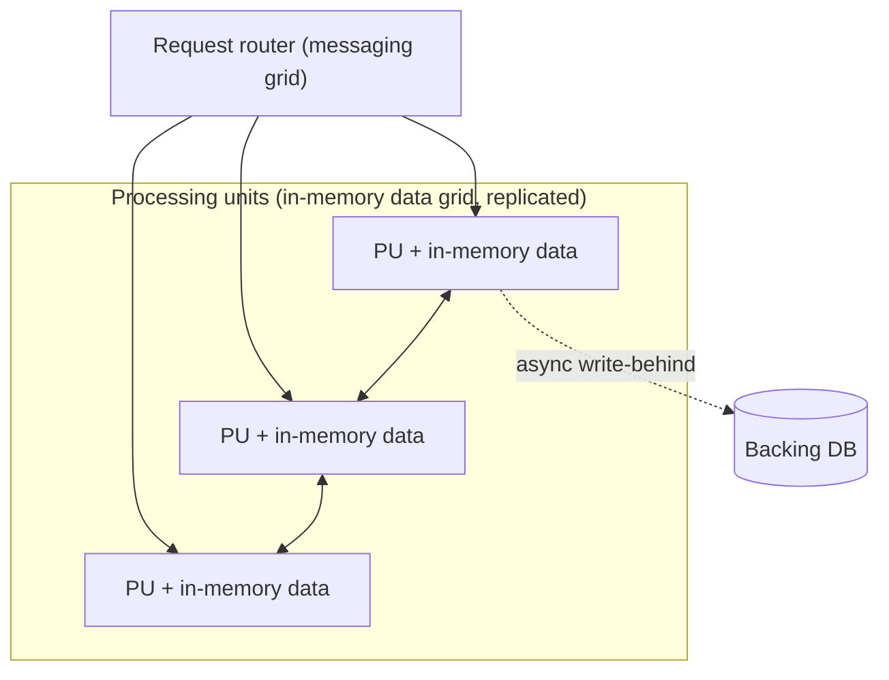

**Architectural treatment (overview only).** By replicating state in memory and
persisting asynchronously, throughput scales near-linearly and the DB stops being
the bottleneck. The in-memory-grid *mechanics* (replication, eviction, cache
coherence) overlap heavily with caching.

**Worked example — throughput scaling and the data-loss window.** Say one PU
serves 5,000 req/s from memory. Because requests are served from replicated RAM,
not a shared DB, adding PUs adds throughput almost linearly: 4 PUs ≈ 20,000 req/s,
10 PUs ≈ 50,000 req/s — the DB is off the request path, so there's no central
bottleneck to saturate. The cost lives in the **write-behind lag**. Suppose the
grid takes 10,000 writes/s and the async data writer flushes to the backing DB
every 4 seconds. At any instant up to 10,000 writes/s × 4 s = **40,000 writes**
exist *only* in memory, not yet durable. If a PU (and its replicas) is lost inside
that window, those ~40,000 updates are gone — that 4-second lag is your concrete
data-loss exposure, and it's exactly why this style is disqualified for a
financial ledger but fine for a gaming leaderboard.

> [!KEY-TAKEAWAY]
> **Deep dive: see `caching-and-cdn`** and **`aws-caching-elasticache-dax`** for
> in-memory grid / distributed cache mechanics.

**Trade-offs.**
- *Pros:* near-linear elastic scale; very high throughput and low latency (memory,
  not disk); handles unpredictable spikes.
- *Cons:* **eventual consistency** (async write-behind); **data-loss / restart
  risk** if the grid loses nodes before persistence; complex grid/caching ops;
  memory cost.
- *When to use:* extreme concurrent high-volume workloads with unpredictable
  spikes (trading, ticketing, bidding, gaming leaderboards).
- *When to avoid:* strong-consistency financial ledgers where in-memory loss is
  unacceptable; low/steady load (overkill).
- *-ilities:* optimizes **scalability** and **performance**; costs
  **consistency** and **durability** and **operability**.

**How it differs from adjacent styles.** Unlike Client-Server/N-tier and
Microservices, it deliberately **removes the shared DB from the request path**.
Unlike a mere cache tier, the in-memory grid *is* the system of record during
processing, with the DB relegated to asynchronous persistence.

---

## Broker Architecture

**Problem it solves:** Decouple senders from receivers in *location and time*, so
components communicate without knowing each other's identity, address, or
availability directly.

**How it works / key components.** A **broker** (POSA vol.1 pattern) is a central
intermediary. Producers publish messages to the broker (often to **queues** or
**topics**); the broker routes/delivers them to consumers. Consumers can be
offline when a message is sent (temporal decoupling) and are discovered via the
broker (location transparency). Adds durability, buffering, and delivery
guarantees.

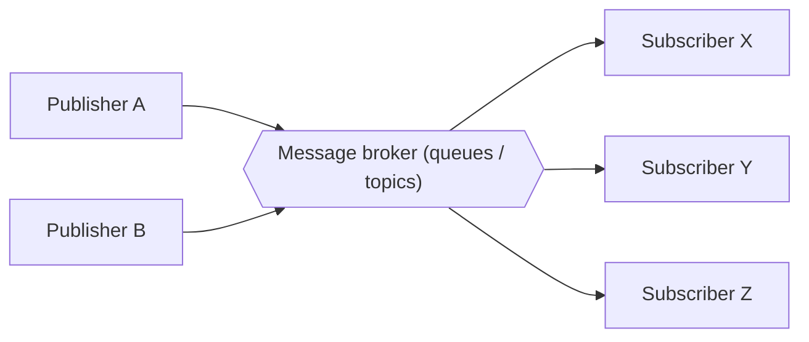

**Architectural treatment (overview only).** The broker absorbs load spikes
(buffering), enables fan-out (pub/sub), and lets producers and consumers scale and
fail independently. The cost is a new critical piece of infra to run and monitor.

**Worked example — at-least-once redelivery, and why the consumer must be
idempotent.** Most brokers guarantee *at-least-once* delivery: a message is
redelivered until the consumer acknowledges it, so a lost ack means a duplicate.
Trace it for a "charge $60" message with `messageId = m-88`:

1. Broker delivers `m-88`. Consumer charges $60 and writes the charge — but
   **crashes before sending the ack**.
2. The unacked message stays on the queue; the broker redelivers `m-88`.
3. A *naive* consumer charges $60 **again** → the customer is billed $120.
4. An **idempotent** consumer keeps a processed-set keyed by `messageId`: on the
   redelivery it sees `m-88` is already recorded, skips the charge, and just
   re-acks. Net effect: charged once, even though the message arrived twice.

The dedup key is the fix — at-least-once delivery makes duplicates a *when*, not
an *if*, so idempotency is mandatory, not optional.

> [!KEY-TAKEAWAY]
> **Deep dive: see `message-queues-and-async`** for queues vs pub/sub, delivery
> semantics (at-least/at-most/exactly-once), ordering, DLQs, and backpressure.

**Trade-offs.**
- *Pros:* loose coupling (location + time); load leveling/buffering; fan-out;
  independent scaling and failure of endpoints.
- *Cons:* broker is a potential **SPOF / bottleneck** (mitigated by clustering);
  harder **end-to-end tracing**; added latency and operational surface;
  at-least-once delivery forces idempotency.
- *When to use:* async workflows, work queues, fan-out notifications, buffering
  spikes, integrating decoupled services.
- *When to avoid:* strict low-latency synchronous request/response; simple
  in-process calls.
- *-ilities:* optimizes **decoupling** and **resilience** (buffering); costs
  **traceability** and adds an infra dependency.

**How it differs from adjacent styles.** Broker is the *messaging topology*
underpinning much of **Event-Driven Architecture** (the broker topology of EDA).
Unlike **P2P**, there *is* a central mediator. Unlike direct microservice REST
calls, communication is indirect and asynchronous.

---

## Event-Driven Architecture (EDA)

**Problem it solves:** Let components react to *state-change events*
asynchronously, so producers and consumers can evolve, scale, and fail
independently without a central request/response controller.

**How it works / key components.** Components emit and consume **events** (facts
about something that happened). Two canonical topologies (Richards):

- **Broker topology** — events flow through lightweight channels/topics; consumers
  react and may emit further events. **Choreography** — no central coordinator;
  highly decoupled, harder to trace.
- **Mediator topology** — a central **event mediator** orchestrates a known
  multi-step workflow (**orchestration**); easier error handling and monitoring,
  but the mediator is a coupling point.

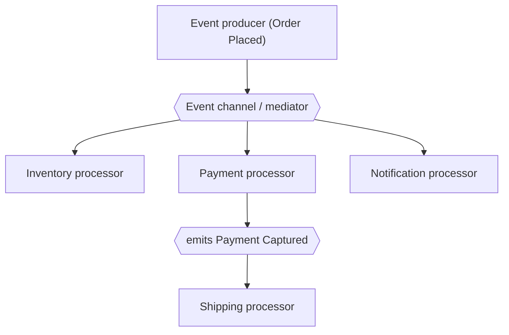

**Architectural treatment (overview only).** EDA maximizes decoupling and
scalability but you lose a single, readable control flow: reasoning becomes
"what reacts to what," debugging spans many hops, and you inherit **eventual
consistency**, **ordering**, and **duplicate** concerns. Patterns like CQRS,
Event Sourcing, Saga, and CDC formalize event-based data flows.

> [!TIP]
> When an interviewer says "we need exactly-once," don't promise it. True
> **exactly-once *delivery*** is effectively unachievable end-to-end in
> distributed messaging (a sender can never distinguish "message lost" from
> "ack lost," so it must retry, which can duplicate). What real systems ship is
> **at-least-once delivery + idempotent consumers** — dedup on a stable key so a
> re-delivery is a no-op — which yields *exactly-once **effect*** ("effectively-once").
> See the Broker worked example above and **`message-queues-and-async`**.

> [!KEY-TAKEAWAY]
> **Deep dive: see `event-driven-cqrs-saga-cdc`** for CQRS, Event Sourcing, Saga
> (choreography vs orchestration), and Change Data Capture.

**Trade-offs.**
- *Pros:* extreme decoupling; high scalability and responsiveness; easy to add new
  consumers; natural fit for real-time and streaming.
- *Cons:* no single control flow → hard to trace/debug; eventual consistency;
  ordering and exactly-once are hard; testing whole workflows is complex.
- *When to use:* real-time reactions, high-throughput async pipelines, systems
  where many consumers care about the same facts.
- *When to avoid:* simple CRUD with strong-consistency needs and a single obvious
  request/response flow.
- *-ilities:* optimizes **scalability**, **extensibility**, **responsiveness**;
  costs **consistency** and **testability/observability**.

**How it differs from adjacent styles.** EDA's broker topology *uses* the
**Broker** style as plumbing but is the broader *interaction* style. Versus
**Microservices**: microservices is about service *boundaries/deployment*; EDA is
about *how* they communicate (many event-driven systems are also microservices).

---

## Cell-Based Architecture

**Problem it solves:** Contain **blast radius** — so a failure, poison request, or
overload affects only *one* self-contained partition ("cell"), never the whole
fleet.

**How it works / key components.** Traffic is partitioned across independent,
self-contained **cells**, each a complete instance of the stack (compute + data)
serving a *shard* of traffic (by customer, tenant, or key). A thin **cell router
/ mapping layer** deterministically routes each request to its cell. Cells share
nothing; a failure is bounded to the cells it touches. This is the **bulkhead**
principle applied at fleet scale (AWS cell-based / availability-focused designs).

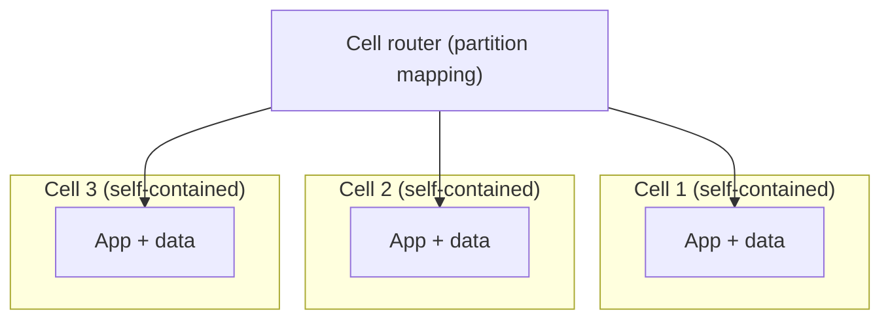

**Architectural treatment (overview only).** Cells cap the percentage of users a
single fault can affect (e.g. 1 of N cells = 1/N blast radius) and allow
incremental, per-cell deployments (canary a new version to one cell). The router
must itself be simple and highly available or it becomes the SPOF.

**Worked example — blast radius with 20 cells.** Put 1,000,000 customers behind
**20 cells**, ~50,000 customers each. Now a poison request or a bad deploy takes
down a cell:
- *Without* cells (one big fleet): the fault hits the shared stack → **100%** of
  customers (all 1,000,000) affected.
- *With* 20 cells: the fault is contained to its cell → 50,000 / 1,000,000 =
  **5%** (1/20) affected; the other 19 cells serve normally.

Deploys use the same math: canary the new version to **one** cell first. If it's
bad, the blast radius is that one cell (5%), and you roll back before touching the
remaining 19. Going from 20 → 50 cells shrinks the worst case further to 1/50 =
2% — you buy isolation by adding cells, at the cost of more duplicated capacity.

**Keeping the router from becoming the SPOF.** The reason a bad router would undo
everything is that *every* request passes through it, so a router outage is a
100%-blast-radius event — the exact thing cells exist to prevent. The standard
resolution is to keep the routing layer a **thin, deterministic mapping** (e.g. a
static `customerId → cell` table or a hash), with **no per-request business
logic** and no shared mutable state, so it can be replicated widely and cached at
the edge. The genuinely hard part is **cross-cell rebalancing/migration**: moving
a customer from an overloaded cell to another means moving their data while
keeping the mapping consistent, so teams add cells (and split traffic) far more
often than they migrate existing tenants between cells.

> [!KEY-TAKEAWAY]
> **Deep dive: see `resilience-tradeoffs-deep-dive`** (bulkhead / blast-radius
> containment) and **`aws-resilience-multiregion-dr`** (cell-based, zonal/regional
> isolation).

**Trade-offs.**
- *Pros:* strong **fault isolation** and bounded blast radius; safer incremental
  deploys; scales by adding cells; noisy-neighbor containment.
- *Cons:* **routing-layer complexity**; per-cell capacity overhead/duplication;
  cross-cell operations and rebalancing are hard; more infra to manage.
- *When to use:* high-availability, multi-tenant, or mission-critical systems that
  must limit correlated failure.
- *When to avoid:* small systems where the overhead/duplication outweighs the
  isolation benefit.
- *-ilities:* optimizes **availability** and **fault isolation**; costs
  **operational complexity** and some efficiency (duplication).

**How it differs from adjacent styles.** Sharding partitions *data* for scale;
cell-based partitions the *entire stack* for **isolation** (scale is a bonus).
Unlike plain microservices, cells replicate the *whole* topology per partition
rather than splitting by capability.

---

## Service Mesh

**Problem it solves:** Move cross-cutting *network* concerns (mTLS, retries,
timeouts, load balancing, telemetry) *out of application code* and into a uniform
infrastructure layer, so every service gets them consistently without library
sprawl.

**How it works / key components.** A **sidecar proxy** is deployed alongside each
service instance; all service-to-service traffic flows through the sidecars — the
**data plane**. A **control plane** configures the proxies (policy, routing,
certificates, telemetry collection). The app makes ordinary local calls; the mesh
transparently adds mTLS, retries/circuit-breaking, traffic shifting
(canary/blue-green), and observability.

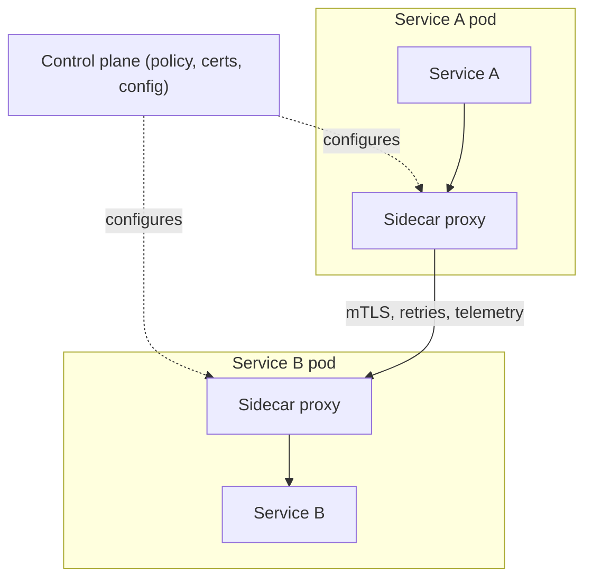

**Architectural treatment (overview only).** The mesh standardizes L7 traffic
control and gives uniform observability and zero-trust security without editing
each service. The cost is a proxy hop per call (latency + CPU/memory) and a
non-trivial platform to operate. As an order-of-magnitude anchor, each sidecar
hop typically adds on the order of **~0.5–2 ms** of latency per call plus a
fixed **CPU/memory** tax per pod (a proxy process running next to every
instance); in a chain of 5 service-to-service calls that's a request passing
through 10 proxies, so single-digit milliseconds of mesh overhead can dominate
an otherwise sub-millisecond call chain — which is why latency-critical hot paths
sometimes opt out.

> [!INTERVIEW]
> **"What's new in service mesh?"** The per-instance sidecar's latency and
> resource overhead is exactly what motivated **sidecar-less / ambient meshes**:
> Istio *ambient mode* and eBPF-based **Cilium** move L4 handling into a shared
> node-level component (and handle L7 only where needed), so most calls avoid a
> dedicated per-pod proxy hop. The trade-off is weaker per-instance isolation and
> a fuzzier security boundary in exchange for lower overhead — naming this keeps
> the answer from sounding a version behind.

> [!KEY-TAKEAWAY]
> The **Sidecar** and **Ambassador** building blocks are object/deployment-level
> *patterns*. **Deep dive: see `dp-distributed-cloud`** for Sidecar, Ambassador,
> and related cloud patterns.

**Trade-offs.**
- *Pros:* uniform mTLS/zero-trust, retries, circuit breaking, and telemetry across
  polyglot services; traffic shifting; no app-code changes.
- *Cons:* **sidecar latency and resource overhead** (a proxy per instance);
  operational complexity; another control plane to run and upgrade.
- *When to use:* large polyglot microservice fleets needing consistent security
  and observability.
- *When to avoid:* small fleets where a shared client library or an API gateway
  suffices; latency-critical paths sensitive to an extra hop.
- *-ilities:* optimizes **security**, **observability**, **operability** of
  service-to-service traffic; costs **performance** (extra hop) and complexity.

**How it differs from adjacent styles.** An **API gateway** handles *north-south*
(client↔system) traffic at the edge; a service mesh handles *east-west*
(service↔service) traffic internally. The mesh is built from **Sidecar/Ambassador**
patterns but is a fleet-wide *infrastructure style*, not a single pattern.

---

## Micro-Frontends

**Problem it solves:** Extend microservice-style independence to the *browser/UI*,
so multiple teams can own and deploy pieces of one web application independently
instead of contending over a single shared frontend monolith.

**How it works / key components.** The UI is split into independently
developed/deployed **fragments**, typically as vertical slices (a team owns a
feature end-to-end, frontend + backend). A **shell / container app** composes the
fragments at **build time** (packages) or **runtime** (iframes, Web Components,
or Module Federation). Each team can ship, and even choose frameworks,
independently.

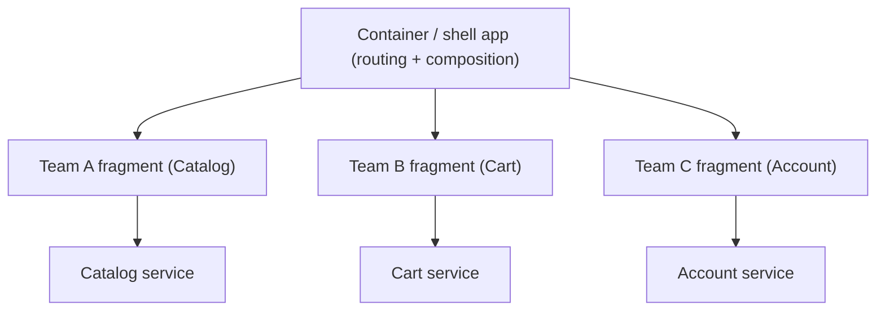

**Trade-offs.**
- *Pros:* independent team deploys for the UI; vertical feature ownership; can
  incrementally migrate a frontend monolith; tech flexibility per fragment.
- *Cons:* **bundle duplication** (multiple framework copies) → payload/perf cost;
  runtime integration complexity; **UX/consistency governance** (shared design
  system needed); harder end-to-end testing.
- *When to use:* large orgs where multiple teams contend on one big frontend and UI
  release coupling is the bottleneck.
- *When to avoid:* small teams / single UI team (a modular SPA is simpler); highly
  interdependent, tightly-integrated UIs.
- *-ilities:* optimizes **deployability** and **team autonomy** for the UI; costs
  **performance** (duplication) and **consistency**.

**How it differs from adjacent styles.** It is the **browser-side analog of
Microservices** — the same independence argument, moved to the presentation tier.
Where microservices split the *server*, micro-frontends split the *client*.

---

## Styles mentioned in passing

These are recognized topologies covered in depth elsewhere; know the one-liner and
the pointer.

- **Grid / Cluster computing (shared-nothing, MapReduce-style).** *Problem:* split a
  huge workload across many independent, shared-nothing nodes so throughput scales
  horizontally. The shared-nothing principle underpins sharding
  (**`databases-sql-nosql-sharding-replication`**) and big-data processing
  (**`design-web-crawler-data-processing`**, `aws-analytics-datalake-redshift-emr`).
- **Edge / Fog computing.** *Problem:* push compute/data closer to users/devices to
  cut latency and backhaul. See **`aws-iot-edge-computing`** and CDN edge in
  **`caching-and-cdn`** / `aws-dns-cdn-route53-cloudfront`.
- **Primary-Replica compute topology (leader-follower)** *(historically called
  master-slave — Primary-Replica used everywhere else).* *Problem:* one **primary**
  coordinates/accepts writes while **replicas** scale reads and provide failover.
  Data-layer deep dive: **`databases-sql-nosql-sharding-replication`**; leader
  election: `consensus-clocks-and-time`.
- **API Gateway (edge, north-south).** *Problem:* give clients a single managed
  entry point in front of many services and centralize edge concerns —
  authentication, TLS termination, rate limiting, request routing, and
  aggregation — so each service doesn't re-implement them. This is the
  **north-south** (client↔system) edge tier referenced by Microservices,
  Serverless, and the Service-Mesh follow-ups; it is the *complement* of a service
  mesh, which handles **east-west** (service↔service) traffic internally. Deep
  dive: **`microservices-monolith-api-design`** (and `caching-and-cdn` /
  `aws-dns-cdn-route53-cloudfront` for edge routing).
- **Distributed Monolith (anti-pattern).** *What NOT to build:* microservices
  deployment cost with monolith coupling — services that must deploy in lock-step
  and/or share a database. The cautionary contrast in the Microservices-vs-SOA
  discussion; caused by bad boundaries (**`microservices-ddd-and-boundaries`**).

---

## One request, three styles

The shapes above become tangible when you follow **one concrete request** —
"place order #4711, charge $60, reserve 2 units, notify the customer" — through
three different styles and watch *where the cost lands*.

**A) Synchronous N-tier / request-response.** The client calls one endpoint; the
app tier does everything in a single call chain and (ideally) one DB transaction:

```
Client → App tier:  BEGIN
                      insert order #4711
                      inventory -= 2
                      charge $60
                    COMMIT  → 200 OK
```
- *Consistency:* strong — one transaction, all-or-nothing. If the charge fails,
  the whole thing rolls back; inventory is never left dangling.
- *Latency:* the client **waits** for the slowest step (the payment gateway), so
  tail latency is the sum of the chain.
- *Tracing:* trivial — it's one stack trace in one process.
- *Cost:* it doesn't scale independently, and a slow payment provider stalls the
  user's whole request.

**B) Broker / async request-reply.** The app tier commits the order locally, then
drops a message on the broker and returns immediately; a worker charges later:

```
Client → Orders svc:  insert order #4711 = PENDING; COMMIT → 202 Accepted
Orders → Broker:      enqueue {charge $60, reserve 2, msgId m-88}
   (worker, later)    dequeue m-88 → charge → reserve → emit "order confirmed"
```
- *Consistency:* **eventual** — the client gets `202 Accepted` before the charge
  happens; the order is `PENDING` for a window.
- *Latency:* the user-facing response is fast (no wait on payment); the *work*
  finishes asynchronously.
- *Tracing:* harder — you must correlate the HTTP request with `m-88` across the
  queue. And because delivery is at-least-once, the worker **must be idempotent**
  on `m-88` (see the Broker worked example) or a redelivery double-charges.

**C) Event-driven choreography (a saga).** No coordinator: each service reacts to
the previous one's event and, on failure, emits a compensating event:

```
Orders  emits OrderPlaced(#4711)
 → Inventory reacts: reserve 2 → emits InventoryReserved
   → Payments reacts: charge $60 → DECLINED → emits PaymentFailed
     → Inventory reacts to PaymentFailed: release 2 (compensation)
       → Orders reacts: mark #4711 CANCELLED
```
- *Consistency:* eventual, via **saga** compensations — there's a window where 2
  units sit reserved for an order that never pays (identical to the Microservices
  worked example).
- *Latency:* each hop is independent and parallelizable, but the *end-to-end*
  outcome spans many asynchronous steps.
- *Tracing:* hardest — the control flow lives in "who reacts to what," so you need
  distributed tracing (correlation IDs) to reconstruct one logical transaction.

**The through-line:** the *same* business request costs you strong consistency and
independent scaling in (A), buys back responsiveness and decoupling in (B) and (C)
but spends it on eventual consistency, mandatory idempotency, and much harder
tracing. That migration of cost — never its disappearance — is the whole game.

---

## Comparison matrix

All core styles on shared axes. "Coupling" = producer↔consumer / service↔service.

| Style | Scalability | Coupling | Ops complexity | Deployability | Consistency model | Best-fit workload |
|---|---|---|---|---|---|---|
| **Client-Server / N-tier** | Moderate (central tier caps it) | Tight client↔server | Low | Simple (few units) | Strong (single DB) | Small–mid line-of-business & web apps |
| **Peer-to-Peer** | Scales with peers | None central (symmetric) | High coordination difficulty | Self-organizing | Weak / eventual | File sharing, blockchain, overlays |
| **SOA** | Enterprise scale via ESB | High (shared model + bus) | High governance | Coarse deploy units | Mixed | Large enterprise integration |
| **Microservices** | High, independent per service | Low (dumb pipes) | High (needs CI/CD + observability) | Per-service | Eventual across services | Large evolving product orgs |
| **Serverless / FaaS** | Auto-elastic (to zero) | Event-coupled | Lowest infra (managed) | Per-function | Stateless + eventual | Spiky / event-driven workloads |
| **Space-Based** | Near-linear elastic | Low | High (grid ops) | Replicated PU deploy | Eventual (in-memory) | Extreme concurrent high-volume spikes |
| **Broker** | High (scale endpoints) | Loose (time + location) | Medium (run the broker) | Independent endpoints | Eventual / async | Async workflows, fan-out, buffering |
| **Event-Driven** | High | Very loose | Medium–high | Independent processors | Eventual | Real-time reactions, streaming |
| **Cell-Based** | Scales by adding cells | Low (isolated) | High (routing) | Per-cell | Per-cell (strong within) | High-availability, blast-radius-sensitive |
| **Service Mesh** | Inherits fleet | Low (transparent infra) | High (control plane) | Per-service + sidecar | N/A (transport layer) | Large polyglot service fleets |
| **Micro-Frontends** | UI teams scale | Low (per fragment) | Medium–high | Per-fragment | N/A (presentation) | Multi-team large web UIs |

> *Footnote:* **Service Mesh** (transport-layer infrastructure) and
> **Micro-Frontends** (presentation tier) are **cross-cutting styles, not
> end-to-end topologies** — they layer onto whatever system runs beneath them. So
> their `N/A` / "Inherits fleet" / "UI teams scale" cells are N/A *by nature*, not
> gaps; don't read the blanks as missing data.

---

## Common follow-up questions

- **"Microservices vs SOA — what actually differs?"** Granularity (fine vs coarse),
  pipes (dumb vs smart ESB), and data (private per service vs shared canonical
  model). Both are service-oriented; the coupling and governance differ sharply.
- **"When would you NOT use microservices?"** Small team/early product (unknown
  boundaries), strong cross-entity consistency needs, or immature ops (no CI/CD,
  tracing, on-call). Start with a modular monolith.
- **"Broker vs Event-Driven — same thing?"** Broker is the messaging *topology*
  (intermediary routes messages); EDA is the broader *interaction style* built on
  events. EDA's broker topology uses a broker; its mediator topology orchestrates.
- **"How does cell-based differ from sharding?"** Sharding partitions *data* for
  scale; cell-based partitions the *whole stack* for **fault isolation** (bounded
  blast radius), scale being secondary.
- **"Service mesh vs API gateway?"** Gateway = north-south (edge, client↔system);
  mesh = east-west (internal, service↔service). Often used together.
- **"Serverless vs microservices?"** Serverless functions are finer-grained,
  ephemeral, and run on managed infra with scale-to-zero; microservices are
  long-running, self-managed units. A serverless function can implement a
  microservice or an event consumer.
- **"Why is the distributed monolith the worst outcome?"** You pay the full
  operational and network tax of microservices while retaining lock-step,
  shared-database coupling — the costs of both, benefits of neither.
- **"Architecture style vs design pattern — what's the difference?"** Altitude:
  styles structure the *whole system's* deployment topology; GoF/enterprise design
  patterns structure *objects inside* one deployable. See the `dp-*` group.

---

## References

- Mark Richards, *Software Architecture Patterns* (O'Reilly) — client-server,
  layered, event-driven, microkernel, microservices, **space-based** styles and
  their trade-offs.
- Mark Richards & Neal Ford, *Fundamentals of Software Architecture* (O'Reilly) —
  architecture characteristics (-ilities), style comparisons, EDA broker vs
  mediator topologies.
- Buschmann et al., *Pattern-Oriented Software Architecture, Vol. 1 (POSA)* — the
  **Broker** architectural pattern.
- martinfowler.com — *Microservices*, *MonolithFirst*, *Micro Frontends*
  (Cam Jackson), *What do you mean by "Event-Driven"?*.
- microservices.io (Chris Richardson) — microservices pattern language,
  decomposition, database-per-service, saga.
- Azure Architecture Center — architecture styles (N-tier, web-queue-worker,
  microservices, event-driven, big-compute), and cloud design patterns.
- AWS Well-Architected & builder guidance — **cell-based architecture**, bulkhead /
  blast-radius reduction, availability partitioning.
- Alistair Cockburn (Hexagonal / Ports & Adapters), Jeffrey Palermo (Onion),
  Robert C. Martin (Clean Architecture) — application-internal structure styles,
  covered in the separate application-structure `arch-*` topic (referenced, not
  deep-dived here).
- Chord / Kademlia DHT papers; Gnutella / BitTorrent — P2P structured vs
  unstructured lookup.

**Cross-reference topics (deep dives):** `microservices-monolith-api-design`,
`microservices-ddd-and-boundaries`, `event-driven-cqrs-saga-cdc`,
`message-queues-and-async`, `databases-sql-nosql-sharding-replication`,
`aws-serverless-lambda-stepfunctions`, `aws-compute-ec2-fargate-lambda`,
`caching-and-cdn`, `aws-caching-elasticache-dax`, `resilience-tradeoffs-deep-dive`,
`aws-resilience-multiregion-dr`, `dp-distributed-cloud`, `consensus-clocks-and-time`,
`dp-enterprise-application`.
