# Architectural Patterns: Fundamentals & Style Selection

This is the conceptual foundation of the **Architectural Patterns** group. It answers the
questions an interviewer opens with — *"What is an architectural style? How is it different from
a design pattern? Which style fits this system, and what do you give up to get it?"* — and then
catalogues the full family of system-level styles so nothing is orphaned.

These are **system-altitude** decisions: how a *whole application* is structured, partitioned,
and deployed (Layered, Microservices, Event-Driven, Space-Based…). They are a **different
altitude** from the object-level GoF **Design Patterns** group (`dp-*`), which is about how a
handful of classes collaborate (Strategy, Observer, Adapter…). Keep that distinction sharp — it
is itself a graded interview question.

> [!INTERVIEW]
> Every style section below leads with a bolded **Problem it solves** line, then how it works, a
> diagram, the **trade-offs / -ilities**, and how it **differs from** adjacent styles. The
> single most important framing (Richards & Ford's *First Law*): **everything in architecture is
> a trade-off** — there is no "best" style, only the least-bad fit for *these* drivers. Reciting
> a topology without naming what you sacrifice to get it is the classic junior mistake.

Several styles here have full **deep-dive topics** elsewhere in this library. This overview gives
each a 1–2 line architectural treatment and an explicit **Deep dive: see …** pointer rather than
duplicating them.

---

## Style vs design pattern vs characteristic

**Problem it solves:** engineers constantly conflate three different things — *how the whole
system is shaped*, *how a few objects collaborate*, and *what quality the system must exhibit*.
Talking about "the microservices pattern" and "the Observer pattern" and "scalability" as if they
lived at the same level produces muddled designs and muddled interviews. Naming the three
**altitudes** keeps the conversation coherent.

**How it works / the three altitudes** (Richards & Ford, *Fundamentals of Software Architecture*):

- **Architectural style (this topic)** — *system altitude.* Coarse-grained: how the entire
  application is partitioned into deployment units and how they communicate. Drives the topology
  and the `-ilities`. Examples: Layered, Microservices, Event-Driven, Space-Based.
- **Design pattern (`dp-*`)** — *object altitude.* Fine-grained: how a small cluster of
  classes/objects is arranged locally. Examples: Strategy, Observer, Adapter, Factory.
- **Architectural characteristic (`-ility`)** — *not a structure at all* but a **quality
  requirement**: scalability, availability, performance, deployability. A style is *chosen to
  optimize* a set of characteristics; the characteristic is the goal, the style is the means.

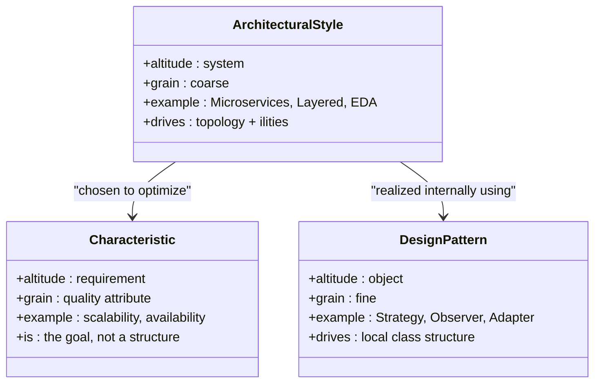

**Trade-offs.** Getting the altitude right costs nothing and buys clarity; the only risk is
pedantry. *Optimizes:* communicability and correct scoping of decisions.

**Differs from:** the whole rest of this file lives at the *style* altitude; the `dp-*` group
lives at the *object* altitude; `fundamentals-and-framework` covers requirements/characteristics.

Deep dive: object-level patterns — see `dp-fundamentals-and-principles`.

---

## Architectural characteristics (the -ilities)

**Problem it solves:** "make it good" is unmeasurable. Without explicit, prioritized quality
attributes you cannot compare two candidate styles objectively or know when the architecture is
"done enough." The `-ilities` give you the **axes** on which every style trade-off is scored.

**How it works / the main axes** (ISO/IEC 25010; *FoSA* ch. 4–6). A characteristic is
*operational*, *structural*, or *cross-cutting*:

- **Scalability** — handle growing load (often via horizontal scale-out). *Elasticity* is the
  sub-attribute of scaling *fast* with spikes.
- **Availability / fault tolerance / resilience** — keep serving despite failures.
- **Performance** — latency and throughput under expected load.
- **Deployability** — how safely and frequently you can ship a change (release quanta).
- **Testability** — how easily behavior can be verified in isolation.
- **Modifiability / evolvability** — cost of change; ability to change *structure* over time.
- **Simplicity / operability / cost** — cognitive and operational burden, and dollars.
- **Security** — confidentiality, integrity, auditability.

You cannot maximize all of them; you **rank the top 3–7 "architecture characteristics"** and let
that ranking pick the style.

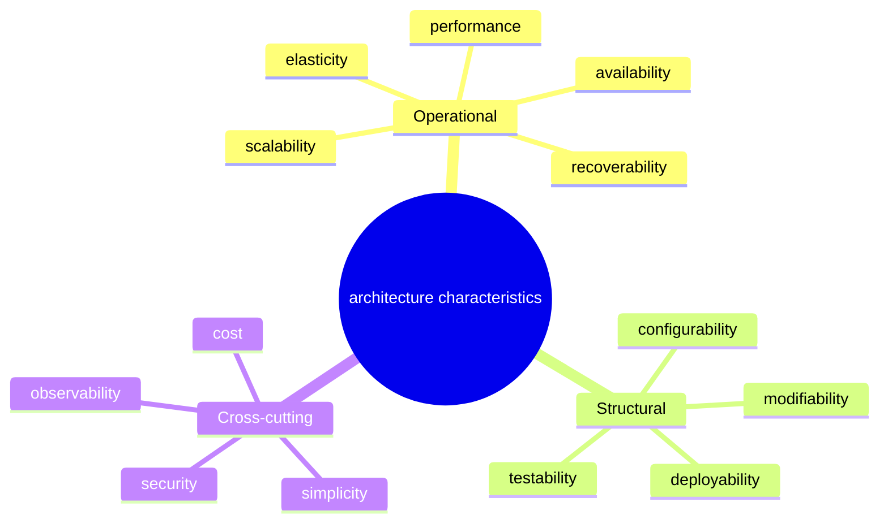

**Trade-offs.** More explicit characteristics = better decisions but more up-front analysis.
*Optimizes:* the ability to *choose* — this is the ruler every other section is measured with.

**Differs from:** a style is a *structure*; a characteristic is a *requirement*. Do not answer
"which style?" without first asking "which characteristics dominate?"

Deep dive: requirements gathering & non-functional analysis — see `fundamentals-and-framework`.

---

## First Law of Software Architecture

**Problem it solves:** teams argue about the "right" architecture as if one exists, and chase
"best practices" that are actually context-dependent. Naming the law reframes the argument: there
is no free lunch, only exchanges.

**How it works.** Richards & Ford's **First Law**: *"Everything in software architecture is a
trade-off."* Its corollary: *"If an architect thinks they have discovered something that isn't a
trade-off, more likely they just haven't identified the trade-off yet."* The **Second Law**:
*"Why is more important than how"* — capturing the *rationale* (which is what an ADR does)
outlives the specific structure. Every gain in one `-ility` tends to cost another (scalability
often costs simplicity; decoupling often costs latency and debuggability).

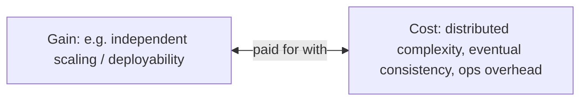

**Trade-offs.** The law itself is free; internalizing it stops you from over-selling any style.
*Optimizes:* honesty and defensibility of decisions.

**Differs from:** dogma ("microservices are best"). The law says the answer is always *"it
depends — on the ranked characteristics and the org context."*

---

## The monolith-to-distributed spectrum

**Problem it solves:** styles are often presented as unrelated boxes, hiding that they sit on one
continuum defined by **how many independently deployable units (architecture quanta)** the system
has and **how coupled** they are. Placing them on a line makes the trade-off gradient visible.

**How it works.** An **architecture quantum** (Ford et al.) is an independently deployable unit
with high functional cohesion and its own data. Monolithic styles = **one quantum**; distributed
styles = **many quanta**. Moving right buys scalability/deployability/fault isolation and pays
with network latency, eventual consistency, and operational complexity.

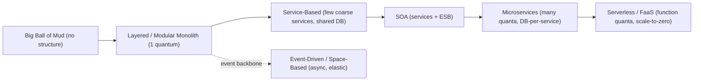

**Trade-offs.** Left = simplicity, strong consistency, low ops, but coarse scaling and lockstep
deploys. Right = fine-grained scaling and deployability, but distributed-systems tax.
*Optimizes:* intuition for *where* a candidate style lands.

**Differs from:** treating "monolith" and "microservices" as a binary; the spectrum shows
**Modular Monolith**, **Service-Based**, and **SOA** as the pragmatic middle.

Deep dive: monolith↔microservices decomposition — see `microservices-monolith-api-design`.

---

## Choosing an architectural style

**Problem it solves:** given fuzzy requirements, how do you land on a *defensible* style instead
of "the one we always use" or "the trendy one"? You need a repeatable decision procedure.

**How it works** (*FoSA*, "Choosing the appropriate architecture style"): (1) extract the domain
and **rank the architecture characteristics**; (2) decide the **communication style**
(synchronous vs asynchronous) and data topology (monolithic vs distributed data); (3) map those
to candidate styles; (4) evaluate against constraints (team size/skill — Conway, budget,
time-to-market); (5) record the decision in an **ADR**; (6) enforce with **fitness functions**.

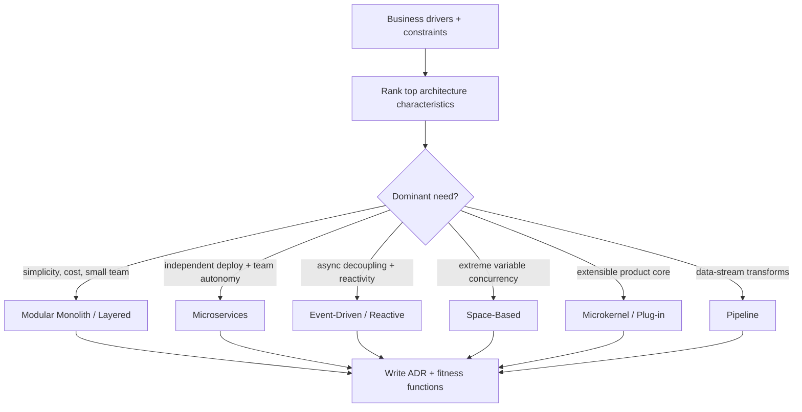

**Trade-offs.** A procedure adds up-front effort but prevents expensive re-platforming.
*Optimizes:* decision quality and defensibility. *When to avoid:* trivial CRUD apps — just pick
a modular monolith and move on.

**Differs from:** cargo-culting a style. The output is *"style X because characteristics A,B,C
dominate and constraint D holds,"* not *"style X because it's modern."*

---

## Architecture Decision Records

**Problem it solves:** six months later nobody remembers *why* the system is event-driven, so a
new team relitigates it or violates the intent. Tribal memory of architectural rationale is lost
with attrition. (Second Law: *why > how*.)

**How it works.** An **ADR** (Michael Nygard) is a short, immutable, version-controlled markdown
record with a fixed shape: **Title, Status** (proposed/accepted/superseded), **Context** (forces
at play), **Decision** (what we chose), **Consequences** (resulting trade-offs, good and bad).
ADRs are numbered and append-only: you *supersede*, never edit, so the history of reasoning is
preserved.

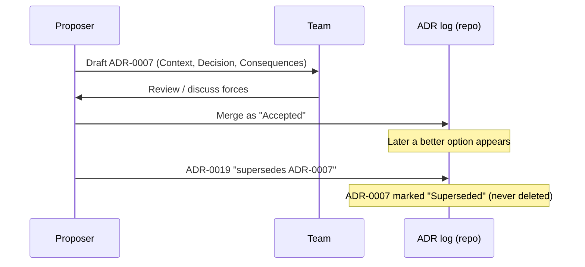

**Trade-offs.** *Pros:* durable rationale, faster onboarding, fewer relitigated debates. *Cons:*
discipline to keep writing them. *Optimizes:* modifiability/evolvability of the *organization's
understanding*. *When to use:* any decision that is costly to reverse.

**Differs from:** design docs (which describe *the whole system*); an ADR captures **one
decision and its trade-off**, and is immutable.

---

## Architectural fitness functions

**Problem it solves:** `-ilities` silently rot. You choose "layered so dependencies only point
downward," then over two years someone imports the DB layer into the UI and the architecture
erodes. You need the qualities to be **continuously and automatically verified**, not policed by
memory.

**How it works** (Ford, Parsons & Kua, *Building Evolutionary Architectures*): a **fitness
function** is any automated check that measures how well the system meets a characteristic — a
unit-testable predicate over the architecture. Examples: ArchUnit tests asserting layer
dependency direction; a CI gate failing the build if p99 latency regresses; a check that no
service shares another service's database; cyclomatic-complexity or coupling thresholds. Run them
in the pipeline so violations block merges.

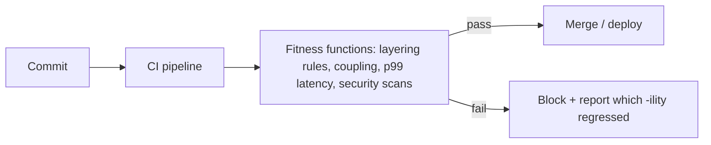

**Trade-offs.** *Pros:* architecture stays intact as it evolves; makes `-ilities` executable.
*Cons:* upkeep of the checks. *Optimizes:* evolvability, modifiability. *When to use:* any
long-lived system where erosion is a real risk.

**Differs from:** ordinary unit tests (which verify *behavior*); fitness functions verify
*architectural characteristics/constraints*.

---

## Conway's Law and the Inverse Conway Maneuver

**Problem it solves:** teams wonder why a "clean" service decomposition keeps producing a tangled
system, or why two teams cannot cleanly split a shared module. The cause is organizational, not
technical, and ignoring it dooms the architecture.

**How it works.** **Conway's Law** (1968): *"Any organization that designs a system will produce
a design whose structure is a copy of the organization's communication structure."* So the
system's boundaries mirror the org chart's communication paths. The **Inverse Conway Maneuver**
(*Team Topologies*, Fowler): deliberately *shape the teams* to match the architecture you want —
e.g. give each microservice a single long-lived team so the boundaries hold.

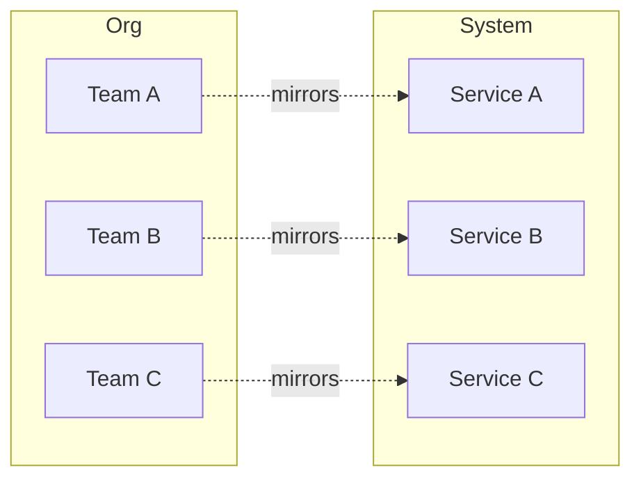

**Trade-offs.** *Pros:* aligning teams to boundaries reduces coordination cost and coupling.
*Cons:* reorgs are expensive and political. *Optimizes:* deployability/team autonomy (especially
for microservices). *When to use:* before adopting a distributed style — check the org can
support it.

**Differs from:** purely technical decomposition; Conway says the *socio-technical* structure
dominates.

Deep dive: bounded contexts & team boundaries — see `microservices-ddd-and-boundaries`.

---

## Big Ball of Mud

**Problem it solves:** it doesn't — this is the **default anti-pattern** you get from *no*
deliberate architecture. Naming it gives teams a shared warning label for the state to avoid.

**How it works.** Foote & Yoder (1997): a **Big Ball of Mud** is a system with no discernible
architecture — a haphazard, sprawling, spaghetti-coded jungle where every part can reach every
other part, boundaries are absent, and change is globally risky. It usually arises from
expedient, unplanned, incremental growth under schedule pressure.

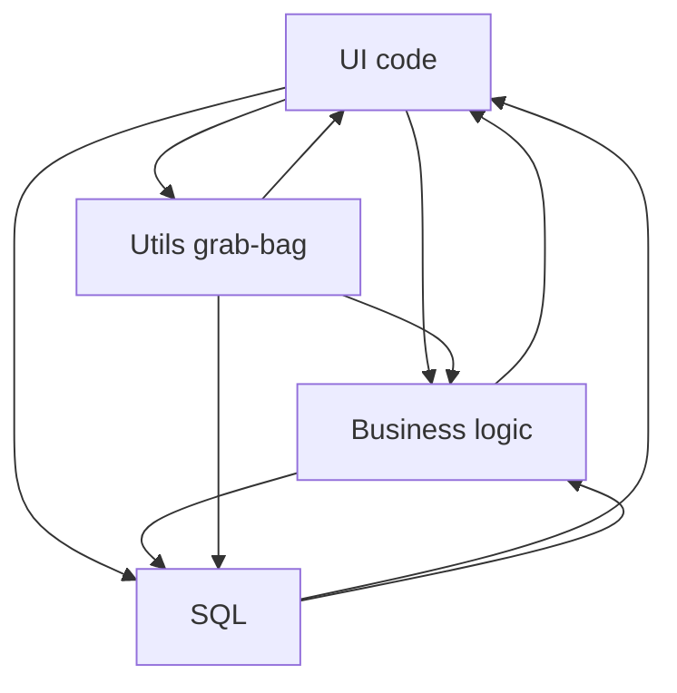

**Trade-offs.** *Pros (short-term only):* fast to start, zero design ceremony. *Cons:*
unmodifiable, untestable, unscalable, high defect rate; the worst `-ility` profile of any
"style." *When it "wins":* throwaway prototypes. *When to avoid:* everything you intend to keep.

**Differs from:** every real style, which imposes *deliberate* boundaries. It is the "no-style"
baseline the whole family exists to prevent (see also the **Distributed Monolith**, its
distributed cousin).

---

## Map of the architectural style family

**Problem it solves:** the family is large; you need a single index to navigate it and to know
which styles are covered here versus deep-dived elsewhere.

**How it works.** The styles group into **structural/monolithic**, **domain-centric**,
**service-oriented/distributed**, **event/message-driven**, **data-topology**,
**presentation**, **modern/data**, and **anti-patterns**.

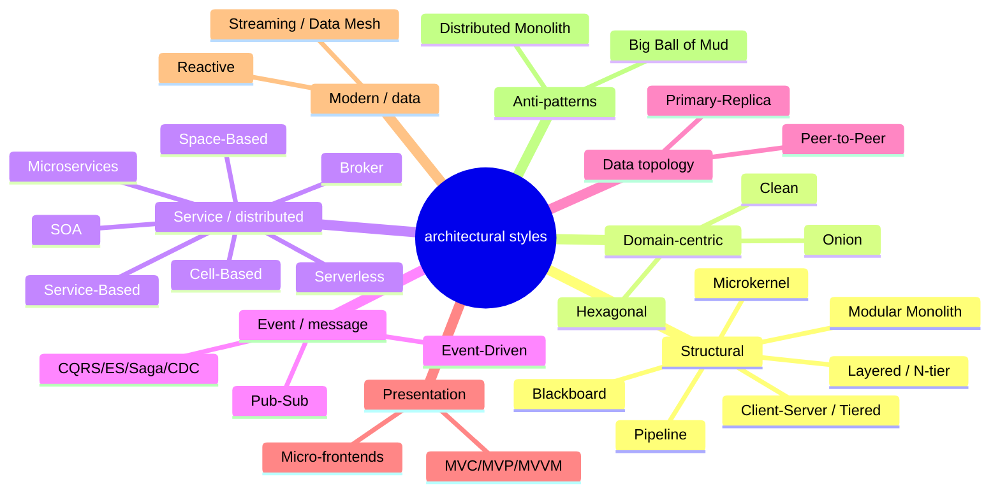

**Trade-offs.** A map is orientation, not analysis. *Optimizes:* navigability of the topic.

**Differs from:** the individual sections, which each carry the full problem/diagram/trade-off
treatment.

---

## Layered architecture

**Problem it solves:** how do you organize a codebase so that responsibilities are separated and
any developer can find where a given kind of logic lives? Layering partitions the app by
**technical concern** so presentation, business rules, persistence, and data are isolated and
independently changeable.

**How it works.** Horizontal layers, each with a single technical responsibility, typically
**Presentation → Business → Persistence → Database**. The core rule is **layers of isolation**:
a layer may call only the layer directly below it (closed layers), so a change in one layer
doesn't ripple up. *Open* layers (e.g. a shared services layer) can be bypassed. The pitfall is
the **architecture sinkhole**: requests that pass straight through layers doing no work, adding
cost without value.

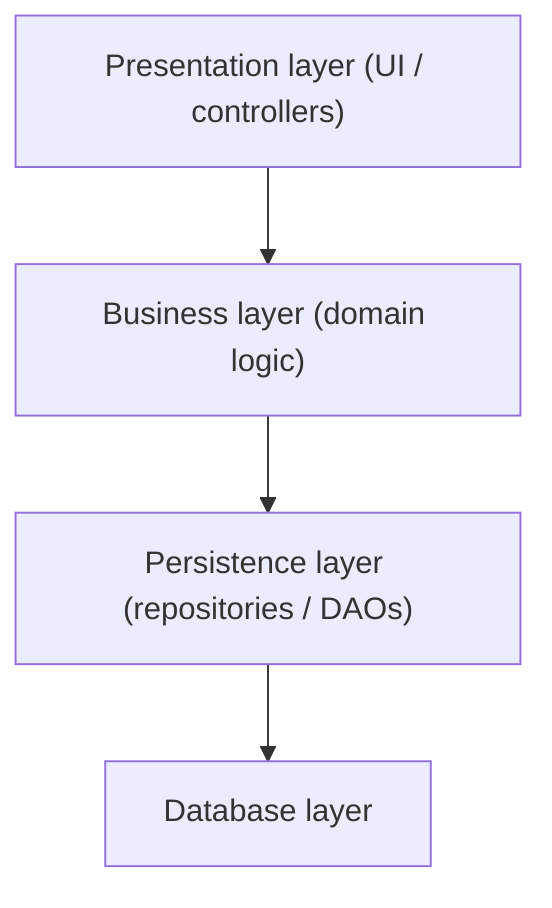

**Trade-offs.** *Pros:* simple, familiar, great **testability** (mock the layer below), low cost,
good for small teams. *Cons:* poor **deployability** and **scalability** (one deployment unit —
one quantum), sinkhole risk, layers become a change bottleneck. *Optimizes:* simplicity,
testability. *When to use:* small-to-medium apps, CRUD, tight budgets, early startups. *When to
avoid:* systems needing independent scaling/deployment of parts, or high elasticity.

**Differs from:** **Client-Server/Tiered** = *physical* deployment tiers, while layers are
*logical* groupings (you can run all layers in one process). **Hexagonal/Onion/Clean** invert the
dependency direction toward the domain rather than toward the database.

Deep dive: this overview is the primary treatment (foundational style).

---

## Modular Monolith

**Problem it solves:** teams want microservice-style clear module boundaries and independent
development **without** paying the network, data-consistency, and operational tax of a
distributed system. The Modular Monolith gives you strong internal boundaries in a **single
deployment unit**.

**How it works.** One deployable application (one process, one release quantum) internally divided
into **well-defined modules** aligned to business capabilities/bounded contexts. Modules
communicate through explicit in-process interfaces (not by reaching into each other's internals or
tables); each module ideally owns its own schema/tables. Enforced with fitness functions
(ArchUnit-style boundary checks). It is the recommended *starting point* and a low-risk stepping
stone to microservices later.

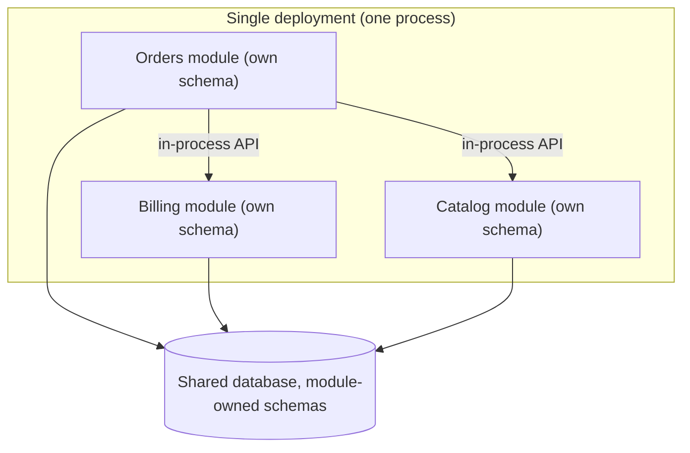

**Trade-offs.** *Pros:* excellent **simplicity**, strong **modifiability/refactorability**,
strong consistency (in-process transactions), easy debugging/deploy, cheap ops. *Cons:* single
runtime **failure domain**, single scaling unit, one tech stack, discipline required to keep
boundaries from eroding. *Optimizes:* simplicity + modifiability. *When to use:* most systems,
especially before you have proven the need for distribution. *When to avoid:* when parts truly
need independent scaling/deployment or separate stacks.

**Differs from:** **Microservices** (many quanta, network boundaries, DB-per-service) — the
modular monolith keeps boundaries but stays one quantum; **Layered** (organized by technical
concern, not by business module).

Deep dive: see `microservices-monolith-api-design`.

---

## Pipeline architecture

**Problem it solves:** you must process a stream of data through a series of independent
transformations (ETL, compilers, Unix shell pipelines, log processing) and want each step to be
reusable, composable, and independently testable.

**How it works** (a.k.a. **Pipe-and-Filter**, POSA vol. 1): **filters** are self-contained,
single-purpose, stateless transformation components; **pipes** are unidirectional channels
carrying data between them. Four filter roles: *producer* (source), *transformer* (map),
*tester* (filter/route), *consumer* (sink). Filters know nothing about each other, so you can
reorder and recombine them freely.


**Trade-offs.** *Pros:* superb **modifiability** and **reuse** (swap/insert filters), clear
composition, natural for batch/stream transforms. *Cons:* not for low-latency request/response;
end-to-end error handling and **back-pressure** are awkward; can serialize a slow filter into a
bottleneck. *Optimizes:* modifiability, reusability. *When to use:* data transformation, ingestion,
compilers, event enrichment. *When to avoid:* interactive, low-latency, transactional workloads.

**Differs from:** **Event-Driven** (filters are a *linear* transform chain, not a fan-out of
reactive event handlers). As a *cloud deployment* pattern (Pipes-and-Filters/Sidecar), it is
catalogued differently from this style form.

Deep dive: pattern/deployment form — see `dp-distributed-cloud`; streaming pipelines — see
`realtime-streaming-systems`.

---

## Microkernel architecture

**Problem it solves:** a product needs a small, stable core plus the ability to add, remove, and
version features **independently** without touching the core — think IDEs, browsers, editors, or
an insurance-claims engine whose rules vary by jurisdiction.

**How it works** (a.k.a. **Plug-in architecture**, Richards; POSA): a minimal **core system**
provides the general, always-needed processing and a **plug-in contract/registry**; optional
**plug-in components** deliver specialized, isolated capability and are discovered at runtime.
Plug-ins depend on the core, never on each other, and communicate through the core's defined
interface (point-to-point, or via a broker for remote plug-ins).

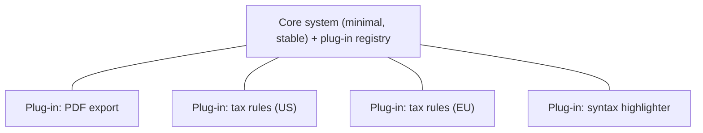

**Trade-offs.** *Pros:* excellent **extensibility** and **evolvability**, feature isolation,
add capability without redeploying the core (if dynamically loaded). *Cons:* whole system usually
scales/deploys as **one quantum**; plug-in **contract governance** is hard; versioning drift.
*Optimizes:* extensibility, modifiability. *When to use:* product platforms, tools, rules
engines. *When to avoid:* systems whose primary need is elastic scale rather than extensibility.

**Differs from:** **Microservices** (plug-ins share the core's process and lifecycle, not
independently deployable services); **Broker** (microkernel plug-ins register with a *core*, not
a generic message broker).

Deep dive: this overview is the primary treatment.

---

## Client-Server and Tiered architecture

**Problem it solves:** many users need to share centralized data/logic and can't each hold the
whole system locally. Split responsibility between **clients** (request/present) and a shared
**server** (own data, enforce rules) across a network.

**How it works.** **2-tier**: client ↔ server(+DB). **3-tier**: presentation tier ↔ application
(logic) tier ↔ data tier. **N-tier**: additional tiers (e.g. web, app, cache, DB). Each *tier* is
a **physical/deployment** boundary (separate process/host) — contrast with logical *layers*.
Tiers communicate over the network; each can be scaled/secured independently.

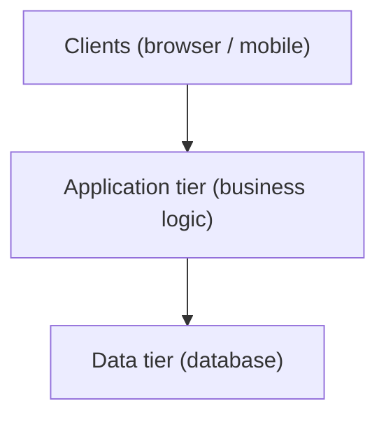

**Trade-offs.** *Pros:* centralized data/security, independent scaling per tier, clear
separation. *Cons:* the server tier can be a **scaling bottleneck / SPOF**; network latency
between tiers; more moving parts than a monolith. *Optimizes:* manageability, per-tier
scalability. *When to use:* classic web/enterprise apps. *When to avoid:* when a single tier
still becomes the bottleneck and you need fine-grained service decomposition.

**Differs from:** **Layered** — the crux pairing: *layers are logical* (can live in one process),
*tiers are physical* (separate deployables). A 3-layer app may deploy as a single tier.

Deep dive: horizontal/tier scaling — see `scalability-and-load-balancing`.

---

## Blackboard architecture

**Problem it solves:** some problems have **no deterministic algorithm** and no fixed solution
path — speech recognition, computer vision, sensor fusion, AI planning. You need many specialist
components to *incrementally* build a solution by cooperating around shared partial results.

**How it works** (POSA vol. 1): a central **blackboard** (shared, structured knowledge store)
holds the evolving solution state; independent **knowledge sources (KS)** each inspect the
blackboard, contribute when they can improve the solution, and write results back; a **control**
component decides which KS runs next based on blackboard state. Progress is opportunistic, not
pre-scheduled.

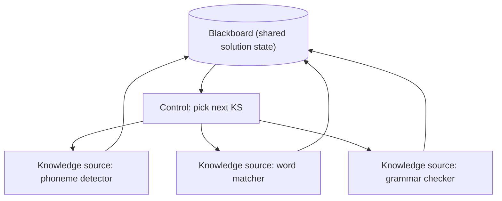

**Trade-offs.** *Pros:* tackles ill-defined problems; extensible with new knowledge sources.
*Cons:* nondeterministic, hard to **test** and reason about, control strategy is complex, no
guaranteed termination. *Optimizes:* problem-solving flexibility over predictability. *When to
use:* heuristic AI/perception problems. *When to avoid:* deterministic business workflows.

**Differs from:** **Shared-database integration** (blackboard KSs actively *reason* and are
orchestrated by a control loop, not just CRUD on shared tables); **EDA** (opportunistic control,
not event triggers).

Deep dive: this overview is the primary treatment (brief).

---

## Hexagonal architecture

**Problem it solves:** business logic gets entangled with I/O concerns (web framework, database,
message bus, third-party APIs), so you cannot test the logic without spinning up the whole world,
and swapping any technology means rewriting the core. Isolate the domain from *all* external
interaction.

**How it works** (Alistair Cockburn, **Ports & Adapters**): the application core exposes
**ports** (technology-agnostic interfaces). **Driving/primary adapters** (UI, REST controller,
tests, CLI) call *inbound* ports to drive the app; **driven/secondary adapters** (DB, message
broker, external service) implement *outbound* ports the app calls. The hexagon shape is
symbolic — it simply says "many sides, all interaction crosses a port." The core depends only on
ports (interfaces), never on concrete tech.

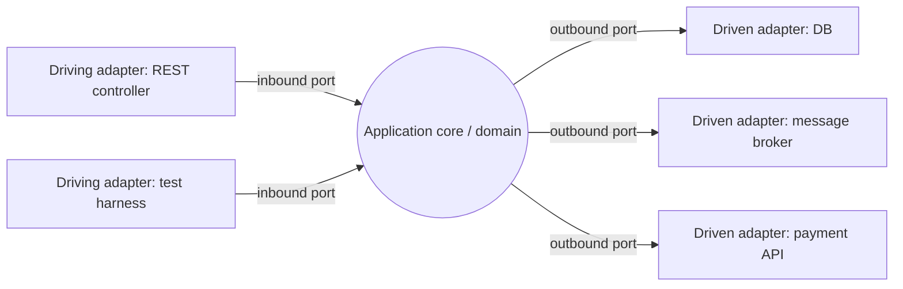

**Trade-offs.** *Pros:* maximal **testability** (test the core with in-memory adapters) and
**replaceability** of any technology; clean separation of concerns. *Cons:* adapter + mapping
**boilerplate**; over-engineering for simple CRUD. *Optimizes:* testability, modifiability.
*When to use:* rich domain logic, long-lived apps, tech volatility. *When to avoid:* thin CRUD
apps where the domain is the database.

**Differs from:** **Layered** (dependencies point *down* toward the DB; hexagonal points *inward*
toward the domain, DB is just another adapter). It is the same core idea as **Onion** and
**Clean** with different vocabulary (see next two).

Deep dive: this overview is the primary treatment (source: Cockburn).

---

## Onion architecture

**Problem it solves:** even in layered apps, business rules end up depending on infrastructure
(the domain "knows about" the database). Onion enforces that **all dependencies point inward**
toward the domain model, so the domain depends on nothing external.

**How it works** (Jeffrey Palermo): concentric rings. Innermost = **domain model / entities**;
next = **domain services**; next = **application services**; outermost = **infrastructure, UI,
tests**. The **Dependency Inversion Principle** makes outer rings depend on inner-ring interfaces;
inner rings never reference outer rings. Infrastructure implements interfaces *defined* by the
core.

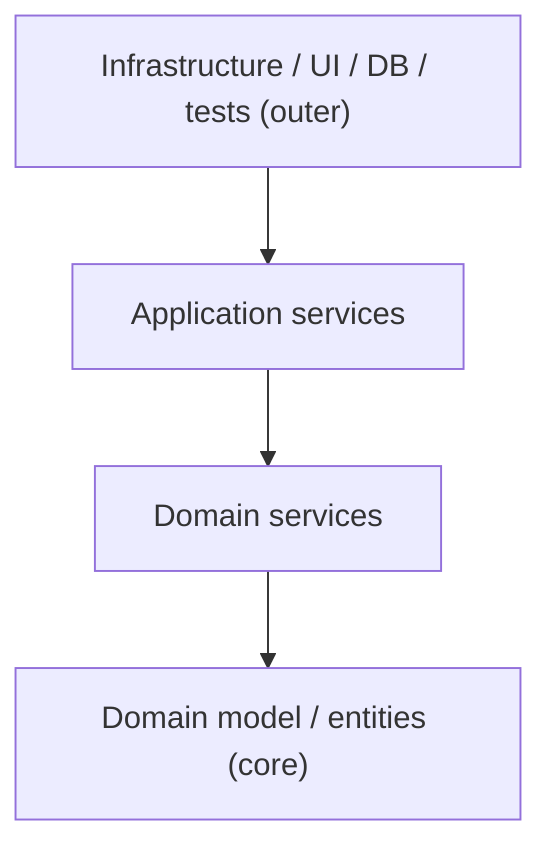

**Trade-offs.** *Pros:* protects **domain purity**, strong **testability** and **modifiability**,
tech-agnostic core. *Cons:* steep learning curve, lots of interfaces/indirection, overkill for
small apps. *Optimizes:* modifiability, testability. *When to use:* DDD-style rich domains.
*When to avoid:* simple data-in/data-out services.

**Differs from:** **Hexagonal** — essentially the same "dependencies inward" idea but expressed
as *layered concentric rings* rather than *ports & adapters*. **Clean** generalizes both.

Deep dive: this overview is the primary treatment (source: Palermo).

---

## Clean architecture

**Problem it solves:** Hexagonal and Onion say the same thing in different words; teams needed a
single unifying formulation of "keep business rules independent of frameworks, UI, and
databases so those can be swapped and the core tested in isolation."

**How it works** (Robert C. Martin): concentric circles governed by **The Dependency Rule** —
*source-code dependencies point only inward.* From inside out: **Entities** (enterprise-wide
business rules) → **Use Cases** (application-specific rules) → **Interface Adapters**
(controllers, presenters, gateways) → **Frameworks & Drivers** (web, DB, UI). Inner circles know
nothing of outer ones; crossing the boundary uses interfaces + DIP so control can flow outward
while dependencies point inward.

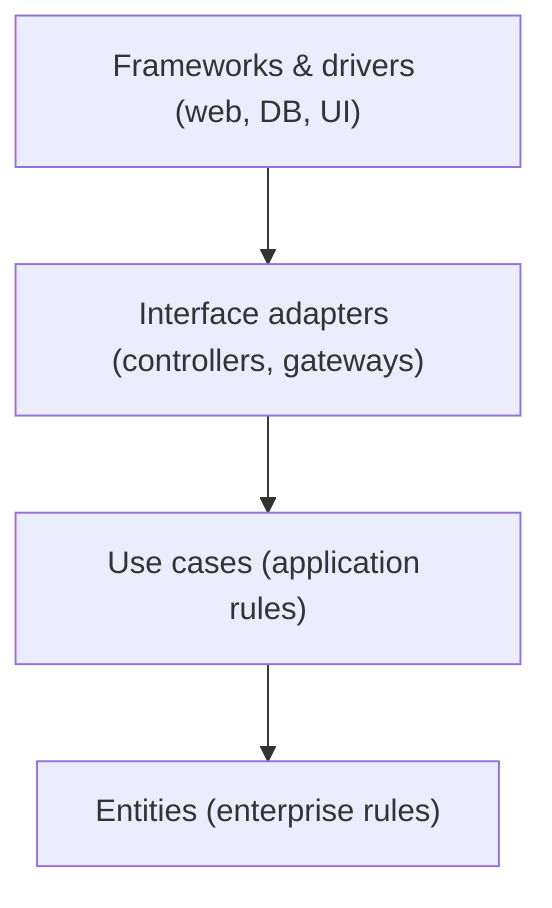

**Trade-offs.** *Pros:* framework/DB **independence**, high **testability**, clear boundaries.
*Cons:* ceremony and indirection; real risk of **over-engineering** small apps. *Optimizes:*
testability, modifiability, evolvability. *When to use:* long-lived apps with volatile
frameworks/rich rules. *When to avoid:* CRUD/prototypes.

**Differs from:** **Onion** and **Hexagonal** — *same idea, different vocabulary*; Clean is the
generalization (Entities/Use Cases + the explicit Dependency Rule). Say this explicitly in an
interview to show you understand they are a family, not three unrelated things.

Deep dive: this overview is the primary treatment (source: Martin).

---

## Service-Based architecture

**Problem it solves:** you want most of the flexibility and separate-deployment benefits of
microservices but can't justify their full distributed cost (per-service databases, heavy ops,
saga complexity). Service-Based is the pragmatic **middle ground**.

**How it works.** A handful of **coarse-grained, domain-partitioned services** (often 4–12, not
hundreds), each independently deployable, typically fronted by a UI and sharing a **single
monolithic database** (or a few shared databases). No orchestration middleware required; services
call each other or a shared API. It removes the hardest microservices problems (distributed data,
per-service schemas) while still splitting the deployable units.

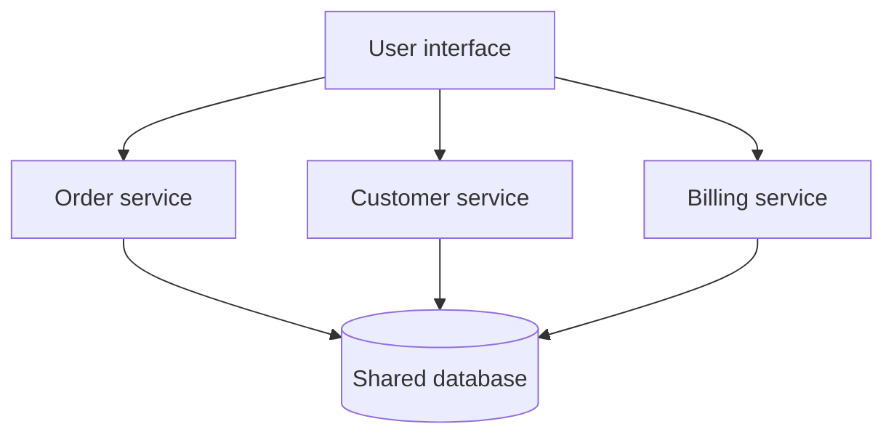

**Trade-offs.** *Pros:* far simpler than microservices, independent-ish deployability, strong
consistency via the shared DB, good **testability**. *Cons:* the **shared database couples**
services (schema changes ripple; DB is a scaling/availability bottleneck), so deployability is
not fully independent. *Optimizes:* balance of simplicity and deployability. *When to use:*
mid-size systems modernizing off a monolith. *When to avoid:* when services truly need
independent data ownership and scaling.

**Differs from:** **Microservices** (DB-per-service, many fine-grained quanta) and **SOA** (no
central ESB/orchestration). It sits between Modular Monolith and Microservices on the spectrum.

Deep dive: see `microservices-monolith-api-design`.

---

## Service-Oriented Architecture (SOA)

**Problem it solves:** a large enterprise has many heterogeneous, siloed systems (mainframe,
CRM, billing) and wants to expose and **reuse** their capabilities as shared business services
integrated through a common backbone.

**How it works.** Coarse business services are exposed and integrated through a central
**Enterprise Service Bus (ESB)** that handles routing, protocol/message transformation,
orchestration, and mediation. A **taxonomy** of services (business, enterprise, application,
infrastructure) with heavyweight governance and often WS-* / SOAP contracts. Orchestration logic
frequently lives *in the ESB*.

```mermaid
graph TD
    C1["Consumer app A"] --> ESB{{"Enterprise Service Bus (routing, transform, orchestrate)"}}
    C2["Consumer app B"] --> ESB
    ESB --> S1["Billing service"]
    ESB --> S2["CRM service"]
    ESB --> S3["Mainframe adapter"]
```

**Trade-offs.** *Pros:* enterprise-wide **reuse** and integration of heterogeneous systems.
*Cons:* the **ESB is a bottleneck and SPOF**; heavyweight governance; smart-pipes/dumb-endpoints
inverts the microservices preference; slow to change — this over-centralization directly
motivated the microservices movement. *Optimizes:* reuse, integration. *When to use:* legacy
enterprise integration. *When to avoid:* greenfield systems wanting agility and independent
deployment.

**Differs from:** **Microservices** — *smart endpoints, dumb pipes*, DB-per-service, no central
ESB, fine-grained; SOA is coarse, ESB-centric, reuse-first. **Service-Based** shares a DB but has
no ESB.

Deep dive: contrast section — see `microservices-monolith-api-design`.

---

## Microservices architecture

**Problem it solves:** a large monolith slows a growing organization — every change forces a full
redeploy, teams block each other, and you can't scale just the hot part. Microservices give
**independent deployability, team autonomy, and per-service scaling**.

**How it works.** The system is decomposed into small services aligned to **bounded contexts**,
each independently deployable, each **owning its own database** (no shared schema), communicating
over the network (sync REST/gRPC and/or async events). Cross-cutting concerns handled by an **API
gateway**, service discovery, and (optionally) a **service mesh** (sidecars for mTLS, retries,
observability). *Smart endpoints, dumb pipes.*

```mermaid
graph TD
    GW["API gateway"] --> S1["Order svc"]
    GW --> S2["Payment svc"]
    GW --> S3["Inventory svc"]
    S1 --> D1[("Order DB")]
    S2 --> D2[("Payment DB")]
    S3 --> D3[("Inventory DB")]
    S1 -. events .-> S3
```

**Trade-offs.** *Pros:* independent **deployability** & **scalability**, team autonomy, fault
isolation, tech heterogeneity. *Cons:* full **distributed-systems tax** — network failure,
eventual consistency, distributed transactions (sagas), operational and observability complexity,
harder end-to-end testing. *Optimizes:* deployability, scalability, evolvability. *When to use:*
large systems, many teams, differing scale needs. *When to avoid:* small teams/early products
(start modular monolith) — premature microservices produce a **Distributed Monolith**.

**Differs from:** **SOA** (no ESB, DB-per-service, finer grain), **Service-Based** (independent
databases, many more quanta), **Modular Monolith** (network boundaries + separate deploys).

Deep dive: see `microservices-monolith-api-design`, `microservices-ddd-and-boundaries`, and
`aws-microservices-patterns`.

---

## Serverless architecture

**Problem it solves:** teams don't want to provision, patch, or scale servers, and want to pay
only for actual execution — ideal for spiky or unpredictable load where idle capacity is wasted
money.

**How it works.** **FaaS** (Functions as a Service): small, stateless, event-triggered functions
run on demand; the platform handles provisioning, scaling (including **scale-to-zero** and
automatic scale-out), and availability. Combined with **BaaS** (managed databases, auth, queues,
object storage). Functions are stitched together by events and managed services; state lives in
external stores. Billing is per-invocation/duration.

```mermaid
graph LR
    EV["Event: HTTP / queue / file upload"] --> FN["Function (stateless)"]
    FN --> DB[("Managed DB / BaaS")]
    FN --> Q["Managed queue"]
    FN --> OUT["Response / downstream event"]
```

**Trade-offs.** *Pros:* zero server ops, elastic **cost** (pay-per-use, scale to zero),
automatic scaling. *Cons:* **cold starts** (latency), execution time/memory limits, **vendor
lock-in**, hard local testing/debugging, statelessness forces external state, per-request cost can
exceed always-on at high steady load. *Optimizes:* elasticity, cost-at-low/spiky-load,
deployability. *When to use:* event-driven, bursty, glue, unpredictable workloads. *When to
avoid:* sustained high-throughput low-latency services (steady load makes always-on cheaper) or
long-running jobs.

**Differs from:** **Microservices** (functions are finer-grained, stateless, event-triggered,
scale to zero; no long-running process) and **EDA** (serverless is a *compute/deployment* model,
often used *within* an event-driven system).

Deep dive: see `aws-serverless-lambda-stepfunctions` (and `aws-compute-ec2-fargate-lambda`).

---

## Space-Based architecture

**Problem it solves:** under **extreme, highly variable concurrent load** (flash sales, ticketing,
trading, betting) the *database* becomes the scalability bottleneck no amount of app-tier scaling
can fix. Space-Based removes the central database from the request path.

**How it works** (Richards; from **Tuple Space** / JavaSpaces): replicated in-memory
**processing units** each hold the application plus an **in-memory data grid** (IMDG) with the
working data set; requests are served entirely from memory, so units scale near-linearly with no
DB contention. **Data pumps** asynchronously persist changes to a backing database in the
background; **data readers/writers** repopulate the grid. **Virtualized/messaging middleware**
handles routing, replication, and unit start/stop.

```mermaid
graph TD
    LB["Messaging grid / router"] --> PU1["Processing unit + in-memory grid"]
    LB --> PU2["Processing unit + in-memory grid"]
    LB --> PU3["Processing unit + in-memory grid"]
    PU1 -. replicate .- PU2
    PU2 -. replicate .- PU3
    PU1 -->|data pump async| DW["Data writer"]
    DW --> DB[("Backing database")]
```

**Trade-offs.** *Pros:* near-linear elastic **scalability** and very high **performance**
(memory-speed, no DB bottleneck), high availability (replicated grid). *Cons:* **eventual
consistency** (async persistence — risk of data loss window), complex IMDG tooling/operations,
high memory **cost**, hard to test. *Optimizes:* scalability, elasticity, performance. *When to
use:* unpredictable high-volume concurrency. *When to avoid:* low/steady load, or workloads
needing strong immediate durability/consistency.

**Differs from:** a **caching layer in front of a DB** (in Space-Based the grid *is* the system
of record for live requests; the DB is async/behind); **Microservices** (space-based replicates
whole processing units for scale, not decomposes by capability).

Deep dive: in-memory grid mechanics — see `caching-and-cdn` and `aws-caching-elasticache-dax`.

---

## Cell-Based architecture

**Problem it solves:** in a large multi-tenant system a single bad deployment, poison request, or
overload can take down **all** users at once. You want to **bound the blast radius** so any
failure affects only a fraction of users.

**How it works** (AWS resilience patterns; a **bulkhead** at system scale): replicate the *entire
stack* (compute + data) into independent, isolated **cells**, each serving a partition of
users/tenants. A thin, highly available **cell router** (kept as simple as possible) maps each
request to its cell. Cells share nothing at runtime, so a failure, deploy, or overload is
contained; you also deploy changes cell-by-cell (canary at cell granularity).

```mermaid
graph TD
    R["Cell router (thin, highly available)"] --> C1["Cell 1: full stack + data"]
    R --> C2["Cell 2: full stack + data"]
    R --> C3["Cell 3: full stack + data"]
```

**Trade-offs.** *Pros:* strong **fault isolation**, high **availability**, safe incremental
deploys, limits correlated failure. *Cons:* **routing/partitioning complexity**, cost of
replicating the full stack, cross-cell operations are hard, cell-sizing/rebalancing effort.
*Optimizes:* availability, fault tolerance, deployability (blast-radius control). *When to use:*
large multi-tenant SaaS, high-availability targets. *When to avoid:* small systems where a single
cell's overhead isn't justified.

**Differs from:** **Sharding** (partitions *data* for scale; cells partition the *whole stack* for
*isolation*) and **multi-region** (cells can live within one region; the goal is blast-radius
containment, not geo-DR — though they compose).

Deep dive: see `aws-resilience-multiregion-dr` and `resilience-tradeoffs-deep-dive`.

---

## Broker architecture

**Problem it solves:** in a distributed system, components should call each other without
hard-coding each other's network location or protocol; you want **location transparency** and
loose coupling between decoupled services.

**How it works** (POSA vol. 1): a **broker** mediates all communication. A server **registers**
its capabilities/location with the broker; a client asks the broker, which **routes** the request
to the right server (via client-side and server-side proxies/stubs that hide marshalling and
transport) and relays the response. In messaging terms, this generalizes to **message brokers**
that decouple producers from consumers via queues/topics.

```mermaid
graph LR
    CL["Client + proxy"] --> BR{{"Broker (registry + routing)"}}
    BR --> SV1["Server A + stub"]
    BR --> SV2["Server B + stub"]
    SV1 -. register .-> BR
    SV2 -. register .-> BR
```

**Trade-offs.** *Pros:* **location transparency**, decoupling, dynamic discovery, interoperability.
*Cons:* broker adds **latency** and is a potential **SPOF/bottleneck** (mitigate with clustering);
extra indirection. *Optimizes:* decoupling, interoperability, flexibility. *When to use:*
heterogeneous distributed systems, async messaging backbones. *When to avoid:* simple
low-latency point-to-point calls where a direct call is cheaper.

**Differs from:** **API gateway** (a single edge entry point for clients, not a general
registry/mediator between all services), **ESB** (broker is lighter — routing/transport, not
heavy orchestration/transformation), **Pub-Sub** (broker can be 1:1 request/reply, not only
fan-out).

Deep dive: broker/queue mechanics — see `message-queues-and-async`.

---

## Event-Driven Architecture (EDA)

**Problem it solves:** synchronous request/response tightly couples caller to callee — the caller
blocks, must know the callee, and a slow/failed downstream cascades. You want components to react
**asynchronously** to things that happen, scaling and failing independently.

**How it works.** Components emit **events** (immutable facts: "OrderPlaced") and other components
**react** to them, with no direct knowledge of each other. Two topologies: **Broker topology**
(events flow through a lightweight broker/topic chain; maximal decoupling, no central coordinator)
and **Mediator topology** (a central **event mediator** orchestrates a multi-step workflow —
better for error handling and ordered steps). Communication is asynchronous and typically
**pub-sub**.

```mermaid
graph LR
    P["Producer (Order svc)"] -->|"OrderPlaced"| B{{"Event broker / topic"}}
    B --> C1["Inventory svc"]
    B --> C2["Notification svc"]
    B --> C3["Analytics svc"]
```

**Trade-offs.** *Pros:* extreme **decoupling**, **scalability**, responsiveness, easy to add
consumers. *Cons:* **eventual consistency**, hard to debug/trace async flows, no simple global
transaction, event-ordering and duplicate handling, complex error recovery. *Optimizes:*
scalability, decoupling, extensibility. *When to use:* reactive, high-throughput, loosely coupled
systems. *When to avoid:* workflows needing strong immediate consistency and simple synchronous
request/response.

**Differs from:** **Pub-Sub** (a *messaging* mechanism EDA uses) and **Broker style** (generic
mediation); **Microservices** often *use* EDA for inter-service async communication.

Deep dive: see `event-driven-cqrs-saga-cdc`.

---

## CQRS, Event Sourcing, Saga and CDC

**Problem it solves:** four recurring problems in event/distributed systems — reads and writes
have conflicting models (**CQRS**), you need a full audit trail and time-travel of state
(**Event Sourcing**), a business transaction spans multiple services with no distributed 2PC
(**Saga**), and you must propagate database changes to other systems reliably (**CDC**).

**How it works (architectural implications only).** **CQRS** splits the write model (commands) from
one or more read models (queries), each optimized independently. **Event Sourcing** stores state
as an append-only **log of events**; current state is a fold over the log (pairs naturally with
CQRS). **Saga** coordinates a distributed transaction as a sequence of local transactions with
**compensating actions** on failure (choreography or orchestration). **CDC** captures committed DB
changes (e.g. from the transaction log) and streams them to consumers.

```mermaid
sequenceDiagram
    participant O as Order svc
    participant P as Payment svc
    participant S as Shipping svc
    O->>P: reserve payment (local txn)
    P-->>O: ok
    O->>S: reserve shipment (local txn)
    S-->>O: FAIL
    O->>P: compensate (refund) 
    Note over O,P: Saga: no global lock, compensations undo prior steps
```

**Trade-offs.** *Pros:* independent read/write **scalability**, **auditability**/replay, distributed
transactions without 2PC locks. *Cons:* significant **complexity** and **eventual consistency**;
event schema evolution, idempotency, and saga failure design are hard. *Optimizes:* scalability,
auditability. *When to use:* complex domains with high read/write asymmetry or long-running
distributed workflows. *When to avoid:* simple CRUD.

**Differs from:** plain **EDA** (these are specific patterns *layered on* an event backbone, not
the backbone itself).

Deep dive: see `event-driven-cqrs-saga-cdc` (and `distributed-transactions-advanced` for
saga/2PC internals).

---

## Publish-Subscribe architecture

**Problem it solves:** a producer needs to notify **many, possibly unknown** consumers of an
event without point-to-point wiring or knowing who is listening — and consumers want to opt in to
just the topics they care about.

**How it works.** Producers **publish** messages to a **topic**; the messaging system delivers a
copy to **every** current subscriber of that topic (1-to-many fan-out). Contrast with a **queue**,
where each message is consumed by exactly **one** consumer (1-to-1, competing consumers).
Subscriptions can be topic-based or content/attribute-filtered. The broker handles fan-out,
retention, and (depending on system) ordering and delivery guarantees.

```mermaid
graph LR
    PUB["Publisher"] -->|publish| T{{"Topic"}}
    T --> S1["Subscriber A"]
    T --> S2["Subscriber B"]
    T --> S3["Subscriber C"]
```

**Trade-offs.** *Pros:* loose coupling, dynamic **fan-out**, easy to add consumers. *Cons:*
delivery-guarantee choices (at-least-once vs exactly-once), **ordering**, duplicate and
**poison-message** handling, back-pressure when a subscriber lags. *Optimizes:* decoupling,
extensibility, scalability of consumers. *When to use:* broadcast/notification, event fan-out.
*When to avoid:* strict single-consumer work distribution (use a queue).

**Differs from:** **message queue** (1:1, competing consumers vs 1:N broadcast) and **EDA broker
topology** (pub-sub is the *delivery* mechanism EDA is built on).

Deep dive: see `message-queues-and-async` (and `aws-messaging-sqs-sns-eventbridge`).

---

## Primary-Replica and data-partitioning topologies

**Problem it solves:** a single database instance can't serve growing **read** load, is a single
point of failure, and eventually can't hold or write all the data. You need to scale reads, add
redundancy, and scale writes.

**How it works.** **Primary-Replica** *(historically called master-slave)*: one **primary** takes
all writes and replicates them to **replicas** that serve reads; on primary failure a replica is
**promoted** (failover). Replication is asynchronous (fast, lagging) or synchronous (consistent,
slower). To scale **writes**, **shard** (partition) data across nodes by a shard key; each shard
can itself be primary-replica. **Multi-primary** allows writes to multiple nodes at the cost of
conflict resolution.

```mermaid
graph TD
    W["Writes"] --> P[("Primary")]
    P -->|replicate| R1[("Replica 1 (reads)")]
    P -->|replicate| R2[("Replica 2 (reads)")]
    subgraph "Sharding (scale writes)"
      SP1[("Shard A primary")]
      SP2[("Shard B primary")]
    end
```

**Trade-offs.** *Pros:* read **scalability**, **availability**/redundancy, geographic read
locality. *Cons:* **replication lag → eventual consistency** on replicas, failover complexity,
primary still the write bottleneck (until you shard), cross-shard queries/joins are hard.
*Optimizes:* read scalability, availability. *When to use:* read-heavy workloads, HA needs. *When
to avoid:* write-bound workloads needing strong global consistency without partition tolerance
trade-offs.

**Differs from:** **Peer-to-Peer** (no special primary — all nodes equal), **Space-Based**
(scales via in-memory grid, not DB replication).

Deep dive: see `databases-sql-nosql-sharding-replication` (and `cap-theorem-and-consistency`).

---

## Peer-to-Peer architecture

**Problem it solves:** a central server is a cost center, bottleneck, and single point of failure/
control. Some systems want **no central authority** — every node contributes resources and can
act as both client and server (file sharing, blockchain, gossip-based clusters, mesh chat).

**How it works.** All **peers are equal**: each can request (client role) and serve (server role).
Peers discover each other (bootstrap nodes, DHT, gossip) and exchange data directly. Structured
overlays (e.g. **DHT** / consistent hashing) give efficient lookup; unstructured overlays flood/
gossip. There is no central coordinator; consistency and membership are managed by protocols
(gossip, consensus, blockchain).

```mermaid
graph TD
    A["Peer A"] --- B["Peer B"]
    A --- C["Peer C"]
    B --- C
    B --- D["Peer D"]
    C --- D
    A --- D
```

**Trade-offs.** *Pros:* no SPOF, massive horizontal **scalability**, resilient to node churn,
resource pooling. *Cons:* **consistency**, peer **discovery**, security/trust, and **churn**
(nodes joining/leaving) are hard; unpredictable performance; harder to reason about. *Optimizes:*
availability, scalability, decentralization. *When to use:* content distribution, blockchains,
decentralized systems. *When to avoid:* systems needing central control, strong consistency, or
simple operations.

**Differs from:** **Client-Server** (no dedicated server), **Primary-Replica** (no privileged
primary node — all peers symmetric).

Deep dive: this overview is the primary treatment (touches `consensus-clocks-and-time`).

---

## MVC, MVP and MVVM

**Problem it solves:** presentation code tangles UI rendering, user-input handling, and
application state, so the UI can't change without touching logic and neither can be tested in
isolation. Separate the **view** from the **model**.

**How it works (and an altitude caveat).** These are **presentation-tier / component-level**
patterns, *not* whole-system architectural styles — call this out in an interview. **MVC**: Model
(state) ↔ View (render) ↔ Controller (handles input, updates model). **MVP**: the Presenter holds
all view logic and the View is passive (better testability). **MVVM**: a ViewModel exposes
bindable state; the View **data-binds** to it (common in reactive/declarative UIs). They pair with
**Repository**, **DTO**, and **Unit of Work** for the data side.

```mermaid
classDiagram
    class Model
    class View
    class Controller
    Controller --> Model : updates
    Model --> View : notifies
    View --> Controller : user input
```

**Trade-offs.** *Pros:* separation of concerns, UI **testability**, parallel UI/logic work.
*Cons:* they organize *the presentation layer only* — using "MVC" as if it were a system
architecture is an altitude error. *Optimizes:* modifiability/testability of the UI. *When to
use:* any non-trivial UI. *When to avoid:* treating them as the *system* architecture.

**Differs from:** **Layered architecture** (MVC lives *inside* the presentation layer of a layered
system, not instead of it).

Deep dive: see `dp-enterprise-application` (and REST/API design — `networking-and-protocols`).

---

## Micro-frontends

**Problem it solves:** the backend is microservices with autonomous teams, but the **frontend** is
still one monolithic SPA that all teams must coordinate on — the UI becomes the bottleneck to
independent delivery.

**How it works** (Fowler / micro-frontends.org): extend microservice-style independent deployment
to the UI. A thin **shell/container app** composes independently built, owned, and deployed UI
**fragments** (one per business capability/team), integrated at **build-time**, **run-time**
(client-side composition, module federation, web components), or **edge/server-side**. Each team
ships its slice end-to-end (UI → service → data).

```mermaid
graph TD
    SH["Shell / container app"] --> F1["Fragment: search (Team A)"]
    SH --> F2["Fragment: cart (Team B)"]
    SH --> F3["Fragment: recommendations (Team C)"]
```

**Trade-offs.** *Pros:* frontend **team autonomy** & independent deploy, tech flexibility per
fragment, vertical (full-stack) team ownership. *Cons:* **bundle duplication** and payload/perf
overhead, visual/UX **consistency** challenges, shared-state and routing complexity, harder
end-to-end perf tuning. *Optimizes:* deployability, team autonomy. *When to use:* large UIs with
many autonomous teams. *When to avoid:* small teams/single product — a modular SPA is simpler.

**Differs from:** a **modular SPA** (micro-frontends are independently *deployed*, not just
code-organized) and **BFF** (backend-for-frontend is an API-composition pattern, not UI
composition).

Deep dive: this overview is the primary treatment (source: Fowler / micro-frontends.org).

---

## Reactive architecture

**Problem it solves:** systems must stay **responsive** under wildly varying load and partial
failure — a blocked thread-per-request model collapses under spikes, and one slow dependency
stalls everything. You want elasticity and resilience baked into the interaction model.

**How it works** (**Reactive Manifesto**): four properties — **Responsive** (timely response),
**Resilient** (stays responsive under failure via isolation/replication), **Elastic** (scales
with load), and **Message-Driven** (asynchronous, non-blocking message passing is the foundation
that enables the other three). Built with non-blocking I/O, back-pressure (e.g. Reactive Streams),
and location-transparent async messaging (actor model, event loops).

```mermaid
graph LR
    IN["Requests (variable load)"] --> MQ{{"Async message passing (non-blocking)"}}
    MQ --> W1["Worker (isolated)"]
    MQ --> W2["Worker (isolated)"]
    W1 -->|back-pressure| MQ
    MQ --> R["Responsive replies"]
```

**Trade-offs.** *Pros:* **responsiveness** and throughput under load, **resilience**, efficient
resource use (few threads). *Cons:* async programming-model **complexity** (harder to read/debug,
back-pressure design), steep learning curve. *Optimizes:* responsiveness, elasticity, resilience.
*When to use:* high-concurrency, streaming, real-time systems. *When to avoid:* simple low-load
CRUD where blocking code is clearer.

**Differs from:** **EDA** (reactive is a set of *system properties/interaction principles* often
realized *with* events; EDA is specifically about reacting to domain events).

Deep dive: this overview is the primary treatment (ties to `realtime-streaming-systems`).

---

## Streaming data and Data Mesh

**Problem it solves:** two modern data-architecture needs — process data **continuously in
real time** (not nightly batch), and stop a central data team/warehouse from being the
**bottleneck** for all analytics in a large org.

**How it works.** **Streaming**: unbounded event streams processed continuously. **Lambda
architecture** runs a batch layer (accurate, slow) alongside a speed/stream layer (fast,
approximate) merged at query; **Kappa architecture** simplifies to a single stream-processing
path (reprocess by replaying the log). **Data Mesh** (Zhamak Dehghani) decentralizes analytics:
domain teams own their data as **data products** (self-serve, discoverable, with contracts),
under **federated computational governance** and a self-serve data platform.

```mermaid
graph LR
    SRC["Event sources"] --> LOG{{"Durable log / stream"}}
    LOG --> SP["Stream processor (real-time views)"]
    LOG --> BATCH["Batch/replay (reprocess)"]
    subgraph "Data Mesh"
      DP1["Domain A data product"]
      DP2["Domain B data product"]
    end
```

**Trade-offs.** *Pros:* data **freshness**/real-time, **decentralized** ownership removes the
central bottleneck. *Cons:* operational + governance **complexity**, duplicated effort/skills
across domains, streaming exactly-once/ordering hard. *Optimizes:* freshness, scalability of the
data organization. *When to use:* real-time analytics, large multi-domain data orgs. *When to
avoid:* small orgs where a central warehouse is simpler.

**Differs from:** **batch ETL / Pipeline** (continuous vs scheduled) and **EDA** (analytics data
products vs operational domain events).

Deep dive: see `realtime-streaming-systems`, `aws-streaming-kinesis-msk`, and
`aws-analytics-datalake-redshift-emr`.

---

## Distributed Monolith

**Problem it solves:** it *doesn't* — this is the **anti-pattern** you get when you adopt a
microservices *topology* without achieving its *independence*, ending up with the costs of
distribution and none of the benefits.

**How it works (what goes wrong).** Services are physically separate but **tightly coupled**:
they call each other synchronously in chatty chains, **share a database** or shared schema, and
must be **deployed in lockstep** (you can't release one without the others). A change ripples
across services; one failure cascades. Symptoms: shared DB tables across services, no bounded
contexts, synchronous call chains N deep, coordinated releases.

```mermaid
graph TD
    A["Service A"] -->|sync| B["Service B"]
    B -->|sync| C["Service C"]
    C -->|sync| A
    A --> DB[("Shared database")]
    B --> DB
    C --> DB
```

**Trade-offs.** *Pros:* essentially none — it's what to avoid. *Cons:* network latency + operational
complexity of microservices **plus** the lockstep-deploy and coupling of a monolith; worst of both
worlds. *Optimizes:* nothing. *Cause:* premature decomposition, wrong boundaries (splitting by
technical layer not bounded context), shared data. *Fix:* fix boundaries (DDD), give each service
its own data, prefer async, or step back to a modular monolith.

**Differs from:** real **Microservices** (independent deploy + DB-per-service + async where
appropriate) and the **Big Ball of Mud** (that's a *single-process* tangle; this is a *distributed*
tangle).

Deep dive: correct boundaries — see `microservices-ddd-and-boundaries`.

---

## Common follow-up questions

- **"What's the difference between an architectural style and a design pattern?"** Altitude: a
  style shapes the *whole system*; a GoF pattern arranges *a few objects*. A characteristic
  (`-ility`) is neither — it's the quality requirement the style is chosen to optimize.
- **"There's no shared database in microservices — why?"** Independent deployability and data
  ownership; a shared DB re-couples services (schema changes ripple), producing a Distributed
  Monolith.
- **"Layers vs tiers?"** Layers are *logical* groupings that can share one process; tiers are
  *physical* deployment boundaries across processes/hosts.
- **"Hexagonal vs Onion vs Clean?"** Same core idea — dependencies point inward to the domain,
  infra is swappable, core is testable — expressed with different vocabulary. Clean generalizes
  the other two with Entities/Use Cases and the Dependency Rule.
- **"When would you NOT use microservices?"** Small team/early product, unclear domain
  boundaries, strong-consistency needs, limited ops maturity — start with a modular monolith.
- **"How do you keep architecture from eroding?"** Fitness functions in CI (dependency-direction
  checks, coupling/latency gates) plus ADRs to preserve rationale.
- **"Which style for extreme, spiky concurrency where the DB is the bottleneck?"** Space-Based
  (in-memory grid + async persistence); if the goal is blast-radius isolation instead, Cell-Based.
- **"SOA vs microservices?"** SOA = coarse services + central ESB (smart pipes, reuse-first);
  microservices = fine-grained, DB-per-service, smart endpoints + dumb pipes.
- **"How does Conway's Law affect a microservices rollout?"** The system will mirror team
  communication; use the Inverse Conway Maneuver to shape teams to the target boundaries.
- **"What is an architecture quantum?"** An independently deployable unit with high functional
  cohesion and its own data — the unit that distinguishes monolithic (one quantum) from
  distributed (many) styles.

## References

- Mark Richards, *Software Architecture Patterns* (O'Reilly) — Layered, Event-Driven, Microkernel,
  Microservices, Space-Based, Service-Based.
- Mark Richards & Neal Ford, *Fundamentals of Software Architecture* (O'Reilly) — altitude
  distinction, architecture characteristics, the Laws of Software Architecture, style catalog,
  choosing an appropriate style, architecture quantum.
- Frank Buschmann et al., *Pattern-Oriented Software Architecture, Vol. 1 (POSA)* — Layers, Pipes
  and Filters, Blackboard, Broker, Microkernel, MVC/PAC.
- Neal Ford, Rebecca Parsons & Patrick Kua, *Building Evolutionary Architectures* — fitness
  functions, evolutionary architecture.
- Alistair Cockburn — Hexagonal (Ports and Adapters) architecture.
- Jeffrey Palermo — Onion architecture.
- Robert C. Martin — Clean architecture and the Dependency Rule.
- Martin Fowler (martinfowler.com) — Event-Driven Architecture, Micro-frontends, ADRs, Conway's
  Law, Reactive.
- Chris Richardson (microservices.io) — microservices patterns, saga, CQRS, database-per-service.
- Michael Nygard — Architecture Decision Records (ADRs).
- Melvin Conway (1968) — Conway's Law; Skelton & Pais, *Team Topologies* — Inverse Conway Maneuver.
- Brian Foote & Joseph Yoder (1997) — *Big Ball of Mud*.
- The Reactive Manifesto — responsive/resilient/elastic/message-driven.
- Zhamak Dehghani (martinfowler.com) — Data Mesh.
- Microsoft Azure Architecture Center — architecture styles catalog; AWS Well-Architected /
  builders' library — cell-based (bulkhead) architecture.
- ISO/IEC 25010 — software product quality model (the `-ilities`).
</content>
</invoke>
