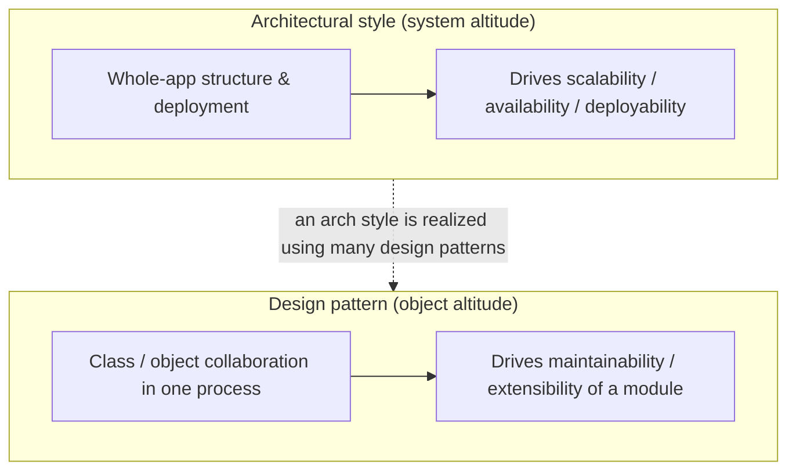
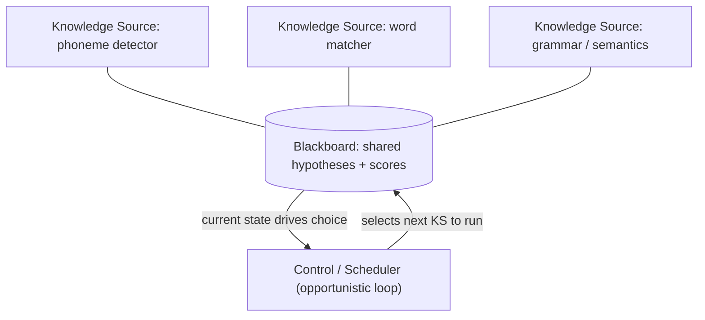
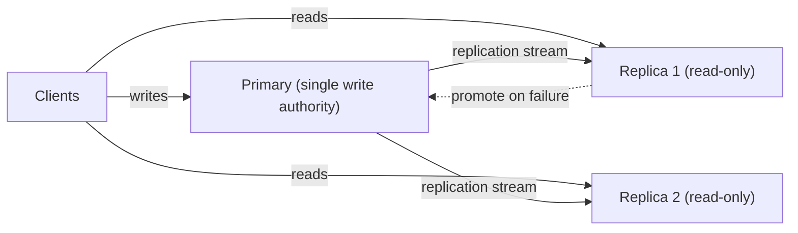
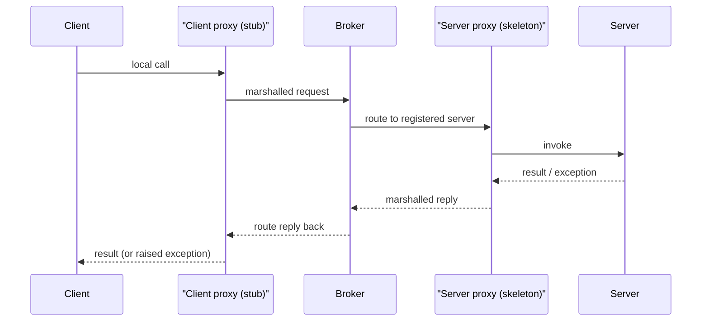
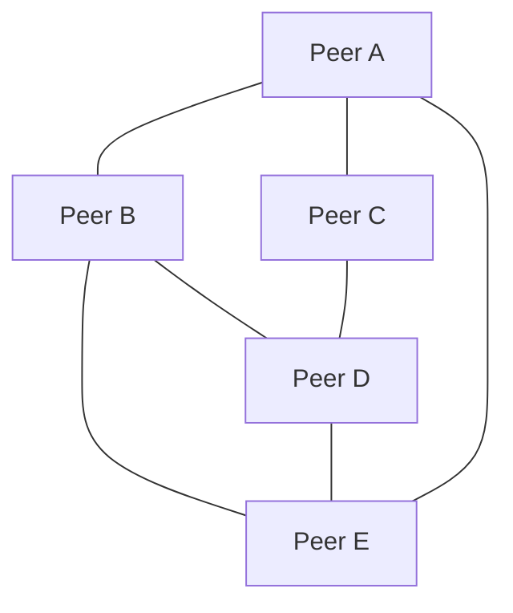
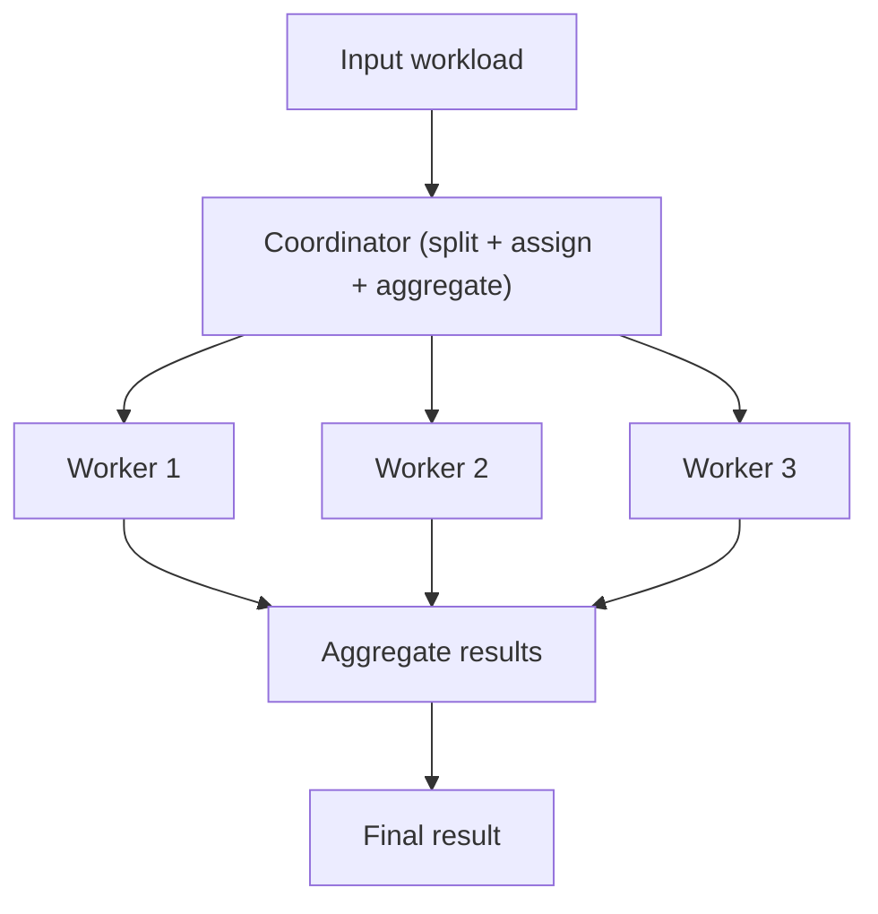
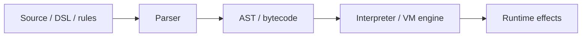
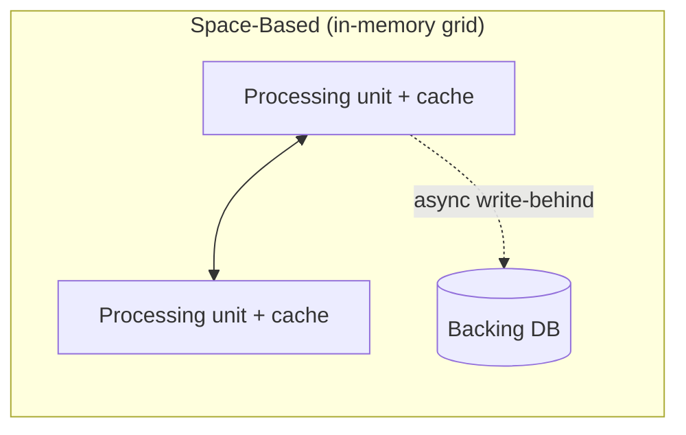

# Specialized Architectures (Blackboard, Primary-Replica, Broker)

A tour of the **specialized architectural styles** — the less-mainstream but
interview-relevant ways to structure and deploy a whole system. The three named in the
title (Blackboard, Primary-Replica, Broker) are the classics from *Pattern-Oriented
Software Architecture* (POSA vol. 1) and Mark Richards' *Software Architecture Patterns*;
this topic also rounds out the family with Peer-to-Peer, Master-Worker, and
Interpreter/Virtual-Machine, and gives a one-line-plus-pointer treatment of the big styles
that own dedicated deep-dive topics elsewhere.

> [!KEY-TAKEAWAY]
> **`arch-*` is a different altitude from `dp-*`.** The `arch-*` group describes
> **system-level structural / deployment styles** — how an entire application is organized
> and shipped. The `dp-*` "Design Patterns" group (GoF) is **object-level** — how classes
> and objects collaborate *inside* one process. Some names collide (Interpreter, Broker vs.
> Observer, MVC): when that happens this topic says so explicitly so you don't answer at the
> wrong altitude in an interview.

Every section below leads with a bolded **Problem it solves:** line — because an
interviewer's first question about any architecture is almost always *"what pain motivated
it?"* Lead with the pain, then the mechanism, the topology diagram, the trade-offs, and how
it differs from the style people confuse it with.

---

## Architectural styles vs object-level design patterns

**Problem it solves:** candidates routinely conflate "architecture" with "design patterns"
and answer a system-design question with a class diagram (or vice-versa). Naming the two
altitudes keeps the conversation crisp.

**How to hold the distinction.**

- **Architectural style (`arch-*`, this group):** the coarse-grained shape of the *whole
  system* — what the top-level components are, how they are distributed across processes /
  machines, and how they communicate. Decisions here dominate the system's **-ilities**
  (scalability, deployability, availability). Examples: Blackboard, Broker,
  Primary-Replica, Microservices, Event-Driven, Layered, Pipe-and-Filter.
- **Design pattern (`dp-*`, GoF & friends):** a reusable solution to a recurring
  *object-collaboration* problem *within* a component — class relationships and message
  flow. Examples: Observer, Strategy, Interpreter, Mediator.

**Watch the same-name traps.** *Interpreter* is both an architectural style (ship a
language + engine) and a GoF behavioral pattern (a class per grammar rule). *Broker* (POSA
architectural style) is easily confused with the *Observer/Mediator* GoF patterns. *MVC* is
an architectural/UI-composition style but is catalogued as an enterprise pattern. The
sections below flag each collision.

---

## Blackboard

**Problem it solves:** there is **no known deterministic, step-by-step algorithm** to solve
the problem. The classic cases are speech and handwriting recognition, sensor fusion,
image/signal interpretation, symbolic AI planning, and protein-structure prediction — where
the solution must be **assembled opportunistically** from many independent specialist
contributions rather than computed by one procedure.

**Intuition first.** Picture a group of specialists standing around a physical whiteboard.
Nobody knows the full answer alone. Each one watches the board, and the moment they see
something they recognize they step up and add their piece — a phonetics expert scribbles
sounds, a vocabulary expert turns sounds into candidate words, a grammar expert crosses out
words that can't fit. A moderator (the scheduler) decides who writes next based on what looks
most promising. That is Blackboard: not a fixed pipeline, but *opportunistic* assembly where
whoever can contribute most, given the current board, goes next.

**How it works / key components.** Three parts (from POSA vol. 1, origin: the Hearsay-II
speech system):

1. **Blackboard** — a shared, structured, global data store holding the evolving solution
   space: raw input plus every partial hypothesis, tagged with a confidence/score.
2. **Knowledge Sources (KSs)** — independent, specialist modules. Each watches the
   blackboard, and when the state matches its trigger condition it fires, reads partial
   results, and writes new/improved hypotheses back. KSs do **not** call each other; they
   communicate *only* through the blackboard.
3. **Control component (scheduler)** — the active, opportunistic loop. It inspects the
   blackboard and the set of triggerable KSs and, using heuristics, decides **which KS runs
   next**, repeating until a solution of acceptable confidence emerges (or it gives up).

**Worked example — Hearsay-II style speech recognition, board state evolving.** Input: a
noisy audio clip of someone saying *"the cat"*. Watch the blackboard's hypotheses and their
confidence scores change as the scheduler picks KSs:

| Step | Scheduler picks | Reads from board | Writes to board (hypothesis @ confidence) |
|---|---|---|---|
| 1 | Phoneme KS | raw audio segment | `/k/ @0.55`, `/g/ @0.45` (ambiguous stop consonant) |
| 2 | Phoneme KS | next segment | `/æ/ @0.8`, `/t/ @0.7` |
| 3 | Word KS | `/k/ /æ/ /t/` | candidate words `"cat" @0.6`, `"gat" @0.3` |
| 4 | Grammar/semantics KS | `"cat" @0.6`, prior word `"the" @0.9` | `"the cat" @0.85` (article+noun is grammatical → **boost**); prunes `"gat"` (not a word → confidence → 0) |
| 5 | Control checks threshold | `"the cat" @0.85` ≥ accept-threshold 0.8 | **stop** — emit `"the cat"` |

The key things to notice: (1) no fixed order — the scheduler chose Phoneme twice, then Word,
then Grammar, *because* that was where the most promising partial evidence sat; (2) the
grammar KS *raised* `"cat"` from 0.6 to 0.85 by combining it with a neighbor and *pruned* the
dead `"gat"` branch — contributions are opportunistic corrections, not a one-way pipe; (3)
the same run on cleaner audio might never fire the grammar KS at all. That non-determinism is
exactly why Blackboard is powerful for fuzzy domains and hard to test.

**Trade-offs.**

- **Pros:** extreme flexibility and extensibility — add/remove a KS without touching the
  others; ideal for fuzzy, ill-defined domains; supports experimentation with different
  reasoning strategies; fault-tolerant to a weak KS (others compensate).
- **Cons:** the heuristic control loop is **non-deterministic and hard to reason about** —
  difficult to test, debug, and to prove it terminates or converges; performance can be
  poor (lots of re-scanning); the shared blackboard is a concurrency/consistency hotspot;
  no guarantee of an optimal or even correct answer.
- **When to use:** speculative, non-algorithmic domains (perception, fusion, planning,
  scientific discovery) where partial evidence from diverse specialists must be combined.
- **When to avoid:** any problem with a known deterministic algorithm, hard real-time
  deadlines, or where reproducibility/auditability is required.
- **Key -ilities:** optimizes **extensibility / flexibility**; sacrifices
  **testability, predictability, and performance**.

**Differs from adjacent styles.** Versus a plain **shared-repository / Space-Based** store:
those are passive data caches; Blackboard adds an *active, opportunistic control component*
that decides who runs next. Versus **Master-Worker**: workers solve a *deterministic*
partition of a known problem, KSs make *opportunistic* contributions to an unknown one.
Versus the GoF **Observer/Mediator** (object altitude): superficially similar
publish-to-shared-state shape, but Blackboard is a whole-system style with a reasoning
scheduler, not an object-notification mechanism.

*Deep dive: none — this topic owns Blackboard fully.*

---

## Primary-Replica

**Problem it solves:** a single node cannot both serve growing **read** load and **survive
failure**. You need to scale reads and add redundancy while keeping **one authoritative
source of writes** so there are no write conflicts to reconcile.

> [!TIP]
> Primary-Replica was historically called *master-slave*; that term is deprecated. Use
> **Primary-Replica** (or leader-follower) everywhere.

**How it works / key components.** One **Primary** node accepts all writes and is the source
of truth. It streams its changes (its write-ahead log / change stream) to one or more
**Replicas**, which apply them to stay in sync. Clients route **writes to the primary** and
**reads to the replicas** (read fan-out). Replication can be **synchronous** (primary waits
for replica ack — stronger durability, higher write latency), **asynchronous** (fire and
forget — lowest latency, risk of losing recent writes on failover), or **semi-synchronous**.
On primary failure, a **failover** promotes a replica to primary (via leader election or an
orchestrator).

**Worked example 1 — read-scaling math.** Say one node can serve **3,000 reads/s** before
CPU saturates, and your workload is **10,000 reads/s + 500 writes/s**. A single node can't do
10,000 reads. With **1 primary + 4 replicas**: all 500 writes/s go to the primary (still well
under its 3,000 ceiling), and the 10,000 reads/s fan out across the **4 replicas** →
2,500 reads/s each, under the 3,000 ceiling. It fits. Note what did *not* change: write
capacity is still capped at one node (~3,000 writes/s here) — the 4 replicas add
`4 × 3,000 = 12,000 reads/s` of read capacity (**4× a single node**) and **zero** write
headroom. That is the whole trade in one calculation: replicas scale reads, never writes.

**Worked example 2 — a read-your-writes anomaly, traced on the clock.** Replication is
**async** with ~200 ms lag. A user updates their profile:

- **t = 0 ms** — client sends `UPDATE name='Alice'` → **primary** commits it. Primary now has `Alice`.
- **t = 0 ms** — primary begins streaming the change to replicas (async: it does *not* wait).
- **t = 100 ms** — same client immediately reloads the page → read is routed to **Replica 2**.
- **t = 100 ms** — Replica 2 has not yet applied the change (it arrives at ~t = 200 ms), so it returns the **old** name `Bob`.
- **User sees their own just-saved change *missing*** — the classic read-your-writes violation.
- **t = 200 ms** — the change lands on the replicas; a read now would return `Alice`, but the damage (a confused user) is already done.

**Fix (the senior follow-up):** for N seconds after a write, route *that* client's reads to
the **primary** (read-your-own-writes / session consistency), or have the client remember the
write's log position (LSN) and only read from a replica whose applied-LSN ≥ that watermark
(monotonic reads). See the gotchas below for split-brain and fencing.

**Trade-offs.**

- **Pros:** horizontal **read scaling**; **redundancy / failover** for availability; simple
  consistency model (single writer, no write-conflict resolution); replicas double as
  backup / analytics / geo-local read endpoints.
- **Cons:** **replication lag** → replicas serve stale data (read-your-writes anomalies
  under async); the primary is a **single write bottleneck** and a failure point until
  promotion completes; failover adds complexity (election, fencing the old primary to avoid
  split-brain); does **not** scale writes.
- **When to use:** read-heavy workloads, or any datastore needing HA with a simple
  consistency story (most SQL databases default to this).
- **When to avoid:** write-bound workloads (shard instead), or systems that need
  multi-region low-latency writes (consider multi-primary / leaderless).
- **Key -ilities:** optimizes **read scalability + availability**; trades off **write
  scalability + strong consistency** (on replicas).

**Differs from adjacent styles.** Versus **Multi-Primary / leaderless (Peer-to-Peer)**:
those accept writes on many nodes for write-availability but must **resolve write
conflicts** (last-write-wins, CRDTs, quorums); Primary-Replica has exactly one write
authority and therefore no conflicts. Versus **Master-Worker**: that partitions *compute*,
not *data replicas*. Versus **sharding**: sharding splits the dataset across primaries for
write scale; Primary-Replica copies the *same* data for read scale/HA — the two are
combined in practice.

**Gotchas / senior follow-ups.**

- **"How do you avoid two primaries after a network partition?"** The failure mode is
  **split-brain**: the orchestrator thinks the primary died and promotes a replica, but the
  old primary is only *unreachable*, still alive and still accepting writes → two primaries
  diverge. Prevent it with **fencing**: issue a monotonically increasing **fencing token** on
  each promotion and have the storage/downstream reject writes carrying a stale token; or
  **STONITH** ("shoot the other node in the head") — power-off/network-isolate the old
  primary before promotion completes. Requiring a **quorum** to elect a primary also stops a
  minority partition from promoting.
- **"How do you give a client read-your-writes despite async lag?"** Route that client's
  reads to the primary for a short window after its write, use **monotonic-read / session
  consistency**, or gate replica reads on a **replica-LSN watermark** ≥ the write's position
  (both shown in worked example 2 above).

*Deep dive: see `databases-sql-nosql-sharding-replication` for replication internals
(sync/async/semi-sync, quorum reads/writes, sharding, split-brain, failover mechanics).*

---

## Broker

**Problem it solves:** distributed components must invoke one another **without hard-coding
each other's location, transport, or platform**. You want **location transparency** and
decoupling so services can be added, moved, replaced, or scaled at runtime without clients
being rewritten.

**Intuition first.** Think of an old **telephone switchboard operator**. You don't dial a
physical wire; you ask for "the sales desk" and the operator finds whichever line sales is on
right now and connects you. Sales can move desks, hire a second line, or go on break — you
never learn or care about the number. The **broker** is that operator. The **stub** is the
handset you speak into on your side; the **skeleton** is the handset ringing on theirs;
**marshalling** is turning your spoken words into signals on the wire and back. Location
transparency = you dial a *name*, not a *number*.

**How it works / key components.** A central **Broker** mediates communication between
clients and servers. Servers **register** their capabilities and endpoints with the broker.
A **client-side proxy (stub)** marshals a client request into a transport-neutral message;
the broker **routes** it to the right server (looking up the registration), a **server-side
proxy (skeleton)** unmarshals and invokes the server, and results/exceptions are routed back
the same way. Neither side knows the other's physical address. This is the lineage of
**CORBA, Java RMI, DCOM, and modern gRPC/service registries**.

Two recognized forms:

- **RPC-broker (request/response):** location-transparent remote calls — the POSA Broker
  proper, treated here.
- **Message-broker (fire-and-forget pub-sub / queues):** RabbitMQ, MQTT, Kafka — see the
  deep-dive pointer below.

**Trade-offs.**

- **Pros:** **location transparency** and dynamic (re)binding; platform/language
  **interoperability**; servers can be relocated, load-balanced, or upgraded without client
  changes; centralizes cross-cutting concerns (discovery, security, monitoring).
- **Cons:** the broker is a **central bottleneck and single point of failure** (mitigated by
  clustering); it adds **latency and operational complexity**; end-to-end message
  ordering/consistency guarantees are limited; proxies/IDL add development overhead.
- **When to use:** heterogeneous distributed systems needing decoupled, location-transparent
  interaction; middleware/integration layers; service-registry-driven architectures.
- **When to avoid:** simple, tightly-coupled, latency-critical local calls; when a direct
  point-to-point or edge gateway suffices.
- **Key -ilities:** optimizes **interoperability + flexibility (evolvability)**; trades off
  **performance + operational simplicity**.

**Differs from adjacent styles.** Versus **Publish-Subscribe / Event-Driven bus**: Broker
(RPC form) is **request/response** "many-to-one-to-many" routing with a reply path;
pub-sub is **fire-and-forget** "many-to-many" event fan-out with no reply. Versus **API
Gateway**: a gateway sits at the *edge* routing north-south client traffic; a broker
mediates *internal* service-to-service calls. Versus **Service Mesh / Sidecar**: the mesh
distributes brokering into per-instance sidecars (no central hub). Versus the GoF
**Mediator/Proxy** patterns (object altitude): same shape, but those are class-level
collaborations inside one process.

*Deep dive: see `message-queues-and-async` for the message-broker/queue/pub-sub form
(RabbitMQ, MQTT, Kafka delivery semantics, ordering, backpressure).*

---

## Peer-to-Peer

**Problem it solves:** eliminate the central-server **bottleneck and single point of
failure** entirely. Let symmetric nodes each act as **both client and server** so the
system scales and self-heals as nodes freely join and leave (file sharing, blockchain,
gossip/overlay networks, some NoSQL clusters).

**How it works / key components.** Every **peer** is functionally identical — it both
requests and provides resources. There is no privileged coordinator. Peers discover each
other and locate resources via an **overlay network**: a **Distributed Hash Table (DHT)** /
consistent hashing for structured lookup, or **gossip** for membership and state
dissemination. Global agreement (where needed) uses **consensus** protocols. Nodes joining
or leaving trigger rebalancing of key ranges/partitions.

**How a DHT lookup actually finds a key (two-line intuition).** Both keys *and* nodes are
hashed onto the **same circular id space** (a consistent-hashing ring). A key is owned by the
first node **clockwise** from the key's hash. To find it, a peer doesn't scan everyone — each
node keeps a **routing/finger table** of peers at exponentially increasing distances around
the ring, so a lookup jumps roughly halfway to the target each hop and lands in **~log(N)
hops** (e.g. ~20 hops for a million nodes). Concretely: key hashes to position 42; node 40
isn't responsible, so it forwards toward 42; the next node clockwise is node 45 → node 45
owns and returns the key.

**Trade-offs.**

- **Pros:** no central bottleneck/SPOF; **elastic scale** and resilience — capacity grows
  with membership; self-healing as nodes churn; no single owner to attack or overload.
- **Cons:** **hard consistency and global-state** reasoning (needs DHT/gossip/consensus);
  peer **discovery, security, and trust** are difficult; unpredictable performance;
  debugging distributed emergent behavior is hard.
- **When to use:** massive-scale content distribution, decentralized/trustless systems
  (blockchain), leaderless datastores (Dynamo-style rings), overlay/mesh networks.
- **When to avoid:** systems needing strong consistency, central control/audit, or simple
  operations; small systems where a server is cheaper.
- **Key -ilities:** optimizes **scalability + availability (no SPOF)**; trades off
  **consistency + manageability**.

**Differs from adjacent styles.** Versus **Primary-Replica / Client-Server**: those have a
privileged authoritative node; P2P has **none** — every peer is equal. Versus
**Master-Worker**: that has a coordinator handing out work; P2P is symmetric with no
coordinator.

*Deep dive: partial — consensus internals live in `consensus-clocks-and-time`; DHT /
consistent-hashing mechanics live in `rate-limiting-and-consistent-hashing`.*

---

## Master-Worker

**Problem it solves:** a large but **deterministic** workload must be computed **in parallel
with fault isolation** — split the work, run identical workers concurrently, and aggregate
their results (MapReduce, render farms, parallel search/simulation, batch ETL).

> [!TIP]
> The coordinator was historically called the *master*; that word is fine here, but avoid the
> deprecated *master-slave* framing — say **coordinator/worker** or **Master-Worker**. It is a
> compute-partitioning cousin of Primary-Replica.

**How it works / key components.** A **coordinator** splits the input into independent
sub-tasks (shards), dispatches them to a pool of **identical, stateless workers**, monitors
progress, **re-dispatches failed or straggling** sub-tasks, and **aggregates** the partial
results into the final answer. Workers do not communicate with each other; each processes
its shard independently — this is what makes the parallelism safe and retries idempotent.

**Worked example — why one straggler wrecks a parallel job.** A job is split into **100
independent shards** run across 100 workers. **99 shards finish in 2 s** each; **1 shard hits
a slow disk and takes 20 s**. Because the coordinator can only aggregate once *all* shards
return, **job wall-clock = max(shard times) = 20 s**, not the 2 s the other 99 achieved. So
even though 99% of the work is done at t = 2 s, the job is **10× slower** than it "should" be
— the tail dominates. **Fix — speculative (backup) execution:** at, say, t = 5 s the
coordinator notices shard #100 is far behind its peers and launches a **duplicate copy** on a
different (healthy) worker; whichever copy finishes first wins, the other is killed. If the
backup finishes in 2 s, wall-clock drops to ~7 s. This is exactly what MapReduce/Hadoop call
"speculative execution."

**Amdahl's-law sanity check.** Speed-up is also capped by any *serial* fraction. If 5% of the
job is inherently serial (e.g. the final aggregation) and 95% parallelizes, then even with
infinite workers the max speed-up is `1 / 0.05 = 20×` — you can never beat 1/20th of the
single-threaded time no matter how many workers you add. Parallelism has a ceiling; know it
before promising "near-linear."

**Trade-offs.**

- **Pros:** near-linear **parallel speed-up**; **fault isolation** — retry just the failed
  shard, not the whole job; workers scale horizontally and elastically; simple mental model.
- **Cons:** the coordinator is a **bottleneck / SPOF**; correctness requires sub-tasks to be
  **independent and deterministic**; **stragglers** dominate tail latency; aggregation can
  be a second bottleneck; poor for tightly-coupled computations needing inter-worker
  communication.
- **When to use:** embarrassingly-parallel batch compute, MapReduce-style jobs, fan-out
  search, distributed rendering/simulation.
- **When to avoid:** low-latency online request paths, workloads with heavy inter-task
  dependencies, or non-deterministic sub-tasks.
- **Key -ilities:** optimizes **performance (throughput) + fault isolation**; trades off
  **latency (stragglers) + coordinator availability**.

**Differs from adjacent styles.** Versus **Primary-Replica**: that replicates *data* for
read/HA; Master-Worker partitions *compute*. Versus **Blackboard**: workers solve a *known
deterministic* partition; KSs make *opportunistic* contributions to an unsolved problem.
Versus generic **Peer-to-Peer**: Master-Worker has a central coordinator; P2P is symmetric.

*Deep dive: see `design-job-scheduler-task-queue` and `design-web-crawler-data-processing`
for concrete coordinator/worker implementations (queues, work stealing, dedup).*

---

## Interpreter Virtual-Machine

**Problem it solves:** system behavior must be **defined and changed without recompiling or
redeploying the host** — encode the logic as a language/DSL/bytecode and ship an **engine
that interprets it at runtime** (rules engines, scripting layers, workflow/BPM engines,
query engines, and language VMs like the JVM/CLR).

**How it works / key components.** A **source program** (a DSL, script, rule set, or
bytecode) is read by a **parser** into an intermediate representation (**AST** or bytecode).
An **interpreter / virtual-machine engine** walks that representation and executes it against
the host's runtime, producing effects. The behavior lives in *data* (the program), so
changing behavior means shipping new program text — not new compiled code.

**Trade-offs.**

- **Pros:** ultimate **runtime flexibility** — behavior is user-extensible and hot-swappable
  without redeploying the host; enables non-developers (analysts) to change rules; strong
  isolation/sandboxing of the guest program; portability across host platforms (write once,
  interpret anywhere).
- **Cons:** **interpretation overhead** (slower than compiled native code); the cost of
  building and maintaining the language + engine; **harder static analysis / tooling** and
  debugging of the guest program; version-skew between language and engine.
- **When to use:** rules engines, scripting/plugin behavior expressed as a language,
  workflow/DSL engines, portable bytecode VMs.
- **When to avoid:** hot performance-critical paths, or when a compiled plugin/microkernel
  approach gives enough flexibility.
- **Key -ilities:** optimizes **flexibility / evolvability + portability**; trades off
  **performance + toolability**.

**Differs from adjacent styles.** Versus **Microkernel / Plugin**: plugins are *compiled*
modules loaded by a core; an interpreter runs a *language* defined as data. Versus the GoF
**Interpreter pattern** (object altitude): same name, but the GoF version is a class-per-
grammar-rule solution *inside* one component — this is the *system* choosing to be
language-driven.

*Deep dive: none dedicated — contrast with the GoF Interpreter in `dp-behavioral` to keep
the altitude straight.*

---

## Overlap styles — style overview with deep-dive pointers

The styles below are first-class architectures but each has a dedicated deep-dive topic. Per
the cross-reference rule this topic gives only the **one-to-two-line architectural framing +
an explicit "Deep dive:" pointer**, and does **not** duplicate the deep-dive content.

| Style | Problem it solves (1-line) | Key trade-off | Confused with | Deep dive: see |
|---|---|---|---|---|
| **Pipe-and-Filter** | Process a data stream through independent, recomposable transformation stages | Composability/reuse vs. end-to-end latency & no shared global state | Broker chain / EDA | `dp-distributed-cloud` |
| **Event-Driven / Pub-Sub / CQRS / Event Sourcing / Saga** | Decouple producers & consumers via async events for scale and extensibility | Loose coupling + scalability vs. eventual consistency & hard debugging | Broker (message form) | `event-driven-cqrs-saga-cdc` |
| **Microservices / Monolith** | Independent deployability & team autonomy vs. deployment simplicity | Deployability/scalability vs. distributed-system + operational complexity | SOA / Broker | `microservices-monolith-api-design`, `microservices-ddd-and-boundaries` |
| **Space-Based / In-Memory Data Grid** | Remove the database bottleneck under extreme, spiky concurrent load | Elastic high throughput vs. memory cost & data-loss/consistency risk | Blackboard (shared space) | `caching-and-cdn`, `aws-caching-elasticache-dax` |
| **Serverless / FaaS** | Run event-triggered functions with no server or capacity management | Zero-ops autoscale + pay-per-use vs. cold starts, vendor lock-in, statelessness | EDA / Broker | `aws-serverless-lambda-stepfunctions` |
| **Presentation: MVC / MVP / MVVM, Repository, DTO** | Separate UI/presentation from domain & data | Testability/separation vs. boilerplate & indirection | Layered | `dp-enterprise-application` |
| **Sidecar / Ambassador / Service Mesh** | Offload cross-cutting concerns (routing, mTLS, retries) from app code | Uniform, language-agnostic infra vs. per-instance overhead & mesh complexity | Broker / API Gateway | `dp-distributed-cloud` |

> [!WARNING]
> Do not re-derive the deep-dive material here. If an interviewer wants Saga compensation,
> quorum tuning, or cold-start mitigation, that is the deep-dive topic's job — from
> `arch-specialized` you name the style, its core trade-off, and point to the deep dive.

---

## Common follow-up questions

- **"When would you actually choose Blackboard over a straightforward pipeline?"** When no
  deterministic algorithm exists and the answer must be assembled opportunistically from
  diverse specialists (perception, fusion, planning) — accept non-determinism as the price
  of flexibility.
- **"Primary-Replica gives you read scaling — how do you scale *writes*?"** You don't with
  replication alone; you **shard** (partition data across multiple primaries), optionally
  each primary having its own replicas; or move to multi-primary/leaderless and accept
  conflict resolution.
- **"Broker vs. API Gateway vs. Service Mesh — pick one."** Broker = internal
  location-transparent RPC via a central mediator; API Gateway = edge/north-south routing;
  Service Mesh = the same cross-cutting concerns pushed into per-instance sidecars (no hub).
- **"Isn't a message queue just a Broker?"** Yes — the *message-broker* form. POSA's Broker
  is the request/response RPC form; the async pub-sub/queue form is covered in
  `message-queues-and-async`.
- **"What's the difference between Master-Worker and Primary-Replica?"** Master-Worker
  partitions *compute*; Primary-Replica replicates *data* for reads/HA. Different problems.
- **"Interpreter the architecture vs. Interpreter the GoF pattern?"** Altitude: the style
  makes the *whole system* language-driven (ship an engine); the pattern is a class-per-rule
  solution *inside* a component.
- **"Which -ility does each style optimize?"** Blackboard → extensibility; Primary-Replica →
  read scalability + availability; Broker → interoperability/evolvability; P2P → scalability
  + no-SPOF availability; Master-Worker → throughput + fault isolation; Interpreter →
  flexibility + portability.

## References

- Buschmann, Meunier, Rohnert, Sommerlad, Stal — *Pattern-Oriented Software Architecture,
  Vol. 1* (POSA) — Blackboard, Broker, Master-Worker, Pipes-and-Filters.
- Erman, Hayes-Roth, Lesser, Reddy — *The Hearsay-II Speech-Understanding System* (origin of
  Blackboard).
- Mark Richards — *Software Architecture Patterns* (O'Reilly) — layered, event-driven,
  microkernel, microservices, space-based.
- Mark Richards & Neal Ford — *Fundamentals of Software Architecture* (O'Reilly) —
  architectural styles, -ilities, and trade-off analysis.
- Martin Fowler — martinfowler.com (enterprise application architecture, MVC family, event
  sourcing/CQRS).
- Chris Richardson — microservices.io (pattern language, saga, API gateway).
- Microsoft — Azure Architecture Center, Cloud Design Patterns (sidecar, ambassador,
  broker/queue-based patterns).
