# UI / Presentation Architectures (MVC, MVP, MVVM)

This topic is the **presentation-layer** slice of the `arch-*` Architectural Patterns
group. Where the other `arch-*` topics describe *system-level* styles — how a whole
application is structured and deployed (layered, microservices, event-driven,
pipe-and-filter) — these are a **lower altitude** (*altitude* = level of
abstraction / scope): patterns for structuring the code
*inside* the UI / presentation tier. They decide **where UI logic lives** (rendering,
formatting, input-handling, screen state) and **how that logic is separated from the
domain** so it can evolve — and be tested — independently. Throughout, each style is
graded on its **"-ilities"** (*quality attributes* — testability, maintainability,
performance, debuggability, and so on).

They are also a **different altitude from the object-level GoF `dp-*` patterns**:
these are compositional patterns for an entire presentation subsystem (they *use* GoF
patterns like Observer, Mediator, and Command internally), not single-responsibility
class patterns.

> [!KEY-TAKEAWAY]
> The one tension that runs through **every** style below: *where does presentation
> logic live, and can you unit-test it without spinning up a real UI?* Read each
> style as an answer to that question. The modern arc — MVC → MVP → MVVM →
> MVU/Flux/Redux/MVI — is a steady march toward (a) making the View "humble" (logic-free
> and mockable) and (b) making data flow **predictable/unidirectional**.

> [!INTERVIEW]
> **De-dup / cross-reference rule.** MVC, MVP, MVVM, MVU, the Presentation Model, and
> the Humble Object are *also* cataloged as enterprise presentation patterns (PoEAA /
> Fowler's *GUI Architectures*) in **`dp-enterprise-application`**. That topic is the
> pattern-catalog deep dive. **This** topic keeps only the *architectural comparison*:
> testability, coupling, data-binding direction, and where each style dominates. For
> each overlapping style you'll see `Deep dive: see dp-enterprise-application`.

> [!WARNING]
> "MVC" means different things in different eras. **Classic Smalltalk-80 MVC**
> (Reenskaug, 1979) has the View observing the Model directly. **Server-side web MVC**
> (Rails, Spring MVC, ASP.NET MVC) is really *Model 2 / Front Controller + Page
> Controller* — the "View" is a stateless template rendered per request and there is no
> live observer link. When an interviewer says "MVC," pin down *which* MVC.

---

## MVC (Model-View-Controller)

**Problem it solves:** A UI screen mixes three unrelated concerns — the domain data,
how it is drawn, and how user input is interpreted. Bundling them into one class means
a change to the visual design forces a change to business logic (and vice-versa), and
nothing is reusable or testable. MVC **separates those three roles** so the same Model
can drive multiple Views and the rendering can change without touching domain logic.

**How it works / key components.**
- **Model** — domain data and business rules; knows nothing about the UI.
- **View** — renders the Model to the screen; in *classic* MVC it **observes** the
  Model and re-renders on change.
- **Controller** — receives raw user input (clicks, keystrokes), translates it into
  operations on the Model (and sometimes selects the next View).

The classic (Smalltalk) form is a **triangle**: Controller updates Model, Model
notifies View (Observer), View reads Model. In **web MVC** the loop is per-request and
linear: Controller handles the HTTP request, updates the Model, then picks a View
template to render — there is no persistent observer link.

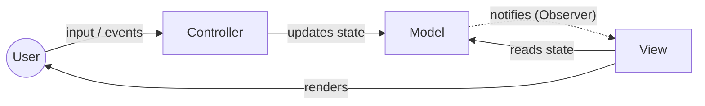

**Trade-offs / -ilities.**
- **Pros:** clean separation of concerns; multiple Views over one Model; the dominant,
  well-understood style for server web frameworks; low ceremony.
- **Cons:** the classic View↔Model observer link couples the View to the Model, which
  hurts **testability** — you often can't test presentation logic without a running
  View. Roles blur in practice ("fat controller" or "Massive View Controller"). *Why it
  happens:* on iOS the `UIViewController` (and similarly Rails' controller) is the one
  class the framework hands you that owns the view lifecycle, navigation, and event
  wiring — so with no other natural home, networking, formatting, and business logic all
  accrete there until the class is thousands of lines. This exact pain is the setup for
  VIPER below, which gives each of those concerns its own component.
- **When to use:** server-rendered web apps (Rails / Spring MVC / ASP.NET MVC); any UI
  where per-request or Observer-driven rendering is acceptable.
- **When to avoid:** rich, stateful client UIs that demand heavy unit testing of view
  logic — reach for MVP or MVVM.
- **Optimizes:** separation of concerns and *deployability of the render layer*; weaker
  on **testability** than its successors.

**Differs from adjacent styles.** vs **MVP**: MVC's Controller handles *input* while
the View may still read the Model directly; MVP's Presenter mediates *everything* and
the View becomes passive. vs **MVA**: MVA forbids the View↔Model link entirely (all
traffic through the adapter).

> Deep dive: see **`dp-enterprise-application`** (MVC, Front Controller, Page Controller).

---

## MVP (Model-View-Presenter)

**Problem it solves:** In classic MVC the View still talks to the Model (reads it,
observes it), so you cannot unit-test the screen's behavior without instantiating real
UI widgets. MVP makes the **View a "humble," dumb, mockable component**: it exposes a
thin interface (getters/setters, events) and delegates *all* decision-making to a
**Presenter**, so presentation logic can be tested against a fake View.

**How it works / key components.**
- **View** — a passive interface (`IView`): raises user events, exposes properties the
  Presenter sets. Contains no logic.
- **Presenter** — holds a reference to the View *interface*; handles all UI logic;
  reads/writes the Model; pushes results back into the View via the interface.
- **Model** — domain/data, UI-agnostic.

The View and Presenter form a **1:1 pair**. Because the Presenter depends only on the
View *interface*, tests substitute a mock View.

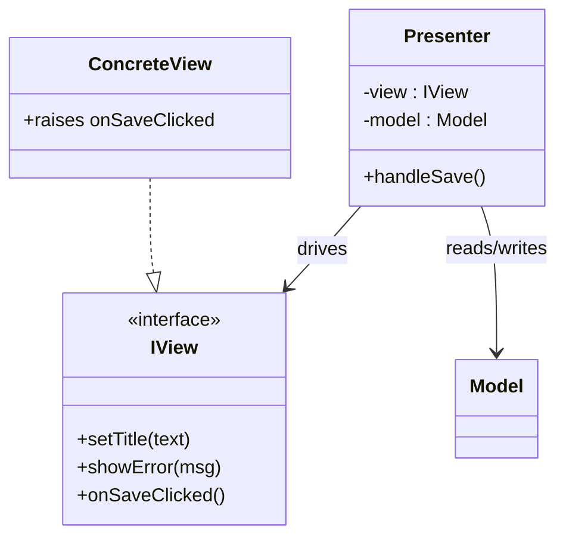

**In code** — the Presenter reads the humble View, decides, and pushes results back
through the interface:

```java
interface IView {                 // the "humble" View: getters, setters, events
    String getTitle();
    void   setTitle(String t);
    void   showError(String msg);
}

class NotePresenter {
    private final IView  view;
    private final NoteRepo model;

    void handleSave() {           // fired by view.onSaveClicked()
        String title = view.getTitle();
        if (title.isBlank()) {    // <-- validation lives HERE, in the Presenter
            view.showError("Title is required");
            return;
        }
        model.save(new Note(title));
        view.setTitle(title.trim());
    }
}
```

A unit test now needs no widgets: pass a fake `IView` whose `getTitle()` returns `""`,
call `handleSave()`, and assert `showError("Title is required")` was invoked.

**Trade-offs / -ilities.**
- **Pros:** excellent **testability** (mock the View interface); the View is trivially
  swappable (WinForms ↔ web ↔ mobile) behind the same interface; clear ownership of UI
  logic.
- **Cons:** verbose — a 1:1 View interface + Presenter per screen means lots of
  boilerplate and hand-written wiring; the Presenter can grow large.
- **When to use:** widget-based desktop/mobile stacks with weak binding support
  (classic WinForms, GWT, early Android) where you still want testable UI logic.
- **When to avoid:** frameworks with strong declarative data-binding — MVVM removes most
  of MVP's glue code.
- **Optimizes:** **testability** and view-independence; costs **developer velocity**
  (boilerplate).

**Differs from adjacent styles.** vs **MVC**: the Presenter mediates *all* View↔Model
traffic (no direct link); the Controller does not. vs **MVVM**: MVP pushes state into
the View **manually** through an interface; MVVM lets a **data-binding engine** sync a
ViewModel to the View automatically.

> Deep dive: see **`dp-enterprise-application`** (MVP).

---

## MVP variant: Supervising Controller

**Problem it solves:** Passive-View MVP forces the Presenter to push *every* field into
the View by hand, which is a lot of boilerplate for trivial mappings. Supervising
Controller lets the View **do simple, declarative binding itself** (bind a label to a
field) and reserves the Presenter for **complex** presentation logic only.

**How it works / key components.** The View uses the framework's declarative binding for
straightforward field↔widget mappings; the "Supervising Controller" (a Presenter)
handles conditional formatting, enabling/disabling, and other logic that binding can't
express declaratively.

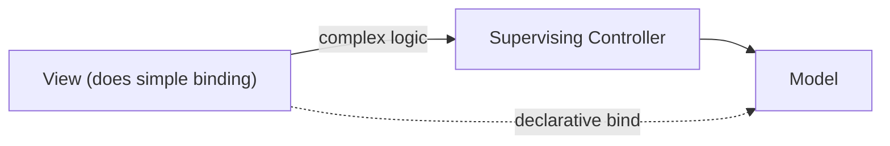

**Trade-offs / -ilities.**
- **Pros:** far less boilerplate than Passive View; uses the platform's binding for the
  easy 80%.
- **Cons:** the logic that lives in the View's declarative bindings is **not
  unit-testable** — you've traded some testability for brevity; two places now hold
  presentation logic.
- **When to use:** binding-capable UI where most mappings are trivial and only a few
  need code.
- **When to avoid:** when maximal test coverage of presentation logic is the priority.
- **Optimizes:** developer velocity; slightly weaker **testability** than Passive View.

**Differs from adjacent styles.** vs **Passive View**: Supervising Controller *allows*
view-side binding; Passive View forbids all view logic. vs **MVVM**: MVVM formalizes the
"binding does the simple stuff" idea with an observable ViewModel and a binding engine.

> Deep dive: see **`dp-enterprise-application`** (Supervising Controller).

---

## MVP variant: Passive View

**Problem it solves:** Any logic left in the View is logic you cannot cover with a plain
unit test. Passive View pushes that to the extreme: the View holds **zero logic and zero
state decisions** — every value is set explicitly by the Presenter — so essentially the
entire presentation is testable.

**How it works / key components.** The View is a completely dumb surface: it exposes
setters and raises events, nothing more. The Presenter reads the Model and *explicitly*
sets each View property; the View never reads the Model. This is the **Humble Object**
pattern applied to the View.

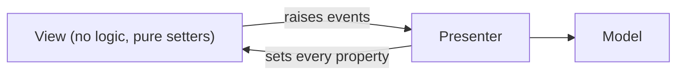

**Trade-offs / -ilities.**
- **Pros:** maximum **testability** — nearly all presentation behavior lives in the
  testable Presenter; behavior is deterministic.
- **Cons:** maximum **boilerplate** — the Presenter must set every widget property by
  hand; no leverage from framework binding.
- **When to use:** when correctness/testability of UI logic is paramount and tooling
  binding is weak or untrusted.
- **When to avoid:** rich binding-first frameworks where MVVM gets similar testability
  with less code.
- **Optimizes:** **testability** at the direct expense of velocity.

**Differs from adjacent styles.** vs **Supervising Controller**: Passive View allows *no*
view logic at all. vs **MVVM**: MVVM reaches comparable testability by binding to an
observable ViewModel instead of hand-setting properties.

> Deep dive: see **`dp-enterprise-application`** (Passive View / Humble Object).

---

## MVVM (Model-View-ViewModel)

**Problem it solves:** MVP's Presenter is full of tedious "glue code" that copies values
between the Model and the View. MVVM **eliminates that glue** by introducing a
declarative **two-way data-binding** engine: the View binds its widgets to properties
and commands on an **observable ViewModel**, and the framework keeps them in sync
automatically. Introduced by John Gossman (Microsoft, WPF); it is Fowler's *Presentation
Model* plus platform data-binding.

**How it works / key components.**
- **View** — declarative markup (XAML/HTML template) that **binds** to the ViewModel;
  contains little or no code-behind.
- **ViewModel** — an observable abstraction of the View's *state and behavior*: exposes
  bindable properties (raising change notifications) and **commands** (a *command* is a
  bindable, invokable action object — e.g. WPF's `ICommand` — that the View triggers on a
  button without wiring a code-behind callback); contains
  presentation logic; references the Model but never the View.
- **Model** — domain/data.
- **Binder** — the framework's binding engine that synchronizes View ↔ ViewModel
  (often two-way) and routes commands.

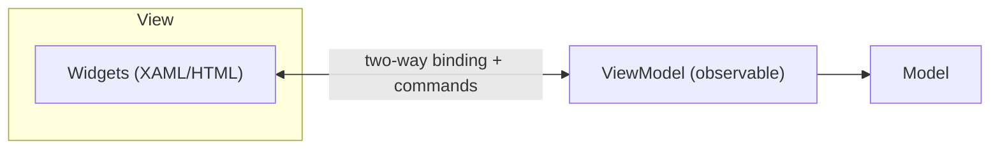

**In code** — the ViewModel holds no View reference; it just raises change
notifications and the binder redraws whatever is bound. The same empty-title rule now
lives in a bindable property:

```csharp
class NoteViewModel : INotifyPropertyChanged {
    string _title = "";
    public string Title {                    // <Bind Text of the TextBox to this
        get => _title;
        set { _title = value; OnChanged(nameof(Title));
                               OnChanged(nameof(Error)); }   // recompute Error too
    }
    public string Error => string.IsNullOrWhiteSpace(Title) ? "Title is required" : "";
    public ICommand Save => new RelayCommand(               // bound to the Save button
        execute:   () => _repo.Save(new Note(Title)),
        canExecute: () => Error == "");                     // button auto-disables
}
```

No `view.showError(...)` call: the View has a label bound to `Error`, so when the user
clears the box, `Title`'s setter fires `OnChanged`, the binder re-reads `Error`, and the
message appears — the sync is the framework's job, not the ViewModel's.

**Trade-offs / -ilities.**
- **Pros:** minimal boilerplate (binding replaces glue); the ViewModel is highly
  **testable** (no UI dependency); enables a designer/developer split (designers own the
  View markup); great fit for binding-rich frameworks.
- **Cons:** binding is "magic" — hard to **debug** when it silently fails; classic
  two-way binding is **memory-leak-prone** (dangling change subscriptions) and can cause
  performance issues with large/complex bindings on specific frameworks (e.g. WPF's
  `PropertyChanged` handlers, AngularJS's digest-cycle cost with many watchers);
  requires framework binding support. *The leak mechanism:* a long-lived ViewModel (or
  observable) keeps the change-notification handler pointing at a short-lived View, so
  the View can never be garbage-collected while the ViewModel is alive — the fix is weak
  event listeners or explicitly unsubscribing when the View is disposed.
- **When to use:** WPF, UWP, Xamarin/MAUI, Angular, Vue, Knockout, SwiftUI, Jetpack
  Compose — any stack with first-class declarative binding.
- **When to avoid:** platforms without binding; or when you need the fully predictable,
  debuggable data flow that a unidirectional model (MVU/Redux) provides.
- **Optimizes:** **testability** and developer velocity; weaker on **debuggability** of
  the binding layer.

**Differs from adjacent styles.** vs **MVP**: MVVM syncs state via automatic binding, not
a hand-written View interface; the ViewModel doesn't hold a View reference. vs
**Presentation Model**: MVVM *is* Presentation Model wired up with platform data-binding
(Presentation Model syncs manually). vs **MVU/Redux**: MVVM binding is typically
**two-way** and mutable; MVU/Redux is **one-way** and immutable.

> Deep dive: see **`dp-enterprise-application`** (MVVM / Presentation Model).

---

## MVU and The Elm Architecture

**Problem it solves:** Mutable, shared UI state scattered across ViewModels and event
handlers produces hard-to-reproduce bugs and race conditions — you can't tell *how* the
UI reached a bad state. MVU (the Elm Architecture) makes state **immutable** and change
flow **strictly unidirectional**: the View is a **pure function of state**, and every
change goes through one `update` function via explicit messages.

**How it works / key components.**
- **Model** — a single immutable value holding all UI state.
- **View** — a pure function `view(model) -> UI` that maps state to a UI description;
  emits **messages** in response to user actions.
- **Update** — a pure function `update(msg, model) -> newModel` that produces the next
  immutable state (plus side-effect commands).
- The runtime renders the new Model, and the loop repeats.

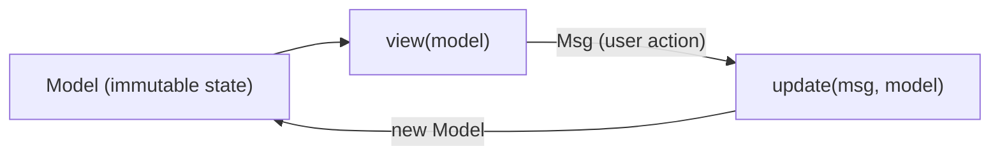

**In code** — `update` is a pure function: same `(msg, model)` in, same `newModel` out,
no mutation. The empty-title rule is just a branch:

```javascript
// model = { title: "", error: "" }
function update(msg, model) {
    switch (msg.type) {
        case "TitleChanged":
            return { ...model, title: msg.value, error: "" };   // new object, no mutation
        case "Save":
            return model.title.trim() === ""
                ? { ...model, error: "Title is required" }        // returns next state
                : { ...model, error: "", saved: true };
        default:
            return model;
    }
}
// view(model) renders model.error; runtime re-renders after every update
```

Trace it: start `{title:"", error:""}` → dispatch `{type:"Save"}` → `update` takes the
empty-string branch → returns `{title:"", error:"Title is required"}` → runtime re-runs
`view` and the label shows the error. Replaying the same message list always reproduces
the same states — that is what makes time-travel debugging possible.

**Trade-offs / -ilities.**
- **Pros:** the most **predictable** flow — state transitions are pure functions, giving
  trivial unit testing, deterministic replay, and **time-travel debugging**; no shared
  mutable state.
- **Cons:** conceptual "full re-render" model and pervasive immutability add overhead;
  verbose for local, ephemeral widget state; every interaction needs a message + update
  branch.
- **When to use:** apps that value correctness and debuggability of state (Elm; React +
  reducers; SwiftUI/Jetpack Compose state; Android MVI).
- **When to avoid:** tiny UIs where the message/update ceremony outweighs the benefit.
- **Optimizes:** **testability** (pure functions) and **debuggability**; can cost some
  **performance** and verbosity.

**Differs from adjacent styles.** vs **MVVM**: one-way immutable flow vs two-way mutable
binding. vs **Flux/Redux**: MVU is the same unidirectional idea; Flux/Redux add an
explicit dispatcher/store and are framework-specific (JS), while MVU is the pure-FP
formulation (single update function).

> Deep dive: see **`dp-enterprise-application`** (MVU / Elm).

---

## Flux

**Problem it solves:** In large SPAs with many stores, two-way binding and cross-updating
views produce cascading, unpredictable updates ("model A updates view B updates model C…"
— the bugs that plagued early Facebook UIs). Flux forces a **single unidirectional
dispatch** so data always flows one way and you can reason about *what* changed the state.

**How it works / key components.**
- **Action** — a plain object describing "what happened" (`type` + payload).
- **Dispatcher** — a single hub that broadcasts every action to all stores (registers
  callbacks; supports ordering via `waitFor`).
- **Store** — holds state + logic for a domain; updates itself in response to actions,
  then emits a change event.
- **View** — reads from stores, renders, and creates new Actions from user input.

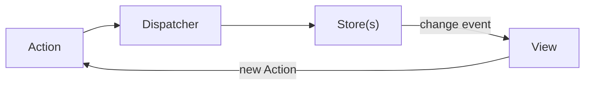

**Trade-offs / -ilities.**
- **Pros:** predictable, traceable data flow at scale; decouples views from each other
  (they only read stores).
- **Cons:** ceremony/boilerplate (actions, dispatcher registration); with **multiple
  stores** cross-store coordination (`waitFor`) gets awkward.
- **When to use:** large client apps needing disciplined one-way flow (the original
  React ecosystem answer).
- **When to avoid:** small apps; or when a single-store model (Redux) is simpler.
- **Optimizes:** **maintainability**/predictability of state flow; costs boilerplate.

**Differs from adjacent styles.** vs **MVU**: Flux adds an explicit Dispatcher and
*multiple* Stores; MVU has one immutable model + one update function. vs **Redux**: Redux
collapses Flux to a **single store + pure reducers** and drops the dispatcher object.

*(No existing deep-dive topic — this is the architectural-level treatment.)*

---

## Redux

**Problem it solves:** Flux's multiple stores and dispatcher wiring are still error-prone
and hard to serialize/replay. Redux simplifies Flux to a **single immutable store whose
state is transformed only by pure reducer functions**, making every state change
reproducible, serializable, and debuggable.

**How it works / key components.**
- **Store** — one object holding the whole app state tree (single source of truth).
- **Action** — plain object describing an intended change.
- **Reducer** — a pure function `(state, action) -> newState`; never mutates, returns a
  new state. Composed from smaller reducers.
- **Dispatch** — the only way to change state; middleware handles async/side-effects.

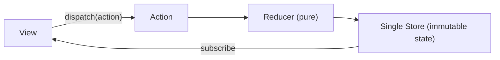

**In code** — the reducer is `(state, action) => newState`, structurally the same as
Elm's `update`:

```javascript
const initial = { title: "", error: "" };

function reducer(state = initial, action) {
    switch (action.type) {
        case "TITLE_CHANGED":
            return { ...state, title: action.payload, error: "" };
        case "SAVE":
            return state.title.trim() === ""
                ? { ...state, error: "Title is required" }
                : { ...state, error: "", saved: true };
        default:
            return state;                 // unknown action -> unchanged
    }
}

store.dispatch({ type: "SAVE" });         // the ONLY way to change state
```

With `state = {title:"", error:""}`, `dispatch({type:"SAVE"})` runs the reducer, hits
the empty branch, and the store becomes `{title:"", error:"Title is required"}`;
subscribers re-render and show the message. Because the store is one serializable
object, you can log every action + resulting state and replay them.

**Trade-offs / -ilities.**
- **Pros:** single source of truth; serializable state → **time-travel debugging**,
  logging, hydration; pure reducers are trivially **testable**; predictable.
- **Cons:** heavy boilerplate for simple cases; async and local/ephemeral state are
  awkward (needs middleware / extra libraries); global store can become a dumping ground.
- **When to use:** medium-large SPAs with substantial shared state that benefits from a
  single audited state tree.
- **When to avoid:** small apps or mostly-local state — component state / MVVM binding is
  lighter.
- **Optimizes:** **debuggability** and **testability**; costs velocity/boilerplate.

**Differs from adjacent styles.** vs **Flux**: one store + reducers vs many stores +
dispatcher. vs **MVU**: essentially the same unidirectional loop; Redux is the
JS-library incarnation (reducer ≈ Elm `update`, store ≈ Elm `Model`).

*(No existing deep-dive topic — this is the architectural-level treatment.)*

---

## MVI (Model-View-Intent)

**Problem it solves:** Even in unidirectional UIs, imperative event handlers mutating
state make the UI non-deterministic. MVI models the whole UI as a **reactive stream
cycle** where user **intents** are transformed into a stream of **immutable states** the
View renders — giving a fully reactive, deterministic, composable UI (André Staltz /
Cycle.js; popular in reactive Android).

**How it works / key components.**
- **Intent** — captures user actions and turns them into intent objects.
- **Model** — a function that folds intents into a stream of immutable **view-state**
  objects (business logic + state reduction).
- **View** — a pure function that renders the current immutable state and emits new
  intents. Everything is wired as observable streams (`intent -> model -> view -> intent`).

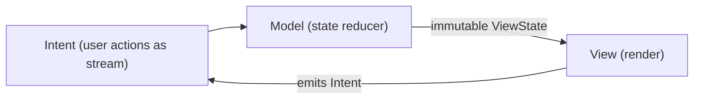

**Trade-offs / -ilities.**
- **Pros:** fully deterministic and reactive; immutable single view-state per render;
  stream operators compose cleanly; easy to test state transformations.
- **Cons:** steep **reactive-programming** learning curve (RxJS/RxJava mindset); verbose
  state classes; stream lifecycle/back-pressure bugs are subtle.
- **When to use:** reactive-first stacks (Cycle.js; Android with Rx/Coroutines) wanting
  strict one-state-per-render.
- **When to avoid:** teams unfamiliar with reactive streams; simple screens.
- **Optimizes:** **testability**/determinism; costs learning curve and verbosity.

**Differs from adjacent styles.** vs **MVU**: MVI is the reactive-streams framing of the
same unidirectional loop (intent≈Msg, model≈update). vs **Redux**: MVI is typically
per-screen and stream-based rather than a single global store.

*(No existing deep-dive topic — this is the architectural-level treatment.)*

---

## PAC (Presentation-Abstraction-Control)

**Problem it solves:** A single MVC triad doesn't scale to a large application made of
many semi-independent subsystems (multi-panel tools, multiple coordinated views). PAC
structures the UI as a **hierarchy of cooperating agents**, each a self-contained
mini-application, so subsystems stay isolated and can be developed/reasoned about
independently (Buschmann et al., *POSA vol 1*).

**How it works / key components.** Each **agent** has three parts:
- **Presentation** — the agent's UI (input + output).
- **Abstraction** — the agent's data/model.
- **Control** — mediates between this agent's Presentation and Abstraction **and**
  communicates with other agents' Controls.

Agents form a **tree**: a top-level agent coordinates mid-level agents, which coordinate
leaf agents. Crucially, an agent's Presentation and Abstraction **never talk directly** —
all communication goes through Control (and up/down the hierarchy).

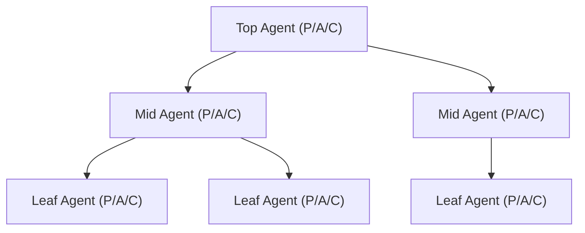

**Trade-offs / -ilities.**
- **Pros:** strong subsystem **isolation** and support for many semi-autonomous,
  concurrently-developed views; scales to complex multi-agent UIs.
- **Cons:** the Control layer adds significant communication overhead and complexity;
  rarely used in modern practice (frameworks favor MVVM/component trees).
- **When to use:** large systems decomposed into loosely-coupled interactive subsystems
  (historically: process-control dashboards, multi-agent apps).
- **When to avoid:** ordinary form/CRUD UIs — overkill.
- **Optimizes:** **modularity/scalability** of large UIs; costs **complexity**.

**Differs from adjacent styles.** vs **MVC**: PAC has **no direct View↔Model link** (its
Presentation and Abstraction are decoupled by Control) and it is explicitly
**hierarchical/multi-agent**, whereas classic MVC is a single triad. vs **HMVC**: HMVC
nests MVC triads that still allow View↔Model reads; PAC routes everything through Control.

*(POSA-grounded; no existing deep-dive topic.)*

---

## Presentation Model

**Problem it solves:** You want a fully self-contained, **framework-agnostic** object
that represents the View's state and behavior — testable without any binding framework
lock-in — so presentation logic isn't scattered in code-behind or tied to a specific
widget toolkit (Martin Fowler).

**How it works / key components.**
- **Presentation Model** — a non-visual class that holds the View's *logical* state (the
  data plus flags like "is Save enabled") and its behavior. It is a pure abstraction of
  the screen, independent of any UI toolkit.
- **View** — a thin visual layer that **mirrors** the Presentation Model. Because there
  is no built-in binding assumed, some **synchronization code** keeps the two in step.
- **Model** — domain data.

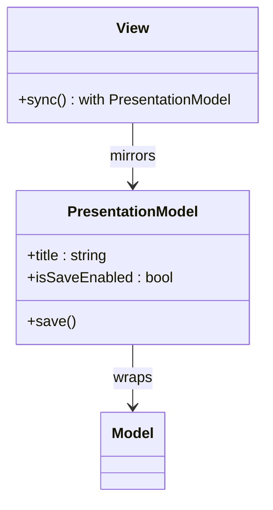

**Trade-offs / -ilities.**
- **Pros:** **framework-independent** and highly **testable** (test the model with no
  UI); portable across toolkits.
- **Cons:** requires **manual synchronization** code between View and Presentation
  Model — exactly the glue that MVVM's binding engine automates.
- **When to use:** when you want MVVM-style separation but lack (or distrust) a binding
  framework, or need portability across UI toolkits.
- **When to avoid:** binding-rich frameworks where MVVM removes the sync burden.
- **Optimizes:** **testability** + portability; costs the sync code.

**Differs from adjacent styles.** vs **MVVM**: MVVM = Presentation Model + automatic
platform data-binding; Presentation Model syncs by hand. vs **MVP (Passive View)**: both
hold view state outside the View, but Presentation Model is designed to be *mirrored*
(the View pulls/syncs), while a Presenter *pushes* into a passive View.

> Deep dive: see **`dp-enterprise-application`** (Presentation Model / MVVM).

---

## Model-View-Adapter (MVA)

**Problem it solves:** In classic MVC the View can observe/read the Model directly, which
couples them and lets UI concerns leak into the domain (or vice-versa). MVA (a
"mediating controller" form of MVC) **breaks that link**: the View and Model never
reference each other — **all** communication is routed through an **Adapter** that sits
strictly between them.

**How it works / key components.**
- **Model** — domain data; no knowledge of the View.
- **View** — rendering + input; no knowledge of the Model.
- **Adapter (mediating controller)** — the *only* connection: it listens to the View,
  updates the Model, reads the Model, and updates the View. A linear `View ↔ Adapter ↔
  Model` topology with **no View↔Model edge**.

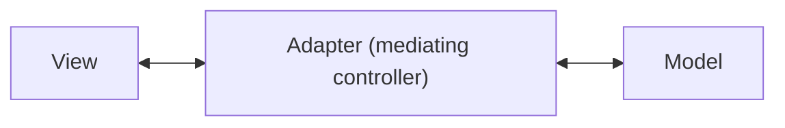

**Trade-offs / -ilities.**
- **Pros:** View and Model are **fully decoupled** — either can change independently; the
  Adapter can transform/shape data specifically for the View.
- **Cons:** the Adapter becomes a **bottleneck / potential god-object** carrying all
  mapping logic; more indirection than classic MVC.
- **When to use:** when you must keep the domain Model completely UI-ignorant and forbid
  any coupling (e.g., reusing one Model behind very different Views).
- **When to avoid:** simple UIs where classic MVC's direct read is harmless.
- **Optimizes:** **decoupling/maintainability**; risks a fat mediator.

**Differs from adjacent styles.** vs **MVC**: classic MVC *permits* View↔Model
(Observer); MVA forbids it and forces everything through the Adapter. vs **MVP**: very
similar in spirit (Presenter also mediates), but MVA frames the mediator as a
data-shaping *adapter* between two parties that don't know each other's interfaces.

> Deep dive: see **`dp-enterprise-application`** (MVC / Mediator).

---

## VIPER (View-Interactor-Presenter-Entity-Router)

**Problem it solves:** In large native mobile apps (especially iOS), MVC collapses into
the "Massive View Controller" — one class doing views, navigation, networking, and
business logic. VIPER enforces **single responsibility** by splitting the screen into
five roles and, crucially, gives **navigation its own component (Router)**. It is a
Clean-Architecture-derived layering applied per screen.

**How it works / key components.**
- **View** — passive; displays what the Presenter tells it, forwards user events.
- **Interactor** — contains the use-case/business logic; manipulates Entities.
- **Presenter** — prepares data for display; mediates View ↔ Interactor; asks Router to
  navigate.
- **Entity** — plain domain model objects (used by the Interactor).
- **Router (wireframe)** — owns navigation/screen-flow and module assembly.

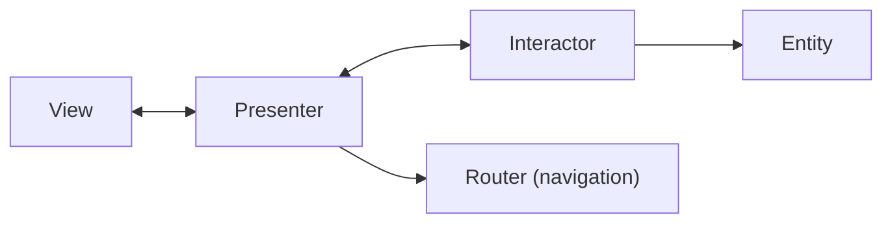

**Trade-offs / -ilities.**
- **Pros:** highly **testable** and **modular**; navigation decoupled into the Router;
  clear boundaries scale to big teams and codebases.
- **Cons:** very high **boilerplate** and file-count (five types + protocols per screen);
  overkill for simple screens; steep onboarding.
- **When to use:** large, long-lived native mobile apps with many screens and multiple
  teams.
- **When to avoid:** small apps or prototypes — MVVM/MVC is far cheaper.
- **Optimizes:** **testability** + **modularity**; heavy cost to **velocity**.

**Differs from adjacent styles.** vs **MVP**: VIPER is MVP plus a dedicated Interactor
(use cases) and Router (navigation) — finer-grained responsibilities. vs **Clean
Architecture**: VIPER is essentially Clean/Hexagonal layering applied at the *screen
module* level rather than the whole app.

> Deep dive: VIPER derives from **Clean Architecture / Hexagonal (Ports & Adapters)** —
> see the `arch-hexagonal-clean-onion` topic when present; today the nearest boundary
> material is in `dp-enterprise-application` and `microservices-ddd-and-boundaries`.

---

## MVVM-C and the Coordinator pattern

**Problem it solves:** In MVVM/MVP the ViewModel/Presenter often ends up owning
**navigation** ("which screen comes next"), which couples screens to each other and makes
flows non-reusable. The **Coordinator** extracts navigation into its own object so
ViewModels/Presenters stay navigation-agnostic (MVVM-C / MVP-C; popular on iOS).

**How it works / key components.** Standard MVVM (View + ViewModel + Model) plus a
**Coordinator** that owns the flow: it creates ViewModels/Views, presents them, and
decides transitions. The ViewModel signals *intent* ("user finished login"); the
Coordinator decides *where to go*.

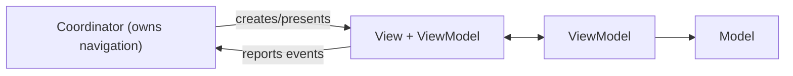

**Trade-offs / -ilities.**
- **Pros:** navigation is decoupled from screens → **reusable flows** and testable
  navigation logic; screens don't know their neighbors.
- **Cons:** an extra indirection layer to build and maintain; coordinator hierarchies can
  get complex (parent/child coordinators).
- **When to use:** apps with complex, reusable navigation flows (onboarding, deep links).
- **When to avoid:** trivial navigation — plain MVVM suffices.
- **Optimizes:** **maintainability/reusability** of navigation; small complexity cost.

**Differs from adjacent styles.** vs **plain MVVM**: adds the navigation-owning
Coordinator. vs **VIPER**: VIPER's Router plays the same navigation role — Coordinator ≈
Router, but bolted onto MVVM rather than a five-part module.

*(Mobile-specific; no existing deep-dive topic.)*

---

## Hierarchical MVC (HMVC)

**Problem it solves:** A page is often assembled from many independent widgets (nav bar,
cart, recommendations), and a single MVC triad can't make each widget self-contained and
reusable. HMVC composes a page from **independent MVC triads**, each a fully
self-contained "widget" with its own model, view, and controller.

**How it works / key components.** Each UI component is its own **MVC triad**. A parent
controller renders a view that **dispatches sub-requests** to child triads; children
render their own fragments, which are composed into the parent's output. Triads
communicate top-down through their controllers.

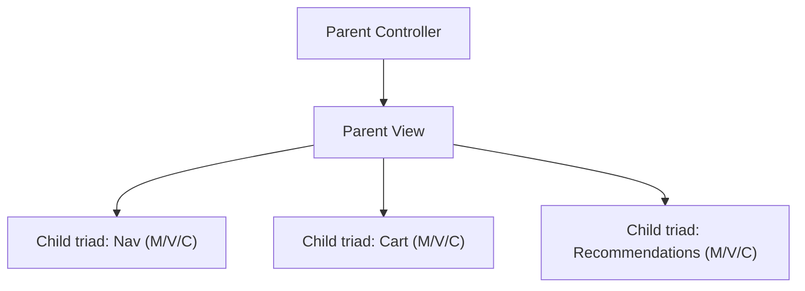

**Trade-offs / -ilities.**
- **Pros:** widgets are **reusable** and independently testable; teams can build
  components in parallel; clear composition.
- **Cons:** nested sub-request **overhead**; routing/wiring between triads adds
  complexity; can be slower than a single render pass.
- **When to use:** portal/dashboard-style pages composed of reusable, self-contained
  components (classic server-side widgetized UIs).
- **When to avoid:** simple pages — the nesting overhead isn't worth it.
- **Optimizes:** **reusability/modularity**; costs some **performance**.

**Differs from adjacent styles.** vs **classic MVC**: HMVC is *many* triads composed
hierarchically, not one. vs **PAC**: HMVC triads still allow View↔Model reads and
communicate via controllers/sub-requests; PAC decouples P and A entirely and coordinates
through dedicated Control agents.

> Deep dive: see **`dp-enterprise-application`** (MVC).

---

## Model-View-Whatever (MVW)

**Problem it solves:** Modern frameworks blur the MVC/MVP/MVVM boundaries (a "controller"
that binds like a ViewModel, components that mix concerns), and arguing over the exact
label wastes time. MVW (coined by the AngularJS team, "Model-View-Whatever") is a
**pragmatic acknowledgment**: aim for *separation of concerns* rather than dogmatic
adherence to one three-letter pattern.

**How it works / key components.** Not a prescriptive architecture — it's a framing.
The guidance: keep the **Model** (data), the **View** (rendering), and *some* mediating
layer ("whatever" — controller/ViewModel/component logic) distinct; choose the mediator
style the framework makes natural. Modern component frameworks (React, Vue, Angular,
Svelte) each land somewhere on the MVC–MVVM–MVU spectrum.

*(No topology diagram — MVW is a discussion framing, not a fixed structure. See the
comparison matrix below.)*

**Trade-offs / -ilities.**
- **Pros:** pragmatic; avoids sterile pattern-label debates; matches how real frameworks
  actually work.
- **Cons:** **vague** — offers no concrete structure or guarantees; not something you can
  "implement."
- **When to use:** as a discussion framing when comparing frameworks or explaining that
  the label matters less than the separation.
- **When to avoid:** when you need a concrete, testable, prescribed structure — pick a
  real style.
- **Optimizes:** nothing concretely; it's a mindset, not an architecture.

**Differs from adjacent styles.** vs all of MVC/MVP/MVVM/MVU: MVW deliberately refuses to
pick one; the others are prescriptive.

> This topic (the comparison matrix) is the natural home for MVW.

---

## Humble Object

**Problem it solves:** Code that touches the UI framework (a widget, a view controller,
a hardware edge) is **hard to unit-test** because it needs the real environment. The
Humble Object pattern pushes all the *logic* out of that hard-to-test edge into a
separate, plain, testable companion object — leaving only a thin, logic-free "humble"
shell bound to the framework (Gerard Meszaros; Martin Fowler).

**How it works / key components.**
- **Humble Object** — the thin shell that touches the framework (the View, the widget).
  It contains no logic — it just forwards to and displays results from the logic object.
- **Logic Object (testable)** — holds all the behavior; depends only on abstractions, so
  it is unit-testable without the framework.

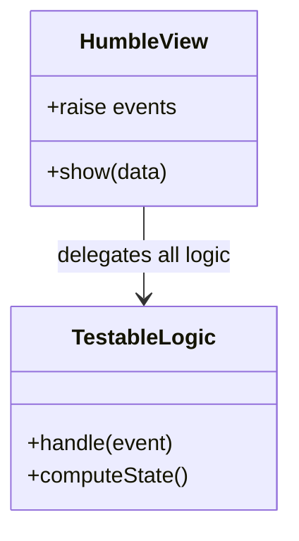

**Trade-offs / -ilities.**
- **Pros:** enables **unit-testing** of presentation/edge logic without the UI or
  environment; the pattern *underpinning* Passive View, MVP, and MVU's pure functions.
- **Cons:** adds an indirection layer per edge; if taken too far, many tiny objects.
- **When to use:** any hard-to-test boundary (UI views, message handlers, hardware
  adapters) whose logic you want covered by tests.
- **When to avoid:** trivial edges with no meaningful logic to extract.
- **Optimizes:** **testability** at the cost of a little indirection.

**Differs from adjacent styles.** It's not a full presentation architecture but the
*testability principle* behind them: **Passive View = Humble Object applied to the View**;
MVP/MVVM/MVU all lean on it to keep the View humble and the logic testable.

> Deep dive: see **`dp-enterprise-application`** (Humble Object); also relevant to the
> `testing` domain.

---

## MVC vs MVP vs MVVM vs MVU

This is the comparison the whole topic exists for — the axis-by-axis contrast that the
PoEAA catalog entry does *not* give you.

| Axis | MVC | MVP | MVVM | MVU / Flux / Redux / MVI |
|---|---|---|---|---|
| **View ↔ logic coupling** | View knows Model (Observer) | View ↔ Presenter via 1:1 interface | View ↔ ViewModel via binding | View is a pure function of state |
| **Data-binding direction** | manual / Observer | manual (Presenter pushes) | **two-way** (or one-way) | **one-way** (unidirectional) |
| **Where UI logic lives** | Controller | Presenter (all of it) | ViewModel | Update / Reducer functions |
| **Unit-testability of UI logic** | weak (View-coupled) | strong (mock the View) | strong (test the ViewModel) | strongest (pure functions) |
| **Boilerplate** | low | high | low–medium (binding "magic") | medium–high |
| **Does View reference logic holder?** | reads Model | no (Presenter holds View) | no (VM has no View ref) | no (state is external) |
| **Where it dominates** | server web (Rails, Spring MVC, ASP.NET) | legacy WinForms, GWT, classic Android | WPF, Xamarin/MAUI, Angular, Vue, SwiftUI, Jetpack Compose | React+Redux, Elm, Compose/SwiftUI state, Android MVI |

> [!TIP]
> Fast interview heuristic: **MVC** = View reads Model; **MVP** = Presenter pushes into a
> dumb View (manual); **MVVM** = binding engine syncs View ↔ ViewModel (declarative,
> often two-way); **MVU/Redux** = View is a pure function of immutable state, changes flow
> one way through update/reducer.

### Same click, four architectures

The sharpest way to *feel* the difference: trace **one concrete event** — the user clicks
**Save** on a form whose required *Title* field is empty — through each style, watching
**who validates**, **where the "show error" decision is made**, and **how it reaches the
screen**.

- **MVC.** The button's click hits the **Controller** (`saveNote()`). It updates the
  Model (`model.title = ""`), the Model's setter fails validation and flips
  `model.error = "Title is required"` and fires an Observer notification; the **View**,
  observing the Model, **re-reads** `model.error` and repaints the label. *Decision made
  in the Model/Controller; View pulls it.*
- **MVP.** The View raises `onSaveClicked`; the **Presenter's** `handleSave()` reads
  `view.getTitle()` → `""`, decides `"Title is required"`, and **pushes** it in with
  `view.showError("Title is required")`. *Presenter decides and explicitly commands the
  humble View.*
- **MVVM.** The Save button is bound to the ViewModel's `Save` **command**; because the
  bound `Title` is empty, `Error` computes to `"Title is required"` and (via `canExecute`)
  the button may even be disabled. A label **bound** to `Error` updates automatically —
  no one calls `showError`. *ViewModel exposes a property; the binder syncs it.*
- **Redux/MVU.** The click **dispatches** `{type:"SAVE"}`. The pure **reducer/update**
  takes `state.title === ""` → returns a *new* state `{title:"", error:"Title is
  required"}`. The store swaps in the new immutable state and the **View re-renders as a
  pure function** of it. *Nobody mutates or pushes; a new state flows one way and the View
  redraws.*

The same intent thus surfaces as: **Model setter + Observer** (MVC) → **`view.showError()`
push** (MVP) → **bound `Error` property** (MVVM) → **reducer returns new state** (Redux/MVU).
That is the whole progression in one click.

---

## Unidirectional data flow: the modern web evolution

The lineage **MVU (Elm) → Flux → Redux → MVI** is best understood as one sustained
reaction against the *debuggability* problems of MVVM-style **two-way binding**. With
two-way binding, a change can originate in the View or the Model and ripple in either
direction, so when the UI reaches a bad state it's hard to answer "what changed this?"

Unidirectional flow answers that by making every change travel a single path —
**action/message → reducer/update → new immutable state → re-render** — and forbidding the
View from mutating state directly. Benefits: reproducible state, serializable snapshots,
time-travel debugging, and pure-function testability. This is why React's ecosystem chose
Flux/Redux over two-way binding, why Elm formalized MVU, and why modern declarative UI
toolkits (SwiftUI, Jetpack Compose) render as a function of state. The cost is more
ceremony and, for immutable full-state models, some performance overhead — which
frameworks mitigate with diffing/virtual-DOM and structural sharing.

> [!KEY-TAKEAWAY]
> MVVM optimizes *developer velocity* via binding; MVU/Redux optimize *debuggability &
> predictability* via one-way immutable state. Choosing between them is largely a
> velocity-vs-traceability trade-off.

---

## Common follow-up questions

- **"What's the actual difference between MVP and MVVM?"** Both remove logic from the
  View. MVP's Presenter holds a reference to the View interface and **pushes** state in
  manually; MVVM's ViewModel has **no View reference** — a binding engine syncs them
  (often two-way). MVVM needs framework binding support; MVP doesn't.
- **"Why did the React world pick Redux over two-way binding?"** For predictable,
  debuggable, serializable state — one-way flow makes "what changed the state?" answerable
  and enables time-travel debugging; two-way binding does not.
- **"Is server-side MVC the same as Smalltalk MVC?"** No. Classic MVC has a live
  View↔Model Observer link; web MVC (Model 2) is per-request Front/Page Controller with a
  stateless template — no observer.
- **"When is MVVM the wrong choice?"** On platforms without binding, or when you need
  fully predictable/debuggable state flow (prefer MVU/Redux), or when binding "magic"
  makes debugging and memory management too costly.
- **"How do these relate to Clean/Hexagonal architecture?"** VIPER applies Clean layering
  per screen (Interactor = use case). Presentation architectures sit *inside* the
  presentation/adapter ring of Hexagonal/Onion/Clean — they don't replace them.
- **"Which optimizes testability most?"** MVU/Redux (pure functions) ≳ Passive View / MVP
  / MVVM (mockable View / testable ViewModel) ≫ classic MVC (View-coupled).
- **"Where does the Humble Object fit?"** It's the underlying testability principle:
  Passive View is Humble Object applied to the View; MVP/MVVM/MVU all rely on it.
- **"MVC vs PAC?"** MVC is one triad with a possible View↔Model link; PAC is a hierarchy
  of agents whose Presentation and Abstraction are fully decoupled through Control.

---

## References

- Trygve Reenskaug, *"Thing-Model-View-Editor"* / the original MVC notes (Xerox PARC,
  1979).
- Martin Fowler, *GUI Architectures* — MVC, MVP, Supervising Controller, Passive View,
  Presentation Model — martinfowler.com.
- Martin Fowler, *Patterns of Enterprise Application Architecture* (PoEAA) — MVC,
  Presentation Model, Page/Front Controller.
- Gerard Meszaros, *xUnit Test Patterns* — Humble Object; Fowler, *Humble Object*.
- John Gossman (Microsoft), *"Introduction to Model/View/ViewModel pattern for building
  WPF apps"* (2005) — MVVM.
- Buschmann, Meunier, Rohnert, Sommerlad, Stal, *Pattern-Oriented Software Architecture,
  Vol. 1 (POSA)* — MVC and **PAC**.
- Facebook, *Flux* application architecture docs; Dan Abramov et al., *Redux* docs.
- Evan Czaplicki, *The Elm Architecture* guide — MVU.
- André Staltz, *Cycle.js* / Model-View-Intent (MVI) writeups.
- Mark Richards & Neal Ford, *Fundamentals of Software Architecture* (O'Reilly) —
  architecture-style vs design-pattern altitude and the "-ilities" framing.
- Uncle Bob Martin, *Clean Architecture*; Alistair Cockburn, *Hexagonal (Ports &
  Adapters)*; Jeffrey Palermo, *Onion Architecture* — the layering VIPER derives from.

<!-- Cross-references: MVC/MVP/MVVM/MVU/Presentation Model/Humble Object deep dive →
`dp-enterprise-application`. VIPER/Clean layering → `microservices-ddd-and-boundaries`
and the future `arch-hexagonal-clean-onion`. Testability angle → `testing` domain. -->
