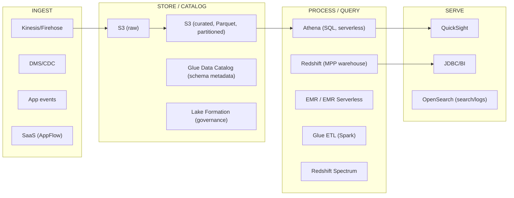

# Analytics and Big Data on AWS: Data Lakes, Redshift, EMR and Athena

Analytics on AWS is a menu of overlapping engines, and interviewers probe whether you
can *pick the right one for the constraints* rather than reflexively reaching for the
tool you know. The recurring axes are: schema-on-read vs schema-on-write, serverless
vs provisioned, pay-per-scan vs pay-for-capacity, and how much operational burden the
team can absorb. This file goes layer by layer — intuition, how the service works,
real usage, and (most importantly) the **trade-offs** and *when to use what*.

Mental model of the modern AWS analytics stack:

The center of gravity for most modern designs is a **data lake on S3** with a shared
**Glue Data Catalog**, queried by whichever engine fits the workload — this is the
"lakehouse" idea: one copy of data in open formats, many engines.

---

## Data lake versus data warehouse versus lakehouse

**Intuition.** A **data warehouse** (Redshift) ingests data into a proprietary,
optimized, columnar store *before* you query it — you must define the schema on write
(ETL), which gives fast, consistent, governed SQL but couples storage and a specific
engine. A **data lake** (S3 + catalog) stores raw/semi-structured files (JSON, CSV,
Parquet, logs) as-is; you apply **schema-on-read** at query time — cheap, flexible,
any format, but you own quality/governance and pay a query-time parsing cost. A
**lakehouse** tries to get both: data lives once in open columnar files on S3, an open
table format (Iceberg/Hudi/Delta) adds ACID transactions, schema evolution and
time-travel, and multiple engines (Athena, Redshift Spectrum, EMR/Spark) read the same
tables.

| Dimension | Data lake (S3 + Glue + Athena) | Data warehouse (Redshift) | Lakehouse (S3 + Iceberg) |
|---|---|---|---|
| Schema | schema-on-read | schema-on-write | schema-on-read + table metadata (ACID) |
| Data types | any (structured/semi/unstructured) | structured/semi (SUPER type) | structured/semi, open columnar |
| Ingest cost | cheap (just land files) | ETL work up front | cheap land + light transform |
| Query latency | seconds (cold, per-scan) | ms–seconds (tuned, cached) | seconds |
| Cost model | pay per TB scanned + S3 storage | pay for cluster/RPU + storage | pay per engine used + S3 |
| Governance | you build it (Lake Formation) | strong, built-in | Lake Formation + table format |
| Best for | exploration, cheap archive, ML feature source, ad-hoc | BI concurrency, joins, sub-second dashboards | one copy, many engines, updates/deletes |

**Trade-off.** A warehouse gives predictable, low-latency, high-concurrency SQL and
strong governance, but you pay to load/transform data first and you're tied to the
engine. A lake is cheap and flexible and decouples storage from compute, but raw query
latency is higher and *you* are responsible for data quality, small-file problems, and
partitioning. **Pick warehouse** when many analysts run repeated joins/aggregations
with tight SLAs; **pick lake** when data is large, diverse, exploratory, or feeds ML;
**pick lakehouse** when you want one governed copy queried by several engines and need
row-level updates/deletes (GDPR erasure, CDC upserts).

> [!TIP]
> **SUPER** (in the table above) is Redshift's native semi-structured column type — it
> stores JSON-like nested documents in a single column and lets you query them with
> `PartiQL` (SQL extended for nested/schemaless data), so you can land semi-structured
> events in a warehouse without flattening them into rigid columns first.

---

## Amazon S3 as the data lake foundation

**How it works.** S3 is the durable object store underneath every AWS analytics
pattern: 11 nines of durability, effectively unlimited capacity, **strong
read-after-write consistency for all operations since December 2020** (no more
eventual-consistency gotchas for new objects or overwrites). You organize a lake into
zones — **raw/landing** (immutable, exactly as ingested), **cleansed/curated**
(validated, deduped), and **conformed/aggregated** (Parquet, partitioned, ready for
BI). Storage classes (Standard, Intelligent-Tiering, Glacier Instant/Flexible/Deep
Archive) let you tier cold data down for cost.

**Real usage.** Land raw events via Firehose/DMS, transform with Glue/EMR into
partitioned Parquet in the curated zone, register in the Glue Data Catalog, query with
Athena/Redshift Spectrum.

**Trade-offs and limits that matter for design:**
- **Request rate scales per prefix**: at least 3,500 PUT/COPY/POST/DELETE and 5,500 GET
  per second *per prefix*, and it scales horizontally with more prefixes — so
  partitioning also spreads request load. A single hot prefix can throttle (503
  SlowDown).
- **Small-file problem.** Millions of tiny files kill query performance and cost
  (per-object overhead, more GET requests, more Athena/Spark task scheduling). Compact
  to ~128 MB–1 GB objects. This is the #1 lake performance foot-gun.
- **S3 is not a low-latency OLTP store.** First-byte latency is tens of ms; it's for
  throughput/analytics, not point lookups — use DynamoDB for that.
- **Decoupled storage/compute** is the core win: scale query engines independently and
  spin them to zero, but every query re-reads from S3 (mitigated by columnar formats
  and result caching).

---

## AWS Glue Data Catalog, crawlers, and ETL

**Intuition.** The **Glue Data Catalog** is a central, Hive-compatible **metastore** —
databases, tables, columns, partitions, and the S3 location + format of each table. It
is the shared "schema layer" that lets Athena, Redshift Spectrum, EMR, and Glue ETL all
see the *same* table definitions. It is effectively a managed Hive Metastore.

**Components:**
- **Crawlers** scan S3 (or JDBC sources), infer schema and partitions, and populate the
  catalog automatically. Convenient, but they can misinfer types and are slow on huge
  buckets — many mature teams define tables explicitly (DDL / IaC) instead of crawling.
- **Glue ETL** is serverless **Apache Spark** (or Python shell / Ray) for
  transformation jobs, priced by **DPU-hour** (1 DPU = 4 vCPU + 16 GB), billed per
  second with a 1-minute minimum. Glue Studio gives a visual job builder; DynamicFrames
  add schema-flexibility over Spark DataFrames.
- Around the core ETL sit orchestration and governance helpers you reach for as needs
  arise: **triggers/workflows** when you must chain and schedule jobs into a DAG,
  **Data Quality** when you need to assert row-level rules (nulls, ranges, uniqueness)
  and fail a pipeline on bad data, and the **Schema Registry** when producers and
  consumers of a stream must agree on an evolving Avro/JSON/Protobuf schema. (Blueprints,
  a parameterized-job templating feature, also exists but is peripheral.) Don't memorize
  the list — reach for each only when its specific problem shows up.

**Trade-offs.**
- **Crawler vs explicit schema:** crawlers save effort on unknown/changing data but risk
  wrong types and cost money on every run; explicit DDL is deterministic and free but is
  manual. For partitioned tables that only add partitions, use `MSCK REPAIR TABLE` /
  partition projection instead of re-crawling.
- **Glue ETL vs EMR:** Glue is serverless (no cluster to manage, scales to zero) and
  ideal for intermittent/scheduled Spark ETL; EMR gives full control over Spark/Hadoop
  versions, custom software, and long-running clusters, and is cheaper at sustained
  high utilization. Choose Glue for "I just want to run a Spark job on a schedule";
  choose EMR for large, tuned, continuous, or multi-framework workloads.
- Catalog limits: default soft quotas (e.g., ~1M tables per database, ~10M partitions
  per table) — very large partition counts slow query planning, another reason to keep
  partition cardinality sane.

---

## AWS Lake Formation governance and permissions

**Intuition.** Raw S3 + IAM gives you only coarse, bucket/prefix-level access. **Lake
Formation** layers **fine-grained, catalog-centric permissions** on top of the Glue
Data Catalog: grant `SELECT` on specific databases, tables, **columns**, **rows**
(row-level filters) and **cell-level** masking to IAM principals — using familiar
database-style `GRANT`/`REVOKE` instead of hand-writing S3 bucket policies.

**How it works.** You register S3 locations with Lake Formation; it brokers access via
**temporary credentials** so engines (Athena, Redshift Spectrum, EMR, Glue, QuickSight)
enforce the same permissions. **LF-Tags** (tag-based access control) let you attach
tags like `classification=PII` to resources and grant on tags rather than per-object —
this scales governance across thousands of tables. It centralizes audit and supports
cross-account data sharing (data mesh).

**Trade-offs.**
- **Lake Formation vs raw IAM/S3 policies:** LF gives column/row/cell-level control and
  a single governance plane (huge for compliance, PII, multi-team lakes), but adds a
  setup/mental-model cost and another permission layer to debug. For a small
  single-team lake, plain IAM may be enough; for a regulated, multi-tenant, or
  data-mesh lake, LF is the right answer.
- **Tag-based (LF-Tags) vs named-resource grants:** tags scale to many tables and new
  data automatically inherits policy, but require disciplined tagging; named grants are
  explicit but don't scale.
- Both engines must be **integrated** with LF for enforcement — a rogue job with direct
  S3 access could bypass it, so you also lock down the underlying bucket to the LF role.

---

## Amazon Athena serverless SQL on S3

**Intuition.** Athena is **serverless Presto/Trino** that runs ANSI SQL directly on
files in S3 using the Glue Catalog for schema. No servers, no loading — point it at S3,
write SQL, pay only for **data scanned**.

**How it works and pricing.** Standard rate is **$5 per TB scanned**, rounded up to the
nearest 10 MB with a **10 MB minimum per query**. DDL and failed queries are free.
Because you pay per byte scanned, the entire cost/perf game is **scanning less data**:
- **Columnar formats (Parquet/ORC)** so only needed columns are read.
- **Partitioning** (e.g., by `year/month/day`) + **partition projection** so the engine
  prunes irrelevant partitions and skips listing them.
- **Compression** (Snappy/Zstd) shrinks bytes scanned.
Athena has **query result reuse/caching**, **federated queries** (via Lambda connectors
to RDS, DynamoDB, etc.), **Athena for Apache Spark** (interactive Spark, ~$0.35/DPU-hr),
and **Provisioned Capacity** with capacity reservations (~$0.30/DPU-hr) for
predictable/isolated workloads instead of per-scan.

**Trade-offs.**
- **Pay-per-scan vs pay-for-cluster:** Athena is unbeatable for **infrequent/ad-hoc**
  queries — zero idle cost. But heavy, repeated scanning of the same large data gets
  expensive fast and Athena has no fine-grained tuning knobs like Redshift's sort/dist
  keys; at high sustained query volume, loading into Redshift (or Redshift Serverless)
  is cheaper and faster.
- **No indexes/updates by default:** Athena reads immutable files; row-level
  update/delete needs Iceberg/Hudi tables. Concurrency is subject to service quotas
  (default ~20–25 concurrent DML queries, raisable).
- **Query latency** is seconds and unpredictable under contention — fine for analysts,
  not for sub-second dashboards serving many users (put a BI extract/cache in front, or
  use Redshift).

---

## Columnar formats, partitioning, and compression for cost and performance

**Why it dominates cost.** Both Athena (per-scan) and Redshift Spectrum (per-scan) bill
on **bytes read from S3**, and Spark/EMR runtime is proportional to I/O. Converting raw
CSV/JSON to **Parquet** typically cuts scanned bytes and cost by **30–90%** because:
- **Columnar layout** reads only the columns a query selects.
- **Predicate pushdown / min-max stats + row-group skipping** lets the reader skip
  chunks that can't match filters.
- **Dictionary + run-length encoding + Snappy/Zstd** compress heavily.

**Partitioning** organizes files into folders by a key (`dt=2026-07-16/`); a filter on
that key **prunes** whole partitions so they're never scanned. Rules of thumb:
- Partition on **low-to-moderate cardinality** columns that appear in `WHERE` clauses
  (date is the classic). Over-partitioning creates the small-file problem and huge
  partition counts that slow planning.
- Target file sizes **~128 MB–1 GB**; compact small files.
- Use **partition projection** in Athena to avoid metadata `GetPartitions` calls on
  high-partition tables.

**Trade-off.** More partitions = better pruning but more (smaller) files and slower
metadata ops; too few = large scans. Columnar formats are great for analytics reads but
worse for row-by-row writes/updates and add a transform step on ingest — so raw landing
zone stays row-oriented (JSON) and curated zone is Parquet. This transform is the
classic ETL/ELT job.

---

## Amazon Redshift MPP architecture, RA3, and managed storage

**Intuition.** Redshift is a **massively parallel processing (MPP), columnar** data
warehouse. A **leader node** parses/plans and aggregates; **compute nodes** are split
into **slices** that each work a shard of the data in parallel. Columnar storage + zone
maps + compression make aggregations over billions of rows fast. A **zone map** is
per-block min/max metadata Redshift keeps for each 1 MB disk block; when a query filters
`WHERE order_date = '2026-07-16'`, the engine checks each block's min/max and **skips any
block whose range can't contain the value** — reading only the handful of blocks that
might match instead of the whole column.

**RA3 with managed storage.** RA3 nodes (Graviton-based) **decouple compute from
storage**: hot data on local SSD, the rest transparently on **Redshift Managed Storage
(RMS)** backed by S3, so you **scale and pay for compute and storage independently**.
Sizes include `ra3.large`, `ra3.xlplus`, `ra3.4xlarge`, `ra3.16xlarge` (large clusters
scale to many nodes and multiple PB of managed storage — verify exact current node/PB
caps in the docs, as they rise over time). Legacy **DC2** nodes bundle compute+local SSD
(good for <1 TB, cheapest small clusters, but you can't scale storage separately).

**Redshift extras:** **materialized views** (incl. auto-refresh), **result caching**,
**automatic table optimization** (auto dist/sort key), **zero-ETL integrations**
(Aurora/RDS/DynamoDB → Redshift with no pipeline), **data sharing** across
clusters/accounts, and **federated queries** to RDS/Aurora. (Note: AQUA, an earlier
hardware query accelerator, has been discontinued — do not cite it as a live feature.)

**Trade-offs.**
- **RA3 vs DC2:** RA3 wins when storage grows faster than compute needs or data > a few
  TB (pay storage separately, cache hot data); DC2 is cheaper for small, compute-bound,
  <1 TB warehouses.
- **Redshift vs Athena:** Redshift gives low-latency, high-concurrency, tunable SQL with
  joins across a governed schema, but you pay for a running cluster (or RPU) and must
  load/tune data. Athena is zero-idle-cost and reads the lake directly. See the
  dedicated selection section.
- **Provisioned vs Serverless:** below.

---

## Distribution styles, sort keys, and Redshift performance tuning

The single biggest Redshift performance lever is **data layout across slices**, and
interviewers love this.

**Distribution styles** (how rows spread across compute-node slices):
- **KEY** — rows with the same value of the dist key land on the same slice; **collocates
  joins** on that key so no data reshuffles. Best for large fact–dimension joins on a
  shared key. Risk: **skew** if the key is lopsided (hot slice).
- **ALL** — full copy of the table on every node; eliminates redistribution for joins to
  it. Best for **small dimension tables**. Costly in storage/load for big tables.
- **EVEN** — round-robin; good default when no clear join key, but joins may reshuffle.
- **AUTO** — Redshift picks and can change it as the table grows (default; good starting
  point).

**Sort keys** order data on disk so **zone maps** skip blocks: a **compound** sort key
favors queries filtering on the leading columns (and range/time filters); an
**interleaved** sort key gives more equal weight to multiple columns but is costlier to
maintain (`VACUUM`). Choose sort keys matching your `WHERE`/range predicates (often the
date column).

**Worked example — what skew actually looks like.** Say a cluster has 2 nodes × 8 slices
= 16 slices, and you set `DISTKEY(country)` on a 100M-row events table where 60% of rows
are `country = 'US'`. Redshift hashes each distinct key value to one slice, so **all 60M
US rows land on a single slice** while the remaining 40M spread across the other 15. That
one slice now holds ~60M rows and the others average ~2.7M — a skew ratio of ~22×. During
a scan or aggregation the 15 light slices finish almost immediately and **sit idle
waiting** for the one hot slice to grind through 60M rows; effective parallelism collapses
toward that single slice, so the query runs roughly 10× slower than a balanced layout
(60M on the hot slice vs 6.25M per slice if evenly spread) and that slice can also hit
`disk-full` first. Contrast with `DISTKEY(user_id)` on a high-cardinality,
evenly-distributed column: each slice gets ~6.25M rows and all 16 work in parallel. You
detect skew via `svv_table_info` (`skew_rows` / `skew_sortkey1`) — a high ratio is the
tell. Fix: pick an even, high-cardinality dist key, or switch that table to `EVEN`/`ALL`.

**Other levers:** `VACUUM`/`ANALYZE` (reclaim space, update stats — largely automated
now), compression encodings (auto via `COPY`), and **Workload Management (WLM)** queues.

**Trade-off.** KEY distribution eliminates join shuffles but can create skew and only
helps the *one* join key; ALL removes shuffles for small tables but wastes space and
slows loads; EVEN is safe but shuffles. Interleaved sort keys help multi-dimension
filtering but raise maintenance cost. Getting these wrong is the usual cause of a
"Redshift is slow" complaint — the fix is layout, not more nodes.

---

## Redshift Spectrum and querying the data lake

**Intuition.** **Spectrum** lets a Redshift cluster run SQL over **external tables in
S3** (via the Glue Catalog) *without loading them*, and **join lake data to local
warehouse tables** in one query. It runs on a separate fleet of Spectrum nodes and is
billed like Athena — **$5 per TB scanned** in S3 (plus your cluster cost).

**Real usage.** Keep hot, frequently queried data loaded in Redshift; leave cold or huge
historical data in S3 as Parquet and query it via Spectrum on demand — a cost-tiering
pattern ("hot in cluster, cold in lake"). Same partitioning/columnar rules apply to cut
Spectrum scan cost.

**Trade-offs.**
- **Spectrum vs loading into Redshift:** Spectrum avoids ETL/storage for rarely queried
  data and gives lake+warehouse joins, but per-scan cost and higher latency mean it's
  wrong for hot, repeatedly scanned data — load that. 
- **Spectrum vs Athena:** functionally similar per-scan engines on S3; use **Spectrum**
  when you need to join lake data to Redshift tables or serve it through the Redshift
  endpoint; use **Athena** for standalone serverless SQL with no cluster.

---

## Redshift concurrency scaling, workload management, and Serverless

**Concurrency scaling** automatically adds transient clusters to absorb bursts of
concurrent read queries, then removes them — you earn ~1 hour of free concurrency-scaling
credits per day per cluster, beyond which it's billed per second. It fixes the "queries
queue up at 9am when everyone opens dashboards" problem without permanently oversizing.

**WLM** (manual or **Auto WLM**) defines queues, memory, and concurrency; **short query
acceleration** and **query monitoring rules** protect the cluster from runaway queries.

**Redshift Serverless** removes cluster management entirely: you set a **base capacity in
RPUs (Redshift Processing Units)** and pay per **RPU-hour** only while queries run,
scaling automatically. No nodes/WLM to manage.

**Trade-offs.**
- **Provisioned vs Serverless:** Serverless is ideal for **spiky, unpredictable, or
  intermittent** workloads and dev/test — zero cost when idle, no tuning. Provisioned
  (with reserved nodes) is cheaper for **steady, high, 24/7** utilization and gives full
  control (WLM, resize, specific node types) and predictable cost. Rule of thumb: steady
  high load → provisioned + reserved; bursty/unknown → Serverless.
- **Concurrency scaling vs bigger cluster:** concurrency scaling handles read bursts
  cheaply without permanent overprovisioning, but only helps eligible read queries and
  has per-second cost past free credits; a bigger cluster helps write/ETL and single
  large queries too but costs 24/7.

---

## Amazon EMR managed Hadoop and Spark

**Intuition.** **EMR** is managed **Hadoop/Spark/Hive/Presto/HBase/Flink** on clusters
of EC2 (or on EKS, or serverless). Use it when you need the **full big-data framework
ecosystem**, custom libraries, or fine control that Glue/Athena don't give.

**Architecture & cost levers.**
- **Instance fleets/groups**: **primary** (coordinator), **core** (run tasks + hold HDFS
  data), and **task** nodes (compute only, no HDFS — safe to run on **Spot** and scale
  aggressively). 
- **EMRFS** lets Spark/Hive read/write **S3** directly (decoupled storage) instead of
  HDFS — the modern default, so clusters are transient.
- **Managed scaling** resizes the cluster to the workload; **transient clusters** spin up
  for a job and terminate (pay only for the job).
- Deployment options: **EMR on EC2**, **EMR on EKS** (share a Kubernetes cluster), **EMR
  Serverless** (no cluster at all).

**Trade-offs.**
- **EMR vs Glue:** EMR gives full framework/version control, long-running clusters,
  interactive notebooks, HBase/Presto/Flink, and lower cost at high sustained
  utilization (esp. with Spot task nodes + reserved core), but you manage cluster
  lifecycle/tuning. Glue is serverless, simpler, scales to zero — better for
  intermittent ETL. **Choose EMR** for petabyte-scale, tuned, continuous, multi-framework
  or ML pipelines; **Glue** for scheduled Spark ETL without ops.
- **Transient vs long-running:** transient minimizes cost for scheduled batch; long-running
  suits interactive/iterative work and shared clusters but wastes money when idle.
- **Spot on task nodes vs on-demand core:** Spot task nodes cut cost ~70% but can be
  reclaimed — never put HDFS/shuffle-critical data on Spot; keep core nodes on-demand.

---

## Serverless big data: EMR Serverless and Glue ETL

**EMR Serverless** runs Spark/Hive without provisioning clusters: submit a job, it
auto-provisions workers, runs, and releases them — billed for **vCPU/memory-seconds
actually used**, with pre-initialized capacity optional for low startup latency. It's
the middle ground: full Spark/Hive semantics like EMR, but serverless economics like
Glue.

**Glue ETL** (covered above) is also serverless Spark, more integrated with the catalog
and visual authoring, priced per DPU-hour.

**Trade-offs — the three serverless Spark options:**

| | Glue ETL | EMR Serverless | EMR on EC2 |
|---|---|---|---|
| Ops burden | lowest | low | highest |
| Framework control | Glue's Spark, some version pinning | pick EMR release/Spark version | full (any app, bootstrap) |
| Scale to zero | yes | yes | no (unless transient) |
| Best for | scheduled catalog-centric ETL | ad-hoc/variable Spark, no cluster mgmt | tuned continuous / multi-framework |
| Pricing | DPU-hour | vCPU+GB-seconds | EC2 (Spot/RI possible) |

Rule: **variable/bursty Spark** → EMR Serverless or Glue; **steady heavy Spark** → EMR
on EC2 with Spot + reserved capacity (cheapest at high utilization).

---

## Batch versus streaming ingestion with Kinesis Data Firehose

**Intuition.** Getting data *into* the lake/warehouse is either **batch** (periodic bulk
loads: DMS, `COPY`, S3 drops, Glue jobs) or **streaming** (continuous). **Kinesis Data
Firehose (now Amazon Data Firehose)** is the serverless workhorse for streaming into
analytics stores: it **buffers** incoming records and delivers them to **S3, Redshift,
OpenSearch, Splunk, or HTTP endpoints**, with optional inline transform (Lambda), format
conversion to **Parquet/ORC**, compression, and dynamic partitioning.

**How it works.** Firehose batches by **buffer size (e.g., 1–128 MB) or buffer interval
(e.g., 60–900 s)**, whichever hits first — so there's inherent delivery latency (tens of
seconds to minutes), the price of no-ops batching. It **auto-scales** (no shards to
manage) and is **at-least-once**. Delivery to Redshift is via S3 + `COPY`. Because
delivery is at-least-once, a record can be written **more than once** (e.g., on retry
after a partial failure), so downstream must tolerate duplicates: dedupe in the Lambda
transform, or land into an Iceberg/Hudi table and `MERGE` on a natural key so re-delivered
rows upsert rather than double-count — the same discipline applies to the Redshift `COPY`
target (stage + merge, don't blindly append).

**Trade-offs.**
- **Firehose vs Kinesis Data Streams:** Firehose is fully managed near-real-time
  *delivery to a destination* with no shard math and no replay; **Data Streams** is a
  durable, replayable, ordered log with sub-second latency and multiple independent
  consumers, but you manage shards/scaling and it doesn't itself write to S3. Use
  Firehose to *land* streams into the lake/warehouse cheaply; use Data Streams when you
  need low latency, ordering, replay, or fan-out to several real-time consumers (often
  Data Streams → Firehose to also archive).
- **Streaming vs batch load:** streaming (Firehose) gives fresh data with continuous
  cost and small-file risk (tune buffering + compact); batch (`COPY`/DMS/Glue) is simpler
  and cheaper per byte with hours of latency. Choose by freshness SLA.
- Firehose format conversion to Parquet at ingest saves downstream scan cost but requires
  a Glue table schema.

---

## Open table formats: Iceberg, Hudi, and Delta Lake

**Why they exist.** Plain Parquet-on-S3 has no transactions: concurrent writers can
corrupt readers, there are no atomic upserts/deletes, no schema evolution guarantees,
and no time-travel. **Apache Iceberg, Apache Hudi, and Delta Lake** add a metadata layer
that provides **ACID transactions, row-level upsert/delete/merge, schema evolution,
snapshot isolation, and time-travel** over columnar files — turning a lake into a
"lakehouse". **Apache Iceberg** is the AWS-favored open standard, natively supported by
Athena, Redshift, EMR, and Glue, and is the basis of **Amazon S3 Tables** (managed
Iceberg with automatic compaction) and the newer **SageMaker/Lakehouse** catalog.

**Real usage.** Row-level **GDPR/CCPA deletes** ("erase this user"), **CDC upserts** from
operational DBs, slowly changing dimensions, and multi-engine reads of one consistent
table. Iceberg's hidden partitioning + partition evolution avoid the manual partition
pain of Hive tables.

**Trade-offs.**
- **Open tables vs raw Parquet+Hive:** you gain ACID/upserts/deletes/time-travel and
  safe concurrency, but pay in complexity, small metadata files, and the need for
  **compaction** to fight the small-file problem (S3 Tables automates this). For
  append-only immutable logs, plain partitioned Parquet is simpler and cheaper.
- **Iceberg vs Hudi vs Delta:** Iceberg has the broadest AWS-native support and is the
  safe interview default; Hudi excels at streaming upserts/incremental pulls; Delta is
  strong in Databricks/Spark ecosystems. On AWS, default to **Iceberg** unless a specific
  engine dictates otherwise.

---

## Amazon OpenSearch for search and log analytics

**Intuition.** **Amazon OpenSearch Service** (managed Elasticsearch/OpenSearch) is for
**full-text search, log/observability analytics, and real-time dashboards** (via
OpenSearch Dashboards/Kibana). It indexes documents for fast text search, aggregations,
and near-real-time queries — a different shape of problem from SQL analytics.

**How it fits.** Common pattern: app/infra logs → Firehose/agents → OpenSearch for
search + alerting + dashboards, while the same data also lands in S3 for cheap long-term
analytics with Athena. **OpenSearch Serverless** removes cluster sizing; **UltraWarm**
and **cold storage** tiers move older indices to S3-backed cheaper storage.

**Trade-offs.**
- **OpenSearch vs Athena/Redshift for logs:** OpenSearch gives sub-second full-text
  search, ranking, and live dashboards with alerting — great for the recent, hot,
  searched window — but it's expensive to keep petabytes hot and is memory/heap bound.
  Athena on S3 is far cheaper for large historical log analytics but slower and not
  text-search-optimized. Typical design: **hot logs in OpenSearch (days–weeks), cold logs
  in S3 queried by Athena** (UltraWarm/cold bridges the two).
- **Managed cluster vs Serverless:** Serverless for variable/unknown load and less ops;
  provisioned for steady, tuned, cost-controlled workloads.

---

## Amazon QuickSight for business intelligence

**Intuition.** **QuickSight** is AWS's serverless BI/visualization service — dashboards
and analyses over Redshift, Athena, RDS, S3, and more, with **per-session or per-user
pricing** and embeddable dashboards. Its in-memory engine **SPICE** caches datasets for
fast, concurrent dashboard reads without hammering the source; **Q** adds natural-language
Q&A / generative BI.

**Trade-offs.**
- **SPICE (import) vs direct query:** SPICE gives fast, cheap, high-concurrency dashboards
  and shields the source from load, but data is a periodically refreshed *copy* (staleness
  + refresh cost + SPICE capacity limits). Direct query is always fresh but pushes every
  dashboard interaction to Athena/Redshift (per-scan or cluster load, higher latency).
  Use **SPICE** for many viewers on relatively static data; **direct query** for
  small-audience, must-be-fresh dashboards.
- **QuickSight vs querying Redshift/Athena directly from a custom app:** QuickSight is
  fastest to stand up governed dashboards with SSO/row-level security; a custom app gives
  full UX control but you build caching/auth yourself.

---

## ETL versus ELT patterns on AWS

**ETL** (Extract-Transform-Load): transform data *before* loading (Glue/EMR Spark writes
clean Parquet, then load to Redshift). **ELT** (Extract-Load-Transform): load raw data
into the target (S3 or Redshift) first, then transform *in place* with SQL (Redshift
SQL; **dbt** — "data build tool", a framework that manages SQL transformations as
version-controlled, dependency-ordered models; **Athena CTAS** — `CREATE TABLE AS
SELECT`, which materializes a query's result as a new table/files).

**Trade-offs.**
- **ETL** keeps the warehouse clean and controls schema/quality up front, but adds a
  separate compute layer and pipeline to maintain, and re-processing means re-running
  jobs. Good when transforms are heavy/complex or the target is expensive to compute in.
- **ELT** leverages the warehouse/lake engine's power (MPP SQL), keeps raw data for
  re-derivation, and is simpler for SQL-savvy teams, but pushes transform cost onto the
  query engine and can bloat warehouse compute. Good with Redshift/Snowflake-class
  engines and modern **schema-on-read lakes** — land raw in S3, transform with
  Athena/Redshift/dbt on demand.
- Modern lakehouse designs lean **ELT** (cheap S3 landing + open formats + transform with
  the engine you already pay for), with **zero-ETL** integrations reducing pipeline code
  entirely.

---

## Athena versus Redshift versus EMR: choosing the query engine

The most important interview decision. One-line heuristics:

- **Athena** — serverless ad-hoc/interactive SQL over the S3 lake, infrequent or spiky,
  pay only per scan, zero idle cost, minimal ops. Weak: sub-second high-concurrency
  dashboards, heavy repeated scans, complex tuning.
- **Redshift** — persistent MPP warehouse for **high-concurrency BI, complex joins, and
  low-latency repeated queries** over structured data with governance; pay for
  cluster/RPU. Weak: idle cost, requires loading/tuning, less natural for raw
  semi-structured exploration.
- **EMR / Spark** — **programmatic** large-scale processing, ML pipelines, custom
  frameworks, non-SQL transforms, petabyte batch. Weak: ops/tuning burden, not an
  interactive SQL endpoint for analysts.

| Factor | Athena | Redshift | EMR/Spark |
|---|---|---|---|
| Paradigm | serverless SQL on S3 | provisioned/serverless MPP SQL | managed Spark/Hadoop |
| Latency | seconds (variable) | ms–seconds (tuned) | minutes (batch) |
| Concurrency | quota-limited, moderate | high (WLM + concurrency scaling) | job-based |
| Data loaded? | no (reads S3) | yes (or Spectrum) | no (S3/HDFS) |
| Ops burden | none | medium | high (low if serverless) |
| Cost model | per TB scanned | cluster/RPU-hours | cluster/vCPU-seconds |
| Sweet spot | ad-hoc, cheap, occasional | dashboards, joins, SLAs | ETL, ML, custom, PB batch |

**Scenario reasoning:** "Analysts run a handful of queries a day on lake data" → Athena.
"200 concurrent dashboard users, sub-second, complex joins, 24/7" → Redshift
(provisioned + reserved + concurrency scaling). "Nightly petabyte join with custom
Scala UDFs and an ML step" → EMR/Spark (or EMR Serverless if bursty). "Same data, three
teams, different engines" → lakehouse: one Iceberg copy queried by all three.

---

## Cost models and back-of-envelope estimation

Know the **pricing dimension** of each engine — interviewers test whether you can
estimate:

- **Athena / Redshift Spectrum:** **$5 per TB scanned** (10 MB min/query). *Scanning less
  is everything.* Example: a 10 TB CSV table fully scanned = $50/query; convert to
  Parquet + partition by day + select 3 of 30 columns and a query might scan 50 GB = ~$0.25.
  This ~200× swing is the canonical "why Parquet + partitioning" answer.
- **S3 storage:** ~$0.023/GB-mo Standard; tier cold data to Glacier for ~$0.004 or
  ~$0.00099/GB-mo. Requests and inter-region transfer add up at scale.
- **Redshift provisioned:** per node-hour (× nodes, 24/7) + managed storage per GB-mo;
  **reserved nodes** cut compute cost significantly for steady load. Pause to stop
  compute billing on dev clusters.
- **Redshift Serverless:** per **RPU-hour** while active (base capacity × time), scales
  to near-zero idle.
- **Glue ETL:** per **DPU-hour** (~$0.44), per-second billing, 1-min minimum.
- **EMR:** EC2 cost + small EMR surcharge; Spot on task nodes cuts ~70%.
- **Firehose:** per GB ingested (+ format conversion/transform).

**Estimation drill:** daily 1 TB of raw JSON logs, queried by analysts. Landing raw =
1 TB/day × $0.023/GB ≈ $23/mo storage/day of data. If analysts scan raw JSON, each broad
query could scan ~1 TB = $5; ten queries/day = $50/day. Convert to partitioned Parquet
(≈5–10× compression + column/partition pruning): typical query scans ~10–50 GB =
$0.05–$0.25, so the same ten queries cost <$3/day — plus faster. The transform (Glue)
costs a few DPU-hours/day. **Conclusion: invest in format/partitioning; it dominates
the bill.**

---

## Trade-offs and when to use what

A consolidated decision guide:

- **Lake (S3+Athena) vs Warehouse (Redshift):** cheap/flexible/exploratory + occasional
  queries vs high-concurrency/low-latency/governed dashboards. Combine via Spectrum
  (hot in cluster, cold in lake).
- **Athena vs Redshift vs EMR:** ad-hoc SQL vs persistent dashboard SQL vs programmatic
  big-data processing. (See selection table above.)
- **Glue vs EMR:** serverless simple ETL vs full-control high-utilization Spark/Hadoop.
- **EMR on EC2 vs EMR Serverless vs Glue:** steady heavy vs bursty Spark vs
  catalog-centric scheduled ETL.
- **Redshift provisioned vs Serverless:** steady 24/7 (reserved, cheapest) vs
  spiky/intermittent (zero idle).
- **RA3 vs DC2:** decoupled scaling / large data vs small (<1 TB) cheap fixed.
- **Firehose vs Kinesis Data Streams:** managed delivery/landing (no replay) vs durable
  low-latency replayable log.
- **Streaming vs batch ingest:** freshness SLA vs cost/simplicity.
- **Raw Parquet vs open table format (Iceberg):** append-only immutable vs
  ACID/upserts/deletes/time-travel (GDPR, CDC).
- **Lake Formation vs raw IAM:** fine-grained/multi-team governance vs simple single-team.
- **OpenSearch vs Athena for logs:** hot searchable window vs cheap cold history.
- **QuickSight SPICE vs direct query:** fast/concurrent/cached (stale) vs always-fresh
  (source load).
- **ETL vs ELT:** transform-before-load (clean warehouse, extra pipeline) vs
  load-then-transform (keep raw, engine does work).

**Failure/degradation lens:** every choice should state how it degrades — per-scan
engines degrade in *cost* under bad layout, clusters degrade in *queue latency* under
concurrency (fix: concurrency scaling), streaming degrades in *freshness/small files*
under mis-tuned buffering, and S3 hot prefixes degrade in *throttling*.

---

## Failure modes and reliability

- **S3 throttling (503 SlowDown):** hot prefix exceeds ~3,500 writes/5,500 reads per
  second per prefix → spread keys across prefixes / add partitions / retry with backoff.
- **Small-file explosion:** streaming or over-partitioning creates millions of tiny
  objects → slow queries, high request cost, Spark scheduling overhead → compact
  (Iceberg/S3 Tables auto-compaction, scheduled Glue compaction).
- **Redshift disk full / skew:** bad KEY distribution overloads one slice, or storage
  fills → `storage-full` → fix distribution, add RA3 managed storage, resize.
- **Athena/Redshift concurrency limits:** default concurrent-query quotas → queries queue
  or throttle → concurrency scaling (Redshift), raise quotas, or SPICE cache (BI).
- **AZ/Region failure:** S3 is regional and highly durable (and Multi-Region Access
  Points / cross-region replication for DR); Redshift is single-AZ per cluster (use
  snapshots + cross-region snapshot copy, or Multi-AZ RA3 for HA); EMR is single-AZ (rerun
  transient jobs, data safe in S3). Design DR around **S3 as the durable source of
  truth** and treat compute as replaceable.
- **Crawler/schema drift:** upstream schema changes break tables → Glue Schema Registry +
  Data Quality + explicit DDL / Iceberg schema evolution.
- **Cost blow-ups:** an unpartitioned `SELECT *` on a huge table scans everything →
  enforce per-query/​per-workgroup **data-scanned limits** in Athena, and workgroups to
  cap and monitor spend.

---

## Common interview follow-up questions

- Design a cost-efficient analytics platform for 5 TB/day of clickstream feeding both
  real-time dashboards and historical SQL. (Firehose → S3 Parquet + Glue Catalog; hot
  window in OpenSearch/Redshift; cold in S3 via Athena; QuickSight on top.)
- Analysts complain Athena is slow *and* expensive — what do you change first?
  (Columnar Parquet + partitioning + partition projection + compaction; workgroup scan
  limits.)
- When would you load lake data into Redshift instead of querying it with Spectrum/Athena?
  (Hot, repeated, high-concurrency, low-latency joins.)
- How do you enforce that the analytics team can't see PII columns? (Lake Formation
  column/cell-level grants + LF-Tags; QuickSight row-level security.)
- Provisioned Redshift vs Redshift Serverless for a workload that's idle nights/weekends?
  (Serverless or pause; reserved provisioned only if steady 24/7.)
- How do you do GDPR "delete this user" across a Parquet data lake? (Iceberg/Hudi
  row-level delete + compaction; not possible efficiently on immutable Parquet.)
- Glue vs EMR for a nightly Spark job vs a 24/7 pipeline with custom libraries?
- Kinesis Data Streams vs Firehose to ingest into the lake — and why chain them?
- How does partitioning reduce both cost and latency, and when does it backfire?
- Estimate the monthly cost of scanning a 20 TB table 100×/day as CSV vs partitioned
  Parquet.

## References

- AWS Well-Architected Framework — Analytics Lens; Data Analytics Lens.
- AWS Prescriptive Guidance — "Build a modern data architecture / lakehouse on AWS".
- Amazon Athena User Guide (pricing $5/TB, 10 MB min, partition projection, Iceberg,
  Provisioned Capacity, Athena for Spark).
- Amazon Redshift Management & Database Developer Guides (RA3/DC2 node specs,
  managed storage, distribution styles, sort keys, Spectrum, concurrency scaling, WLM,
  Serverless RPUs, zero-ETL, data sharing).
- AWS Glue Developer Guide (Data Catalog, crawlers, DPU pricing, Data Quality, Schema
  Registry).
- AWS Lake Formation Developer Guide (fine-grained permissions, LF-Tags, cross-account).
- Amazon EMR Management Guide & EMR Serverless docs (instance fleets, EMRFS, managed
  scaling, EMR on EKS).
- Amazon Data Firehose (Kinesis Data Firehose) Developer Guide (buffering, format
  conversion, dynamic partitioning, destinations).
- Apache Iceberg on AWS; Amazon S3 Tables documentation.
- Amazon OpenSearch Service Developer Guide (UltraWarm, cold storage, Serverless).
- Amazon QuickSight User Guide (SPICE, direct query, row-level security, Q).
- re:Invent deep-dive sessions: "Amazon Redshift deep dive / advanced design patterns",
  "Building data lakes on AWS", "Athena best practices", "Amazon EMR best practices".
- AWS Builders' Library; Amazon S3 strong consistency announcement (Dec 2020).
