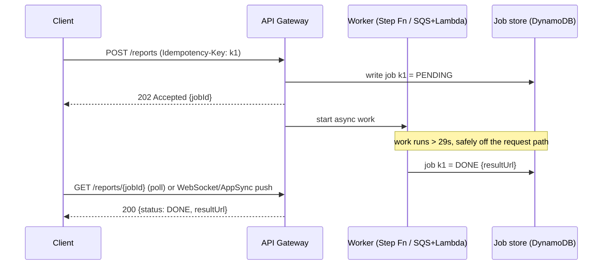
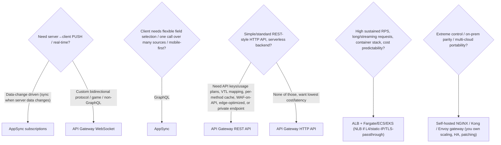

# API Layer on AWS: API Gateway, AppSync and GraphQL

The "API layer" is the managed front door between clients (mobile, web, partners,
services) and your backend compute/data. On AWS the three managed choices are
**API Gateway** (REST, HTTP, WebSocket API types), **AppSync** (managed GraphQL and
real-time), and — for people who need L4/L7 load balancing rather than a full API
product — **ALB/NLB in front of Fargate/EC2**. Choosing among them is one of the most
common "design the front door" system-design questions, and it is almost entirely a
**trade-off exercise**: latency budget vs features, per-request cost vs fixed cost,
ops burden vs control, and which service quota you hit first at scale.

This note goes service by service, then dedicates a large section to trade-offs and
service selection, because that is what interviewers actually probe.

---

## API Gateway REST vs HTTP vs WebSocket API

API Gateway is a **fully managed, multi-tenant** API front door. It handles TLS
termination, request routing, throttling, authorization, and integration with
backends (Lambda, HTTP endpoints, other AWS services via AWS-service integrations).
There are three distinct product families under one console, and they are NOT feature
supersets of each other — this trips people up.

**REST API (the original, "v1"):** the most feature-rich. Supports request/response
mapping templates (Velocity/VTL), API keys and usage plans, per-method caching,
request validation, WAF, private endpoints, Cognito/Lambda/IAM authorizers, canary
deployments, AWS X-Ray tracing, SDK generation, and API Gateway's own data
transformations. It is the most expensive of the two HTTP-style APIs.

**HTTP API ("v2"):** a leaner, cheaper, lower-latency rewrite. It costs roughly
**~70% less** than REST API per request and adds a few milliseconds less overhead. It
supports JWT authorizers natively (great with Cognito or any **OIDC (OpenID Connect)**
provider — the identity layer built on top of OAuth 2.0), Lambda
authorizers, automatic deployments, and CORS config. But it **drops** several REST
features: no request/response mapping templates (only basic parameter mapping), no
API keys/usage plans, no per-method caching, no request validation via models, **no
direct WAF integration** (as of 2025 you still cannot attach a Web ACL to an HTTP
API — you must front it with CloudFront + WAF), no private endpoints in the
same way, no edge-optimized endpoint type. Pick HTTP API when you have a simple
Lambda- or HTTP-proxy backend and want the lowest cost/latency.

**WebSocket API:** maintains **stateful, bidirectional** connections for real-time
push (chat, live dashboards, multiplayer, notifications). Routing is by a
**route selection expression** on the message body (e.g. `$request.body.action`), with
built-in `$connect`, `$disconnect`, and `$default` routes. The server pushes to
clients via the **`@connections` callback API** using the connection ID (you typically
store connection IDs in DynamoDB). Billed per message + connection-minutes.

*Why persist connection IDs?* The gateway is **stateless per message** — it hands each
incoming frame to a fresh Lambda invocation, and any Lambda instance (even one triggered
later by a totally different event) may need to push to a connection it never accepted.
The connection ID is the only handle to a live socket, so you must save it somewhere all
your push code can read. Traced fan-out broadcast of "user A posted a message" to 3
subscribers:

1. Each client opens a socket → `$connect` route → Lambda writes its `connectionId`
   (e.g. `abc=`, `def=`, `ghi=`) into a DynamoDB `Connections` table.
2. User A sends a message → `$default`/`sendMessage` route → a producer Lambda **scans
   the table** (3 rows) and calls `postToConnection(connectionId, payload)` once per row
   → `abc=`, `def=`, `ghi=` each receive the push.
3. `def=` closed its laptop 10 minutes ago but never sent `$disconnect` (network drop).
   `postToConnection("def=")` throws **`GoneException` (HTTP 410)** → the Lambda catches
   it and **deletes that row** so the next broadcast doesn't waste a call on a dead
   socket. This stale-connection pruning is the gotcha AppSync handles for you.

| | REST API | HTTP API | WebSocket API |
|---|---|---|---|
| Shape | HTTP request/response | HTTP request/response | Persistent bidirectional socket |
| Distinctive features | VTL mapping, per-method cache, API keys/usage plans, WAF-on-API, edge/private endpoints | Lean: JWT authorizer, basic param mapping, auto-deploy, CORS | `$connect`/`$disconnect`/`$default` routes, `@connections` push, stateful conn |
| Backend | Lambda / HTTP / direct AWS-service integration | Lambda / HTTP proxy | Lambda (+ DynamoDB to store conn IDs) |
| Relative cost | Highest | ~70% cheaper than REST | Per message + connection-minutes |

**Trade-off summary:** REST = max features (mapping, caching, API keys, WAF, private,
edge) at higher cost/latency; HTTP = ~70% cheaper + lower latency but fewer features;
WebSocket = the only one for server-initiated push over a persistent connection.
Default to **HTTP API** for new serverless REST-style APIs unless you need a
REST-only feature (API keys/usage plans, request validation via models, per-method
cache, VTL transforms, edge-optimized, private link, WAF on the API itself).

## The 29-second integration timeout

The single most important API Gateway limit for design: the **integration timeout**.
Historically it was a **hard 29-second maximum** (with a 50 ms minimum) for all API
types. In **June 2024 AWS made it adjustable above 29 s for Regional and private
REST APIs** via a service quota increase — but the catch is that **raising the
integration timeout requires lowering your account-level throttle (RPS) quota**, i.e.
you trade throughput for longer per-request tolerance. **HTTP APIs remain capped at
30 s** and **WebSocket at 29 s**.

Design implications:
- The 29 s ceiling is shorter than Lambda's **15-minute** max. So a synchronous
  API-Gateway-in-front-of-Lambda call **cannot** wait for a long Lambda. For anything
  that can run long (report generation, video processing, LLM inference beyond ~29 s),
  use an **asynchronous pattern**: return `202 Accepted` + a job ID immediately, do the
  work in Step Functions / SQS + Lambda / Batch, and let the client **poll** or receive
  a **WebSocket/AppSync-subscription** push when done.

The **idempotency key** (`k1`) is what prevents a client retry (or a gateway 504 on a
slow submit) from kicking off the same expensive job twice — the worker checks the store
and no-ops if `k1` already exists.
- The default account throttle is **10,000 RPS** with a **5,000 burst** bucket
  (token-bucket) across all API types in a Region (lower — 2,500 RPS / 1,250 burst —
  in a set of newer/smaller Regions). This is a soft limit (increasable), but it is
  what a naive "just put everything behind one API Gateway" design hits first.
- LLM/GenAI streaming: if you need to stream tokens for minutes, don't hang on a
  synchronous integration — use **Lambda response streaming via a Function URL**,
  **WebSocket API**, or **AppSync subscriptions**, not a plain REST/HTTP integration.

## Throttling, usage plans, and API keys

API Gateway throttling is a **token-bucket** model at multiple levels, applied in this
order: **account-level** (per Region) → **per-API / per-stage / per-method** →
**per-client via usage plan**. When a bucket is empty the client gets **429 Too Many
Requests**. Two knobs: **rate** (steady-state RPS = bucket refill rate) and **burst**
(bucket capacity = max concurrent spike).

**Worked trace — rate = 100 RPS, burst = 200, client fires 300 requests in one instant:**
- The bucket starts full with **200** tokens (that is what "burst = bucket capacity"
  means). The first **200** requests each take a token and pass **immediately** → the
  bucket is now empty.
- The remaining **100** requests arrive with an empty bucket. Tokens refill at 100/sec,
  i.e. one token every 10 ms. In the *same* instant essentially none have refilled, so
  those 100 get **429'd** (API Gateway does not queue — it rejects).
- Over the **next full second** the bucket refills 100 tokens, so a client that backs
  off and retries can push another 100 requests that second. Steady state is therefore
  **100 RPS**; the 200-token burst only buys a one-time cushion for a spike, then you are
  rate-limited to the refill rate.
- Takeaway: burst absorbs a momentary spike (200 at once), rate governs the sustained
  ceiling (100/sec). Clients must use **exponential backoff + jitter** on the 429s.

**API keys + usage plans (REST API only):** an API key identifies a caller; a **usage
plan** attaches rate/burst limits **and a quota** (e.g. 1M requests/month) to a set of
keys and stages. This is how you build tiered SaaS ("free = 10 RPS/10k/day, pro =
100 RPS/1M/day").

*Quota vs rate are independent limits — a caller can hit either first.* Work the pro
tier: a **1M req/month** quota averages `1,000,000 / (30 × 86,400 s) ≈ 0.39 RPS` — trivially
under the 100 RPS rate limit if traffic were perfectly smooth. But real traffic is bursty:
a client with **990k requests already used** (quota headroom of 10k) that suddenly sends
150 requests in one second gets **429'd on the rate limit** (100 RPS) even though it is
nowhere near exhausting its monthly quota. Conversely a client averaging 0.4 RPS all
month can burn its **entire 1M quota** and then get 429'd on quota with the rate bucket
completely full. Interview point: **rate/burst protect your backend per-second; quota
enforces the billing envelope over a month — enforce and monitor both.**

**Important gotcha:** API keys are **not an authentication
mechanism** — they identify/meter, they don't authenticate. Never use an API key as
your only auth for a sensitive API; pair it with an authorizer.

**HTTP API has no API keys or usage plans** — if you need metered tiers, use REST API,
or meter externally. This is one of the main reasons teams stay on REST API.

Trade-off: throttling protects the backend and enforces fairness, but a too-tight
throttle causes false 429s during legitimate bursts; a too-loose one lets a hot client
overwhelm downstream (DynamoDB hot partition, Lambda concurrency exhaustion). Set
per-method throttles for expensive routes and use usage plans to isolate tenants.

## Caching, request and response mapping

**Caching (REST API only):** a dedicated cache instance (0.5 GB to 237 GB, priced per
hour by size) sits at the stage level with a configurable TTL (default 300 s, up to
3600 s). Cache key is built from selected request parameters. A cache hit returns
without invoking the integration, cutting latency and backend load and **cost**
(fewer Lambda invokes / DynamoDB reads). Trade-offs: it is a **per-stage fixed hourly
cost regardless of hit rate**, it serves **potentially stale** data (eventual
consistency window = TTL), and cache invalidation requires the `Cache-Control` header
with proper IAM permission. Only worth it for read-heavy, cacheable, latency-sensitive
GETs. For global read caching, **CloudFront in front** is often cheaper and more
flexible than API Gateway's built-in cache.

**Worked "is the cache worth it?" (approx us-east-1 pricing):** suppose **500 GET RPS**,
all cacheable, **90% hit rate**, each miss costs one Lambda invoke (512 MB, 100 ms) + one
DynamoDB read.
- Per-invoke backend cost: Lambda GB-s = 0.5 GB × 0.1 s = 0.05 GB-s × $0.0000166667 ≈
  **$0.00000083**; Lambda request charge **$0.0000002**; DynamoDB eventually-consistent
  read (0.5 RRU × $0.125/M RRU) ≈ **$0.0000000625**. Total ≈ **$1.10 per million** misses
  avoided. (The API Gateway request charge is **not** saved — cache hits still count as
  API requests — so only the backend cost is in play.)
- Hits/month at 90%: 500 × 0.9 = 450 RPS × 2,592,000 s ≈ **1.166 billion** backend calls
  avoided → 1,166.4 M × $1.10/M ≈ **$1,280/month saved**.
- Cache instance (e.g. 6.1 GB @ ~$0.20/hr) ≈ $0.20 × 730 ≈ **$146/month fixed**.
- Verdict: save **~$1,280**, pay **$146** → clearly worth it at this volume.
- **Break-even hit rate:** you need enough avoided calls to cover $146. $146 ÷ $1.10/M ≈
  **133 M** hits/month. Total GET volume = 500 × 2,592,000 ≈ 1.296 B/month, so break-even
  ≈ 133 M ÷ 1,296 M ≈ **~10%** hit rate. Below ~10% the fixed hourly cost dominates and
  the cache loses money — which is exactly why the cache only pays off for **high-volume,
  high-hit-rate** GETs, not a low-traffic API.

**Request/response mapping (REST API, VTL):** mapping templates let API Gateway
transform between the client's payload and the integration's expected format
(rename fields, inject context like `$context.identity.sourceIp`, reshape JSON/XML).
This enables the **direct AWS-service integration** pattern — API Gateway → DynamoDB /
SQS / Step Functions **with no Lambda in between** ("Lambda-less" / "serverless
without servers"), removing Lambda cost, cold starts, and a failure hop. Trade-off:
VTL is powerful but **hard to test, debug, and version**; complex mapping logic
becomes a maintenance liability, and many teams prefer a thin Lambda for readability.
**HTTP API supports only lightweight parameter mapping, not full VTL.**

## Authorizers: IAM, Cognito, and Lambda

Think of authorizers as **four different bouncers at the door**, ranked by cost and
latency. IAM checks a badge you already carry (**SigV4** — AWS Signature Version 4, the
request-signing scheme where the caller signs the request with its AWS credentials; no
extra server, cheapest inside AWS); JWT/Cognito checks a signed wristband against a known
issuer (fast, no code); the
Lambda authorizer is a human bouncer who runs your custom rulebook on every guest
(most flexible, but you pay for the extra person on every entry). Reach for the cheapest
one that can express your rule.

Four ways to control who calls an API Gateway endpoint:

- **IAM authorization (`AWS_IAM`):** caller signs the request with SigV4; API Gateway
  checks the caller's IAM policy. Best for **service-to-service** calls inside AWS and
  for internal tools — no token server needed, uses existing IAM. Works on REST and
  HTTP APIs.
- **Cognito User Pools authorizer (REST):** API Gateway validates a Cognito-issued
  JWT. Managed user directory, sign-up/sign-in, MFA. Good for consumer/user-facing
  apps you don't want to build identity for.
- **JWT authorizer (HTTP API):** native OIDC/JWT validation against any compliant IdP
  (Cognito, Auth0, Okta, your own). Lower latency than a Lambda authorizer; no code.
- **Lambda authorizer (custom, both APIs):** your Lambda returns an IAM policy
  (`TOKEN` type from a header, or `REQUEST` type from full request context). Use for
  bespoke logic (opaque tokens, per-tenant lookups, header/IP rules). **Cache the
  authorizer result** (TTL, default 300 s) or every request pays the authorizer's
  latency + cost. Trade-off: max flexibility, but adds a Lambda invocation (cold
  start, latency, cost) to the auth path.

Trade-off: prefer **built-in JWT/Cognito/IAM** authorizers over Lambda authorizers
when they fit — they are cheaper and lower-latency (no extra invoke). Reach for a
Lambda authorizer only when your auth logic can't be expressed as JWT/IAM.

**mTLS (mutual TLS) for client-certificate auth:** API Gateway (REST API, on a custom
domain) can require **mutual TLS** — the client presents an X.509 certificate that the
gateway validates against a trust store (a CA bundle you upload to S3) *before* any
authorizer runs. Ordinary TLS only authenticates the server to the client; mTLS also
authenticates the client to the server. Reach for it in **partner/B2B** APIs, IoT device
fleets, and regulated or zero-trust environments where "who is the caller's machine?" must
be proven at the transport layer, not just via a bearer token. You can layer mTLS *and* an
authorizer (certificate proves the device, token proves the user).

## Edge-optimized, regional, and private endpoints

REST API endpoint types (this dimension is REST-specific; HTTP APIs are regional):

- **Edge-optimized:** requests route through the **CloudFront** edge network to the
  API's home Region. Lowers latency for **geographically dispersed** clients by
  terminating TLS at the nearest edge. Trade-off: the API still lives in one Region;
  edge only speeds the network path, and you can't attach your own CloudFront
  distribution controls to the managed one. Best for global consumer APIs when you
  don't run your own CloudFront.
- **Regional:** endpoint served from the Region directly. Best when clients are
  in-Region (e.g. other AWS services, EC2, same-Region mobile), or when you want to
  **put your own CloudFront** in front (more control over caching, WAF, custom
  behaviors, multi-Region routing via Route 53/latency records). This is the common
  building block for **multi-Region active-active** API designs.
- **Private:** endpoint reachable **only from within a VPC** via an **interface VPC
  endpoint (PrivateLink)**; not exposed to the internet. Best for internal
  microservice APIs and regulated workloads. Trade-off: no public access at all, so
  external clients need VPN/Direct Connect/PrivateLink sharing.

For **multi-Region**, use Regional endpoints + Route 53 latency/failover records or
a global accelerator, with data-layer replication (DynamoDB global tables). Edge-
optimized alone does NOT give you multi-Region resilience — the backend is still
single-Region.

## AppSync and managed GraphQL

**AppSync** is AWS's managed **GraphQL** service. Clients send a single GraphQL query
describing exactly the fields they want; AppSync's **resolvers** fetch from
**data sources** (DynamoDB, Aurora/RDS via Data API, Lambda, OpenSearch, HTTP,
EventBridge) and assemble one response. Resolvers are written in **VTL** (legacy) or
the **APPSYNC_JS** JavaScript runtime (current recommendation) — a restricted JS
runtime (**no async/await, no network/timers, synchronous only, 32 KB code size**).
**Pipeline resolvers** chain up to **10 functions** to orchestrate multiple data
sources in one field resolution. **Direct (unit) resolvers** hit one source. AppSync
can also do **direct DynamoDB/RDS resolution with no Lambda**, like API Gateway's
service integrations but native to GraphQL.

Why GraphQL beats REST (when it does):
- **No over/under-fetching:** the client asks for exactly the fields it needs, so
  mobile clients on cellular avoid downloading unused data and avoid N round-trips.
- **One request, many sources:** a screen that needs user + orders + recommendations
  is one GraphQL query fanning out to three data sources server-side, instead of
  3 REST calls the client must orchestrate.
- **Strong typed schema** = self-documenting contract, codegen, and evolution without
  versioned URLs.
- **Built-in real-time subscriptions** (see next section).

When REST/HTTP API beats GraphQL:
- Simple CRUD / few clients / caching by URL matters (HTTP caching + CDN is trivial
  with REST; GraphQL caching is harder because everything is `POST /graphql`).
- File up/download, binary, webhooks, or third-party integrations expecting REST.
- Team unfamiliarity with GraphQL, or you need per-endpoint WAF/usage-plan metering.
- Query-cost/complexity attacks (deeply nested GraphQL queries) are a real GraphQL-
  specific DoS risk you must guard against (depth/complexity limits).

**The N+1 resolver problem (GraphQL's flexibility can hide a fan-out cost you must design
against):** GraphQL resolvers run per field, so a list field can quietly explode into one
downstream call *per item*. Trace it: a query asks for `posts { author { name } }` and
returns **50 posts**. AppSync runs the `posts` resolver **once** (1 query → 50 rows), then
runs the `author` resolver **once per post** to resolve each `author` field → **50 more
calls**. Total = **1 + 50 = 51** downstream calls to render one screen; add a nested
`comments` field and it multiplies again. That is the "N+1" (one parent query + N child
queries). Mitigations:
- **Batching / DataLoader pattern:** collect all the author IDs needed for the 50 posts
  and fetch them in **one** batched request (e.g. DynamoDB `BatchGetItem` for 50 keys, or
  one SQL `WHERE id IN (...)`), turning 1 + 50 into **1 + 1 = 2** calls.
- **AppSync `BatchInvoke`** for Lambda data sources: AppSync hands the resolver a single
  invocation with the *array* of 50 parent items instead of 50 separate invocations, so
  your Lambda does one batched backend fetch.
- **Pipeline resolvers** to fetch the related set in one function rather than field-by-field.
The senior point: GraphQL's "ask for exactly what you want" convenience shifts the fan-out
cost server-side, so you must design resolvers to **batch**, or a harmless-looking nested
query becomes an N+1 storm on your database.

**AppSync server-side caching:** like API Gateway's stage cache, AppSync offers an
in-memory cache you provision by size, but at finer granularity. **Full-request caching**
keys the whole query/response and serves repeat identical queries without running any
resolver. **Per-resolver caching** caches individual resolver results, with the **cache
key built from chosen arguments / identity / source fields** (e.g. cache the `author`
resolver keyed by `authorId` so the N+1 fan-out above hits cache after the first miss) and
a configurable **TTL** (seconds up to ~1 hour). Trade-off mirrors API Gateway's: you pay a
fixed hourly cost for the cache instance and serve data up to TTL stale, so it pays off for
read-heavy, repeat-query fields — and per-resolver caching pairs especially well with the
N+1 mitigation, since a cached `author` result short-circuits the repeated child calls.

AppSync limits that matter: **request execution time 30 s**, **response size 5 MB**,
**subscription payload 240 KB**, **subscriptions per WebSocket connection 200**,
**10 functions per pipeline resolver**, **max query length 15,000 tokens**, **10,000
resolvers per single request**.

## AppSync subscriptions and real-time

AppSync provides **real-time subscriptions** over a managed **WebSocket** connection
(MQTT-over-WebSocket historically) with **no server to run**. A subscription is tied
to a **mutation**: when a client mutates data, AppSync automatically pushes the result
to all clients subscribed to that field (optionally filtered with **enhanced
subscription filters**). This is the killer feature vs raw API Gateway WebSocket —
you don't manage connection IDs, fan-out, or a DynamoDB connection table; AppSync does
it. Great for chat, collaborative editing, live scores, price tickers, presence.

**AppSync subscriptions vs API Gateway WebSocket API — trade-off:**

| Dimension | AppSync subscriptions | API Gateway WebSocket |
|---|---|---|
| Model | Data-change push tied to GraphQL mutation | Raw bidirectional messages, custom routes |
| Fan-out / conn mgmt | Managed by AppSync | You store conn IDs (DynamoDB) + push via `@connections` |
| Protocol | GraphQL over WS | Arbitrary JSON, route by selection expression |
| Best for | Data sync, "when X changes tell subscribers" | Custom protocols, game state, non-GraphQL push |
| Ops burden | Lowest | You build fan-out logic |
| Payload cap | 240 KB per message | 32 KB per frame (larger messages are split into multiple 32 KB frames) |

Pick AppSync subscriptions when the real-time need is "notify clients when server data
changes." Pick API Gateway WebSocket when you need a **custom bidirectional protocol**
or push that isn't tied to a GraphQL data mutation. AppSync also now offers
**Event APIs** (pub/sub over channels) for non-GraphQL real-time without a schema.

## API Gateway plus Lambda vs ALB plus Fargate for APIs

The classic "how should I host this API" fork.

**API Gateway + Lambda (serverless):**
- **Pay-per-request**, scales to zero, no capacity planning, no servers to patch.
- Built-in auth, throttling, mapping, caching (REST), stages.
- **Cost model bites at high, steady volume:** per-request pricing + Lambda GB-seconds
  can exceed always-on Fargate once you're at sustained high RPS. Cold starts add tail
  latency (mitigate with provisioned concurrency, which erodes the "scale-to-zero"
  savings). 29 s ceiling. Lambda concurrency limits (default 1,000/Region, soft).
- **Best for:** spiky/unpredictable traffic, low-to-moderate steady load, small teams,
  event-driven backends, "build fast, low ops."

**ALB + Fargate (or EKS/ECS) containers:**
- Always-on containers behind an **Application Load Balancer** (L7, path/host routing,
  no hard request timeout like 29 s — configurable idle timeout, long-lived
  connections, streaming, WebSockets, gRPC via ALB/NLB).
- **Cost is flat/predictable** and often cheaper at **high sustained throughput**.
- **More ops:** you manage container images, scaling policies, patching the runtime,
  and the LB — but you get full control of the runtime, long requests, large payloads,
  and any framework.
- **ALB does NOT provide** API keys, usage plans, request validation, per-method
  caching, or SDK generation — it's a load balancer, not an API management product.
- **NLB (L4)** when you need ultra-low latency, static IPs, TLS passthrough, or
  extreme connection counts; ALB (L7) for HTTP routing features.
- **Best for:** high steady RPS, long-running/streaming requests, existing container
  stack, need for full runtime control or non-HTTP protocols.

Rule of thumb: **serverless for spiky/low-steady + fast delivery; containers behind
ALB for high steady throughput, long requests, and cost predictability.** You can also
combine — API Gateway (auth, throttle, WAF) → private integration (VPC Link) → ALB →
Fargate — to get API management in front of containers.

**Worked cost crossover — "At 50k sustained RPS, is serverless still cheapest?"**
(approx us-east-1 on-demand pricing; assume HTTP API + Lambda 512 MB / 100 ms). Monthly
requests = 50,000 × 2,592,000 s = **129.6 billion**.

*Serverless side:*
- **HTTP API requests:** $1.00/M for the first 300M, $0.90/M beyond → 300M × $1.00 =
  $300, plus 129,300M × $0.90 = $116,370 → **≈ $116,670**.
- **Lambda requests:** 129,600M × $0.20/M = **$25,920**.
- **Lambda compute:** 0.5 GB × 0.1 s = 0.05 GB-s/req × 129.6B = 6.48B GB-s × $0.0000166667
  = **$108,000**.
- **Serverless total ≈ $116,670 + $25,920 + $108,000 ≈ $250,000/month.**

*Container side (ALB + Fargate):* say each 1-vCPU / 2-GB task comfortably serves ~500 RPS
→ 50,000 / 500 = 100 tasks (round to **120** for headroom/HA).
- **Fargate:** per task = 1 × $0.04048 (vCPU-hr) + 2 × $0.004445 (GB-hr) = $0.04937/hr;
  120 tasks × $0.04937 × 730 hr ≈ **$4,325**.
- **ALB:** ~$0.0225/hr × 730 ≈ $16 + LCU charges (connections/bytes/rules) ≈ a few
  hundred to ~$1,000 at this volume → call it **~$1,000**.
- **Container total ≈ $4,325 + $1,000 ≈ $5,300/month.**

*Result:* serverless ~$250k vs containers ~$5.3k — containers are **~47× cheaper** at
50k steady RPS. **So the answer is: no, serverless is not cheapest here.**

*Where is the crossover?* Reduce to cost-per-RPS-per-month. Serverless is purely variable:
$0.90 + $0.20 + $0.833 ≈ **$1.93 per million requests**, and 1 sustained RPS = 2.592M
req/month, so **≈ $5.00/month per RPS**. Containers are near-fixed but carry an **HA
floor** you pay even at trickle traffic: ≥2 tasks across AZs (2 × $36 ≈ $72) + ALB (~$18)
≈ **$90/month minimum**. Crossover ≈ $90 ÷ $5.00 ≈ **~18 RPS sustained**. Below ~20
RPS (or for spiky/bursty traffic that would leave containers idle) serverless wins on
scale-to-zero and zero ops; above it the container line stays flat while the serverless
line climbs linearly, and the gap explodes by 50k RPS.

## Rate limiting and WAF integration

Two layers of protection:
- **Throttling (built-in):** token-bucket rate/burst as described above — protects
  backends from overload and enforces per-tenant fairness. It is **not** a security
  control against malicious traffic per se; it's a capacity/fairness control.
- **AWS WAF:** attach a Web ACL to **REST API stages**, **CloudFront** (in front of
  edge-optimized/regional), **ALB**, and **AppSync**. WAF gives **rate-based rules**
  (e.g. block an IP exceeding N requests / 5 min), SQLi/XSS managed rule groups, geo
  blocking, IP allow/deny lists, and bot control. Note: **HTTP APIs still cannot
  attach WAF directly** — WAF associates only with REST API stages, CloudFront, ALB,
  and AppSync, so front security-sensitive public HTTP APIs with CloudFront + WAF (or
  keep them on REST API).

Layered defense for a public API: **CloudFront (+ WAF, + Shield for DDoS)** →
**API Gateway (throttle + authorizer)** → backend. Shield Standard is automatic;
Shield Advanced adds DDoS cost protection and response team. WAF rate rules complement
API Gateway throttling: WAF blocks abusive IPs *before* they consume your throttle
budget.

## Versioning and stages

API Gateway has **stages** (e.g. `dev`, `test`, `prod`) — each a named deployment
snapshot with its own **stage variables**, throttle settings, cache, and logging. A
deployment is immutable; you promote by deploying to a stage. **Canary releases**
(REST API) split a percentage of traffic to a new deployment on the same stage for
safe rollout, with automatic promotion/rollback.

API **versioning strategies**:
- **URL path** (`/v1/resource`, `/v2/resource`) — simplest, most explicit, cacheable;
  most common. Each version is a route/stage.
- **Header/media-type** (`Accept: application/vnd.api.v2+json`) — cleaner URLs but
  harder to test/cache/debug.
- **Separate stages/APIs per version** — full isolation, more to operate.

Trade-off: URL versioning is easiest for clients and CDNs but proliferates routes;
header versioning is elegant but opaque. **GraphQL/AppSync deliberately avoids URL
versioning** — you evolve the schema additively (add fields, deprecate with
`@deprecated`) so a single endpoint serves all clients; this is a genuine GraphQL
advantage for long-lived multi-client APIs. Use **stage variables** to point the same
API deployment at different backend Lambda aliases/ARNs per environment.

## Trade-offs and when to use what

The decision tree an interviewer wants to hear:

**Service comparison:**

| | REST API | HTTP API | WebSocket | AppSync | ALB+Fargate |
|---|---|---|---|---|---|
| Protocol | HTTP req/resp | HTTP req/resp | WS bidir | GraphQL(+WS) | HTTP/WS/gRPC |
| Cost/req | Highest of the two | ~70% cheaper | per msg+conn | per query+RT | flat/always-on |
| Latency overhead | Low | Lower | n/a | Low | Lowest (own runtime) |
| Max request | 29 s (adj. Regional) | 30 s | 29 s | 30 s | configurable |
| Auth built-in | IAM/Cognito/Lambda | IAM/JWT/Lambda | IAM/Lambda | IAM/Cognito/OIDC/API-key/Lambda | none (DIY) |
| API keys/usage plans | Yes | No | No | API keys | No |
| Caching | Yes (stage) | No | No | Server-side cache | DIY/CloudFront |
| WAF | Yes | No (use CloudFront) | No | Yes | Yes |
| Real-time push | No | No | Yes | Yes (subs) | Yes (you build) |
| Scale-to-zero | Yes | Yes | Yes | Yes | No (min tasks) |
| Ops burden | Low | Low | Low | Low | Higher |

**Managed API layer vs self-hosted (NGINX/Kong/Envoy):**
- Managed (API GW/AppSync): no servers, auto-scale, built-in auth/throttle/WAF,
  pay-per-use, deep AWS integration. Give up: some protocol/config flexibility,
  per-request cost at very high volume, potential vendor lock-in, the 29 s ceiling.
- Self-hosted: total control (any protocol, plugins, custom logic), no per-request
  premium, cloud-portable. Give up: you own HA, autoscaling, patching, capacity, and
  on-call — real cost is engineering time. Choose it for extreme customization,
  multi-cloud, or when you already run a service mesh.

## Failure modes and how the design degrades

- **AZ failure:** API Gateway, AppSync, and ALB are all **multi-AZ** by design within
  a Region — a single AZ loss is transparent. Your **backend** must also be multi-AZ
  (Lambda is; Fargate tasks must span AZs; DynamoDB is regional/multi-AZ).
- **Region failure:** none of these are automatically multi-Region. You need Regional
  endpoints + **Route 53 health-check failover** (or Global Accelerator) + a
  replicated data layer (**DynamoDB global tables**, Aurora global DB). Edge-optimized
  does not save you — its backend is one Region. This is the **cell-based / active-
  active** design conversation.
- **Throttling (429s):** if account/stage/usage-plan buckets drain, callers get 429.
  Design clients with **exponential backoff + jitter**; isolate tenants with usage
  plans; raise the soft quota proactively before big launches.
- **Backend overload / hot partition:** API Gateway will happily forward burst traffic
  into a DynamoDB hot partition (3,000 RCU / 1,000 WCU per partition) or exhaust Lambda
  concurrency (default 1,000/Region). Front with throttling + caching; design keys to
  avoid hot partitions; use reserved/provisioned concurrency for critical Lambdas.
- **Cold starts:** spiky serverless traffic gives tail-latency spikes; provisioned
  concurrency fixes it at the cost of always-on charges (eroding scale-to-zero).
- **Timeout mismatch:** the 29 s ceiling silently truncates long integrations →
  gateway returns 504 while the backend keeps running (orphaned work / double effects).
  Use async + idempotency keys.
- **GraphQL query-complexity DoS:** a deeply nested query can fan out expensively —
  enforce depth/complexity/query-length limits (AppSync caps query at 15,000 tokens).

## Common interview follow-up questions

- "Your synchronous API sometimes needs 90 seconds of backend work. Redesign it."
  (Async: 202 + job id, Step Functions/SQS, poll or push via WebSocket/AppSync.)
- "REST API vs HTTP API — when would you deliberately pay more for REST?" (API keys/
  usage plans, VTL mapping, per-method cache, WAF-on-API, edge-optimized, private.)
- "You need per-tenant rate limits and monthly quotas for a SaaS API." (REST API +
  usage plans + API keys; HTTP API can't do it.)
- "When is AppSync the wrong choice?" (Simple CRUD with URL caching, binary/file
  transfer, REST-expecting integrations, GraphQL query-cost attack surface, team
  unfamiliarity.)
- "Design a real-time collaborative app front door." (AppSync subscriptions vs API GW
  WebSocket trade-off.)
- "At 50k sustained RPS, is serverless still cheapest?" (Often no — model Lambda GB-s +
  per-request vs always-on Fargate; consider ALB+Fargate.)
- "Make this API multi-Region active-active." (Regional endpoints, Route 53 failover,
  DynamoDB global tables, idempotency, conflict handling.)
- "Which limit does this design hit first?" (Usually the 10k RPS account throttle, the
  29 s timeout, or a DynamoDB hot-partition/ Lambda-concurrency ceiling.)
- "How do you protect a public API from abuse?" (CloudFront + WAF rate rules + Shield →
  API GW throttle + authorizer; layered.)
- "Lambda-less API Gateway — why and why not?" (Direct DynamoDB/SQS integration removes
  Lambda cost/cold-start/failure-hop, but VTL is hard to test/version.)

## References

- AWS API Gateway Developer Guide — Quotas and important notes (throttle quotas,
  integration timeout, endpoint types).
- AWS "What's New" (Jun 2024) — API Gateway integration timeout limit increase for
  Regional and private REST APIs (trade-off with account throttle quota).
- AWS API Gateway Developer Guide — Choosing between REST APIs and HTTP APIs; WebSocket
  APIs; usage plans and API keys; caching; mapping templates; Lambda/Cognito/JWT/IAM
  authorizers; endpoint types (edge/regional/private); canary deployments and stages.
- AWS AppSync Developer Guide + AppSync endpoints and quotas (execution time 30 s,
  response 5 MB, subscription payload 240 KB, 200 subs/connection, 10 functions/
  pipeline, 15,000-token query limit, APPSYNC_JS runtime).
- AWS AppSync — Real-time data with subscriptions; enhanced subscription filtering;
  Event APIs.
- AWS Well-Architected Framework — Performance Efficiency & Reliability pillars
  (managed services, multi-AZ/Region, throttling and backoff).
- AWS WAF Developer Guide — associating a Web ACL with API Gateway, CloudFront, ALB,
  AppSync; rate-based rules.
- Elastic Load Balancing docs — ALB (L7) vs NLB (L4) feature and use-case comparison;
  VPC Link private integrations.
- AWS Builders' Library — "Avoiding fallback in distributed systems," "Timeouts,
  retries, and backoff with jitter."
