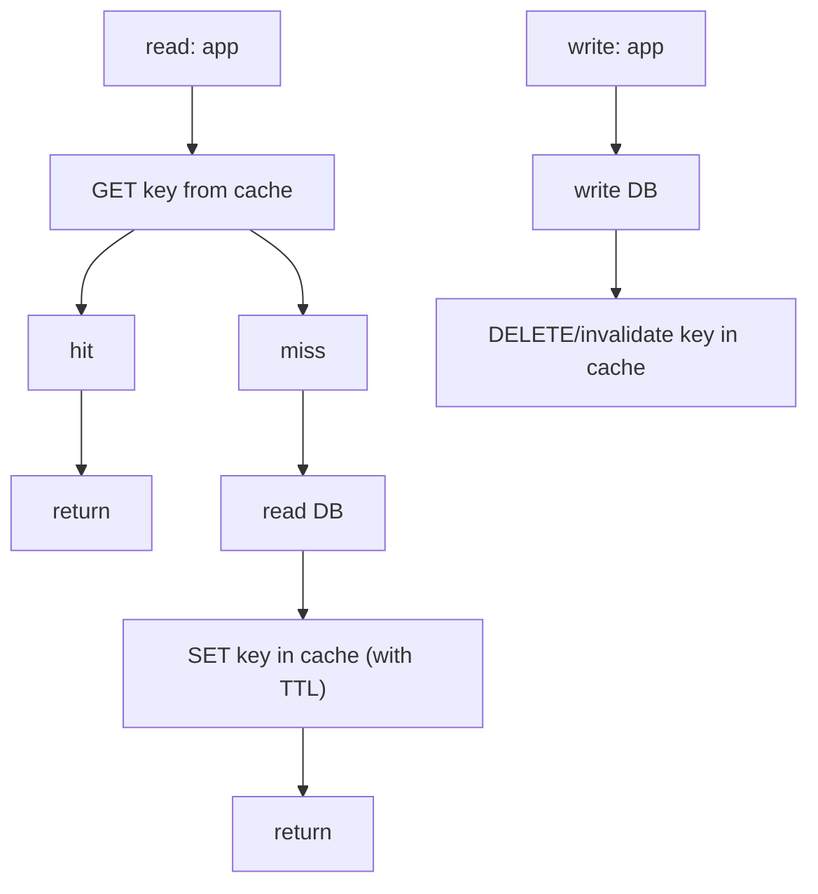
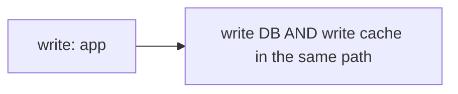
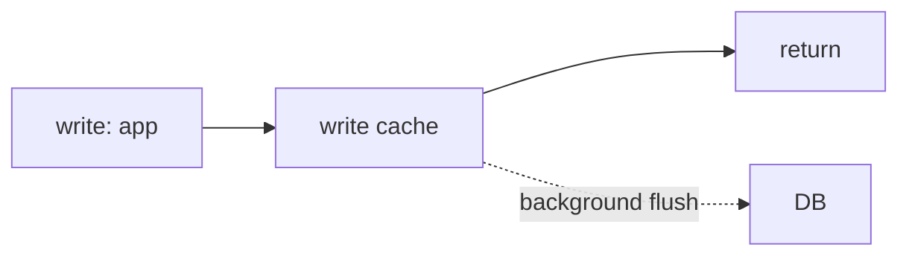

# Caching on AWS: ElastiCache, DAX and CloudFront Patterns

Caching is the highest-leverage lever in system design: it trades a little memory
and consistency risk for order-of-magnitude wins in latency, throughput, and cost.
On AWS the three canonical layers are **CloudFront** (edge/CDN), **ElastiCache**
(in-region Redis/Valkey or Memcached), and **DAX** (a caching layer bolted onto
DynamoDB). This note goes deep on how each works, the cache patterns you wire around
them, and — most importantly for interviews — the **trade-offs** that decide which
one you reach for.

The mental model: a cache is a **denormalized, volatile, faster copy** of data whose
system of record lives elsewhere. Everything hard about caching flows from that one
sentence — staleness (it is a copy), invalidation (keeping the copy correct), and
cold-start/failure behavior (it is volatile).

---

## Why cache and what to cache on AWS

**Intuition.** Reads dominate most workloads (often 90%+). A cache absorbs the read
fan-out so the expensive, durable system of record (RDS, DynamoDB, S3, a downstream
API) only sees the misses. Caching pays off when data is **read far more than
written**, is **expensive to compute or fetch**, and can **tolerate some staleness**.

**What to cache on AWS, by layer:**
- **Edge (CloudFront):** static assets, media, and cacheable API GET responses
  physically close to users — cuts RTT and offloads origin.
- **In-region application cache (ElastiCache):** database query results, rendered
  fragments, session state, rate-limit counters, leaderboards, pub/sub fan-out.
- **Database-attached (DAX):** DynamoDB item and query/scan results for read-heavy
  key-value access with microsecond latency.

**Latency ballparks (orders of magnitude, memorize the ratios not the digits):**

| Layer | Typical read latency |
|---|---|
| CloudFront edge hit | ~10-30 ms to user (single-digit ms at PoP) |
| ElastiCache (Redis/Valkey/Memcached) in-VPC | sub-millisecond to low single-digit ms |
| DAX cache hit | microseconds (item cache), single-digit ms (query cache) |
| DynamoDB single-digit-ms (SSD) | ~5-10 ms |
| RDS/Aurora query | ms to tens of ms |
| S3 GET | tens of ms first byte |

**When NOT to cache:** strongly-consistent financial reads where any staleness is
unacceptable, write-heavy data with low read reuse, tiny datasets already fast at the
source, or data so unique per request that hit rate is near zero (a cache with a 2%
hit rate adds a network hop and cost for almost no benefit).

**Back-of-envelope for hit rate.** Effective latency = `hit_rate * cache_latency +
(1 - hit_rate) * origin_latency` (plus the miss also pays the cache lookup). A 95%
hit rate on a 10 ms origin with a 1 ms cache ≈ `0.95*1 + 0.05*11 ≈ 1.5 ms`. The last
few percent of hit rate matter enormously because misses dominate the tail.

---

## ElastiCache Redis versus Memcached

AWS ElastiCache offers three engines: **Redis OSS**, **Valkey** (the Linux
Foundation fork AWS now steers customers toward — API-compatible with Redis, cheaper
on Serverless/node pricing), and **Memcached**. Redis and Valkey are functionally
equivalent for interview purposes; treat "Redis" below as "Redis/Valkey".

**Redis/Valkey — feature-rich, single-threaded core (per shard):**
- Rich data structures: strings, hashes, lists, sets, **sorted sets** (leaderboards),
  bitmaps, HyperLogLog, streams, geospatial.
- **Persistence:** RDB snapshots + AOF-style behavior; ElastiCache supports backups.
- **Replication:** primary + up to 5 read replicas per shard; async replication.
- **Multi-AZ with automatic failover**; **cluster mode** for horizontal sharding.
- **Pub/Sub** and **Redis Streams** for messaging/fan-out.
- Atomic operations, transactions (`MULTI/EXEC`), Lua scripting, `INCR`, TTL per key.
- Historically single-threaded for command execution (one core does the work per
  node); newer engine versions add enhanced I/O multiplexing but the data path is
  still effectively serialized per shard — you scale out with more shards.

**Memcached — simple, multi-threaded, volatile:**
- Only strings/objects (opaque blobs), no data structures, no persistence, no
  replication, no failover, no pub/sub.
- **Multi-threaded**: scales up on a single node with more vCPUs, good for very high
  simple GET/SET throughput on big instances.
- Data is partitioned client-side across nodes (consistent hashing in the client);
  losing a node loses that node's data (no replication).

**Trade-offs — Redis vs Memcached:**
- Pick **Redis/Valkey** when you need any of: persistence, replication/HA, failover,
  data structures (sorted sets for leaderboards, sets, counters), pub/sub, geospatial,
  backups, or cross-AZ durability. This is the default choice for ~90% of designs.
- Pick **Memcached** only when the workload is a **pure, simple, ephemeral cache** of
  opaque blobs, you want to **scale vertically with multiple threads**, and you do not
  need HA or any data model. It is simpler and can be cheaper for raw throughput, but
  you give up failover, persistence, and every data structure.
- The subtle interview point: Memcached's multi-threading lets a single large node
  serve more raw ops/sec than a single Redis node (single-threaded), but Redis scales
  by **sharding** across nodes and gives you HA — so "Memcached is faster" is only
  true for a single-node, no-HA, no-structure comparison.

---

## Cache patterns: cache-aside, write-through, write-behind

These are engine-agnostic patterns you implement around ElastiCache (and conceptually
what DAX/CloudFront automate for you).

**Cache-aside (lazy loading) — the default.**

- Pros: only requested data is cached (memory-efficient); cache failure is survivable
  (you fall back to DB); simple.
- Cons: every miss pays DB latency (cold cache is slow); risk of stale data between DB
  write and cache invalidation; the classic **thundering herd** on a hot key expiry.
- This is what most ElastiCache-in-front-of-RDS designs use.

**Write-through — cache updated synchronously on every write.**

- Pros: cache is always fresh for written keys; reads after write are fast and
  consistent-ish. **DAX uses write-through** for writes it proxies.
- Cons: write latency = DB + cache; caches data that may never be read (memory waste);
  extra write amplification; needs a warm-up or lazy-load combo for data written
  before the cache existed.

**Write-behind (write-back) — cache absorbs writes, flushes to DB asynchronously.**

- Pros: lowest write latency, smooths write bursts, batches DB writes.
- Cons: **durability risk** — a cache node failure before flush loses writes; complex;
  ordering/consistency hazards. Rarely the right default on AWS unless you accept the
  data-loss window (e.g., counters, metrics you can lose a little of). Redis with AOF
  reduces but does not eliminate the window.

**TTL is orthogonal and mandatory:** always set a TTL as a safety net so stale entries
eventually self-heal even if an invalidation is missed. Combine cache-aside + TTL +
explicit invalidation on write for the best correctness/simplicity balance.

**Trade-off summary:** cache-aside optimizes memory and read resilience at the cost of
cold-miss latency and staleness windows; write-through optimizes read freshness at the
cost of write latency and wasted memory; write-behind optimizes write latency and DB
load at the cost of durability. Most interview-correct answers are "cache-aside +
short TTL + invalidate-on-write," escalating to write-through only when read-after-
write freshness is required.

---

## Cluster mode enabled versus disabled, sharding and replication

**ElastiCache for Redis topology.**

**Cluster mode DISABLED (CMD):**
- A single shard: one primary node + up to 5 read replicas.
- All keys live on the primary; replicas serve reads only.
- You scale **reads** by adding replicas and scale **capacity** only by **vertically**
  resizing the node (bigger instance). Max dataset ≈ one node's memory.
- Simpler client, one endpoint (primary + reader endpoint), multi-key ops and
  transactions across any keys work (all on one shard).

**Cluster mode ENABLED (CME):**
- Up to **500 shards**, each shard = primary + up to 5 replicas. Data is partitioned
  across shards using **16384 hash slots** (`CRC16(key) mod 16384`).
- Scales **horizontally** — more shards = more memory and more write throughput
  (writes spread across primaries). Supports **online resharding** (add/remove shards,
  rebalance slots) with minimal disruption.
- **Trade-off:** multi-key operations and transactions must land on the same shard —
  use **hash tags** `{user123}:profile` / `{user123}:orders` to co-locate keys.
  Cross-slot commands fail. The client must be cluster-aware.

**Replication and consistency:** replication is **asynchronous**, so a replica read
can be **stale** and a failover can lose the last few unreplicated writes. Redis is an
**AP-leaning** store; do not treat it as a strongly-consistent system of record.

**Trade-offs — CMD vs CME:**
- CMD: simpler, full multi-key/transaction support, but capped at one node's RAM and
  one primary's write throughput. Choose for small/medium datasets and simple ops.
- CME: massive scale (tens of TB, millions of ops/sec), horizontal write scaling, but
  more client complexity and cross-slot restrictions. Choose when a single node cannot
  hold the working set or absorb the write rate. **You cannot convert freely at will
  in every case**, so pick the topology up front when scale is anticipated.

**ElastiCache Serverless (modern default for new workloads):** no node/shard sizing —
you get an endpoint, it auto-scales capacity and storage, billed by data stored (GB-hr)
and **ElastiCache Processing Units (ECPUs)**. Trades some cost predictability and
fine control for zero capacity planning and instant scaling; great for spiky/unknown
traffic, less cost-optimal for steady, well-understood high load (reserved nodes win
there).

---

## Multi-AZ, failover, and how the design degrades

**Multi-AZ with automatic failover (Redis/Valkey):** place primary and replicas in
**different AZs**. On primary failure, ElastiCache promotes a replica and updates DNS;
failover typically completes in seconds to ~1 minute. The **primary/reader endpoints**
abstract the moving parts so clients reconnect without hardcoding node IPs.

**Failure modes and degradation:**
- **AZ failure:** with Multi-AZ, a replica in a healthy AZ is promoted — brief blip,
  possible loss of the last unreplicated (async) writes. Without Multi-AZ (single
  node / Memcached), you lose the cache entirely and fall back to origin — expect a
  **latency spike and DB load surge** as the cache cold-starts (a mini thundering
  herd on the whole keyspace).
- **Region failure:** ElastiCache is regional. For cross-region you use **Global
  Datastore** (Redis) — an asynchronously-replicated secondary cluster in another
  region for DR and low-latency local reads; RPO/RTO are non-zero due to async
  replication.
- **Throttling / overload:** hitting `maxmemory` triggers the configured eviction
  policy (e.g., `allkeys-lru`, `volatile-ttl`); if eviction can't keep up, writes may
  be rejected. CPU saturation on a single-threaded Redis shard tail-latencies.
- **Cache down = origin exposed:** always design the origin to survive a cold or dead
  cache (connection pool limits, request coalescing, circuit breakers). A cache that
  the system cannot live without is an availability liability, not an asset.

**Trade-off:** Multi-AZ + replicas add cost (you pay for replica nodes and cross-AZ
data transfer) and don't improve single-key write throughput, but they buy HA and read
scaling. Skip them only for a truly disposable cache where a full cold-start is
acceptable.

---

## DAX: DynamoDB Accelerator

**Intuition.** DAX is a **write-through, in-memory cache purpose-built for DynamoDB**,
API-compatible with the DynamoDB SDK — you point the DAX client at the cluster and
existing `GetItem`/`Query`/`Scan`/`BatchGetItem` calls are cached with **almost no code
change**. It turns single-digit-millisecond DynamoDB reads into **microsecond** reads
for hits, and can absorb read-heavy / hot-key traffic without over-provisioning table
RCUs.

**How it works:**
- A **DAX cluster** runs in your VPC: one primary node + up to 10 replica nodes
  (up to 11 nodes), spread across AZs for HA.
- Two caches: an **item cache** (results of `GetItem`/`BatchGetItem`, keyed by primary
  key) and a **query cache** (results of `Query`/`Scan`, keyed by the request
  parameters). Each has its own TTL (default 5 minutes, configurable).
- **Writes are write-through:** a write via DAX goes to DynamoDB first (durable),
  then updates the DAX item cache — so subsequent reads are fresh for that item.
- Reads: item-cache hit → microseconds; miss → DAX reads DynamoDB, populates cache.

**Consistency caveats (critical for interviews):**
- DAX serves **eventually consistent reads** from cache. If you request a **strongly
  consistent read**, DAX **passes it through to DynamoDB** (no caching benefit).
- Writes that **bypass DAX** (go directly to the DynamoDB table) do **not** invalidate
  the DAX cache — the item cache serves stale data until its TTL expires. So route all
  writes through DAX or accept the TTL staleness window.
- Query-cache entries are invalidated by TTL, not by writes to underlying items — a
  write-through `PutItem` refreshes the **item** cache but a stale **query** result can
  persist until its TTL.

**Limits/facts:** default item/query TTL 5 min; cluster up to 11 nodes; DAX is for
**DynamoDB only** (not RDS, not arbitrary data); works with tables using standard
throughput; not for strongly-consistent-critical reads.

**When to use DAX:** read-heavy DynamoDB workloads, microsecond latency targets,
repeated reads of the same items, "hot item" traffic, or reducing RCU cost/throttling
on hot partitions — where **eventual consistency is acceptable**.

---

## DAX versus ElastiCache in front of DynamoDB

Both cache DynamoDB, but they are different tools:

| Dimension | DAX | ElastiCache (Redis/Valkey) in front of DynamoDB |
|---|---|---|
| Integration | Drop-in, DynamoDB-API-compatible; minimal code | You write cache-aside logic yourself |
| What it caches | DynamoDB items + query/scan results only | Anything you choose (items, aggregates, joins, computed views) |
| Write handling | Write-through (writes via DAX update cache) | You manage invalidation on write |
| Consistency | Eventual (strong reads bypass to table) | Whatever you code |
| Data model | DynamoDB item shape | Rich structures (sorted sets, counters, pub/sub) |
| Latency | microseconds (item hits) | sub-ms to low ms |
| Ops burden | Low (managed, DynamoDB-native) | Higher (you own keys, TTLs, invalidation) |
| Cross-datasource | No (DynamoDB only) | Yes (cache across many sources) |

**Trade-offs — which to pick:**
- Choose **DAX** when the source is DynamoDB, you want the least code, item/query
  caching is enough, and eventual consistency is fine. It is the low-effort,
  DynamoDB-native answer and it write-throughs for you.
- Choose **ElastiCache** when you need to cache **more than DynamoDB items** (computed
  aggregates, cross-table joins, rendered views), need **data structures** (leaderboard
  sorted sets, rate-limit counters), need **pub/sub**, want to cache multiple data
  sources behind one cache, or need fine control over invalidation and eviction.
- **Do not put ElastiCache in front of DynamoDB just to cache raw items** — DAX does
  that with less code and native write-through. Use ElastiCache when its extra
  capabilities justify the extra code and ops.
- A common senior answer: use **both** — DAX for the DynamoDB item hot path,
  ElastiCache for computed/aggregated/cross-source data and structures.

---

## Caching at the edge with CloudFront

**Intuition.** CloudFront is AWS's CDN: a global network of **edge locations** (and
regional edge caches) that cache content close to users. It cuts client-perceived
latency (fewer RTTs, TLS terminated at the edge) and **offloads the origin** (S3, ALB,
API Gateway, any HTTP origin, or an origin-agnostic custom origin).

**How it works:**
- Request hits the nearest **edge location**; on a miss it may check a larger
  **regional edge cache**, then fetch from the **origin**; the response is cached per
  the cache policy and served to subsequent nearby users.
- **Cache key** is controlled by **cache policies** (which headers, query strings,
  cookies are part of the key). Over-including varying fields (e.g., all query strings
  or a unique cookie) shatters the cache and drops hit rate — a classic mistake.
- **TTL** governed by origin `Cache-Control`/`Expires` and CloudFront **min/default/max
  TTL**. `Cache-Control: max-age`, `s-maxage`, and `stale-while-revalidate` shape edge
  behavior.
- **Origin Shield:** an extra centralized caching layer in front of the origin to
  further collapse requests and raise offload (helps thundering herd at origin).
- **Edge compute:** **CloudFront Functions** (lightweight, sub-ms, viewer request/
  response — header manipulation, redirects, auth token checks) and **Lambda@Edge**
  (heavier, Node/Python, origin request/response — can run for hundreds of ms, do
  transformations, personalization). Functions are cheaper/faster but far more limited.

**What to cache at the edge:** static assets and media (near-100% cacheable), and
**cacheable GET APIs** (public, TTL-tolerant responses). Do **not** edge-cache
per-user private data unless the cache key includes the user identity and you
understand the blast radius of a mis-keyed cache leak.

**Trade-offs:**
- CloudFront hugely cuts latency and origin load but introduces a **staleness/
  invalidation** problem: changed content stays cached until TTL or an explicit
  invalidation. **Invalidations cost money** beyond a free tier and are slow — prefer
  **versioned object URLs** (`app.v2.js`, content-hash filenames) over invalidations.
- Edge caching only helps **cacheable** responses; highly personalized or write-heavy
  traffic gets little benefit and adds a hop.

---

## TTL and cache invalidation

**The two hard problems.** "There are only two hard things in CS: cache invalidation
and naming things." On AWS, invalidation strategy is a top interview topic.

**Strategies:**
- **TTL / expiry (passive):** simplest and most robust. Set a TTL per key
  (Redis `EX`, DAX 5-min default, CloudFront max-age). Trade freshness for simplicity —
  shorter TTL = fresher but lower hit rate and more origin load; longer TTL = higher
  hit rate but staler. Tune TTL to the data's tolerance for staleness.
- **Explicit invalidation on write (active):** delete/update the key when the source
  changes (cache-aside `DELETE`, CloudFront `CreateInvalidation`). Freshest, but you
  must reliably intercept every write path, or you leak stale data.
- **Write-through:** the write itself refreshes the cache (DAX, or app-level).
- **Versioned keys / cache busting:** change the key when content changes
  (`v2:user:123`, content-hash filenames). Avoids invalidation entirely — old entries
  age out via TTL/LRU. The preferred CloudFront approach.
- **Event-driven invalidation (modern):** DynamoDB Streams / DB CDC / EventBridge
  triggers a Lambda that invalidates or refreshes cache entries — decouples writers
  from cache management and keeps caches fresh across services.

**Trade-off framing:** TTL-only is simplest and self-healing but always allows a bounded
staleness window; explicit invalidation minimizes staleness but is fragile (a missed
path = permanent stale until TTL); combine both — **short-ish TTL as a backstop +
invalidate-on-write for the common paths** — for the best correctness/robustness balance.

**Eviction ≠ invalidation:** eviction (LRU/LFU/TTL policies when memory is full) is
about capacity, not correctness. Choose `allkeys-lru` for a pure cache, `volatile-lru`/
`volatile-ttl` when some keys must never be evicted, `noeviction` when the store must
reject writes rather than drop data (rare for caches).

---

## Hot keys and the thundering herd problem

**Hot key.** A single key (a celebrity user, a viral item, a global config) gets a
disproportionate share of traffic. On a single-threaded Redis shard or a single
DynamoDB partition, this concentrates load on one node/partition and throttles despite
spare aggregate capacity.
- **Mitigations:** client-side/local (in-process) caching in front of the remote cache
  to absorb the hottest keys; **key replication/fan-out** (write copies `hot:1..N`,
  read a random one to spread load); read replicas; DAX (absorbs hot DynamoDB items).
  Cluster mode does NOT help a single hot key because it still lives on one shard.

**Thundering herd (cache stampede).** A popular key **expires** (or the cache cold-
starts) and thousands of concurrent requests all miss simultaneously and hammer the
origin at once — often overwhelming the DB and causing a cascading failure.
- **Mitigations:**
  - **Request coalescing / single-flight:** only one request recomputes; others wait
    for the result (a per-key lock, e.g., Redis `SETNX` lock).
  - **Probabilistic early expiration** (`stale-while-revalidate` / XFetch): refresh a
    key slightly before its TTL so it never fully expires under load.
  - **Jittered/staggered TTLs:** avoid many keys expiring at the same instant.
  - **Serve stale while revalidating** in the background (CloudFront
    `stale-while-revalidate`; app-level "return old value, refresh async").
  - **Origin Shield** (CloudFront) collapses origin fetches to one per object.
  - **Negative caching:** cache "not found" briefly to stop repeated misses hammering
    the DB for nonexistent keys (also mitigates a cache-penetration attack).

**Trade-offs:** coalescing/locks add complexity and a tiny latency on the recompute
path but protect the origin; serving stale trades a moment of staleness for stability;
jitter is free and should almost always be applied. In an interview, naming
"thundering herd" + "request coalescing + jittered TTL + stale-while-revalidate" is the
strong answer.

---

## Session store, rate limiting, and leaderboard use cases

**Session store.** Stateless app servers store session state in a shared cache so any
server can handle any request (enables horizontal scaling and easy deploys).
- **ElastiCache Redis** is the classic session store: fast, TTL-based expiry, and with
  Multi-AZ/replication the sessions survive a node failure. DynamoDB is the durable
  alternative (survives full cache loss) at higher latency.
- **Trade-off:** Memcached also works for sessions but a node loss drops those
  sessions (no replication) — logging users out. Use Redis when session loss is
  unacceptable; Memcached only if re-login on rare node loss is fine.

**Rate limiting / counters.** Redis `INCR` + TTL implements token-bucket / fixed- or
sliding-window limiters atomically and fast; sorted sets implement sliding-window logs.
Centralizing counters in ElastiCache gives a **global** limit across many app servers
that local in-memory counters cannot.

**Leaderboards.** Redis **sorted sets** (`ZADD`, `ZRANGE`, `ZREVRANK`) are the textbook
answer — O(log n) ranked inserts and range queries give real-time top-N and a player's
rank cheaply. Neither Memcached (no structures), DAX, nor CloudFront can do this.
- **Trade-off:** a sorted set on one shard is a potential hot key at extreme scale;
  shard leaderboards (per-region, per-time-bucket) and merge, or use read replicas.

**Pub/Sub and fan-out.** Redis Pub/Sub and Streams give lightweight real-time fan-out
(chat, presence, notifications). Pub/Sub is fire-and-forget (no persistence — a
subscriber offline misses messages); Streams add persistence and consumer groups.
For durable, at-least-once, large-scale messaging prefer SNS/SQS/Kinesis; Redis is for
low-latency, in-memory, best-effort fan-out.

---

## Modern and serverless-first caching patterns

- **ElastiCache Serverless:** endpoint-only, auto-scaling capacity + storage, billed by
  GB-hr stored + ECPUs. Best for spiky/unpredictable load and teams that don't want
  capacity planning; steady heavy workloads are usually cheaper on reserved nodes.
- **Amazon MemoryDB for Redis/Valkey:** a **durable**, Redis-compatible **primary
  database** (not just a cache) — writes are committed to a **Multi-AZ transactional
  log** before ack, giving microsecond reads and single-digit-ms **durable** writes.
  Use it when you want Redis semantics **as the system of record** with durability;
  it costs more than ElastiCache and is overkill for a pure cache.
- **API Gateway caching:** built-in per-stage response cache (0.5 GB-237 GB) keyed by
  request parameters — offloads the backend for cacheable REST responses without an
  extra service. TTL and cache key are configurable; costs per cache size.
- **Event-driven cache maintenance:** DynamoDB Streams / EventBridge / CDC → Lambda →
  refresh or invalidate cache entries; keeps caches fresh without coupling writers to
  cache code.
- **CloudFront + Origin Shield + versioned assets:** the standard edge pattern —
  content-hash filenames, long max-age, Origin Shield to protect the origin.
- **Multi-tier caching:** browser/local → CloudFront edge → API Gateway cache →
  ElastiCache/DAX → database. Each tier absorbs a slice; design TTLs so lower tiers are
  fresher and upper tiers coarser.

---

## Cost, latency, and capacity estimation

**Cost dimensions to reason about in interviews:**
- **ElastiCache nodes:** per-node-hour by instance type (memory + vCPU), times the
  number of shards × (1 primary + N replicas). Replicas and Multi-AZ multiply cost and
  add **cross-AZ data transfer** charges. Reserved nodes cut steady-state cost.
- **ElastiCache Serverless:** GB-hr stored + ECPUs consumed — pay for what you use.
- **DAX:** per-node-hour × cluster nodes; you trade DAX cost against **saved DynamoDB
  RCUs** — for read-heavy hot data, DAX is often cheaper than scaling table read
  capacity, and it eliminates throttling on hot partitions.
- **CloudFront:** per-GB data transfer out (by region tier) + per-10k requests +
  invalidation requests beyond the free tier. Caching reduces **origin** egress and
  compute — often the biggest saving.

**Sizing a cache:** estimate working-set size = (number of hot keys) × (avg value size)
× overhead; add headroom for eviction to not thrash. If working set > one node's RAM →
cluster mode (sharding). Estimate ops/sec against per-node limits (single-threaded
Redis shard tops out on CPU; shard out to scale writes).

**The core cost/latency trade-off:** caching spends memory + cache-node cost + a small
staleness/complexity budget to buy large latency and origin-cost reductions. The win
scales with **read/write ratio and hit rate** — quantify both before adding a cache.

---

## Trade-offs and when to use what

**Layer selection cheat-sheet:**

| Need | Reach for |
|---|---|
| Global low-latency static/media, offload origin | CloudFront |
| Cacheable public GET APIs at the edge | CloudFront (+ API Gateway cache) |
| Cache DynamoDB items, least code, microsecond reads, eventual OK | DAX |
| Rich structures, sessions, leaderboards, counters, pub/sub, multi-source cache | ElastiCache Redis/Valkey |
| Pure simple blob cache, multi-threaded single node, no HA | ElastiCache Memcached |
| Redis semantics as a durable primary DB | MemoryDB |
| Spiky/unknown load, no capacity planning | ElastiCache Serverless |

**Engine:** Redis/Valkey by default (structures + HA + persistence); Memcached only for
simple, multi-threaded, disposable blob caching.

**Topology:** cluster-mode-disabled for small datasets and multi-key/transaction
simplicity; cluster-mode-enabled when the working set or write rate exceeds one node.

**Pattern:** cache-aside + short TTL + invalidate-on-write by default; write-through
(or DAX) when read-after-write freshness matters; write-behind only when write latency
dominates and you accept a data-loss window.

**Consistency:** all these caches are eventually consistent / AP-leaning. If a read
must be strongly consistent (financial balance, inventory decrement), bypass the cache
or use the source's strong-read path (DynamoDB strong read bypasses DAX).

**Availability:** design the origin to survive a dead/cold cache (coalescing, circuit
breakers). A cache the system cannot live without reduces availability.

**The universal trade-off:** every cache trades **freshness and complexity** for
**latency and cost/throughput**. Interviewers want you to state the staleness window
you're accepting, the invalidation strategy, the failure behavior when the cache is
gone, and why the read/write ratio justifies the cache at all.

---

## Common interview follow-up questions

- Redis vs Memcached for a session store — which and why? (Redis: replication +
  failover so sessions survive node loss; Memcached loses them.)
- Design a real-time leaderboard for 50M players. (Redis sorted sets; shard by
  region/time; read replicas; hot-key mitigation.)
- Your cache node dies at peak — what happens and how do you protect the DB?
  (Cold-start thundering herd; coalescing, jittered TTL, Multi-AZ replicas, circuit
  breakers.)
- DAX or ElastiCache in front of DynamoDB? (DAX for drop-in item caching + eventual
  consistency; ElastiCache for structures/aggregates/multi-source.)
- Why did adding DAX not speed up some reads? (They were strongly-consistent reads →
  pass through to the table; or writes bypassed DAX leaving stale/cold cache.)
- CloudFront hit rate is low — why? (Cache key includes varying query strings/cookies;
  short TTL; unique per-user responses; fix cache policy, use versioned URLs.)
- Cache-aside vs write-through vs write-behind — trade-offs and when each.
- Cluster mode enabled vs disabled — when do you need sharding, and what breaks
  (multi-key ops, hash tags)?
- How do you invalidate a CloudFront cache and why are versioned URLs preferred?
- Global, multi-region caching — Global Datastore vs regional caches; RPO/RTO.
- When would you NOT add a cache?

## References

- AWS ElastiCache User Guide (Redis/Valkey and Memcached) — engines, cluster mode,
  Multi-AZ, Global Datastore, Serverless, eviction policies.
- Amazon DynamoDB Developer Guide — "In-Memory Acceleration with DAX" (item/query
  cache, write-through, TTL, consistency behavior, cluster limits).
- Amazon MemoryDB for Redis/Valkey documentation — durability, transactional log.
- Amazon CloudFront Developer Guide — cache policies, TTL, invalidations, Origin
  Shield, CloudFront Functions and Lambda@Edge.
- AWS Well-Architected Framework — Performance Efficiency and Cost Optimization pillars
  (caching guidance).
- AWS Builders' Library — "Caching challenges and strategies," "Avoiding fallback in
  distributed systems," "Timeouts, retries, and backoff with jitter."
- AWS Prescriptive Guidance — caching patterns (cache-aside, write-through,
  write-behind) and CloudFront best practices.
- re:Invent deep-dive sessions on ElastiCache, DAX/DynamoDB, and CloudFront (300/400
  level) — hot keys, thundering herd, and edge caching patterns.
