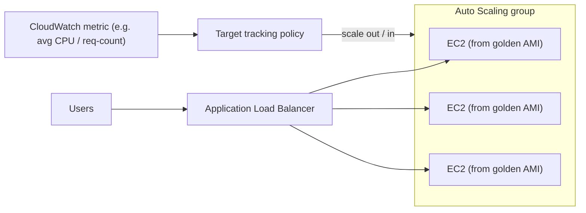
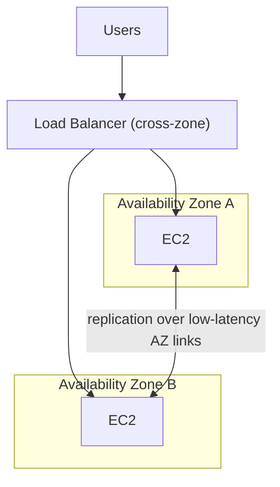
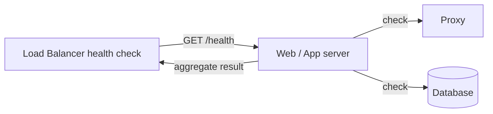

# AWS Cloud Design Patterns: Basics and High Availability

The **AWS Cloud Design Patterns (CDP)** catalog at
[clouddesignpattern.org](https://en.clouddesignpattern.org/) is a classic (~2012–2015)
collection of 46 patterns that named the reusable "moves" of early AWS architecture. This
topic covers the **foundational** patterns (Snapshot, Stamp, Scale Up, Scale Out,
On-demand Disk) and the **high-availability** patterns (Multi-Server, Multi-Datacenter,
Floating IP, Deep Health Check).

**Read every pattern through a "classic intent → modern AWS equivalent" lens.** The CDP
catalog is timeless in the *problems* it names but dated in the *mechanisms* it prescribes.
Most of these patterns describe EC2-era manual procedures (take a snapshot by hand, resize
a disk by cloning it, script an Elastic IP reassignment) that AWS managed services have
since absorbed into a checkbox or an API. For each pattern we cover: (1) the **problem**
(timeless), (2) the **classic mechanism** as the catalog framed it, (3) the **modern AWS
equivalent** (how you would actually do this today), (4) **trade-offs / when to use**, and
(5) **whether the manual pattern is still relevant** or superseded.

> [!KEY-TAKEAWAY]
> In interviews, the value of knowing CDP is *vocabulary + judgment*: you can say "that's
> just the Scale Out pattern, which today is an Auto Scaling group with target tracking,"
> and then reason about the trade-offs — rather than reinventing 2012 by hand.

**Boundary note (cross-reference, do not duplicate):** several of these patterns overlap
existing deep-dive topics in this library. Where that happens this topic gives the
*pattern-level* treatment and points you to the deep dive:

- Scale Out / Multi-Server / Floating IP → `system-design/aws-load-balancing-elb-autoscaling`
- Snapshot / On-demand Disk → `system-design/aws-storage-ebs-efs-fsx`
- Multi-Datacenter → `system-design/aws-resilience-multiregion-dr`
- Deep Health Check (Route 53 side) → `system-design/aws-dns-cdn-route53-cloudfront`
- Scale Up / cost of over/under-provisioning → `system-design/aws-cost-optimization-scaling`

---

## Snapshot Pattern

**Problem.** Your data must be safe, which means backing it up. Classic backup (tape,
disk-to-disk) has cost, capacity limits, and is hard to fully automate — swapping and
storing tapes is manual toil, and tape capacity is finite.

**Classic mechanism (as the catalog framed it).** Use the "limitless" capacity of internet
storage (S3) to take a **snapshot** — a point-in-time copy of a volume — of an EBS volume.
You can trigger it with one click in the console or via API, which means you can *script*
periodic backups. Because S3 has effectively unbounded capacity you never worry about
running out of backup space. A snapshot copies the whole volume (including the OS), so it
also gives you a reproducible data cross-section for test environments or update rehearsals.

**Modern AWS equivalent.** EBS snapshots still exist and still work exactly this way —
they are **incremental** (only changed blocks are stored after the first snapshot) and
stored durably in S3-backed storage you don't manage directly. What has changed is *how you
operate them*: instead of writing your own cron + API scripts you use:

- **Amazon Data Lifecycle Manager (DLM)** to schedule and retain EBS snapshots (and AMIs)
  by tag/policy.
- **AWS Backup** for a central, cross-service, cross-account, cross-Region backup plan
  (EBS, RDS, DynamoDB, EFS, FSx, and more) with retention, vaulting, and **Backup Vault
  Lock** (WORM/compliance) — the managed answer to "how do I automate and govern backups?"

> [!TIP]
> An EBS snapshot is **crash-consistent**, not necessarily **application-consistent**. For a
> running database, quiesce/flush (or use the DB's own snapshot mechanism, e.g. RDS
> snapshots) so you capture a consistent state, not a torn write.

**Trade-offs / when to use.** Snapshots are cheap, incremental, and the substrate for the
Stamp pattern (an AMI is built on top of snapshots) and On-demand Disk (grow a volume by
restoring a snapshot at a larger size — the classic trick). But snapshot restore is not
instant at scale (blocks are lazily hydrated from S3 on first access unless you enable
**Fast Snapshot Restore**).

**Still relevant?** Yes — the *pattern* (point-in-time volume backup to durable object
storage) is a permanent primitive. The *manual scripting* is superseded by DLM / AWS Backup.

**Deep dive:** see `system-design/aws-storage-ebs-efs-fsx`.

---

## Stamp Pattern

**Problem.** Setting up a server — installing and configuring the OS, middleware, and
application — takes real time and effort *every time*, even for virtual machines. You want
to stand up many identical, pre-configured servers quickly without repeating that setup.

**Classic mechanism.** Configure one virtual server fully, then capture it as a **machine
image**. Launch new servers *from that image* — like pressing a rubber stamp — so each new
instance boots already configured. The catalog's implementation: create an **Amazon Machine
Image (AMI)** from an EBS-backed instance and reuse it to launch identical instances.

**Modern AWS equivalent.** The "golden AMI" is still a core practice, but the modern build
pipeline is:

- **EC2 Image Builder** (or Packer) to *build, patch, test, and version* AMIs on a schedule
  as an automated pipeline — instead of hand-baking an image and forgetting how you made it.
- For containers, the same idea is a **golden container image** in **Amazon ECR**.
- The Stamp pattern is what makes **Scale Out** fast: the ASG launches from the baked AMI so
  new instances are ready in seconds, not minutes of bootstrapping.

> [!INTERVIEW]
> "Golden AMI vs bootstrap-at-launch" is a classic trade-off. A **fully baked** image (Stamp)
> boots fast and is immutable/reproducible but must be rebuilt for every change. A
> **bootstrap** approach (user-data/cloud-init pulls config at launch — the CDP *Bootstrap*
> pattern) is more flexible but slower and can drift/fail if a dependency is down. The modern
> answer is usually a **hybrid**: bake the slow-changing layers (OS, runtime, agents) into
> the AMI, inject the fast-changing config at launch.

**Trade-offs / when to use.** Baked images give immutable, reproducible, fast-launching
infrastructure — the foundation of immutable deployments. The cost is a build pipeline and
image sprawl/versioning to manage.

**Still relevant?** Yes — golden images (AMIs and container images) are standard. The manual
"snapshot a hand-configured box" approach is superseded by Image Builder/Packer pipelines.

---

## Scale Up Pattern

**Problem.** At design time you can't accurately predict how much CPU/memory a workload will
need in production. Under-provision and the server is slow or can't keep up; over-provision
and you waste money. On physical hardware, changing the spec means buying and rebuilding a
box.

**Classic mechanism.** In the cloud you can **change the virtual server's spec** (CPU,
memory) after launch. The catalog's procedure: run an EC2 instance, monitor utilization
(vmstat / CloudWatch), and if the instance type is wrong, **stop the instance, change the
instance type, and restart**. This is **vertical scaling** — a bigger (or smaller) single box.

**Modern AWS equivalent.** Changing instance type is still exactly how you scale up/down an
EC2 instance (stop → modify instance type → start; the instance must be EBS-backed). Modern
additions:

- **AWS Compute Optimizer** analyzes CloudWatch history and *recommends* right-sized instance
  types and families — you no longer eyeball vmstat.
- **Graviton (ARM) / newer generations** often give more performance per dollar for the same
  "size" — right-sizing is also *modernizing the family*, not just picking a bigger number.
- For databases, Scale Up = change the RDS/Aurora instance class; **Aurora Serverless v2**
  scales capacity (ACUs) vertically and automatically.

**Trade-offs / when to use.** Scale Up is simple (no app changes, no distributed-systems
concerns) and is the right first move for workloads that are hard to parallelize — a single
relational primary, a legacy monolith. Limits: there is a ceiling (largest instance type),
resizing EC2 requires a **stop/start = downtime**, and a single big box is a single point of
failure. Contrast with **Scale Out** (horizontal), which has no single ceiling and improves
availability.

> [!WARNING]
> Scale Up on EC2 is **not** zero-downtime — the instance stops during the type change (and
> its instance-store data is lost; EBS volumes persist). If you need to grow without downtime,
> prefer Scale Out or an immutable replacement behind a load balancer.

**Still relevant?** Yes as a *pattern* (vertical scaling), and often the pragmatic choice for
stateful single-node components. The *manual monitor-and-guess* loop is augmented by Compute
Optimizer. Deep dive on cost/right-sizing: `system-design/aws-cost-optimization-scaling`.

---

## Scale Out Pattern

**Problem.** To handle high traffic you *could* use one very high-spec server (Scale Up),
but the unit cost of high-end specs rises steeply and there's a hard ceiling — you cannot
scale a single box infinitely. Traffic can also spike over hours or days, and a fixed fleet
either wastes money at trough or falls over at peak.

**Classic mechanism.** Run **multiple identical servers in parallel behind a load balancer**
(horizontal scaling), and change the *number* of servers to match load. The catalog's
implementation combined three services: **ELB** (distribute load), **CloudWatch** (monitor a
metric like average CPU, network, sessions, or EBS latency), and **Auto Scaling** (add/remove
EC2 instances when a CloudWatch alarm fires). New instances launch from a **Stamp** AMI so
they come up ready.

**Modern AWS equivalent.** This is the canonical **Auto Scaling group (ASG)** behind an
**Application/Network Load Balancer**:

- Prefer **target-tracking scaling** ("keep average CPU at 50%" or "keep ALB
  requests-per-target at N") over hand-tuned step alarms — you set the goal, AWS manages the
  alarms.
- **Predictive scaling** pre-provisions for forecasted cyclical load; **scheduled scaling**
  (the CDP *Scheduled Scale Out* pattern) pre-scales for known events.
- Serverless takes Scale Out to its conclusion: **Lambda**, **Fargate**, and **DynamoDB
  on-demand** scale out per-request with no fleet to manage.

**Trade-offs / when to use.** Scale Out has no single-box ceiling and *improves availability*
(losing one of N instances is survivable). The requirement is that instances be **stateless**
(or externalize state to a shared store / sticky sessions) — you can't horizontally scale a
component that keeps critical state in local memory. Scale Out adds a load balancer and the
need for identical, disposable instances (Stamp).

> [!INTERVIEW]
> Scale Up vs Scale Out is the most common CDP trade-off question. Scale Up = simpler, no
> statelessness requirement, but ceiling + downtime + single point of failure. Scale Out =
> elastic, highly available, but requires stateless design and a load balancer. Real systems
> combine them: scale out the stateless web/app tier, scale up (or use managed replicas) the
> stateful data tier.

**Still relevant?** The *pattern* is foundational and current. The manual ELB+CloudWatch+ASG
wiring is superseded by target-tracking/predictive scaling and serverless.

**Deep dive:** see `system-design/aws-load-balancing-elb-autoscaling`.

---

## On-demand Disk Pattern

**Problem.** You can't forecast disk capacity accurately, so on physical hardware you
over-provision — buying a disk sized for "years out × safety margin" that sits mostly empty
but is paid for from day one. Striping for I/O performance has the same guess-and-pre-buy
problem.

**Classic mechanism.** Use **virtual disks** that provide capacity on demand. Start with a
small **EBS** volume and grow it as monitoring shows you need more. The catalog's original
resize trick (pre-elastic-volumes): **take a snapshot of the EBS volume, create a new,
larger EBS volume from that snapshot, then attach it** — capacity grown without buying
hardware up front.

**Modern AWS equivalent.** You no longer snapshot-and-recreate to grow a volume. **EBS
Elastic Volumes** let you **increase size, change volume type, and adjust IOPS/throughput on
a live, attached volume with no detach and no downtime** (you then extend the filesystem
inside the OS). Related modern moves:

- **gp3** is the modern general-purpose SSD default: you provision IOPS and throughput
  **independently of size** (gp2 tied IOPS to size), so you no longer over-provision capacity
  just to buy performance.
- For truly elastic, grow-as-you-go *shared file* storage, **Amazon EFS** and **S3** expand
  automatically with no capacity planning at all.

> [!TIP]
> Elastic Volumes have a cooldown: after modifying a volume you must wait (about 6 hours)
> before you can modify it again. Plan resize steps accordingly.

**Trade-offs / when to use.** On-demand growth eliminates up-front capacity guessing and the
cost of idle disk. For block storage attached to one instance, gp3 + Elastic Volumes is the
answer; for shared/auto-scaling storage, EFS or S3. EBS volumes can only *grow*, not shrink
online — to shrink you must migrate to a smaller volume.

**Still relevant?** The *problem and intent* are permanent; the specific snapshot-to-resize
mechanism is **superseded** by Elastic Volumes and gp3.

**Deep dive:** see `system-design/aws-storage-ebs-efs-fsx`.

---

## Multi-Server Pattern

**Problem.** A single server is a single point of failure. You improve availability at other
layers with redundancy (RAID for disks, spare network lines), and servers need the same —
but simply adding servers doesn't create redundancy by itself, and redundancy hardware (extra
boxes, load balancers) is expensive on-premises.

**Classic mechanism.** Run **multiple virtual servers in parallel behind a load balancer** so
that if one instance fails, the load balancer stops routing to it and the others carry the
traffic — **server-level redundancy**. The catalog notes AWS makes this cheap: the load
balancer (ELB) is pay-as-you-go, no appliance to buy, and the ELB **health check** removes
unhealthy instances from rotation. It also suggests replacing one high-spec box with several
lower-spec boxes for redundancy.

**Modern AWS equivalent.** Multi-Server is the redundancy half of an **ALB/NLB + Auto Scaling
group**: run ≥2 instances, let the load balancer route only to healthy targets, and let the
ASG replace a failed instance to restore the desired count. The key modern refinement:
**spread the instances across multiple Availability Zones** — which is exactly the
**Multi-Datacenter** pattern below. Multi-Server (redundancy) and Scale Out (elasticity) are
two facets of the same ALB+ASG construct.

**Trade-offs / when to use.** Redundancy requires the tier to be stateless/disposable and
adds a load balancer. Note the distinction from Scale Out: Multi-Server is about *surviving a
failure* (availability), Scale Out is about *handling more load* (elasticity) — the same
mechanism serves both.

> [!WARNING]
> Multi-Server alone (all instances in one AZ/data center) does **not** protect against a
> data-center-level failure. For that you need Multi-Datacenter (multi-AZ).

**Still relevant?** Yes — redundant instances behind a health-checked load balancer is the
baseline HA pattern. Deep dive: `system-design/aws-load-balancing-elb-autoscaling`.

---

## Multi-Datacenter Pattern

**Problem.** Multi-Server survives a *single server* failure, but not a **data-center-level**
failure — power outage, earthquake, fire, network partition. Surviving that requires multiple
physically separated data centers, which on-premises is enormously expensive (real estate,
duplicate hardware, dedicated high-speed links for data sync).

**Classic mechanism.** AWS already operates multiple physically separated data centers per
region — **Availability Zones (AZs)** — connected by high-speed dedicated links. Place your
servers (and load balancer targets) across **multiple AZs** so a whole-AZ failure leaves the
system running. The catalog's implementation: launch EC2 instances in different AZs behind the
same ELB.

**Modern AWS equivalent.** This is the **Multi-AZ** deployment that underpins virtually all
AWS HA today:

- **ALB/NLB + ASG spanning ≥2 (ideally 3) AZs** for the compute tier.
- **RDS/Aurora Multi-AZ**: a synchronous standby (or Aurora's 6 copies across 3 AZs) with
  automatic failover.
- Regional managed services (S3, DynamoDB, SQS, Lambda) are **already multi-AZ internally** —
  you get AZ resilience for free.

> [!KEY-TAKEAWAY]
> Multi-Datacenter = **Multi-AZ = high availability within a Region**. It is *not* disaster
> recovery. Surviving a whole-*Region* event (or meeting cross-region compliance) is a
> different, more expensive problem — **Multi-Region DR** with its own RTO/RPO trade-offs.

**Trade-offs / when to use.** Multi-AZ is the default for any production workload; inter-AZ
latency is low (single-digit ms) so you can replicate synchronously across AZs. It does add
**cross-AZ data-transfer cost** and requires your data tier to replicate across AZs. It does
*not* cover region-wide failures.

**Still relevant?** Yes, and mandatory for production HA. For the Region-failure case and
RTO/RPO strategy, **deep dive:** `system-design/aws-resilience-multiregion-dr`.

---

## Floating IP Pattern

**Problem.** When you patch or upgrade a server you must take it down, and downtime stops the
service. You want to swap in a replacement server **near-instantly**. DNS-based swapping works
but is bounded by the record's **TTL** — clients keep hitting the old address until the TTL
expires, so DNS is unsuited to instant cutover.

**Classic mechanism.** Keep a **stable IP address that "floats"** — reassign it from the old
server to a new one on cutover. Classically you'd keep a spare box, then move the address to
it. On AWS the address is an **Elastic IP (EIP)**, a static public IP you own: **detach the
EIP from the current EC2 instance and attach it to a new one** (often pre-launched from a
Stamp AMI) to swap the server instantly — no DNS TTL wait, and instant fall-back by
reassigning the EIP back.

**Modern AWS equivalent.** The Floating IP *problem* (a stable address decoupled from a
specific instance) is now solved more robustly by the **load-balancer indirection**:

- Put a **load balancer** in front and swap instances behind it (register/deregister
  targets) — clients hit the stable LB endpoint and never see the change. This is the
  standard modern answer and dovetails with immutable/rolling deploys.
- A **Network Load Balancer** gives you a **stable static IP per AZ** (and supports Elastic
  IPs) when clients need a fixed IP to allowlist.
- **EIP reassignment** is still used for active/standby failover of a single node (e.g. a
  self-managed NAT/appliance, or a floating "virtual IP" HA pair). AWS also offers a **BYOIP**
  and, for private failover, moving an **ENI** (elastic network interface) or a secondary
  private IP between instances.

> [!TIP]
> The deeper lesson is **indirection**: never let clients bind to a specific instance's
> identity. Whether the stable handle is an EIP, an ENI, or a load-balancer DNS name, the
> instance behind it should be replaceable. Load balancers make this the default.

**Trade-offs / when to use.** EIP-floating is fast and TTL-free but is a single-address,
single-target mechanism (one instance at a time) and needs a script/health-check to trigger
the move. Load balancers generalize it to N healthy targets and handle the health-checking for
you — prefer the LB unless you specifically need a single fixed IP moved between two nodes.

**Still relevant?** Partially. For general web-tier swaps it is **superseded by load
balancers**. EIP/ENI floating remains relevant for **single-appliance active/standby failover**
and fixed-IP requirements. Deep dive: `system-design/aws-load-balancing-elb-autoscaling`.

---

## Deep Health Check Pattern

**Problem.** A load balancer's default health check confirms the *front* server responds
(e.g. the web server's port is open), but it **cannot see the back-end dependencies** behind
it — the proxy, the app server, the database. A web server can answer "200 OK" on a shallow
check while the database it depends on is dead, so the LB keeps routing traffic to an instance
that can't actually serve requests.

**Classic mechanism.** Point the load balancer's health check at a **dynamic health endpoint**
(a program — PHP, servlet, etc.) that *exercises the dependency chain*: the endpoint reaches
through to the app server and database and returns success only if the whole chain is healthy.
Now the LB's decision reflects the *system's* health, not just the front door.

**Modern AWS equivalent.** The pattern is unchanged and is standard practice: expose a
**deep `/health` (or `/ready`) endpoint** and target it with:

- **ALB/NLB target-group health checks** (and ECS/EKS container health checks / Kubernetes
  **readiness probes**) so unhealthy targets are pulled from rotation and, in an ASG, replaced.
- **Route 53 health checks** for DNS-level failover, including **calculated health checks**
  (combine child checks with AND/OR/threshold logic) and CloudWatch-metric-based checks — the
  DNS-tier analog of a deep check.

> [!WARNING]
> Deep health checks have a real failure mode the catalog also warns about: **cascading
> false failures**. If the shared database blips, *every* instance's deep check fails at once,
> the LB marks the **entire fleet** unhealthy, and you turn a slow dependency into a total
> outage. Mitigations: distinguish **liveness** (is this instance itself up?) from
> **readiness/deep** (are dependencies reachable?); add dependency timeouts and a fail-open or
> degraded mode; don't let a non-critical dependency fail the whole check.

**Trade-offs / when to use.** A shallow check catches "this instance is dead"; a deep check
also catches "this instance can't do useful work because a dependency is down." Use deep
checks where routing to a dependency-broken instance is worse than reducing capacity — but
scope them carefully to avoid fleet-wide false negatives, and separate liveness from readiness.

**Still relevant?** Very — deep/readiness health endpoints are current best practice across
ELB, ECS/EKS, and Route 53. The only thing "classic" is the PHP/servlet example.

**Deep dive (Route 53 failover):** see `system-design/aws-dns-cdn-route53-cloudfront`.

---

## Common interview follow-ups

- **"Scale Up or Scale Out?"** Scale Up (vertical, change instance type) is simpler and needed
  for hard-to-parallelize stateful nodes but has a ceiling, causes stop/start downtime on EC2,
  and stays a single point of failure. Scale Out (horizontal, ASG behind an LB) is elastic and
  improves availability but requires stateless instances. Real systems scale out the stateless
  tier and scale up / use managed replicas for the data tier.
- **"How does modern AWS make Snapshot/Stamp/On-demand Disk 'just a feature'?"** Snapshot →
  DLM / AWS Backup schedules and governs it; Stamp → EC2 Image Builder pipelines the golden
  AMI; On-demand Disk → Elastic Volumes + gp3 resize live volumes without the snapshot-recreate
  dance.
- **"Multi-Datacenter vs Multi-Region?"** Multi-Datacenter = Multi-AZ = HA within a Region
  (survives an AZ loss, low-latency synchronous replication). Multi-Region = DR (survives a
  Region loss, meets compliance, global latency) with harder RTO/RPO and cost trade-offs.
- **"Why not just use DNS to swap servers (Floating IP)?"** DNS cutover is bounded by TTL and
  client caching; an EIP/ENI reassign or a load balancer swaps instantly. Prefer a load
  balancer (N targets, built-in health checks); use EIP/ENI floating for single-node
  active/standby.
- **"What's the danger of a Deep Health Check?"** A shared-dependency blip can fail every
  instance's deep check simultaneously and take the whole fleet out of rotation. Separate
  liveness from readiness and scope the deep check to truly required dependencies.
- **"Which patterns are fully superseded?"** On-demand Disk's snapshot-to-resize trick
  (→ Elastic Volumes) and web-tier Floating IP (→ load balancers) are the most superseded;
  Snapshot, Stamp, Scale Up/Out, Multi-Server, Multi-Datacenter, and Deep Health Check remain
  living patterns, now delivered via managed features.

## References

- AWS Cloud Design Patterns catalog — clouddesignpattern.org: Snapshot, Stamp, Scale Up,
  Scale Out, Ondemand Disk, Multi-Server, Multi-Datacenter, Floating IP, and Deep Health Check
  pattern pages (problem + classic solution).
- AWS docs — Amazon EBS snapshots and **Elastic Volumes**; **gp3** volume type; Amazon Data
  Lifecycle Manager; **AWS Backup** and Backup Vault Lock.
- AWS docs — **EC2 Image Builder** and AMI lifecycle; changing an EC2 **instance type**;
  **AWS Compute Optimizer**.
- AWS docs — **EC2 Auto Scaling** (target tracking, predictive, scheduled scaling); Elastic
  Load Balancing target-group **health checks**.
- AWS docs — **Elastic IP addresses**, **Network Load Balancer** static IPs, moving **ENIs**.
- AWS docs — **Availability Zones / Multi-AZ**, RDS/Aurora Multi-AZ; **Amazon Route 53**
  health checks and **calculated health checks**.
