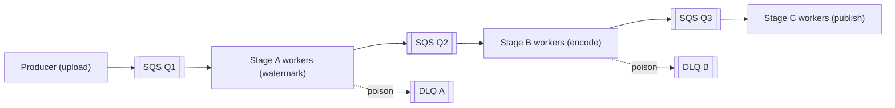
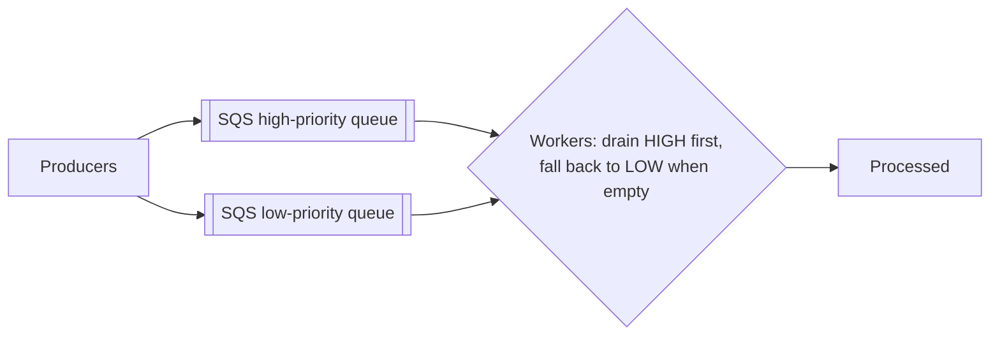
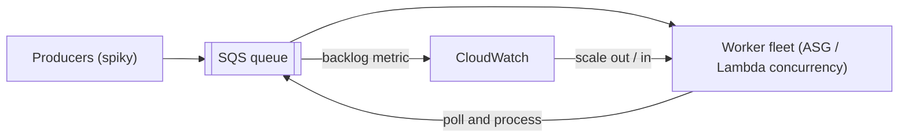
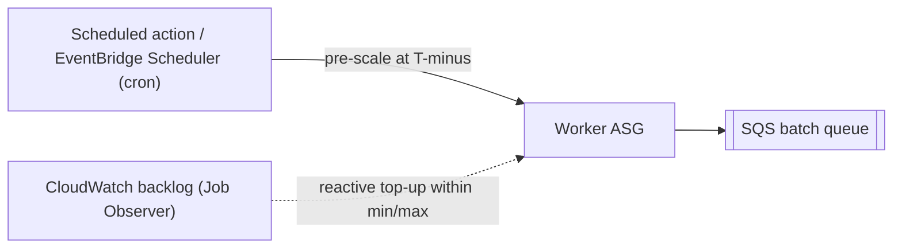

# AWS Cloud Design Patterns: Batch Processing and Asynchronous Workflows

This topic covers the **batch and asynchronous-processing patterns** from the classic
[AWS Cloud Design Patterns (CDP) catalog](https://en.clouddesignpattern.org/) — a ~2012-2015
collection of 46 EC2-era patterns. These four patterns are about **decoupling producers from
workers with queues, prioritizing work, scaling a worker fleet to the backlog, and pre-scaling
for known windows.**

**How to read this topic — "classic intent -> modern AWS equivalent".** Each pattern is taught in
four beats: (1) the **problem** it solves (timeless), (2) the **classic mechanism** the catalog
described (usually SQS polled by EC2 instances with hand-rolled CloudWatch + Auto Scaling glue),
(3) the **modern AWS equivalent** — how you would actually build it today with managed services,
and (4) **when (if ever) the classic approach still applies.** Do **not** take the catalog's
EC2-centric mechanics at face value; managed services (Lambda event-source mapping, ASG target
tracking with metric math, EventBridge Scheduler) have absorbed most of the manual glue.

**Boundary note (cross-reference, don't duplicate).** The deep mechanics of SQS/SNS/EventBridge,
Lambda/Step Functions, and Auto Scaling live in dedicated topics. This topic teaches the
**pattern vocabulary and the modern mapping**, and points you to the deep dives:
- Queue/topic/bus semantics, FIFO, DLQs -> **system-design/aws-messaging-sqs-sns-eventbridge**
- Lambda event-source mapping, Step Functions orchestration -> **system-design/aws-serverless-lambda-stepfunctions**
- ELB + Auto Scaling policies, target tracking -> **system-design/aws-load-balancing-elb-autoscaling**
- Cost/right-sizing of worker fleets -> **system-design/aws-cost-optimization-scaling**
- Async-messaging fundamentals (queue-based load leveling, competing consumers) -> **system-design/message-queues-and-async**

A quick shared vocabulary used throughout:

- **Queue-based load leveling** — a queue absorbs a spiky producer rate so a fixed/slow-scaling
  worker fleet drains it at a steady rate; the queue is the shock absorber.
- **Competing consumers** — many identical workers poll one queue; each message is handled by
  exactly one worker, and adding workers increases throughput.
- **Visibility timeout** — when a worker receives an SQS message it becomes *invisible* to others
  for a window (default 30s, max 12h). The worker must `DeleteMessage` before the window expires;
  otherwise the message reappears and is redelivered (at-least-once delivery).
- **Idempotency** — because delivery is at-least-once and workers can die mid-task, processing the
  *same message twice must be safe*. This is a non-negotiable requirement for every pattern here.
- **Dead-letter queue (DLQ)** — a side queue that captures messages that failed `maxReceiveCount`
  times, so a "poison" message doesn't loop forever and stall the pipeline.

---

## Queuing Chain

**Problem.** A batch job is really a *pipeline of stages* — e.g. upload -> watermark -> encode ->
thumbnail -> publish. If you run all stages in one process (or call the next stage synchronously),
one slow or failing stage stalls the whole job, a crash loses in-flight work, and you cannot scale
stages independently (encoding is CPU-heavy; publishing is I/O-light). You need the stages
**loosely coupled** so each can fail, retry, and scale on its own.

**Classic mechanism (as the catalog framed it).** Put an **SQS queue between every pair of
stages**. Each stage is a fleet of EC2 worker instances that *polls its input queue*, does its unit
of work, and *enqueues the result to the next stage's queue*. The queues form a **chain**:
`Q1 -> [workers A] -> Q2 -> [workers B] -> Q3 -> [workers C]`. Because a worker only deletes a
message after it finishes and enqueues downstream, a crash mid-task simply lets the message
reappear (visibility timeout) and be retried — **no work is lost, and stages are decoupled in time
and load.** The catalog highlights this as the way to build asynchronous, fault-tolerant batch
processing on AWS.

**Modern AWS equivalent.** The chain-of-queues idea is exactly right and still current — you just
stop hand-managing pollers:
- **SQS between stages + Lambda event-source mapping** as the workers: Lambda polls each queue for
  you, scales concurrency with the backlog, and on success the batch is auto-deleted. Each stage's
  Lambda enqueues to the next stage's queue (or an SNS topic / EventBridge bus for fan-out).
- For **CPU-heavy or long stages**, back the queue with **ECS/Fargate** workers (or EC2 ASG) that
  poll SQS — same chain, containerized.
- When the "chain" is really an **orchestrated workflow with branching, retries, and human steps**,
  reach for **AWS Step Functions** instead of wiring queues by hand: it gives you explicit state,
  per-step retry/catch, and visibility. Queuing Chain = *choreography* (each stage knows only its
  in/out queue); Step Functions = *orchestration* (a central state machine drives the stages).
- Attach a **DLQ (with `maxReceiveCount`)** to every stage so poison messages don't loop.

**Trade-offs / when to use.** Choreographed queue chains give maximum decoupling and independent
scaling per stage, but no single place shows end-to-end job status and ordering across stages is
best-effort (standard SQS). Orchestration (Step Functions) gives visibility and control at the cost
of a central coordinator. Use the chain when stages are independent and high-throughput; use Step
Functions when you need auditable end-to-end state or complex branching.

**Still relevant when …** always — this is the canonical async-pipeline pattern. Only the *worker
runtime* modernizes (Lambda/Fargate replace hand-rolled EC2 pollers).

*Deep dive: see system-design/aws-messaging-sqs-sns-eventbridge and
system-design/aws-serverless-lambda-stepfunctions.*

---

## Priority Queue

**Problem.** Not all work is equal. A premium customer's export, a paid-tier transcode, or an urgent
retry must **jump ahead of** bulk/free-tier work, even when the backlog is huge. If everything shares
one FIFO-ish queue, high-priority jobs wait behind thousands of low-priority ones (head-of-line
blocking).

**Classic mechanism (as the catalog framed it).** Use **multiple SQS queues, one per priority
level** (e.g. `high`, `low`). Workers **poll the high-priority queue first** and only fall back to
the low-priority queue when high is empty (or poll high far more often — *weighted polling*). To
*change* a job's priority, you move/re-enqueue its message to a different queue. The catalog frames
priority as a **routing + polling-order** decision across separate queues, not a property inside one
queue.

**Modern AWS equivalent.** Same shape, still the recommended approach:
- **Separate SQS queues per priority** with workers (Lambda event-source mappings or ECS pollers)
  that weight the high queue. With Lambda you attach **one event-source mapping per queue** and can
  give the high-priority mapping more reserved/available concurrency so it drains faster.
- **SQS FIFO** gives *ordering and exactly-once processing within a message group*, but **FIFO does
  not give priority** — a FIFO queue still delivers in arrival order, so it is not a substitute for
  separate priority queues. This is a common trap.
- For rich routing ("route this event to the urgent lane based on tier=premium"),
  **EventBridge rules** or **SNS message-filtering** can fan a message to the correct priority queue
  by attribute.
- Cap the **high queue's worker share** so a flood of high-priority work can't fully starve the low
  queue (fairness), and keep a **DLQ per queue**.

**Trade-offs / when to use.** Why not one queue with a "priority" field? SQS has no server-side
priority ordering — you'd have to receive, inspect, and re-hide low-priority messages, which wastes
receives and burns the in-flight limit. Separate queues make priority a cheap poll-order decision.
The cost is more queues to operate and a risk of **starving** the low queue if you always drain high
first — mitigate with weighted polling (e.g. 4:1) rather than strict high-first.

**Still relevant when …** always, for multi-tier or urgency-tiered workloads. The modern twist is
just the worker runtime and using EventBridge/SNS filtering for the routing step.

*Deep dive: see system-design/aws-messaging-sqs-sns-eventbridge.*

---

## Job Observer

**Problem.** A worker fleet sized for *average* load either wastes money at night or falls
catastrophically behind during a spike — the backlog grows unbounded and latency explodes. You need
the **number of workers to track the amount of pending work**, automatically, without a human
watching a dashboard.

**Classic mechanism (as the catalog framed it).** This is the **queue-based-load-leveling +
auto-scaling** pattern. A **CloudWatch alarm watches the SQS queue depth**
(`ApproximateNumberOfMessages` / `ApproximateNumberOfMessagesVisible`); when the backlog crosses a
threshold, it triggers an **Auto Scaling** action that adds EC2 *batch worker* instances; when the
queue drains, it scales them back in. The queue *levels* the spiky producer load and the "observer"
(CloudWatch) *observes the backlog* and sizes the fleet to it. The producer and consumer are fully
decoupled: producers just enqueue, and the fleet elastically matches demand.

**Modern AWS equivalent.**
- **The right metric is backlog *per instance*, not raw queue depth.** AWS explicitly warns that
  `ApproximateNumberOfMessagesVisible` alone is a poor target-tracking metric because it doesn't
  change proportionally to fleet size. The recommended approach: compute
  **`backlog per instance = ApproximateNumberOfMessages / InService instance count`** and use it as
  a **target-tracking** metric, with the **target = acceptable latency / average per-message
  processing time**. (Example from AWS: 1500 messages, 10 instances, 0.1s/msg, 10s acceptable
  latency -> target backlog/instance = 100; current is 150, so scale out.) Modern setups use
  **CloudWatch metric math** so you no longer publish a custom metric yourself.
- **Serverless version:** an **SQS + Lambda event-source mapping** *is* the Job Observer — Lambda
  automatically ramps concurrency up with the backlog and back down as it drains, no ASG or alarm to
  wire. **SNS/EventBridge -> Lambda** works similarly for event fan-out.
- **Scale-in safety:** protect long-running workers with **instance scale-in protection** (or
  Lambda's in-flight handling) so scale-in doesn't kill a worker mid-message. Any interrupted
  message returns to the queue after its visibility timeout and is retried — which is exactly why
  **idempotency + DLQ** are mandatory here.

**Trade-offs / when to use.** Scaling on the backlog reacts to *actual demand* rather than a guessed
schedule, and the queue guarantees no work is dropped during the scale-out lag. The costs: a
scale-out delay (instances take minutes to warm; Lambda cold-starts), and the need to pick the right
metric/target or you'll oscillate. Use Job Observer for **unpredictable, bursty** batch demand.

**Still relevant when …** always — this is the backbone of elastic batch processing. Prefer the
serverless SQS+Lambda form for variable/bursty work; use ASG target-tracking-on-backlog for
container/EC2 fleets and heavy per-message compute.

*Deep dive: see system-design/aws-load-balancing-elb-autoscaling and
system-design/aws-cost-optimization-scaling.*

---

## Scheduled Autoscaling

*(Catalog name: **Scheduled Scale Out Pattern**.)*

**Problem.** Some load spikes are **predictable by the clock, not by a metric**: a nightly ETL run,
a 9 a.m. business-hours ramp, month-end billing, a televised event, a Monday-morning report
generation. Reactive scaling (Job Observer) only *starts* adding capacity *after* the backlog
appears, so the first wave of work suffers cold, under-provisioned latency. You want capacity to be
**already in place before** the known window begins.

**Classic mechanism (as the catalog framed it).** **Pre-schedule the scale-out (and later
scale-in)** for the known time. In classic Auto Scaling terms, you create **scheduled actions** that
set the group's desired/min/max capacity at a specific time or on a recurring **cron** schedule —
e.g. bump desired capacity up at 08:30 before the morning rush and back down in the evening. The
fleet is warm and ready when the deterministic load arrives.

**Modern AWS equivalent.**
- **EC2 Auto Scaling scheduled actions**: set desired/min/max on a one-time or recurring **cron**
  expression, with a **time zone** that auto-adjusts for DST (e.g. `America/New_York`). Limits worth
  knowing: up to **125 scheduled actions per ASG**, unique names and unique start times per group,
  and an action may run **up to ~2 minutes late** — so schedule a little *before* the window.
- **EventBridge Scheduler** is the modern, general-purpose scheduler (one-time or recurring cron/rate
  with time zones and flexible time windows) for triggering *any* target — e.g. start an ECS
  service's desired count, invoke a Lambda that raises capacity, or kick off a Step Functions batch.
  It supersedes CloudWatch Events scheduled rules for new work.
- **Application Auto Scaling scheduled actions** do the same for ECS services, DynamoDB, etc.
- **Best practice: combine scheduled + dynamic.** Use the scheduled action to set a *higher
  min/desired* just before the window (so capacity is warm), and let **Job Observer / target
  tracking** react to the *actual* backlog on top of that, within the new min/max. Scheduled scaling
  handles the *predictable* baseline; dynamic scaling handles the *variance*.

**Trade-offs / when to use.** Scheduled scaling eliminates the reactive cold-start lag for
*known* events and is dead-simple, but it is **blind to reality** — if the spike comes early, late,
or is bigger/smaller than expected, a pure schedule over- or under-provisions. That's why you layer
dynamic scaling on top. Use scheduled scaling only when the timing is genuinely predictable.

**Still relevant when …** always, for clock-driven load (batch windows, business hours, known
events). Modern form: ASG/Application Auto Scaling **scheduled actions** or **EventBridge Scheduler**,
paired with target-tracking dynamic scaling as the safety net.

*Deep dive: see system-design/aws-load-balancing-elb-autoscaling and
system-design/aws-cost-optimization-scaling.*

---

## Common interview follow-ups

- **"Design an image/video processing backend that survives spikes and worker crashes."** Expect a
  **Queuing Chain** (SQS between stages) + **Job Observer** (scale workers on backlog-per-instance or
  SQS+Lambda) + idempotent workers + per-stage DLQs. Mention Step Functions if end-to-end visibility
  or branching is required.
- **"Why not one big queue with a priority field?"** SQS has no server-side priority; you'd waste
  receives inspecting and re-hiding low-priority messages. Use **separate queues per priority** with
  weighted polling — and note **FIFO gives ordering, not priority**.
- **"Your consumer occasionally processes the same message twice — why, and how do you fix it?"**
  At-least-once delivery + visibility timeout expiry (slow worker, crash, or scale-in). Fix with
  **idempotency** (dedup key / conditional write), right-sized visibility timeout, heartbeat
  extension via `ChangeMessageVisibility`, and scale-in protection.
- **"What metric should drive worker autoscaling?"** **Backlog per instance** with target =
  acceptable-latency / per-message-processing-time — not raw queue depth (doesn't scale
  proportionally to fleet). Use metric math to avoid publishing a custom metric.
- **"Scheduled vs dynamic scaling — when each, and can you combine them?"** Scheduled for
  clock-predictable load (batch windows); dynamic (Job Observer) for unpredictable bursts; **combine**
  — schedule the baseline min/desired, let target tracking handle variance within min/max.
- **"A poison message keeps failing and stalls your queue — what happens and how do you handle it?"**
  It's redelivered up to `maxReceiveCount`, then routed to the **DLQ** for inspection; without a DLQ
  it loops forever consuming worker capacity.
- **"How do you keep a scale-in event from killing a 20-minute job mid-flight?"** Instance scale-in
  protection (EC2) / long visibility timeout + the message returning to the queue on interruption;
  the job is retried elsewhere — which only works because workers are idempotent.

## References

- AWS Cloud Design Patterns catalog (clouddesignpattern.org): Queuing Chain, Priority Queue,
  Job Observer, and Scheduled Scale Out patterns — https://en.clouddesignpattern.org/
- Amazon EC2 Auto Scaling User Guide — *Scaling policy based on Amazon SQS* (backlog-per-instance
  target tracking, the messages/instances example, scale-in protection):
  https://docs.aws.amazon.com/autoscaling/ec2/userguide/as-using-sqs-queue.html
- Amazon EC2 Auto Scaling User Guide — *Scheduled scaling* (scheduled actions, cron, time zone/DST,
  125-actions limit, ~2-minute execution delay):
  https://docs.aws.amazon.com/autoscaling/ec2/userguide/ec2-auto-scaling-scheduled-scaling.html
- Amazon SQS Developer Guide — *Visibility timeout* (default 30s, 12h max, at-least-once delivery,
  `ChangeMessageVisibility`, in-flight limits, DLQ best practice):
  https://docs.aws.amazon.com/AWSSimpleQueueService/latest/SQSDeveloperGuide/sqs-visibility-timeout.html
- Amazon SQS Developer Guide — *Dead-letter queues* and *FIFO queues*:
  https://docs.aws.amazon.com/AWSSimpleQueueService/latest/SQSDeveloperGuide/
- AWS Lambda Developer Guide — *Using Lambda with Amazon SQS* (event-source mapping, concurrency
  scaling with backlog): https://docs.aws.amazon.com/lambda/latest/dg/with-sqs.html
- Amazon EventBridge Scheduler User Guide — recurring/one-time schedules, cron/rate, time zones:
  https://docs.aws.amazon.com/scheduler/latest/UserGuide/what-is-scheduler.html
