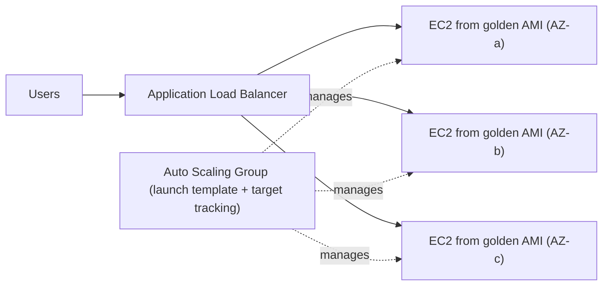
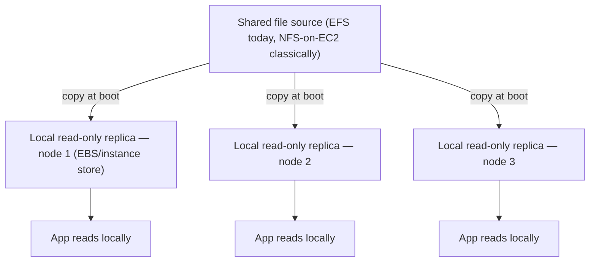
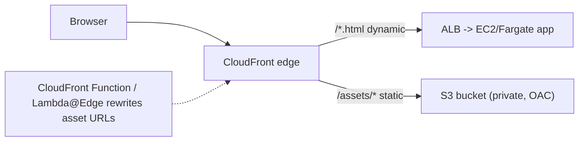
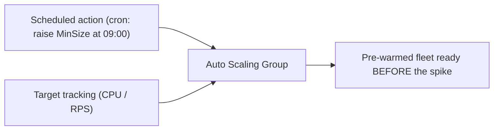

# AWS Cloud Design Patterns: Dynamic Content and Scaling

This topic covers the "Processing Dynamic Content" patterns from the classic **AWS Cloud
Design Patterns (CDP)** catalog at [clouddesignpattern.org](https://en.clouddesignpattern.org/)
— a ~2012–2015 collection written for the EC2-era AWS. The problems these patterns solve
(serving dynamic content behind a load balancer, sharing files across a fleet, keeping servers
stateless, offloading static assets, scaling ahead of a known spike) are **timeless**. The
*mechanisms* the catalog prescribes are mostly **manual EC2 workarounds that modern managed
services have since absorbed.**

So teach each pattern in four beats:

1. **Problem** — the durable need (this is what an interviewer is really testing).
2. **Classic mechanism** — how the CDP catalog framed the solution (rsync, NFS on EC2, Varnish
   on EC2, hand-edited URLs, `--min-size` cron tweaks).
3. **Modern AWS equivalent** — how you would actually build it today, named concretely
   (EFS, S3 + CloudFront + OAC, ElastiCache / DynamoDB, ASG scheduled scaling, CloudFront
   Functions).
4. **Still relevant when …** — the narrow cases where the classic approach earns its keep, or
   "superseded — use X."

> [!INTERVIEW]
> Interviewers rarely want you to *build* Clone Server or NFS-on-EC2 today. They want to hear
> the pattern name, the problem, and "the managed service that ate it." The high-value skill is
> the classic→modern mapping, not the 2013 procedure.

**Boundary note (cross-reference, do not re-derive):** several of these patterns overlap deep
AWS dives elsewhere in this library. This topic stays at *pattern altitude* — vocabulary,
intent, and the modern one-liner — and points you at the deep dive:

- Auto Scaling internals → `system-design/aws-load-balancing-elb-autoscaling`
- Shared/block file storage (EFS, EBS, FSx) → `system-design/aws-storage-ebs-efs-fsx`
- Object storage (S3) → `system-design/aws-storage-s3-deep-dive`
- Edge / CDN (CloudFront, Route 53) → `system-design/aws-dns-cdn-route53-cloudfront`
- Session / caching stores → `system-design/aws-caching-elasticache-dax`
- DynamoDB as a session store → `system-design/aws-dynamodb-deep-dive`

## Clone Server Pattern

**Problem.** A system that grew from a single server was never designed for horizontal
distribution. When load rises, you need to add servers — but a hand-built "pet" server is not
reproducible, so scaling out is slow and error-prone.

**Classic mechanism (CDP).** Take an existing running server as the *master*, bake a **machine
image (AMI)** from it with content-sync and DB-connection settings already adjusted, and put an
**ELB** in front. To scale out, launch EC2 instances from that "clone" AMI and register them
with the ELB. Keep the clones' content in step with the master using periodic **rsync**. Result:
load distribution "with essentially no changes to the existing system."

**Modern AWS equivalent.** This is the ancestor of the **immutable golden-AMI + Auto Scaling
Group** workflow. You bake an AMI (EC2 Image Builder / Packer), define a **launch template**,
and let an **Auto Scaling Group** launch identical instances behind an **Application/Network
Load Balancer** with target-tracking or step scaling. Config that used to be rsync'd is instead
pulled at boot from **user-data / cloud-init**, SSM Parameter Store, or a shared file system
(EFS) — so instances are cattle, not clones of a pet.

**Trade-offs / when to use.** The catalog's own biggest caution: **the master EC2 is a single
point of failure (SPOF)**, and you must *not* run a database on the master (clones would each
carry a stale copy). rsync gives eventual, delayed consistency between master and clones.

**Still relevant when …** the underlying idea — "capture a known-good server as an image and
replicate it" — is *more* relevant than ever; only the mechanics changed. The literal
master+rsync topology is **superseded** by immutable ASGs. Deep dive: see
`system-design/aws-load-balancing-elb-autoscaling`.

## NFS Sharing Pattern

**Problem.** Once you scale out across many servers, they must serve **identical, frequently
updated content**. One-way periodic sync (master→replica) has a time lag and can't handle writes
that originate on a replica — how do those propagate back?

**Classic mechanism (CDP).** Designate one EC2 as an **NFS server** holding the shared content;
every scale-out node mounts it as an **NFS client**. Any server can read *and write* the shared
tree, and all servers see updates in real time. Simpler than rsync because "sharing is just a
mount."

**Modern AWS equivalent.** **Amazon EFS** — a fully managed, elastic **NFS (v4.1)** file system
that mounts on many instances/containers/Lambda across AZs simultaneously, with no NFS server to
run or patch. EFS removes the catalog's own cautions in one stroke: it is multi-AZ (no SPOF),
autoscales capacity, and offers throughput/performance modes. For Windows/SMB workloads the
equivalent is **Amazon FSx** (FSx for Windows File Server / FSx for NetApp ONTAP).

**Trade-offs / when to use.** CDP's cautions: the self-managed NFS server is a **SPOF** and its
**access performance** degrades as the fleet grows (they suggest GlusterFS as a fix). Use shared
NFS for content that many servers must write and see immediately — user uploads, shared config,
a common web root. It is *not* the right tool for hot per-request data (that's a cache/DB).

**Still relevant when …** you need POSIX shared file semantics across a fleet — but do it with
**EFS**, not a hand-run NFS box. Self-managed NFS on EC2 is **superseded** except for niche OS/
protocol needs. Deep dive: see `system-design/aws-storage-ebs-efs-fsx`.

## NFS Replica Pattern

**Problem.** When *many* servers share files over a single NFS server and access frequency is
high, the NFS hop becomes a **read bottleneck** and a shared failure point.

**Classic mechanism (CDP).** Give each server its **own local virtual disk (EBS)** and **copy
the NFS server's shared files onto it** at startup. Each node then reads from its *local
read-only replica* instead of hitting NFS on every request — faster reads, and if the NFS server
dies the content still exists locally on every EBS volume, so NFS is no longer a SPOF. (The
catalog notes you can even use ephemeral **instance store** instead of EBS to cut cost/latency.)
This is a read-scaling optimization *layered on top of* NFS Sharing.

**Modern AWS equivalent.** You rarely hand-roll this today:
- For read-heavy shared files, **EFS** already fans reads across a distributed backend; add
  **CloudFront** in front for cached edge reads, or use **EFS + local caching** patterns.
- The general principle — "**replicate read data close to each reader**" — is realized by
  **read replicas** (RDS/Aurora), **DynamoDB** replicas/DAX, **ElastiCache** read replicas, and
  **CloudFront** edge caches. NFS-Replica is the *file-system-level* instance of the universal
  read-replica idea.

**Trade-offs / when to use.** The catalog's key caution: **updates are not reflected
automatically** — a change on the source must be re-synced (rsync) to each replica, so replicas
are stale between syncs. Great for read-mostly assets, wrong for anything write-hot.

**Still relevant when …** you need the absolute lowest read latency for immutable/read-mostly
files and can tolerate staleness — bake the files into the AMI or copy to local NVMe at boot.
Otherwise **superseded** by EFS + CloudFront and managed read replicas. Deep dive: see
`system-design/aws-storage-ebs-efs-fsx` and `system-design/aws-caching-elasticache-dax`.

## State Sharing Pattern

**Problem.** Dynamic pages use per-user **state (HTTP session)**. If each web/app server keeps
session in local memory, then behind a load balancer a user's session is lost when that server
fails or is scaled in — and requests may land on a server that has never seen the session.

**Classic mechanism (CDP).** **Externalize the state** into a durable, shared data store keyed
by session/user ID; servers become **stateless** and any node can serve any request by reading
the shared store. The catalog names **ElastiCache, SimpleDB, and DynamoDB** as candidate stores.

**Modern AWS equivalent.** Same idea, updated stores:
- **ElastiCache (Redis / Valkey or Memcached)** — the standard fast session store; Redis adds
  persistence, replication, and TTL-based expiry.
- **DynamoDB** — serverless, effectively unbounded throughput, with **TTL** for automatic session
  expiry; the catalog's own advice ("choose DynamoDB when the store must not become a
  bottleneck") still holds.
- **SimpleDB is deprecated/closed to new customers** — use DynamoDB instead.
- Even better where possible: **stateless JWT / signed cookies** so there is no server-side
  session to share at all; or ALB **sticky sessions** as a weaker stopgap (doesn't survive node
  loss).

> [!KEY-TAKEAWAY]
> "Make servers stateless by pushing session into a shared store" is the load-bearing idea
> behind horizontal scalability, blue/green deploys, and spot-instance fleets. Sticky sessions
> are a crutch: they re-introduce the SPOF that State Sharing removes.

**Trade-offs / when to use.** The catalog's caution is timeless: concentrating all session
access on one store makes **that store the bottleneck / SPOF**, so it must be replicated and
sized for peak. Externalized state adds a network hop per lookup (mitigated by co-locating the
cache and short TTLs).

**Still relevant when …** always — this is core to any autoscaled tier. Cross-refs: session
identity in multi-tenant apps → `system-design/aws-saas-tenant-identity-and-routing`; store
internals → `system-design/aws-caching-elasticache-dax` and `system-design/aws-dynamodb-deep-dive`.

## URL Rewriting Pattern

**Problem.** Most requests to a dynamic web tier are actually for **static assets**
(JS/CSS/images). Serving them from the app servers wastes compute and forces you to scale the
expensive tier for cheap traffic.

**Classic mechanism (CDP).** **Offload static content to Internet storage** and **rewrite the
asset URLs** in the delivered HTML to point at that storage. You don't have to hand-edit files —
use a web-server **filter module (Apache mod / Nginx)** to rewrite `/<script>/<link>` URLs
at delivery time so they resolve to the storage/CDN host.

**Modern AWS equivalent.** Put static assets in **S3** and serve them through **CloudFront**
with **Origin Access Control (OAC)** so the bucket stays private. Rewriting the URLs happens in
modern edge compute: **CloudFront Functions** (lightweight, viewer request/response) or
**Lambda@Edge** (heavier), instead of an Apache/Nginx filter on your origin. Frontend build
tools also emit CDN-hosted, content-hashed asset URLs directly. Net effect identical to the
catalog: the dynamic tier only generates HTML; a **cache-friendly, globally distributed** layer
serves the bytes.

**Trade-offs / when to use.** Cheaper and more robust under load (static traffic never touches
EC2), plus global latency wins via CloudFront. Cache invalidation and URL/versioning discipline
(content hashing) are the ongoing costs. Distinguish from the next two patterns: URL Rewriting
changes the *content/URLs*; **Rewrite Proxy** does the rewrite in a *proxy* so the app is
untouched; **Cache Proxy** caches responses rather than redirecting to storage.

**Still relevant when …** always relevant as intent; realize it with **S3 + CloudFront + OAC**
and edge functions rather than origin filter modules. Deep dive: see
`system-design/aws-storage-s3-deep-dive` and `system-design/aws-dns-cdn-route53-cloudfront`.

## Rewrite Proxy Pattern

**Problem.** URL Rewriting is great, but it still forces changes to the *existing system* —
editing content or configuring web-server filters. What if you can't touch the app at all
(legacy, third-party, or frozen codebase)?

**Classic mechanism (CDP).** Insert a **reverse proxy that rewrites URLs** *in front of* the
unmodified app. Run **Nginx/Apache on EC2** between the **ELB** and the origin (and the S3
static store); the proxy rewrites asset URLs in the passing responses so clients fetch statics
from S3/CDN — **no change to the app**. Apply Auto Scaling to the proxy tier as needed.

**Modern AWS equivalent.** The "rewrite responses without touching the origin" job now lives at
the edge: **CloudFront + CloudFront Functions / Lambda@Edge** rewrite viewer/origin
requests/responses, or **API Gateway / an ALB with rules**, or a managed proxy layer. You get
the same "don't modify the app" property without running and scaling your own Nginx fleet.

**Trade-offs / when to use.** CDP's own cautions are the crux for interviews: the proxy must be
made **redundant (or it is a SPOF)**, and inserting a proxy **between the ELB and the app breaks
the direct ELB↔app wiring** — the web/app instances sit *behind* the proxy, so ASG add/remove of
app nodes no longer registers directly with the load balancer. That coupling is exactly why the
managed-edge approach is preferred today.

**Still relevant when …** you truly cannot modify the origin and need response rewriting — but
do it with **CloudFront Functions/Lambda@Edge**, not a self-run proxy fleet. Distinguish from
**Cache Proxy**: Rewrite Proxy *redirects* asset requests elsewhere; Cache Proxy *stores and
serves* copies of responses. Deep dive: see `system-design/aws-dns-cdn-route53-cloudfront`.

## Cache Proxy Pattern

**Problem.** Scaling by adding web/app servers **multiplies cost**. On a tight budget you want
higher throughput *without* growing the expensive dynamic tier.

**Classic mechanism (CDP).** Put a **cache server upstream of the web/app tier** that stores
static content (and dynamic content that "doesn't change much") and serves it from its
high-performance cache until it expires. The catalog builds this with **Varnish (or similar) on
an EC2 instance** in front of the app. You control what's cached via HTTP headers, URL, cookies,
etc. Especially valuable for **cacheable dynamic content**, cutting generation load.

**Modern AWS equivalent.** **CloudFront** *is* the managed cache proxy — a globally distributed
reverse-cache in front of your origin, with fine-grained cache keys (headers/query/cookies via
**cache policies**) and TTLs, doing exactly what Varnish-on-EC2 did but managed and at the edge.
For an in-region/internal cache layer you'd use **ElastiCache** (application-level caching) or a
managed caching layer; for API responses, API Gateway caching.

**Trade-offs / when to use.** Same caution as Rewrite Proxy: a self-run cache must be made
**redundant to avoid a SPOF**, and it sits between ELB and the app, complicating ASG
registration. Caching correctness (what's safe to cache, cache-key design, invalidation, cookie
handling) is the real engineering. Distinguish clearly: **Cache Proxy** = *store & serve copies*;
**Rewrite Proxy** = *rewrite/redirect URLs*; **URL Rewriting** = *change the URLs in the content
itself*.

**Still relevant when …** always relevant as intent; realize it with **CloudFront** (edge) and
**ElastiCache** (in-region) rather than a self-managed Varnish fleet. Deep dive: see
`system-design/aws-dns-cdn-route53-cloudfront` and `system-design/aws-caching-elasticache-dax`.

## Scheduled Scale Out Pattern

**Problem.** Reactive scaling — watch load, then add servers — **can't keep up with a sudden
spike** (e.g., traffic doubling in under five minutes: a TV ad, a flash sale, a ticket on-sale).
Instance launch + boot + warm-up takes minutes, so you're under-provisioned exactly when it
matters. But if the spike time is **known in advance**, you can pre-provision.

**Classic mechanism (CDP).** Use **Auto Scaling's time-based configuration**: at the known time,
raise the group's **minimum instance count (`--min-size`)** so the fleet is already scaled out
*before* the surge; later, at the anticipated calm, lower `min-size` again so normal scale-in
triggers reclaim capacity. It layers on the ordinary Scale-Out (target/step) setup — the only
difference is *timing is specified, not load-driven*.

**Modern AWS equivalent.** **Auto Scaling Group scheduled actions** — `PutScheduledUpdateGroupAction`
with a one-off or **cron recurrence**, setting `MinSize/MaxSize/DesiredCapacity` for a time
window. Combine with **target-tracking / predictive scaling** so the schedule handles the *known*
baseline shift while dynamic policies absorb the noise. This is native, no cron-on-a-box needed.

**Trade-offs / when to use.** Only works when **you know the timing**; a genuinely unpredictable
spike still needs reactive/predictive scaling (or over-provisioning). Cost win vs. always-on
over-provisioning; robustness win vs. purely reactive scaling. Set the scale-up comfortably
*before* the event to absorb boot time.

**Still relevant when …** always — scheduled scaling is a first-class ASG feature and the go-to
for predictable peaks (business hours, batch windows, launches). Only the API changed (scheduled
actions vs. hand-edited `min-size`). Deep dive: see
`system-design/aws-load-balancing-elb-autoscaling` and cost trade-offs in
`system-design/aws-cost-optimization-scaling`.

## Common interview follow-ups

- **"You have a legacy monolith you can't modify but must offload static assets — which pattern,
  and how would you do it on AWS today?"** → Rewrite Proxy (classic) → **CloudFront +
  CloudFront Functions/Lambda@Edge** to rewrite URLs without touching the origin; or S3+CloudFront
  with the app URLs left alone and the proxy redirecting. Contrast with URL Rewriting (which
  edits the content).
- **"Clone Server vs. modern autoscaling — what changed and what stayed?"** → Stayed: capture a
  known-good server as an image and replicate. Changed: immutable golden AMI + ASG + launch
  template replaces master+rsync clones; the master-SPOF caution disappears.
- **"NFS Sharing vs. NFS Replica — when each?"** → Sharing (EFS) for read/write content all nodes
  must see immediately; Replica (local copy) when NFS reads are the bottleneck and data is
  read-mostly/stale-tolerant. Today: EFS (+CloudFront/caches) covers both.
- **"How do you make an autoscaled web tier stateless?"** → State Sharing: externalize session to
  ElastiCache/DynamoDB (TTL), or go tokenless with JWT; avoid relying on sticky sessions.
- **"Why won't reactive autoscaling save you in a flash sale, and what will?"** → launch/boot
  latency; use Scheduled Scale Out (scheduled actions raising MinSize) plus predictive scaling.
- **"Cache Proxy vs. Rewrite Proxy — what's the difference?"** → Cache Proxy stores and serves
  copies of responses (CloudFront/Varnish); Rewrite Proxy rewrites/redirects URLs to another
  origin (S3) without caching. Both risk being a SPOF and both break direct ELB↔app registration
  when self-run — which is why the edge-managed versions win.

## References

- AWS Cloud Design Patterns catalog (clouddesignpattern.org), "Patterns for Processing Dynamic
  Content": Clone Server, NFS Sharing, NFS Replica, State Sharing, URL Rewriting, Rewrite Proxy,
  Cache Proxy, Scheduled Scale Out.
- AWS Auto Scaling — Scheduled scaling / `PutScheduledUpdateGroupAction`; target tracking &
  predictive scaling (docs.aws.amazon.com/autoscaling).
- Amazon EFS (managed NFS v4.1, multi-AZ) and Amazon FSx — file storage docs
  (docs.aws.amazon.com/efs, /fsx).
- Amazon S3 + Amazon CloudFront with Origin Access Control (OAC); CloudFront Functions and
  Lambda@Edge for request/response rewriting; CloudFront cache policies (docs.aws.amazon.com/
  AmazonCloudFront).
- Amazon ElastiCache (Redis/Valkey/Memcached) and Amazon DynamoDB (with TTL) as session/state
  stores; note: Amazon SimpleDB is no longer open to new customers (docs.aws.amazon.com/
  elasticache, /dynamodb).
- EC2 Auto Scaling launch templates, golden AMIs, EC2 Image Builder (docs.aws.amazon.com/ec2).
