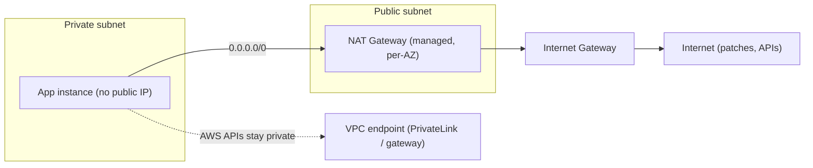
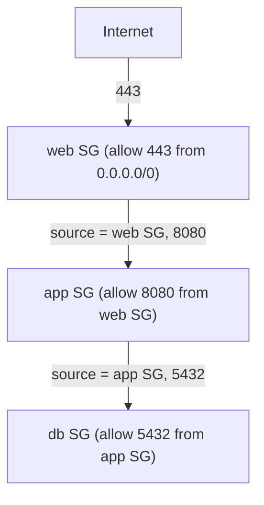
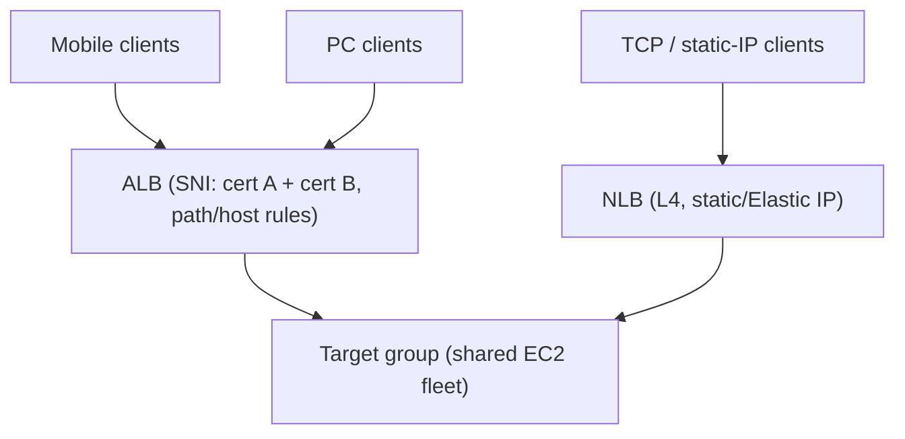
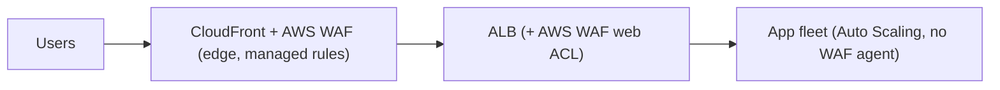
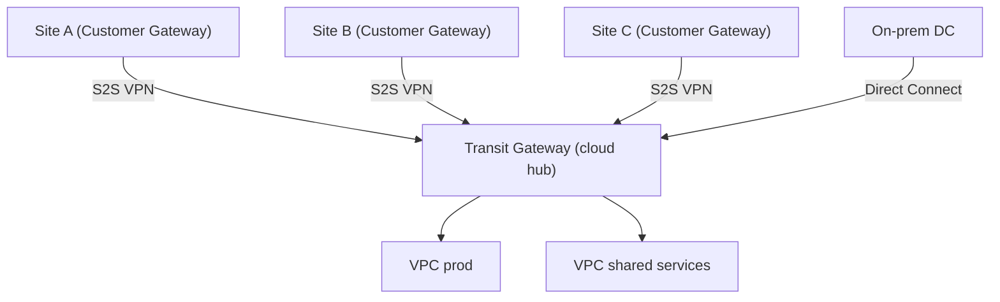

# AWS Cloud Design Patterns: Networking and Security

This topic covers the **networking and security** patterns from the classic
[AWS Cloud Design Patterns (CDP) catalog](https://en.clouddesignpattern.org/) —
a ~2012-2015 collection of 46 AWS patterns. These patterns were written in the
**EC2-era**, when much of what is now a managed service (NAT Gateway, AWS WAF,
Transit Gateway) had to be hand-built on instances. They are still worth learning
because the **problem each one names is timeless** — outbound egress from private
hosts, isolating a management path, filtering by tier vs by operator, terminating
different protocols, blocking web attacks, connecting many sites — even though the
**mechanism** is usually obsolete.

**How to read every pattern below** — four layers:
1. **Problem** it solves (timeless).
2. **Classic mechanism** as the catalog framed it (usually a self-managed EC2/ENI trick).
3. **Modern AWS equivalent** — how you'd actually do it today with a managed service.
4. **Still relevant when …** (or "superseded — use X instead").

> [!KEY-TAKEAWAY]
> In an interview, name the pattern's *intent*, then immediately map it to the
> managed service that absorbed it. Seniority is showing you know the classic
> instance-based hack existed **and** why the managed service replaced it (HA,
> cost, ops burden, blast radius).

**Boundary note (cross-reference, do not re-teach):** the deep mechanics of VPC
subnets, security groups vs NACLs, NAT Gateway internals, PrivateLink, and Transit
Gateway live in **system-design/aws-networking-vpc-privatelink**; AWS WAF, KMS, and
identity live in **system-design/aws-security-kms-secrets-cognito-waf**. Here we stay
at **pattern altitude**: the vocabulary, the classic→modern mapping, and when (if
ever) the classic approach still applies. Deep-dive cross-refs are noted per pattern.

---

## OnDemand NAT

**Problem.** In a secure design, instances in a private subnet must not have inbound
internet exposure, yet they periodically need **outbound** internet access — OS
patches, package updates, calling external APIs. You need controlled egress, but a
NAT device sits idle most of the time, so paying for it 24/7 is wasteful.

**Classic mechanism (catalog).** Run a **NAT instance** — an EC2 instance in a public
subnet configured to forward/masquerade traffic — and add it to the private subnet's
route table as the `0.0.0.0/0` target. Because AWS bills instances by time, you
**launch the NAT instance only during maintenance windows** and terminate it afterward,
automating launch/terminate through the EC2 API. When it is not running, private hosts
simply have no egress.

**Modern AWS equivalent.** Use a **managed NAT Gateway** (one per AZ, in a public
subnet, as the private route table's `0.0.0.0/0` target). It is highly available
within its AZ, scales to tens of Gbps automatically, and needs no patching. For
"on-demand" egress you no longer toggle a box — you either leave the NAT GW up, or for
pure cost control you delete/recreate it or (better) use **VPC endpoints** so traffic
to AWS services (S3, DynamoDB via **gateway endpoints**; most others via **interface
endpoints / PrivateLink**) never needs NAT at all. **Egress-only internet gateway**
handles the IPv6 equivalent.

**Trade-offs.** The classic NAT instance was cheap-when-off but was a **single point
of failure**, capped at the instance's bandwidth, needed `source/dest check` disabled,
and required you to patch and HA it yourself. NAT Gateway removes all of that but bills
**per-hour + per-GB processed** in every AZ — at scale the data-processing charge is a
real line item, which is why routing AWS-bound traffic through **VPC endpoints** (no
NAT charge) is the standard cost play.

**Still relevant when …** almost never for the *instance* form. The *idea* — "don't
pay for egress you don't use" — survives as: prefer VPC endpoints, consolidate NAT per
AZ, and question whether a subnet needs egress at all. A hand-rolled NAT instance is
justified only in tiny/lab setups or when you need NAT plus custom features (port
forwarding, packet inspection) a NAT GW can't do — and even then a firewall appliance
or **AWS Network Firewall** is the better modern answer.

**Deep dive:** see **system-design/aws-networking-vpc-privatelink** (NAT Gateway,
egress-only IGW, gateway vs interface endpoints).

---

## Backnet

**Problem.** A public-facing server (web server) is reached by untrusted users over
the internet. If you **manage** that same host (SSH, log collection, DB admin) over the
**same network interface**, trusted management traffic shares a path with untrusted
public traffic — bad for security. You want the management path physically/logically
separated from the public path.

**Classic mechanism (catalog).** Attach **two Elastic Network Interfaces (ENIs)** to
one EC2 instance. One ENI ("outward-looking") sits in a **public subnet** and routes
`0.0.0.0/0` to the Internet Gateway — it serves port 80/443 to the world. The second
ENI ("inward-looking") sits in a **private subnet** whose default route points at a
**VPN gateway** back to the corporate intranet — this "Backnet" carries SSH (22),
management, and logs. Each ENI gets its **own security group**, so the public ENI
allows only 80 and the management ENI allows only 22.

**Modern AWS equivalent.** You rarely give a host a public interface at all. The modern
management-plane isolation is **AWS Systems Manager Session Manager** — agent-based,
outbound-only SSH/RDP access with no open port 22, no bastion, IAM-authorized and
CloudTrail-logged. Where a network-level admin path is still wanted, put instances in
**private subnets** and reach them through a **bastion/jump host** or a private path
(**Client VPN**, **Site-to-Site VPN**, **Direct Connect**, or **PrivateLink**). The
dual-ENI trick itself is still supported but is now an anti-pattern for admin
isolation.

**Trade-offs.** Dual ENIs give you two independent security groups and two route paths
on one box, but they add routing complexity, don't help if the host is compromised
(both ENIs live on the same OS), and still leave you managing SSH keys. Session Manager
removes the inbound attack surface entirely and centralizes audit — a strictly better
security posture with less to operate.

**Still relevant when …** you genuinely need a separate L3 network for a management VLAN
(some appliance images, or a data-plane/control-plane split on network virtual
appliances). For ordinary server administration it is **superseded — use SSM Session
Manager** (plus private subnets and a bastion only if a network path is required).

**Deep dive:** see **system-design/aws-networking-vpc-privatelink** (ENIs, subnets,
bastion patterns) and **system-design/aws-security-kms-secrets-cognito-waf** (access
control, secrets).

---

## Functional Firewall

**Problem.** Multi-tier access control (web tier may talk to app tier, app tier to DB
tier, nothing else) is a standard security measure. With traditional appliance
firewalls the rule set grows large and hard to maintain; if rules can't be **grouped by
function**, every server change risks a misconfiguration.

**Classic mechanism (catalog).** Use **security groups**, one **per function/tier**
(web SG, app SG, DB SG), and attach the matching SG to each instance in that tier.
Rules are authored once per group and applied by group, so scaling a tier out/in needs
**no rule change** — new instances just join the group. The catalog's point: AWS
"virtualized the firewall," so filtering is per-instance-group by function rather than a
monolithic appliance rule list.

**Modern AWS equivalent.** This one **aged well** — per-tier security groups are still
exactly how you do L3/L4 tier isolation on AWS. The key modern refinement is
**security-group referencing**: a rule allows *the app SG* as its source rather than a
CIDR, so the policy reads "app tier may reach DB tier on 5432" and stays correct as IPs
churn. Security groups are **stateful** (return traffic auto-allowed) and evaluated as
**allow-only** (no deny rules).

**Trade-offs.** Grouping by function keeps rules readable and auto-scaling-friendly.
SGs can't express **deny** rules and can't filter by "who is operating" — only by
source/port/protocol. That's the boundary between this pattern and the Operational
Firewall pattern below.

**Still relevant when …** always, for tier isolation — **not superseded**. Prefer
SG-to-SG references over hardcoded CIDRs. Combine with the Operational Firewall pattern
for source/operator-based control.

**Deep dive:** see **system-design/aws-networking-vpc-privatelink** (security groups vs
NACLs, stateful vs stateless).

---

## Operational Firewall

**Problem.** Large systems are operated by **multiple organizations** — e.g. a
development company, a separate monitoring/log-analysis company, an external support
vendor. You need to control **which organization can access which system** from **which
source**, and change that centrally when a vendor's source addresses change or their
access is revoked — without disturbing the *functional* (tier) rules.

**Classic mechanism (catalog).** Create a **security group per organization/operator**
(dev-team SG, ops-vendor SG, monitoring SG), each scoped to that operator's source
addresses and the ports they legitimately need. Attach the relevant operator SGs to
instances **in addition to** the functional SGs. Because an instance can carry multiple
SGs, you get **centralized, per-operator control**: revoke a vendor by editing/detaching
their one SG, and their access disappears everywhere at once. The catalog explicitly
says this composes with the Functional Firewall pattern.

**Modern AWS equivalent.** Still valid, and richer today: layer SGs by *source
identity* (an instance can have up to (default) 5 SGs, raisable), and pair them with
**Network ACLs (NACLs)** when you need coarse, **stateless deny** at the subnet edge —
e.g. blocking a bad CIDR that SGs (allow-only) cannot express. For managed, auditable
operator access, most teams have moved the *operator* dimension up the stack to **IAM +
SSM Session Manager** (who, authenticated, with CloudTrail) rather than source-CIDR SGs.
The teaching split remains: **Functional Firewall = filter by tier/function (SGs
per tier)**; **Operational Firewall = filter by source/operator (SGs per org, or NACL
denies by CIDR)**.

> [!KEY-TAKEAWAY]
> **Security groups are stateful and allow-only, attached to ENIs/instances.**
> **NACLs are stateless (you must allow both directions), evaluated in numbered
> order, support explicit deny, and attach to subnets.** Functional Firewall leans on
> SGs; Operational Firewall uses SG source rules for allow and NACLs for the deny/CIDR
> cases SGs can't express.

**Trade-offs.** Per-operator SGs give one revocation point per org and clean audit of
"who may reach what." But SGs still can't deny; wide operator CIDRs are blunt; and
managing many overlapping SGs per instance can hit the per-ENI rule/SG limits. NACLs add
deny but are stateless and easy to misconfigure (forgetting ephemeral return ports).

**Still relevant when …** you must segment access by *operator/source* or need explicit
CIDR **deny** (NACLs). For human operator access specifically, prefer **IAM + SSM**;
keep source-CIDR SGs/NACLs for machine-to-machine and network-edge deny.

**Deep dive:** see **system-design/aws-networking-vpc-privatelink** (NACLs, SG limits)
and **system-design/aws-security-kms-secrets-cognito-waf** (IAM-based operator access).

---

## Multi-Load Balancer

**Problem.** One fleet of servers must serve **different client types / protocols /
policies** — PC vs mobile, HTTP vs HTTPS with different certs, different session or
health-check behavior. If you bake all that into the **instances**, every policy change
means touching every server, which gets worse as the fleet scales.

**Classic mechanism (catalog).** Attach **multiple Elastic Load Balancers (ELBs)** with
**different settings** to the **same** EC2 instances. Each ELB handles one concern —
one does SSL termination for cert A, another for cert B; one has mobile-tuned session
stickiness and health checks, another PC-tuned — and you route each client class to the
appropriate ELB. Behaviour changes at the **load-balancer layer**, not on the servers.

**Modern AWS equivalent.** Choose the **right load balancer type per need** and,
crucially, use one **ALB with multiple listeners + listener rules + multiple ACM
certificates (SNI)** to collapse much of what used to require several classic ELBs:
- **Application Load Balancer (ALB)** — L7 HTTP/HTTPS, host/path/header routing,
  multiple certs via SNI, native SSL termination, target groups.
- **Network Load Balancer (NLB)** — L4 TCP/UDP/TLS, ultra-low latency, static/EIP
  addresses, extreme throughput; use for non-HTTP or when you need a fixed IP.
- **Gateway Load Balancer (GWLB)** — inserts third-party virtual appliances (firewalls,
  IDS/IPS) transparently in the path.

So the pattern becomes "**ALB + NLB per need**": e.g. an NLB for a static-IP TCP
endpoint fronting an ALB for HTTP routing, or one ALB with listener rules replacing the
old "multiple ELBs, one per policy" arrangement. All can point at the **same** target
group / instances.

**Trade-offs.** Multiple LBs let each concern evolve independently and keep servers
policy-free — but the catalog's own caution applies: to take an instance out for
maintenance you must **deregister it from every LB** it belongs to, and if the LB
terminates TLS, the app sees plain HTTP and can't inspect the client's TLS directly (use
`X-Forwarded-Proto`). Modern ALB listener rules often make a *single* LB do the job of
several old ELBs, reducing that fan-out.

**Still relevant when …** you genuinely have distinct L4 vs L7 needs (NLB for static IP/
raw TCP alongside ALB for HTTP), multiple certs, or appliance insertion (GWLB). The
"multiple ELBs on one instance just to vary session/health settings" form is largely
**superseded by one ALB with listener rules + SNI**.

**Deep dive:** see **system-design/aws-load-balancing-elb-autoscaling** (ALB/NLB/GWLB
selection, target groups, health checks).

---

## WAF Proxy

**Problem.** Sites handling sensitive data (credit cards, PII) want a **web application
firewall** to block SQL injection, XSS, and similar L7 attacks. But in an
auto-scaling cloud fleet, installing a licensed WAF **on every server** is impractical:
the number of servers changes constantly, so you can't size WAF licenses, and touching
every host is costly.

**Classic mechanism (catalog).** Insert a **dedicated proxy server (EC2) with WAF
software installed** into the path — between the ELB and the app instances (or upstream
of the app) — so **only the proxy runs WAF**. All traffic funnels through it, so you
license/patch WAF on a **small, fixed number of proxy nodes** instead of the whole
elastic fleet. Run **several proxies** (e.g. behind HAProxy) so the WAF layer isn't a
single point of failure.

**Modern AWS equivalent.** Use **AWS WAF** — a fully managed, rules-based L7 firewall
you attach directly to **CloudFront, an Application Load Balancer, API Gateway, AppSync,
or Cognito**. There is **no proxy fleet to run, patch, or license per node**; it scales
with your traffic and bills per rule + per request. You get **managed rule groups**
(AWS + Marketplace, including OWASP-style and bot-control sets), rate-based rules,
IP/geo match, and integration with **AWS Shield** for DDoS. Attaching AWS WAF at
**CloudFront** filters attacks at the edge before they reach the Region.

**Trade-offs.** The classic proxy approach worked but reintroduced exactly the problems
the cloud removed: a **fleet to run and make HA** (the catalog warns it can become a
SPOF), and — importantly — putting a proxy *between* the ALB and the instances
**breaks native Auto Scaling registration** (instances no longer register directly with
the ELB). AWS WAF eliminates all of that: no data-plane hosts, no license math, native
integration, edge enforcement. Its costs scale with rules and requests, and very custom
inspection logic may still need a virtual appliance via **GWLB / AWS Network Firewall**.

**Still relevant when …** you need a WAF capability AWS WAF genuinely can't express
(deep custom inspection, a specific vendor engine) — then insert it via **Gateway Load
Balancer** or **AWS Network Firewall** rather than a hand-run proxy fleet. For ordinary
web-attack filtering it is **superseded — use AWS WAF** on CloudFront/ALB/API Gateway.

**Deep dive:** see **system-design/aws-security-kms-secrets-cognito-waf** (AWS WAF rules,
Shield, managed rule groups).

---

## CloudHub

**Problem.** You must connect **many remote sites** over VPN. A **full-mesh** VPN
(every site to every other site) grows quadratically — each new site means reconfiguring
every existing router — so maintenance cost explodes. A **star/hub-and-spoke** topology
fixes the fan-out (each site connects only to a hub), but then the **hub's availability**
becomes critical: a hub failure takes down every connection, and building a redundant
on-prem VPN hub is expensive with high fixed cost regardless of usage.

**Classic mechanism (catalog).** Use **AWS as the VPN hub**. Create a **VPC** with a
**Virtual Private Gateway (VGW)** acting as the hub; define a **Customer Gateway** per
site and a **Site-to-Site VPN connection** from each site's router to the VGW. Each site
configures only its own tunnel to AWS — no site needs to know about the others — and you
inherit AWS's high-availability, pay-as-you-go infrastructure instead of buying and
maintaining redundant hub hardware. (AWS historically called this the "VPN CloudHub"
setup on a VGW.)

**Modern AWS equivalent.** For anything beyond a handful of sites, the hub is now
**AWS Transit Gateway (TGW)** — a regional cloud router that terminates **Site-to-Site
VPN** attachments (and Direct Connect, and VPC attachments) and provides true
hub-and-spoke **and** spoke-to-spoke routing with route tables, ECMP for bandwidth, and
cross-region peering (**Cloud WAN** for global). The legacy **VGW VPN CloudHub** still
exists for simple multi-site VPN into a single VPC, but TGW is the current default
because it scales to thousands of attachments and centralizes routing.

**Trade-offs.** Hub-and-spoke on AWS removes the O(n²) mesh burden and offloads hub HA
to AWS. Each Site-to-Site VPN gives two tunnels for redundancy but is capped at ~1.25
Gbps per tunnel (use **ECMP over multiple tunnels / TGW** to scale, or Direct Connect
for higher, more consistent bandwidth). All spoke-to-spoke traffic transits the hub, so
hub throughput and routing design matter; VPN over the internet also adds latency/jitter
vs Direct Connect.

**Still relevant when …** the *hub-and-spoke intent* is always relevant for multi-site
connectivity — that's exactly what you build. The specific **VGW VPN CloudHub** form is
fine for a few sites into one VPC; for scale, many VPCs, or spoke-to-spoke, use
**Transit Gateway** (and **Cloud WAN** for global multi-region).

**Deep dive:** see **system-design/aws-networking-vpc-privatelink** (VGW, Transit
Gateway, Site-to-Site VPN, Direct Connect).

---

## Common interview follow-ups

- **"The OnDemand NAT pattern used a NAT instance you started only for patching. What
  do you use today, and how do you cut its cost?"** Managed **NAT Gateway** per AZ; cut
  cost by routing AWS-bound traffic through **VPC endpoints** (gateway endpoints for
  S3/DynamoDB, interface endpoints/PrivateLink for the rest) so it never hits NAT's
  per-GB charge; use **egress-only IGW** for IPv6.
- **"Functional vs Operational Firewall — what's the real distinction?"** Functional =
  filter by **tier/function** (an SG per web/app/db, referencing other SGs as sources);
  Operational = filter by **source/operator identity** (an SG per organization, or a
  **NACL** for explicit CIDR **deny**). SGs are **stateful, allow-only, per-ENI**; NACLs
  are **stateless, ordered, allow+deny, per-subnet**.
- **"Why not run WAF on every instance?"** You can't license/size it against an
  auto-scaling fleet, and a WAF proxy between ALB and instances breaks native
  Auto Scaling registration and becomes a SPOF. Use **AWS WAF** attached to
  CloudFront/ALB/API Gateway — managed, per-request billing, edge enforcement, no fleet.
- **"Backnet used dual ENIs to separate admin traffic. Modern approach?"** Private
  subnets + **SSM Session Manager** (no open port 22, IAM-auth, CloudTrail); a bastion or
  Client VPN only if a network path is truly required.
- **"CloudHub connected many sites via a VGW hub. When would you move to Transit
  Gateway?"** Beyond a few sites, when you have many VPCs, need spoke-to-spoke routing,
  higher bandwidth via ECMP, or centralized route tables — TGW is the modern hub; Cloud
  WAN for global.
- **"Multi-Load Balancer used several ELBs on one fleet. What replaces most of that?"**
  A single **ALB with multiple listeners/listener rules + SNI (multiple ACM certs)**;
  add an **NLB** only for L4/static-IP/raw-TCP needs, or **GWLB** for appliance insertion.

## References

- AWS Cloud Design Patterns catalog — Network/Security patterns
  (clouddesignpattern.org): OnDemand NAT, Backnet, Functional Firewall, Operational
  Firewall, Multi-Load Balancer, WAF Proxy, CloudHub.
- AWS docs — VPC NAT gateways; VPC endpoints and AWS PrivateLink; egress-only internet
  gateways.
- AWS docs — Security groups and network ACLs (comparison); security-group referencing.
- AWS docs — Elastic Load Balancing (Application, Network, Gateway Load Balancers);
  ACM/SNI on ALB listeners.
- AWS docs — AWS WAF (web ACLs on CloudFront/ALB/API Gateway), managed rule groups, AWS
  Shield.
- AWS docs — Site-to-Site VPN, Virtual Private Gateway, VPN CloudHub, AWS Transit
  Gateway, AWS Cloud WAN, AWS Systems Manager Session Manager.
