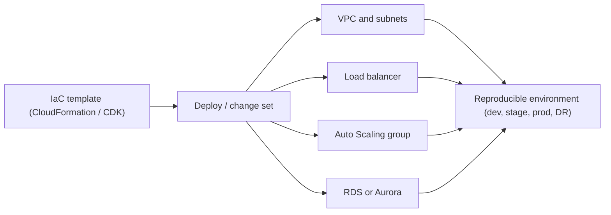
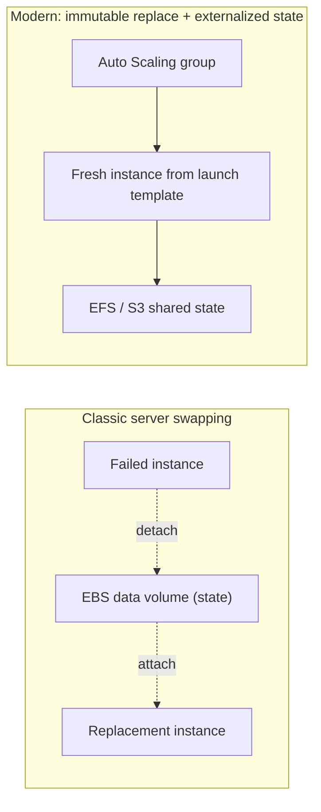
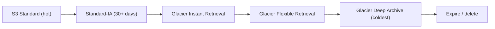
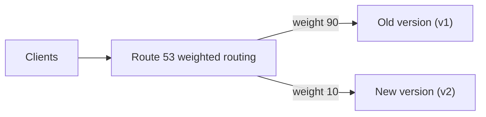
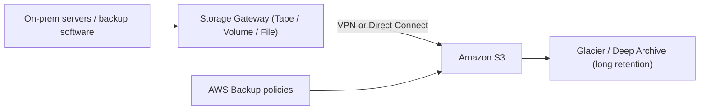

# AWS Cloud Design Patterns: Operation and Maintenance

This topic covers the **Operation and Maintenance** category of the classic **AWS Cloud
Design Patterns (CDP)** catalog from [clouddesignpattern.org](https://en.clouddesignpattern.org/)
(circa 2012–2015). These patterns describe how EC2-era architects kept fleets configured,
deployed, monitored, archived, and safely upgraded — *before* most of that work was absorbed
by managed services.

**How to read this topic — "classic intent -> modern AWS equivalent."** The CDP catalog is
foundational but dated. Do **not** learn these patterns at face value as things to build by
hand today. For each pattern we give: (1) the **problem** it solves (usually timeless), (2)
the **classic mechanism** as the catalog framed it, (3) the **modern AWS equivalent** — how
you would actually do this on AWS today with managed services — and (4) **when (if ever) the
classic approach is still relevant**.

> [!KEY-TAKEAWAY]
> Operation and Maintenance patterns are mostly about **reproducibility and self-configuration**:
> an instance should be able to bring itself to a known-good state at boot, an environment
> should be re-creatable from a template, cold data should drain to cheap storage, and version
> cutovers should be gradual. Modern AWS bakes all of these into user-data/cloud-init,
> CloudFormation/CDK, SSM/Secrets Manager, CloudWatch, S3 lifecycle, and Route 53 / blue-green.

**Boundary note (cross-reference, don't duplicate).** This library already has ~31 deep
`aws-*` topics. Where a pattern overlaps one, this topic gives the **pattern-level** treatment
(problem + classic intent + the modern one-liner + when-still-relevant) and points you to the
deep dive. In particular:
- Deploy/config automation -> **system-design/aws-migration-modernization**
- Monitoring -> **system-design/aws-observability-cloudwatch-xray**
- Backup / DR / hybrid -> **system-design/aws-resilience-multiregion-dr**
- Object storage & lifecycle -> **system-design/aws-storage-s3-deep-dive**
- Cost tiering -> **system-design/aws-cost-optimization-scaling**

---

## Bootstrap Pattern

**Problem.** A server needs the *latest* software and configuration when it launches. If you
bake everything into a machine image, the image goes stale immediately — every config or
package change forces you to rebuild and re-register a new image, and a scaled-out fleet can
boot with drifted, inconsistent state.

**Classic mechanism (catalog).** "Automatic acquisition of startup settings." At **first boot**,
the instance runs a **bootstrap script** that fetches the current software/configuration from a
central repository (an S3 bucket, a package repo, a config server) and configures itself before
joining service. The AMI stays thin and generic; the specifics are pulled at launch time.

**Modern AWS equivalent.** **EC2 user-data + cloud-init**. You attach a user-data script (shell
or cloud-init YAML) to the launch template; cloud-init runs it on first boot to install
packages, pull config, and register with load balancers/monitoring. In an **Auto Scaling group**,
every new instance runs the same user-data, so the fleet self-heals to a known state. The
mature form is the **"golden AMI + thin bootstrap"** split: bake slow, stable layers (OS, agents,
runtime) into an AMI with **EC2 Image Builder**, and pull only the fast-changing bits at boot.
Container/serverless equivalents (immutable image + injected env) make bootstrap largely moot.

**Trade-offs / when to use.** Pure bootstrap (thin AMI, everything at boot) maximizes freshness
but slows launch and adds a runtime dependency on the repo being available — bad for rapid
scale-out or spiky traffic. Fully-baked images boot fast but drift. Most teams split the
difference with golden AMI + minimal user-data.

**Still relevant when:** you run EC2/ASG fleets and need instances to self-configure at launch —
this is exactly how launch templates + user-data work today. **Superseded for** shipping app
code: prefer immutable artifacts (containers, baked AMIs) over pulling code live at boot.

> [!TIP]
> Keep user-data **idempotent and fast**. Long bootstrap scripts that compile from source at
> boot are a classic scale-out bottleneck; move slow steps into the golden AMI.

Deep dive: see **system-design/aws-migration-modernization** (immutable infra, golden AMIs) and
**system-design/aws-load-balancing-elb-autoscaling** (launch templates in ASGs).

---

## Cloud DI Pattern

**Problem.** Some parts of a server's setup change **far more often** than the rest — an app
version, a feature flag, a DB endpoint, a credential. Baking these frequently-updated parts into
the machine image means rebuilding the whole image for a trivial change, and hard-coding them
makes the same image un-reusable across environments (dev/stage/prod).

**Classic mechanism (catalog).** "External placement of parts that are frequently updated" —
essentially **Cloud Dependency Injection**. Keep the volatile pieces **outside** the AMI and
**inject** them at launch: store config/scripts on a separate EBS volume or in S3, reference the
resource by an instance **tag** or a well-known name, and have the instance pull and apply them
at boot. The image becomes a stable "socket"; the environment-specific parts are plugged in.

**Modern AWS equivalent.** **SSM Parameter Store** and **Secrets Manager** for config and
secrets, read at boot or at runtime; **instance tags** and **launch-template metadata** to tell
an instance *which* config to fetch; **AWS AppConfig** for validated, gradually-rolled feature
flags/config; container **environment variables** / task-definition params for ECS/Fargate.
Same generic image, per-environment behavior injected externally — the twelve-factor "config in
the environment" idea.

**Trade-offs / when to use.** Externalizing config gives one reusable image across all
environments and lets you change behavior without a redeploy — but it adds a launch-time
dependency and requires disciplined IAM (an instance role that can read only *its* parameters).
Secrets belong in Secrets Manager (rotation, KMS) rather than plain Parameter Store or tags.

**Still relevant when:** always — "inject config, don't bake it" is a current best practice. The
classic *mechanism* (config on an EBS volume keyed by tag) is **superseded** by Parameter Store /
Secrets Manager / AppConfig.

Deep dive: parameter/secret handling patterns pair with **system-design/aws-migration-modernization**.

---

## Stack Deployment Pattern

**Problem.** Standing up a whole environment — VPC, subnets, security groups, load balancer, a
group of servers, a database — by clicking the console or running ad-hoc scripts is slow,
error-prone, and **not reproducible**. You cannot reliably re-create the same environment for a
second region, a staging copy, or disaster recovery.

**Classic mechanism (catalog).** "Creating a template for setting up groups of servers." Describe
the entire stack in a **declarative template** and deploy the whole environment from it in one
operation. The catalog's concrete tool was **AWS CloudFormation**: one template provisions and
wires together every resource, so the environment is created (and torn down) consistently.

**Modern AWS equivalent.** Still **CloudFormation**, now usually authored with the **AWS CDK**
(real code -> CloudFormation) or with **Terraform**. **Infrastructure as Code** is the
mainstream practice: version-controlled templates, `change sets`/`plan` for preview, **stack
policies** and drift detection, nested/`StackSets` for multi-account/multi-region rollout, and
CI/CD pipelines that deploy the stack. For app+infra bundles, **AWS SAM** and **Serverless
Framework** sit on top of CloudFormation.

**Trade-offs / when to use.** IaC is the right default: reproducible, reviewable, auditable,
and the backbone of DR (re-deploy the stack in another region). Costs are a learning curve and
template sprawl; drift when people change resources out-of-band. Use CDK for complex logic,
raw CloudFormation/Terraform for simple or multi-cloud needs.

**Still relevant when:** essentially always — this pattern *became* the standard. It is the
canonical example of a CDP pattern that was fully absorbed and remains best practice.

Deep dive: environment reproducibility for DR — see **system-design/aws-resilience-multiregion-dr**.

---

## Server Swapping Pattern

**Problem.** A server fails, but its **data** and often its **identity** (IP, attached volume)
must survive so the service can recover quickly without a full rebuild or data restore.

**Classic mechanism (catalog).** "Transferring servers." Keep the **data on a separate EBS
volume**, distinct from the boot/root volume. When the instance fails, **detach** the data
volume from the dead instance and **attach** it to a fresh (or standby) instance, which resumes
where the old one left off. The server is disposable; the volume (state) is portable.

**Modern AWS equivalent.** The literal detach/attach of an **EBS** data volume still works and is
still used for stateful single-node recovery. But the modern default is **immutable replace**:
in an **Auto Scaling group** a failed instance is terminated and a new one launched from the
same launch template — combined with **externalized state** so no swap is needed. Portable
identity/state is handled by:
- **Elastic Network Interface (ENI)** or **Elastic IP** re-attach to preserve address/MAC.
- **EFS** or **S3** for shared/durable data so any instance can mount it (no swap).
- **EBS Multi-Attach** (io1/io2) for clustered access where the workload supports it.

**Trade-offs / when to use.** Volume swapping recovers a single stateful node fast without
re-copying data, but it is a manual/scripted, single-AZ move (an EBS volume lives in one AZ) and
does not protect against volume loss. Immutable replace is cleaner and self-healing but requires
you to externalize state first.

**Still relevant when:** recovering a single stateful EC2 node (e.g., a legacy DB on EBS) where
you want to keep the data volume and just replace the compute. **Prefer** externalized state +
ASG immutable replace for anything you can refactor.

Deep dive: block/shared storage choices — **system-design/aws-storage-ebs-efs-fsx**.

---

## Monitoring Integration Pattern

**Problem.** In a fleet that scales up and down, monitoring that is configured **manually per
host** is always out of date: new instances launch un-monitored, terminated ones leave dead
alarms, and monitoring tooling is scattered across teams and hosts.

**Classic mechanism (catalog).** "Centralization of monitoring tools." Build monitoring **into
the deployment**: the bootstrap/AMI installs the monitoring agent and the instance
**auto-registers** with a central monitoring system as it launches, so coverage tracks the fleet
automatically. Monitoring is a first-class part of provisioning, not an afterthought.

**Modern AWS equivalent.** **Amazon CloudWatch** as the central system, wired in at deploy time:
install the **CloudWatch agent** via user-data or the golden AMI (or manage it with **SSM
Distributor**/State Manager) to push custom metrics and logs; define **CloudWatch alarms**,
**dashboards**, and **Metric/Logs Insights** as code in the same CloudFormation/CDK stack;
use **EventBridge** for event-driven responses. Instances/functions emit metrics automatically;
ASG and container platforms register/deregister targets so monitoring follows the fleet.
For tracing, **AWS X-Ray**; for hosted Prometheus/Grafana, **AMP/AMG**.

**Trade-offs / when to use.** Baking monitoring into the deploy guarantees coverage and avoids
"we forgot to add the alarm" gaps; the cost is metric/log volume (CloudWatch billing) and the
discipline of defining alarms as code. Alarm on symptoms (latency, error rate, saturation), not
just host up/down.

**Still relevant when:** always, as an *intent* — monitoring must be part of provisioning. The
classic bespoke agent + custom registration is **superseded by** the CloudWatch agent + IaC-defined
alarms/dashboards.

Deep dive: metrics, logs, alarms, tracing — **system-design/aws-observability-cloudwatch-xray**.

---

## Web Storage Archive Pattern

**Problem.** You accumulate **large volumes of data** that is rarely accessed (logs, old records,
backups, media) but must be retained. Keeping it on block storage (EBS) or a running database is
expensive and doesn't scale cost-effectively.

**Classic mechanism (catalog).** "Archiving large volumes of data" in **internet storage**. Move
big, cold datasets off expensive block/DB storage into **Amazon S3** ("web storage") — highly
durable, effectively unlimited object storage billed per GB — and treat it as the archive tier.

**Modern AWS equivalent.** **S3 lifecycle policies** that automatically transition objects across
tiers as they age: **S3 Standard -> Standard-IA / One Zone-IA -> Glacier Instant Retrieval ->
Glacier Flexible Retrieval -> Glacier Deep Archive**, and finally **expire/delete**. Or
**S3 Intelligent-Tiering** to let S3 move objects between access tiers automatically based on
usage (no retrieval fees for tier moves). Deep Archive is the cheapest tier for "retain for
years, retrieve rarely" data (retrieval measured in hours). Governance via **Object Lock**
(WORM), versioning, and **S3 Storage Lens** for visibility.

**Trade-offs / when to use.** Deeper/colder tiers are dramatically cheaper per GB but add
**retrieval latency and retrieval fees** and have **minimum storage durations** (early-delete
charges). Match the tier to the access pattern; use Intelligent-Tiering when the pattern is
unknown or unpredictable.

**Still relevant when:** always — tiering cold data to S3/Glacier is current best practice. The
pattern is fully realized by **S3 lifecycle + storage classes**.

Deep dive: storage classes, lifecycle, durability — **system-design/aws-storage-s3-deep-dive**;
cost tiering — **system-design/aws-cost-optimization-scaling**.

---

## Weighted Transition Pattern

**Problem.** You need to migrate traffic from an **old** system/version to a **new** one —
a version upgrade, a re-platform, a region or even cloud move — **without a big-bang cutover**.
An instant switch risks a total outage if the new system misbehaves and gives no safe rollback.

**Classic mechanism (catalog).** "Transitioning using a weighted round-robin DNS." Point the
service name at both the old and new endpoints and use **weighted round-robin DNS** to send a
small percentage of traffic to the new system first, then **gradually raise the weight** as it
proves healthy — and drop it back to zero to roll back. DNS is the traffic dial.

**Modern AWS equivalent.** **Amazon Route 53 weighted routing** (assign weights across record
sets) does exactly this at the DNS layer, and **Route 53 health checks** can auto-remove an
unhealthy target. But the modern toolkit is broader:
- **Blue/green and canary deployments** via **CodeDeploy** (shifts ALB target groups) or **ECS**/
  **Lambda** traffic shifting (Lambda aliases with weighted versions).
- **ALB weighted target groups** for request-level splitting (finer and faster than DNS, no TTL
  lag).
- **API Gateway canary release** stages; **AWS AppConfig** for gradual config/flag rollouts.

**Trade-offs / when to use.** DNS-weighted shifting is simple and endpoint-agnostic but suffers
from **DNS caching / TTL lag** — clients don't switch instantly, so it's coarse and slow to roll
back. Request-level shifting (ALB/CodeDeploy/Lambda alias) is faster and more precise; prefer it
when you control the routing layer. Always pair with health metrics and an automatic rollback
trigger.

**Still relevant when:** shifting traffic across endpoints that only share a DNS name (e.g.,
two regions, two clouds, or two independent stacks). **Prefer** ALB/CodeDeploy/Lambda weighted
shifting for in-stack version rollouts.

Deep dive: routing policies and CDN/DNS — **system-design/aws-dns-cdn-route53-cloudfront**;
resilient cutover across regions — **system-design/aws-resilience-multiregion-dr**.

---

## Hybrid Backup Pattern

**Problem.** On-premises backups to local disk or **tape** are costly, operationally heavy, and
fragile (tapes fail, sit in one building, are slow to restore). You want durable, off-site
backup without building a second data center.

**Classic mechanism (catalog).** "Using the cloud for backups." In a **hybrid** setup, keep
running on-prem but send backups **to cloud storage (S3)** over the internet or VPN — S3's
durability and low per-GB cost replace tape rotation and off-site vaulting.

**Modern AWS equivalent.** **AWS Storage Gateway** is the purpose-built bridge:
- **Tape Gateway (VTL)** presents a virtual tape library to existing backup software, backing to
  S3/Glacier — a drop-in tape replacement.
- **Volume Gateway** (cached/stored) backs on-prem block volumes to S3 with EBS snapshots.
- **File Gateway (S3 File Gateway)** presents NFS/SMB backed by S3 objects.

Plus **AWS Backup** to centrally schedule, apply retention policies, and (with **AWS Backup**
cross-account/cross-region copy) meet compliance; **AWS DataSync** for fast bulk transfer of
file data into S3/EFS/FSx; and **Direct Connect** or **Site-to-Site VPN** for the private,
bandwidth-stable link.

**Trade-offs / when to use.** Hybrid backup gives off-site durability and elastic capacity
without a DR site, but restore speed is bounded by your **link bandwidth** and the chosen S3/
Glacier tier's retrieval time; encrypt in transit and at rest and mind egress/retrieval costs.
It is a **backup** pattern, not full DR — recovery still needs compute and orchestration.

**Still relevant when:** you run on-prem workloads and want cloud-durable backups without a
second site — a mainstream hybrid use case. Storage Gateway + AWS Backup are the current tools.

Deep dive: RPO/RTO, backup vs. replication vs. full DR, cross-region copy —
**system-design/aws-resilience-multiregion-dr**.

---

## Common interview follow-ups

- **"Bootstrap vs. golden AMI — which do you use?"** Both: bake slow, stable layers into a golden
  AMI (Image Builder) for fast, consistent launches; use a thin user-data bootstrap for the
  fast-changing bits. Pulling *everything* at boot is a scale-out bottleneck.
- **"Where do you put config vs. secrets?"** Config/flags -> SSM Parameter Store or AppConfig;
  secrets -> Secrets Manager (rotation, KMS). Never bake either into the AMI (Cloud DI intent).
- **"Why is weighted DNS a weak canary tool?"** DNS caching / TTL means clients don't switch
  promptly, so shifts and rollbacks are slow and coarse. Prefer ALB weighted target groups or
  CodeDeploy/Lambda-alias traffic shifting when you own the routing layer.
- **"Server swapping still needed?"** Rarely — externalize state (EFS/S3/RDS) and use ASG
  immutable replace. EBS detach/attach persists for legacy single-node stateful recovery.
- **"S3 archive tier selection?"** Match retrieval need: Standard-IA for occasional, Glacier
  Instant for ms retrieval of cold data, Deep Archive for retain-for-years; Intelligent-Tiering
  when access is unpredictable. Watch minimum-duration and retrieval fees.
- **"Is Hybrid Backup a DR solution?"** No — it's durable off-site backup. DR adds recovery
  compute, orchestration, and RTO/RPO targets (see the resilience deep dive).
- **"Which of these patterns are essentially 'just IaC now'?"** Stack Deployment (CloudFormation/
  CDK), and to a large extent Bootstrap, Cloud DI, and Monitoring Integration — all absorbed into
  launch templates, IaC, SSM/Secrets Manager, and CloudWatch defined as code.

## References

- AWS Cloud Design Patterns catalog — Operation and Maintenance category:
  <https://en.clouddesignpattern.org/> (Bootstrap, Cloud DI, Stack Deployment, Server Swapping,
  Monitoring Integration, Web Storage Archive, Weighted Transition, Hybrid Backup).
- AWS docs — *Running commands on your Linux instance at launch (user data)* and *cloud-init*.
- AWS docs — *AWS Systems Manager Parameter Store* and *AWS Secrets Manager*; *AWS AppConfig*.
- AWS docs — *AWS CloudFormation* and *AWS CDK*; *StackSets*.
- AWS docs — *Amazon EBS volumes* (attach/detach, Multi-Attach); *Elastic Network Interfaces*;
  *Amazon EFS*.
- AWS docs — *Amazon CloudWatch agent*, *alarms*, *dashboards*; *AWS X-Ray*.
- AWS docs — *Using Amazon S3 storage classes* and *S3 Lifecycle*; *S3 Glacier / Deep Archive*;
  *S3 Intelligent-Tiering*.
- AWS docs — *Amazon Route 53 weighted routing*; *AWS CodeDeploy blue/green*; *Lambda traffic
  shifting with aliases*; *ALB weighted target groups*.
- AWS docs — *AWS Storage Gateway* (Tape/Volume/File Gateway); *AWS Backup*; *AWS DataSync*;
  *AWS Direct Connect* / *Site-to-Site VPN*.
