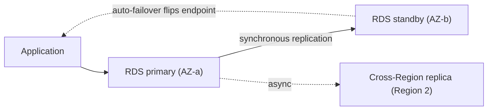
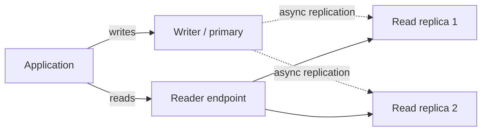
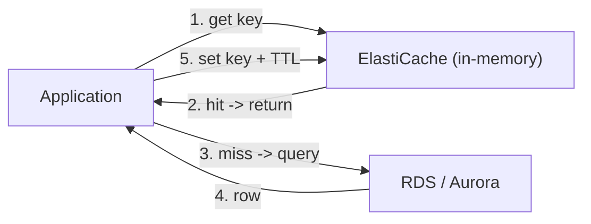
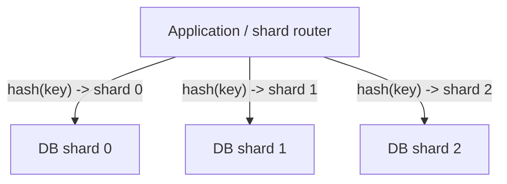

# AWS Cloud Design Patterns: Relational Databases and Data Stores

The **Cloud Design Patterns (CDP)** catalog at
[clouddesignpattern.org](https://en.clouddesignpattern.org/) is a classic (~2012–2015)
collection of 46 AWS patterns. This topic covers its **data-tier** patterns: **DB
Replication**, **Read Replica**, **Inmemory DB Cache**, and **Sharding Write**.

> [!KEY-TAKEAWAY]
> Read every pattern here as **classic intent → modern AWS equivalent**. The *problem*
> each pattern solves is timeless, but the catalog's *mechanism* usually describes a
> hand-rolled, EC2-era workaround (you install MySQL on an EC2 instance, wire up native
> replication yourself, run memcached on another instance). On AWS today the same intent
> is delivered by a **managed service** — RDS/Aurora, ElastiCache, DAX, DynamoDB — that
> absorbs the operational toil. For each pattern we give: the **problem**, the **classic
> mechanism**, the **modern AWS equivalent**, the **trade-offs**, and **when (if ever)
> the classic approach still applies**.

> [!INTERVIEW]
> This is the *pattern-vocabulary* layer. The mechanics of replication, replica lag,
> sharding, and caching are taught in depth elsewhere in this library — this topic
> teaches you to *recognize the pattern and name the modern managed mapping*, not to
> re-derive the theory. Deep dives are cross-referenced per pattern:
> `system-design/aws-databases-rds-aurora`, `system-design/aws-caching-elasticache-dax`,
> `system-design/aws-dynamodb-deep-dive`, and
> `system-design/databases-sql-nosql-sharding-replication`.

---

## DB Replication

**Problem.** A single database instance is a single point of failure. If the disk, host,
or Availability Zone hosting it dies, the application loses its system of record and may
suffer data loss. You want the data to *survive* the loss of a component and to keep
serving after a failure — i.e. **durability and high availability** for the write tier.

**Classic mechanism (as the catalog framed it).** Run the primary DB on an EC2 instance
in one AZ and a **standby replica** on a second EC2 instance in a *different* AZ. Configure
the database engine's native replication so the standby continuously receives changes from
the primary. If the primary AZ fails, you promote the standby and repoint the application.
The emphasis is *disaster recovery / availability* — the replica is a hot spare, not a
place to send read traffic.

**Modern AWS equivalent.** You do not build this by hand anymore:

- **Amazon RDS Multi-AZ** — RDS maintains a **synchronous** standby in another AZ and
  handles **automatic failover** by flipping the DNS endpoint (typical failover 60–120s
  for Multi-AZ instance; the newer **Multi-AZ DB cluster** with two readable standbys
  fails over in ~35s). The standby is *not* readable in the classic single-standby setup —
  it exists for availability, not read scaling.
- **Cross-Region read replicas** — asynchronous copies in another Region for regional DR
  and geo-local reads.
- **Aurora** replicates every write **6 ways across 3 AZs** at the storage layer, and
  **Aurora Global Database** replicates to secondary Regions with typical <1s lag and
  cross-Region failover (RTO often <1 min, RPO ~1s) for the strongest managed DR posture.

**Trade-offs / when to use.** Synchronous Multi-AZ adds write latency (every commit waits
for the standby) but gives near-zero data loss (RPO ≈ 0) within a Region. Cross-Region and
Aurora Global Database are asynchronous — cheaper and lower-latency writes, but you accept a
small RPO. Multi-AZ **does not** add read capacity; conflating it with read replicas is the
classic interview trap.

> [!WARNING]
> **DB Replication ≠ Read Replica.** DB Replication (this pattern → RDS Multi-AZ) is about
> **availability/DR** with a *non-readable* synchronous standby. Read Replica (next pattern)
> is about **read scaling** with *readable, asynchronous* copies. They solve different
> problems and are frequently combined.

**Still relevant when …** the *intent* is always relevant, but the hand-rolled EC2 version
is **superseded** — use RDS Multi-AZ / Aurora unless you run an engine or topology RDS does
not support (then you self-manage replication on EC2 and own failover yourself).

*Deep dive: see `system-design/aws-databases-rds-aurora` and
`system-design/aws-resilience-multiregion-dr`.*

---

## Read Replica

**Problem.** A read-heavy application saturates a single primary DB: analytics queries,
dashboards, and report generation compete with the transactional write workload and drag
down latency for everyone. You want to **scale read throughput** without overloading the
primary.

**Classic mechanism (as the catalog framed it).** Stand up one or more **read-only replica**
DB instances that asynchronously replicate from the primary, and route **read** queries to
the replicas while **writes** still go to the primary. The application (or a proxy) is
responsible for splitting reads from writes. Because replication is asynchronous, replicas
lag slightly behind the primary.

**Modern AWS equivalent.**

- **Amazon RDS read replicas** — up to **15** read replicas per source DB instance (the
  current default quota, now uniform across MySQL/MariaDB/PostgreSQL/SQL Server; RDS for
  Oracle also permits up to 15 but AWS recommends ≤5 to bound replication lag). Each replica
  has its own endpoint, replicates asynchronously, can be **promoted** to a standalone
  primary, and can live in other Regions.
- **Amazon Aurora replicas** — up to **15** replicas sharing the *same* distributed storage
  volume as the writer, so lag is typically **single-digit to tens of milliseconds** (much
  lower than engine-level binlog replication). Aurora exposes a single **reader endpoint**
  that load-balances across all replicas, and replicas double as fast failover targets.
- **RDS Proxy** can help route and pool connections in front of these.

**Trade-offs / gotchas.**

- **Replica lag** — replicas are eventually consistent. A **read-your-writes** violation
  happens when a user writes to the primary and immediately reads from a lagging replica and
  sees stale data. Mitigate by routing *read-after-write* reads to the writer, or (Aurora)
  using session/consistency features, or waiting on a replication-progress token.
- Read replicas scale **reads only** — they do nothing for write throughput (that is the
  Sharding Write pattern).
- The reader endpoint balances connections, not per-query load, so a heavy query can still
  hot-spot one replica.

**Still relevant when …** almost always — this pattern maps *directly* onto a managed
feature you should reach for by default. The "classic" part that is superseded is
*hand-managing binlog replication on EC2*; let RDS/Aurora do it.

*Deep dive: see `system-design/aws-databases-rds-aurora` and
`system-design/databases-sql-nosql-sharding-replication`.*

---

## Inmemory DB Cache

**Problem.** Even a well-tuned relational DB spends effort re-answering the *same* popular
read queries. Repeated identical reads (a product page, a user profile, a leaderboard) drive
DB load, CPU, and latency higher than necessary. You want to serve hot reads from **memory**
so the database only sees the misses.

**Classic mechanism (as the catalog framed it).** Put an **in-memory key-value cache**
(the catalog era: memcached running on an EC2 instance) in front of the database. On a read,
check the cache first; on a **cache hit** return the cached result, on a **cache miss** query
the DB, then store the result in the cache with a TTL. This offloads repeated reads from the
DB and cuts read latency to sub-millisecond.

**Modern AWS equivalent.**

- **Amazon ElastiCache** (**Redis / Valkey** or **Memcached**) — a managed in-memory cache
  fronting RDS/Aurora. Redis/Valkey add replication, persistence, and richer data structures;
  Memcached is a simpler multi-threaded key-value cache.
- **Amazon DynamoDB Accelerator (DAX)** — a fully managed, DynamoDB-*API-compatible*
  in-memory cache specifically for DynamoDB (microsecond reads, no app-side cache logic).

**Caching strategies (know the two by name):**

- **Cache-aside (lazy loading)** — the application checks the cache, and on a miss loads
  from the DB and populates the cache. Only requested data is cached; a miss costs an extra
  round trip; stale data is bounded by TTL. This is the strategy the classic pattern
  describes.
- **Write-through** — the application writes to the cache and the DB together on every write,
  so the cache is always warm/fresh, at the cost of write latency and caching data that may
  never be read.

**Trade-offs / gotchas.**

- **Invalidation is the hard part** — stale cache entries after an update. Use TTLs and/or
  explicit invalidation on write.
- **Thundering herd / cache stampede** — when a hot key expires, many requests miss at once
  and hammer the DB.
- Cache-aside optimizes memory (only hot data) but has cold-miss latency; write-through keeps
  data fresh but wastes memory on never-read keys and slows writes. They are often combined
  (write-through + TTL).

**Still relevant when …** always — caching hot reads is core architecture. What is superseded
is *running memcached on EC2 yourself*; use ElastiCache (general) or DAX (DynamoDB-specific).

*Deep dive: see `system-design/aws-caching-elasticache-dax`.*

---

## Sharding Write

**Problem.** Read replicas and caching scale **reads**, but a single primary is still the
**one place all writes go**. When write throughput (INSERT/UPDATE volume) or dataset size
outgrows the largest single instance, you hit a hard **write ceiling** that no replica can
relieve. You need to scale **writes** horizontally.

**Classic mechanism (as the catalog framed it).** **Partition (shard)** the data across
**multiple independent databases**, each owning a subset of the rows chosen by a **shard key**
(e.g. `user_id % N`, hash of a key, or a range). Each shard is its own primary that accepts
writes for its slice, so aggregate write throughput scales roughly linearly with the number
of shards. Application (or a routing layer) maps each request to the correct shard.

**Modern AWS equivalent.** There is **no single managed "sharded RDS"** button — sharding a
relational DB is still largely an **application-level** design decision. Your realistic
options on AWS today, in rough order of preference:

- **Scale up first** — a bigger Aurora/RDS instance class + Aurora's high write IOPS often
  defers sharding for a long time. Aurora scales *storage* automatically to 128 TiB but still
  has a **single writer** per cluster (Aurora **Global Database write-forwarding** and
  **Aurora Serverless v2** help, but the write path is still one logical writer per cluster).
- **App-level sharding across multiple RDS/Aurora clusters** — you own the shard key, routing,
  cross-shard queries, and rebalancing. Powerful but operationally heavy.
- **Reach for a natively-partitioned store instead** — **Amazon DynamoDB** partitions writes
  automatically by partition key across many nodes (effectively "sharding as a managed
  feature"), which is why the modern answer to "I need to scale writes past one box" is often
  *"use DynamoDB (or another horizontally-partitioned store) rather than shard a relational
  DB by hand."*

**Trade-offs / gotchas.**

- **Cross-shard queries and JOINs** become application problems; **transactions** across
  shards need distributed-transaction or saga patterns.
- **Hot shards / uneven distribution** — a bad shard key concentrates load on one shard.
- **Resharding / rebalancing** is painful once live; choose the shard key carefully up front.
- Sharding solves writes but multiplies operational surface (N clusters to patch, back up,
  monitor).

**Still relevant when …** you have a genuinely write-bound relational workload that must stay
relational and has outgrown the largest single writer. Otherwise the *modern* move is to pick
a store that shards for you (DynamoDB) rather than hand-roll relational sharding.

*Deep dive: see `system-design/aws-dynamodb-deep-dive` and
`system-design/databases-sql-nosql-sharding-replication`.*

---

## Common interview follow-ups

- **"Multi-AZ vs read replica — which scales reads?"** Read replicas. Multi-AZ is availability/DR
  with a non-readable standby (classic single-standby). Naming this correctly is table stakes.
- **"My user updated their profile then immediately saw the old value — why?"** Replica lag +
  reading from an async replica (read-your-writes violation). Route read-after-write to the
  writer or use a consistency mechanism.
- **"When would you shard a relational DB instead of using DynamoDB?"** When the workload must
  stay relational (rich JOINs, strong multi-row ACID) *and* has outgrown a single writer;
  otherwise prefer a natively-partitioned store.
- **"Cache-aside vs write-through — pick one and defend it."** Cache-aside for read-heavy with
  tolerable staleness and memory efficiency; write-through when reads must always be fresh and
  you can pay the write cost. Often combined with TTLs.
- **"How do you cache DynamoDB reads?"** DAX (API-compatible, microsecond reads) rather than
  ElastiCache, so you avoid app-side cache logic.
- **"Which of these four patterns scales writes?"** Only Sharding Write. DB Replication scales
  availability; Read Replica and Inmemory DB Cache scale reads.

## References

- Cloud Design Patterns catalog — clouddesignpattern.org: *DB Replication Pattern*,
  *Read Replica Pattern*, *In-memory DB Cache Pattern*, *Sharding Write Pattern*.
- AWS docs: *Amazon RDS Multi-AZ deployments* and *Working with read replicas*
  (docs.aws.amazon.com/AmazonRDS).
- AWS docs: *Amazon Aurora replication* and *Aurora Global Database*
  (docs.aws.amazon.com/AmazonRDS/latest/AuroraUserGuide).
- AWS docs: *Amazon ElastiCache* caching strategies (lazy loading vs write-through) and
  *Amazon DynamoDB Accelerator (DAX)*.
- AWS docs: *Amazon DynamoDB* partitions and partition-key design.
