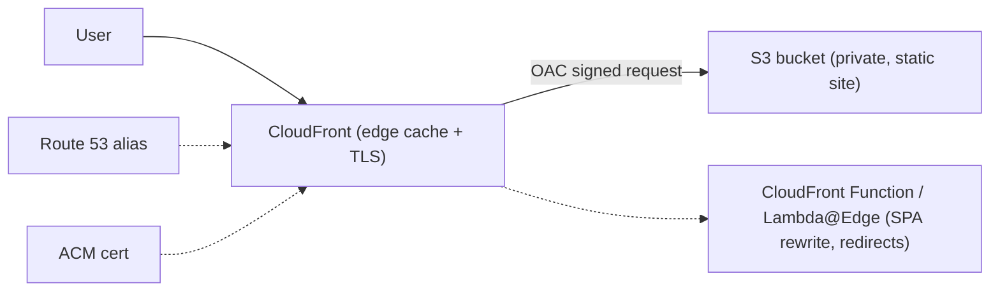
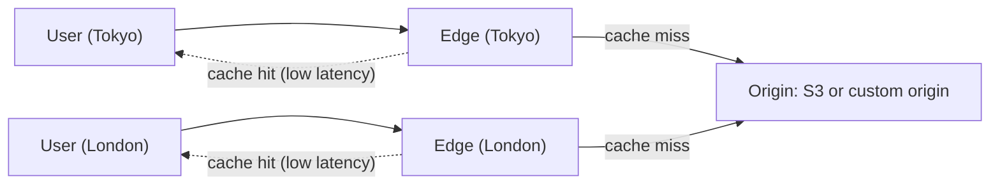
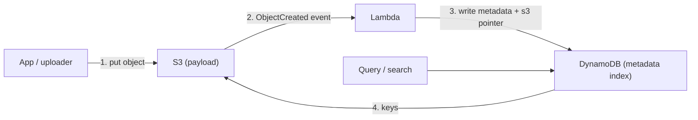
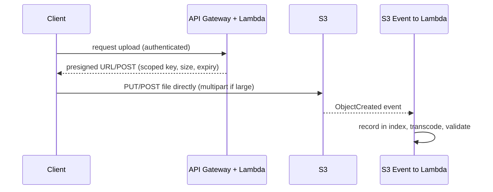

# AWS Cloud Design Patterns: Static Content Delivery and Data Upload

This topic covers eight patterns from the classic **AWS Cloud Design Patterns (CDP)**
catalog at [clouddesignpattern.org](https://en.clouddesignpattern.org/) — the "Handle
static content" and "Upload to the cloud" categories. The CDP catalog was written
around **2012** and reflects an EC2-era mindset where the default unit of compute was a
virtual server and object storage (S3) was still a novelty you bolted on. Most of these
patterns are really one insight said several ways: **push bytes off your app servers and
onto S3 + CloudFront**, and let managed edge/storage services do the heavy lifting.

**How to read every pattern in this topic** — use the same four-part lens:

1. **Problem** — the timeless pain the pattern addresses (this part still holds today).
2. **Classic mechanism** — how the 2012 catalog told you to solve it (often a manual,
   EC2-centric workaround).
3. **Modern AWS equivalent** — how you would actually build it on AWS today with the
   managed services that have since absorbed the pattern.
4. **Still relevant when …** — whether the classic approach retains any niche, or is
   simply superseded.

> [!KEY-TAKEAWAY]
> Almost every "static content" and "upload" CDP pattern reduces to a single modern
> playbook: **store objects in S3, serve them through CloudFront with Origin Access
> Control (OAC), gate private access with signed URLs/cookies, and let clients upload
> straight to S3 with presigned URLs.** The patterns are worth learning as *vocabulary*
> and as *design intent* — not as build instructions.

**Boundary note (cross-references, not duplication).** This library already has deep
dives on the AWS services these patterns map onto. Here we stay at **pattern altitude** —
intent, the classic-vs-modern mapping, and trade-offs — and point at the deep dive rather
than re-teach the service:

- S3 internals (durability, storage classes, static website hosting, presigned URLs,
  multipart, Transfer Acceleration) → `system-design/aws-storage-s3-deep-dive`
- CloudFront / Route 53 / edge caching, OAC, signed URLs & cookies, invalidations →
  `system-design/aws-dns-cdn-route53-cloudfront`
- DynamoDB as the metadata index (Storage Index) → `system-design/aws-dynamodb-deep-dive`

---

## Web Storage

**Problem.** Delivering large files (video, high-resolution images, ZIP archives) from a
single web server saturates that server's network pipe and disk. Scaling out by copying
the large files onto many web servers is wasteful and expensive, and keeping the copies in
sync is a chore.

**Classic mechanism (per the catalog).** Move the large objects off the web servers and
into "Internet storage" — **Amazon S3**. Create a bucket, upload the static content, mark
the objects public, and hand users the per-object S3 URL
(`http://(bucket).s3.amazonaws.com/(file)`) or link to it from your HTML. The web server
no longer serves the bytes; S3 does. S3's cross-datacenter replication gives you high
durability for free.

**Modern AWS equivalent.** This is still the correct instinct, but the *implementation
details have changed*:

- **Do not make the bucket/objects public.** Modern best practice is **Block Public
  Access ON** and serve through **CloudFront with Origin Access Control (OAC)**, so the
  bucket stays private and only the distribution can read it. Public buckets are the
  classic S3 data-leak footgun.
- Path-style `bucket.s3.amazonaws.com/...` URLs are legacy; virtual-hosted-style and
  CloudFront domains are the norm.

The *pattern intent* — "large/static bytes belong in object storage, not on the app
server's disk" — is as true as ever and underpins nearly everything else in this topic.

> [!WARNING]
> The catalog's "set the objects to public" step is **actively discouraged today**. Reach
> for CloudFront + OAC (or, at minimum, a bucket policy scoped to a CloudFront origin)
> instead of a public bucket.

Deep dive: see `system-design/aws-storage-s3-deep-dive`.

## Direct Hosting

**Problem.** A sudden traffic spike can outrun your ability to add web servers, and
over-provisioning servers "just in case" wastes money. For content that is *entirely
static*, running fleets of web servers at all is overkill.

**Classic mechanism (per the catalog).** Use S3 itself as the web server — host not just
media but the **HTML/CSS/JS** too. Turn on S3's **static website hosting** feature, set an
index document and error document, and open the bucket policy for public read. S3 absorbs
arbitrary traffic spikes with no capacity planning, giving you a highly available,
durable web tier with zero servers to manage.

**Modern AWS equivalent.** Still exactly the right shape for static sites and SPAs — but
the recommended topology is now **S3 (private, Block Public Access ON) as origin +
CloudFront + OAC**, with HTTPS via **ACM** and DNS via **Route 53 alias records**:

- CloudFront gives you **TLS/HTTPS** (the S3 website endpoint is HTTP-only), a global edge
  cache, HTTP/2 and HTTP/3, and a custom domain done properly.
- For SPA client-side routing you use a **CloudFront Function** or custom error responses
  to rewrite 403/404 to `/index.html`.
- Dynamic bits that "can't run server-side on S3" (the catalog's caution) are handled by
  **Lambda@Edge / CloudFront Functions**, **API Gateway + Lambda**, or a separate API
  origin — you no longer need JSONP to work around cross-origin data fetches (use **CORS**).

**Still relevant when …** it is *always* relevant for static sites — this is the modern
default. Only the "S3 alone, public bucket" execution is dated; put CloudFront in front.

Deep dive: see `system-design/aws-dns-cdn-route53-cloudfront` and
`system-design/aws-storage-s3-deep-dive`.

## Private Distribution

**Problem.** S3 is great for delivering content directly to users, but sometimes content
must reach **only specific, authorized users** — a paid download, a per-user report, a
licensed video. Plain public S3 delivery has no notion of "who is allowed"; wiring S3 into
your application's authentication is awkward, so access control with object storage alone
is hard.

**Classic mechanism (per the catalog).** Use S3's **time-limited (signed) URL** feature.
Your application authenticates the user locally, then calls the S3 API/SDK to generate a
**pre-signed URL** for each object that user is allowed to fetch — optionally constrained
by **expiry time** and **source IP**. The app injects those short-lived URLs into the
generated HTML. When the link expires (or an unexpected IP tries it), the download fails.
Crucially, the actual bytes still flow **directly from S3**, not through your EC2
instance, so you keep S3's scalability and resilience.

**Modern AWS equivalent.** Two tools, chosen by scope:

- **S3 presigned URLs** — best for a *single object* handed to one user (e.g., "download
  your invoice"). Same mechanism the catalog describes, still current.
- **CloudFront signed URLs / signed cookies** — the modern choice for **private
  distribution of many objects through the CDN**. Signed **cookies** authorize a *set* of
  objects (a whole video's segments, a gated section of a site) without signing each URL;
  signed **URLs** authorize one object. You can also add geo-restriction and use OAC so
  the origin bucket stays private.

**Trade-off.** Presigned S3 URLs bypass the CDN (no edge caching, origin bears every
request); CloudFront signed URLs/cookies keep the edge cache and TLS. Use CloudFront
signing when the content is cacheable and served at scale; use S3 presigned URLs for
one-off, per-user objects.

> [!TIP]
> "One object for one user" → S3 presigned URL. "A gated bundle of cacheable content
> served through the CDN" → CloudFront signed **cookies**.

Deep dive: see `system-design/aws-dns-cdn-route53-cloudfront`.

## Cache Distribution

**Problem.** Users are geographically dispersed and content (hi-def images, video) is
large. A single origin means far-away users eat the full round-trip latency (the catalog
cites ~200 ms Japan↔US-East) on every request. One transmission origin degrades the
experience for distant users.

**Classic mechanism (per the catalog).** Put cached copies of the content at **edge
locations around the world** using **Amazon CloudFront**. Pick an origin (S3, an EC2
server, or even an on-premises/hosting server), point a CloudFront distribution at it, and
serve users from the nearest edge. CloudFront issues an `xxxx.cloudfront.net` domain; you
CNAME your own domain to it. Latency drops and origin load is offloaded.

**Modern AWS equivalent.** Still CloudFront — the pattern *is* "use a CDN," and that is
unchanged. Modern refinements: **OAC** to keep an S3 origin private, **origin groups /
failover**, **cache policies & origin request policies** (replacing the old cache-behavior
knobs), **HTTP/3**, **Brotli/gzip at the edge**, and **regional edge caches** between edges
and origin. This overlaps the edge/CDN deep dive heavily — stay at pattern altitude here.

**Trade-off / caution.** Edge caches serve stale content until the TTL expires — updating
the origin does **not** instantly update the edges. Manage this with cache-busting
(**Rename Distribution**) or invalidations.

Deep dive: see `system-design/aws-dns-cdn-route53-cloudfront`.

## Rename Distribution

**Problem.** With **Cache Distribution** in play, when you update a file at the origin the
edge caches keep serving the old copy until the TTL times out. You cannot reliably push a
change to users "right now."

**Classic mechanism (per the catalog).** Because the CDN keys its cache on the **URL**,
give the *new* version a **different filename/URL**, then update the references (in a
short-TTL or always-from-origin "base" HTML file) to point at the new URL. Because the URL
changed, the edge treats it as a brand-new object and fetches the fresh content
immediately — no waiting for the old object's TTL. The catalog's caution: keep the base
document's TTL short, and note the *old* object lingers at the edge until its TTL (or an
invalidation) clears it.

**Modern AWS equivalent.** This is exactly **cache-busting via content-hashed / versioned
object keys** — e.g. `app.9f3c1a.js` or `/v42/app.js`. Modern build tools (Webpack, Vite,
etc.) fingerprint filenames automatically; you serve those immutable assets with a long
`Cache-Control: max-age=31536000, immutable` and a short-TTL `index.html` that references
the current hashed names. The alternative lever is a **CloudFront invalidation**, which
force-expires objects by path.

**Trade-off — Rename vs. Invalidation:**

- **Rename/versioned keys** are effectively **free**, instantaneous, and let old and new
  versions coexist (safe rollbacks, no thundering-herd on the origin). This is the
  **recommended default**.
- **Invalidations** mutate a fixed URL in place. The first ~1,000 paths/month are free,
  then billed per path; wildcard invalidations are slow to propagate and can stampede the
  origin as every edge refetches. Reserve invalidations for occasional fixes, not routine
  deploys.

> [!TIP]
> Fingerprint your asset filenames and treat them as immutable; keep only the small entry
> HTML on a short TTL. Reach for CloudFront invalidations sparingly — renaming is cheaper,
> faster, and rollback-friendly.

Deep dive: see `system-design/aws-dns-cdn-route53-cloudfront`.

## Write Proxy

**Problem.** S3 is optimized for durability and read throughput, but *writes* go over
HTTP and are replicated to multiple locations, so a single-stream upload of **large data**
(or many tiny files) can be slow — especially across long, lossy, high-latency links
(e.g., uploading from another continent).

**Classic mechanism (per the catalog).** Don't upload from the client straight to S3.
Instead stand up an **EC2 "upload server"** *in the same region as the target bucket*, and
have the client send data to it using a **faster-than-HTTP transport** — a UDP-based
accelerator such as **Aspera** or **TsunamiUDP**, or an FTP/HTTP endpoint. Bundle many
small files into one archive on the client, transfer to the upload server, then let the
upload server push to S3 over the fast in-region AWS backbone (optionally using
**multipart** parallel writes). The long-haul leg uses an optimized protocol; the
S3 leg is short and fast.

**Modern AWS equivalent.** The managed services that absorbed this:

- **S3 Transfer Acceleration** — routes uploads over the CloudFront edge network and AWS
  backbone to the bucket; a managed, endpoint-flip version of "proxy the long-haul leg."
- **S3 multipart upload** with parallel parts — the built-in way to saturate bandwidth and
  make large uploads resumable (no hand-built upload server needed).
- **AWS DataSync** for bulk/recurring file transfer, **Snowball** for offline petabyte
  migration, and **AWS Global Accelerator** for anycast-optimized ingress.
- A **presigned-URL service** (a small Lambda/API that mints upload URLs) is the modern
  "mediated upload" — see Direct Object Upload.

**Still relevant when …** you need protocols AWS-native tools don't offer (e.g., licensed
**Aspera FASP** for extreme-latency media workflows), or the client can't speak S3 APIs
and you must terminate a legacy protocol (FTP/SFTP) — though **AWS Transfer Family** now
provides managed SFTP/FTPS/FTP fronting S3, superseding the hand-rolled EC2 FTP box.

Deep dive: see `system-design/aws-storage-s3-deep-dive`.

## Storage Index

**Problem.** Object storage is durable and cheap, but it is *not a database*: S3 has no
rich, high-speed query/search. "Give me all objects for user X" or "everything uploaded in
this date range" is painful when the only tool is a slow `LIST` over keys, and latency to
object storage is higher than a local DB.

**Classic mechanism (per the catalog).** Split **metadata from blob**. When you write an
object to S3, *simultaneously* write its **metadata** — key, path, size, timestamp, owner,
tags — into a fast key-value store (the catalog names **SimpleDB** or **DynamoDB**). Search
and aggregation run against the KVS index; you then fetch the actual bytes from S3 using
the keys the query returned. This is the canonical **"metadata in the DB, blob in S3"**
split. The catalog's crucial caution: the DB and S3 can drift, so the object write and the
index write must be kept consistent — **write them together**.

**Modern AWS equivalent.** The exact same pattern, and it is a **cornerstone of modern AWS
architecture** — DynamoDB (or RDS/Aurora) holds the queryable metadata and a **pointer**
(bucket + key) to the S3 object; S3 holds the payload. Modern ways to keep the two
consistent and to build the index:

- **S3 Event Notifications → Lambda** (or **EventBridge**) to update the index on
  `s3:ObjectCreated`/`ObjectRemoved` events, rather than relying on the app to write both.
- **DynamoDB** for high-scale key/attribute lookups; **RDS/Aurora** when you need rich SQL
  or joins.
- For full-text/faceted search over the metadata, **OpenSearch**; for SQL *over the objects
  themselves*, **Athena** / **S3 Inventory** for large-scale listing.

> [!WARNING]
> The index and the object store can diverge (a write to one succeeds, the other fails).
> Keep them in sync with S3 event-driven updates and reconciliation jobs, and treat the
> object store — not the index — as the source of truth for existence.

**Still relevant when …** essentially always — this is how you make petabytes of S3 objects
queryable. Only "SimpleDB" is obsolete (use DynamoDB).

Deep dive: see `system-design/aws-dynamodb-deep-dive` and
`system-design/aws-storage-s3-deep-dive`.

## Direct Object Upload

**Problem.** On upload-heavy sites (photo/video sharing), routing every user upload
*through* your web/EC2 tier makes that tier a network bottleneck and forces you to run
servers sized for upload bandwidth — costly even at moderate scale.

**Classic mechanism (per the catalog).** Have clients upload **directly to S3**, bypassing
the app server entirely. The web server generates an **HTML form** (**S3 POST** with a
signed policy) that the browser submits straight to S3; after the transfer S3 **redirects**
to a success URL where your server records completion. The bytes never touch your EC2
instance — you offload the upload load onto S3's scalability, and the object lands in S3
ready to share across instances.

**Modern AWS equivalent.** This is the **presigned-URL / presigned-POST** pattern, a
staple of modern AWS apps:

- A small backend endpoint (typically **API Gateway + Lambda**) authenticates the user and
  returns a **presigned `PUT` URL** or a **presigned POST** policy scoped to a specific
  key, size limit, and content type.
- The client `PUT`s (or POSTs) the file **straight to S3**; for large files it uses
  **multipart upload** with presigned part URLs.
- Completion is detected via **S3 Event Notification → Lambda/EventBridge** (the modern
  replacement for the form's redirect-to-success-URL), which can then update the **Storage
  Index**, kick off transcoding, etc.
- **CORS** on the bucket enables the browser's cross-origin upload.

**Trade-offs.** Pro: your servers never proxy bytes → cheaper, infinitely scalable ingest.
Con: you must scope the presigned grant tightly (key prefix, size, content-type, short
expiry) or you create an open write hole; and you can't inspect/transform the payload
in-flight — do validation/virus-scan/transcode *after* upload via the event trigger.

> [!INTERVIEW]
> "How do you let a million users upload video without your app servers becoming the
> bottleneck?" → **Direct Object Upload**: backend mints a scoped presigned URL/POST, client
> uploads straight to S3 (multipart for big files), an S3 event triggers post-processing.
> Name the security scoping (key prefix, size, expiry) and you've nailed it.

Deep dive: see `system-design/aws-storage-s3-deep-dive`.

## Common interview follow-ups

- **"Which CDP patterns are just 'put it on S3 + CloudFront'?"** Web Storage, Direct
  Hosting, and Cache Distribution are the static-content trio; the modern default folds all
  three into *S3 (private) + CloudFront + OAC + Route 53 + ACM*.
- **Presigned S3 URL vs. CloudFront signed URL vs. signed cookies?** S3 presigned = one
  object, bypasses CDN; CloudFront signed URL = one object through the CDN; CloudFront
  signed cookies = a *set* of cacheable objects through the CDN without signing each URL.
- **Rename Distribution vs. CloudFront invalidation?** Versioned/hashed filenames are free,
  instant, and rollback-safe (preferred for deploys); invalidations mutate a fixed URL,
  cost money past the free tier, and can stampede the origin — use sparingly.
- **Why not just make the S3 bucket public (as the 2012 catalog says)?** Public buckets are
  a leading cause of data leaks; modern practice is Block Public Access + CloudFront OAC.
- **How do you keep the Storage Index in sync with S3?** Drive index writes from S3 event
  notifications (Lambda/EventBridge), add reconciliation, and treat S3 as the source of
  truth for object existence.
- **Write Proxy — is it dead?** Mostly superseded by S3 Transfer Acceleration, multipart,
  DataSync, Global Accelerator, and Transfer Family; a real proxy survives only for
  specialized transports (e.g., Aspera FASP) or legacy protocol termination.
- **How does Direct Object Upload detect completion without the old form redirect?** S3
  Event Notifications → Lambda/EventBridge.

## References

- AWS Cloud Design Patterns catalog — clouddesignpattern.org:
  Web Storage, Direct Hosting, Private Distribution, Cache Distribution, Rename
  Distribution, Write Proxy, Storage Index, Direct Object Upload patterns
  (`https://en.clouddesignpattern.org/`).
- AWS docs — Amazon S3: hosting a static website, presigned URLs, POST uploads, multipart
  upload, Transfer Acceleration, Block Public Access
  (`https://docs.aws.amazon.com/AmazonS3/latest/userguide/`).
- AWS docs — Amazon CloudFront: restricting access with signed URLs and signed cookies,
  Origin Access Control (OAC), invalidating files, cache policies
  (`https://docs.aws.amazon.com/AmazonCloudFront/latest/DeveloperGuide/`).
- AWS docs — Amazon DynamoDB (metadata index), AWS DataSync, AWS Transfer Family, AWS
  Global Accelerator, Amazon Athena / S3 Inventory.
