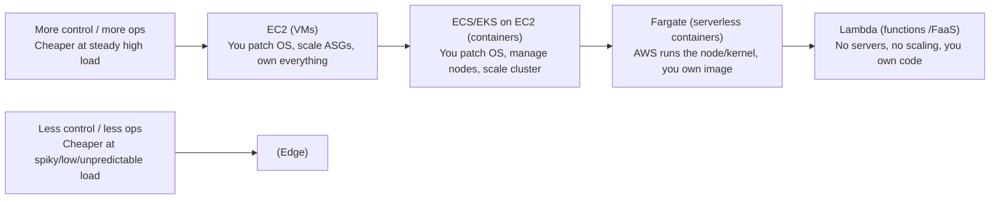

# AWS Compute: EC2, Containers, Fargate and Lambda Trade-offs

Choosing a compute platform is one of the highest-leverage decisions in an AWS
design. It sets the floor on latency, the ceiling on scale, the shape of the cost
curve, and how much operational work your team owns forever. Interviewers probe
this because the *right* answer is almost always "it depends" — and they want to
hear you reason about the dependencies: request duration, traffic shape (spiky vs
steady), latency budget, statefulness, packaging, team maturity, and cost.

This note walks the **compute spectrum** from "you manage everything" (EC2) to
"you manage almost nothing" (Lambda), and drills into the trade-offs of each.

---

## The compute spectrum from EC2 to Lambda

Think of AWS compute as a spectrum of *how much of the stack AWS manages for you*.
Moving right, you give up control and give up per-unit cost efficiency at steady
load, but gain elasticity, lower operational burden, and faster time-to-market.



**The four rungs:**

- **EC2 (virtual machines).** You rent a slice of a physical host: full OS control,
  any workload (GPU, huge memory, custom kernels, long-running daemons). You own
  patching, AMI hygiene, scaling policies, and bin-packing. Billed per second
  (Linux, 60s minimum) whether busy or idle.
- **Containers on ECS/EKS with the EC2 launch type.** You still run and pay for a
  fleet of EC2 instances, but a container orchestrator schedules many containers
  per instance, improving density and giving you fast, immutable deploys. You still
  patch and scale the *nodes*.
- **Fargate (serverless containers).** Same container image and orchestrator (ECS
  or EKS), but AWS owns the underlying host/kernel. You pick vCPU + memory per task;
  there are no instances to patch or bin-pack. You pay per task for its running
  time (per-second, 1-minute minimum).
- **Lambda (functions / FaaS).** You upload code (zip or container image); AWS runs
  it on demand in a micro-VM (Firecracker), scales to zero and to thousands of
  parallel executions automatically, and bills per-request + GB-second of actual
  execution. No idle cost. Constrained: max 15 min, max 10 GB memory, no persistent
  local state.

**The core trade-off:** as you move right you trade *control and steady-state unit
cost efficiency* for *elasticity, speed, and lower ops burden*. A steady 24×7 CPU-
bound service is cheapest on right-sized reserved EC2/Fargate; a spiky, event-driven,
low-average-utilization workload is cheapest and simplest on Lambda.

---

## EC2 instance families and sizing

EC2 exposes families tuned to a resource profile. Knowing the letters signals
seniority:

| Family prefix | Optimized for | Typical use |
|---|---|---|
| **T** (t3, t4g) | Burstable, CPU credits | Dev, low-traffic web, bursty microservices |
| **M** (m6i, m7g) | Balanced CPU:mem (~1:4) | General web/app servers |
| **C** (c6i, c7g) | Compute (~1:2) | Batch, HPC, gaming, ad serving, encoding |
| **R** (r6i, r7g) | Memory (~1:8) | In-memory caches, DBs, analytics |
| **X / z1d / u-** | Huge memory | SAP HANA, large in-memory DBs (up to 24 TB+) |
| **I / D / H** | Local NVMe / HDD storage | NoSQL, data warehouses, distributed FS |
| **P / G / Inf / Trn** | GPU / accelerators | ML training/inference, graphics |

**Graviton (the "g" suffix, e.g. m7g, c7g):** AWS ARM64 CPUs. Typically ~20% cheaper
and ~40% better price/performance than comparable x86 for many workloads, at the cost
of needing ARM-compatible builds. Interviewers like Graviton as a "free" cost lever
when the software runs on ARM.

**Burstable (T family) gotcha:** T instances accrue CPU credits when idle and spend
them under load. Sustained high CPU exhausts credits → the instance throttles to a
baseline (e.g. 20–40% of a vCPU) *unless* you enable **T-unlimited** (extra charge).
Trade-off: cheap for spiky/idle workloads; a trap for steady CPU-bound services,
where an M/C instance is more predictable and often cheaper overall.

**Sizing back-of-envelope:** 1,769 MB of memory ≈ 1 full vCPU worth of compute on
Lambda; on EC2 you size by peak concurrent work / per-request CPU+memory, then add
headroom for GC, spikes, and the failure of one AZ (N+1 across AZs).

---

## EC2 purchasing options and cost trade-offs

Same hardware, radically different price and commitment. This is a classic cost-
optimization interview thread.

| Option | Discount vs On-Demand | Commitment | Interruptible | Best for |
|---|---|---|---|---|
| **On-Demand** | 0% (baseline) | none | no | Spiky/unknown load, dev, short-lived |
| **Reserved Instances** | up to ~72% | 1 or 3 yr, specific family/region | no | Steady, predictable, fixed instance type |
| **Savings Plans** | up to ~72% | 1 or 3 yr, $/hour spend | no | Steady spend with flexibility across family/region/compute type |
| **Spot** | up to ~90% | none | **yes (2-min notice)** | Fault-tolerant, stateless, batch, flexible timing |

**Reserved Instances vs Savings Plans.** Both trade a 1- or 3-year commitment for a
big discount. RIs lock you to attributes (family/region, and for Standard RIs the
size); *Compute Savings Plans* commit to a dollars-per-hour of compute spend and
apply automatically across EC2 families, regions, Fargate, and Lambda — far more
flexible. Trade-off: RIs (especially Standard) can be slightly cheaper but are rigid
and only partly resellable; Savings Plans give flexibility for a hair less discount.
Modern default advice: **Compute Savings Plans** for the steady baseline.

**Spot.** AWS sells spare capacity at up to ~90% off, but can reclaim it with a
**2-minute interruption notice** when it needs the capacity back. Perfect for
stateless, checkpointable, or retry-safe work: batch, CI, big-data (EMR), rendering,
and stateless web behind an ASG. Design pattern: **diversify across many instance
types and AZs** (Spot fleets / ASG mixed instances) so one pool's reclamation doesn't
drain your whole fleet; keep an On-Demand/Savings-Plan baseline for the floor and
Spot for the elastic top. Never put a stateful primary or a job that can't tolerate a
2-minute kill purely on Spot.

**Blended pattern (very common answer):** baseline capacity on Savings Plans/RIs +
burst capacity on On-Demand + fault-tolerant batch on Spot. This minimizes cost while
protecting availability.

---

## Auto Scaling groups and launch templates

An **Auto Scaling Group (ASG)** maintains a desired count of EC2 instances across
multiple AZs, replaces unhealthy ones, and scales the count on policies. A **launch
template** (the modern replacement for launch configurations) is the versioned recipe
— AMI, instance type(s), key pair, security groups, user-data, IAM instance profile —
and supports **mixed instances policies** (multiple types + Spot/On-Demand split).

**Scaling policy types:**
- **Target tracking** — keep a metric at a target (e.g. avg CPU 50%, or
  ALBRequestCountPerTarget). Simplest; the default recommendation.
- **Step scaling** — add/remove N instances at metric thresholds.
- **Scheduled** — scale on a known clock (business hours, batch windows).
- **Predictive** — ML forecasts daily/weekly cycles and pre-warms capacity.

**Health checks & AZ resilience.** An ASG spanning 3 AZs with target-tracking gives
you self-healing and AZ-failure tolerance: lose an AZ, the ASG launches replacements
in the survivors (assuming capacity and per-AZ headroom). Trade-off vs serverless:
ASG scaling reacts in **tens of seconds to minutes** (instance launch + boot + app
warmup + health check), whereas Lambda/Fargate scale far faster. For sharp spikes,
either over-provision (cost) or use warm pools / predictive scaling.

**Trade-off:** ASGs give you full control and cheap steady-state compute, but you own
AMIs, boot time, and the reaction-lag problem. This is the main reason spiky
workloads migrate to Fargate/Lambda.

---

## Containers on AWS with ECS and EKS

Containers give immutable, portable artifacts and fast deploys. On AWS you pick an
orchestrator and a launch type (who runs the nodes):

- **Amazon ECS** — AWS's native orchestrator. Simpler, deeply integrated (IAM task
  roles, ALB, CloudWatch, Fargate), no control-plane fee. Concepts: task definition,
  task, service. Best when you want containers without Kubernetes overhead.
- **Amazon EKS** — managed Kubernetes. Portable (standard k8s API, Helm, operators),
  huge ecosystem, multi-cloud skills transfer — but more moving parts and a
  **control-plane charge (~$0.10/hr per cluster, ~$73/mo)**. Best when you need
  k8s-specific tooling or portability, or already have k8s expertise.

Both can run pods/tasks on either **EC2** or **Fargate** launch types (mix allowed).

**Trade-off ECS vs EKS:** ECS = lowest operational overhead and best AWS integration,
but AWS-proprietary. EKS = portability and the CNCF ecosystem, but more complexity and
a per-cluster fee. Interview heuristic: "no strong k8s requirement and an AWS-only
shop → ECS; existing k8s investment / multi-cloud / need operators → EKS."

---

## Fargate versus EC2 launch type for containers

Same image, same orchestrator; the question is *who owns the host*.

| Dimension | EC2 launch type | Fargate |
|---|---|---|
| Host/kernel patching | You | AWS |
| Bin-packing / density | You tune it (high density possible) | 1 task ≈ its own micro-VM; you pay reserved size |
| Billing granularity | Per instance (idle capacity paid) | Per task vCPU+GB, per-second, 1-min min |
| Task start latency | Fast if capacity exists | Slower cold task launch (image pull + provision) |
| Right-sizing | Coarse (instance) | Fine (per task) |
| GPU / special HW | Yes | No (Fargate has no GPU) |
| DaemonSet/privileged/host access | Yes | Limited |
| Steady high utilization cost | Cheaper (dense, RIs/SP/Spot) | More expensive per unit |

**Fargate resource combinations (know these):** vCPU from 0.25 up to **16 vCPU**;
memory up to **120 GB**; supported CPU/mem pairs are constrained (e.g. 0.25 vCPU →
0.5/1/2 GB; 4 vCPU → 8–30 GB; 16 vCPU → 32–120 GB). Ephemeral storage **default 20 GB,
configurable up to 200 GB** (platform 1.4.0+). No GPU.

**Trade-off / when to pick.** Fargate wins when you want zero node management, spiky
or bursty per-service load, small teams, or many small services (no bin-packing
headache). EC2 launch type wins for **cost at steady high utilization** (dense packing
+ Spot + Savings Plans), **GPU/accelerators**, DaemonSets, or workloads needing host-
level access. Common modern pattern: **Fargate for baseline services + EC2 Spot for
big batch/GPU**, or Fargate Spot for interruption-tolerant tasks (up to ~70% off).

---

## Lambda execution model, concurrency and cold starts

Lambda runs your handler inside an execution environment (a Firecracker micro-VM).
The lifecycle: **INIT** (download code, start runtime, run init/static code — this is
the *cold start*) → **INVOKE** (run handler) → environment is kept **warm** and reused
for subsequent invocations → eventually reaped. Warm invocations skip INIT.

**Concurrency = number of environments running simultaneously.** Each environment
handles **one request at a time**; N concurrent requests need N environments. There is
no per-environment request multiplexing.

- **Account concurrency default: 1,000** per Region (soft limit, raise via Service
  Quotas to tens of thousands).
- **Scaling rate: up to 1,000 new execution environments every 10 seconds, per
  function** (the modern per-function burst model, replacing the old shared
  account-level burst pool).
- **Reserved concurrency** — carves out a guaranteed slice for a function (and caps it
  at that number). Protects critical functions and protects downstream (e.g. a small
  RDS) from being overwhelmed.
- **Provisioned concurrency** — pre-initializes and keeps N environments warm so there
  are **no cold starts** for that many concurrent requests. You pay for them whether
  used or not. Pair with Application Auto Scaling to schedule/scale it.

**Cold starts.** First invocation on a fresh environment pays INIT latency:
- Interpreted/small (Node, Python) with small deps: tens to low hundreds of ms.
- JVM/.NET or large dependency graphs / large container images: hundreds of ms to
  multiple seconds.
- **VPC-attached** Lambdas historically added seconds for ENI setup; since the Hyperplane
  ENI improvement (2019) that penalty is largely gone, but it's a classic gotcha.

Mitigations: smaller packages, lazy-load heavy deps, **provisioned concurrency**,
SnapStart (Java/others — snapshot the initialized VM), avoid oversized runtimes,
Graviton (arm64) for cheaper/faster. Trade-off: provisioned concurrency removes cold
starts but reintroduces idle cost — you're paying for warm capacity, eroding the
"scale to zero" benefit.

**CPU is proportional to memory.** You dial memory 128 MB–10,240 MB; CPU scales with
it (≈1 vCPU at 1,769 MB, up to ~6 vCPU at 10 GB). Counterintuitive tuning result:
raising memory can make a CPU-bound function *finish faster and cost less* overall
(GB-seconds drop as duration drops). Use AWS Lambda Power Tuning to find the sweet spot.

---

## Lambda limits, invocation models and event sources

**Hard/soft limits that shape designs (memorize):**
- **Timeout: 900 s (15 min)** hard max.
- **Memory: 128 MB–10,240 MB.**
- **Ephemeral `/tmp`: 512 MB–10,240 MB (10 GB).**
- **Deployment package: 50 MB zipped (250 MB unzipped incl. layers); container image up
  to 10 GB.**
- **Payload: 6 MB request and 6 MB response (synchronous); 1 MB (asynchronous).**
  Response streaming allows up to 200 MB.
- **Up to 5 layers**, env vars aggregate 4 KB.

**Invocation models:**
- **Synchronous (request/response)** — caller waits (API Gateway, ALB, direct
  Invoke). Errors returned to caller; caller owns retries. Note **API Gateway caps
  integration timeout at 29 s**, so a Lambda behind it effectively can't run 15 min in
  a request/response path.
- **Asynchronous (event)** — Lambda queues the event and returns immediately; Lambda
  retries **twice** on failure, then sends to a **dead-letter queue / on-failure
  destination**. Used by S3, SNS, EventBridge.
- **Poll-based / event source mapping** — Lambda polls **SQS, Kinesis, DynamoDB
  Streams, Kafka** and invokes in batches. For Kinesis/DynamoDB Streams, ordering is
  per-shard and a poison-pill batch can block the shard until it expires or you
  configure bisect-on-error / max-retry / on-failure destination.

**Design implication:** if a task can exceed 15 min (large ETL, video transcode, long
ML), Lambda is the wrong tool — use Fargate/ECS tasks, AWS Batch, or Step Functions to
orchestrate/chunk. If payloads exceed 6 MB, use the **claim-check pattern** (put the
blob in S3, pass the pointer).

---

## When serverless is the wrong choice

Serverless (Lambda + Fargate) is a fantastic default, but it has clear anti-patterns.
Naming them is a senior signal:

- **Long-running work (> 15 min).** Lambda's hard timeout kills it. Use Fargate/EC2/Batch.
- **Steady, high, predictable load 24×7.** At high sustained utilization, always-on
  reserved EC2/Fargate is materially cheaper than per-invocation Lambda. Lambda's cost
  curve is linear in usage with no volume floor benefit; a busy service crosses over.
- **Very low, consistent latency / no cold-start tolerance.** Cold starts add jitter;
  even provisioned concurrency has cost and cannot beat a hot, pinned EC2/container for
  the tightest p99s in HFT-like or sub-ms paths.
- **GPU / specialized hardware.** Lambda and Fargate have no GPU — use EC2 P/G/Inf/Trn
  or ECS/EKS on GPU EC2.
- **Large in-memory footprint (> 10 GB) or heavy local disk (> 10 GB /tmp).** Exceeds
  Lambda limits.
- **Chatty, stateful, or connection-heavy workloads.** Lambda has no durable local
  state and each environment opens its own DB connections → connection storms. Mitigate
  with **RDS Proxy** or move to containers. WebSockets/long-lived connections fit
  containers better (though API Gateway WebSocket + Lambda works for many cases).
- **Predictable batch/stream at scale where per-invoke overhead dominates.** Sometimes a
  Fargate consumer is cheaper and simpler than millions of tiny Lambda invokes.

Rule of thumb interviewers like: **"Serverless-first for spiky, event-driven, and glue
workloads; containers/EC2 for steady, long-running, stateful, or specialized compute."**

---

## Cost and operational burden trade-offs

Two different axes; don't conflate them.

**Unit cost vs utilization (the crossover):**
```
 $/month
   │            Lambda (linear in requests, zero idle cost)
   │           /
   │          /            ┌────────── EC2/Fargate reserved (flat, cheap once busy)
   │         /        _____/
   │        /   _____/
   │   ____/___/  ← crossover: below it Lambda wins, above it reserved wins
   │__/____/________________________________ utilization / traffic →
```
- **Low or spiky utilization** → Lambda/Fargate on-demand: you pay ~nothing when idle.
- **High steady utilization** → reserved EC2/Fargate + Savings Plans/Spot: the flat
  committed rate beats per-invocation pricing.

**Operational burden (Total Cost of Ownership, not just the bill):** EC2 = you own
OS patching, AMI pipeline, scaling tuning, capacity planning, security hardening.
Fargate removes host management. Lambda removes servers entirely and gives built-in
scaling, so a tiny team ships faster. For many orgs the **engineering time saved**
dominates the raw compute bill — a slightly pricier serverless option can be the
cheaper *total* choice. Always frame cost as bill **plus** ops labor **plus**
opportunity cost of time-to-market.

**Estimation example.** A function: 128 MB, 100 ms avg, 50M invokes/month. GB-seconds
= 50M × 0.1 s × (128/1024) GB ≈ 625k GB-s → a few dollars of compute + ~$10 request
charge. Same load steady at, say, 20 req/s continuously could sit on one small
right-sized instance — compare both before deciding.

---

## Trade-offs and when to use what

The master comparison interviewers want you to be able to produce from memory:

| Dimension | EC2 | ECS/EKS on EC2 | Fargate | Lambda |
|---|---|---|---|---|
| Unit of compute | VM | Container on your VMs | Container (managed host) | Function invocation |
| Who patches OS/host | You | You (nodes) | AWS | AWS |
| Scaling speed | Slow (min) | Medium | Fast | Fastest (to zero & thousands) |
| Max run time | Unlimited | Unlimited | Unlimited | **15 min** |
| Max memory | TBs | Instance-bound | 120 GB | 10 GB |
| GPU / special HW | Yes | Yes | No | No |
| Idle cost | Full | Full (nodes) | Per running task | **Zero** |
| Steady-load unit cost | Lowest (RI/SP/Spot) | Low | Medium | Highest |
| Ops burden | Highest | High | Low | Lowest |
| Best for | Legacy, stateful, GPU, custom kernel, max control | Portable containers, dense packing | Bursty services, small teams, no node mgmt | Event-driven, spiky, glue, unpredictable |

**Decision heuristics (say these out loud in an interview):**
1. **Event-driven / spiky / unpredictable / low average load** → **Lambda** (scale to
   zero, pay per use, no ops). Watch 15-min, 10 GB, 6 MB, cold-start limits.
2. **Containerized services, bursty, small team, no node management** → **Fargate**.
3. **Steady high utilization, GPU, dense packing, cost-critical, host access** →
   **EC2 or ECS/EKS on EC2** with Savings Plans + Spot.
4. **Need Kubernetes ecosystem / portability** → **EKS**; otherwise **ECS**.
5. **Long-running or orchestrated multi-step** → Fargate/Batch/Step Functions, not raw
   Lambda.
6. **Blend:** Savings-Plan baseline + On-Demand burst + Spot for fault-tolerant batch is
   the canonical cost-optimal fleet.

---

## Failure modes and how designs degrade

- **AZ failure.** ASG/ECS/EKS spanning ≥2–3 AZs relaunch capacity in survivors; you need
  **per-AZ headroom (N+1)** or scaling lag/capacity shortfalls cause a brownout. Fargate
  and Lambda are regional and spread across AZs automatically.
- **Region failure.** None of these span regions by themselves. Multi-region needs
  active-active or active-passive with data replication, Route 53 failover, and
  idempotent design — an explicit, expensive choice.
- **Throttling.** Hit Lambda concurrency → **429 TooManyRequests** (sync) or events
  retried/queued (async). Fix: raise limit, reserved concurrency, SQS buffer in front to
  absorb spikes and smooth to a safe rate.
- **Spot reclamation.** 2-minute notice; undiversified Spot fleets can be drained en
  masse. Mitigate with instance diversification, capacity-optimized allocation, and an
  On-Demand baseline.
- **Cold-start latency spikes** during sudden scale-up show as p99 tail latency; smooth
  with provisioned concurrency or SnapStart.
- **Downstream overload (connection storms).** Lambda scaling to thousands can crush a
  small database; guard with reserved concurrency and **RDS Proxy** (connection pooling),
  or queue-based load leveling.
- **Poison-pill in stream/queue.** A bad record can block a Kinesis/DynamoDB Streams shard;
  configure bisect-on-error, max retry age, and an on-failure destination/DLQ.

**Cell-based / modern patterns.** For blast-radius control, partition into independent
**cells** (each a full stack serving a subset of customers) so a failure or poison
tenant is contained. Queue-based load leveling (SQS in front of Lambda/Fargate) turns
spiky sync traffic into smooth async processing and decouples producer from consumer
scaling.

---

## Common interview follow-up questions

- "This service runs 24×7 at ~70% CPU. Lambda or EC2/Fargate, and how would you buy the
  capacity?" (Reserved/Savings-Plan EC2/Fargate; Lambda's per-invoke cost loses at
  steady high load.)
- "A job occasionally takes 25 minutes. Can it run on Lambda?" (No — 15 min cap; use
  Fargate/Batch or chunk via Step Functions.)
- "Requests spike from 10 to 10,000 rps in seconds. Which platform reacts fastest and how
  do you avoid cold-start tail latency?" (Lambda; provisioned concurrency / SnapStart /
  SQS buffering.)
- "How do you cut cost on a stateless web tier without hurting availability?" (ASG mixed
  instances: Savings-Plan/On-Demand baseline across AZs + Spot for burst; Graviton.)
- "ECS or EKS for a green-field AWS-only shop?" (ECS — lower ops, no control-plane fee —
  unless you need the Kubernetes ecosystem/portability.)
- "Fargate vs EC2 launch type for a fleet of small microservices?" (Fargate — no bin-
  packing/patching; switch to EC2 for dense steady load, GPU, or host access.)
- "Lambda is overwhelming your RDS with connections — fix it." (RDS Proxy + reserved
  concurrency, or queue-based load leveling.)
- "What's the primary trade-off of provisioned concurrency?" (Removes cold starts but
  reintroduces idle cost — you pay for warm environments regardless of use.)
- "Why might raising a Lambda's memory *lower* its cost?" (CPU scales with memory; a
  CPU-bound function finishes faster, dropping GB-seconds.)

## References

- AWS Lambda Developer Guide — Lambda quotas; Understanding Lambda function scaling;
  Configuring reserved/provisioned concurrency; Invocation models.
- AWS Fargate / Amazon ECS Developer Guide — Fargate task CPU/memory combinations and
  ephemeral storage; launch types; platform versions.
- Amazon EC2 User Guide — instance types & families; purchasing options (On-Demand,
  Reserved, Spot); Spot Instance interruption notices.
- AWS Auto Scaling User Guide — launch templates, mixed instances policies, target
  tracking / predictive scaling, warm pools.
- AWS Savings Plans User Guide — Compute vs EC2 Instance Savings Plans.
- AWS Well-Architected Framework — Cost Optimization and Performance Efficiency pillars.
- The Amazon Builders' Library — "Reliability, constant work, and a good cup of coffee";
  "Workload isolation using shuffle sharding"; static stability & cell-based architecture.
- re:Invent deep-dive sessions on serverless architectures, container cost optimization,
  and Lambda internals (Firecracker); AWS Prescriptive Guidance on compute selection.
- AWS Lambda Power Tuning (open-source) for memory/cost optimization.
