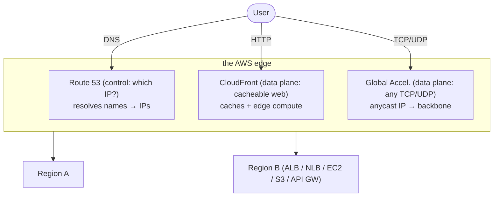
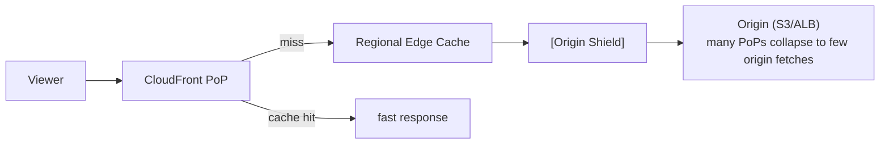
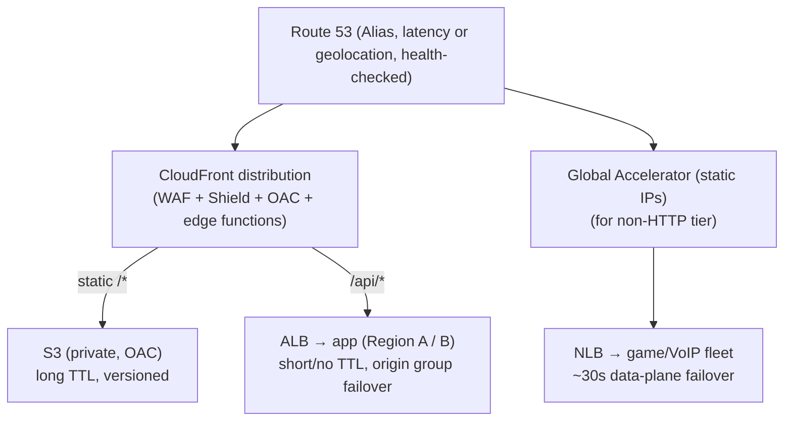

# Edge, DNS and CDN: Route 53, CloudFront and Global Accelerator

The "edge" is everything that happens between a user's device and your regional
infrastructure: name resolution (DNS), content delivery (CDN), and network-path
optimization (anycast front doors). In a system-design interview these three AWS
services — **Route 53** (managed authoritative DNS + health-based routing),
**CloudFront** (HTTP CDN + edge compute), and **Global Accelerator** (anycast static
IPs over the AWS backbone) — are the tools you reach for when the question mentions
*global users*, *low latency*, *high availability across regions*, *DDoS*, or *static
IPs*. The interesting part is almost never "what is a CDN"; it is **which of the three
you pick, in what combination, and what you give up**.

Mental model of the three layers:

- **Route 53 is control plane for names**: it hands the client an IP (or a set of
  IPs) and can make that decision based on latency, geography, weight, or health. It
  does *not* sit in the request path — once the client has the IP, Route 53 is out of
  the loop until the DNS TTL expires.
- **CloudFront is a data-plane CDN for HTTP(S)**: it terminates the connection at a
  Point of Presence (PoP), serves from cache when it can, and fetches from the origin
  when it must. It only speaks HTTP/HTTPS and only helps when content is cacheable
  *or* when you want TLS termination / edge compute close to users.
- **Global Accelerator is a data-plane network accelerator for any TCP/UDP**: it gives
  you two static anycast IPs, terminates the connection at the nearest edge, and rides
  the AWS backbone to a regional endpoint. It does **not cache**; it optimizes the
  *path* and provides instant regional failover.

---

## Edge networking mental model: PoPs, anycast, and the AWS backbone

**Points of Presence (PoPs).** AWS operates 700+ CloudFront PoPs (edge locations plus
a smaller tier of regional edge caches) across 100+ cities. A PoP is a cache + TLS
terminator + compute host close to users. Latency to a nearby PoP is typically single
-digit to low-tens of milliseconds versus 100–300 ms to a distant origin region.

**Why terminating at the edge helps even for uncacheable content.** A TLS handshake is
1–2 round trips; TCP setup is another. Doing those against a PoP 10 ms away instead of
an origin 150 ms away saves 300–600 ms of setup before the first byte. The edge then
reuses a warm, pooled connection to the origin over the **AWS backbone** (private,
congestion-managed fiber) rather than the public internet, which reduces jitter and
packet loss. This is the core reason CloudFront and Global Accelerator help dynamic,
non-cacheable traffic — not caching, but *proximity + backbone*.

**Worked trace — user in Tokyo, origin in us-east-1, content NOT cacheable.** Take
RTT(Tokyo↔us-east-1) ≈ 160 ms and RTT(Tokyo↔local PoP) ≈ 8 ms. A cold HTTPS request
pays 3 round trips of setup before the first byte: 1 RTT for the TCP handshake + 2 RTTs
for a TLS 1.2 handshake.

- **Direct to origin:** setup = 3 × 160 ms = **480 ms**, then the actual HTTP
  request/response adds 1 more RTT = 160 ms → **≈ 640 ms to first byte**.
- **Via CloudFront PoP:** the viewer does that same 3-RTT TCP+TLS setup against the PoP
  8 ms away = 3 × 8 = **24 ms**. The PoP already holds a *warm, pooled* connection to the
  origin (no per-request TCP/TLS setup), so fetching the uncacheable object costs one
  backbone round trip ≈ 140 ms (backbone is comparable-or-lower latency than public
  internet, with far less jitter) → **≈ 164 ms to first byte**.

That's **~476 ms faster on a request that hit the cache 0%** — the ~456 ms saved is
purely the setup handshakes moving from the 160 ms origin to the 8 ms PoP, which is
exactly the "300–600 ms of setup" the section above claims. Repeat-visit and keep-alive
connections narrow the gap, but the first-byte win on cold/dynamic traffic is real.

**Anycast.** A single IP address is advertised (BGP) from many locations at once; the
internet routes each client to the topologically nearest advertisement. Global
Accelerator gives you **2 static anycast IPv4 addresses** (from the AWS IP pool or your
own BYOIP), optionally dual-stack IPv6. CloudFront also uses anycast internally but
exposes a **DNS name** (e.g. `d123.cloudfront.net`), not a static IP you can hardcode.

**Latency ballparks to keep in your head:**

| Hop | Typical RTT |
|---|---|
| Client → nearby edge PoP | 5–30 ms |
| Cross-continent public internet | 100–300 ms |
| Same-region intra-AZ | < 1–2 ms |
| Cross-region over AWS backbone | 30–150 ms (region-pair dependent) |

---

## Route 53 authoritative DNS, hosted zones, and record types

**What Route 53 is.** A highly available, authoritative DNS service (the "53" is the
DNS port). It answers queries for the domains you host. It is *not* primarily a
recursive resolver for arbitrary lookups (that role is Route 53 Resolver inside a VPC);
as a public service it is the **authoritative** source for your zones. Its
authoritative query-serving control plane carries a **100% availability SLA** — the
strongest AWS offers — because DNS is the front door to everything.

**Hosted zones.**
- A **public hosted zone** answers queries from the internet for a domain (e.g.
  `example.com`). Creating it gives you 4 assigned **NS** records (a delegation set);
  you point your registrar at those name servers.
- A **private hosted zone** is associated with one or more VPCs and answers only from
  inside them — used for internal service discovery / split-horizon DNS.

**Record types you must know.**
- **A / AAAA** — name → IPv4 / IPv6 address.
- **CNAME** — alias one name to another name. Cannot exist at the **zone apex**
  (`example.com` itself) because a CNAME can't coexist with the SOA/NS records there.
- **Alias record** — an AWS-specific extension that maps a name directly to an AWS
  resource (CloudFront distribution, ALB, S3 website, another Route 53 record, Global
  Accelerator, API Gateway). Unlike CNAME it **works at the zone apex**, is resolved
  internally (no extra DNS lookup, no charge for alias queries to AWS resources), and
  auto-tracks the target's changing IPs. **Use Alias, not CNAME, whenever the target
  is an AWS resource.**
- **MX** (mail), **TXT** (SPF/DKIM/verification), **NS**, **SOA**, **SRV**, **PTR**,
  **CAA** (which CAs may issue certs), **NAPTR**.

**TTL and its trade-off.** Each record has a TTL telling resolvers how long to cache
the answer. **Low TTL (30–60 s)** = fast failover / fast change propagation, but more
queries (more cost) and more load; also many resolvers ignore very low TTLs. **High
TTL (hours)** = cheap, resilient to Route 53 blips, but slow to react to failover.
Alias records to health-checked resources sidestep some of this because the *record
set* changes without waiting for client cache. DNS-based failover is fundamentally
limited by TTL + resolver caching + client caching — this is why it can take minutes,
and why Global Accelerator (which fails over *inside* the data plane, no DNS change) is
faster for hard availability requirements.

---

## Route 53 routing policies: choosing among them

Route 53 attaches a **routing policy** to a record name; when multiple records share a
name, the policy decides which one(s) to return. Interviewers love "which policy?"
scenarios. The eight policies:

| Policy | Decision basis | Classic use |
|---|---|---|
| **Simple** | Single record, no logic | One resource, no HA logic |
| **Weighted** | Split traffic by integer weights | Canary / blue-green / A-B, gradual shift |
| **Latency-based (LBR)** | Lowest *measured* AWS-network latency to a Region | Multi-region, "fastest for the user" |
| **Geolocation** | Continent / country / US state of the user | Compliance, localization, geo-blocking |
| **Geoproximity** | Distance user↔resource, with a **bias** to expand/shrink a region's pull | Shift traffic geographically by a dial |
| **Failover** | Active-passive via health check | DR: primary, else secondary |
| **Multivalue answer** | Returns up to **8** healthy records at random | Simple client-side LB with health checks |
| **IP-based** | Client CIDR block → endpoint (you supply a CIDR-to-location map) | ISP-aware routing, known corporate ranges |

**Key distinctions interviewers probe:**
- **Latency-based vs geolocation.** LBR routes to the Region with the *lowest network
  latency* for that user (AWS-measured, not raw distance). Geolocation routes by the
  user's *physical location* regardless of latency — you use it for **compliance /
  data-residency / language**, not performance. "Route EU users to the Frankfurt stack
  for GDPR" = geolocation; "give every user the fastest region" = latency.
  - *How LBR "knows" latency before you connect:* it does **not** probe per request. AWS
    continuously measures latency between networks (by prefix) and AWS Regions from real
    traffic and maintains a **latency database keyed by network prefix**; at query time
    LBR just looks up the querying network in that table and returns the best Region.
- **Geolocation vs geoproximity.** Geolocation is discrete buckets (country/state) with
  a "default" fallback. Geoproximity is continuous distance with a **bias** knob that
  lets you *shift* traffic (e.g. expand `us-east-1`'s catchment to offload another
  region). Geoproximity requires **Route 53 Traffic Flow** (traffic policies).
- **Multivalue vs simple with multiple IPs.** Simple routing can return multiple IPs in
  one record but does **no health checking** — dead IPs still get returned. Multivalue
  answer returns up to 8 records, **each independently health-checked**, so unhealthy
  endpoints are omitted. It is *not* a substitute for a real load balancer (no session
  affinity, no connection-based balancing) but is a cheap, DNS-level way to spread load
  with health awareness.
- **Weighted for deployments.** Set weights 99/1 to send 1% to a new stack (canary),
  then ramp. Weight 0 disables a record. Because it is DNS, shifting is subject to TTL
  and is coarse — for precise, instant traffic splitting prefer an ALB weighted target
  group or App Mesh.

> [!INTERVIEW]
> **Whose location does Route 53 actually see?** Latency-based and geolocation routing
> decide from the **recursive resolver's IP**, not the client's — Route 53 never sees the
> end user directly, only whoever forwarded the query. The bridge is **EDNS Client Subnet
> (ECS)**: if the resolver forwards a truncated client subnet, Route 53 can approximate
> the real user; if it doesn't, the resolver's own location wins.
> *Failure mode:* a corporate office in Sydney whose DNS is centralized through a resolver
> in London gets routed as if it were in London; a user on a public resolver (e.g.
> `8.8.8.8`) can be answered from the resolver's PoP, not their own. This is exactly why
> **geolocation is not a hard compliance guarantee at the DNS layer** — enforce
> data-residency at the application/auth tier, not just in the routing policy.

**Nesting.** Traffic Flow lets you nest policies (e.g. geolocation → then latency
within a continent → then weighted for canary). Powerful but adds config complexity and
another thing that can misroute.

---

## Route 53 health checks and DNS failover for DR

**Health checks** are what turn Route 53 from a static name server into an
availability tool. Three types:
1. **Endpoint checks** — Route 53's global fleet of checkers probes an IP/domain over
   HTTP/HTTPS/TCP on an interval (**30 s standard, 10 s "fast"**), from ~15+ global
   locations; an endpoint is unhealthy if a configured fraction of checkers fail. You
   can require a **string match** in the first 5,120 bytes of the response body.
2. **Calculated (parent) checks** — combine child checks with AND/OR/threshold logic
   (e.g. "healthy if ≥ 3 of 5 children healthy").
3. **CloudWatch alarm checks** — health follows a CloudWatch alarm state; the only way
   to health-check something not directly reachable (e.g. DynamoDB throttling, queue
   depth, private resources).

**Failover routing** pairs a **primary** and **secondary** record, each tied to a
health check. When the primary's check fails, Route 53 stops returning it and returns
the secondary. Combined with **Alias + "Evaluate Target Health"**, an ALB/CloudFront
target's own health propagates automatically.

**DR patterns and their RTO/cost trade-offs:**

| Pattern | Standby cost | Failover mechanism | Typical RTO |
|---|---|---|---|
| Backup & restore | Lowest | Manual / IaC redeploy | Hours |
| Pilot light | Low | Scale up minimal core, then DNS failover | 10s of min |
| Warm standby | Medium | Scale up running-but-small stack, DNS failover | Minutes |
| Active-active (multi-region) | Highest | LBR/weighted, no "failover" — just remove region | Seconds–low min |

**The DNS-failover limitation.** Even with a 60 s TTL and 10 s health checks, real
failover time = detection (up to ~30 s) + TTL expiry (up to 60 s) + resolver/client
caching (often longer, and some clients cache forever). So DNS failover realistically
takes **1–several minutes** and cannot guarantee a fast RTO. When the requirement is
*seconds* of failover with no dependence on client DNS behavior, use **Global
Accelerator** (data-plane failover) or an active-active design behind it.

**Worked timeline — why "60 s TTL" is not 60 s of downtime.** Assume standard 30 s
endpoint checks, primary record TTL = 60 s, and a resolver that happened to cache the
primary A record 5 seconds before the outage:

| Wall clock | Event |
|---|---|
| t = −5 s | A resolver caches `primary = 203.0.113.10`, TTL 60 → this cached copy is valid until **t = 55 s** |
| t = 0 s | Primary origin dies; it is now returning errors / not answering |
| t = 0–30 s | Route 53's ~15+ global health checkers observe the failures; the endpoint isn't declared unhealthy until enough checkers agree |
| t ≈ 30 s | Route 53 flips the primary to unhealthy and starts handing the **secondary** IP to any *new* query |
| t = 30–55 s | The resolver that cached at t = −5 s **keeps serving the dead `203.0.113.10`** — Route 53's change can't reach into an already-cached answer |
| t ≈ 55 s | That resolver's TTL finally expires; its next query gets the secondary. **Recovery ≈ 55 s for that user** |
| t = minutes+ | A browser/OS/JVM client that pins DNS (ignores TTL, caches for the process lifetime) can keep hitting the dead IP far longer |

So detection (~30 s) and cache expiry (~25 s remaining here) stack to ~55 s in the
*lucky* case, and unbounded when a client pins DNS — hence "1–several minutes."

**Same outage under Global Accelerator:** the client is still using the **same two
static anycast IPs**; there is no A record to expire. At t = 0 the origin dies; GA's
continuous health checks detect it and, at **t ≈ 30 s or less**, the edge simply steers
new connections to the healthy endpoint group over the backbone. No resolver, no TTL,
no pinned-DNS tail — recovery is bounded at ~30 s regardless of client DNS behavior.

---

## CloudFront: CDN caching, origins, and cache behaviors

**What it is.** A pull-based HTTP/HTTPS CDN. You define a **distribution** with one or
more **origins** and a set of **cache behaviors** that map URL path patterns to an
origin + policy. Viewers hit the nearest PoP; on a **cache hit** the PoP serves
instantly; on a **miss** it fetches from the origin (optionally via a **regional edge
cache** and **Origin Shield**), caches per the rules, and serves.

**Origins.**
- **S3 bucket** (via **Origin Access Control, OAC**) — the canonical way to serve
  static assets / SPA bundles / media; the bucket stays private and only CloudFront can
  read it.
- **S3 static website endpoint** — needed only for website features like index docs /
  redirects (but that endpoint is HTTP-only and public).
- **ALB / EC2 / any custom HTTP origin** (including non-AWS) — for dynamic content and
  APIs. CloudFront in front of an ALB gives edge TLS, WAF, caching of cacheable routes,
  and shields the origin.
- **API Gateway / Lambda function URL** — serverless origins.
- **Origin groups** — a primary + failover origin for **origin-level failover** on
  specified status codes (e.g. 500/502/503/504) — CDN-level HA distinct from Route 53.

**Cache behaviors.** Ordered path patterns (`/images/*`, `/api/*`, default `*`). Each
behavior sets: allowed HTTP methods, viewer protocol policy (redirect-to-HTTPS),
cache policy, origin request policy, response headers policy, whether to compress,
edge-function associations, and TTLs. Classic split: `/*` static → long TTL cached;
`/api/*` dynamic → cache disabled (or short) but still benefit from edge TLS + backbone.

**Architecture:**

**Performance facts.** CloudFront supports **HTTP/2 and HTTP/3 (QUIC)**, TLS 1.3, and
Brotli/Gzip compression at the edge. It integrates free **AWS Certificate Manager**
certs (must be in **us-east-1** for CloudFront). Data transfer *out to the internet*
from CloudFront is billed per-GB by region tier plus per-10,000-requests; **origin
fetch traffic from AWS origins to CloudFront is free** (a major reason to front S3/ALB
with CloudFront — you both cache and cut egress).

---

## CloudFront cache keys, TTLs, and invalidation

**The cache key** determines what counts as "the same object." By default it is the
host + path. You extend it with a **cache policy** to include selected query strings,
headers, and cookies. The trade-off is central:
- **Include more in the key** (e.g. all query strings) → more correctness/personalization
  but **lower hit ratio** (cache fragmentation) and more origin load.
- **Include less / normalize the key** → higher hit ratio, but risk serving the wrong
  variant. Use a **CloudFront Function** on viewer-request to *normalize* the key
  (strip tracking params, lowercase, bucket values) for the best of both.
- Forwarding **all headers or `*` cookies** effectively disables caching — a common
  interview "why is my hit ratio 0%?" gotcha.

**Origin request policy vs cache policy.** These were split precisely because you often
want to *forward* something to the origin (so it can act on it) **without** putting it
in the cache key. Example: forward the `Authorization` header to the origin but don't
key on it.

**TTL controls.** Min/Default/Max TTL on the behavior, but the origin's
`Cache-Control`/`Expires` headers usually win within those bounds. `s-maxage` targets
shared caches (CDN) specifically. `Cache-Control: no-store` / `private` opt out.

**Invalidation vs versioning.**
- **Invalidation** removes objects from every PoP by path (`/images/logo.png` or
  `/images/*`). **First 1,000 paths/month are free**, then billed per path;
  wildcard-heavy invalidations are slow (seconds–minutes) and are an anti-pattern for
  frequent deploys.
- **Versioned object names** (`app.abc123.js` — fingerprinted) is the **preferred**
  cache-busting strategy: new deploy = new URL, so you never invalidate, hit ratio
  stays high, and rollbacks are trivial. Reserve invalidation for emergencies.

**Stale-while-revalidate / stale-if-error** headers let the edge serve stale content
while refreshing or when the origin errors — cheap resilience.

---

## Securing CloudFront: signed URLs, signed cookies, and OAC

**Origin Access Control (OAC).** The current mechanism (replacing legacy **Origin
Access Identity, OAI**) to keep an S3 origin **private**: the bucket policy allows only
the CloudFront distribution's service principal (SigV4-signed requests), so users
cannot bypass the CDN by hitting the S3 URL directly. **OAC is required for**
SSE-KMS-encrypted objects and supports all Regions and dynamic requests (PUT/POST) —
prefer OAC for anything new. Always pair with **Block Public Access** on the bucket.

**Signed URLs and signed cookies** restrict *who* can access content (premium media,
private downloads):
- **Signed URL** — grants access to **one file**; the URL carries an expiry and policy,
  signed by a key in a **CloudFront key group** (modern) or a trusted-signer account
  (legacy). Use for a single file or when the client can't handle cookies (e.g. a
  native media player fetching a specific object).
- **Signed cookies** — grant access to **many files matching a pattern** without
  changing each URL. Use for whole sections of a site or HLS/DASH streaming where the
  player requests many segment files.
- Both support **canned** (simple expiry) or **custom** (expiry + IP range + start
  time) policies.

**Field-level encryption** encrypts specific POSTed fields with a public key at the
edge so only a downstream service with the private key can read them (e.g. credit-card
number) — the CDN and app tiers never see plaintext.

**Defense in depth at the edge:** CloudFront + **AWS WAF** (web ACL, rate rules,
managed rule groups) + **Shield** + OAC + TLS-1.3 + `Strict-Transport-Security` via a
response-headers policy. This is the standard "secure public web front door."

---

## Edge compute: CloudFront Functions and Lambda@Edge

Two ways to run code *at the edge* in the CloudFront request lifecycle. Choosing
correctly is a common senior-level question.

| Dimension | **CloudFront Functions** | **Lambda@Edge** |
|---|---|---|
| Runtime | JavaScript (ECMAScript 5.1 / JS runtime 2.0) | Node.js, Python |
| Trigger points | **viewer request / viewer response only** | all four: viewer req/resp, **origin req/resp** |
| Duration | **sub-millisecond** | **5 s** (viewer events) / up to **30 s** (origin events) |
| Memory | 2 MB | 128 MB (viewer) / up to 10 GB (origin) |
| Max code size | 10 KB | 50 MB |
| Network / filesystem access | **No** | **Yes** (origin events) |
| Access to request **body** | No | Yes |
| Scale | millions rps | ~10,000 rps per Region |
| Runs at | 700+ edge PoPs | regional edge caches (fewer, larger) |
| Pricing | ~1/6th the cost per invocation | per-request + GB-seconds |

**Rule of thumb:** if it's a tiny, synchronous transform on *every* viewer request
(header rewrite, URL redirect/rewrite, cache-key normalization, JWT/HMAC token
validation, simple A/B cookie), use a **CloudFront Function** — it's cheaper, faster,
and scales to millions rps. If you need to **call another service, read the request
body, use big libraries/AWS SDK, or hook origin requests** (e.g. dynamic origin
selection, image resizing on the fly, SSR), use **Lambda@Edge**. CloudFront
**KeyValueStore** gives Functions a low-latency key-value lookup (feature flags,
redirect maps) without a network call.

**Trade-off vs doing it at the origin:** edge compute cuts latency and offloads the
origin, but it's harder to debug, deploys propagate globally (minutes), you can't
easily roll back a bad function instantly everywhere, and cold logic bugs affect *all*
traffic. Keep edge logic minimal and stateless.

---

## Origin Shield and multi-tier caching

**The problem it solves.** With hundreds of PoPs, a cache miss at each PoP (and each
regional edge cache) can independently hit your origin — for a popular-but-uncached or
just-expired object, that's a **thundering herd** of origin fetches (cache stampede at
CDN scale). It also hurts hit ratio for long-tail content spread across PoPs.

**Origin Shield** adds an **extra centralized caching layer** in a Region you choose
(place it near the origin). All regional edge caches funnel misses through the shield,
so the origin sees at most one fetch per object even under a herd, and **request
collapsing** dedupes concurrent misses for the same object into one origin request.

**Trade-offs.**
- **Gain:** higher offload / hit ratio (especially for many origins, live video, or
  large libraries), fewer origin requests, lower origin cost/load, better resilience.
- **Give up:** an **extra hop** (a few ms) on true misses, and **extra cost** (billed
  per request through the shield). If your object catalog is small and hot, the base
  two-tier cache (PoP → regional edge cache) already collapses most traffic and Origin
  Shield adds cost for little gain.
- **When to use:** many origins/behaviors, low aggregate hit ratio, expensive or
  fragile origins, live streaming, or when you want to pin origin fetches to one Region
  for compliance. Place the shield in the **Region closest to your origin**.

---

## AWS Global Accelerator: anycast static IPs at the network layer

**What it is.** A networking service that provides **2 static anycast IPv4 addresses**
(and optional IPv6) as a fixed front door for your application. Traffic enters at the
nearest of 100+ edge locations and rides the **AWS global backbone** to your regional
endpoints, instead of traversing the public internet the whole way.

**How it works.**
- You create an **accelerator** → one or more **listeners** (TCP or UDP ports) →
  **endpoint groups** (one per Region) → **endpoints** (ALB, NLB, EC2 instance, or
  Elastic IP).
- **Anycast** routes each user to the closest edge; from there AWS chooses the best
  healthy endpoint group over the backbone.
- **Traffic dials** on an endpoint group let you cap the % of traffic a Region receives
  (for gradual cutover / blast-radius control). **Endpoint weights** split within a
  group.
- **Health checks** run continuously; on failure GA **reroutes in the data plane in ~30
  seconds or less — no DNS change, no TTL wait**, so clients keep using the same two
  IPs. This is the headline availability advantage over Route 53 failover.

**Key properties for design:**
- Layer-3/4: works for **any TCP or UDP** protocol — gaming, VoIP, IoT/MQTT, SIP, SFTP,
  push notifications, non-HTTP APIs. Not just web.
- **Static IPs** you can allowlist in enterprise firewalls and hardcode in IoT/mobile
  clients that can't do DNS updates — a frequent driver.
- **Does not cache** and does not understand HTTP semantics.
- **Client IP preservation** available for ALB/EC2 endpoints.
- Protected by **AWS Shield Standard** at the two static IPs by default.
- **Custom routing accelerators** deterministically map a client to a specific EC2
  instance/port (multiplayer game sessions, media rooms).

**Cost.** A fixed hourly charge per accelerator **plus** a **data-transfer-premium
(DTP)** per-GB fee on top of standard transfer — so GA is not free path optimization;
you pay for the backbone premium.

---

## Global Accelerator versus CloudFront: the key trade-off

This is the single most-tested comparison in this topic. Both are "AWS edge front
doors" using anycast, but they operate at different layers and solve different
problems.

| Dimension | **CloudFront** | **Global Accelerator** |
|---|---|---|
| Layer / protocol | L7, **HTTP/HTTPS only** | L4, **any TCP/UDP** |
| Caches content? | **Yes** (the whole point) | **No** |
| Entry point | **DNS name** (`*.cloudfront.net`) | **2 static anycast IPs** |
| Edge compute | CloudFront Functions, Lambda@Edge | None |
| Failover speed | origin groups / DNS-ish | **~30 s data-plane, no DNS** |
| Best for | cacheable web, media, SPAs, APIs w/ some caching | non-HTTP, static-IP needs, TCP/UDP, fast regional failover |
| Cost shape | egress + requests (origin fetch free) | fixed hourly + data-transfer premium |

**Decision guide:**
- **HTTP(S) and content is cacheable (or you want edge compute / WAF)** → **CloudFront**.
- **Non-HTTP (UDP gaming, VoIP, MQTT, SFTP), or you need static IPs to allowlist, or you
  need sub-minute regional failover for a TCP service** → **Global Accelerator**.
- **Both:** you *can* layer them — e.g. GA is mainly for non-cacheable/TCP-UDP; for a
  cacheable HTTP app GA gives little over CloudFront and costs more, so don't add GA to
  a pure CDN workload "for speed." Conversely, don't put CloudFront in front of a raw
  UDP game server — it can't.
- **Static IP + HTTP:** if you specifically need static IPs *and* HTTP, GA in front of
  an ALB is the pattern (CloudFront can't give you a hardcodable static IP).

**Both are compared against Route 53 latency routing:** Route 53 LBR also sends users
to the nearest region, but (a) it's DNS, so failover is TTL-bound and slow, and (b) the
data path is the public internet, not the backbone. GA/CloudFront terminate at the edge
and use the backbone, giving lower jitter and faster failover — at higher cost.

---

## Edge security: AWS Shield, WAF, and DDoS protection

The edge is your first line of defense because it absorbs attacks far from your origin.

- **AWS Shield Standard** — free, automatic, always-on protection against common
  L3/L4 DDoS (SYN/UDP floods, reflection) for CloudFront, Global Accelerator, and
  Route 53. Because these services run on the massive AWS edge, they can absorb
  volumetric attacks that would flatten a single origin.
- **AWS Shield Advanced** — paid ($3,000/month + data fees, 1-year commit); adds
  enhanced detection, **cost-protection credits** for scaling during an attack, the
  **Shield Response Team (SRT)**, WAF included, and protection for EIPs/ALB/NLB. Use it
  for high-value, attack-prone properties.
- **AWS WAF** — L7 web ACL attached to CloudFront (or ALB, API Gateway, App Runner,
  Cognito). Managed rule groups (OWASP, bot control, account-takeover), **rate-based
  rules** (throttle by IP), geo-match, size/injection rules. Attaching WAF to
  **CloudFront** filters malicious L7 traffic **at the edge**, before it reaches your
  origin — cheaper and safer than filtering at the origin.
- **Why front everything with the edge:** even for a dynamic, uncacheable API, putting
  CloudFront/GA in front hides the origin IP, adds Shield, enables WAF at the edge, and
  keeps attack traffic off your regional capacity. This "edge as security perimeter"
  reasoning is a strong interview point.

---

## Designing low-latency global delivery, putting it together

A canonical "design a global website/app" answer, layering the three services:

**Design reasoning to verbalize:**
1. **Static assets** → S3 + CloudFront + OAC, fingerprinted filenames (no
   invalidations), long TTL, Brotli. Near-100% hit ratio, minimal origin load, cheap.
2. **Dynamic API** → same CloudFront distribution, separate `/api/*` behavior with
   caching off (or micro-TTL) but keep edge TLS + backbone + WAF; ALB origin with an
   **origin group** for CDN-level failover; consider **Origin Shield** if many PoPs hit
   a fragile origin.
3. **Global users** → CloudFront already anycasts; for *multi-region active-active*
   origins add **Route 53 latency routing** (or geolocation for compliance) with
   **health checks + failover** to steer to the healthy nearest region.
4. **Non-HTTP or static-IP or sub-minute-failover requirements** → **Global
   Accelerator** in front of NLB/ALB.
5. **Security** → WAF + Shield (Advanced if high-risk) at the edge; OAC + Block Public
   Access on S3; signed URLs/cookies for premium content; TLS 1.3 + HSTS.
6. **Personalized/edge logic** → CloudFront Functions for cache-key normalization &
   header/redirect logic; Lambda@Edge for SSR, image resize, or dynamic origin routing.

**Back-of-envelope cost intuition:** fronting S3 with CloudFront both raises hit ratio
*and* eliminates S3→CloudFront egress (free), so it's usually **cheaper** than serving
S3 directly at scale, not just faster. A 95% hit ratio means the origin serves only 5%
of requests — size the origin for that, not for peak viewer rps.

---

## Trade-offs and when to use what

**Route 53 routing policy chooser:**
- Fastest for each user, multi-region → **latency-based**.
- Compliance / data residency / localization / geo-block → **geolocation**.
- Shift traffic between regions by a knob → **geoproximity (bias)**.
- Active-passive DR → **failover** (+ health checks).
- Canary / blue-green / gradual shift → **weighted**.
- Cheap health-aware DNS load spreading (no real LB) → **multivalue answer** (≤8).
- Route by known client CIDRs (ISPs, corp ranges) → **IP-based**.
- One resource, no logic → **simple**.

**Edge front-door chooser:**
- Cacheable HTTP, media, SPAs, edge compute, WAF at edge → **CloudFront**.
- Any TCP/UDP, static IPs to allowlist, fast (~30 s) data-plane regional failover,
  gaming/VoIP/IoT → **Global Accelerator**.
- Multi-region origin selection by latency/geo, with DNS-level failover → **Route 53**.
- Often **combine**: Route 53 in front for the name; CloudFront for the web tier; GA for
  the non-HTTP tier.

**Failover speed vs cost vs simplicity:**
- Slowest / cheapest: Route 53 failover (TTL + resolver caching → minutes).
- Fastest / pricier: Global Accelerator data-plane reroute (~30 s), or active-active.
- CloudFront **origin groups** fail over at the CDN layer for HTTP status codes without
  any DNS involvement — good middle ground for HTTP.

**Cache key correctness vs hit ratio:** more in the key = correct personalization, lower
hit ratio; normalize aggressively and forward-without-keying via origin request policy.

**Invalidation vs versioned URLs:** versioned/fingerprinted filenames beat invalidation
for routine deploys (higher hit ratio, no per-path cost, easy rollback); reserve
invalidation for emergencies.

**Edge compute vs origin logic:** edge = lower latency + origin offload but harder
debugging, global blast radius, slow rollback; keep it tiny and stateless.

**OAC vs public S3 / OAI:** OAC keeps the bucket private, supports SSE-KMS and all
regions, and is the current best practice over legacy OAI; never expose the raw S3 URL.

---

## Common interview follow-up questions

- "Users in Europe must be served only from an EU region for GDPR — which routing
  policy, and how do you handle a user whose location can't be determined?"
  (Geolocation + a **default** record; not latency-based.)
- "Your DNS failover takes 5+ minutes even with a 60 s TTL. Why, and how do you get
  seconds?" (Resolver/client caching ignores low TTL; use Global Accelerator or
  active-active behind it.)
- "CloudFront hit ratio is near 0%. What are the likely causes?" (Forwarding all
  headers/cookies/query strings into the cache key; `Cache-Control: no-store`; unique
  query strings; tiny TTLs.)
- "When would you put Global Accelerator *and* CloudFront in the same architecture, and
  when is adding GA to a CDN workload pointless?"
- "CloudFront Functions vs Lambda@Edge for JWT validation on every request — which and
  why?" (CloudFront Function: sub-ms, cheap, viewer-request, no network call needed.)
- "How do you keep an S3 origin private while serving through CloudFront?" (OAC + bucket
  policy + Block Public Access; not OAI anymore.)
- "You need static IPs for a partner's firewall allowlist but the app is HTTP — what do
  you do?" (GA in front of ALB; CloudFront can't hand you a static IP.)
- "Origin is getting hammered on cache expiry across many PoPs — fix?" (Origin Shield +
  request collapsing; stale-while-revalidate.)
- "Design multi-region active-active with < 1 min RTO and lowest latency per user —
  which combination of these services?"
- "Weighted routing vs ALB weighted target groups for a canary — trade-offs?" (DNS is
  coarse and TTL-bound; ALB is instant and precise but single-region.)

## References

- AWS Route 53 Developer Guide — *Choosing a routing policy*, *Health checks*,
  *DNS failover*.
- AWS Global Accelerator Developer Guide — *Understanding use cases*, *Endpoint groups,
  traffic dials, and health checks*.
- Amazon CloudFront Developer Guide — *Cache behaviors, cache/origin request policies*,
  *Restricting access with OAC*, *Signed URLs and signed cookies*, *Differences between
  CloudFront Functions and Lambda@Edge*, *Origin Shield*.
- AWS Well-Architected Framework — Reliability & Performance Efficiency pillars
  (multi-region, edge caching, DR patterns).
- AWS Prescriptive Guidance — *Disaster recovery options in the cloud* (backup/restore,
  pilot light, warm standby, active-active).
- AWS Builders' Library — *Using load shedding to avoid overload*, *Caching challenges
  and strategies*.
- re:Invent deep-dive talks — "CloudFront deep dive" and "Global Accelerator" (300/400
  level networking and content delivery sessions).
- AWS Shield & AWS WAF Developer Guides — *DDoS protection*, *Web ACLs and rate-based
  rules*.
