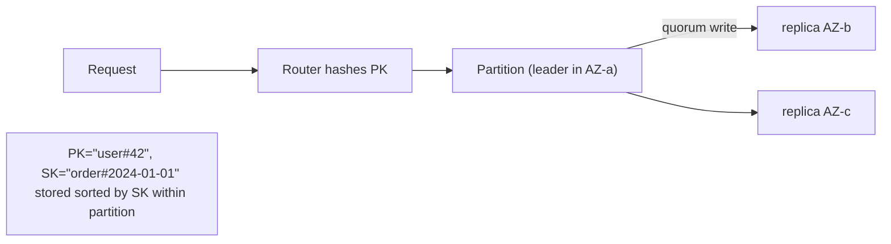
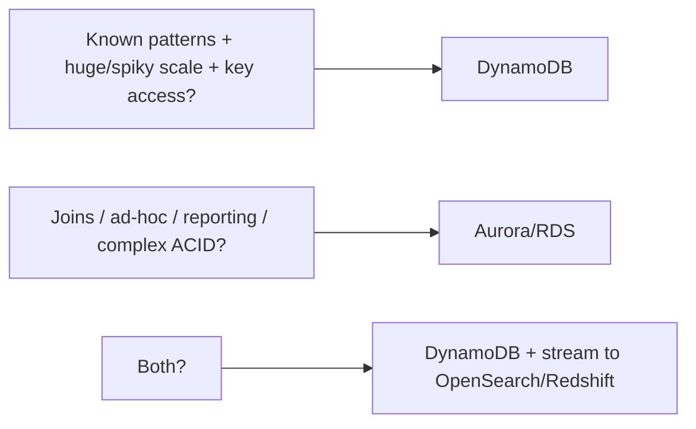

# Amazon DynamoDB Deep Dive: Data Modeling and Scale

DynamoDB is a fully managed, serverless, key-value and document NoSQL database
that offers single-digit-millisecond latency at "any" scale. It descends from the
2007 Dynamo paper (which itself inspired Cassandra and Riak), but the public
service is a hosted, hash-partitioned store where AWS owns the operational burden:
no servers to patch, replication and failover are automatic, and throughput scales
horizontally by adding partitions. The interview bar for DynamoDB is not "can you
call PutItem" — it is "can you model access patterns first, reason about partition
math, and defend NoSQL vs relational for a given constraint set." This deep dive is
organized around exactly those decisions and their trade-offs.

The mental model that unlocks DynamoDB: **it is a distributed hash table with sorted
range buckets.** The partition key is hashed to pick a physical partition; the sort
key orders items *within* that partition. Everything else — GSIs, single-table
design, adaptive capacity — is built on that one primitive. If you internalize
"hash to a partition, sort within it," most design questions become mechanical.

---

## Partition key, sort key, and how partitioning works

Every DynamoDB table has a **primary key** that uniquely identifies each item. Two
shapes exist:

- **Simple primary key** = partition key (PK) only. The PK value is hashed; the item
  lives in whatever physical partition that hash maps to. Access is by exact PK.
- **Composite primary key** = partition key + sort key (SK). Items sharing a PK are
  stored **together, physically sorted by SK**. This enables rich queries: "all
  items for PK where SK begins_with / between / < / > a value," returned in sorted
  order, in one `Query`.

**How partitioning physically works.** DynamoDB stores data across many partitions,
each backed by SSDs and replicated across **three Availability Zones** in the
Region. An internal request router hashes the PK to route a request to the right
partition's leader replica. Writes go to the leader and are synchronously replicated
to a quorum before ack; that is why writes are durable and why you never lose an AZ's
worth of data. A single physical partition holds up to **~10 GB** of data and can
sustain **up to 3000 read capacity units (RCU) and 1000 write capacity units (WCU)**
per second. When a table grows past 10 GB or exceeds those throughput ceilings,
DynamoDB **splits** the partition and redistributes items — automatically and
invisibly, but based on the hash of the PK, so the *distribution quality depends
entirely on your key design.*

**The cardinal rule: choose a PK with high cardinality and uniform access.** Good PKs:
`userId`, `orderId`, `deviceId#date`. Bad PKs: `status` (few values → few partitions,
everything piles up), `country`, a boolean. The number of distinct PK values, and how
evenly traffic spreads across them, determines whether you get linear scale or a hot
partition.



**Item size and key limits (memorize these):** item max **400 KB** (all attribute
names + values, including the keys). PK value max 2048 bytes; SK value max 1024
bytes. These bound your modeling: you cannot store a 5 MB blob — you offload it to
S3 and keep the S3 pointer in DynamoDB.

**Trade-offs.** The composite key buys you *free* one-to-many query power and sorted
retrieval without a secondary index — this is the engine of single-table design. What
you give up vs a relational table: no ad-hoc queries, no joins, no `WHERE` on
non-key attributes without a `Scan` (full table read) or a secondary index. You must
know your access patterns *before* you pick keys, because the key **is** the access
path. Pick a composite key whenever you have parent→children relationships you'll
query as a group (user→orders, tenant→resources, sensor→readings); pick a simple key
only for pure lookup-by-id caches/blobs.

---

## Single-table design and access-pattern-first modeling

The most contentious DynamoDB topic. **Single-table design (STD)** stores multiple
*entity types* (users, orders, products, order-items) in **one** physical table,
distinguished by generic key attributes (often literally named `PK` and `SK`) whose
values encode the entity type: `PK=USER#42`, `SK=PROFILE`; `PK=USER#42`,
`SK=ORDER#2024-01-01`. Because related entities share a PK, a single `Query` fetches a
user and all their orders in **one round trip** — no join, no N+1.

**Why it exists.** DynamoDB has no server-side joins. In relational design you
normalize and let the DB join at read time; in DynamoDB you **pre-join by
co-locating** items under a shared partition key, effectively materializing the join
at write time. STD minimizes the number of network round trips per API call, which is
the dominant latency and cost factor at scale.

**The method (access-pattern-first):**
1. Enumerate every access pattern first ("get user by id," "list a user's orders
   newest-first," "get order with its line items," "find orders by status").
2. Design keys and indexes so each pattern is a single `Query`/`GetItem`.
3. Use **generic key names** (`PK`, `SK`, `GSI1PK`, `GSI1SK`) so different entities
   can overload the same physical attributes.

**Trade-offs — this is the debate interviewers want.**

| Aspect | Single-table | Multi-table (one entity per table) |
|---|---|---|
| Round trips for related data | 1 Query | N GetItems / batch |
| Query flexibility | Pre-baked, rigid | Simpler per-entity |
| Cost at scale | Lower (fewer requests) | Higher (more requests) |
| Learning curve / readability | Steep, cryptic keys | Intuitive |
| Schema evolution / new access pattern | Often needs new GSI or backfill | Add a table freely |
| Analytics / exports | Mixed entities, harder | Clean per-entity |
| Blast radius | One table = one throttle/limit domain | Isolated per entity |

**When to pick STD:** high-scale OLTP with well-known, stable access patterns where
minimizing round trips and cost matters (the classic Amazon-scale microservice
owning a bounded context). **When to prefer multi-table / simpler modeling:** early
product with evolving patterns, small scale where round trips don't matter, teams new
to DynamoDB, or when you'll do a lot of analytics. Modern nuance: with **on-demand**
pricing and the fact that each entity type can also just be its own table cheaply,
many teams now favor a pragmatic middle — a few tables, not one giant one, not one per
tiny entity. Purist STD is a *cost/latency optimization*, not a moral requirement.

---

## Secondary indexes: GSI versus LSI

Secondary indexes let you query on non-primary-key attributes. Two kinds:

**Global Secondary Index (GSI):** an index with its **own** partition key and optional
sort key, *different* from the base table's. It is stored as a **separate, internally
replicated table** that DynamoDB keeps in sync **asynchronously**. Therefore GSI reads
are **eventually consistent only** — you cannot do a strongly consistent read on a
GSI. A GSI has its **own provisioned/on-demand capacity** (in provisioned mode you set
its RCU/WCU separately; if a GSI is under-provisioned it can throttle and, worse,
**back-pressure and throttle writes to the base table**). You can create/delete GSIs
**any time** after table creation. Up to **20 GSIs** per table (default; adjustable).

**Local Secondary Index (LSI):** shares the **same partition key** as the base table
but has an **alternate sort key**. It is stored *in the same partition* as the base
item, so it **can** serve **strongly consistent** reads and shares the base table's
capacity. But: LSIs must be created **at table creation time only** (never added
later), you can have at most **5** per table, and they impose a hard constraint — the
total size of all items **plus** all LSI entries for a single partition-key value must
stay **under 10 GB** (the "item collection size limit"). LSIs are the far less-used
option.

**Projection** (both index types): you choose which attributes are copied into the
index — `KEYS_ONLY`, `INCLUDE` (a specific list), or `ALL`. Smaller projection = less
storage and write cost, but a query needing a non-projected attribute must do an extra
**fetch back to the base table** (higher latency, more RCU) — for GSIs this base-table
fetch isn't even automatic in all cases and adds cost. Projecting `ALL` is convenient
but doubles storage and write amplification.

```
Base table:   PK=ORDER#7   SK=META    status=SHIPPED  customer=42
GSI1 (query by status):  GSI1PK=status  GSI1SK=createdAt
   -> lets you Query "all SHIPPED orders, newest first" without scanning
```

**Trade-offs table:**

| | GSI | LSI |
|---|---|---|
| Partition key | Any attribute (own) | Same as base table |
| Sort key | Optional, own | Required, alternate |
| Consistency | Eventual only | Strong or eventual |
| Capacity | Separate (own RCU/WCU) | Shared with base table |
| Create/delete | Anytime | Table creation only |
| Max per table | 20 | 5 |
| Size constraint | None special | 10 GB per PK item collection |
| Write cost | Extra write to index (async) | Extra write in same partition |

**When to use which:** default to **GSI** — it is flexible, addable later, and doesn't
bind you to the base PK. Use an **LSI** only when you (a) need *strongly consistent*
reads on an alternate sort order *and* (b) queries always stay within a single PK, and
(c) you knew the pattern at creation time. In practice most designs use GSIs
exclusively. Remember the reliability trap: a throttled GSI can throttle base writes,
so size GSI capacity generously or use on-demand.

**Sparse indexes (a staple advanced pattern).** Here is the key mechanical fact that
unlocks a whole class of cheap designs: **an item only appears in a GSI if it actually
has the GSI's key attribute(s).** Items missing that attribute are simply *not
projected* into the index. That is not a limitation — it is a feature you exploit on
purpose. By writing the GSI key attribute onto **only the subset of items you care
about**, you build a pre-filtered index for free.

*Intuition:* instead of scanning a big table and filtering (which, as we just saw,
still bills you for every item read), you make the index itself contain *only* the rows
you'd have kept.

**Worked example — an "unprocessed jobs" queue.** Say a `jobs` table has 10,000,000
completed jobs and, at any moment, ~500 jobs still needing processing. Give each job a
`gsiUnprocessedPK` attribute **only while it is unprocessed**, and when a worker
finishes a job, `REMOVE` that attribute (or overwrite the item without it).
- The GSI on `gsiUnprocessedPK` contains **~500 items**, not 10,000,000.
- Fetching the backlog is a `Query`/`Scan` over the GSI reading **~500 items** →
  ~cheap.
- Compare to keeping a `status` attribute on all 10M items and scanning + filtering:
  that reads **10,000,000** items every poll (see the FilterExpression trap) — roughly
  a **20,000x** difference in RCU.

Other classic uses: index only `flagged = true` records, only orders in state `OPEN`,
only users who opted into a feature. You save both **storage** (the index holds a tiny
subset) and **RCU** (you never read the irrelevant majority). Sparse indexes pair
directly with GSI overloading below.

---

## Capacity modes: provisioned with auto scaling versus on-demand

DynamoDB has two billing/throughput models, chosen per table (switchable, but limited
to **once per 24 hours** in the on-demand→provisioned direction historically; you can
switch more freely now but plan around a rolling window):

**Provisioned capacity:** you declare RCU and WCU per second. You pay for that
reserved throughput whether you use it or not. Requests beyond provisioned (plus burst)
get **throttled** (`ProvisionedThroughputExceededException`). **Auto scaling** adjusts
provisioned capacity between a min and max toward a target utilization (e.g., 70%)
using CloudWatch alarms — but it reacts on a **minutes** timescale, so it does **not**
absorb sudden spikes well. Provisioned also supports **reserved capacity** (1-/3-year
commitments) for deep discounts.

**On-demand capacity:** no capacity to manage; you pay per **request** (per read
request unit / write request unit). It adapts to traffic automatically, but the
scaling is not literally infinite-instant, and knowing the concrete numbers is a
senior tell. As of writing (verify current docs, these limits have been raised over
time): a **brand-new** on-demand table instantly serves up to about **4,000 WCU and
12,000 RCU** per second — note the read/write asymmetry, reads get the bigger cold
allowance. Beyond that, on-demand automatically accommodates traffic up to **2x your
table's previous observed peak within ~30 minutes**. So if you peaked at 10,000
WCU/sec last week, it can absorb up to ~20,000 WCU/sec smoothly; a spike that instantly
demands 5x your prior peak can still throttle until the table "learns" the new level.
Pay-per-request is roughly **6–7x more expensive per unit** than fully-utilized
provisioned capacity — but if your utilization is low or spiky, you'd pay for idle
provisioned capacity anyway.

**Cost intuition / back-of-envelope:** On-demand wins when utilization is spiky,
unpredictable, or low (dev/test, new features, sharp peaks). Provisioned + auto
scaling + reserved capacity wins for **steady, predictable, high** traffic where you
can keep utilization high (70%+) — the discount vs on-demand is large. Rule of thumb:
if average utilization of a provisioned table would exceed ~15–20%, provisioned tends
to be cheaper; below that, on-demand. The crossover is roughly "on-demand costs the
same as provisioned running at ~14–20% utilization."

**Trade-offs:**

| | Provisioned + auto scaling | On-demand |
|---|---|---|
| Spike handling | Poor (minutes to scale, throttles) | Excellent (instant) |
| Cost at steady high load | Cheapest (esp. with reserved) | ~6–7x/unit more |
| Cost when idle/spiky | Pay for idle capacity | Pay only per request |
| Ops burden | Tune min/max/target | Zero |
| Predictability of bill | Fixed, predictable | Variable |

**When to pick:** On-demand for unknown/new/spiky workloads and to eliminate throttling
risk with zero ops. Provisioned for mature, predictable, cost-sensitive workloads at
scale; combine with auto scaling for daily patterns and reserved capacity for the
committed floor. A common production pattern: launch on-demand to learn the traffic
shape, then move to provisioned once the pattern is stable and cost matters.

---

## RCU and WCU math, item size, and per-partition limits

You must be able to do capacity math on a whiteboard.

**Write Capacity Unit (WCU):** 1 WCU = one **standard** write of up to **1 KB** per
second. A write is rounded **up** to the next 1 KB. A 3.5 KB item costs 4 WCU. A
**transactional** write costs **2x** (2 WCU per KB).

**Read Capacity Unit (RCU):** 1 RCU = one **strongly consistent** read of up to
**4 KB** per second, OR **two eventually consistent** reads of up to 4 KB per second.
Reads round **up** to 4 KB. So an 8 KB item strongly-consistent = 2 RCU; eventually
consistent = 1 RCU; **transactional** read = 2x (so 4 RCU). Eventually consistent reads
are **half the cost** of strong.

**Worked example.** 100 writes/sec of 2.5 KB items → each rounds to 3 KB → 3 WCU each →
**300 WCU**. 500 eventually-consistent reads/sec of 6 KB items → each rounds to 8 KB =
2 read-units strong = **1 RCU eventually** per read → 500 × 1 = **500 RCU** (if strong,
it'd be 1000 RCU). This math is the same whether you're sizing provisioned capacity or
estimating on-demand cost (on-demand is billed in equivalent read/write *request
units*).

**Per-partition ceilings (hard physics):** a single partition serves **up to 3000 RCU
and up to 1000 WCU**. Even with adaptive capacity boosting a hot partition, you cannot
exceed these for a single item / single partition key. Therefore a **single item that
needs >1000 WCU/sec (e.g., a global counter) will throttle** no matter your table's
total capacity. The fix is **write sharding** — spread the key across suffixes
(`counter#0..counter#N`) and aggregate. Total table capacity is effectively unbounded
because it spreads across many partitions; the per-partition-key limit is the true
constraint.

**Other limits worth citing:** `Query`/`Scan` return at most **1 MB per page**
(paginate with `LastEvaluatedKey`); `BatchGetItem` up to 100 items / 16 MB;
`BatchWriteItem` up to 25 items / 16 MB; `TransactWriteItems`/`TransactGetItems` up to
**100 items** and 4 MB; item max **400 KB**.

**Trade-offs.** Eventually consistent reads = half the cost and can hit read replicas
(better availability), but may return slightly stale data (typically consistent within
milliseconds). Strong reads always go to the leader → correct, but 2x cost and no
fallback if the leader replica is briefly unavailable. Choose eventual by default;
choose strong only where read-after-write correctness is required (e.g., read your own
just-written config).

---

## Query versus Scan and the FilterExpression cost trap

**Intuition first.** Think of a `Query` as walking straight to one drawer in a filing
cabinet (one partition key) and reading the folders you asked for in order. A `Scan`
is opening *every* drawer and reading *every* folder in the whole cabinet. That is the
entire difference in cost, and it is one of the most common DynamoDB interview probes
because getting it wrong blows up your bill.

- **`Query`** targets **one partition key** and optionally a range of sort keys. It
  only reads items in that item collection. Cheap and O(matching items).
- **`Scan`** reads the **entire table** (or entire GSI), page by page, 1 MB at a time.
  Cost is O(table size), not O(results). At scale this is an anti-pattern for any
  online request path.

**The trap: `FilterExpression` is not a cheap `WHERE`.** A filter is applied
**server-side *after* items have been read** from the partition(s), just before the
results are returned over the wire. This means **you are billed RCU for every item
read, not every item returned.** The filter only shrinks the payload, not the capacity
consumed.

**Worked example (numbers in → numbers out).** You have a 1,000,000-item table,
each item ~1 KB, and you `Scan` with `FilterExpression = "status = :open"`; only 10
items are `OPEN`.
- Items read: **1,000,000** (the whole table).
- Bytes read: 1,000,000 × 1 KB = ~1,000,000 KB.
- RCU (eventually consistent, 4 KB per RCU, two 4 KB reads per RCU): each 1 KB item
  rounds up to a 4 KB read unit → 1,000,000 read units ÷ 2 (eventual) = **~500,000
  RCU consumed**.
- Items returned to you: **10**.

So you paid to read a million items to hand back ten. A newcomer who assumes the filter
made this "a query for 10 items" is off by five orders of magnitude on cost. The fix is
to make the thing you filter on part of a **key** — either the base sort key, a GSI, or
a **sparse index** (see the secondary-index section) — so DynamoDB reads only the
matching items in the first place. Rule of thumb: **`FilterExpression` is for trimming
a few stragglers off an already-narrow `Query`, never a substitute for a key or index.**

---

## Adaptive capacity, hot partitions, and hot keys

**Hot partition:** traffic concentrated on one physical partition because the PK
distribution is skewed (or one PK is extremely popular). Because a partition caps at
3000 RCU / 1000 WCU, a hot partition throttles even when the table has plenty of
*total* unused capacity — the classic "I provisioned 40,000 WCU but I'm still being
throttled" surprise.

**Adaptive capacity** mitigates this in two ways, automatically and for free:
1. **Instantaneously**, it lets a partition "borrow" burst capacity and boost hot
   partitions using unused capacity from the table (up to the 3000/1000 hard ceiling).
2. **Isolate frequently accessed items** — DynamoDB can **split partitions by
   throughput** (not just size), giving a very hot key its own partition.

Adaptive capacity is not magic: it cannot exceed the per-partition ceiling, and it
reacts over time, so a sudden extreme hot key still throttles briefly. It also can't
help a **single hot key** beyond 3000 RCU / 1000 WCU because one key can't be split
across partitions.

**Design fixes for hot keys:**
- **Write sharding:** append a random or calculated suffix to spread writes across N
  logical keys, then scatter-gather on read. Essential for counters, leaderboards,
  time-series "current day" keys. **Sizing it (numbers in → shard count out):** a
  single partition key caps at **1,000 WCU/sec**, so to sustain **X** writes/sec on one
  logical key you need at least **ceil(X / 1000)** shard suffixes. To take a global
  counter to **50,000 writes/sec**: 50,000 ÷ 1,000 = 50 → use **≥50 shards** (round up
  to, say, **64** for headroom and to leave slack for uneven hashing). You write to
  `counter#<random 0..63>` and, on read, `GetItem` all 64 shards and **sum** them
  (scatter-gather). More shards = more write headroom but more read fan-out, so pick the
  smallest N that clears your peak.
- **Add entropy to the PK:** avoid low-cardinality PKs (`status`, `date`); combine with
  something high-cardinality (`date#deviceId`).
- **DAX / cache** for hot *reads* (see DAX section) to absorb read hotspots.
- **Write sharding + eventual aggregation** for hot *writes*.

**Trade-offs.** Write sharding trades read simplicity (now you must query/aggregate N
shards) for write scalability. More shards = more write headroom but more read fan-out
cost/latency; pick N to just clear the per-partition write ceiling for your peak.

---

## Strongly consistent versus eventually consistent reads

DynamoDB replicates each item to **three AZs**; one replica is the leader. **Strongly
consistent reads** go to the leader and reflect all writes acked before the read —
read-after-write correctness. **Eventually consistent reads** (the default) may be
served by any replica and might not yet reflect the most recent write, but replicas
converge typically within **milliseconds**.

Key facts: eventual reads cost **half** an RCU (2 per RCU vs 1); strong reads cost
double the eventual. **GSIs support eventual reads only.** **Global tables** are always
eventually consistent for cross-region reads (each region is its own leader). Strong
reads are only available for base-table (and LSI) reads within a single region.

**Trade-offs & when:** default to eventual — cheaper, higher throughput per RCU, and
resilient if the leader replica is momentarily unavailable (can read a follower).
Choose strong only when correctness demands it: reading a value you just wrote and
must act on (e.g., idempotency check, balance after a debit) — though for
correctness-critical mutations, prefer **conditional writes/transactions** over
"strong read then write" which still has a race.

---

## Transactions and conditional writes

**Conditional writes** are the workhorse of correctness. `PutItem`/`UpdateItem`/
`DeleteItem` accept a `ConditionExpression`; the write applies **only if** the
condition is true (`attribute_not_exists(PK)` for insert-if-absent, `version = :v` for
optimistic locking, `balance >= :amount`). This gives **compare-and-set / optimistic
concurrency** on a single item without locks. Failed conditions throw
`ConditionalCheckFailedException` and **do not consume the write** the same way (you
can opt to get the item back). This is how you do idempotency, uniqueness, and
optimistic locking cheaply.

**DynamoDB Transactions** (`TransactWriteItems`, `TransactGetItems`) give **ACID
across up to 100 items** (and up to 4 MB), possibly across **multiple tables in the
same region and account**. All-or-nothing: either every action succeeds or none apply.
Each transactional operation costs **2x** the normal capacity units. Transactions use
a two-phase protocol; conflicting concurrent transactions on the same item cause
`TransactionConflictException` (you retry). They are **single-region only** — no
cross-region transactions with global tables.

**Trade-offs.** Prefer a single conditional write when one item's atomicity suffices —
it's cheaper (1x) and never conflicts across items. Use transactions only when you
truly need multi-item atomicity (e.g., move money between two accounts, enforce a
uniqueness constraint via a companion "lock" item + the entity). Costs and conflict
rate rise with transactions, and 100-item / same-region limits mean they don't replace
a relational DB for large multi-row units of work. If you find yourself wanting 5-table
joins inside a transaction, that's a signal you may want Aurora instead.

---

## DynamoDB Streams and event-driven patterns

**DynamoDB Streams** capture an ordered, **time-sequenced log of item-level changes**
(insert/modify/remove) and retain them for **24 hours**. Stream records can include
`KEYS_ONLY`, `NEW_IMAGE`, `OLD_IMAGE`, or `NEW_AND_OLD_IMAGES`. Records are ordered
**per partition key** (not globally). This is DynamoDB's built-in **change data capture
(CDC)**.

The dominant pattern is **Streams → Lambda**: Lambda polls the stream and invokes your
function with batches, in order per key, with **at-least-once** delivery (so your
handler must be **idempotent**). Uses: maintaining materialized views / aggregations,
fanning out to other systems, replicating to OpenSearch/Elasticsearch for full-text
search, writing to S3/analytics, sending notifications, and implementing the
**transactional outbox** (write entity + outbox item, stream drives publishing to
SNS/EventBridge/Kinesis). Global tables are themselves implemented on top of streams.

There's also **Kinesis Data Streams for DynamoDB**, which sends the same change data to
a Kinesis stream with **longer retention (up to 1 year)**, higher fan-out, and
integration with Kinesis consumers/Flink — at the cost of Kinesis's own ordering model
and management.

**Trade-offs.**
- **Streams + Lambda vs polling the table:** streams give you push-based, near-real-time
  CDC with no wasteful scanning; but 24-hour retention means a broken consumer that's
  down >24h **loses events** — you need alarms and, for durability, tee to Kinesis/S3.
- **Streams (native) vs Kinesis Data Streams:** native streams = simplest, ordered per
  key, 24h, one primary consumer (well-suited to one Lambda). Kinesis = long retention,
  many consumers, replay, but more moving parts and different ordering guarantees.
- At-least-once + per-key ordering means design consumers to be idempotent and not to
  assume global ordering.

---

## Time to Live (TTL)

**TTL** auto-deletes items after a timestamp you store in a designated numeric
attribute (Unix **epoch seconds**). You mark items for expiry; DynamoDB deletes them in
the background. Crucially, deletion is **not immediate or precise** — items are
typically removed within a few hours (AWS states usually within ~48 hours) after
expiry. Expired-but-not-yet-deleted items **still appear in reads/queries/scans** and
still count toward storage until purged, so filter on the TTL attribute in queries if
correctness depends on expiry. TTL deletes are **free** (no WCU consumed) and they
**do flow through Streams** as `REMOVE` records (with a `userIdentity` marker showing
it was a TTL deletion) — great for archiving expired items to S3.

**Trade-offs.** TTL is the cheap, hands-off way to expire session data, caches,
ephemeral events, and to keep tables small (lower storage + faster scans). What you
give up: precision — never rely on TTL for exact-time deletion, compliance
hard-deletes with tight SLAs, or "the item is gone the instant it expires." If you need
guaranteed immediate removal, delete explicitly. Combine TTL + Streams to archive to S3
before data ages out.

---

## Global tables and multi-region

**Global tables** turn a table into a **multi-region, multi-active (multi-primary)**
replicated table: you can **read and write in any participating region**, and DynamoDB
replicates changes to the others, usually within **~1 second** (built on Streams).
Every region is a full primary. This gives low-latency local access for global users
and a strong **disaster-recovery / regional-failover** story with a very low RPO
(sub-second typical) and near-zero RTO (just point clients at another region).

**Conflict resolution is Last-Writer-Wins (LWW):** if the same item is written
concurrently in two regions, the write with the **latest timestamp** wins; the other is
silently discarded. There is no application-level merge — you must design so that
concurrent same-item writes across regions are rare or acceptable (e.g., per-region
sharding of writable keys, or route each user to a home region).

Reads against a global table are **eventually consistent across regions** (you cannot
do a strongly consistent *cross-region* read). Within a region, normal strong/eventual
rules apply. Global tables require **Streams enabled** and use a specific version
(current is 2019.11.21+); you pay for **replicated write request units** and
cross-region data transfer.

**Trade-offs.**
- **vs single-region:** you gain multi-region availability, DR, and local latency;
  you give up strong global consistency (LWW can silently drop a conflicting write)
  and pay ~ replicated writes in each region + transfer cost.
- **When to use:** globally distributed users needing low local latency, or a strict
  multi-region DR requirement. **When not to:** single-region apps, or workloads where
  concurrent cross-region writes to the same item would corrupt state and LWW is
  unacceptable — those need a different consistency strategy (e.g., a single writer
  region with async read replicas).
- Transactions do **not** span regions; strong reads do not span regions.

---

## DAX caching

**DynamoDB Accelerator (DAX)** is a fully managed, in-memory, **write-through** cache
that sits in front of DynamoDB and speaks the DynamoDB API, so adoption is nearly
code-transparent (point the DAX client at the cluster). It turns single-digit-**ms**
reads into **microsecond** reads and absorbs read-heavy, hot-key traffic, cutting RCU
cost dramatically for read-heavy workloads. DAX runs as a **cluster of nodes inside
your VPC** (a primary + read replicas across AZs).

Two caches: an **item cache** (GetItem/BatchGetItem results) and a **query cache**
(Query/Scan results), each with its own TTL. Writes are write-through (write to
DynamoDB then update the item cache).

**Critical limitations / trade-offs:**
- DAX serves **eventually consistent** reads from cache. **Strongly consistent reads
  pass through** to DynamoDB (DAX can't guarantee freshness), so DAX gives no benefit
  for strong-consistency workloads.
- It's a **cache**, so it adds a **staleness window** (up to the cache TTL) — wrong for
  workloads that need read-after-write.
- It's **not serverless** — you provision/manage a node cluster (cost + ops), unlike
  the rest of DynamoDB. For spiky or modest read loads, on-demand DynamoDB alone may be
  simpler/cheaper.
- **When to use:** read-heavy, latency-sensitive, hot-key workloads (e.g., product
  catalogs, config, gaming leaderboards) that tolerate slight staleness. **Alternatives:**
  ElastiCache (Redis) gives you more cache control/data structures but requires
  cache-aside code and its own consistency handling; DAX wins on transparency and
  DynamoDB-native semantics.

---

## Backup and point-in-time recovery

Two backup mechanisms:

- **On-demand backups:** full, manual (or scheduled via AWS Backup) snapshots that live
  until you delete them. Zero performance impact, no capacity consumed. Good for
  long-term retention, pre-migration snapshots, compliance archives.
- **Point-in-Time Recovery (PITR):** continuous backups letting you restore to **any
  second within the last 35 days**. Protects against accidental writes/deletes and bad
  deploys. Both backup types **restore to a new table** (you cannot restore in place),
  so recovery involves a cutover.

**Global tables + PITR** together give you both regional DR (failover) and
point-in-time restore (undo logical corruption) — different failure classes.

**Trade-offs.** PITR is cheap insurance against *logical* errors (a bad batch job wiping
data) and covers a rolling 35-day window; on-demand backups cover *retention beyond 35
days*. Neither replaces global tables for *infrastructure/region* failure — a backup
doesn't keep you online, it lets you rebuild. Restores create a new table (extra cost +
cutover time), so factor RTO. Enable PITR on anything important; it's a small cost for
large protection.

---

## DynamoDB versus RDS and Aurora

The service-selection question interviewers love.

| Dimension | DynamoDB | RDS / Aurora (relational) |
|---|---|---|
| Data model | Key-value + document, schema-flexible | Relational, fixed schema, joins |
| Query | By key / index only; no ad-hoc joins | Full SQL, joins, aggregations, ad-hoc |
| Scale | Horizontal, ~unbounded, automatic | Vertical + read replicas; sharding is manual/harder (Aurora scales storage auto, writes via one primary; Aurora Serverless v2 & Limitless help) |
| Latency | Single-digit ms, predictable at scale | Low, but degrades under complex queries/contention |
| Consistency | Eventual (default) / strong per-read | Strong ACID by default |
| Transactions | Up to 100 items, single region | Rich multi-row/multi-table ACID |
| Ops | Serverless, near-zero | Managed but you pick instance size, patch windows, failover |
| Cost model | Per request / provisioned throughput + storage | Per instance-hour + storage + IO |
| Best for | High-scale OLTP with known access patterns, key-based | Complex relationships, ad-hoc queries, reporting, strong ACID |

**When DynamoDB:** massive or unpredictable scale, simple/known access patterns,
key-based lookups, need for predictable low latency and near-zero ops, serverless/
event-driven architectures, per-tenant or per-user data. Shopping carts, sessions,
user profiles, IoT/time-series (with good keys), leaderboards, event stores, metadata.

**When RDS/Aurora:** rich relationships and joins, ad-hoc/reporting queries, strong
multi-row transactions, complex constraints, or when the team needs SQL and the scale
fits a single primary + replicas. Financial ledgers with complex reporting, admin
back-ends, anything where access patterns are unknown or churn frequently.

**Trade-offs / gotchas:** DynamoDB "forces" you to know access patterns up front —
great for locked-in high scale, painful when requirements evolve (you re-model / backfill
GSIs). Relational gives flexibility now but you may hit a write-scaling wall later that
forces sharding. A very common real answer is **polyglot persistence**: DynamoDB for the
high-scale OLTP path, plus streaming to OpenSearch (search) and Redshift/S3 (analytics),
or Aurora for the relational/reporting slice. Don't force analytics/ad-hoc onto
DynamoDB — export to S3 + Athena / Redshift instead.

---

## Attribute overloading and GSI overloading

Because entities in single-table design share generic key attributes, DynamoDB uses two
"overloading" techniques:

- **Attribute (key) overloading:** the same physical attribute (`SK`) holds different
  *meanings* for different entity types. For a `USER` item `SK` might be `PROFILE`; for
  an `ORDER` item under the same PK, `SK` is `ORDER#<date>`. One attribute, many roles,
  distinguished by value prefix. This is what lets one table store many entity types and
  serve heterogeneous items from one Query.

- **GSI overloading:** reusing a **single** GSI (e.g., `GSI1PK`/`GSI1SK`) to serve
  **multiple** access patterns across different entity types, because each entity puts
  different values into those generic index keys. Instead of 8 narrow GSIs (and 8x write
  amplification + capacity), you get a handful of overloaded GSIs each serving several
  patterns. Since you cap at 20 GSIs and each GSI adds write cost, overloading conserves
  both the GSI budget and cost.

**Trade-offs.** Overloading dramatically reduces the number of tables/indexes, write
amplification, and cost — the core efficiency of single-table design. What you pay:
**readability and maintainability** collapse (opaque `PK`/`SK`/`GSI1PK` values that only
make sense with a documented access-pattern map), tooling/exports see a soup of entity
types, and onboarding is hard. Overload when scale/cost justify the complexity and the
patterns are stable; keep entities in separate tables/indexes when clarity and evolution
speed matter more than shaving requests.

---

## Trade-offs and when to use what

A consolidated decision guide for interviews.

**Capacity mode:** On-demand for spiky/unknown/new workloads and zero-ops; provisioned +
auto scaling (+ reserved capacity) for steady, predictable, high-utilization workloads
where cost matters. Migrate on-demand→provisioned once the traffic shape stabilizes.

**Consistency:** Eventual by default (half cost, more resilient); strong only where
read-after-write correctness is required. For correctness under concurrency, use
conditional writes/transactions rather than "strong read then write."

**Indexes:** GSI by default (flexible, addable, any key); LSI only for strongly-consistent
alternate-sort queries known at table-creation time and confined to one PK. Watch the
GSI-throttle-backpressures-base-writes trap.

**Table topology:** Single-table design when you have stable, high-scale access patterns
and want minimal round trips/cost; multiple simpler tables when patterns evolve, scale is
modest, or team/analytics clarity matters more.

**Hot keys / counters:** Write-shard hot write keys; DAX or read-shard hot read keys; add
entropy to low-cardinality PKs. Never point a >1000 WCU/sec write stream at one key.

**Caching:** DAX for transparent, DynamoDB-native, eventually-consistent read
acceleration and hot-key relief (but it's a managed cluster, not serverless, and no help
for strong reads); ElastiCache when you need richer cache semantics and accept
cache-aside code.

**Multi-region:** Global tables for global low-latency and DR, accepting LWW conflict
resolution and eventual cross-region consistency; single region otherwise.

**Blob/large data:** Keep items <400 KB; offload large payloads to S3 and store the
pointer. Offload search to OpenSearch and analytics to S3+Athena/Redshift via Streams —
don't Scan for these.

**DynamoDB vs Aurora:** DynamoDB for high-scale, known-access-pattern, key-based OLTP;
Aurora/RDS for joins, ad-hoc queries, complex ACID, and evolving/unknown patterns.
Polyglot persistence is often the best real-world answer.



**Failure modes to recite:** hot partition throttling despite spare total capacity;
under-provisioned GSI throttling base writes; on-demand cold-start cap on a brand-new
table's first massive spike; auto scaling too slow for a flash spike; TTL not being
immediate; global-table LWW silently dropping a write; Streams consumer down >24h losing
events; single item exceeding 400 KB or a single key exceeding 3000 RCU/1000 WCU.

---

## Common interview follow-up questions

- "You provisioned 20,000 WCU but see throttling — what's happening and how do you fix
  it?" (Hot partition; check key cardinality, write-shard, or go on-demand.)
- "Design the data model for [Twitter timeline / e-commerce orders / IoT telemetry]
  in DynamoDB — list your access patterns and keys/GSIs first."
- "Why can't you do a strongly consistent read on a GSI?"
- "How do you implement a global unique constraint (e.g., unique email) in DynamoDB?"
  (Transaction: put the entity + put a `EMAIL#x` lock item with
  `attribute_not_exists`.)
- "How do you build a counter that handles 50,000 increments/sec?" (Write sharding:
  one key caps at 1,000 WCU/sec, so 50,000 ÷ 1,000 = ≥50 shards, round to ~64; scatter
  writes across `counter#0..63`, sum all shards on read. Never one key.)
- "PITR vs on-demand backup vs global tables — which protects against what?"
- "When would you reject DynamoDB and choose Aurora?"
- "How do you keep a full-text search index in sync with DynamoDB?" (Streams → Lambda →
  OpenSearch.)
- "On-demand vs provisioned — do the cost math for a workload at 10% vs 80%
  utilization."
- "How does adaptive capacity work and what can it not fix?" (Can't beat the
  per-partition-key 3000/1000 ceiling.)
- "Explain single-table design and when you would NOT use it."

## References

- Amazon DynamoDB Developer Guide — Core components, partitions, capacity modes, secondary
  indexes, streams, TTL, global tables, transactions, PITR (docs.aws.amazon.com/amazondynamodb).
- DynamoDB service quotas / limits page (item 400 KB, 3000 RCU/1000 WCU per partition,
  20 GSIs, 5 LSIs, transaction 100 items, page 1 MB).
- AWS re:Invent — "Amazon DynamoDB deep dive: Advanced design patterns" (Rick Houlihan /
  Alex DeBrie sessions, 300/400-level).
- Alex DeBrie, "The DynamoDB Book" and dynamodbguide.com — single-table design,
  overloading, access-pattern modeling.
- AWS Builders' Library — "Amazon DynamoDB: 10 years of building..." and consistency/
  partitioning articles; Werner Vogels, "A Decade of Dynamo" (allthingsdistributed.com).
- The original Dynamo paper (DeCandia et al., 2007) for lineage/LWW/consistency roots.
- AWS Well-Architected Framework — Reliability and Cost Optimization pillars for
  capacity-mode and multi-region trade-offs.
- AWS Database Blog — DynamoDB adaptive capacity, write sharding, DAX, global tables
  best-practice posts.
