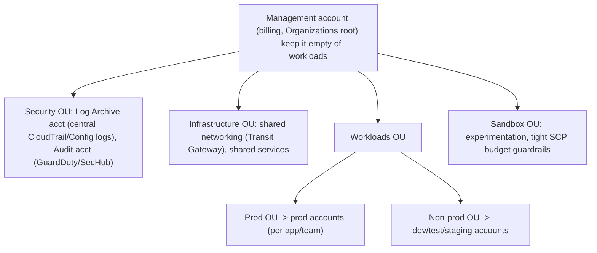

# AWS Fundamentals and the Well-Architected Framework

This topic is the mental map for AWS system-design interviews. You are not expected to
memorize every service; you are expected to reason about **where compute/storage/state
lives, how it fails, and what trade-off you are making** every time you pick a service or
a mode. AWS is just a large, opinionated toolbox of the generic system-design primitives
(load balancers, queues, KV stores, object stores, caches, pub/sub, coordination). The
Well-Architected Framework (WAF) is AWS's checklist for reasoning about those choices
across six pillars. Interviewers probe two things: (1) do you know the real limits and
failure modes, and (2) can you justify a choice against a named alternative.

---

## Global infrastructure Regions, Availability Zones, and edge

**Intuition.** AWS is a hierarchy of physical isolation boundaries. From coarse to fine:
**Partition** (e.g., `aws` commercial, `aws-us-gov`, `aws-cn`) > **Region** > **Availability
Zone (AZ)** > data center. Plus a separate **edge** network (CloudFront PoPs, Local Zones,
Wavelength, Outposts) that pushes compute/content closer to users.

- **Region** = a geographic area (e.g., `us-east-1` N. Virginia, `eu-west-1` Ireland) with
  **3+ AZs** (the durable fact is *at least 3*; many newer Regions have more — don't quote a
  hard upper bound, it varies by Region). Regions are the blast-radius boundary for most
  AWS services and the isolation boundary for data residency/sovereignty. **Nothing crosses
  Region boundaries automatically** — you replicate explicitly (S3 CRR, DynamoDB global
  tables, Aurora Global Database). Region-scoped means an outage in one Region should not
  take out another (AWS designs services to be Regionally independent; `us-east-1` is a
  notable exception because some global control planes — IAM, Route 53, CloudFront,
  STS global endpoint, some S3 control operations — historically anchor there).
- **Availability Zone** = one or more discrete data centers with independent power, cooling,
  and networking, **physically separated (typically meaningful km apart) but close enough
  for low-latency synchronous replication** (single-digit ms, usually **< 1–2 ms** inter-AZ
  RTT). An AZ id like `us-east-1a` is **account-specific** (my `1a` may be your `1b`); the
  stable identifier is the **AZ ID** (e.g., `use1-az4`). AZs are the fundamental unit of HA:
  spreading across AZs survives a single-facility failure (power, flood, fire) while keeping
  synchronous replication cheap.
- **Edge / PoP** = a large and steadily growing global fleet of CloudFront Points of Presence
  (**600+ and climbing** — quote the order of magnitude, not an exact figure that drifts yearly)
  + regional edge caches for content delivery, TLS termination, Lambda@Edge / CloudFront
  Functions, and Route 53 / AWS Shield / WAF entry points. Edge defeats speed-of-light latency
  for reads and absorbs DDoS near the source.
- **Local Zones** = an extension of a Region placed in a metro (e.g., LA) for **single-digit
  ms latency** to that metro for latency-sensitive workloads (gaming, media, real-time). You
  get a subset of services. **Wavelength** embeds compute inside telco 5G networks for ultra-
  low-latency mobile/edge. **Outposts** = AWS-managed racks in **your own data center** for
  low-latency-to-on-prem or data-residency needs (hybrid).

**Trade-offs.**
- AZ spread buys HA nearly for free (managed services do it for you), at the cost of
  inter-AZ data-transfer charges and slightly higher write latency for synchronous
  cross-AZ replication. Almost always worth it — single-AZ is only for dev/test or
  latency-critical, loss-tolerant workloads.
- Multi-Region buys DR and global low-latency but is **expensive and hard**: you inherit
  replication lag, split-brain risk, doubled cost, and complex failover. Do not reach for it
  until an AZ-resilient design is genuinely insufficient (see *Resilience building blocks*).
- Edge/Local Zones/Wavelength trade a smaller service catalog and higher per-unit cost for
  latency you cannot otherwise get. Use only when a real latency SLO demands it.

---

## The shared responsibility model

**Security "of" the cloud vs "in" the cloud.** AWS is responsible for the security **OF the
cloud** — the hardware, the global infrastructure, the hypervisor, the managed-service
software. **You** are responsible for security **IN the cloud** — your data, IAM config,
OS/patching (where applicable), network config, and encryption choices.

The line **moves with the service model**, which is the crux interviewers test:

| Model | Example | AWS handles | You handle |
|---|---|---|---|
| IaaS | EC2 | Hypervisor, physical, network fabric | Guest OS + patching, app, firewall (SG), IAM, data, encryption |
| Container (managed) | ECS/EKS on Fargate | Host OS, runtime infra | Container image, app, IAM, data |
| PaaS/DB | RDS, ElastiCache | OS, DB engine patching, backups infra | Schema, queries, credentials, encryption choice, data |
| Serverless | Lambda, S3, DynamoDB | Everything up to the runtime/service | Code/config, IAM policies, data, encryption keys choice |

**Key facts.** For EC2, **OS patching is YOUR job** (or via Systems Manager Patch Manager).
For RDS/Lambda, AWS patches the OS/engine. **In every model, IAM, data classification, and
"who can access what" is always yours.** Encryption is a shared control: AWS provides KMS and
service integrations; you decide what to encrypt and which key (AWS-managed vs customer-managed
CMK). Most real breaches are customer-side misconfigurations (public S3 buckets, over-broad
IAM, leaked keys), not AWS infrastructure failures.

**Trade-off:** moving up the stack (IaaS → serverless) shrinks your security surface and
ops burden but reduces control and can increase per-unit cost and lock-in.

---

## Operational excellence pillar

**Intuition.** Can you deploy, observe, and recover with confidence — and does every incident
make you better next time? This pillar is about the *machinery around* the workload (pipelines,
runbooks, dashboards, post-mortems), not the workload itself.

**Definition.** The ability to run and monitor systems to deliver business value and
continually improve supporting processes and procedures. Design principles: **perform
operations as code** (IaC via CloudFormation/CDK/Terraform), **make frequent small reversible
changes**, **refine operations procedures frequently** (game days), **anticipate failure**
(pre-mortems, failure injection with FIS), and **learn from all operational events**
(blameless post-mortems).

**How it shows up in AWS:** CloudFormation/CDK for reproducible infra; CodePipeline/CodeDeploy
for automated, canary/blue-green deploys; CloudWatch dashboards/alarms; X-Ray tracing; AWS
Systems Manager runbooks (Automation documents); Config for drift detection.

**Concrete anchor — a canary deploy.** "Frequent small reversible changes" in practice: a
CodeDeploy `Canary10Percent5Minutes` config shifts **10% of traffic** to the new version, holds
**5 minutes** while a CloudWatch alarm watches error rate/latency, then shifts the remaining 90%
only if the alarm stays green — otherwise it **auto-rolls-back** to the old version. The bad
change is seen by ~10% of users for ~5 minutes instead of everyone, and rollback is automatic.

**Trade-offs.** IaC costs upfront authoring time and a learning curve but pays back in
repeatability, review, and disaster recovery. Blue/green deploys cut deploy risk but
temporarily double infrastructure cost; canary/rolling deploys are cheaper but expose a
fraction of users to bad changes. Heavy observability improves MTTR but adds cost (CloudWatch
custom metrics/logs ingestion is a real bill line).

---

## Security pillar

**Intuition.** Assume breach and shrink the blast radius: prove *who* is acting (identity),
limit *what* they can touch (least privilege), record *everything* (traceability), and make
data useless if stolen (encryption). Most incidents are misconfiguration, not broken crypto.

**Definition & principles.** Protect data, systems, and assets. Principles: **implement a
strong identity foundation** (least privilege, centralized identity, avoid long-lived creds),
**enable traceability** (CloudTrail, Config, GuardDuty), **apply security at all layers**
(defense in depth), **automate security best practices**, **protect data in transit and at
rest**, **keep people away from data**, and **prepare for security events** (IR runbooks).

**Building blocks:** IAM + IAM Identity Center (SSO), Organizations SCPs, KMS/CloudHSM for
keys, Secrets Manager (rotation) vs SSM Parameter Store (cheaper, no rotation), VPC + security
groups (stateful) + NACLs (stateless), WAF/Shield for edge, GuardDuty (threat detection),
Macie (PII discovery in S3), Security Hub (aggregation), CloudTrail (API audit log).

**Trade-offs.** Least privilege vs velocity: tight IAM slows teams; use permission boundaries
and IAM Access Analyzer to right-size. Secrets Manager gives automatic rotation and cross-
account sharing but costs per secret per month + per API call; Parameter Store SecureString
is effectively free but no built-in rotation — pick Secrets Manager when rotation/compliance
matters. Customer-managed KMS keys give you control, key policies, and rotation you own but
add per-key monthly cost and per-request charges; AWS-managed keys are free-ish but you cannot
control their policy or disable them. Envelope encryption (KMS wraps data keys) is the pattern
that makes KMS scale — you never bulk-encrypt through KMS directly.

**Worked example — envelope encryption, step by step.** Say you must encrypt a 500 MB object.
Why not `kms:Encrypt` the whole thing? Because KMS `Encrypt` accepts at most **4 KB** of
plaintext, is rate-limited (single-digit thousands of req/s per Region, shared), and bills per
request — streaming 500 MB through it is impossible and would be slow and costly. Instead:

1. **Generate.** Call `GenerateDataKey` against your CMK. KMS returns **two** things: a
   *plaintext* data key (DEK, e.g., a 256-bit AES key) and the *same* DEK *encrypted* under the
   CMK (the "wrapped" DEK, a small ciphertext).
2. **Encrypt locally.** Use the plaintext DEK to AES-encrypt the full 500 MB **on your own
   compute** — fast, no KMS involved, no size limit.
3. **Store + discard.** Write the ciphertext object, and store the *encrypted* DEK next to it
   (in object metadata). Then **wipe the plaintext DEK from memory** — nothing that can decrypt
   the data is left in the clear at rest.
4. **Decrypt on read.** Fetch the object + its wrapped DEK, call `kms:Decrypt` **once** on the
   tiny wrapped DEK to recover the plaintext DEK, then AES-decrypt the 500 MB locally.

So no matter how big the payload, KMS handles only one small fixed-size key per object. That is
exactly what SSE-KMS on S3 does under the hood, and it's why "why not encrypt everything
directly with KMS?" has a crisp answer: throughput limits, the 4 KB cap, and per-request cost.

---

## VPC and networking fundamentals

**Intuition.** A **VPC (Virtual Private Cloud)** is your own private slice of the AWS network —
a logically isolated IP space (a CIDR block, e.g. `10.0.0.0/16`) that you subdivide and wire up
yourself. Think of it as renting an empty building: AWS gives you the walls and the address
range; *you* decide which rooms (subnets) face the street, which are locked interior vaults, and
which doors connect to the outside.

- **Subnets** carve the VPC CIDR into per-AZ ranges (one subnet lives in exactly one AZ, so
  multi-AZ = one subnet per AZ). A subnet is **public** or **private** purely by what its **route
  table** says — there is no "public" checkbox on the subnet itself:
  - **Public subnet** = its route table has a `0.0.0.0/0 → Internet Gateway` route. Resources with
    a public IP can talk to the internet both ways.
  - **Private subnet** = no route to an Internet Gateway. Instances have no inbound reachability
    from the internet.
- **Internet Gateway (IGW)** = the VPC's door to the public internet; it does bidirectional NAT
  for instances that have public IPs. **NAT Gateway (NAT GW)** = lets instances in a *private*
  subnet make **outbound-only** connections (OS updates, calling external APIs) without being
  reachable from outside. **Cost gotcha:** a NAT GW bills an **hourly charge + a per-GB data-
  processing charge on everything through it** — a classic surprise line item; route heavy
  private-subnet traffic to AWS services through VPC endpoints instead (below).
- **Route tables** are the switching logic: each subnet is associated with one, and its routes
  decide where each destination CIDR goes (local, IGW, NAT GW, VPC endpoint, Transit Gateway,
  peering). Changing "public vs private" is a route-table edit, nothing more.

**Security groups vs NACLs — the two firewalls, and when you need both.**

| | Security group (SG) | Network ACL (NACL) |
|---|---|---|
| Attaches to | the ENI / instance (resource level) | the subnet (all resources in it) |
| State | **stateful** — return traffic auto-allowed | **stateless** — you must allow both directions |
| Rules | **allow only** (implicit deny for the rest) | **allow *and* deny**, evaluated by rule number |
| Typical use | primary, per-workload firewall | coarse subnet-wide guardrail / explicit blocks |

Because an SG is **stateful**, if you allow inbound `:443` the response goes back automatically —
you don't open the ephemeral return ports. A NACL is **stateless**, so you must allow the inbound
request *and* the outbound ephemeral-port response separately. **When to use both:** SGs are your
everyday tool (default to them). Reach for a NACL when you need a subnet-wide rule an SG can't
express — most importantly an **explicit deny** (e.g., blocklist a malicious CIDR for the whole
subnet), since SGs can only allow. Defense in depth = SG (fine-grained allow) + NACL (broad deny).

**VPC endpoints — keeping traffic off the internet (cost + security).** By default, an instance
in a private subnet reaching **S3** or **DynamoDB** would route out through a NAT GW to the public
service endpoint — paying NAT data-processing charges and leaving the private network. VPC
endpoints fix that:

- **Gateway endpoints** (S3 and DynamoDB only) add a route-table entry so traffic to those two
  services stays on the AWS backbone. They are **free** and are the direct answer to *"how does a
  Lambda/EC2 in a private subnet reach S3 with no internet egress and no NAT cost?"* — attach an
  S3 gateway endpoint and add its route; no IGW, no NAT GW, no egress bill.
- **Interface endpoints (AWS PrivateLink)** put an **ENI with a private IP** for a service (most
  AWS services, and third-party/partner services) directly inside your subnet, so you call it over
  a private IP that never touches the internet. These bill an hourly + per-GB charge, but keep
  traffic private and can still be cheaper and safer than routing through a NAT GW.

**How Transit Gateway stitches VPCs.** VPC **peering** is a 1:1 private link between two VPCs and
is **non-transitive** (A↔B and A↔C does *not* give B↔C), so N VPCs need up to `N(N-1)/2` peerings —
a mesh that explodes. **Transit Gateway (TGW)** is a regional hub-and-spoke router: each VPC (and
on-prem via VPN/Direct Connect) attaches once to the TGW, which routes between them. It scales to
hundreds of VPCs with `N` attachments instead of a full mesh, which is why the multi-account
diagram puts a shared TGW in the Infrastructure OU.

**Trade-offs.** Public subnets buy direct internet reachability at the cost of a larger attack
surface — keep only load balancers / bastions there and push app + data tiers into private
subnets. NAT GW buys simple private-subnet egress but bills per GB, so it silently dominates cost
for chatty workloads; gateway endpoints remove that entirely for S3/DynamoDB. TGW buys simple,
scalable any-to-any connectivity at the cost of a per-attachment + per-GB charge and a central
thing to manage; peering is cheaper for a couple of VPCs but doesn't scale as a mesh.

---

## Reliability pillar

**Definition & principles.** The ability of a workload to perform its intended function
correctly and consistently, and to recover from failures. Principles: **automatically recover
from failure** (health checks + self-healing ASG/ECS), **test recovery procedures**, **scale
horizontally to reduce blast radius**, **stop guessing capacity** (auto scaling), and **manage
change through automation**.

**Concepts you must name:** availability targets and the "nines" (99.9% = ~8.77 h/yr
downtime; 99.99% = ~52.6 min/yr; 99.999% = ~5.26 min/yr); **RTO** (recovery time objective —
how long to recover) vs **RPO** (recovery point objective — how much data loss is tolerable);
fault isolation boundaries (AZ, Region, **cell-based architecture** and shuffle sharding to
limit blast radius); redundancy; graceful degradation; retries with **exponential backoff +
jitter**; idempotency; circuit breakers; bulkheads; the **static stability** principle (a
system should keep working using resources already provisioned, without needing the control
plane during a failure).

**Data-plane vs control-plane:** the **data plane** (serving requests) is more reliable than
the **control plane** (provisioning/changing resources). Depend on the data plane during
failover — e.g., pre-provision capacity and use Route 53 health checks rather than calling
APIs to launch new resources mid-incident.

**Worked example — static stability.** You run a service that needs **60 instances** of steady
capacity, spread across **3 AZs**. Two ways to survive one AZ going dark:

- **Statically stable (right).** Pre-provision to **N+1 AZ capacity**: put 30 instances in each
  of the 3 AZs = **90 running instances** (each AZ alone can carry 60 if the other two survive,
  and any *one* AZ can fail while the remaining two, at 60 total, still serve full load). When
  `1a` drops, the 60 instances in `1b`+`1c` are **already running** — recovery needs **zero**
  new launches, so it works even if the EC2 control plane (`RunInstances`) is itself impaired or
  throttled during the regional stress. You pay for ~50% idle headroom; that idle capacity *is*
  the insurance.
- **Statically unstable (the anti-pattern).** Run exactly 60 (20 per AZ) and, on AZ loss, call
  `RunInstances` to launch 20 replacements. The problem: a big AZ event is exactly when everyone
  else is *also* calling `RunInstances`, so the control plane is slow/throttled/degraded — your
  failover depends on the least-reliable thing at the worst possible moment. Recovery stalls
  precisely when you need it.

The rule: **during a failure, only lean on capacity and mechanisms that already exist** (data
plane), never on provisioning new ones (control plane).

**Trade-offs.** More nines cost exponentially more (each nine roughly 10x the effort/cost).
Multi-AZ is the standard reliability floor; multi-Region is for the top nines and DR. Retries
improve success but can cause retry storms/metastable failures — always add backoff, jitter,
and circuit breakers.

**Worked example — where the "nines" come from and how to compose them.** This is the
arithmetic interviewers make you do live, so practice it numbers-in → numbers-out.

1. *Deriving the table.* A year is `365 × 24 = 8,760` hours. "Three nines" (99.9%) means you
   tolerate `0.1%` downtime: `0.001 × 8,760 h = 8.76 h/yr`. Four nines: `0.0001 × 8,760 h ×
   60 = 52.6 min/yr`. Five nines: `0.00001 × 8,760 × 60 = 5.26 min/yr`. Now the memorized
   table isn't magic — you can regenerate any row.
2. *Components in series (multiply).* A request must pass through an ALB (99.99%), an EC2 tier
   in an ASG (say 99.99%), and RDS Multi-AZ (99.95%). Independent components in the request path
   multiply: `A_total = 0.9999 × 0.9999 × 0.9995 ≈ 0.99930`, i.e. **99.93%**, or `0.0007 × 8,760 ≈ 6.1
   h/yr` of downtime. Note the total is **worse than the weakest link** — and the weak link
   here is RDS at 99.95%. Spending effort hardening the 99.99% ALB is wasted; fix RDS first.
3. *Redundancy in parallel (the complement rule).* Put `n` independent replicas behind the LB
   and the tier is down only if **all** fail: `A = 1 − (1 − a)^n`. Three EC2 instances at 99%
   each: `1 − (0.01)^3 = 1 − 0.000001 = 0.999999` → **six nines (99.9999%)** for that tier.
   This is why horizontal redundancy is the cheapest reliability lever — the *unavailability*
   shrinks geometrically, so a few mediocre instances beat one gold-plated one.

**Intuition — blast radius, and two patterns that shrink it.** Redundancy keeps you *up*; the
next question is *how much of your fleet does one bad thing take down?* A "poison-pill" request,
a corrupt tenant, or a bad deploy can knock over any worker it touches. If every customer shares
the *same* pool of workers, one poison pill can cascade to everyone. **Cell-based architecture**
and **shuffle sharding** are the two AWS patterns that bound how far the damage spreads.

**Cell-based architecture** = slice the whole stack (LB + compute + data) into independent,
identical **cells**, and pin each customer to exactly one cell. A cell is a self-contained mini-
deployment that shares nothing with its siblings. Deploy changes cell-by-cell; if a deploy or a
poison-pill breaks a cell, blast radius = **that one cell's customers**, not the fleet. (You add
a thin, ultra-simple routing layer to map customer → cell; keep it dumb so *it* never becomes the
shared fault.)

**Worked example — shuffle sharding.** Suppose you have a fleet of **8 workers** and you give each
customer a "shard" of just **2 workers** (requests for that customer only land on those 2).

- Number of distinct 2-worker shards = "8 choose 2" = `(8 × 7) / 2 = 28` combinations.
- Now one abusive/poison customer melts *both* of its 2 workers. Which other customers are fully
  taken down? Only those assigned the **exact same pair** — and a random customer draws that
  specific pair with probability `1/28 ≈ 3.6%`.
- Every other customer overlaps on **at most one** of the two bad workers, so they still have a
  healthy worker to serve them (assuming a client that retries the survivor). Compare this to a
  single shared pool of 8, where a poison pill that saturates the fleet takes down **100%** of
  customers.
- Scale the intuition: bump the fleet to 100 workers with a shard of 5 and the combinations
  explode into the tens of millions, so the fraction of customers fully overlapping any one
  victim becomes vanishingly small. That is the whole trick — **overlapping virtual shards make
  full-overlap statistically rare, so one bad tenant degrades a tiny slice instead of everyone.**

Cell-based architecture bounds blast radius by *hard partitioning*; shuffle sharding bounds it
*statistically* with far fewer resources. They compose — e.g., shuffle-shard customers across
workers *inside* each cell.

---

## Performance efficiency pillar

**Intuition.** Match the tool to the access pattern and let the platform scale for you, instead
of over-provisioning "just in case." The cheapest way to be fast is usually to stop doing work
(cache, offload to edge, pick the right storage engine) rather than buy a bigger box.

**Definition & principles.** Use computing resources efficiently to meet requirements and
maintain that efficiency as demand changes. Principles: **democratize advanced tech** (use
managed services instead of building), **go global in minutes** (multi-Region/edge),
**use serverless architectures**, **experiment more often** (cheap to A/B infra), and
**consider mechanical sympathy** (match the tech to the access pattern).

**Levers:** right-size compute (Graviton/ARM for price-performance, Compute Optimizer
recommendations); pick the right storage class/DB for the access pattern; caching
(CloudFront, ElastiCache, DAX); read replicas; async/event-driven decoupling; provisioned
vs on-demand concurrency (Lambda), provisioned throughput vs on-demand (DynamoDB).

**Trade-offs.** Serverless gives instant scale and zero idle cost but adds cold starts and
per-request pricing that can exceed always-on compute at high steady load. Caching improves
latency and offloads the origin but introduces staleness/invalidation complexity. Graviton is
~20–40% better price-performance but requires ARM-compatible builds.

---

## Cost optimization pillar

**Intuition.** You pay for what you forget to turn off. Winning is mostly attribution
(tag everything so cost has an owner), right-sizing, and matching how you *buy* capacity to your
utilization curve — not shaving pennies off a unit price while an idle fleet runs all weekend.

**Definition & principles.** Avoid unnecessary cost. Principles: **implement cloud financial
management (FinOps)**, **adopt a consumption model** (pay for what you use), **measure overall
efficiency**, **stop spending on undifferentiated heavy lifting** (use managed services), and
**analyze and attribute expenditure** (tagging, Cost Explorer, cost allocation tags, Budgets).

**Purchasing models:** **On-Demand** (max flexibility, highest unit price), **Savings Plans /
Reserved Instances** (1- or 3-year commit for up to ~72% off — Compute Savings Plans are the
flexible option across instance family/Region/OS and Fargate/Lambda), **Spot** (up to ~90%
off but interruptible with a 2-minute warning — great for fault-tolerant batch/stateless).
Storage tiering (S3 Intelligent-Tiering auto-moves objects; Glacier for archive). Watch
**data transfer**: cross-AZ, cross-Region, and egress to internet all cost money; ingress is
usually free.

**Concrete anchor — Savings Plan break-even.** Say a 1-year Compute Savings Plan gives ~30% off
On-Demand (rates vary — verify current pricing). If an instance is $1.00/hr On-Demand, the
committed rate is ~$0.70/hr, but you pay that $0.70 **for the full year whether or not you use
it**. Break-even utilization = `0.70 / 1.00 = 70%` — if the instance runs **more than ~70% of the
time**, the commitment wins; if it's idle more than ~30% of the year, On-Demand (or Spot) is
cheaper. That is the mental model: commit for the steady baseline, leave the spiky top on
On-Demand/Spot.

**Trade-offs.** Commitments (SP/RI) trade flexibility for discount — over-commit and you pay
for unused capacity; under-commit and you leave savings on the table. Spot trades
availability for price. Serverless trades higher per-unit price for zero idle cost — cheapest
for spiky/low-utilization, expensive for sustained high load. The classic anti-pattern is
optimizing unit cost while ignoring the biggest lever: turning off / right-sizing what you
don't need.

---

## Sustainability pillar

**Intuition.** Every idle CPU still burns carbon, so the greenest architecture is a
well-utilized one — the same instinct as cost optimization, applied to watts instead of dollars.
Do more useful work per provisioned resource, and lean on efficient hardware and shared
managed services.

**Definition & principles.** Minimize the environmental impact of running cloud workloads
(added as the 6th pillar in 2021). Principles: **understand your impact**, **establish
sustainability goals**, **maximize utilization** (right-size, consolidate — a well-utilized
instance is greener per unit of work), **anticipate and adopt more efficient hardware/software
offerings** (Graviton, managed services with high multi-tenant utilization), **use managed
services** (shared, high-utilization), and **reduce the downstream impact** of your workloads
(smaller payloads, fewer device requirements).

**Concrete anchor — consolidation.** Suppose you run **10 instances averaging 30% CPU**. That's
`10 × 0.30 = 3.0` instances' worth of actual work spread over 10 provisioned boxes — 7 machines'
worth of capacity (and its embodied + running carbon) is idle. Consolidate the workloads onto
**4 instances** and each lands near `3.0 / 4 = 75%` utilization: same useful work, ~60% fewer
running machines, proportionally less energy and cost. This is the sustainability lever in one
number — raise work-done-per-provisioned-resource.

**Trade-offs.** Sustainability and cost optimization usually align (both reward high
utilization and right-sizing), but not always: maximum performance/redundancy (idle standby
capacity, multi-Region active-active) increases carbon. Choosing Regions with lower carbon
intensity or scheduling batch work for off-peak/greener windows can conflict with latency or
data-residency requirements.

---

## Choosing a service managed versus self-managed and serverless-first

**The decision framework interviewers want:**

1. **Access pattern first.** Relational + transactions → RDS/Aurora. KV/high-scale + known
   access patterns → DynamoDB. Blobs/large objects → S3. Full-text search → OpenSearch.
   Cache → ElastiCache. Analytics/columnar → Redshift/Athena. Stream → Kinesis/MSK.
   Pub/sub fan-out → SNS/EventBridge. Decouple/buffer → SQS.
2. **Serverless-first.** Default to Lambda + API Gateway + DynamoDB + S3 + EventBridge unless
   you have a reason not to (sustained high load, long-running/stateful, special runtime,
   ultra-low-latency, heavy compute). Serverless minimizes ops and idle cost.
3. **Managed vs self-managed.** Prefer managed unless you need control the managed service
   won't give (custom kernel, exotic config, cost at extreme scale, portability).

**The ladder of "how much do you manage":**
`EC2 (you manage OS) → ECS/EKS on EC2 → Fargate (no servers) → Lambda (no infra at all)`
`Self-hosted DB on EC2 → RDS (managed engine) → Aurora (cloud-native, storage auto-scales) → DynamoDB (fully serverless NoSQL)`

**Trade-offs (the core interview point):** managed/serverless buys **development velocity,
reduced ops, built-in HA/backup/patching** at the cost of **less control, potential
higher unit cost at scale, and lock-in** (data-model, proprietary APIs, hard to migrate off
DynamoDB/Aurora). Self-managed buys **control and portability** at the cost of **operational
burden** (patching, scaling, HA, on-call) that is undifferentiated heavy lifting for most
teams. Rule of thumb: start managed for velocity; consider self-managed only when a concrete
constraint (cost at scale, control, multi-cloud requirement) justifies the ops cost.

---

## IAM and account structure

**IAM building blocks.** **Principals** (users, roles, federated identities) get access via
**policies** (JSON documents) evaluated against **actions** on **resources** with optional
**conditions**. Types: identity-based policies (attached to user/role/group), resource-based
policies (attached to S3 bucket, SQS queue, KMS key, Lambda — these allow **cross-account**
access without assuming a role), permission boundaries (a ceiling on what an identity can do),
Organizations **SCPs** (a ceiling across whole accounts — they never *grant*, only *limit*),
and session policies.

**Evaluation logic:** **explicit deny > allow > implicit deny (default)**. Access is granted
only if some policy allows it AND no policy (including SCP/boundary) denies it. This is the
#1 IAM interview fact.

**Worked example — trace the SCP-vs-identity scenario.** Question: *"An SCP on the account
denies `s3:*`, but the role's identity policy explicitly allows `s3:GetObject`. Can the role
read the object?"* Walk the evaluation as a pipeline; the request starts **denied** and every
gate must pass:

1. **Implicit deny (start).** No policy has spoken yet → default is DENY.
2. **Identity policy.** The role policy `Allow s3:GetObject` → flips the running verdict to
   *allow* (an Allow can only overturn an *implicit* deny, never an explicit one).
3. **SCP (Organizations boundary).** The SCP `Deny s3:*` is an **explicit deny**. An SCP never
   grants — it only caps — and explicit deny wins over any allow. → **DENY**.
4. **Net result: DENY.** The role cannot read the object. The identity Allow is irrelevant
   once a boundary denies; you must remove/adjust the SCP, because no identity policy can
   "out-allow" it. This is why SCP misconfigurations produce baffling "access denied" errors
   that editing the role's own policy will never fix.

Contrast — **cross-account via a resource-based policy.** Account A's role wants `s3:GetObject`
on a bucket in Account B. Here **both sides must allow**: A's identity policy must allow the
action *and* B's bucket policy must allow A's principal. (Same-account resource policies are
OR'd with identity policies; *cross*-account is an AND — each account independently opts in.)

**Best practices:** prefer **IAM roles over long-lived access keys** (roles vend temporary
STS credentials); don't use the **root** account (enable MFA, lock it away); use **IAM
Identity Center** for human SSO; use **instance profiles / IRSA / Lambda execution roles** so
workloads assume roles instead of embedding keys; least privilege via Access Analyzer.

**Trade-offs.** Assuming roles / temporary credentials is more secure (auto-expiring, no
secrets to leak) but adds indirection. Resource-based policies enable cross-account access
without a role hop but are harder to audit centrally. SCPs enforce guardrails org-wide but can
cause confusing "access denied" that identity-based policies can't fix — you must debug the
whole chain.

---

## Multi-account strategy with Organizations, Control Tower, and landing zones

**Why multiple accounts (not one big account):** the AWS account is the **strongest natural
blast-radius, security, and billing boundary**. Separate accounts isolate prod from dev, limit
credential/breach blast radius, give clean cost attribution, and avoid per-account service
quotas becoming a shared bottleneck.

- **AWS Organizations**: hierarchy of accounts grouped into **Organizational Units (OUs)**,
  consolidated billing (volume discounts, shared RIs/SPs), and **Service Control Policies
  (SCPs)** applied at OU/account level as guardrails.
- **Control Tower**: an opinionated, automated way to set up and govern a **multi-account
  landing zone** — sets up a management account, log-archive and audit accounts, guardrails
  (preventive via SCPs, detective via Config), and Account Factory for vending new accounts.
- **Landing zone**: the well-architected multi-account baseline (networking, identity,
  logging, security) you deploy before workloads.

**Typical structure:**

**Trade-offs.** More accounts = better isolation and cleaner blast radius/cost, but more
operational overhead (networking must be stitched with Transit Gateway/VPC peering/RAM,
identity via Identity Center, cross-account access via roles). Control Tower accelerates
governance but is opinionated and can be rigid for teams with existing custom setups. Never
run workloads in the management account (it has org-wide power → huge blast radius).

---

## Resilience building blocks Multi-AZ and multi-Region

**The resilience ladder (increasing cost/complexity, increasing coverage):**

1. **Single-AZ** — cheapest, no HA. Dev/test only.
2. **Multi-AZ** — deploy across 3 AZs behind an ELB / ASG; RDS Multi-AZ synchronous standby
   (auto-failover in ~60–120s, or seconds with Multi-AZ cluster / Aurora); DynamoDB and S3
   are multi-AZ by default. **This is the default production floor.** Survives one AZ loss
   with ~zero data loss (synchronous). Same-Region so low latency and modest cost.
3. **Multi-Region DR** — replicate data to a second Region for disaster recovery. Four
   patterns by RTO/RPO/cost:
   - **Backup & Restore** (cheapest; RTO hours, RPO hours) — restore from backups/S3 in DR
     Region on demand.
   - **Pilot Light** (RTO ~10s of min, RPO minutes) — core data replicated + minimal always-on
     (DB replica); scale up compute on failover.
   - **Warm Standby** (RTO minutes, RPO seconds) — a scaled-down but fully functional copy
     always running; scale up on failover.
   - **Multi-Region Active-Active** (RTO near-zero, RPO near-zero; most expensive/complex) —
     serve from multiple Regions simultaneously (Route 53 latency/geo routing, DynamoDB global
     tables, Aurora Global Database). Must handle multi-master conflict / eventual consistency.

**Failover mechanics:** Route 53 health checks + failover/latency records; Global Accelerator
for anycast IP + fast failover; DynamoDB global tables (multi-active, last-writer-wins);
Aurora Global Database (< 1s typical replication lag, ~1 min RPO, RTO usually < 1 min with
managed planned/unplanned failover).

**Trade-offs.** Each rung up multiplies cost and complexity. **Active-active** eliminates
failover time but forces you to solve **cross-Region data consistency** (conflict resolution,
eventual consistency, idempotency) and doubles the running cost. **Warm standby** is the usual
sweet spot for serious workloads that can't tolerate hours of downtime but don't need
active-active. **Cell-based architecture** (partition users into independent cells, each a
full stack) limits blast radius so one bad deploy/poison-pill affects only one cell — a
modern reliability pattern AWS itself uses. Don't jump to multi-Region until you've confirmed
multi-AZ can't meet the SLO; multi-Region introduces more failure modes than it removes if
done carelessly.

---

## Mapping AWS to generic system-design primitives

The interview trick: translate a generic design into AWS and back. Know the mapping cold.

| Generic primitive | AWS service(s) | Notes / limits |
|---|---|---|
| L7 load balancer | ALB | HTTP/HTTPS, path/host routing, WebSockets, gRPC |
| L4 load balancer | NLB | TCP/UDP, ultra-low latency, static IP, millions of RPS |
| DNS + global routing | Route 53 | health checks, latency/geo/weighted routing |
| Anycast / fast failover | Global Accelerator | static anycast IPs, edge entry |
| CDN | CloudFront | hundreds of PoPs (600+, growing), edge compute (CF Functions, Lambda@Edge) |
| Object store | S3 | 11 nines durability, strong read-after-write since Dec 2020, 5 TB max object |
| Block store | EBS | attached to EC2, single-AZ (snapshots to S3) |
| Shared file system | EFS (NFS, multi-AZ), FSx | |
| Relational DB | RDS / Aurora | Aurora: storage auto-grows to 128 TB, 15 read replicas |
| Serverless NoSQL KV | DynamoDB | 400 KB item, single-digit ms, partition 3000 RCU/1000 WCU |
| In-memory cache | ElastiCache (Redis/Memcached), DAX | |
| Message queue (buffer) | SQS | standard (near-unlimited TPS, at-least-once, best-effort order) vs FIFO (exactly-once processing, ordered, ~300 msg/s default or 3,000 with batching per API action; **FIFO high-throughput mode** raises this to thousands/s per partition) |
| Pub/sub fan-out | SNS, EventBridge | EventBridge = event bus + routing + schema registry |
| Streaming log | Kinesis Data Streams, MSK | shard: 1 MB/s or 1000 rec/s in, 2 MB/s out |
| Serverless compute | Lambda | 15 min max, 10 GB memory, 10 GB ephemeral /tmp, 6 MB sync payload |
| Containers | ECS/EKS (+ Fargate) | |
| Workflow / orchestration | Step Functions | saga, state machine, retries |
| Data warehouse | Redshift | columnar OLAP |
| Query-on-S3 | Athena (Presto) | serverless SQL over S3 |
| Secrets | Secrets Manager / SSM Param Store | |
| API front door | API Gateway | 29 s integration timeout (default), throttling, auth |

**Numbers worth memorizing (interviewers love these):**
- S3: **11 nines (99.999999999%) durability**, 4 nines availability (Standard); **strong
  read-after-write consistency for all operations since Dec 2020**; max object 5 TB; multipart
  for > 100 MB; 3,500 PUT/COPY/POST/DELETE and 5,500 GET/HEAD **requests/s per prefix**.
- DynamoDB: item max **400 KB**; per-partition throughput cap **3,000 RCU / 1,000 WCU**
  (hot-partition ceiling); single-digit ms (DAX → microseconds); global tables for multi-Region.
- Lambda: **15 min** max timeout, up to **10 GB** memory (CPU scales with memory), **10 GB**
  ephemeral `/tmp`, **6 MB** synchronous / 256 KB async payload; default 1,000 concurrent
  executions per Region (soft).
- SQS FIFO: **300 API calls/s per action** (send/receive/delete), **3,000 msg/s with batching
  (10 per batch)**; standard SQS is effectively unlimited throughput; message max 256 KB (up
  to 2 GB via extended client with S3). Visibility timeout, DLQs for poison messages.
- Kinesis: **1 MB/s or 1,000 records/s ingest per shard, 2 MB/s egress**; on-demand mode
  auto-scales.
- API Gateway: **29-second** integration timeout (recently configurable higher on REST APIs
  but 29 s is the default and the number to quote), default 10,000 RPS account throttle.
- ALB vs NLB: **ALB = L7** (content-based routing, TLS, WebSocket) higher latency; **NLB = L4**
  (TCP/UDP, static IP, lowest latency, extreme scale, preserves source IP).

**Worked example — DynamoDB capacity and the hot-partition ceiling.** Workload: read a **5 KB**
item **8,000 times/s**, eventually consistent. Turn that into capacity units and partitions:

1. **Round item size to read units.** RCUs are billed in **4 KB** blocks, rounded **up**:
   `ceil(5 / 4) = 2` blocks. So one *strongly*-consistent read of this item costs 2 RCU.
2. **Apply the consistency discount.** 1 RCU = one strongly-consistent 4 KB read/s = **two**
   eventually-consistent reads/s. Eventually consistent, so halve: this read costs `2 / 2 = 1
   RCU` each.
3. **Total throughput.** `8,000 reads/s × 1 RCU = 8,000 RCU`.
4. **Partitions.** Each partition caps at **3,000 RCU**. `ceil(8,000 / 3,000) = 3` partitions —
   *if the load spreads evenly*. DynamoDB distributes by partition-key hash, so with a
   high-cardinality key (e.g., `userId`) the 8,000 RCU splits ~2,667 per partition: fine.
5. **The hot-partition trap.** Now suppose 40% of traffic hits one celebrity key:
   `0.40 × 8,000 = 3,200 RCU` funnels into that **single** partition. 3,200 > 3,000 → that
   partition throttles (`ProvisionedThroughputExceeded`) even though total table capacity is
   ample. Fixes: write-shard the hot key (`celeb#0..N`), or front it with DAX. This is the
   "what breaks first as you scale" answer interviewers fish for.

**Worked example — Lambda concurrency (Little's Law) and the Fargate break-even.** Concurrency
is just Little's Law: `concurrent executions = arrival rate × avg duration`.

1. **Concurrency.** 500 req/s, each running 200 ms: `500 × 0.2 s = 100` concurrent executions —
   comfortably under the **1,000** default regional limit, so no throttling. (At 6,000 req/s
   you'd need 1,200 concurrent and would hit the ceiling → request a limit increase or you get
   `TooManyRequestsException`.)
2. **When does always-on Fargate win?** Lambda bills per-request + per GB-second, which is
   ideal for spiky/low-utilization but adds up under *sustained* load. At a steady 500 req/s,
   200 ms, 512 MB: `500 × 2.6M s/month ≈ 1.3B` invocations, ~`130M` GB-s → **roughly
   $2,400/month**. A Fargate fleet sized for the same steady 100-way concurrency runs
   continuously and costs on the order of **$1,000/month** — cheaper because you pay for
   provisioned capacity at high utilization instead of per-request. **The break-even is high,
   steady utilization**: spiky/idle → Lambda; flat and busy → Fargate/EC2 (with Savings Plans).

---

## Trade-offs and when to use what

**Compute:**
- **Lambda** when: event-driven, spiky/unpredictable traffic, short (< 15 min) tasks, want
  zero ops and pay-per-use. Avoid when: sustained high throughput (per-request cost dominates),
  long-running/stateful, ultra-low-latency (cold starts), or special runtime needs.
- **Fargate** when: containers without managing servers, variable load, want isolation. Avoid
  when: you need GPU/special hardware cheaply, or extreme steady scale where EC2 (with SPs) is
  cheaper.
- **EC2 (ASG)** when: full control, sustained load with Savings Plans/Spot, special
  hardware/kernel, licensing tied to cores.

**Messaging / decoupling:**
- **SQS** (queue, point-to-point, buffering, one consumer group) vs **SNS** (pub/sub fan-out,
  push) vs **EventBridge** (event bus, content-based routing, 3rd-party/SaaS integration,
  schema registry) vs **Kinesis** (ordered replayable stream, multiple independent consumers,
  ordered per-shard, replay window). SQS FIFO for strict ordering + exactly-once processing;
  the default is ~3,000 msg/s (with batching), and **FIFO high-throughput mode** lifts that to
  thousands of msg/s per message-group/partition. For very high scale, still consider standard
  SQS + idempotent consumers (unbounded throughput) or Kinesis.
- Common pattern: **SNS → multiple SQS** (fan-out with durable per-consumer buffering).

**Data stores:**

| Need | Pick | Why / trade-off |
|---|---|---|
| ACID transactions, joins, complex queries | Aurora/RDS | Rich queries; vertical scaling ceiling, replica lag on reads |
| Massive scale, known access patterns, single-digit ms | DynamoDB | Serverless, auto-scale; must design keys, no ad-hoc joins, hot-partition limit |
| Large objects, static assets, data lake | S3 | 11 nines, cheap; not a DB (no queries — use Athena) |
| Sub-ms reads, cache | ElastiCache/DAX | Volatile; cache invalidation problem |
| Full-text / log search | OpenSearch | Powerful; you manage cluster sizing/cost |
| OLAP / BI | Redshift / Athena | Columnar; not for OLTP |

**Consistency:** S3 = strong read-after-write (since 2020). DynamoDB = **eventually consistent
reads by default** (cheaper, 0.5 RCU) or **strongly consistent** on request (1 RCU, same-Region
only, not on GSIs). DynamoDB global tables = **eventually consistent, multi-active,
last-writer-wins**. Aurora read replicas = eventually consistent (replica lag).

**Cost mental model:** compute (right-size + SP/Spot) + storage (tier) + **data transfer**
(the sneaky one: cross-AZ, cross-Region, egress). Serverless = zero idle but higher unit;
provisioned = cheaper at steady high utilization. Always ask "what's the dominant cost driver
and the biggest lever" before micro-optimizing.

**Failure-mode checklist for any AWS design:** What happens on **AZ loss**? **Region loss**?
**Throttling / hot partition**? **Downstream dependency down** (retry storm? circuit breaker?
graceful degradation?)? **Control-plane unavailable** (is your failover statically stable?)?
**Poison message** (DLQ?)? A strong answer names the degradation mode for each.

---

## Common interview follow-up questions

Each question below is followed by *what a strong answer hits* — use them to self-check.

- "You said multi-AZ — walk me through exactly what fails and how the system recovers if
  `us-east-1a` goes dark. What's the RPO/RTO?"
  - ELB health checks fail the targets in `1a` and stop routing to them; the ASG detects the
    shortfall and launches replacements in a healthy AZ (`1b`/`1c`).
  - RDS Multi-AZ flips DNS to the synchronous standby in another AZ — failover typically
    **~60–120 s** (seconds on Aurora / Multi-AZ cluster).
  - RPO ≈ 0 (standby is synchronous, no committed data lost); **RTO** ≈ the failover window
    above. Call out that pre-provisioned capacity across AZs is what makes this *statically
    stable* — no control-plane calls needed mid-incident.
- "When would you go multi-Region, and which of the four DR patterns for a 5-min RTO /
  1-sec RPO budget?"
  - Go multi-Region only after confirming multi-AZ can't meet the SLO (regulatory DR, Region
    blast-radius, global latency). 
  - 5-min RTO rules out Backup & Restore (hours) and Pilot Light (10s of min); 1-sec RPO needs
    continuous replication → **Warm Standby** (scaled-down live copy, scale up on failover).
    Active-active also qualifies but is overkill/expensive for a 5-min RTO.
- "Why DynamoDB over Aurora? What breaks first as you scale — the hot-partition story?"
  - DynamoDB for known access patterns, single-digit-ms at massive scale, serverless ops;
    Aurora when you need joins/ad-hoc queries/transactions.
  - What breaks first: a **hot partition** — skewed keys funnel >3,000 RCU/1,000 WCU into one
    partition and throttle while the table has spare capacity. Fix: high-cardinality/ write-
    sharded keys, DAX for hot reads.
- "SQS or Kinesis? What about replay or multiple independent consumers?"
  - SQS = work queue: a message is consumed and deleted, one logical consumer group, no replay.
  - Kinesis = ordered, **replayable** log with a retention window; **multiple** independent
    consumers each read at their own offset (per-shard ordering). Need replay/fan-out to
    independent readers → Kinesis (or SNS→SQS for durable fan-out without ordering).
- "Lambda everywhere — at what traffic does always-on Fargate/EC2 get cheaper?"
  - Lambda bills per-request + GB-s: unbeatable for spiky/idle, but per-request cost dominates
    under sustained load. Break-even is **high, steady utilization** (see the Lambda vs Fargate
    worked example: ~$2,400/mo Lambda vs ~$1,000/mo Fargate at a flat 500 req/s). Flat & busy →
    Fargate/EC2 with Savings Plans; bursty → Lambda.
- "IAM policy evaluation — SCP denies `s3:*` but the role allows it. Can the role access S3?"
  - No. Explicit deny > allow > implicit deny; an SCP is a ceiling that only limits, and its
    explicit deny beats the identity Allow → net DENY (see the traced IAM example). Editing the
    role policy won't help; you must change the SCP.
- "Why separate AWS accounts instead of one? Blast radius, and how do you connect them?"
  - The account is the strongest natural isolation/billing/quota boundary: it caps breach blast
    radius, gives clean cost attribution, and stops one app exhausting another's quotas.
  - Stitch them with Organizations + OUs/SCPs, Identity Center for humans, cross-account IAM
    roles for workloads, and Transit Gateway/VPC peering/RAM for networking.
- "Your design calls `CreateXxx` APIs during failover — why is that a static-stability
  anti-pattern?"
  - The **control plane** (provisioning) is less reliable and often *correlated* with the very
    outage you're failing over from. Depending on it mid-incident means failover fails exactly
    when you need it. Fix: pre-provision standby capacity and shift traffic via data-plane
    mechanisms (Route 53 health checks), so recovery uses resources that already exist.
- "Shared-responsibility line for RDS vs EC2 vs Lambda — who patches the OS?"
  - EC2: **you** patch the guest OS (or via SSM Patch Manager). RDS: **AWS** patches OS + DB
    engine; you own schema/queries/credentials. Lambda: **AWS** owns everything up to the
    runtime; you own code + IAM + data. In *all* models IAM, data classification, and access
    control stay yours.
- "How would cell-based architecture and shuffle sharding reduce blast radius here?"
  - Cells: partition users into independent full-stack copies so a bad deploy/poison-pill hits
    only one cell, not the fleet. Shuffle sharding: assign each customer a *random subset* of
    workers so few customers share the exact same set — one abusive/failing tenant degrades
    only its overlapping shards, not everyone.

## References

- AWS Well-Architected Framework (whitepaper) and the six pillar whitepapers (Operational
  Excellence, Security, Reliability, Performance Efficiency, Cost Optimization, Sustainability).
- AWS Global Infrastructure documentation (Regions, AZs, Local Zones, Wavelength, Outposts).
- Amazon Builders' Library: "Static stability using Availability Zones", "Timeouts, retries,
  and backoff with jitter", "Avoiding fallback in distributed systems", "Workload isolation
  using shuffle-sharding", "Avoiding insurmountable queue backlogs".
- AWS Shared Responsibility Model page.
- IAM User Guide (policy evaluation logic); AWS Organizations & Control Tower documentation;
  AWS multi-account strategy / landing zone guidance (AWS Prescriptive Guidance).
- AWS Disaster Recovery whitepaper (Backup & Restore / Pilot Light / Warm Standby /
  Multi-site active-active).
- Service docs & quotas: S3, DynamoDB, Lambda, SQS, Kinesis, API Gateway, ALB/NLB, Route 53,
  Aurora Global Database (Service Quotas console / per-service limits pages).
- re:Invent deep-dive sessions on DynamoDB internals, S3 consistency, and resilient
  architecture patterns (cell-based architecture).
