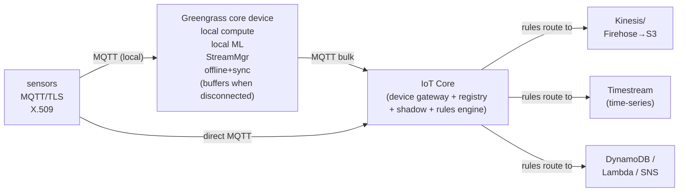
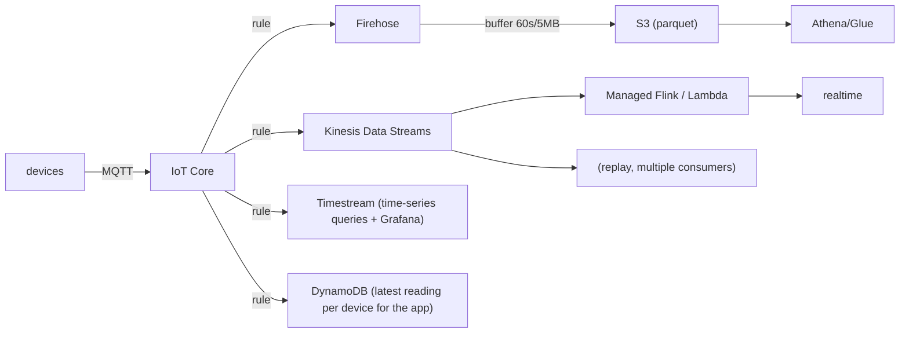

# IoT and Edge Computing on AWS: IoT Core, Greengrass and Edge

The IoT/edge space is where system design meets the physical world: millions of
constrained, intermittently-connected devices producing high-volume telemetry, needing
identity, low-latency local decisions, and a durable path into cloud analytics. The
interview bar is *not* "can you connect a device to IoT Core" — it is: **given a stated
set of constraints (device count, message rate, latency budget, connectivity quality,
data-sovereignty rules, cost, ops maturity), can you pick the right ingestion path,
decide what runs at the edge vs the cloud, choose the right identity/security model, and
defend the trade-off out loud?**

The single most important mental model: **the edge is a spectrum of "how far from the
region does compute run," and every step toward the device buys you latency, bandwidth
savings, and offline autonomy while costing you operational reach, consistency, and
central control.** Almost every design decision here is a point on that spectrum — pure
cloud (IoT Core → Kinesis → analytics), on-prem gateway (Greengrass), or AWS-managed
edge infrastructure (Local Zones, Outposts, Wavelength).

A second mental model for the messaging side: **IoT Core is a managed MQTT broker plus a
rules engine (a serverless "if this message, then route to that AWS service") plus a
device state store (shadows).** It is the front door; it deliberately does *not* store
telemetry long-term — you route it out to Kinesis/Firehose/Timestream/S3.

The interview reflexes to internalize:
- Need to just **land** streaming telemetry in S3/Redshift/OpenSearch with no code →
  IoT rule → **Firehose**.
- Need **real-time analytics / multiple independent consumers / replay** of the
  telemetry firehose → IoT rule → **Kinesis Data Streams**.
- Need **local decisions when the link is down**, local ML inference, or to pre-
  aggregate to cut bandwidth → **Greengrass** at the edge.
- Need **ultra-low latency to 5G users** or **on-prem data residency with AWS APIs** →
  **Wavelength / Outposts / Local Zones**, not IoT Core.
- Need **device state that survives disconnects** ("what SHOULD this device's config
  be") → **Device Shadow**.

---

## Why edge computing: latency, bandwidth, offline, and data sovereignty

"Edge" means running compute physically closer to where data is produced instead of
sending everything to a distant region. Four forces justify it; an interviewer wants you
to name *which one* drives a given design because they lead to different services.

1. **Latency / real-time control.** A round trip to an AWS region is typically
   ~20–100 ms+ depending on distance; a factory safety interlock, a robotics control
   loop, or AR/VR needs single-digit-millisecond reactions. You cannot put a human-safety
   or closed-loop control decision behind a WAN round trip. → Compute *must* be local
   (Greengrass on-prem, or Wavelength for mobile/5G).
2. **Bandwidth / cost.** A vibration sensor sampling at kHz, or a camera doing video, can
   produce GB/day. Backhauling raw data over cellular/satellite is expensive and
   sometimes impossible. Edge filters/aggregates/infers locally and ships only summaries
   or anomalies. A classic estimation: 10,000 sensors × 1 msg/s × 200 bytes ≈ 2 MB/s
   raw; aggregating to 1 msg/min at the edge cuts that ~60× and slashes both IoT Core
   message charges and egress.
3. **Intermittent / no connectivity.** Ships, mines, oil rigs, agricultural equipment,
   and vehicles routinely lose the link. The system must keep operating and *buffer*
   locally, then sync when reconnected. → Greengrass (local MQTT broker, StreamManager
   buffering, local shadows) is the answer; a pure-cloud design simply stops working.
4. **Data sovereignty / residency / privacy.** Regulations (or contracts) may forbid raw
   PII/PHI or video leaving a country or a building. Process/anonymize at the edge, ship
   only compliant derived data. → Outposts / Local Zones (AWS infra inside a chosen
   jurisdiction) or on-prem Greengrass.

**Trade-off — edge is not free.** Moving compute to the edge costs you: fleet
operational burden (you now patch/monitor thousands of runtimes), weaker consistency
(each edge node has a local view that may diverge), harder debugging (no single
CloudWatch pane by default), constrained hardware, and physical-security exposure.
**Reflex:** default to cloud processing; push to the edge *only* for a concrete latency,
bandwidth, offline, or sovereignty requirement you can name. "Edge for edge's sake"
multiplies ops cost for no benefit.

---

## IoT Core device gateway and the MQTT broker

**Intuition.** IoT Core's device gateway is a massively-multiplexed, fully-managed,
auto-scaling MQTT broker (also speaking HTTPS and MQTT-over-WebSocket). Devices open a
long-lived, mutually-authenticated TLS connection and publish/subscribe on *topics*
(hierarchical strings like `factory/line3/press01/temp`). It maintains millions of
concurrent connections without you provisioning brokers, partitions, or shards — this is
the core "why IoT Core over self-managed Mosquitto/EMQX on EC2" argument: no capacity
planning, no broker cluster to operate, elastic to fleet size.

**How it works / protocol facts that matter for design:**
- Supports **MQTT 3.1.1 and MQTT 5**. QoS **0** (at most once) and **QoS 1** (at least
  once) only — **there is no QoS 2** (exactly-once). If you need exactly-once semantics,
  you build idempotency downstream (dedupe on a message id), not in the broker.
- **Message payload max ≈ 128 KiB**; you are billed per 5 KB block of messaging. Topic
  name max **256 bytes**, up to 7 forward-slash levels in the reserved/`$aws` space.
- **Retained messages** (broker stores the last message on a topic and delivers it to new
  subscribers) and **Last Will and Testament (LWT)** (broker publishes a message if a
  device drops uncleanly) are supported — useful for presence/"device offline" signaling.
- **Persistent sessions** let a briefly-disconnected device resume its subscriptions and
  receive QoS-1 messages queued while it was away (queued messages have a TTL, default
  1 hour, and a per-session queue limit).
- **Basic Ingest** (`$aws/rules/<ruleName>`) lets a device send data *straight into a
  rule* without publishing to a normal pub/sub topic — you skip the message broker
  charge, keeping only the rules-engine cost. Use it when data goes device→cloud storage
  and no other device needs to subscribe.
- Per-connection throughput has soft limits (e.g. inbound publish rate per connection),
  and there are account-level rates for connections/sec and messages/sec that you raise
  via quota increases at fleet scale.

**Trade-off — IoT Core vs self-managed Kafka/MQTT on EC2/MSK:** IoT Core wins on device
identity at scale (per-device X.509 + policies), zero broker ops, native shadows/rules,
and MQTT-native constrained-device support. You give up: QoS 2, arbitrary broker plugins,
message *retention/replay of the stream itself* (IoT Core is a router, not a log — you
must tee to Kinesis/Kafka for replay), and full control over broker internals. Choose
self-managed only when you need protocol features IoT Core lacks or already run a Kafka
ecosystem you must match.

---

## Message protocols: MQTT versus HTTP versus WebSocket

Devices can talk to IoT Core over **MQTT**, **MQTT-over-WebSocket**, or **HTTPS**. The
choice is a real interview trade-off because it changes battery life, latency, and
firewall/browser compatibility.

| Dimension | MQTT | MQTT over WebSocket | HTTPS (REST) |
|---|---|---|---|
| Connection | Long-lived TLS, persistent | Long-lived, tunneled over 443 | Request/response, short-lived |
| Overhead | Very low (2-byte fixed header) | Low + WS framing | High (HTTP headers per request) |
| Server push (cloud→device) | Yes (subscribe) | Yes | No (device must poll) |
| Auth | X.509 mutual TLS (or custom) | SigV4 / custom (browser-friendly) | X.509 or SigV4 |
| Best for | Constrained devices, low power, bi-directional | Browsers / behind restrictive proxies | Simple, occasional, one-way telemetry from HTTP-only clients |
| QoS / delivery | QoS 0/1, retained, LWT | QoS 0/1 | Best-effort single POST |

- **MQTT** is the default for real devices: tiny header, one persistent connection avoids
  repeated TLS handshakes (huge for battery and cellular data), and it supports *push*
  (the cloud can command a device without polling). This bi-directional push is exactly
  what device shadows and jobs rely on.
- **MQTT over WebSocket** exists mainly for **browsers** (which can't open raw MQTT
  sockets) and for devices behind proxies/firewalls that only allow outbound 443. It uses
  **SigV4** (IAM) auth, so it fits Cognito-authenticated web/mobile clients.
- **HTTPS** is fine for a device that sends an occasional reading and never needs a
  command pushed to it, or for legacy HTTP-only hardware. But per-message TLS/HTTP
  overhead and the lack of server push make it a poor fit for chatty or command-driven
  fleets — you'd have to poll, which is wasteful and adds latency.

**Reflex:** battery-powered / command-controlled / chatty → **MQTT**; browser or
proxy-locked → **MQTT/WebSocket**; rare one-way POST from an HTTP-only client → **HTTPS**.

---

## Device registry, identity, and fleet organization

The **registry** is IoT Core's inventory of your fleet. Core objects:
- **Thing** — a logical representation of a device (name + attributes). Optional but
  needed for shadows/jobs/indexing tied to a name.
- **Thing Type** — a template of common attributes for a class of device.
- **Thing Group** (static or dynamic) — organizes things for bulk policy attachment, jobs
  targeting, and OTA. **Dynamic groups** auto-populate from a Fleet Indexing query
  (e.g. "all things with firmware < 2.0"), which is how you target rollouts.
- **Billing Group** — cost allocation.

**Fleet Indexing** builds a searchable index over registry data, shadow state, and
connectivity, so you can query "how many devices are offline in region X with battery <
10%." It powers dynamic groups and fleet dashboards.

**Provisioning at scale** is a common deep-dive:
- **Single-thing / just-in-time provisioning (JITP / JITR)** — a device presents a cert
  signed by a registered CA on first connect and is auto-registered via a template.
- **Fleet provisioning** — devices ship with a shared *claim* certificate, then exchange
  it at first boot for a unique per-device certificate (bootstrap-then-rotate). This
  avoids burning a unique cert into every device at manufacturing time.

**Trade-off — claim cert vs per-device cert at manufacture:** a single claim cert is
simpler to embed on the line but is a bigger blast radius if extracted (mitigate with
tight claim-cert policies that *only* allow the provisioning API). Per-device certs at
manufacture are most secure but require secure-element/HSM tooling on the factory line.

---

## Device shadows: desired versus reported state

**Intuition.** A shadow is a **JSON document that persists a device's state in the cloud
so apps can read/command a device even while it is offline.** It decouples the app from
device connectivity — the classic "set the thermostat to 20°C" while the thermostat is
asleep.

Structure: `desired` (what an app wants), `reported` (what the device last reported), and
the computed **`delta`** (differences the device still needs to apply). The device
subscribes to shadow topics; when it reconnects it gets the delta and converges. A
**`version`** field enables optimistic concurrency (reject stale updates).

Types:
- **Classic (unnamed) shadow** — one per thing.
- **Named shadows** — multiple per thing (e.g. separate `config`, `telemetry`, `network`
  shadows), letting different subsystems evolve independently.

Limits that matter: shadow document **max size 8 KB**; JSON nesting depth is bounded;
shadow update request rate is per-account quota'd. Shadows are for *state*, **not for
high-frequency telemetry** — do not stream 100 Hz sensor data through a shadow; that is
what MQTT topics → Kinesis are for.

**Trade-off — shadow vs direct MQTT command:** the shadow gives you durable
desired-state, offline reconciliation, and last-known-reported state "for free," at the
cost of an 8 KB ceiling and eventual (not instant) convergence. A direct MQTT command
topic is lower-latency and unbounded in shape but has no persistence — if the device is
offline the command is lost (unless you use persistent sessions/QoS 1). Use shadows for
*configuration/state that must survive disconnects*; use direct topics for *transient,
fire-and-forget or real-time* commands.

---

## The rules engine: routing messages to AWS services

**Intuition.** The rules engine is a serverless, SQL-driven router: for messages matching
a topic filter, run a SQL `SELECT` (filter/transform/enrich) and fan out to one or more
**actions** (destinations). This is how telemetry leaves the broker without you writing a
consumer.

- **SQL** over the MQTT payload: `SELECT temp, ts FROM 'factory/+/temp' WHERE temp > 80`.
  Supports functions, nested-object access, and **external enrichment** (e.g.
  `get_thing_shadow`, `aws_lambda(...)`, DynamoDB lookups) inside the statement.
- **Actions** (30+): Kinesis Data Streams, Firehose, Lambda, DynamoDB, S3, SNS, SQS,
  Timestream, OpenSearch, IoT Analytics, Step Functions, republish to another MQTT topic,
  CloudWatch, IoT SiteWise, IoT Events, EventBridge, Kafka/MSK, and more.
- **Error action** — a single fallback destination (e.g. an SQS DLQ or S3) for messages
  whose primary action fails, so you don't silently drop data.

**Design pattern — one message, many materializations:** a single rule can tee the same
reading to Firehose (→ S3 data lake), Timestream (dashboards), and DynamoDB (latest
value for an app) simultaneously. This is the IoT equivalent of a fan-out.

**Trade-offs:**
- **Rules engine vs Lambda-per-message:** doing filtering/routing in the rule SQL is
  cheaper and lower-latency than routing everything through a Lambda; reserve Lambda for
  genuine custom logic. Invoking Lambda from every message at millions of msg/s can hit
  Lambda concurrency limits and cost far more than a Kinesis fan-in.
- **Rule action to Kinesis vs Firehose (see next section)** is the biggest ingestion
  decision.
- The rules engine has **no built-in ordering or replay** — it evaluates each message
  independently and delivers roughly once (retries on action failure can duplicate).
  Build downstream idempotency; use Kinesis if you need ordering/replay.

---

## High-volume telemetry ingestion: IoT Core to Kinesis, Firehose, S3, and analytics

This is the canonical IoT data-pipeline question. IoT Core is the front door; the rules
engine tees data into a pipeline. The key fork is **Kinesis Data Streams vs Data
Firehose**.

**Kinesis Data Streams** — ordered, retained (default 24 h, up to 365 days), replayable
log; multiple independent consumers; **per-shard limits: 1 MB/s or 1000 records/s
ingest, 2 MB/s egress** (classic fan-out; Enhanced Fan-Out gives each consumer its own
2 MB/s). Choose it when you need **real-time processing, ordering per key, replay, or
several independent downstream consumers.** You manage shard count (or use On-Demand,
which auto-scales to ~200 MB/s write).

**Kinesis Data Firehose** — zero-admin delivery stream that **buffers and batch-loads**
to S3, Redshift, OpenSearch, or Splunk. No shards, no consumers, near-zero ops; it can
convert to Parquet/ORC, compress, and partition. **Buffering: up to 900 s or up to
128 MB (S3), whichever first** → so it adds *seconds-to-minutes of latency* and is *not*
real-time. Choose it when the goal is simply "**land the data durably in the lake /
warehouse**" with no custom stream processing.

| | Kinesis Data Streams | Kinesis Data Firehose |
|---|---|---|
| Model | Retained ordered log | Buffered delivery |
| Latency | Sub-second–seconds | Seconds–minutes (buffer) |
| Replay | Yes (retention window) | No |
| Multiple consumers | Yes (incl. EFO) | No (single destination type) |
| Ordering | Per shard/partition key | No guarantee |
| Scaling | Shards / On-Demand | Fully automatic |
| Ops burden | You size shards | Near zero |
| Typical use | Real-time analytics, replay, fan-out | Land in S3/Redshift/OpenSearch |

**Estimation reflex:** 1,000,000 devices × 1 msg/s × 500 bytes ≈ 500 MB/s. That's
~500 shards on Data Streams (1 MB/s each), or On-Demand. If all you do is store it, send
IoT rule → Firehose → S3 (Parquet, partitioned by date/device) and query with Athena —
far cheaper than provisioning custom consumers. Use **Basic Ingest** to avoid the broker
message charge on that firehose.

**Note (deprecation):** **AWS IoT Analytics** reached end of support (Dec 2025) — do not
propose it for new designs; use Firehose→S3 + Athena/Glue, Timestream, or Managed Service
for Apache Flink instead.

---

## AWS IoT Greengrass: the edge runtime, local compute, ML, and sync

**Intuition.** Greengrass extends AWS to the edge: it's a runtime you install on a
gateway/device (a Linux/Windows box, often an industrial gateway) that runs **local
compute, ML inference, a local MQTT broker, and data buffering**, and **syncs with IoT
Core when connected**. It is the answer to "the link is unreliable and I need local
autonomy."

**Greengrass v2** is **component-based** (each capability is a versioned "component"
deployed via the cloud), a shift from v1's monolithic groups. Key capabilities:
- **Local compute** — run Lambda functions, native processes, or Docker containers on
  the device; devices on the LAN talk to the Greengrass core, not the cloud.
- **Local MQTT broker (Moquette)** — nearby devices connect to the Greengrass core over
  MQTT even with no internet; the core is their local gateway.
- **Local shadows + sync** — shadows are served locally and reconciled to IoT Core when
  the link returns.
- **StreamManager** — durable local buffering of streams with automatic, prioritized
  export to Kinesis/IoT SiteWise/S3 when connectivity allows; survives reboots. This is
  how you avoid data loss over flaky links.
- **ML inference at the edge** — run models (e.g. SageMaker-trained, ONNX, DLR,
  TensorFlow) locally for image/anomaly detection without a cloud round trip.
- **Fleet deployment & OTA** of components via IoT jobs; **local secrets**, offline
  operation, and interprocess comms (IPC) between components.

**Trade-offs:**
- **Greengrass vs pure cloud (IoT Core only):** Greengrass buys local autonomy, offline
  operation, sub-ms LAN latency, and bandwidth reduction (aggregate/infer locally). You
  pay in operational complexity (you now manage an edge fleet, its OS, and component
  versions), harder observability, and hardware cost. Use Greengrass only when latency,
  offline, or bandwidth *require* it.
- **Greengrass vs running your own Docker/K3s at the edge:** Greengrass gives you managed
  OTA deployment, cloud-integrated identity, StreamManager, and shadow sync out of the
  box; rolling your own means building all of that. Choose your own stack only if you have
  strong edge-orchestration needs Greengrass can't meet (e.g. full Kubernetes).
- **Lambda on Greengrass vs native components:** Lambda-at-edge eases code reuse from
  cloud, but native/containerized components are more flexible and avoid Lambda runtime
  constraints at the edge; v2 favors components.

---

## Edge infrastructure: Local Zones, Outposts, and Wavelength

These are **AWS-managed edge infrastructure** — distinct from IoT Core (a service) and
Greengrass (a device runtime). They place AWS *compute and APIs* physically closer to
users/data. Interviewers test whether you pick the right one for latency vs residency vs
mobile.

| Option | What it is | Latency target | Primary use | Trade-off |
|---|---|---|---|---|
| **Local Zones** | AWS infra (EC2/EBS/some services) in a metro far from the parent region | Single-digit ms to that metro | Latency-sensitive apps (gaming, media, live) in a specific city | Subset of services; still AWS-owned facility, not your building |
| **Outposts** | A rack (or servers) of AWS hardware **in your own data center** | LAN-local to on-prem systems; local data residency | Data residency, on-prem integration, low-latency to on-prem apps | You host hardware; needs power/space/network + a link to region; capacity is finite |
| **Wavelength** | AWS compute embedded **inside telecom 5G networks** | Ultra-low latency to mobile/5G users (traffic never leaves the carrier network to reach the region) | AR/VR, connected cars, mobile gaming, real-time video for 5G users | Tied to carrier footprint; specific to mobile-edge use cases |

**When to use what vs Greengrass:**
- Data must stay **in a building/jurisdiction** and you want AWS APIs on-site →
  **Outposts** (or Local Zones if a nearby metro zone satisfies residency).
- **Mobile/5G users** need ultra-low latency (game streaming, connected vehicles) →
  **Wavelength**.
- Latency-sensitive workload for users in a **specific city** but you don't own a DC →
  **Local Zones**.
- The compute must run **on/near the device itself** (a machine on a factory floor, a
  ship, offline) → **Greengrass**, not any of the above.

**Trade-off — edge infra vs region:** all three cost more per unit and offer fewer
services than a full region, and add operational surface. Use them only for a concrete
latency/residency requirement; otherwise the region + CloudFront is cheaper and simpler.

---

## Device security: X.509 certificates, policies, and IoT Device Defender

Security is a guaranteed deep-dive. IoT's threat model is unique: huge fleets of
physically-accessible devices, long lifetimes, and no human at the keyboard.

**Authentication:**
- **X.509 client certificates + mutual TLS** is the default and best practice: each
  device has a unique cert; the private key ideally lives in a **secure element / TPM /
  HSM** so it can't be extracted. IoT Core authenticates the cert on connect.
- **SigV4 (IAM)** for MQTT-over-WebSocket / HTTPS from browser/mobile (often via Cognito).
- **Custom authorizers** (a Lambda) for bearer tokens / non-cert schemes (e.g. bridging
  legacy devices).

**Authorization:** **IoT policies** (JSON, attached to a cert/thing) scope exactly which
topics a device may `Connect`/`Publish`/`Subscribe`/`Receive` on. **Policy variables**
(e.g. `${iot:Connection.Thing.ThingName}`) enforce that a device may only use *its own*
topics — critical so a compromised device can't read the whole fleet's data. Follow least
privilege: never grant `iot:*` on `topic/*`.

**Certificate lifecycle:** certs can be **activated/deactivated/revoked**; rotate certs
before expiry; use fleet provisioning for scalable issuance; consider **just-in-time
registration** with your own CA.

**AWS IoT Device Defender** — the fleet security service:
- **Audit** — checks your account/fleet config against best practices (overly permissive
  policies, shared/duplicate certs, certs about to expire, disabled logging, etc.).
- **Detect** — continuous behavioral anomaly detection using **rule-based** thresholds
  (e.g. messages/min, auth failures, bytes out, listening ports) *and* **ML-based**
  models that learn a device's normal behavior. Alarms fire to SNS so you can quarantine
  a misbehaving device (e.g. a botnet-enrolled camera showing abnormal outbound traffic).
- Integrates with **ML Detect** and can trigger **mitigation actions** (move to
  quarantine group, update device cert, add to a things group).

**Trade-off — per-device certs (secure element) vs shared/claim credentials:** unique
hardware-protected certs give the smallest blast radius and clean per-device revocation,
at higher manufacturing cost/complexity. Shared or software-stored keys are cheap but a
single extraction compromises many devices. For anything safety- or privacy-sensitive,
pay for per-device hardware-rooted identity.

---

## Time-series storage: Amazon Timestream and alternatives

IoT telemetry is time-series: append-heavy, queried by time range and device, and it
ages (recent data is hot, old data is rarely read but must be retained cheaply).

**Amazon Timestream** is a serverless, purpose-built time-series database:
- **Tiered storage** — a fast in-memory **memory store** for recent data and a cheaper
  **magnetic store** for historical, with **automatic tiering** on a configurable
  retention policy. You pay for ingestion, storage per tier, and queries scanned.
- **SQL** with time-series functions (interpolation, smoothing, `binning`), integrates
  with Grafana/QuickSight, and is written directly from an IoT rule action.
- Scales writes and query compute automatically; no servers/shards to manage.

**Alternatives and when to choose them:**

| Store | Best for | Trade-off vs Timestream |
|---|---|---|
| **Timestream** | Native time-series metrics/telemetry, auto-tiering, SQL, dashboards | Query cost scales with data scanned; not for arbitrary OLTP |
| **DynamoDB** | Latest-value lookups, key-value per device, low-latency app reads | Not built for range/aggregation analytics; you'd design a time-bucketed key and manage TTL |
| **S3 + Athena (data lake)** | Cheapest long-term retention, ad-hoc SQL over Parquet, ML training sets | Higher query latency; not for real-time dashboards |
| **OpenSearch** | Full-text/log search, rich dashboards, geo | More ops; costlier at high ingest |
| **Amazon MemoryDB / ElastiCache** | Ultra-low-latency latest reading | In-memory cost; not durable analytics store |

**Reflex:** dashboards and time-range analytics on device metrics → **Timestream**;
"what's the latest reading for device X" for an app → **DynamoDB**; cheap forever-storage
+ ad-hoc/ML → **S3 + Athena**. Often you tee to *several* from one rule.

**Note:** IoT SiteWise is the industrial-specific model (asset hierarchies, OPC-UA
ingestion) layered on top of this for manufacturing use cases.

---

## Edge versus cloud processing: where should each computation run

The recurring judgment call. Place each computation using this checklist:

**Do it at the EDGE (Greengrass) when:**
- A decision must happen in **single-digit ms** or **without connectivity** (safety
  interlocks, control loops, autonomous behavior).
- Raw data volume is huge and mostly redundant → **filter/aggregate/infer locally** to
  cut bandwidth and cost (ship anomalies/summaries).
- **Privacy/residency** forbids raw data leaving the site (process video/PII locally,
  emit only derived features).

**Do it in the CLOUD when:**
- You need the **global view** — cross-device correlation, fleet-wide ML training,
  long-term analytics, and dashboards.
- You want **elastic scale and zero edge ops** — the region auto-scales; you don't patch
  thousands of nodes.
- Data is **low-volume** or latency-tolerant — no reason to distribute compute.

**Hybrid (the usual real answer):** infer/aggregate at the edge, send summaries +
anomalies to the cloud, **train models centrally and deploy them to the edge** (train in
SageMaker → deploy as a Greengrass ML component). This is the "train in the cloud, infer
at the edge" pattern.

**Trade-off framing to say out loud:** the edge trades *central consistency and low ops
cost* for *latency, autonomy, and bandwidth savings*. Every kilobyte you process at the
edge is a kilobyte you don't pay to transmit and a decision you can make when offline —
but it's also code you now have to deploy, monitor, and secure on hardware you don't fully
control.

---

## Scaling to millions of devices and failure modes

**Scaling levers:**
- IoT Core auto-scales connections/throughput, but **account quotas** on connections/sec,
  messages/sec, and inbound publish rate must be raised proactively before a mass
  reconnect (e.g. after a regional blip, millions of devices reconnecting is a
  **thundering herd** — mitigate with **jittered exponential backoff** in device firmware
  and staggered fleet provisioning).
- **Sharding by topic hierarchy** and using **Basic Ingest** to cut broker cost at scale.
- **Fleet provisioning + dynamic groups + jobs** to roll out firmware/config in waves
  (canary a small group, then expand) rather than all at once.
- Downstream: size **Kinesis shards** (or On-Demand) to aggregate device throughput;
  watch the **1 MB/s per-shard** ceiling and **hot shards** from a bad partition key.

**Failure modes and how the design degrades:**
- **Regional / AZ issues:** IoT Core is regional; a region impairment stops cloud
  ingestion. Edge devices with **Greengrass keep operating locally** and StreamManager
  buffers until recovery — this is a major resilience argument for edge. For cloud-side
  DR, replicate the registry/config and design devices to fail over to a secondary
  endpoint (multi-region IoT is non-trivial — registry and shadows don't auto-replicate).
- **Connectivity loss:** without Greengrass, telemetry is lost unless devices buffer
  locally; QoS 1 + persistent sessions only cover brief drops (queued-message TTL,
  default 1 h). Long outages need edge buffering.
- **Throttling:** exceeding message/connection quotas → throttled connects/publishes;
  devices must back off. A rule action to a downstream at its own limit (e.g. Kinesis
  shard, DynamoDB partition **3000 RCU / 1000 WCU**, Lambda concurrency) throttles the
  pipeline — route overflow to the **rule error action** (SQS/S3 DLQ) to avoid loss.
- **Hot partition / hot shard:** a poor Kinesis partition key or DynamoDB key funnels a
  region/device-type into one shard/partition and caps throughput well below the fleet
  aggregate — spread keys (e.g. hash device id).
- **Compromised device:** Device Defender Detect flags anomalous behavior; mitigation
  moves it to a quarantine group / revokes its cert.

---

## Trade-offs and when to use what: a decision cheat-sheet

- **Ingestion path:** land-in-lake only → IoT rule → **Firehose → S3 (Parquet)**;
  real-time / replay / multi-consumer → IoT rule → **Kinesis Data Streams**; dashboards →
  **Timestream**; latest-value app reads → **DynamoDB**. Tee to several from one rule.
- **Protocol:** battery/command/chatty → **MQTT**; browser/proxy → **MQTT/WebSocket**;
  rare one-way HTTP-only client → **HTTPS**.
- **State vs command:** durable config surviving offline → **Device Shadow (≤8 KB)**;
  transient real-time command → **direct MQTT topic**; high-frequency telemetry → **never
  the shadow**, use topics → Kinesis.
- **Edge vs cloud:** local latency/offline/bandwidth/residency requirement → **Greengrass**
  (device runtime) or **Outposts/Local Zones/Wavelength** (AWS-managed infra); otherwise
  **cloud** for global view, elastic scale, low ops.
- **Edge infra pick:** on-prem residency → **Outposts**; specific-metro latency →
  **Local Zones**; 5G/mobile ultra-low latency → **Wavelength**.
- **Identity:** default **per-device X.509 + least-privilege IoT policy with policy
  variables**; browser/mobile → **SigV4/Cognito**; legacy tokens → **custom authorizer**.
- **Provisioning:** scale without unique factory certs → **fleet provisioning (claim →
  unique cert)**; own CA → **JITP/JITR**.
- **Managed vs self-managed broker:** default **IoT Core** (no ops, device identity,
  shadows, rules); self-managed **MQTT/Kafka** only for QoS 2 / plugins / existing Kafka
  ecosystem.
- **Security monitoring:** always enable **Device Defender Audit + Detect** for fleets.

---

## Common interview follow-up questions

- "You have 5 million devices each sending a 300-byte reading every 10 seconds. Design the
  ingestion pipeline end to end and justify every service and its scale." (Estimate
  ~150 MB/s aggregate; Basic Ingest → rule → Firehose/S3 for storage + Kinesis for
  real-time; watch shard/quota limits.)
- "The devices are on ships with satellite links that drop for hours daily. What changes?"
  (Greengrass + StreamManager local buffering; local shadows; sync on reconnect.)
- "How do you push a config change to a device that is currently offline?" (Device Shadow
  desired state; device applies delta on reconnect.)
- "Kinesis vs Firehose for this telemetry — when would you switch?" (Real-time/replay/
  multi-consumer vs land-in-lake with buffer latency.)
- "How do you stop a compromised camera from exfiltrating the fleet's data?" (Policy
  variables scoping topics to the thing; Device Defender Detect + mitigation; per-device
  cert revocation.)
- "Why not just run Mosquitto on EC2?" (Ops burden, no managed device identity at scale,
  no shadows/rules, capacity planning; IoT Core trades QoS 2/plugins for zero-ops scale.)
- "How would you do exactly-once processing when IoT Core only offers QoS 0/1?"
  (Idempotency downstream via message id dedupe; QoS 1 is at-least-once.)
- "Where would you run an anomaly-detection ML model and why?" (Train in SageMaker in the
  cloud for the global view; deploy as a Greengrass ML component to infer at the edge for
  latency/bandwidth/offline.)
- "How do you avoid a thundering herd when a region recovers and millions reconnect?"
  (Jittered exponential backoff in firmware; staggered/quota-raised connects.)
- "How do you keep old telemetry cheaply for years but keep dashboards fast?" (Timestream
  memory→magnetic tiering, or tee to S3/Athena for cold storage.)

## References

- AWS IoT Core Developer Guide — device gateway, MQTT (3.1.1/5, QoS 0/1), topics,
  message size (128 KiB), retained messages, LWT, persistent sessions, Basic Ingest.
- AWS IoT Core — Rules engine (SQL, actions, error action) and Device Shadow service
  (classic/named shadows, desired/reported/delta, 8 KB limit) documentation.
- AWS IoT Greengrass v2 Developer Guide — components, local MQTT broker (Moquette),
  StreamManager, local shadows/sync, ML inference at the edge, deployments/OTA.
- AWS IoT Device Defender documentation — Audit and Detect (rule-based and ML), mitigation
  actions.
- AWS IoT Core security — X.509 mutual TLS, IoT policies and policy variables, custom
  authorizers, fleet provisioning, JITP/JITR.
- Amazon Kinesis Data Streams & Data Firehose Developer Guides — shard limits
  (1 MB/s, 1000 rec/s, 2 MB/s egress), On-Demand, Enhanced Fan-Out; Firehose buffering
  (900 s / 128 MB).
- Amazon Timestream Developer Guide — memory/magnetic tiering, SQL time-series functions.
- AWS Local Zones, AWS Outposts, and AWS Wavelength product documentation and FAQs.
- AWS Well-Architected Framework — IoT Lens; AWS Architecture Center IoT reference
  architectures; re:Invent IoT "deep dive" / "design patterns" sessions.
- AWS announcement of AWS IoT Analytics end of support (Dec 2025).
