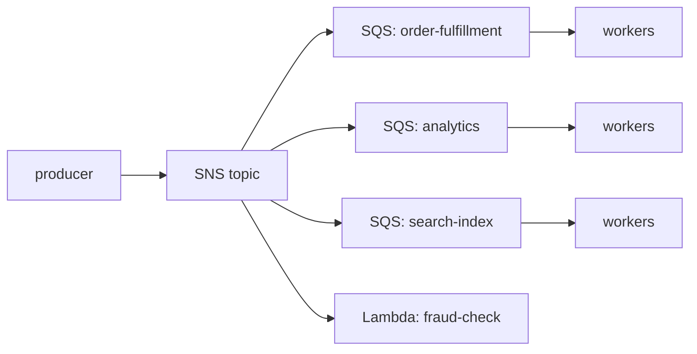

# AWS Messaging: SQS, SNS and EventBridge

The three AWS messaging primitives solve overlapping problems with very different
semantics. In an interview, naming "SQS" or "SNS" scores nothing; the points come
from articulating *why* one primitive fits a constraint and *what you give up*
versus the alternatives. The mental model:

- **SQS** = a durable **queue** for point-to-point, worker-pull, load-leveled work.
  One message is processed by one consumer group. "Give me a buffer of work I can
  drain at my own pace."
- **SNS** = **pub/sub topic** for low-latency **fan-out**. One publish, many
  parallel subscribers, push delivery. "Tell everyone who cares, now."
- **EventBridge** = a **serverless event bus + router** with content-based
  filtering, schema registry, SaaS integrations, archive/replay and a scheduler.
  "Route events by their content to the right targets, decoupled by schema."

They compose: the canonical event-driven pattern is **SNS (or EventBridge) →
several SQS queues → fleets of consumers**, combining fan-out with per-consumer
buffering and independent failure isolation.

This document ends every section in trade-offs, because that is what gets probed.

---

## SQS standard versus FIFO queues

**Intuition.** SQS is a fully managed, distributed queue. Producers `SendMessage`,
consumers `ReceiveMessage` (pull), process, then `DeleteMessage` to acknowledge.
There is no broker to run, no partitions to size — you just get an HTTPS endpoint.
The one big decision is **queue type**, chosen at creation and immutable.

**Standard queues**
- **At-least-once delivery.** A message is delivered one *or more* times.
  Duplicates are rare but expected — consumers **must be idempotent**.
- **Best-effort ordering.** Messages usually arrive roughly in order but there is
  **no ordering guarantee**; a later message can overtake an earlier one.
- **Nearly unlimited throughput.** No published cap on transactions per second —
  it scales horizontally behind the scenes. This is the default and the right
  choice for the vast majority of workloads.

**FIFO queues**
- **Exactly-once *processing*.** Achieved via deduplication: within a 5-minute
  dedup window, a duplicate `MessageDeduplicationId` (or content-hash if
  content-based dedup is on) is accepted but not delivered again.
- **Strict ordering within a message group.** `MessageGroupId` partitions the
  queue; order is guaranteed *per group*, and messages in one group block behind
  each other. Different groups are processed in parallel and independently.
- **Throughput is capped.** Base FIFO: **300 API calls/sec** per action
  (send/receive/delete), i.e. **300 msg/s**, or **3,000 msg/s with batching**
  (10 messages per batch). **High-throughput FIFO mode** raises this to thousands
  of messages/sec per queue (into the tens of thousands with batching in large
  regions) but you must spread load across **many message groups** to get there —
  a single hot group is still serialized.

**Trade-offs**
- **Ordering/dedup vs throughput and latency.** FIFO buys you order + dedup but
  costs throughput ceiling and adds head-of-line blocking: a poison message at
  the front of a group stalls the whole group. Standard has no such ceiling and
  no HoL blocking, but you own idempotency and cannot assume order.
- **When to pick FIFO:** the *processing order matters for correctness* and you
  cannot make operations commutative/idempotent — e.g. "apply account debit then
  credit", "process user's edits in sequence". Use `MessageGroupId = userId` (or
  `accountId`) so unrelated users don't block each other and you still get
  parallelism.
- **When to pick Standard (default):** almost everything else. If you can design
  idempotent, order-independent consumers (natural key upserts, versioned writes,
  last-writer-wins with timestamps), Standard is cheaper, faster and infinitely
  scalable. Interview tip: "I'd default to Standard + idempotency and only reach
  for FIFO when the domain truly requires per-key ordering."
- **Cost:** Standard ~$0.40 / million requests, FIFO ~$0.50 / million (first 1M/mo
  free). Batching (up to 10 msgs/request) cuts request count and cost ~10x.

**Worked example — "per-customer ordering at 50,000 msg/s: how far does FIFO go?"**
Set `MessageGroupId = customerId` so each customer's messages are ordered but
different customers run in parallel.

1. *Spread across groups.* Say 50,000 active customers averaging **1 msg/s** each
   (or 5,000 customers at 10 msg/s) → 50,000 groups, each trivially slow. A single
   group is *serialized end to end*, so what matters is that no one group is hot,
   not the total.
2. *One queue enough?* Base FIFO caps at **3,000 msg/s** (batched). 50,000 / 3,000
   ≈ **17× over** — base mode is out. **High-throughput FIFO** raises a single queue
   into the tens of thousands msg/s (region-dependent). If your region's ceiling is,
   say, ~30,000 msg/s, then 50,000 still exceeds one queue.
3. *Shard across queues.* Use ⌈50,000 / 30,000⌉ = **2 FIFO queues**; route with
   `queueIndex = hash(customerId) mod 2`, so **all of one customer's messages always
   land on the same queue** → per-customer order preserved, ~25,000 msg/s each. If
   the per-queue ceiling were only 10,000 msg/s you'd need ⌈50,000/10,000⌉ = **5
   queues**.
4. *The wall FIFO can't climb.* If a **single customer** needs more than a few
   hundred *ordered* msg/s, no amount of sharding helps — one group is serialized and
   cannot be parallelized. At that point per-key ordering is the wrong tool: move to
   Kinesis/Kafka (same per-partition serialization wall, but higher ceilings and
   replay) or redesign the ops to be commutative so order stops mattering.

**Worked example — the 5-minute dedup window (why FIFO ≠ true exactly-once).**
With `MessageDeduplicationId = X`:
- **t = 0:00** — send `X` → accepted and **delivered** once.
- **t = 2:00** — a retry re-sends `X` (same id, still inside the 5-min window) → SQS
  returns success but **does not enqueue a second copy**; the consumer sees it once.
- **t = 6:00** — the same `X` is sent again (window has expired) → treated as **new**
  and **delivered again** → the consumer sees a duplicate.

So "exactly-once processing" holds only *within* the window; at minute 6 a duplicate
slips through. This is exactly why consumers must still be idempotent even on FIFO.

---

## Visibility timeout, polling and message lifecycle

**Lifecycle.** `SendMessage` → message durable in queue → `ReceiveMessage` returns
it *and hides it* for the **visibility timeout** → consumer processes →
`DeleteMessage` (ack). If the consumer does not delete within the timeout, the
message becomes visible again and is redelivered. This "no explicit ack = redeliver"
design is what makes SQS resilient to consumer crashes — but is also the root of
duplicate delivery.

**Visibility timeout**
- Default **30 seconds**; range **0 seconds to 12 hours**.
- **Too short** → a slow consumer's message reappears and gets processed twice
  while the first is still working (duplicate work, possible races).
- **Too long** → if a consumer crashes, the message is stuck invisible for a long
  time before retry (increased latency to recovery).
- Set it to **> p99 processing time**. For variable work, call
  `ChangeMessageVisibility` to extend the lease (heartbeat) mid-processing rather
  than setting a huge static timeout.

**Long polling vs short polling**
- **Short polling** (WaitTimeSeconds = 0) samples a subset of SQS servers and can
  return empty even when messages exist — wasteful, more empty responses, more
  request cost.
- **Long polling** (WaitTimeSeconds up to **20 s**) waits for a message to arrive
  (or the timeout), queries all servers, returns as soon as anything is available.
  **Always prefer long polling**: fewer empty receives, lower cost, lower latency.

**Trade-offs**
- Long polling is strictly better for cost/latency except that each open receive
  holds a connection up to 20 s — irrelevant for server consumers, a minor
  consideration for very latency-sensitive sub-second polling loops.
- **In-flight limit:** a Standard queue allows up to **120,000 in-flight**
  (received, not yet deleted) messages; FIFO up to **20,000**. Exceeding it
  returns an error — a signal that consumers are too slow or the visibility
  timeout is too long.

---

## Dead-letter queues, redrive and poison messages

**Poison message problem.** A message that always fails processing (malformed,
references deleted data, triggers a bug) will be redelivered forever after each
visibility timeout, blocking throughput and burning compute.

**Dead-letter queue (DLQ).** A separate SQS queue you attach via a **redrive
policy** with a `maxReceiveCount`. After a message has been received that many
times without being deleted, SQS moves it to the DLQ instead of redelivering.
There it can be inspected, alarmed on (CloudWatch `ApproximateNumberOfMessagesVisible`
on the DLQ), and later **redriven** back to the source queue after a fix (DLQ
redrive, available in console/API).

**Worked example — a poison message walking to the DLQ.**
Queue with **visibility timeout = 30 s**, **maxReceiveCount = 3**. A malformed
message that always throws:

| Wall clock | Event | receiveCount |
|---|---|---|
| t = 0:00 | `ReceiveMessage` returns it, hidden 30 s; consumer throws, no `DeleteMessage` | 1 |
| t = 0:30 | visibility expires → message reappears, redelivered; throws again | 2 |
| t = 1:00 | reappears again, redelivered; throws again | 3 |
| t = 1:30 | visibility expires; next receive **would** be #4 > maxReceiveCount → SQS **moves it to the DLQ** instead | — |

So the poison message lands in the DLQ at **≈ 1:30** — roughly
`maxReceiveCount × visibilityTimeout = 3 × 30 s = 90 s` of wall-clock churn (plus
receive latency). Two takeaways: (1) that product sizes how long poison burns
compute before quarantine — a 5-min visibility timeout with maxReceiveCount=5 means
~25 min per poison message; (2) give the DLQ retention *longer* than that plus your
investigation time, or failures expire before you look.

**Design rules**
- DLQ **type must match** the source (FIFO source → FIFO DLQ).
- Give the DLQ a **longer retention** than the source so failures aren't lost
  while you investigate (source might be 4 days, DLQ 14 days).
- `maxReceiveCount` is a balance: too low DLQs transient failures (a brief
  downstream blip); too high wastes retries on genuine poison. Typical 3–5.
- **Alarm on DLQ depth > 0** — a non-empty DLQ is almost always an incident.

**Trade-offs**
- A DLQ isolates poison messages so healthy traffic flows, but it is *not* a retry
  policy — you still need code/process to fix and redrive. For pure transient
  failures, prefer bounded in-consumer retry with backoff *before* leaning on the
  DLQ, or use partial-batch-response semantics with Lambda so only failed records
  return to the queue.
- For Lambda event-source-mapping consumers, use **ReportBatchItemFailures** so a
  single bad record in a batch of 10 doesn't force reprocessing (and re-billing)
  of the 9 good ones.

---

## Message retention, delays and large payloads

**Retention.** Messages live in a queue for the **message retention period**:
default **4 days**, configurable **60 seconds to 14 days**. After that they are
deleted whether consumed or not. This bounds how long a down consumer can be
offline before data loss — a key capacity/DR number to state in a design.

**Delays and timers**
- **Delay queue:** every message is invisible for a set delay after send
  (0–**15 minutes**).
- **Message timers:** per-message delay override (0–15 min).
- Need longer scheduling? SQS maxes at 15 min — use **Step Functions `wait`**,
  **EventBridge Scheduler**, or DynamoDB TTL + stream for arbitrary future
  scheduling.

**Size limit and the Extended Client.** Max message size is **256 KB** (262,144
bytes) for both Standard and FIFO — this includes body + attributes. For larger
payloads:
- Use the **SQS Extended Client Library** (Java/Python): it stores the payload in
  **S3** and puts only a pointer (S3 reference) in the SQS message; the consumer
  library transparently fetches from S3. Supports up to **2 GB**.
- Or the **claim-check pattern** by hand: write blob to S3, send the key.

**Trade-offs**
- Extended client / claim-check adds S3 latency and cost and an extra failure mode
  (S3 object deleted before consumer reads), but keeps the queue cheap and fast and
  is the standard answer for "I need to send 5 MB images through a queue." Never
  base64 a large blob into the message body — you'll hit 256 KB and pay more.
- Long retention (14 days) is cheap insurance for DR/replay of a *queue*, but SQS
  is not an event log: once consumed and deleted, a message is gone. If you need
  to replay history to *new* consumers, that's Kinesis/Kafka/EventBridge-archive
  territory, not SQS.

---

## SNS pub-sub and the SNS plus SQS fan-out pattern

**Intuition.** SNS is publish/subscribe: a producer `Publish`es one message to a
**topic**; SNS **pushes** it to every subscriber. Subscribers can be **SQS queues,
Lambda functions, HTTP/S endpoints, email, SMS, mobile push, and Kinesis Data
Firehose**. It is push (SNS calls you), whereas SQS is pull (you call SQS).

**The SNS + SQS fan-out pattern (the canonical AWS design).**



Each consumer gets its **own** SQS queue subscribed to the topic. Benefits:
- **Buffering per consumer** — a slow analytics consumer builds queue depth
  without affecting fulfillment.
- **Failure isolation** — one queue's DLQ/backlog doesn't touch the others.
- **Independent scaling and retention** per consumer.
- **Add/remove consumers** without touching the producer.

**Why not subscribe consumers directly to SNS?** Direct HTTP/Lambda subscribers
have SNS's own retry policy; if they're down past the retry window the message is
**lost** (unless a subscription DLQ is set). Interposing SQS gives durable storage
and pull-based load-leveling. Rule of thumb: **fan-out to SQS when consumers need
durability/buffering; fan-out to Lambda directly for lightweight, fast, idempotent
reactions.**

**Delivery semantics and reliability**
- Standard SNS is **at-least-once**, best-effort ordering. Set a **subscription
  DLQ** (redrive policy) so undeliverable messages (e.g. Lambda throttled past
  retries) are captured, not dropped.
- SNS→SQS delivery is free of charge for the delivery leg; you pay for the publish
  and the SQS requests.

**Trade-offs**
- SNS gives low-latency push fan-out but **no filtering by content unless you add
  filter policies**, no replay, no ordering (standard). If subscribers need
  content-based routing across many event types, EventBridge is usually the better
  bus (see below). If you just need "N copies of this message, fast," SNS wins on
  latency and simplicity.

---

## SNS standard versus FIFO topics and message filtering

**Standard vs FIFO topics.** Like SQS, SNS has two topic types:
- **Standard topics:** high throughput, at-least-once, best-effort order. Can
  fan out to all subscriber types.
- **FIFO topics:** strict ordering + dedup (5-min dedup window), with
  `MessageGroupId`/`MessageDeduplicationId`. **SNS FIFO topics deliver only to SQS
  queues** — to **SQS FIFO** queues when you need order/dedup preserved end-to-end,
  or to **SQS standard** queues when downstream can tolerate best-effort order (and
  you just want dedup at publish). They **cannot** deliver to customer-managed
  endpoints — HTTP/S, email, SMS, or mobile push — because those can't guarantee
  strict order; to reach a Lambda you subscribe an SQS queue and let it trigger the
  function. Throughput is capped: **300 msg/s per message group**, with a per-topic
  default of **3,000 msg/s (or 20 MB/s, whichever comes first)** when
  `FifoThroughputScope=Topic` (raisable via quota increase). Use SNS FIFO → SQS FIFO
  when you need ordered fan-out.

**Message filtering (subscription filter policies).** Each subscription can carry a
**filter policy** (JSON). SNS evaluates it against the message and only delivers
matching messages. Filtering can be on **message attributes** (default) or, if
enabled, on the **message body**. Operators include exact match, prefix,
anything-but, numeric ranges, exists.

```
Filter policy on the "search-index" subscription:
{ "eventType": ["ProductCreated","ProductUpdated"], "region": ["us-east-1"] }
```

This pushes routing into SNS so each consumer only gets relevant messages — no
consumer-side filtering, no wasted invocations.

**Worked example — one publish, four subscriptions, filter policies decide.**
Publish to an `orders` topic with attributes
`{ eventType: "OrderPlaced", region: "us-east-1", amount: 1500 }`:

| Subscription | Filter policy | Match? | Why |
|---|---|---|---|
| `fulfillment` (SQS) | *(none)* | ✅ delivered | no policy → receives everything |
| `search-index` (SQS) | `{ "eventType": ["ProductCreated","ProductUpdated"] }` | ❌ skipped | `"OrderPlaced"` not in the allowed list |
| `analytics` (SQS) | `{ "region": ["us-east-1"] }` | ✅ delivered | region matches |
| `fraud-check` (Lambda) | `{ "amount": [{ "numeric": [">", 1000] }] }` | ✅ delivered | 1500 > 1000 |

One `Publish` fans out to **fulfillment, analytics, and fraud-check**; `search-index`
is filtered out at SNS and never pays for a delivery or an invocation. Now publish an
`OrderPlaced` with `amount: 200`: fraud-check drops out (200 is not > 1000), and only
fulfillment + analytics receive it. The routing decision happens once, in SNS —
consumers never see messages they'd only discard.

**Trade-offs**
- Filter policies keep fan-out efficient and cheap (you don't pay to deliver + drop
  on the consumer), but they are **coarser than EventBridge patterns** (no content
  transformation, fewer operators historically, and cross-attribute logic is
  limited). For rich content-based routing, schema evolution, and many event
  producers, EventBridge's event patterns and input transformer are stronger.
- FIFO topics trade the same throughput ceiling and delivery-target restrictions
  for ordering — only adopt them when ordered fan-out is a real requirement.

---

## EventBridge event bus, rules and content-based routing

**Intuition.** EventBridge is a **serverless event router**. Producers `PutEvents`
onto an **event bus**; **rules** match events by **event pattern** (JSON matching
on the event's content) and forward matched events to **targets** (Lambda, SQS,
SNS, Step Functions, Kinesis, API destinations/HTTP, another event bus, and 20+
AWS services). Up to **5 targets per rule**, multiple rules per bus.

**Buses**
- **Default bus:** receives events from **AWS services** (EC2 state changes, S3,
  CodePipeline, etc.) automatically and free.
- **Custom buses:** for your application's own events.
- **Partner/SaaS buses:** SaaS providers (Datadog, Zendesk, Shopify, etc.) push
  events directly onto a dedicated bus — a first-class integration SNS/SQS lack.

**Event pattern (content-based routing).** Far richer than SNS filter policies:
match on any field of the event JSON, with prefix, suffix, numeric range,
anything-but, exists, wildcard, `$or`, and CIDR matching. Combined with the
**input transformer**, you can reshape the event before it hits the target.

```json
{
  "source": ["com.shop.orders"],
  "detail-type": ["OrderPlaced"],
  "detail": { "amount": [{ "numeric": [">", 1000] }],
              "country": ["US","CA"] }
}
```

**Schema registry.** EventBridge can **discover** event schemas from bus traffic
and generate **code bindings** (typed objects) for producers/consumers — helps
teams evolve contracts safely.

**Trade-offs**
- EventBridge is the best **router/bus** when you have many event types, many
  producers/consumers, SaaS sources, and need content-based routing + schema
  governance. You give up **latency** (typically ~0.5 s target latency vs SNS's
  tens of ms) and raw fan-out throughput, and PutEvents has region-specific
  quotas (thousands of events/sec, raisable). It is at-least-once and **unordered**.
- **Cost:** ~$1.00 per million **custom** events published (AWS-service events on
  the default bus are free). More expensive per message than SNS ($0.50/M
  publishes) — but you pay for routing intelligence you'd otherwise build.

---

## EventBridge Scheduler, Pipes, archive and replay

**EventBridge Scheduler.** A dedicated, serverless **cron/one-time scheduler** that
can invoke 200+ AWS API targets. Supports **cron** and **rate** expressions and
**one-time** schedules with time zones and flexible time windows, and scales to
**millions of schedules**. Replaces the old "CloudWatch Events scheduled rule"
approach (which was limited to the default bus and coarser). Use it for
per-customer reminders, TTL-style callbacks, batch kick-offs.

- **Trade-off vs SQS delay/Step Functions wait:** SQS delay maxes at 15 min; Step
  Functions `wait` is great for a *workflow* step but you pay per state transition
  and it's awkward for millions of independent future timers. Scheduler is the
  purpose-built primitive for large-scale arbitrary-time scheduling.

**EventBridge Pipes.** Point-to-point integration: **source → (filter) → (enrich)
→ target** with no glue code. Sources include SQS, Kinesis, DynamoDB Streams, MSK/
Kafka; enrichment via Lambda/Step Functions/API; target is any EventBridge target.
Replaces hand-written Lambda "shovels" between services.

**Archive and replay.** EventBridge can **archive** all (or filtered) events on a
bus and later **replay** them to targets — enabling event sourcing, reprocessing
after a bug fix, and populating new consumers with history. SNS has no equivalent;
this is a major EventBridge advantage for auditability and reprocessing.

**Trade-offs**
- Archive/replay gives you a durable, replayable event history (approaching what
  Kafka/Kinesis retention offers) without running a log — but replay is coarse
  (replays to matching rules/targets, not a fine-grained offset seek), and archive
  storage costs accrue. For high-throughput, low-latency ordered streaming with
  precise offset control, Kinesis/Kafka still win.

---

## SNS versus EventBridge, when to use which

Both are pub/sub-ish routers. The distinction interviewers want:

| Dimension | SNS | EventBridge |
|---|---|---|
| Primary role | High-throughput, low-latency fan-out | Content-based event **routing** + governance |
| Latency | ~tens of ms | ~0.5 s (higher) |
| Throughput | Very high (near-unlimited standard) | High, but PutEvents quota'd per region |
| Filtering | Subscription filter policies (attributes/body) | Rich event patterns (ranges, prefix, `$or`, wildcards) |
| Targets | SQS, Lambda, HTTP, email, SMS, push, Firehose | Lambda, SQS, SNS, Step Functions, Kinesis, API dest, 20+ services |
| SaaS sources | No | Yes (partner buses) |
| Schema registry | No | Yes (discovery + code bindings) |
| Archive / replay | No | Yes |
| Scheduler | No | Yes (EventBridge Scheduler) |
| Ordering | Standard: best-effort; FIFO topics available | No ordering |
| Cost | $0.50 / M publishes; SQS delivery free | $1.00 / M custom events |
| Fan-out breadth | Up to ~12.5M subscriptions/topic; massive fan-out | 5 targets/rule (add rules to scale) |

**Rules of thumb**
- **Choose SNS** when you need **maximum fan-out throughput and lowest latency** to
  many subscribers, especially the **SNS→SQS** buffering pattern, mobile push, SMS,
  and simple attribute-based routing. Also cheaper per message.
- **Choose EventBridge** when you need **content-based routing across many event
  types**, **SaaS/partner integrations**, **schema governance**, **archive/replay**,
  or **scheduling**. It is the natural backbone of an enterprise event-driven
  architecture / event mesh.
- **They coexist:** EventBridge for routing/governance at the "front door," SNS for
  fast fan-out where latency/throughput dominate, both feeding SQS for buffering.

---

## SQS versus Kinesis versus Kafka for the same problem

A frequent probe: "you could put this on SQS, Kinesis, or Kafka — which and why?"

| Aspect | SQS | Kinesis Data Streams | Kafka / MSK |
|---|---|---|---|
| Model | Queue (delete on ack) | Sharded log (offset/iterator) | Partitioned log (offset) |
| Ordering | FIFO: per group; Standard: none | Per shard (by partition key) | Per partition (by key) |
| Replay | No (consumed = gone) | Yes, within retention | Yes, within retention |
| Consumers | Competing consumers share a queue | Many independent readers, each own offset | Consumer groups, each own offset |
| Throughput | Standard: near-unlimited | 1 MB/s or 1,000 rec/s **ingest per shard**; 2 MB/s egress/shard | Very high, add partitions/brokers |
| Retention | 60 s–14 days | 24 h default, up to 365 days | Configurable (often days–weeks) |
| Scaling | Automatic, no capacity to manage | Manage shard count (or on-demand) | Manage partitions/brokers (or MSK Serverless) |
| Ops burden | Lowest | Medium | Highest (or medium with MSK Serverless) |
| Best for | Decoupled work queues, task fan-out | Real-time streaming, multiple readers, ordered per key, replay | High-scale streaming, ecosystem, exactly-once, long retention |

**Decision guidance**
- **SQS** when work is a **queue of tasks** consumed once by a worker pool, you
  want zero capacity management, and you don't need replay or multiple independent
  readers. This is most "process this backlog" problems.
- **Kinesis** when you need **ordered, replayable streaming** with **multiple
  independent consumers** (analytics + real-time + archive all reading the same
  stream), and per-key ordering matters. Watch the **per-shard limits** (1 MB/s or
  1,000 records/s in; 2 MB/s out) — a hot partition key overloads one shard
  ("hot shard"), the streaming analog of a hot DynamoDB partition.
- **Kafka/MSK** when you need Kinesis-like semantics but with the **Kafka
  ecosystem** (Connect, Streams, exactly-once, compaction), higher throughput
  ceilings, or portability off AWS — at the cost of the **highest operational
  burden** (unless MSK Serverless).

**Trade-off framing:** SQS optimizes for *simplicity + a work queue*; Kinesis/Kafka
optimize for *a durable, replayable, multi-reader ordered log*. The tell for a log:
"we need to add new consumers later and replay history," or "several teams read the
same stream independently." The tell for a queue: "one pool of workers drains this."

---

## Idempotency, exactly-once and ordering across the stack

**There is no free exactly-once delivery.** Standard SQS, SNS, and EventBridge are
all **at-least-once** — you *will* see duplicates. Even SQS FIFO gives exactly-once
*processing* only within a **5-minute dedup window** and only for identical dedup
IDs; a redriven or reprocessed message hours later can recur. So:

- **Make consumers idempotent.** Techniques: dedup table keyed on a
  business/message id (DynamoDB conditional `PutItem` with a TTL), natural-key
  upserts, versioned/conditional writes (last-writer-wins by timestamp/version),
  or idempotency keys carried in the message. This is the single most important
  correctness practice in AWS messaging.
- **Ordering** is only guaranteed by **FIFO (per message group)** or a **log per
  shard/partition (Kinesis/Kafka)**. Standard SQS/SNS/EventBridge can reorder. If
  you need order, either use FIFO/log with a good partition key, or make operations
  **commutative** so order stops mattering.
- **Poison messages** must be bounded (maxReceiveCount → DLQ) or they retry forever.

**Trade-offs.** Idempotency shifts complexity to the consumer and adds a dedup-store
read/write per message (latency + cost), but it lets you use cheap, unlimited-
throughput Standard queues instead of throughput-capped FIFO. Per-group ordering
(FIFO) or per-key partitioning (Kinesis/Kafka) trades parallelism for order —
choose the partition key so unrelated entities don't serialize behind each other.

---

## Security, encryption and access control

**Intuition.** A queue or topic is a *shared-nothing front door*: by default only the
account that created it can touch it, and traffic rides HTTPS. The three questions an
interviewer probes are (1) *is the data encrypted at rest?* (2) *who is allowed to
publish/send and receive?* and (3) *how does a client reach the service without going
over the public internet?* These map cleanly to encryption, resource policies, and VPC
endpoints. This matters because AWS uses a **shared-responsibility model**: AWS secures
the service and the physical layer, but *you* own the encryption choice, the access
policy, and the network path.

**Encryption at rest.**
- **SSE-SQS / SSE-SNS (AWS-managed keys):** on by default for new queues/topics,
  zero config, no extra cost. AWS owns and rotates the key. Good enough for most
  intra-account workloads.
- **SSE-KMS (customer-managed key, CMK):** you supply a KMS key. You gain (a) an
  **audit trail** — every `Decrypt`/`GenerateDataKey` shows up in CloudTrail — and
  (b) the ability to **grant cross-account access to the key** so another account can
  actually read the messages. You give up money and headroom: KMS calls cost per
  request and are themselves rate-limited, so a very high-throughput queue can hit
  **KMS throttling**. Mitigation: SQS caches data keys (the `KmsDataKeyReusePeriod`,
  60 s–24 h) so it isn't calling KMS on every message — a longer reuse period means
  fewer KMS calls (cheaper, less throttling) but a wider blast radius if a key is
  compromised. Pick SSE-KMS when you need audit or cross-account decryption; default
  to SSE-SQS otherwise.
- **In transit:** all API calls are HTTPS/TLS; you can additionally *deny* non-TLS
  requests with a policy condition (`aws:SecureTransport = false`).

**Access control — who can Publish/SendMessage/Receive.**
- **Identity policies (IAM)** attached to a principal answer "what can *this role* do."
- **Resource policies** attached to the queue/topic/bus answer "who can touch *this
  resource*" — and are how you do **cross-account** and how you restrict *which* SNS
  topic may deliver into an SQS queue. The classic fan-out gotcha: an SNS→SQS
  subscription silently delivers **nothing** until the SQS queue's resource policy has
  a statement allowing `sqs:SendMessage` from the SNS topic ARN (scoped with
  `aws:SourceArn`). Consoles wire this for you; IaC often forgets it.
- **EventBridge** uses a **resource-based bus policy** to let another account call
  `PutEvents` on your bus (cross-account event ingestion), plus an IAM role the rule
  assumes to invoke targets.

**VPC endpoints (PrivateLink).** By default, calling SQS/SNS from inside a VPC goes out
a NAT gateway to the public endpoint. A **VPC interface endpoint (PrivateLink)** puts a
private ENI for the service inside your subnet so traffic never leaves the AWS network —
required for private/no-internet subnets and for compliance ("no data over the public
internet"). Trade-off: endpoints cost per-hour + per-GB and are regional, but remove NAT
egress cost and shrink the network attack surface.

**Worked example — service in Account A publishing to a queue in Account B.**
Goal: a Lambda in **Account A (111111111111)** sends to an SQS queue owned by
**Account B (222222222222)**.

1. **Account B** attaches a *queue resource policy* allowing
   `sqs:SendMessage` where `Principal` is `arn:aws:iam::111111111111:root` (or the
   specific Lambda role ARN — tighter is better).
2. If the queue uses **SSE-KMS**, Account B's KMS **key policy** must also grant
   `kms:GenerateDataKey` + `kms:Decrypt` to Account A's principal — *this is the step
   people forget*: the send succeeds against the queue policy but fails at encryption,
   so messages silently never arrive.
3. **Account A's** Lambda role needs an *identity policy* allowing `sqs:SendMessage`
   on Account B's queue ARN.
   Both sides must agree — a cross-account action needs an *allow on the resource*
   **and** an *allow on the identity*. Miss either and it's `AccessDenied`; miss the
   KMS grant and it's a silent drop.

> [!INTERVIEW] "How does service A in one account publish to a queue in another
> account?" — answer with the *two-sided* rule (resource policy on the queue **plus**
> identity policy on the caller), then volunteer the KMS-key-policy gotcha and the
> `aws:SourceArn` scoping for SNS→SQS. That combination reads as someone who has
> actually debugged a cross-account `AccessDenied`.

---

## SQS to Lambda scaling and batching

**Intuition.** When Lambda is the consumer you don't write a poll loop — the Lambda
service runs a hidden poller called an **event-source mapping (ESM)** that long-polls
the queue, groups messages into batches, and invokes your function. Understanding the
ESM's *scaling* and *batching* knobs is a frequent senior probe because the defaults
interact with visibility timeout and the DLQ in non-obvious ways.

- **Batching.** The ESM accumulates a batch before invoking: **batch size** (max
  records per invoke) and an optional **batch window** (wait up to N seconds to fill a
  batch). Bigger batches amortize invocation overhead but a single invoke now carries
  more work — and one poison record can fail the whole batch (see below).
- **Concurrency scaling.** The ESM starts with a small number of concurrent pollers and
  **ramps up in steps** (adding pollers per minute) as backlog grows, up to your
  account concurrency limit — or a per-ESM **`maxConcurrency`** cap you set to protect a
  fragile downstream (e.g. a database) from a sudden queue-drain stampede.
- **The visibility-timeout rule.** Set the queue's **visibility timeout to at least 6×
  the Lambda function timeout.** *Why 6×:* the ESM may retry an invoke internally, and
  the message must stay hidden across those attempts; if the visibility timeout is
  shorter than the function can run, the message reappears and a *second* invocation
  processes it in parallel — duplicate work. Example: function timeout **30 s** →
  visibility timeout **≥ 180 s**.
- **Partial failures.** With **`ReportBatchItemFailures`**, the function returns the
  IDs of only the records that failed; the ESM makes just those visible again while
  deleting the successes — so one bad record in a batch of 10 doesn't reprocess (and
  re-bill) the 9 good ones. Each returned-failed record's `receiveCount` still climbs,
  so it eventually crosses **`maxReceiveCount`** and lands in the **DLQ** exactly as a
  hand-rolled consumer would — the DLQ is still your poison backstop, batching just
  narrows what gets retried.

---

## Failure modes, quotas and cost estimation

**The one-line takeaway:** durability lives in **SQS**, not in SNS/EventBridge push;
everything else below is about where each service throttles or drops when pushed past
its limits. **How each design degrades**
- **Consumer down / slow:** SQS just grows queue depth (bounded by retention);
  drain later. SNS direct subscribers **lose** messages past the retry window
  unless a subscription DLQ exists. Lesson: durability lives in SQS, not SNS.
- **Poison message:** without a DLQ, redelivered forever, throttling healthy work.
- **Throttling / quota:** FIFO 300 msg/s (3,000 batched) → producers get throttled;
  EventBridge PutEvents quota exceeded → `ThrottlingException`; Kinesis hot shard →
  `ProvisionedThroughputExceeded`. Design for batching, backoff, and (Kinesis)
  good partition keys.
- **AZ failure:** SQS/SNS/EventBridge are regional, multi-AZ managed services —
  transparently survive a single-AZ loss; no action needed.
- **Region failure:** these are **regional** services. Cross-region needs explicit
  design: SNS cross-region delivery, EventBridge **cross-region bus** targets/global
  endpoints, or active-active with per-region buses. State it as a real gap, and name
  the trade-offs: (1) your **dedup/idempotency store must span both regions** (a
  global DynamoDB table, not a per-region one) or the same event processed in each
  region counts as new twice; (2) **ordering does not survive cross-region
  replication** — FIFO/per-shard order is regional only, so a failover reorders
  relative to the primary; (3) **active-active means double-processing by design** —
  cheaper to make consumers idempotent and eat the duplicate work than to build
  cross-region exactly-once, which does not exist.

**Quotas worth memorizing** *(the ones that actually change a design are message size,
the FIFO throughput ceiling, and the in-flight cap — memorize those three first; the
rest are for sanity-checking a back-of-envelope):*
- SQS message size **256 KB**; retention **60 s–14 days** (default 4 days);
  visibility **0 s–12 h** (default 30 s); delay/timer **0–15 min**; long poll
  **≤20 s**; in-flight **120k standard / 20k FIFO**; batch **10 messages**.
- SQS FIFO **300 msg/s** (3,000 batched); high-throughput mode into the thousands+.
- SNS message size **256 KB**; up to **12.5M subscriptions per topic** (huge
  fan-out); SNS FIFO 300/s (3,000 batched).
- EventBridge event size **256 KB**; **5 targets per rule**; PutEvents quota
  thousands/s per region (raisable); archive/replay available.
- Kinesis shard **1 MB/s or 1,000 rec/s in; 2 MB/s out**; retention up to 365 days.

**Cost estimation (order-of-magnitude)**
- SQS: ~$0.40/M requests (Standard). At 1B msgs/mo with 10x batching = 100M
  requests ≈ $40/mo. Batching is the biggest lever.
- SNS: ~$0.50/M publishes; SQS delivery free, HTTP ~$0.60/M, SMS/email metered
  separately (SMS is comparatively expensive).
- EventBridge: ~$1.00/M custom events; AWS-service events on default bus free;
  archive storage extra.
- Extended-client/claim-check adds S3 PUT/GET + storage; worthwhile only for
  >256 KB payloads.

---

## Trade-offs and when to use what

A compressed decision guide:

1. **Do I need a work queue (one pool of workers drains tasks)?** → **SQS
   Standard** + idempotent consumers + DLQ + long polling. Default choice.
2. **Does processing order matter per entity and I can't make it idempotent/
   commutative?** → **SQS FIFO** with `MessageGroupId = entityId`. Accept the
   300/3,000 msg/s ceiling (or high-throughput mode).
3. **Do I need to notify many subscribers fast?** → **SNS**; if any subscriber
   needs durability/buffering, use **SNS → SQS fan-out** (own queue per consumer)
   and set subscription DLQs.
4. **Do I need content-based routing across many event types, SaaS sources, schema
   governance, archive/replay, or scheduling?** → **EventBridge** (bus + rules,
   Scheduler, Pipes, archive). Accept ~0.5 s latency and higher per-event cost.
5. **Do multiple independent consumers need to read the same ordered stream and
   replay history?** → **Kinesis** (managed, per-shard limits) or **Kafka/MSK**
   (max flexibility/ecosystem, highest ops).
6. **Payload > 256 KB?** → S3 claim-check / SQS Extended Client, never inline.
7. **Future timers / cron at scale?** → **EventBridge Scheduler** (SQS delay only
   covers ≤15 min).
8. **Exactly-once?** → doesn't exist end-to-end; design **idempotent** consumers
   regardless of primitive.

The senior move: default to the *simplest* primitive that meets the constraint
(usually SQS Standard), name the specific trade-off that would push you up the
ladder (ordering → FIFO; fan-out → SNS; routing/governance → EventBridge; replay/
multi-reader → Kinesis/Kafka), and always call out idempotency, DLQs, and regional
scope as the things juniors forget.

---

## Common interview follow-up questions

- "Standard vs FIFO — how do you decide, and what's the throughput cost of FIFO?"
- "How does SQS guarantee a crashed consumer's work isn't lost? What breaks if the
  visibility timeout is too short? Too long?"
- "Design the fan-out for an e-commerce OrderPlaced event feeding fulfillment,
  analytics, search index, and fraud. SNS or EventBridge? Where do the queues go?"
- "How do you handle poison messages and duplicate delivery?"
- "You need per-customer ordering at 50k msg/s. FIFO? How do message groups help,
  and what's the ceiling?"
- "SNS vs EventBridge — give me three concrete reasons to pick each."
- "When would you reach for Kinesis or Kafka instead of SQS, and what limit bites
  first with Kinesis?"
- "How do you send a 10 MB payload through SQS?"
- "How do these services behave in an AZ failure? A region failure?"
- "Estimate the monthly SQS cost for 2 billion messages — what's the biggest lever?"
- "How do you schedule millions of per-user reminders? Why not SQS delay queues?"
- "How does service A in account 1 publish to a queue in account 2? What are the two
  policies involved, and what silently breaks if the queue is KMS-encrypted?"
- "SSE-SQS vs SSE-KMS — when is the customer-managed key worth the cost, and how do
  you avoid KMS throttling on a high-throughput queue?"
- "How does SQS reach Lambda? Why must the visibility timeout be ≥ 6× the function
  timeout, and how does ReportBatchItemFailures interact with the DLQ?"
- "How do you keep queue traffic off the public internet from a private subnet?"

## References

- AWS SQS Developer Guide — standard vs FIFO, visibility timeout, long polling,
  DLQ/redrive, message retention, quotas, Extended Client Library.
- AWS SNS Developer Guide — pub/sub, subscription types, message filtering, FIFO
  topics, subscription DLQs, fan-out to SQS. See "Amazon SNS message delivery for
  FIFO topics" (FIFO delivers to SQS standard *and* FIFO queues, not to
  HTTP/S/email/SMS/push) and the SNS quotas page (FIFO 300 msg/s per message group,
  3,000 msg/s or 20 MB/s per topic default).
- AWS EventBridge User Guide — event buses, rules and event patterns, schema
  registry, Scheduler, Pipes, archive and replay, partner event sources.
- AWS Kinesis Data Streams Developer Guide — shard limits, retention, consumers.
- Amazon MSK documentation and Apache Kafka docs — partitions, consumer groups.
- AWS Well-Architected Framework — Reliability & Performance Efficiency pillars
  (decoupling, load leveling, throttling).
- Amazon Builders' Library — "Avoiding insurmountable queue backlogs",
  "Timeouts, retries and backoff with jitter", "Challenges with distributed
  systems".
- AWS re:Invent deep-dive sessions on event-driven architectures, SQS/SNS internals,
  and EventBridge patterns (300/400-level).
- AWS Prescriptive Guidance — messaging patterns, claim-check, idempotency.
