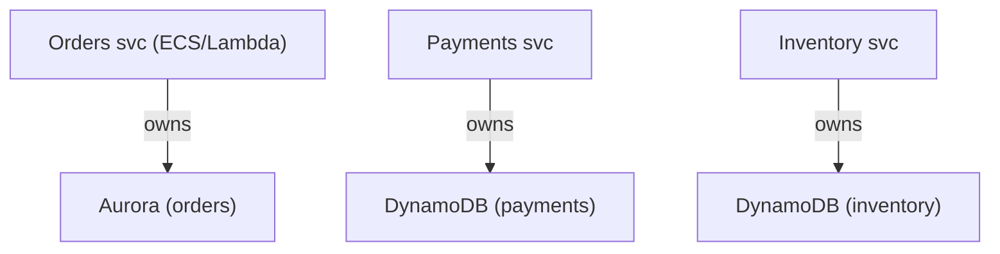
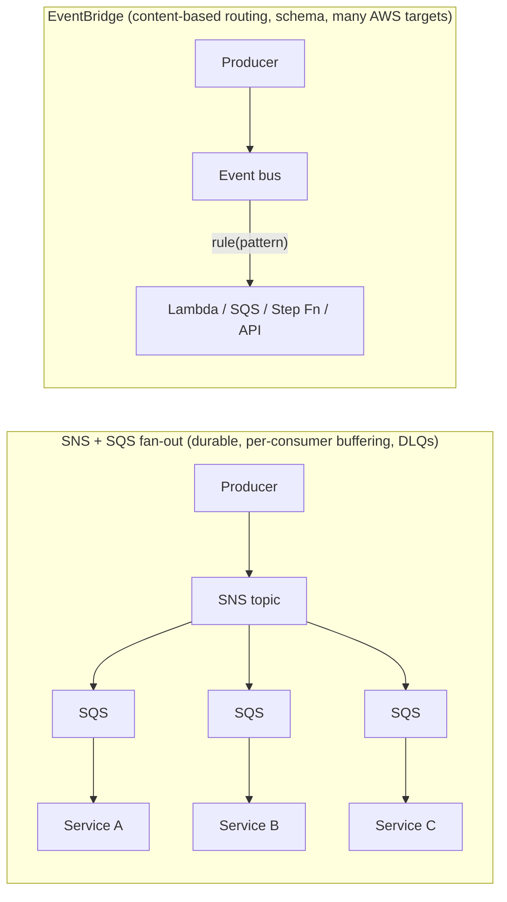
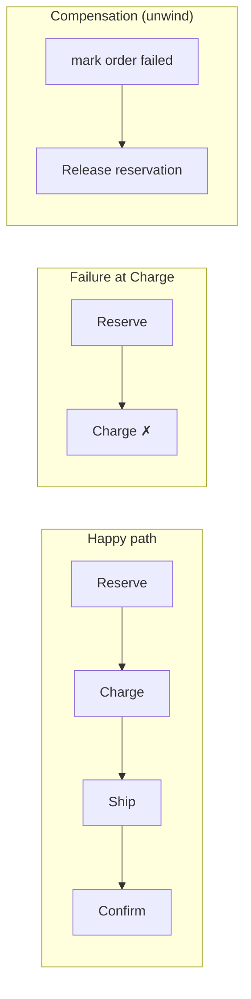
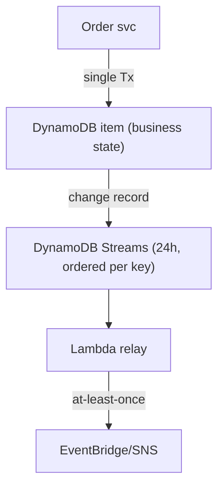
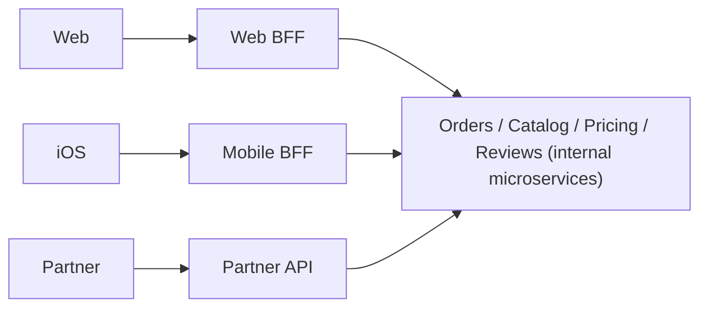
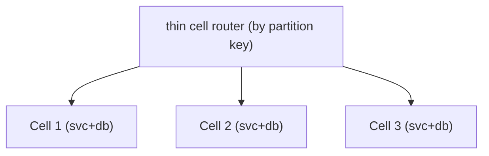

# Microservices Patterns on AWS: Decomposition, Saga, Outbox and Service Communication

Microservices are an *organizational and operational* bet before they are a
technical one: you trade the simplicity of one deployable, one database, and
in-process calls for independent deployability, team autonomy, and per-service
scaling — at the cost of a distributed system with partial failure, eventual
consistency, and no distributed ACID transactions. On AWS the interesting design
work is almost never "should we use microservices" (say yes too fast and you lose
points); it is *which managed service enforces the boundary, carries the traffic,
or coordinates the transaction*, and **what you give up by choosing it**.

The single most important interview skill here is stating trade-offs precisely:
for every choice — API Gateway vs ALB, SQS vs SNS vs EventBridge vs Kinesis, Step
Functions orchestration vs EventBridge choreography, outbox-via-DynamoDB-Streams
vs DMS CDC — name **what you gain, what you give up, and when the alternative
wins**. Every section below ends in trade-offs, and there is a dedicated section
on when NOT to reach for microservices at all.

---

## Decomposing services and database-per-service on AWS

**Intuition.** A microservice owns a *bounded context* (a cohesive slice of the
domain — Orders, Payments, Inventory) and, critically, **owns its data**. No other
service reads or writes its tables directly; all access goes through its API or its
events. This is the rule that actually makes the architecture loosely coupled — a
"microservice" that shares a database with three others is a distributed monolith
with worse latency and no independent deployability.

**Database-per-service** on AWS means each service picks the store that fits its
access pattern: Orders on Aurora (relational, transactional), a Cart on DynamoDB
(key-value, single-digit-ms, TTL), a product catalog search on OpenSearch, a
session store on ElastiCache. You can run separate schemas, separate database
instances, or separate accounts — the boundary is logical (no cross-service table
access), the physical isolation is a cost/blast-radius decision.

**Consequences you must design around:**
- **No cross-service JOINs.** A query that needs Orders + Customer data is now an
  API composition (call both, join in code) or a CQRS read model built from events.
- **No distributed ACID transaction.** "Place order + reserve inventory + charge
  card" spans three stores → you need a **saga** (see below), not a 2-phase commit.
- **Referential integrity is your job.** No FK across services; you get eventual
  consistency and must handle dangling references.

**Trade-offs.**
- *Gain:* independent scaling (scale Cart's DynamoDB WCU without touching Orders),
  independent deploys, right-tool-per-job, fault isolation (one DB's hot partition
  doesn't stall others), and team autonomy.
- *Give up:* transactional simplicity, easy reporting/analytics (now needs a data
  lake / CQRS), and operational uniformity (more engines to run and patch).
- *When to keep a shared DB:* early-stage products, or two services so tightly
  coupled they always change together — that is a signal they are **one** bounded
  context, not two. Splitting the DB before the domain boundary is clear is the most
  common expensive mistake.

**Sizing the split.** Decompose by *business capability* / bounded context, not by
technical layer (don't make a "database service" and a "validation service"). A
good boundary minimizes chatty synchronous cross-service calls; if two services
must make many round-trips per user request, the boundary is probably wrong.

---

## Synchronous communication with API Gateway, ALB, gRPC and REST

**Intuition.** Synchronous request/response is the right default when the caller
needs an answer *now* to proceed (read a balance, validate a login). The caller
couples its latency and availability to the callee — so you add timeouts, retries
with backoff and jitter, circuit breakers, and bulkheads.

**Edge and inter-service front doors on AWS:**

| Front door | Layer | Best for | Key limits / facts |
|---|---|---|---|
| **API Gateway (REST)** | L7 | Public APIs, per-method auth, usage plans, API keys, WAF | **29 s** integration timeout (default; raisable via quota on regional REST), 10 MB payload, 10k RPS default account throttle (burst 5k) |
| **API Gateway (HTTP API)** | L7 | Lower-cost/lower-latency proxy to Lambda/HTTP, JWT auth | ~70% cheaper, lower latency than REST APIs, fewer features (no per-key usage plans historically) |
| **ALB** | L7 | HTTP/HTTPS/gRPC to containers, path/host routing, sticky sessions | supports **gRPC** targets and HTTP/2; no hard request-rate cap; connection-based pricing (LCU) |
| **NLB** | L4 | Ultra-low latency TCP/UDP/TLS, static IP / PrivateLink source | millions of req/s, preserves source IP, ~microsecond overhead |
| **App Mesh / VPC Lattice / Service Connect** | service-to-service | East-west traffic, mTLS, retries | see service-mesh section |

**REST vs gRPC for inter-service calls.** gRPC (HTTP/2, protobuf, binary) gives you
smaller payloads, lower latency, streaming, and a strict contract — great for
high-throughput internal east-west traffic. REST/JSON is human-debuggable, cache-
friendly, and universally supported at the edge. On AWS, **ALB supports gRPC** end
to end; **API Gateway does not proxy gRPC** natively (it is REST/HTTP/WebSocket), so
public gRPC typically terminates at an ALB/NLB, not API Gateway.

**The 29-second wall.** API Gateway's default integration timeout is **29 seconds**.
Any synchronous request that could exceed it (a long report, a video transcode)
must be made **asynchronous**: return 202 + a job id immediately, do the work in the
background (SQS→worker, Step Functions), and let the client poll or get a webhook/
WebSocket push. Trying to hold the connection open is the classic wrong answer.

**Trade-offs.**
- *API Gateway vs ALB for a public API:* API Gateway gives you managed auth
  (IAM/Cognito/JWT/Lambda authorizers), throttling, usage plans, API keys, caching,
  and request validation with zero servers — but costs more per request at very high
  volume and adds a little latency. ALB is cheaper at sustained high RPS and speaks
  gRPC, but you build auth/throttling/keys yourself. **Pick API Gateway** for
  feature-rich public REST APIs and Lambda backends; **pick ALB** for high-volume
  container HTTP/gRPC where you own the cross-cutting concerns.
- *ALB vs NLB:* ALB = L7 routing, content-based rules, WAF integration, but adds
  latency and terminates the connection. NLB = L4, lowest latency, static IPs,
  source-IP preservation, and is the load balancer type behind **PrivateLink**.
  Pick NLB for extreme performance / TCP / PrivateLink endpoints; ALB when you need
  HTTP-aware routing.
- *Sync vs async in general:* sync is simpler to reason about and gives immediate
  errors, but propagates failure and latency down the chain and caps availability at
  the product of every hop's availability. Prefer async whenever the caller does not
  truly need the result inline.

---

## Asynchronous communication with SQS, SNS, EventBridge and Kinesis

**Intuition.** Async decouples producers from consumers in time (consumer can be
down and catch up), space (producer doesn't know consumers), and load (the queue/
log absorbs bursts). The four AWS primitives are *not* interchangeable:

| Service | Model | Ordering | Throughput | Retention | Fan-out | Replay |
|---|---|---|---|---|---|---|
| **SQS Standard** | queue (1 consumer group, competing consumers) | best-effort | ~unlimited | 4 days default, **14 days** max | no (point-to-point) | no |
| **SQS FIFO** | ordered queue | per **message group** | **300 msg/s** (3,000 with batches of 10); high-throughput mode much higher | 14 days max | no | no |
| **SNS** | pub/sub topic (push) | Standard: no; FIFO: yes | very high | none (push, no store) | **yes** (fan-out) | no |
| **EventBridge** | event bus + rules (content routing) | no | ~thousands PutEvents/s (region-dependent, raisable) | none live; **archive+replay** | yes (many targets/rule) | **yes** (archive replay) |
| **Kinesis Data Streams** | ordered log (shards) | per shard/partition key | **1 MB/s or 1,000 rec/s ingest per shard**; 2 MB/s egress shared | 24 h default → **365 days** | via multiple consumers | **yes** (re-read log) |

Key facts: **SQS message max 256 KB** (up to 2 GB via the Extended Client + S3);
visibility timeout default 30 s, max 12 h; delay max 15 min; long polling max 20 s.
**Kinesis record max 1 MB**; enhanced fan-out gives each consumer a dedicated
2 MB/s per shard. **EventBridge event max 256 KB.**

**How to choose (the interview payoff):**
- **SQS Standard** — work queue / task distribution, load leveling, competing
  consumers, no ordering needed. Cheapest, simplest, effectively unlimited scale.
- **SQS FIFO** — strict ordering + de-dup within a partition (`MessageGroupId`), e.g.
  per-account financial events. Costs throughput: 300/s baseline per API action.
- **SNS** — push fan-out to many subscribers / mobile push / email; pair with SQS
  when subscribers need durability, retries, and independent back-pressure.
- **EventBridge** — the *event router* for event-driven microservices and SaaS/AWS
  integrations: content-based filtering, schema registry, 20+ target types, archive
  & replay, Scheduler and Pipes. Higher per-event latency (~half a second typical,
  not for hot-path streaming) but the richest routing.
- **Kinesis / MSK (Kafka)** — high-throughput *ordered stream* with replay and
  multiple independent consumers reading the same records (analytics + real-time +
  audit off one stream). Use when you need ordering at scale, replay, or fan-in of
  millions of events/s.

**Trade-offs.**
- *SNS+SQS vs EventBridge:* SNS+SQS is a lower-latency, dead-simple, durable fan-out
  you fully control; EventBridge adds content-based routing, schema, and AWS-service
  integrations but higher latency and lower raw throughput. Pick SNS+SQS for
  high-throughput internal fan-out where consumers just need their own buffered copy;
  pick EventBridge when routing logic ("only orders over $1000 in EU") lives in the
  bus and you integrate many event sources/targets.
- *Kinesis vs SQS:* Kinesis keeps ordered, replayable records for many consumers;
  SQS deletes a message once consumed by one consumer and has no ordering (Standard)
  or capped throughput (FIFO). Kinesis costs shard management (or on-demand) and hot-
  partition risk on skewed keys; SQS is fully managed and scales transparently. Pick
  Kinesis for replay/ordering/multi-consumer analytics; SQS for decoupled task work.
- *Kinesis vs MSK:* MSK (managed Kafka) gives you the Kafka ecosystem, longer/ tiered
  retention, and consumer-group semantics but is more ops and needs capacity
  planning; Kinesis is more turnkey (on-demand mode) but AWS-proprietary. Pick MSK
  when you need Kafka compatibility or existing Kafka tooling.

---

## Service discovery with Cloud Map and service mesh with App Mesh and VPC Lattice

**Intuition.** In a dynamic fleet, instances/tasks come and go, so callers can't
hardcode addresses. **Service discovery** answers "where is service X right now?";
a **service mesh** additionally handles *how* the call is made — mTLS, retries,
timeouts, circuit breaking, traffic shifting, and observability — pushed out of app
code into a sidecar proxy.

**AWS Cloud Map** is a service registry: services register instances (IP/port or an
attribute set), consumers discover them via DNS (A/SRV records through Route 53) or
the Cloud Map API (richer, attribute-based, health-aware). ECS/EKS integrate to
auto-register tasks. DNS discovery is simple but suffers from TTL caching staleness;
API discovery is fresher but requires an SDK call.

**Service mesh options and the App Mesh deprecation.** **AWS App Mesh** (Envoy-based
managed mesh) is **on a deprecation path — AWS announced end of support (Sept 30,
2026)** and steers customers to **Amazon ECS Service Connect** or **Amazon VPC
Lattice**. So a *current* answer should not default to App Mesh:
- **ECS Service Connect** — built-in service discovery + a lightweight Envoy proxy
  for ECS: logical service names, client-side load balancing, retries, and
  per-service traffic metrics with far less config than App Mesh. Best for ECS-only
  east-west traffic.
- **Amazon VPC Lattice** — application-layer (L7) service-to-service networking
  across VPCs, accounts, ECS/EKS/EC2/Lambda, with built-in auth (IAM auth policies),
  weighted routing, and observability *without* sidecars. Best for heterogeneous,
  cross-account/cross-VPC service networks and mixing Lambda + containers.
- **EKS:** many teams run **Istio / Linkerd / Cilium** rather than a managed AWS
  mesh, trading ops burden for portability and features.

**Trade-offs.**
- *Discovery only (Cloud Map) vs full mesh:* Cloud Map is cheap and simple but gives
  you no mTLS/retries/traffic-shifting — you build resilience in app code or a load
  balancer. A mesh centralizes those but adds sidecar latency/CPU/memory overhead and
  significant operational complexity. **Don't add a mesh for a handful of services** —
  the sidecar tax and cognitive load rarely pay off below dozens of services with
  real mTLS/traffic-mgmt needs.
- *VPC Lattice vs sidecar mesh:* Lattice removes the sidecar (less overhead, less
  ops) and spans accounts/compute types with IAM-based auth, but is AWS-specific and
  less feature-rich than Istio. Pick Lattice for AWS-native cross-account service
  networking; pick Istio/Linkerd for advanced, portable mesh features on EKS.
- *DNS vs API discovery:* DNS is universal and needs no SDK but caches (staleness on
  scale-in can send traffic to dead instances until TTL expires); API discovery is
  fresh and health-aware but couples callers to the Cloud Map SDK.

---

## Saga pattern for distributed transactions and compensation

**Intuition.** Because there is no distributed ACID transaction across
database-per-service, a business transaction that spans services (create order →
reserve inventory → charge payment → arrange shipping) is modeled as a **saga**: a
sequence of *local* transactions, each with a **compensating action** that
semantically undoes it if a later step fails. There is no rollback — you *compensate*
(refund the charge, release the reservation). Sagas give you **atomicity-ish**
(all-or-nothing at the business level) but only **eventual consistency** and no
isolation, so you must handle intermediate states (an order briefly "pending").

**Two coordination styles:**
- **Orchestration** — a central coordinator (e.g. **AWS Step Functions**) explicitly
  invokes each step and, on failure, invokes the compensations in reverse. Logic is
  centralized and visible.
- **Choreography** — no coordinator; each service reacts to events and emits the next
  event (via **EventBridge/SNS**), including compensation events. Logic is
  distributed.

**Isolation anomalies to name in interviews:** because sagas lack isolation, you can
get *dirty reads* (someone reads the pending order), *lost updates*, and *fuzzy
reads*. Countermeasures: **semantic locks** (a "pending" status flag), **commutative
updates**, **reread/version checks**, and **pessimistic ordering** of steps (do the
step hardest to compensate last).

**Trade-offs (orchestration vs choreography) — see the next two sections.**

---

## Saga orchestration with Step Functions

**How it works.** AWS **Step Functions** is a managed state machine that coordinates
steps as an explicit workflow (ASL — Amazon States Language). It has built-in retry
with backoff, `Catch` for error handling, parallel and map states, and it can call
Lambda, ECS, SQS/SNS, DynamoDB, and 200+ services directly (SDK integrations). You
model compensation as explicit `Catch` transitions that run undo steps.

**Standard vs Express workflows** — a core exam/interview fact:

| | Standard | Express |
|---|---|---|
| Max duration | **1 year** | **5 minutes** |
| Execution semantics | **exactly-once** | at-least-once (async) / at-most-once (sync) |
| Pricing | per **state transition** | per request + **duration × memory** |
| Throughput | lower start rate | **100,000+ starts/s**, high volume |
| History / audit | full execution history in console | via CloudWatch Logs only |
| Best for | long-running sagas, human approval, order fulfillment | high-volume, short, idempotent event processing |

For a saga, **Standard** is usually right: durable, exactly-once, up to a year,
full visual audit of where each order is and why it failed — invaluable in support.

**Trade-offs.**
- *Gain:* centralized, visible logic (you can *see* the workflow and every failed
  execution), built-in retries/timeouts/compensation wiring, easy to reason about and
  change the flow in one place.
- *Give up:* the orchestrator is a coupling point and can become a "god" workflow;
  Standard workflows cost **per state transition**, so a chatty saga with many small
  steps gets expensive at scale; every participant must be reachable by the
  orchestrator (more synchronous coupling than pure choreography).
- *When to pick orchestration:* complex flows with many steps, conditional branches,
  timeouts, human approval, and a strong need for observability/audit (payments,
  order fulfillment, KYC). This is the default recommendation for non-trivial sagas.
- *Cost note:* if steps are numerous and high-volume, consider **Express** for the
  hot inner loop (duration-priced), or reduce state transitions by batching, and keep
  Standard for the long-running outer saga.

---

## Saga choreography with EventBridge and SNS

**How it works.** No central coordinator: the Order service emits `OrderCreated`;
Inventory reacts, reserves stock, emits `StockReserved`; Payment reacts, charges,
emits `PaymentCompleted` or `PaymentFailed`; on failure each service listens for the
failure event and runs its own compensation (Inventory releases stock). Events flow
over **EventBridge** (content routing, many targets) or **SNS+SQS** (durable fan-out).

**Trade-offs.**
- *Gain:* maximal decoupling — no central bottleneck, easy to add a new reacting
  service, each team owns its slice. Scales well for simple, linear flows and
  event-first cultures.
- *Give up:* the workflow exists only *implicitly* across many services — hard to see
  "where is this order and why did it fail?", risk of **cyclic event chains**, and
  compensation logic is scattered. Debugging and reasoning about global state is the
  real cost; you need strong distributed tracing (X-Ray/OpenTelemetry) and an event
  catalog.
- *When to pick choreography:* few steps, loose coupling prized, teams autonomous, and
  the flow is naturally event-driven. Avoid it for complex multi-branch transactions
  where the lack of a single source of truth for the flow becomes a liability.

**Rule of thumb:** *Orchestration for complex/critical transactions that need
visibility and control (Step Functions); choreography for simple, loosely-coupled,
event-driven flows (EventBridge/SNS).* Many real systems are hybrid: choreograph
across bounded contexts, orchestrate within one.

---

## Transactional outbox and change data capture on AWS

**The dual-write problem.** A service that must both (a) commit a local DB change and
(b) publish an event has two writes to two systems with no shared transaction. If it
writes the DB then crashes before publishing, downstream never learns; if it
publishes then the DB write fails, you've emitted a phantom event. You **cannot**
reliably do "write DB and call SNS/EventBridge atomically."

**Transactional outbox.** Write the event into an **outbox** row/item **in the same
local transaction** as the business change. A separate relay then reads the outbox and
publishes, marking rows sent. The event and the state change commit together, so the
event is guaranteed to eventually publish (at-least-once → consumers must be
idempotent).

**AWS realizations:**
- **DynamoDB + DynamoDB Streams (outbox via CDC).** Write the business item; enable
  **DynamoDB Streams** (change log, **24 h** retention, ordered per partition key).
  A Lambda triggered by the stream publishes to EventBridge/SNS. The item write *is*
  the outbox — no separate table needed. This is the canonical serverless outbox.
- **Aurora/RDS + AWS DMS CDC** or **native CDC → MSK/Kinesis** (Debezium-style). DMS
  reads the transaction log (binlog/WAL) and streams changes to Kinesis/MSK/S3. Or
  use an explicit outbox table + a poller/DMS.
- **DynamoDB Streams vs Kinesis Data Streams for DynamoDB:** Streams = 24 h, 2
  consumers max per shard, tightly integrated with Lambda; **Kinesis adapter for
  DynamoDB** = up to 365-day retention and more consumers.

**Trade-offs.**
- *Outbox/CDC gain:* eliminates the dual-write inconsistency; event publication is
  guaranteed and atomic with the state change. Log-based CDC adds *zero* write
  overhead to the transaction.
- *Give up:* extra moving part (relay/Lambda), **at-least-once** delivery (duplicates
  → consumers must be idempotent), added end-to-end latency (stream lag), and
  **ordering only within a partition key** (DynamoDB Streams) — no global order.
- *Streams vs poll-the-outbox-table:* Streams/CDC is push, low-latency, no polling
  load; an explicit outbox + poller works on any RDBMS but adds query load and
  latency. Pick Streams when you're on DynamoDB; pick DMS/Debezium CDC or a polling
  relay on relational stores.
- *Gotcha:* DynamoDB Streams retention is **24 h** — if the relay Lambda is broken for
  longer, you lose records; use a DLQ on the Lambda and alarms on iterator age.

---

## Idempotency and exactly-once processing

**Intuition.** Distributed messaging is **at-least-once** (SQS Standard, SNS,
EventBridge, DynamoDB Streams, Kinesis all can redeliver), so consumers *will* see
duplicates. "Exactly-once *processing*" is achieved by making handlers **idempotent**:
processing the same message twice has the same effect as once.

**AWS techniques:**
- **Idempotency key + DynamoDB conditional write.** Derive/receive a unique key per
  request (e.g. client-supplied `Idempotency-Key`, or the message id). On first
  processing, `PutItem` with `ConditionExpression: attribute_not_exists(pk)` — the
  conditional write is atomic, so a duplicate fails the condition and is skipped.
  Store the result/response keyed by that id and return it on retries.
- **AWS Lambda Powertools Idempotency** — a library that does exactly this with a
  DynamoDB backing table, TTL, and in-progress locking.
- **SQS FIFO exactly-once-ish** — content-based dedup (`MessageDeduplicationId`)
  within a **5-minute** dedup window; ordering per `MessageGroupId`. Not a substitute
  for idempotent handlers across longer windows.
- **Step Functions Standard** provides exactly-once *workflow execution* semantics.
- **DynamoDB conditional writes / optimistic locking** (version attribute) prevent
  lost updates from concurrent or duplicate processing.

**Trade-offs.**
- *Idempotency table gain:* robust dedup across any source and any time window you
  choose (TTL). *Cost:* an extra DynamoDB write/read per request and a table to
  manage; the key must be truly unique and stable across retries.
- *FIFO dedup vs idempotency table:* FIFO's 5-minute dedup is free but too short for
  many retry scenarios (a message redriven from a DLQ hours later reprocesses).
  Prefer an explicit idempotency store for financial correctness.
- *"Exactly-once" honesty:* there is no true end-to-end exactly-once *delivery* in a
  distributed system; you engineer **effectively-once** via at-least-once delivery +
  idempotent, deduplicated processing. Saying "we'll just use exactly-once" is a red
  flag in interviews.

---

## API gateway and backend-for-frontend patterns

**Intuition.** Clients shouldn't call dozens of microservices directly (chatty,
leaks internal topology, N× auth, versioning nightmares). An **API gateway** is a
single entry point that handles cross-cutting concerns — auth, throttling, routing,
TLS, request validation, caching — and routes to backend services.

**Backend-for-Frontend (BFF).** One gateway/aggregation layer *per client type*
(web, iOS, Android, partner API). Each BFF tailors payloads and aggregates calls for
its client (mobile wants a slim, batched response; web wants richer data), so you
don't bloat one generic API with every client's needs. On AWS a BFF is often an
API Gateway + Lambda/Fargate aggregation layer, or **AWS AppSync** (GraphQL) which is
a natural BFF: the client asks for exactly the fields it needs and AppSync resolves
from many sources, avoiding over/under-fetching.

**Trade-offs.**
- *Single shared gateway gain:* one place for auth/throttle/observability; *cost:* it
  can become a bottleneck/single point of change and a dumping ground for business
  logic (keep it thin — routing and cross-cutting only, not domain logic).
- *BFF gain:* each client gets an optimized API, teams own their BFF; *cost:* more
  components to build/deploy and some duplicated aggregation logic across BFFs. Add
  BFFs when client needs genuinely diverge; a single API is fine when they don't.
- *AppSync (GraphQL) vs REST BFF:* GraphQL eliminates over/under-fetching and is
  great for aggregation and real-time subscriptions, but adds schema/resolver
  complexity, caching is harder (no simple per-URL cache), and query cost control (N+1,
  deep queries) needs guardrails. Pick AppSync for rich, evolving client data needs;
  REST/API Gateway for simple, cacheable, well-bounded APIs.

---

## Strangler-fig migration on AWS

**Intuition.** You rarely rewrite a monolith big-bang (huge risk, long freeze).
The **strangler-fig** pattern incrementally extracts capabilities into new services
behind a routing layer, gradually "strangling" the monolith until it's gone — each
step is small, reversible, and shippable.

**AWS mechanics.** Put a routing facade in front of the monolith — **API Gateway** or
an **ALB with path/host rules** (or CloudFront). Initially everything routes to the
monolith. Extract one capability (say, Reviews) into a new service; flip that path
(`/reviews/*`) to the new service, leave the rest on the monolith. Use weighted
routing/canaries to shift traffic gradually and roll back instantly if metrics
degrade. Data is migrated per capability (dual-write / CDC / backfill), and an
**anti-corruption layer** translates between the monolith's model and the new
service's model.

**Trade-offs.**
- *Gain:* incremental, low-risk, always-shippable migration; value delivered early;
  easy rollback per slice.
- *Give up:* you run *both* systems for a long time (double the ops, temporary data
  duplication/sync, and the facade/ACL as extra components); requires discipline to
  actually finish (half-migrated systems live forever if unmanaged).
- *When:* almost always the right approach for migrating a live, revenue-generating
  monolith. Big-bang rewrite is justified only for small systems or when the old one
  is truly unmaintainable and can be frozen.

---

## Cell-based architecture and bounded contexts

**Bounded contexts** (from DDD) are the *correct unit of decomposition*: a bounded
context is a self-consistent slice of the domain with its own model and language
(Ordering's "Customer" ≠ Support's "Customer"). Service boundaries should follow
bounded-context boundaries; getting this wrong (splitting one context into chatty
services, or lumping two contexts together) is the root cause of most microservice
pain.

**Cell-based architecture** is a *resilience and scaling* pattern (an AWS
Well-Architected / Builders' Library favorite): partition the whole system into
independent **cells**, each a complete, self-contained stack (compute + data)
serving a subset of customers/partition keys. A **router/thin mapping layer** sends
each request to its cell. A failure, bad deploy, or poison workload is contained to
one cell (**bounded blast radius**), not the whole fleet, and you scale by adding
cells rather than growing one giant stack.

**Trade-offs.**
- *Gain:* blast-radius containment, predictable scaling (test one cell, replicate),
  easier capacity math, and cell-by-cell (canary) deployments.
- *Give up:* the router must stay ultra-simple and highly available (it's the shared
  fate you can't cell); cross-cell operations are hard; more infrastructure to manage;
  and cell sizing/placement (avoiding hot cells) is nontrivial.
- *When:* high-scale, high-availability systems (multi-tenant SaaS, control planes)
  where a single blast radius is unacceptable. Overkill for small systems.

---

## When NOT to use microservices on AWS

Interviewers love this because senior engineers know the pattern's cost. Prefer a
**well-structured monolith (or "modular monolith")** — often the fastest, cheapest,
most consistent option — when:
- **Small team / early-stage product.** Domain boundaries aren't stable yet;
  splitting prematurely locks in wrong boundaries and multiplies ops overhead.
- **Low scale / simple domain.** The distributed-systems tax (network latency,
  partial failure, eventual consistency, distributed tracing, saga complexity) buys
  you nothing.
- **You need strong transactional consistency across the whole operation** and can't
  tolerate sagas/eventual consistency — a single ACID database is far simpler.
- **Ops maturity is low.** Microservices demand CI/CD, observability (tracing/metrics/
  logs), on-call, IaC, and service ownership; without them you get a distributed
  *big ball of mud* that's harder to operate than a monolith.

The failure mode to name: the **distributed monolith** — services that must be
deployed together, share a database, and make synchronous chains — which has all the
costs of distribution and none of the independence benefits. On AWS, a monolith on
ECS Fargate or Lambda behind API Gateway/ALB is a perfectly respectable starting
point; extract services (strangler-fig) only when a specific pain (independent
scaling, team autonomy, deploy contention) justifies it.

---

## Trade-offs and when to use what

**Synchronous vs asynchronous.** Sync (API Gateway/ALB, REST/gRPC) when the caller
needs an answer to proceed and the operation is fast (< the 29 s API Gateway wall);
async (SQS/SNS/EventBridge/Kinesis) whenever you can decouple — for resilience, load
leveling, and independent scaling. Overall availability of a synchronous chain is the
*product* of each hop's availability; async breaks that coupling.

**Messaging service selection cheat-sheet:**
- Task/work queue, competing consumers, no order → **SQS Standard**.
- Strict per-key ordering + dedup → **SQS FIFO** (mind 300/s baseline).
- Fan-out to many durable consumers → **SNS + SQS**.
- Content-based event routing, many AWS integrations, archive/replay → **EventBridge**.
- Ordered, replayable, high-throughput, multi-consumer stream → **Kinesis / MSK**.

**Saga coordination:** orchestration (**Step Functions Standard**) for complex,
critical, multi-branch transactions needing visibility/audit; choreography
(**EventBridge/SNS**) for simple, loosely-coupled, event-driven flows. Hybrid is
common.

**Consistency across services:** you don't get distributed ACID — you get sagas +
eventual consistency + idempotency + outbox. Design the UI/business process to
tolerate "pending" states.

**Avoiding dual writes:** transactional outbox via **DynamoDB Streams** (serverless)
or **DMS/CDC** on relational stores — never "write DB then publish" as two calls.

**Front door:** API Gateway (managed auth/throttle/keys, 29 s cap) vs ALB (gRPC,
high-volume cheap, DIY cross-cutting) vs NLB (L4, lowest latency, PrivateLink).

**Service networking:** Cloud Map (discovery only) → ECS Service Connect / VPC
Lattice (modern, sidecar-light or sidecar-less) — **not** App Mesh for new builds
(end of support Sept 30, 2026). Add a full mesh only at real scale.

**Decomposition unit:** bounded contexts, database-per-service. Contain blast radius
with **cell-based architecture** at high scale. Migrate with **strangler-fig**. And
know when a **modular monolith** is the right answer.

---

## Common interview follow-up questions

- "You must place an order that reserves inventory and charges a card across three
  services. Walk me through the saga, the compensations, and how you avoid dual
  writes." (Step Functions + outbox via Streams + idempotency.)
- "Your relay Lambda on DynamoDB Streams was down for 30 hours — what happens?"
  (24 h retention → data loss; need DLQ + iterator-age alarms, or Kinesis for longer
  retention.)
- "Why not just use exactly-once delivery?" (No such thing end-to-end; engineer
  effectively-once via idempotency + at-least-once.)
- "Requests occasionally take 45 s. What breaks and how do you fix it?" (API Gateway
  29 s timeout → make it async: 202 + job id + poll/WebSocket, Step Functions.)
- "When would you choose choreography over orchestration, and what do you lose?"
- "This design uses SQS FIFO at 5,000 msg/s. What's the problem?" (300/s baseline per
  action; need high-throughput mode or rethink ordering requirement.)
- "You have 6 services and want a service mesh. Convince me not to." (Sidecar/ops tax
  vs benefit; App Mesh deprecation; start with Cloud Map / Service Connect.)
- "Two services always deploy together and share a table. Diagnosis?" (Distributed
  monolith / wrong boundary — likely one bounded context.)
- "How do you build a cross-service read (Orders + Customer) without a JOIN?" (API
  composition or a CQRS read model fed by events.)
- "How do you contain the blast radius of a poison tenant at scale?" (Cell-based
  architecture with a thin router.)

## References

- AWS Well-Architected Framework — Reliability & Operational Excellence pillars.
- AWS Prescriptive Guidance — "Cloud design patterns": Saga, Transactional outbox,
  Strangler fig, CQRS, Circuit breaker, Retry with backoff.
- Amazon Builders' Library — "Workload isolation using shuffle-sharding",
  "Avoiding fallback in distributed systems", "Timeouts, retries and backoff with
  jitter", "Reducing blast radius with cell-based architecture".
- AWS docs: Amazon SQS, Amazon SNS, Amazon EventBridge, Amazon Kinesis Data Streams,
  AWS Step Functions (Standard vs Express), DynamoDB & DynamoDB Streams, API Gateway
  (integration timeout & quotas), Elastic Load Balancing (ALB/NLB), AWS Cloud Map,
  Amazon VPC Lattice, Amazon ECS Service Connect, AWS App Mesh (end-of-support notice),
  AWS DMS (CDC), AWS AppSync, AWS Lambda Powertools (Idempotency).
- re:Invent deep-dive sessions on event-driven architecture, Step Functions/saga
  patterns, EventBridge, DynamoDB, and cell-based architecture (300/400-level).
- Werner Vogels / Amazon DynamoDB and S3 papers; "Building Microservices" (Newman)
  and microservices.io (Richardson) for pattern definitions.
