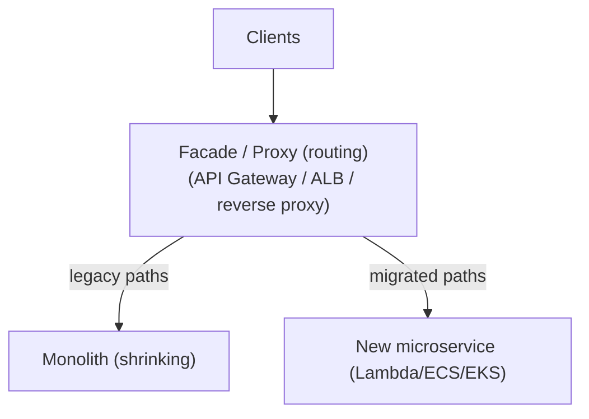

# Migration and Modernization Strategies on AWS

Migrating a portfolio to AWS is a *portfolio-management and risk problem* as much as
a technical one. The interview skill is not reciting service names — it is reasoning
about **which of the 7 Rs to apply to each application**, choosing the **right tooling
for the data-gravity and downtime constraints**, and defending the **cost, risk, and
time-to-value trade-offs**: rehost fast to stop the bleeding on a data-center exit vs
refactor slowly for long-term agility; move terabytes over the wire vs ship a Snowball;
big-bang cutover vs continuous replication with a tiny cutover window. Almost every
"right answer" here is *"it depends on RTO/RPO, scale, budget, deadline, and team
maturity"* — so state the constraint, then the choice, then what you gave up.

Two mental anchors used throughout:

- **RTO / RPO** — Recovery Time Objective (how long you can be down) and Recovery
  Point Objective (how much data you can lose). For migration *cutover*, RPO ≈ the
  replication lag at switchover and RTO ≈ the cutover + DNS/rollback window.
- **Data gravity** — data attracts applications and is expensive/slow to move; the
  larger the dataset and the more services depend on it, the more the *data* dictates
  sequencing and the more you lean on offline transfer or continuous replication.

---

## The migration journey: mobilize, migrate, modernize

AWS frames large migrations under the **Migration Acceleration Program (MAP)**, whose
canonical phases are **Assess → Mobilize → Migrate and Modernize** (the section title
abbreviates the last two; **Assess is the true first phase** and is the one candidates
most often forget to name):

1. **Assess** — business case / TCO, readiness, discovery of the estate.
2. **Mobilize** — build a landing zone (multi-account via Control Tower/Organizations),
   a migration factory (repeatable runbooks, a Cloud Center of Excellence), close skill
   gaps, and run a small pilot wave to prove the pattern.
3. **Migrate and Modernize** — execute in *waves*, grouped by dependency and business
   value; modernize either during migration or afterward.

The single most important framing sentence for an interview: **"migrate first, modernize
later"** is often the pragmatic path when there is a hard deadline (a data-center lease
expiry, an acquisition, a licensing cliff) — you rehost to *get off* the old estate,
then refactor once you have breathing room and cloud operational muscle. The opposite
("modernize while migrating") only pays off when the app is strategic and the team can
absorb the added risk and schedule.

---

## The 7 Rs: retire, retain, rehost, relocate, repurchase, replatform, refactor

The canonical decision framework. Each application in the portfolio is tagged with one
of the 7 Rs during assessment. Ordered roughly from least to most transformation:

| R | What it means | Effort / risk | Cloud benefit realized | Typical trigger |
|---|---|---|---|---|
| **Retire** | Turn it off; nobody uses it | Lowest | Cost avoidance only | Discovery shows ~10–20% of estate is dead |
| **Retain** (revisit) | Leave it where it is for now | None (deferred) | None yet | Regulatory hold, imminent EOL, deep dependency not ready, recent investment |
| **Rehost** (lift-and-shift) | Move as-is to EC2, no code change | Low | Fastest exit; base infra savings | Data-center exit deadline, large volume, low app knowledge |
| **Relocate** | Move at the hypervisor/container level (VMware Cloud on AWS, or containers to EKS) without changing the OS/app | Low | Preserve VMware tooling | Large VMware estate, want same ops model temporarily |
| **Repurchase** (drop-and-shop) | Replace with a SaaS/COTS product | Medium | Offload undifferentiated heavy lifting | Move email/CRM/HR to SaaS (e.g. Workday, Salesforce), or self-managed → managed |
| **Replatform** (lift-tinker-and-shift) | Move with a few optimizations, no core architecture change | Medium | Managed-service ops savings | Self-managed DB → RDS/Aurora, VMs → containers, tomcat → Beanstalk |
| **Refactor / Re-architect** | Rewrite / redesign, often to microservices/serverless | Highest | Max agility, scale, cloud-native cost model | Monolith blocking business velocity; needs elastic scale |

**How to choose (interview gold):**
- **Retire / Retain** first — cheapest wins. Discovery routinely finds 10–20% of servers
  are unused or redundant; deleting them shrinks the migration and the bill immediately.
- **Rehost** when speed and volume dominate (deadline, thousands of servers, thin app
  knowledge). You get the *least* cloud-native benefit but the *fastest* exit and lowest
  project risk. Modernize afterward.
- **Replatform** when a small change unlocks large ops savings — e.g. Oracle-on-EC2 →
  RDS removes patching/backup toil for modest effort.
- **Refactor** only for a *minority* of high-value apps — it has the highest cost, longest
  timeline, and highest risk, but the biggest long-term payoff (independent scaling,
  pay-per-use, deployment velocity). Never refactor the whole portfolio; you will blow
  the budget and the deadline.

Rule of thumb portfolio split people quote: the bulk rehosts/replatforms, a slice retires,
and a strategic minority refactors. The wrong answer in interviews is "refactor everything
to serverless" — that ignores cost, risk, and time-to-value.

---

## Assessing and prioritizing: discovery, portfolio analysis, and TCO

You cannot plan a migration you have not measured. Tooling:

- **AWS Application Discovery Service** — agent-based (deep: processes, performance,
  network connections between servers) or agentless (via an OVA collector, lighter).
  Feeds dependency maps so you can group apps into **waves** and avoid cutting a
  dependency mid-migration.
- **AWS Migration Hub** — single pane of glass to track discovery + migration status
  across tools (MGN, DMS) and Regions. **Migration Hub Strategy Recommendations**
  analyzes the estate and suggests an R per app (e.g. "refactor to containers").
- **Migration Evaluator** (formerly TSO Logic) — builds the business case / TCO model:
  right-sizing, projected AWS run cost, and current-state cost baseline.

**TCO reasoning** interviewers probe: on-prem cost is not just hardware — it includes
data-center space/power/cooling, hardware refresh cycles, over-provisioning for peak,
software licensing, and the labor to run it all. Cloud TCO trades capex for opex and
lets you *right-size* and *turn off* idle capacity (dev/test at night, scale-to-zero
serverless). The trap: a naive "same instance size 24/7" lift-and-shift can be *more*
expensive than on-prem until you right-size, buy Savings Plans/Reserved Instances,
and adopt auto scaling. So "the cloud is cheaper" is only true *after* modernization
and FinOps discipline; a raw rehost often needs a follow-up optimization phase.

*Illustrative right-sizing math (order-of-magnitude, not a price quote):* take one
general-purpose instance running 24/7 on-demand and call its cost **1.0×**. Commit that
same instance to a 3-year Savings Plan / Reserved Instance and you land around **~0.4×**
(~60% off) — that alone. Now notice a dev/test box only needs to run ~50 of the 168 hours
in a week (business hours, 5 days): schedule it off nights and weekends and you pay for
~30% of the wall-clock, i.e. another **~0.3×** multiplier. Right-size a two-sizes-too-big
prod box down one size and you roughly halve it again. Stack these and a naive
"lift-and-shift, leave it on, on-demand" footprint can be **2–3× (or more)** the cost of
the same workload after FinOps — which is exactly why a raw rehost bill frequently lands
*above* on-prem until the optimization pass happens.

**Wave planning trade-off:** sequence low-risk, low-dependency apps first (build
confidence and factory muscle), keep tightly-coupled apps in the *same* wave (so you
don't split a chatty dependency across a WAN link and eat latency + egress), and save
the crown-jewel refactors for when the team is seasoned.

---

## Rehost with Application Migration Service (MGN)

**AWS Application Migration Service (MGN)** is the *primary, recommended* lift-and-shift
tool (it succeeded CloudEndure Migration and the older Server Migration Service, SMS).

How it works:
- A lightweight **replication agent** is installed on each source server (physical,
  VMware, Hyper-V, or another cloud). It performs **continuous, block-level replication**
  of the disks into a low-cost **staging area** in your AWS account (lightweight EC2
  + EBS), over the network, without disrupting the source.
- Because replication is continuous, the source and target stay in near-sync; the
  **cutover** is short: MGN launches a *production* instance from the latest replicated
  state, you validate, then flip traffic. RPO is seconds-to-minutes; downtime is just
  the boot + validation window.
- **Test instances** can be launched anytime for non-disruptive rehearsal — this is how
  you de-risk cutover without touching the source.
- Post-launch actions can inject light modernization (e.g. install the CloudWatch/SSM
  agent), so MGN can *bridge* rehost → replatform.

**Trade-offs:** MGN gives the fastest, lowest-risk mass migration with minimal downtime
and no app rewrite — but you inherit the source's architecture, OS, and inefficiencies
(you're paying EC2 for a VM that might belong in a container or a managed DB). Use MGN
for the bulk rehost wave; plan a modernization pass afterward. Alternative — **VMware
Cloud on AWS / relocate** — keeps the exact VMware operational model but locks you to
that stack and doesn't move you toward cloud-native.

---

## Database migration: DMS and the Schema Conversion Tool

**AWS Database Migration Service (DMS)** migrates databases with **minimal downtime**.
Key ideas:

- A **replication instance** connects to a **source endpoint** and **target endpoint**
  and runs a **task**. Task types: **full load** (bulk copy existing data),
  **full load + CDC** (bulk copy, then keep replicating ongoing changes), or **CDC only**.
- **Change Data Capture (CDC)** reads the source transaction log and streams ongoing
  changes to the target, keeping it in near-sync while the old DB stays live. This is
  the core of **near-zero-downtime cutover**: you full-load, let CDC catch up, then
  cut over during a tiny window when lag ≈ 0.
- **Homogeneous** migration (Oracle → Oracle, MySQL → MySQL) needs no schema conversion.
  **Heterogeneous** migration (Oracle → Aurora PostgreSQL) needs the
  **AWS Schema Conversion Tool (SCT)** (now largely folded into **DMS Schema
  Conversion**) to convert schema, stored procedures, and code — plus manual work for
  what it can't auto-convert (it reports the % it couldn't do).
- **DMS Serverless** auto-scales capacity for the task; classic DMS requires you to size
  the replication instance.

**Trade-offs & gotchas:**
- DMS is excellent for the *data*, weak for the *schema* of heterogeneous moves — SCT
  handles schema but proprietary PL/SQL, triggers, and vendor features often need
  hand-porting. Budget engineering time; the "% auto-converted" is never 100%.
- DMS does **not** migrate secondary indexes, sequences, stored procs, or foreign keys
  by default during full load — you create the target schema (via SCT) first.
- CDC adds source load (reading the redo/binlog) and requires the source to have logging
  enabled with adequate retention.
- **Alternatives:** native tools (mysqldump/pg_dump, Oracle Data Pump, RDS snapshots,
  read-replica-then-promote for same-engine) can be simpler and cheaper for homogeneous
  moves; use DMS when you need *ongoing* replication (low downtime) or heterogeneous
  conversion. Aurora has native mechanisms (e.g. MySQL binlog replication from external,
  Babelfish for SQL Server → Aurora PostgreSQL to reduce app rewrite).

---

## Bulk data transfer: DataSync, Snow Family, and Transfer Family

Moving the *data* is often the long pole. Choosing the mechanism is a **network math**
problem: `transfer_time ≈ data_size / usable_bandwidth`.

Rule of thumb: **10 TB over a 100 Mbps link with ~80% utilization ≈ ~12 days.** Over a
1 Gbps link, ~1.2 days. If the math exceeds your window, go offline (Snow).

Options:

| Tool | Mode | Best for | Notes / limits |
|---|---|---|---|
| **DataSync** | Online, managed agent | File/object transfer (NFS, SMB, HDFS, S3, EFS, FSx) over network or Direct Connect | Handles incremental, verification, scheduling; parallelized; up to ~10 Gbps per agent task |
| **AWS Transfer Family** | Online, managed SFTP/FTPS/FTP/AS2 | Ongoing partner file exchange into S3/EFS | Not a bulk-migration tool; it's a *protocol front-end* for recurring transfers |
| **Snowball Edge** | Offline device, tens of TB usable (current Storage Optimized ~210 TB; earlier generations ~80 TB) | 10s of TB to low PB when the wire is too slow | Ship the device; a Compute Optimized variant adds vCPU/GPU for edge/pre-processing. (Note: Snow Family is no longer offered to new customers — know the pattern for scale reasoning) |
| **Snowmobile** | Offline, up to ~100 PB (a truck) | Exabyte/hyperscale data-center evacuations | (Being deprecated as networks improved; know it exists for scale reasoning) |
| **S3 Transfer Acceleration** | Online, edge-optimized upload to S3 | Long-haul internet uploads to S3 | Uses CloudFront edges; costs extra per GB |
| **Direct Connect** | Dedicated private link | Sustained high-throughput hybrid + migration | 1/10/100 Gbps ports; weeks to provision |

**Trade-offs:**
- **Online (DataSync/DX) vs offline (Snow):** online keeps data continuously syncing and
  is best when you can afford the time and have bandwidth; offline wins on pure
  time-to-transfer for huge datasets but adds shipping latency (days), physical handling,
  and a *seed-then-sync* pattern (Snow for the bulk seed, then DataSync/DMS CDC for the
  delta accumulated during shipping).
- **DataSync vs plain aws s3 cp / rsync:** DataSync is managed, parallel, with built-in
  integrity checks and incremental logic — less to build/operate. Roll-your-own is
  cheaper only for trivial one-off copies.
- **Transfer Family is not migration** — a classic distractor. It's for *ongoing*
  standardized protocol exchange, not a one-time petabyte move.

---

## Minimizing downtime: CDC replication and cutover strategies

Downtime is usually the hardest business constraint. Techniques, from most to least
downtime:

- **Big-bang cutover:** stop the source, copy everything, start on AWS. Simple, but
  downtime = full copy time. Only acceptable for small/non-critical systems or generous
  maintenance windows.
- **Continuous replication + short cutover** (MGN for servers, DMS full-load+CDC for
  DBs): pre-seed, keep syncing, then cut over in a tiny window when lag ≈ 0. RPO seconds,
  RTO minutes. The default for anything with a tight downtime budget.
- **Trickle / parallel-run:** run old and new in parallel, dual-write or replicate both
  ways, migrate users/tenants in batches, and keep the ability to fall back. Lowest risk
  and downtime, highest complexity (data reconciliation, idempotency, split-brain risk).

**Cutover mechanics:**
- Use **Route 53** with a low **TTL** *before* cutover so clients pick up the new
  endpoint quickly; weighted or failover records enable gradual shift and fast rollback.
- **Rollback plan is mandatory** — keep the source live and re-syncable until you've
  validated in production. The riskiest moment is the point of no return; design so you
  can reverse until confidence is high (e.g. bi-directional DMS, or keep source read-only
  and re-openable).
- **Be honest that DB rollback after *write* cutover is genuinely hard.** As long as the
  new DB is read-only or write-free, rolling back is trivial (route back to source). But
  once real writes land on the target, "rollback" means *reverse-replicating those new
  writes back to the old DB* — and if you kept bi-directional CDC running to make that
  possible, you now risk **write conflicts and replication loops** (a row written on both
  sides, or a change echoing back and forth). The common mitigation is to define a
  **point of no return**: keep the *source read-only* during a post-cutover validation
  window so no new writes exist to reverse (making rollback = re-open the source), and
  once the window passes with clean validation, accept a **no-rollback** state and roll
  *forward* (fix issues on the target) rather than trying to unwind writes.
- **Data reconciliation:** validate row counts / checksums (DMS data validation) before
  declaring success.

**Trade-off:** lower downtime costs more complexity and money (running two environments,
CDC overhead, reconciliation tooling). Match the technique to the business RTO/RPO — do
not gold-plate a nightly batch system with a zero-downtime parallel run.

---

## The strangler-fig pattern: incrementally decomposing a monolith

Named after the strangler fig vine that grows around a tree until it replaces it. Instead
of a risky big-bang rewrite, you **incrementally** carve functionality out of the monolith:

1. Put a **facade/proxy** in front of the monolith (API Gateway, ALB path-based routing,
   or a reverse proxy). Initially it routes everything to the monolith.
2. Peel off one capability at a time into a new service; flip its route at the facade.
3. Repeat until the monolith is "strangled" (empty), then retire it.

**Why interviewers love it:** it's the low-risk path to modernization — each slice is
small, independently deployable, testable, and reversible (route back to the monolith if
the new service misbehaves). It avoids the classic doomed "we'll rewrite it all and
switch over one weekend."

**Hard parts (the trade-offs):**
- **Data decomposition** is the real challenge, not code. The monolith usually has one
  shared database; splitting it means introducing bounded-context data ownership,
  possibly **CDC (DMS/Kinesis)** to keep a new service's store in sync during transition,
  and accepting eventual consistency where you had transactions.
- **Latency & chattiness:** what was an in-process call becomes a network hop; a badly
  drawn service boundary creates a distributed monolith with worse latency and coupling.
- **Dual maintenance** during the (often long) transition — you run and secure both.
- **When NOT to use it:** small apps, or apps you plan to retire soon — the overhead
  isn't worth it; just rehost or retire.

**Worked example — carving an Orders service off a shared database.** Say the monolith
owns one relational DB with `orders`, `customers`, and `inventory` tables, and there is a
foreign key `orders.customer_id → customers.id`. You want `orders` to become an
independent service with its own datastore. Step by step:

1. **Stand up the new store, backfill + keep it live with CDC.** Create the Orders
   service's own database and point a DMS (or Kinesis) **CDC** task at the monolith DB:
   full-load the existing `orders` rows, then let CDC stream every subsequent insert/update
   so the new store stays within seconds of the monolith. At this stage the monolith is
   still the source of truth — the new store is a warm, read-only shadow.
2. **Switch *reads* first.** Flip the facade so read traffic for order endpoints hits the
   new Orders service (served from its own store, kept fresh by CDC). Writes still go to
   the monolith. Reads are safe to move first because a few seconds of replication lag on a
   read is tolerable, and if anything looks wrong you just route reads back to the monolith
   — fully reversible.
3. **Switch *writes* (the risky step) and stop the CDC feed.** Now the Orders service
   accepts writes directly to its own store and becomes the source of truth for orders.
   The moment you do this you must **stop the monolith→new CDC** or you get two writers
   racing on the same rows. If the monolith still needs to see order data, reverse the flow
   — the Orders service emits an `OrderPlaced`/`OrderUpdated` **event** (or a reverse CDC
   feed) that the monolith consumes. This is the **dual-write pitfall**: never let two
   systems both write the same record over the transition — pick one writer at a time and
   propagate via events, or you get lost updates and divergence.
4. **Break the cross-service foreign key.** The DB can no longer enforce
   `orders.customer_id → customers.id` because `customers` lives in a different service.
   Replace it with either a synchronous **API call** to the Customers service at
   write-time (validate the customer exists) or, better for coupling/latency, store a
   denormalized `customer_id` (+ a snapshot of the fields orders actually needs) and keep
   it fresh via a `CustomerUpdated` event. You have traded a DB-enforced invariant for
   **eventual consistency** — a brief window where a just-created customer isn't yet
   visible to orders — so add reconciliation (a periodic job comparing counts/keys across
   the two stores) to catch drift.

The takeaway the phrase "data decomposition is the hard part" is really pointing at:
splitting *code* is a routing change at the facade; splitting *data* forces you to
sequence reads-then-writes, avoid dual-write races, demote a foreign key to an API/event,
and accept + reconcile eventual consistency.

---

## Refactoring to microservices and serverless

Refactoring targets on AWS, from least to most transformation:

- **Containerize** the monolith or extracted services → **ECS on Fargate** (no cluster
  ops, pay per task) or **EKS** (Kubernetes portability/ecosystem, more ops). Fargate =
  less ops, EKS = more control/portability and multi-cloud story.
- **Serverless** the pieces → **Lambda** (event-driven, scale-to-zero, pay-per-invoke)
  fronted by **API Gateway**, orchestrated by **Step Functions**, with **DynamoDB**,
  **S3**, **SQS/SNS/EventBridge** as glue. Best for spiky/event workloads and small teams
  that want zero server ops.
- **Decouple** with async messaging (SQS/SNS/EventBridge) and adopt **event-driven** /
  **CQRS / saga** where transactions span services.

**Key limits that shape serverless refactors (get these right):**
- **Lambda:** max **15-minute** timeout, up to **10 GB** memory (CPU scales with memory),
  up to **10 GB** ephemeral `/tmp`, 6 MB synchronous payload (256 KB async). Long/batch
  jobs > 15 min must go to Fargate/Batch, not Lambda.
- **API Gateway:** **29-second** *default* integration timeout for REST APIs. Since June 2024
  this is *raisable* above 29s on Regional and private REST APIs (opt-in, and it may reduce
  your account throttle quota) — but the default is still 29s, so long request/response
  patterns should generally move to async (return 202 + poll, or WebSockets/AppSync
  subscriptions) rather than lean on a raised timeout.
- **DynamoDB:** 400 KB item; per-partition ~3000 RCU / 1000 WCU before you risk a hot
  partition — model access patterns, not entities.
- **SQS FIFO:** baseline ~300 TPS per API action (~3000 with batching) — but **high-throughput
  FIFO** mode lifts this far higher by spreading messages across partitions (throughput scales
  with the number of distinct message-group IDs, into the thousands-to-tens-of-thousands TPS
  per queue, subject to a regional quota). Standard queues are effectively unlimited but
  at-least-once + best-effort ordering. Strict ordering still costs throughput vs Standard.

**Trade-offs:** serverless maximizes agility and scale-to-zero cost efficiency but brings
cold starts, per-service limits, distributed-systems complexity (idempotency, eventual
consistency, observability across many functions), and potential cost inversion at very
high, steady throughput (a big always-on Lambda fleet can cost more than reserved
containers/EC2). Refactor for the *right reasons* — velocity, elastic scale, cost at spiky
load — not because it's fashionable.

---

## Hybrid architectures: Direct Connect, Storage Gateway, and Outposts

Migrations are rarely instantaneous — you live in **hybrid** state for months or years,
and some workloads stay on-prem permanently (latency, data residency, existing
investment). Building blocks:

- **AWS Direct Connect (DX):** a dedicated private network link from your data center to
  AWS (1/10/100 Gbps), giving consistent bandwidth and **lower, more predictable latency**
  than the public internet, plus lower data-transfer egress rates. Takes **weeks** to
  provision (cross-connect, LOA-CFA). For resilience use **≥2 DX connections** (ideally
  different locations); pair with a **VPN backup** over the internet. Compare to
  **Site-to-Site VPN**: VPN is quick (minutes) and cheap but rides the public internet
  with variable latency and ~1.25 Gbps per tunnel ceiling — good as a stopgap or DX
  backup, not for sustained bulk migration.
- **AWS Storage Gateway:** on-prem appliance that presents cloud storage locally with
  caching. Modes: **File Gateway** (NFS/SMB → S3), **Volume Gateway** (iSCSI block, cached
  or stored), **Tape Gateway** (VTL → S3/Glacier to replace physical tape libraries).
  Great for a *gradual* storage migration and hybrid file access without rewriting apps.
- **AWS Outposts:** actual AWS-managed hardware racks *in your data center*, running AWS
  services (EC2, EBS, S3 on Outposts, RDS, EKS) with the AWS API. For workloads needing
  **single-digit-ms latency to on-prem systems**, **local data processing/residency**,
  or a consistent hybrid operating model. Trade-off: you buy/commit to physical capacity
  (loses cloud elasticity) and depend on the service-link back to the parent Region.
  **Local Zones / Wavelength** are the AWS-owned alternatives for low-latency-to-users /
  5G edge without on-prem hardware.

**Trade-off framing:** hybrid buys you time and handles the workloads that *can't* move —
but running two operating models is expensive and complex, so treat long-lived hybrid as a
deliberate choice (latency/residency/investment), not an accident of a stalled migration.

---

## Data gravity and network trade-offs

**Data gravity** = large datasets are costly and slow to move, and they *pull*
applications toward them. Practical consequences for migration design:

- **Move compute to the data, or data to the compute — but not repeatedly across the WAN.**
  Splitting a chatty app from its database across a Direct Connect link adds latency to
  every query and racks up **data-transfer egress charges**. Keep tightly-coupled
  components in the *same wave and same environment*.
- **Egress cost asymmetry:** ingress to AWS is generally free; **egress out of AWS costs
  money** (per-GB, and cross-Region/inter-AZ transfer also costs). This shapes both
  migration sequencing (don't ping-pong data) and end-state architecture (avoid chatty
  cross-Region calls, cache at the edge with CloudFront).
- **Seed + sync for big datasets:** for petabyte stores, Snowball-seed the bulk, then
  DataSync/DMS-CDC the delta accumulated during shipping, then cut over — the network
  never has to carry the whole dataset.
- **Order of operations:** because of gravity, you often migrate the **data store last in
  the app's dependency chain but must have it replicating first** — i.e., start DB
  replication early (CDC) so the store is warm when you cut the app over.

Back-of-envelope you should be able to do live: *"~500 TB to move, 10 Gbps DX at 70%
utilization → ~500e12·8 / (7e9) ≈ ~570,000 s ≈ ~6.6 days of pure transfer, saturating the
link the whole time and blocking other traffic → Snowball Edge (several devices in
parallel) is faster and doesn't starve production."*

---

## Security and compliance during migration

Intuition first: a migration temporarily **widens your attack surface and your audit
scope**. For weeks or months you are running two copies of the data, streaming it over
network links, and installing agents with disk-level access on *every* source server —
all things a security-conscious interviewer will probe. The mental model: treat the
migration pipeline itself as a production system that must be encrypted, least-privileged,
and auditable end to end, not as a throwaway one-off. Remember the **shared-responsibility
model** — AWS secures the cloud *of* the migration services (the managed replication
infrastructure); *you* remain responsible for security *in* them: your IAM policies, your
encryption keys, your endpoint configuration, and the data itself.

**Encryption in transit.** Every hop that carries your data should be TLS-encrypted:
DataSync encrypts agent-to-service traffic with TLS; DMS uses SSL/TLS on its source and
target endpoints (enable it explicitly — a plaintext endpoint is a common miss). For bulk
private transfer, **Direct Connect is not encrypted by itself** — it's a private link, not
a secure one — so for sensitive data run a **VPN or MACsec over DX**, or rely on the
application-layer TLS above. Snow devices encrypt data at rest on the device with keys you
manage.

**Encryption at rest.** The staging and target stores must be encrypted with **KMS**:
EBS volumes in the MGN staging area and on the launched instances, the target RDS/Aurora
DB, and any S3 buckets used as landing zones. Decide up front whether AWS-managed keys are
acceptable or the compliance regime demands **customer-managed keys (CMKs)** with your own
rotation and key policies — retrofitting encryption after data has landed is painful.

**Least-privilege IAM for the replication path.** The MGN/DMS service roles and the
staging area should have only the permissions they need — scoped to the specific buckets,
KMS keys, and target resources — not broad admin. The **replication agent installed on
each source server** is itself blast-radius: it has deep disk access, so treat its
credentials as sensitive, scope them tightly, and de-provision agents immediately after a
server's cutover instead of leaving a fleet of privileged agents running.

**Secrets at cutover.** Source DB passwords, API keys, and connection strings must not be
hand-copied into the new environment. Move them into **Secrets Manager / SSM Parameter
Store** (encrypted with KMS), rotate them *as part of* cutover so any credential that was
exposed in runbooks or agent configs is invalidated, and repoint the migrated app at the
secret rather than a baked-in value.

**Data residency and compliance drive the R and the Region.** Regulatory constraints feed
directly back into the earlier frameworks: a dataset under a data-residency or legal-hold
requirement may force **Retain** (leave it on-prem) or **Outposts / a specific in-country
Region** rather than a free choice of Region. Audit requirements mean you must be able to
*prove* what happened — turn on **CloudTrail** across the migration accounts, log DMS/MGN
actions, and keep DMS **data-validation** reports as evidence that the migrated data
matches the source. Where a compliance boundary can't be crossed at all, that application
simply doesn't migrate in this wave — and naming that constraint is the senior answer.

## Trade-offs and when to use what

A consolidated decision cheat-sheet:

- **Rehost (MGN) vs Refactor:** rehost for speed/volume/deadline and low risk; refactor a
  strategic minority for long-term agility. Never refactor the whole estate at once.
- **MGN vs Relocate (VMware Cloud on AWS):** MGN moves you onto native EC2 (path to
  modernization); relocate preserves VMware ops but delays cloud-native benefits.
- **DMS+CDC vs native dump/restore:** CDC for low-downtime and heterogeneous; native tools
  for simple homogeneous moves with an acceptable window.
- **SCT/DMS Schema Conversion vs rewrite:** SCT for the bulk of schema; hand-port the
  proprietary tail (PL/SQL, triggers). Consider **Babelfish** to cut app rewrites for SQL
  Server → Aurora PostgreSQL.
- **Online transfer (DataSync/DX) vs offline (Snow):** do the `size / bandwidth` math
  against your window; offline wins for huge datasets, online for continuous sync and
  moderate sizes. Combine (seed + sync) for the best of both.
- **Direct Connect vs VPN:** DX for sustained, predictable, high-throughput and lower
  egress; VPN for fast/cheap stopgap or DX backup.
- **Outposts vs Local Zones vs plain Region:** Outposts for on-prem latency/residency with
  owned hardware; Local Zones for low latency to users without owning hardware; Region for
  everything else (default — cheapest, most elastic).
- **Big-bang vs continuous-replication vs parallel-run cutover:** match to RTO/RPO;
  more availability = more complexity and cost.
- **Migrate-first vs modernize-during:** migrate-first when there's a deadline;
  modernize-during only for strategic apps with schedule slack.
- **Strangler-fig vs big-bang rewrite:** almost always strangler-fig — incremental,
  reversible, lower risk. Big-bang rewrites are where projects go to die.

**Failure modes to name:** a naive lift-and-shift that's *more* expensive until
right-sized; a heterogeneous DB migration that stalls on un-convertible stored procs; a
cutover with no rollback and TTL still high (DNS caches, extended outage); splitting a
chatty app across the WAN (latency + egress blowup); refactoring to a *distributed
monolith* with wrong service boundaries; a Snow shipment whose delta grew so large that
the post-arrival sync itself is a mini-migration.

---

## Common interview follow-up questions

- "You have 2,000 VMs and a data-center lease expiring in 9 months — what's your strategy?"
  (Discovery → retire dead ~15% → MGN mass rehost in waves → modernize post-move; TCO
  business case; landing zone via Control Tower.)
- "Migrate a 40 TB Oracle DB to Aurora PostgreSQL with < 30 min downtime — how?"
  (SCT/DMS Schema Conversion for schema; DMS full-load + CDC; validate; low-TTL Route 53
  cutover; keep source re-syncable for rollback; hand-port PL/SQL.)
- "500 TB of on-prem files, 200 Mbps internet, must be on AWS in 3 weeks — how?"
  (Network math says the wire won't make it → Snowball Edge devices in parallel to seed
  S3, DataSync for the delta; not Transfer Family.)
- "Break this monolith into microservices without a risky rewrite — approach?"
  (Strangler-fig behind API Gateway/ALB; peel by bounded context; hardest part is the
  shared DB → CDC + data ownership; watch chattiness/latency.)
- "When would you NOT move to serverless?" (Steady high throughput where always-on
  containers are cheaper; jobs > 15 min; heavy stateful/low-latency needs; team without
  distributed-systems maturity.)
- "Why might your lift-and-shift bill be higher than on-prem, and how do you fix it?"
  (No right-sizing, on-demand 24/7, no Savings Plans/auto scaling → right-size, schedule
  dev/test, commit to Savings Plans, then replatform.)
- "Which workloads stay on-prem and what AWS tech supports that?" (Latency/residency →
  Outposts/Local Zones; hybrid storage → Storage Gateway; connectivity → Direct Connect.)
- "How do you keep the migration itself secure and compliant?" (TLS on every hop incl.
  VPN/MACsec over the un-encrypted DX; KMS at rest on staging/target/S3; least-privilege
  IAM for MGN/DMS roles and de-provision source agents post-cutover; move secrets into
  Secrets Manager and rotate at cutover; CloudTrail + DMS data-validation for audit;
  residency/legal-hold can force Retain or a specific Region/Outposts.)

## References

- AWS Prescriptive Guidance — "Migration strategies for your applications" and the 7 Rs.
- AWS Cloud Adoption Framework (CAF) and the Migration Acceleration Program (MAP) phases
  (Assess, Mobilize, Migrate and Modernize).
- AWS Well-Architected Framework — Operational Excellence, Cost Optimization, Reliability
  pillars.
- AWS Application Migration Service (MGN) User Guide.
- AWS Database Migration Service (DMS) User Guide; DMS Schema Conversion / AWS SCT docs.
- AWS DataSync, Snow Family, and Transfer Family developer guides.
- AWS Direct Connect, Storage Gateway, and Outposts documentation.
- AWS Migration Hub, Application Discovery Service, and Migration Evaluator docs.
- AWS Architecture Center — "Strangler Fig pattern" and monolith-to-microservices guidance.
- re:Invent deep-dive sessions on large-scale migrations and application modernization.
- Service limits (verify current values): API Gateway quotas / June 2024 "increase integration
  timeout beyond 29 seconds" announcement; SQS high-throughput FIFO and message quotas;
  Snow Family device specifications (Storage Optimized 210 TB).
