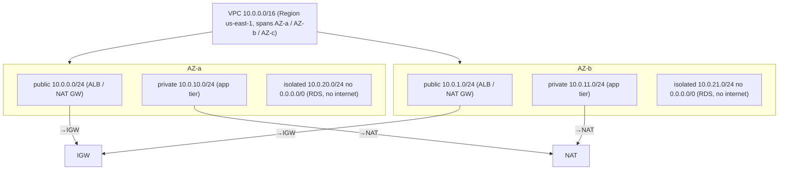
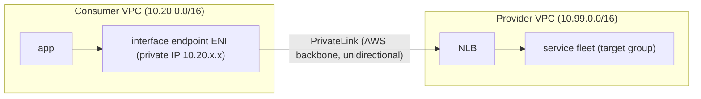

# AWS Networking: VPC, Subnets, PrivateLink and Transit Gateway

AWS networking is the substrate every other service sits on. In a system-design
interview the questions are rarely "what is a VPC" — they are **which isolation
boundary, which connectivity primitive, which egress path, and what does it cost**,
plus the failure modes (AZ loss, throttling, exhausted address space, blast radius of
a shared network). This note is organized around those trade-offs. The recurring theme
is that AWS gives you several primitives that overlap (peering vs Transit Gateway,
interface vs gateway endpoints, security groups vs NACLs, Direct Connect vs VPN) and
seniority is shown by picking the right one for the stated constraints — scale,
latency budget, cost, ops maturity, and blast radius — and naming what you give up.

Mental model: a **VPC is a regional, software-defined private network** — a slice of
Amazon's network with your own private IPv4/IPv6 address space, spanning all
Availability Zones (AZs) in one Region. Everything else (subnets, route tables,
gateways, endpoints, peering) is about **where packets are allowed to go and how they
are addressed**. A VPC never leaves its Region; cross-Region always means an explicit
connectivity primitive (inter-Region peering, TGW peering, Cloud WAN, or the public
internet).

---

## VPC and subnets, public versus private

A **VPC** is defined by one or more **CIDR blocks** (the private IP range). It is
regional and spans every AZ. A **subnet** is a slice of the VPC CIDR that lives in
**exactly one AZ** — subnets are the unit of AZ placement and the unit a route table
attaches to. There is no such thing as a multi-AZ subnet; high availability always
means "one subnet per AZ" for the same tier.

- **Public subnet** = a subnet whose route table has a `0.0.0.0/0` route pointing at
  an **Internet Gateway (IGW)**. Instances there can be reached from and reach the
  internet *if* they also have a public/Elastic IP.
- **Private subnet** = no direct route to the IGW. Outbound internet (patching, API
  calls) goes through a **NAT gateway** that lives in a public subnet; inbound from
  the internet is impossible without a load balancer or proxy in a public subnet.

The canonical three-tier layout puts **load balancers in public subnets**, **app/EC2
in private subnets**, and **databases in isolated private subnets** (no NAT route at
all). This limits blast radius: even if an app host is compromised it cannot be
reached directly from the internet, and an isolated DB subnet can't exfiltrate to the
internet.

**Reserved addresses:** AWS reserves the **first four and the last** IP in every
subnet (network address, VPC router, DNS `.2`, future use, and broadcast). So a `/24`
(256 addresses) yields **251 usable**, not 256. This bites capacity planning for large
EKS/ENI-hungry workloads.

**Quotas that matter:** default **5 VPCs per Region** (raisable to hundreds), **200
subnets per VPC**, CIDR from **/28 (16 IPs) to /16 (65,536 IPs)** for IPv4, up to **5
IPv4 CIDR blocks per VPC** (raisable to 50 — a common escape hatch when the primary
CIDR runs out). You cannot shrink or change the primary CIDR after creation; you can
only add secondary CIDRs, so **plan address space before you build**.

**Trade-off — few large VPCs vs many small VPCs.** A big shared VPC is simple routing
and cheap (no inter-VPC data charges), but a single blast radius and a single
address-space plan everyone must coordinate on. Many small VPCs give isolation and
independent lifecycles but multiply routing, endpoints, and cross-VPC data-transfer
cost. Modern guidance (Landing Zone / Control Tower) is **VPC-per-workload-per-account**
stitched together with Transit Gateway, trading some cost/complexity for strong
account-level isolation.

---

## Route tables, internet gateway and NAT gateway

A **route table** maps destination CIDRs to targets (IGW, NAT GW, ENI, peering,
TGW, endpoint, gateway). Each subnet is associated with exactly one route table;
one route table can back many subnets. The **main route table** is the default for
unassociated subnets. **Longest-prefix-match wins**; the `local` route for the VPC
CIDR is implicit and cannot be removed or overridden.

- **Internet Gateway (IGW):** horizontally scaled, redundant, no bandwidth cap,
  **free**. It performs 1:1 NAT for instances with public/Elastic IPs. One IGW per
  VPC. Presence of a `0.0.0.0/0 → igw` route is what makes a subnet "public."
- **NAT Gateway:** managed, AZ-scoped SNAT device for **outbound-only** internet from
  private subnets. Scales **5 Gbps up to 100 Gbps** automatically, supports up to
  **~55,000 simultaneous connections per unique destination** (IP+port). Priced at
  **~$0.045/hr + ~$0.045 per GB processed** — the per-GB charge is *on top of*
  internet egress and is a classic surprise on the bill.

**Trade-off — NAT gateway per AZ vs one shared NAT GW.** Deploy **one NAT GW per AZ**
and route each AZ's private subnets to the NAT in the *same* AZ. Gains: AZ-fault
isolation (if AZ-a's NAT dies you don't lose AZ-b) and no cross-AZ data-transfer
charge on NAT traffic. A single shared NAT GW is cheaper in hourly + fewer resources
but introduces a **cross-AZ dependency** (SPOF at AZ granularity) and cross-AZ
transfer fees. For heavy S3/DynamoDB traffic, a **gateway VPC endpoint bypasses the
NAT entirely** and removes both the NAT per-GB and egress cost — often the single
biggest network cost win.

**NAT gateway vs NAT instance:** NAT instance (self-managed EC2) is legacy — cheaper at
tiny scale and can double as a bastion/port-forwarder, but you own HA, patching, and it
caps at the instance's bandwidth. Default to the managed NAT gateway unless you have a
specific reason.

**Egress-only IGW** is the IPv6 equivalent of a NAT gateway: allows outbound IPv6,
blocks inbound. IPv6 has no NAT because addresses aren't scarce.

---

## Security groups versus network ACLs

Both are packet filters, but they operate very differently and are a favorite
interview trade-off.

| Dimension        | Security Group (SG)              | Network ACL (NACL)                    |
|------------------|----------------------------------|---------------------------------------|
| Attaches to      | ENI / instance                   | Subnet                                |
| State            | **Stateful** (return traffic auto-allowed) | **Stateless** (must allow both directions) |
| Rules            | **Allow only**                   | **Allow and Deny**                    |
| Evaluation       | All rules evaluated (OR of allows) | **Numbered, lowest-first, first match wins** |
| Default          | Deny inbound, allow all outbound | Default NACL allows all; custom denies all |
| Scope of change  | Per resource                     | Blast radius = whole subnet           |

**Stateful vs stateless is the crux.** With an SG, if you allow inbound 443, the
response is automatically allowed out — you don't manage ephemeral return ports. With
a NACL you must explicitly allow the **ephemeral port range** (typically 1024–65535)
for return traffic in the opposite direction, which is where NACLs commonly break
things.

SGs can reference **other security groups** (and prefix lists) as the source, not just
CIDRs — e.g. "allow the app-tier SG to reach the DB-tier SG on 5432." This is the
idiomatic, self-adjusting way to express tier-to-tier rules and underpins
micro-segmentation / zero-trust inside a VPC.

**Trade-off — when to use a NACL at all.** SGs are the primary control and should
carry the bulk of the policy. NACLs are a **coarse, subnet-wide, stateless backstop**:
use them to explicitly **DENY** something (an SG cannot deny — it can only fail to
allow), e.g. blocklisting a bad CIDR across an entire subnet, or a defense-in-depth
layer so a misconfigured SG isn't the only thing standing between the internet and a
DB subnet. Downside: stateless rules are error-prone (ephemeral ports), the blast
radius is the whole subnet, and the default limit is only **20 rules** (max 40 in +
40 out). Rule of thumb: **default to SGs, add NACLs only for explicit denies or
regulatory defense-in-depth.**

**Quotas:** 60 rules per SG per direction (IPv4 and IPv6 counted separately), 5 SGs
per ENI (up to 16); the product of the two cannot exceed 1000. 2,500 SGs per Region.

---

## VPC endpoints, gateway versus interface

VPC endpoints let resources reach AWS services (and third-party/your own services)
**without traversing the internet, an IGW, or a NAT gateway**. There are two kinds and
picking the wrong one is a common design error.

**Gateway endpoints** — **only S3 and DynamoDB.** They are a *route table entry*
(target = the endpoint, destination = an AWS-managed prefix list) — no ENI, no IP,
**no hourly or per-GB charge (free)**. Because they're route-based they only work
**from within the same VPC** — they **cannot** be reached from on-premises (over
DX/VPN) or from a peered VPC. They keep traffic on the AWS private network and, more
importantly for the bill, **remove the NAT gateway processing + egress cost for S3 and
DynamoDB traffic**.

**Interface endpoints (powered by AWS PrivateLink)** — an **ENI with a private IP** in
your subnet(s), one per AZ you enable. Available for **most AWS services** (SQS, SNS,
KMS, Secrets Manager, ECR, STS, Kinesis, API Gateway private APIs, etc.) and for
third-party / your own services. Priced at **~$0.01 per AZ per hour + ~$0.01 per GB
processed**. Because it's a real IP in your VPC it **can** be reached over
peering, VPN, Direct Connect, and Transit Gateway — so it's the way to give
on-prem/other-VPC access to a service privately. Uses **private DNS** so the standard
service hostname resolves to the endpoint's private IP.

| Dimension        | Gateway endpoint            | Interface endpoint (PrivateLink)      |
|------------------|-----------------------------|---------------------------------------|
| Services         | **S3, DynamoDB only**       | Most AWS + partner + your own         |
| Mechanism        | Route table + prefix list   | ENI + private IP                      |
| Cost             | **Free**                    | ~$0.01/AZ/hr + ~$0.01/GB              |
| Reachable from on-prem / peered VPC | **No**   | **Yes**                               |
| HA               | Regional, automatic         | Deploy one ENI per AZ yourself        |

**Trade-off — S3 access from private subnets.** For S3 from within a VPC, prefer the
**free gateway endpoint** (saves NAT + egress). But if on-prem hosts (over DX/VPN)
need private S3 access, a gateway endpoint won't reach them — you need the **S3
*interface* endpoint** (which does cost per-hour/per-GB) or route through a proxy. So
the "which S3 endpoint" answer depends on *who* needs access.

---

## PrivateLink for exposing services privately

PrivateLink is the mechanism for **exposing a service across VPC/account boundaries
without VPC peering, without exposing CIDRs, and without any internet path**. The
provider fronts their service with a **Network Load Balancer (NLB)** (or GWLB) and
publishes a **VPC endpoint service**; consumers create an **interface endpoint** that
appears as an ENI in *their* VPC.

Key properties and why interviewers love it:

- **Unidirectional / one-way:** the consumer initiates to the provider; the provider
  cannot initiate back into the consumer VPC. This is the security win over peering.
- **No CIDR coordination and overlap-safe:** consumer and provider CIDRs can overlap,
  because the consumer only ever talks to the endpoint's private IP — nothing is routed
  between the two VPCs. Peering and TGW **require non-overlapping CIDRs**; PrivateLink
  does not.
- **Not transitive and no route sharing:** only the specific service is exposed, not
  the whole network. Least-privilege by construction.
- **Scales to thousands of consumers** without N×N route/peering management — the SaaS
  multi-tenant pattern (Snowflake, Datadog, MongoDB Atlas, and internal platform teams
  all use it).
- **Cross-Region consumption (since Nov 2024):** PrivateLink now supports cross-Region
  connectivity — a consumer can create an interface endpoint that connects to an
  endpoint service in a *different* Region over the AWS backbone (the provider enables
  cross-Region access on the service). Historically endpoint services were regional and
  required same-Region consumers or inter-Region TGW/peering to bridge; that constraint
  is now relaxed for services that opt in.

**Trade-off — PrivateLink vs VPC peering/TGW for service-to-service.** PrivateLink
exposes **one service endpoint**, one-way, overlap-safe, least-privilege — ideal for a
**provider/consumer (SaaS-like) relationship** or exposing a single API across
accounts. Peering/TGW connect **whole networks** bidirectionally (all IPs routable),
which is what you want for chatty, many-service, mutual east-west traffic but is
heavier on trust and requires non-overlapping IP plans. PrivateLink also carries
per-hour + per-GB endpoint cost and is fronted by an NLB (Layer 4 only, no
HTTP-path routing). If you need many services mutually reachable, peering/TGW is
simpler than standing up an endpoint service per API.

---

## VPC peering versus Transit Gateway

Two ways to connect VPCs to each other.

**VPC peering** is a 1:1, non-transitive connection between two VPCs (same or
different Region/account). It uses the **AWS backbone**, adds **no bandwidth
bottleneck**, and has **no per-hour charge** (you pay only data transfer). The catch:
**non-transitive** — if A↔B and B↔C are peered, A cannot reach C through B. Full mesh
of *n* VPCs needs **n(n-1)/2 peerings** and every VPC's route tables must carry routes
for every peer. This is fine for a handful of VPCs; it explodes operationally past
~10.

**Transit Gateway (TGW)** is a **regional hub-and-spoke router**. Every VPC (and VPN,
Direct Connect, and peered TGW) attaches once, and TGW provides **transitive routing**
between attachments via TGW route tables. This turns an O(n²) mesh into O(n)
attachments and centralizes routing/inspection.

| Dimension          | VPC Peering                    | Transit Gateway                          |
|--------------------|--------------------------------|------------------------------------------|
| Topology           | 1:1, full mesh needed          | Hub-and-spoke, single attachment per VPC |
| Transitive routing | **No**                         | **Yes** (via TGW route tables)           |
| Scale              | ~125 peerings/VPC, mesh O(n²)  | **5,000 attachments** per TGW            |
| Bandwidth          | No aggregate cap (backbone)    | **Up to 100 Gbps per VPC attachment** per AZ; **~5 Gbps per-flow** cap |
| Cost               | Data transfer only, no hourly  | **Per-attachment hourly + per-GB processed** |
| Latency            | Lowest (direct)                | +~small hop through the hub              |
| Inspection         | Hard (no central chokepoint)   | Easy (central inspection/egress VPC)     |

**Quotas that matter:** TGW 5,000 attachments, 10,000 total routes across all its
route tables, 20 TGW route tables, 50 peering attachments. Per-flow (single
TCP/UDP 5-tuple) traffic can't exceed **~5 Gbps** through TGW even though aggregate
per VPC attachment is up to 100 Gbps per AZ — a real limit for elephant flows (bulk
migration, backup). Peering has no such per-flow cap, which is one reason to keep a
direct peering for a specific high-throughput pair even in a TGW world.

**Trade-off — peering vs TGW.** For **2–3 VPCs** with high, direct throughput and cost
sensitivity, **peering** wins: free hourly, lowest latency, no per-flow cap. Once you
have **many VPCs, need transitive reach, central egress/inspection, or hybrid
(VPN/DX) aggregation**, **TGW** wins despite its per-attachment + per-GB cost — the
operational simplification and central control dominate. **AWS Cloud WAN** is the next
tier up: a managed *global* network with policy-as-code across Regions, for when you're
operating TGWs in many Regions and want one control plane.

---

## Direct Connect versus Site-to-Site VPN

Two ways to connect **on-premises** to AWS.

**Site-to-Site VPN** is an **IPsec tunnel over the public internet**. AWS terminates
it on a Virtual Private Gateway (VGW) or TGW. Each VPN **connection has two tunnels**
(to two AWS endpoints) for HA, and **each tunnel caps at ~1.25 Gbps**. Fast to stand
up (minutes), cheap (~$0.05/hr + data), but latency/jitter follow **internet weather**
— variable and unpredictable. To exceed 1.25 Gbps you attach multiple VPNs to a TGW
and use **ECMP** (requires **dynamic BGP routing**, not static) to load-share across
tunnels.

**Direct Connect (DX)** is a **dedicated private circuit** into an AWS Direct Connect
location. Port speeds: **1, 10, 100 Gbps dedicated**; hosted connections from **50
Mbps up to 25 Gbps**. Gains: **consistent, low latency, higher throughput, and lower
per-GB data-transfer rates** than internet egress. Costs: port-hours + DX data
transfer + weeks-to-provision lead time + physical cross-connect. A **single DX has no
built-in encryption** (it's private but not encrypted); use **MACsec** (on 10/100 Gbps
ports) or run **IPsec VPN over DX** for encryption in transit.

| Dimension        | Site-to-Site VPN               | Direct Connect                        |
|------------------|--------------------------------|---------------------------------------|
| Medium           | IPsec over public internet     | Dedicated private circuit             |
| Bandwidth        | ~1.25 Gbps/tunnel (ECMP to scale) | 1/10/100 Gbps (hosted 50 Mbps–25 Gbps) |
| Latency/jitter   | Variable (internet)            | Consistent, low                       |
| Provisioning     | Minutes                        | Weeks (physical)                      |
| Encryption       | Built-in (IPsec)               | **None by default** (add MACsec/VPN)  |
| Cost             | Low hourly + data              | Port-hours + lower per-GB + circuit   |
| Resilience       | Two tunnels; add 2nd VPN       | **Single DX is a SPOF — need 2**      |

**Trade-off — and the best-practice combo.** VPN is right for **quick setup, low
bandwidth, dev/test, or as a *backup* path**. DX is right for **sustained high
throughput, latency-sensitive workloads (hybrid DBs, VDI, real-time), and lower
egress cost at volume**. The classic HA design is **DX as primary with a Site-to-Site
VPN as failover** — you get DX performance normally and internet-based resilience if
the circuit drops, without paying for two DX circuits. For full resilience, two DX
connections in **different DX locations**. Terminate both on a **Transit Gateway** so
all VPCs share the hybrid connectivity.

---

## Multi-VPC and multi-account network design

At scale the boundary is the **account**, not the VPC. AWS Organizations + Control
Tower give an account-per-workload/environment model; the network stitches them.

Common patterns:

- **Shared Services / Egress VPC:** a central VPC (often a dedicated network account)
  hosts NAT gateways, interface endpoints, DNS resolvers, and firewalls. Spoke VPCs
  route internet-bound and shared traffic through it via TGW, so you pay for NAT and
  endpoints **once**, centralize inspection, and shrink the number of internet-facing
  points.
- **Inspection VPC:** TGW appliance-mode attachment sends east-west and egress traffic
  through **AWS Network Firewall** or third-party firewalls for centralized L7
  inspection. "Appliance mode" keeps flow symmetry (same appliance sees both
  directions) — a subtle but exam-worthy detail.
- **VPC Sharing (RAM):** share subnets from one owner account into many participant
  accounts so they launch resources into the **same VPC** — fewer VPCs, no inter-VPC
  charges, shared address space, but weaker isolation than separate VPCs.
- **AWS Cloud WAN:** managed global WAN with a central policy document, segmentation,
  and Region-spanning core — the successor pattern to hand-built multi-Region TGW
  peering.

**Trade-off — centralized (hub egress/inspection) vs decentralized (NAT+endpoints per
VPC).** Centralizing saves cost (one NAT, one set of endpoints) and gives one control
and inspection point, but adds **TGW per-GB processing charges**, a hop of latency, and
a **central blast radius / bandwidth chokepoint**. Decentralizing (NAT + endpoints in
each VPC) is more resilient and lower-latency per VPC but multiplies cost and spreads
the security surface. Pick centralized when governance/cost/inspection dominate;
decentralized when per-VPC isolation and latency dominate.

---

## IP addressing and CIDR planning

The single most consequential decision, because you **cannot change a VPC's primary
CIDR** and connectivity primitives (peering, TGW, VPN, DX) **require non-overlapping
address space**.

- Allocate a **single large contiguous block per VPC** from an organization-wide plan
  (RFC1918: `10.0.0.0/8`, `172.16.0.0/12`, `192.168.0.0/16`). Reserve room for growth,
  new AZs, and future accounts.
- IPv4 CIDR is **/16 to /28**; remember **5 reserved IPs per subnet** and up to **5
  (→50) CIDR blocks per VPC** as an escape hatch when you outgrow the primary.
- Avoid overlap with on-prem and with other VPCs you'll ever connect — overlapping
  CIDRs are the classic reason a merger/acquisition can't peer. **PrivateLink** and
  **private NAT gateway** are the escape hatches when overlap is unavoidable (they
  don't route the full CIDR).
- **IPAM (IP Address Manager)** automates allocation, tracks utilization, and prevents
  overlap across accounts/Regions — the modern answer to "how do you manage CIDR at
  scale."
- **IPv6** sidesteps scarcity (Amazon-provided `/56` per VPC, `/64` per subnet) and is
  the answer for very large / ENI-dense workloads (EKS pods) that exhaust IPv4.

**Back-of-envelope:** a `/24` = 256 addresses = **251 usable**. An EKS cluster using
the VPC CNI assigns a VPC IP **per pod**; thousands of pods exhaust a small subnet
fast — plan `/20` or larger app subnets, or use IPv6 / prefix delegation.

---

## Egress cost and data-transfer trade-offs

Data-transfer pricing shapes real AWS architectures more than almost anything else.
The rough hierarchy (numbers vary by Region, directionally correct):

- **Inbound from internet:** free.
- **Outbound to internet:** ~$0.09/GB (tiered down at volume). Often the biggest line.
- **Cross-AZ (within a Region):** ~$0.01/GB **each direction** — quietly large for
  chatty multi-AZ apps and replication.
- **Cross-Region:** higher (~$0.02/GB+), varies by Region pair.
- **NAT gateway processing:** ~$0.045/GB **on top of** egress — so private-subnet
  internet traffic is billed twice (NAT + egress).
- **Same-AZ, private IP, same VPC:** free.
- **CloudFront egress** to internet is cheaper than direct EC2/S3 egress and
  origin→CloudFront is free — a reason to front content with the CDN.

**Design implications interviewers probe:**

- **Gateway endpoints for S3/DynamoDB are free** and remove NAT + egress cost — usually
  the first optimization.
- Keep chatty services **in the same AZ** where availability allows to avoid cross-AZ
  fees; balance against the availability need for multi-AZ.
- **Data has gravity:** collocate compute with its data's Region/AZ; egress asymmetry
  means it's often cheaper to move compute to the data than data to the compute.
- Central egress VPC over TGW **adds TGW per-GB** — cheaper on NAT consolidation but
  you pay to cross the hub; model both before choosing.

---

## DNS with Route 53 Resolver in the VPC

Every VPC has a DNS resolver at the reserved **VPC base +2 address** (e.g. `10.0.0.2`)
and the link-local `169.254.169.253`. It resolves public names, private hosted zones,
and internal AWS names. Each ENI is limited to **1024 packets/sec to the Resolver** —
a hard, non-adjustable throttle that surfaces as DNS timeouts under heavy fan-out.

**Route 53 Resolver endpoints** bridge DNS between VPC and on-premises for hybrid:

- **Inbound endpoint:** lets on-prem DNS **resolve names in AWS** private hosted zones.
- **Outbound endpoint + resolver rules:** forward queries for specific domains **from
  VPC to on-prem** DNS servers.

`enableDnsSupport` and `enableDnsHostnames` must be on for private DNS (and for
interface-endpoint private DNS) to work — a common gotcha where a service hostname
still resolves to the public IP because private DNS wasn't enabled on the endpoint.

**Trade-off:** Route 53 Resolver is managed and integrates with private hosted zones
and PrivateLink DNS, but the 1024 pps/ENI limit means very high-QPS DNS workloads
should cache aggressively (client resolver caches, longer TTLs) or run a caching
forwarder — you trade a bit of staleness for staying under the throttle.

---

## Network isolation and zero-trust

Network primitives implement defense-in-depth, but zero-trust means **the network is
not the trust boundary — identity is**. AWS layering:

1. **Account/VPC** — hard isolation boundary; separate accounts contain blast radius.
2. **Subnet + NACL** — coarse, stateless, subnet-wide deny backstop.
3. **Security group** — stateful, identity-like (SG-referencing-SG) micro-segmentation.
4. **PrivateLink** — expose one service, one-way, no network-wide routing.
5. **IAM + VPC endpoint policies** — authorize *who/what* can call a service; endpoint
   policies restrict which principals/resources a VPC endpoint may reach.
6. **Encryption in transit** (TLS, MACsec/IPsec over DX) regardless of "private" path.

**Trade-off — network isolation vs identity-based control.** Pure network isolation
(SGs/NACLs/subnets) is simple and coarse but doesn't express "this specific service
identity may call that API." Zero-trust adds **IAM auth, mTLS, SG-referencing-SG, and
endpoint policies** so that even inside the same VPC nothing is trusted by IP alone —
more moving parts and ops overhead, but it survives a network-perimeter breach.
Best practice combines both: private-by-default networking (endpoints, no public IPs)
**plus** identity-based authorization on every hop.

---

## Trade-offs and when to use what

Quick decision guide for the primitives interviewers force you to choose between:

- **Public vs private subnet:** anything internet-reachable → public (LB/NAT only);
  everything else → private; databases → isolated (no NAT). Minimize public surface.
- **NAT gateway vs gateway endpoint:** S3/DynamoDB from a VPC → **gateway endpoint
  (free)**; general internet egress from private subnets → NAT gateway (per-GB).
- **Gateway vs interface endpoint:** S3/DynamoDB and only in-VPC access → gateway;
  other services, or need on-prem/peered access → interface (PrivateLink, costs $).
- **SG vs NACL:** default to **SGs** (stateful, per-resource, allow-only,
  SG-referencing); add **NACLs** only for explicit **deny** / subnet-wide backstop.
- **Peering vs TGW:** ≤ a few VPCs, direct high throughput, cost-sensitive → peering;
  many VPCs, transitive reach, central egress/inspection, hybrid aggregation → TGW;
  multi-Region managed → Cloud WAN.
- **PrivateLink vs peering:** expose **one** service one-way / overlap-safe /
  SaaS-style → PrivateLink; connect **whole networks** bidirectionally → peering/TGW.
- **VPN vs DX:** quick/cheap/backup/low-bandwidth → VPN; sustained high throughput,
  low/consistent latency, lower egress at volume → DX; best HA = **DX primary + VPN
  failover**, terminated on a TGW.
- **Centralized vs per-VPC egress/inspection:** governance + cost consolidation →
  central hub (accept TGW per-GB + chokepoint); latency + per-VPC resilience →
  decentralized.
- **IPv4 vs IPv6:** default IPv4; switch to IPv6 for ENI-dense (EKS) or huge scale to
  escape address exhaustion (egress-only IGW instead of NAT).

---

## Failure modes and how the design degrades

- **AZ failure:** subnets are AZ-scoped. A single NAT GW / single-AZ endpoint / single
  NLB target AZ becomes a SPOF — deploy one per AZ. TGW and IGW are inherently
  multi-AZ/regional. Interface endpoints need an ENI **per AZ** or cross-AZ calls fail
  when an AZ is lost.
- **Region failure:** VPCs are regional. Cross-Region continuity needs inter-Region
  peering / TGW peering / Cloud WAN and DNS failover (Route 53 health checks).
- **DNS throttling:** >1024 pps/ENI to the Resolver → DNS timeouts that look like app
  failures; mitigate with caching/longer TTLs.
- **Address exhaustion:** subnet runs out of IPs (ENI-heavy/EKS) → launches fail; add
  secondary CIDRs or move to IPv6. Can't be fixed by resizing the primary CIDR.
- **Route table / route limits:** 500 (→1000) routes per RT, 10,000 per TGW —
  large hybrid meshes hit this; summarize/advertise default routes.
- **TGW per-flow ~5 Gbps cap:** a single elephant flow can't exceed it even though
  aggregate per attachment reaches ~100 Gbps — bulk transfers should parallelize
  connections or use direct peering.
- **VPN tunnel ~1.25 Gbps cap:** a single tunnel throttles; need ECMP over multiple
  VPNs (dynamic BGP) or DX.
- **NAT connection limits:** ~55,000 simultaneous connections per unique destination —
  high-fan-out to one endpoint exhausts ports (SNAT errors); spread across
  destinations or use more NAT GWs / interface endpoints.
- **Overlapping CIDRs:** two networks can't be peered/TGW-joined — only PrivateLink or
  private NAT can bridge them.

---

## Common interview follow-up questions

- "Design private-only egress for a fleet of Lambdas/containers that call S3, DynamoDB,
  SQS, and a third-party SaaS — which endpoints and why, and what does it cost?"
- "You have 40 VPCs across 12 accounts that all need to reach shared services and the
  internet. Peering or Transit Gateway? Where do NAT and inspection live?"
- "On-prem needs 5 Gbps sustained, <5 ms, encrypted access to an AWS database. VPN,
  DX, or both? How do you make it HA?"
- "Two companies merge; both use 10.0.0.0/16. How do you let app A call service B?"
  (PrivateLink / private NAT — CIDRs overlap so peering is out.)
- "Why is your cross-AZ / NAT bill so high, and how would you cut it without hurting
  availability?" (gateway endpoints, same-AZ placement, central egress trade-offs.)
- "SG vs NACL — give a case where only a NACL solves it." (explicit deny / bad-CIDR
  block across a whole subnet.)
- "How does PrivateLink let a SaaS expose a service to 10,000 customers without CIDR
  coordination or bidirectional trust?"
- "Which single failure does one-NAT-per-region *not* tolerate, and how do you fix it?"
- "How do you implement zero-trust when everything is already inside one VPC?"

## References

- Amazon VPC User Guide — VPCs, subnets, route tables, security groups, NACLs, quotas
  (docs.aws.amazon.com/vpc/latest/userguide/).
- Amazon VPC quotas page (VPCs/Region, subnets, CIDR /16–/28, SG/NACL rule limits).
- AWS Transit Gateway User Guide and Transit Gateway quotas (attachments, routes,
  100 Gbps/attachment aggregate per AZ, ~5 Gbps per-flow, ECMP, appliance mode).
- AWS PrivateLink documentation — interface endpoints, endpoint services, gateway vs
  interface endpoints.
- AWS Site-to-Site VPN User Guide (two tunnels, ~1.25 Gbps/tunnel, ECMP) and AWS
  Direct Connect User Guide (port speeds, MACsec, hosted connections).
- "AWS VPC connectivity options" and "Building a Scalable and Secure Multi-VPC AWS
  Network Infrastructure" AWS whitepapers.
- AWS Well-Architected Framework — Security and Reliability pillars (network isolation,
  multi-AZ, blast-radius).
- re:Invent deep-dive sessions on VPC networking, Transit Gateway, PrivateLink, and
  Cloud WAN (300/400-level "advanced VPC design patterns" talks).
- AWS Prescriptive Guidance — multi-account network architecture, IPAM, central egress
  and inspection patterns.
