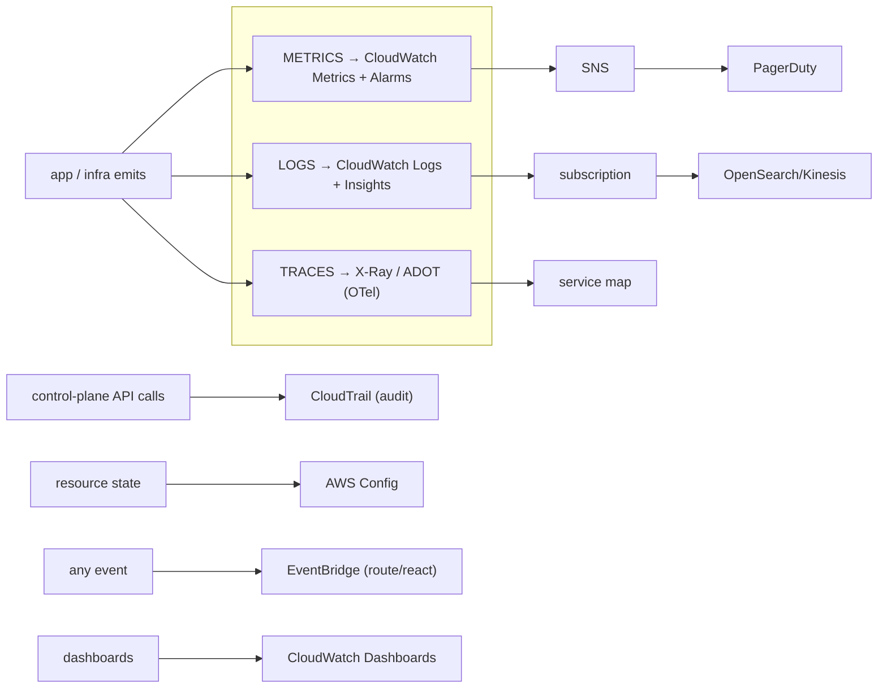

# Observability on AWS: CloudWatch, X-Ray and CloudTrail

Observability is the ability to ask *arbitrary* questions about your system's
behavior from the outside, without shipping new code to answer each one. In an
interview the naive answer is "use CloudWatch." The senior answer maps the three
pillars — **metrics, logs, traces** — onto the right AWS service for each, explains
where CloudTrail (audit) and Config (resource state) fit versus CloudWatch
(operational health), and — most important — reasons about the **trade-offs**:
cardinality cost, sampling, retention, blast radius of a monitoring outage, and
symptom-vs-cause alerting.

The mental model:

- **Metrics** = cheap, aggregated, numeric time series. Fast to alarm on, but
  pre-aggregated (you lose per-request detail). → **CloudWatch Metrics**.
- **Logs** = high-cardinality, per-event detail. Rich but expensive to store and
  slow/costly to query at scale. → **CloudWatch Logs + Logs Insights**.
- **Traces** = the causal path of one request across services, with timing.
  Answers "where did the latency go?" → **AWS X-Ray / OpenTelemetry (ADOT)**.
- **Audit** = who called which API, when, from where (security/compliance/forensics),
  NOT operational health. → **CloudTrail**.
- **Resource configuration state and compliance over time** → **AWS Config**.



This document ends most sections in trade-offs, because that is what gets probed.

---

## Three pillars of observability on AWS

**Intuition.** Monitoring answers "is it broken?" (known failure modes you predicted
in advance). Observability answers "*why* is it broken?" for failures you did not
predict. The three pillars are complementary, not interchangeable:

| Pillar | AWS service | Answers | Strength | Weakness |
|---|---|---|---|---|
| Metrics | CloudWatch Metrics | "How much / how fast / how many?" | Cheap, real-time, alarmable | Pre-aggregated; can't drill to one request |
| Logs | CloudWatch Logs | "What exactly happened in this event?" | Full detail, high cardinality | Costly at volume; slower to query |
| Traces | X-Ray / ADOT | "Where in the call graph did time/errors go?" | End-to-end latency attribution | Sampled; instrumentation effort |

**How they connect.** The modern pattern is **correlation**: emit a `trace_id` into
structured logs and as a metric dimension so you can pivot metric → log → trace for
the same request. CloudWatch **Metric Filters** turn logs into metrics; **Embedded
Metric Format (EMF)** lets a log line *carry* metrics so you extract high-cardinality
metrics without a separate `PutMetricData` call. X-Ray's service map is built from
traces; CloudWatch **Application Signals** stitches all three into SLOs.

**What an EMF log line actually looks like** (a top interview probe). It is ordinary
JSON with a reserved `_aws` block that tells CloudWatch which fields to extract as
metrics; everything else stays as searchable log fields:

```json
{
  "_aws": {
    "Timestamp": 1700000000000,
    "CloudWatchMetrics": [{
      "Namespace": "OrderService",
      "Dimensions": [["Service", "Operation"]],
      "Metrics": [
        { "Name": "Latency", "Unit": "Milliseconds" },
        { "Name": "Faults",  "Unit": "Count" }
      ]
    }]
  },
  "Service": "checkout",
  "Operation": "PlaceOrder",
  "Latency": 142,
  "Faults": 0,
  "requestId": "a1b2c3d4-e5f6-7890-abcd-ef0123456789",
  "customerId": "cust-98217"
}
```

Write this **one line** to CloudWatch Logs and you get two things for free: CloudWatch
auto-extracts `Latency=142ms` and `Faults=0` as metrics under
`OrderService` dimensioned by `{Service=checkout, Operation=PlaceOrder}` (a bounded,
cheap dimension set), **and** the full line — including the high-cardinality
`requestId`/`customerId` you would never make a metric dimension — stays queryable in
Logs Insights. One write, both pillars, no separate `PutMetricData`.

**Trade-offs.** Do not treat logs as a metrics store (querying "count of 500s" by
scanning logs is slow and costs per-GB scanned in Logs Insights). Do not treat
metrics as logs (you cannot reconstruct one request from a p99 line). Traces are
*sampled* — great for latency attribution, wrong for exact counts or billing. Pick
the cheapest pillar that answers the question, and correlate across them by id.

---

## CloudWatch metrics, resolution and namespaces

**How it works.** A CloudWatch metric is a time-ordered set of data points identified
by **namespace + metric name + a set of dimensions**. AWS services publish metrics
automatically (e.g. `AWS/EC2 CPUUtilization`, `AWS/Lambda Errors`). You publish your
own with `PutMetricData` into a custom namespace.

- **Standard resolution** = 1-minute granularity (the default for most AWS-published
  metrics).
- **High-resolution** = down to **1-second** granularity (`StorageResolution=1`).
  Alarms on high-res metrics can evaluate as fast as **10-second** periods.
- **Retention (automatic rollup):** 1-second data is kept **3 hours**; 1-minute data
  **15 days**; 5-minute data **63 days**; 1-hour data **15 months (455 days)**. Data
  ages into coarser resolution; you cannot get 1-second detail from last month.
- **`PutMetricData`** accepts up to 1,000 metrics per call; you can send **pre-aggregated
  statistic sets** (min/max/sum/count) instead of raw values to cut API calls and cost.

**Basic vs detailed monitoring.** EC2 basic monitoring = 5-minute metrics (free);
**detailed monitoring** = 1-minute (paid). Lambda/API Gateway emit 1-minute metrics
by default.

**Metric math and anomaly detection.** You can compute derived series (error rate =
errors/invocations) and set **anomaly-detection band** alarms that learn a normal
range instead of a static threshold — good for seasonal traffic.

**Trade-offs.**
- **High-resolution vs standard:** 1-second metrics + 10-second alarms detect spikes
  fast (autoscaling, latency SLOs) but cost more (higher `PutMetricData` volume,
  and high-res alarms are priced higher) and only retain fine detail 3 hours. Use
  high-res only where sub-minute detection changes an outcome; standard 1-minute is
  right for the vast majority.
- **Custom metric vs metric filter vs EMF:** `PutMetricData` is simplest but a
  separate API call and one metric = ongoing monthly cost regardless of volume;
  a **metric filter** on existing logs is free to create (you already pay for logs);
  **EMF** embeds metrics in a log line so you get metric + underlying log in one write
  — best when you need both and want high-cardinality dimensions without paying per
  custom metric up front.

---

## Metric dimensions and cardinality cost

**Intuition.** Each **unique combination of dimension values is a distinct metric**,
and CloudWatch bills per custom metric per month (plus API calls). Cardinality is
the silent budget-killer of observability.

**The trap.** Adding a high-cardinality dimension — `userId`, `requestId`,
`sessionId`, raw URL path — multiplies your metric count explosively. 1 metric with
a `userId` dimension across 1,000,000 users = 1,000,000 custom metrics = a large
recurring bill, and most are queried never.

**Rules of thumb.**
- Keep dimensions **low-cardinality and bounded**: `service`, `region`, `az`,
  `statusClass` (2xx/4xx/5xx), `apiName`. These have tens of values, not millions.
- A metric is uniquely defined by its full dimension set; you **cannot aggregate
  across a dimension you didn't also publish without it** (i.e. to query "all users"
  you must also emit the metric with no `userId` dimension, or use metric math /
  SEARCH). This is why blindly adding dimensions doesn't give free rollups.
- For genuinely high-cardinality analysis (top-N talkers), use **CloudWatch
  Contributor Insights** (rules over logs, capped at 100 rules) instead of dimensions.

**Trade-offs.** High-cardinality dimensions give you slice-and-dice power but explode
cost and can make dashboards unusable. If you need per-user detail *occasionally*,
put it in **logs** (query on demand with Logs Insights) or use **EMF with a
cardinality-bounded** dimension set — not in a metric dimension you pay for 24/7.
This is the single most common "why is our CloudWatch bill huge?" root cause.

---

## CloudWatch alarms and composite alarms

**How it works.** A **metric alarm** watches one metric (or one metric-math
expression) and transitions between `OK`, `ALARM`, `INSUFFICIENT_DATA` based on a
threshold evaluated over N periods (`EvaluationPeriods`) with an `M of N` "datapoints
to alarm" rule. On transition it fires **alarm actions**: publish to **SNS**, trigger
**Auto Scaling**, **EC2 actions** (reboot/stop/recover), or **Systems Manager**.

- **`treatMissingData`** controls behavior when data is absent (`missing`, `notBreaching`,
  `breaching`, `ignore`) — a classic gotcha: a broken metric source can silently go
  `INSUFFICIENT_DATA` and never page you.
- **M-of-N** reduces flapping: alarm only if 3 of the last 5 datapoints breach.

**Traced timeline (EvaluationPeriods=5, DatapointsToAlarm=3, period=60s).** The alarm
looks back at the last 5 one-minute datapoints each minute and flips to `ALARM` the
moment 3 of those 5 breach the threshold. Let `B` = breaching, `.` = OK:

| Minute | Datapoint | Last-5 window | Breaches in window | State |
|---|---|---|---|---|
| 12:00 | `.` | `.` | 0 | OK |
| 12:01 | `B` | `. B` | 1 | OK |
| 12:02 | `.` | `. B .` | 1 | OK |
| 12:03 | `B` | `. B . B` | 2 | OK |
| 12:04 | `B` | `. B . B B` | 3 | **ALARM** |

So even with a *sustained* problem, an M-of-N=3-of-5 alarm pages ~3–5 minutes after
onset, not on the first breach — that lag is the price of noise suppression. **Now the
`treatMissingData` gotcha:** suppose at 12:03 the metric source dies instead of
breaching. That datapoint is *missing*, not breaching. With
`treatMissingData=notBreaching` the window still has only 1–2 breaches and the alarm
sits happily in `OK` — a real outage stays silent. With `treatMissingData=breaching`,
the missing point counts toward the 3, and the alarm fires — which is exactly why
liveness/heartbeat alarms should use `breaching`. Note also that if
`DatapointsToAlarm` equalled `EvaluationPeriods` (5-of-5) the alarm would need five
consecutive breaches and page slower; making them *unequal* (3-of-5) trades a little
specificity for faster, flap-resistant detection.

**Composite alarms** combine child alarms with a boolean rule
(`ALARM("HighCPU") AND ALARM("HighLatency")`). Their job is **noise reduction**: page
once on the *user-visible symptom*, and *suppress* downstream cause-alarms while a
parent is firing (`ActionsSuppressor`). This prevents an alarm storm where one root
cause fires 40 pages.

**Trade-offs.**
- **Static threshold vs anomaly detection:** static is predictable and cheap but
  brittle for seasonal/variable traffic (false pages at 3am scale-down, missed
  daytime regressions); anomaly-detection bands adapt but need history, can mask a
  slow drift, and cost more. Use anomaly detection for spiky business metrics, static
  for hard SLOs (p99 latency > 300ms).
- **Many granular alarms vs few composite alarms:** granular alarms localize the fault
  fast but generate storms; composite alarms give clean paging but can hide which leaf
  actually broke. Best practice: **alarm (page) on symptoms** at the composite level,
  keep cause-alarms as non-paging inputs for diagnosis.
- **Aggressive M-of-N / short periods** detect fast but flap; **long evaluation
  windows** are stable but slow to page. Tie the window to your SLO's alerting burn
  rate, not to intuition.

---

## CloudWatch Logs, log groups and retention

**How it works.** Logs are organized as **log groups** (retention + access policy +
metric filters live here) containing **log streams** (one sequence of events, e.g.
one Lambda instance / one container). You push events with `PutLogEvents`; the CloudWatch
agent, Lambda, ECS `awslogs` driver, and Fluent Bit are common shippers.

**Facts that matter for design:**
- **`PutLogEvents` batch max = 1 MB** and up to 10,000 events per batch;
  **`PutLogEvents` throttle default = 5,000 requests/sec per account/region**.
- **Retention is per log group**, from **1 day to 10 years**, or **Never expire**
  (the *default*). "Never expire" on chatty groups is a top hidden cost — always set
  retention explicitly.
- **Log group limit** ≈ 1,000,000 per account/region (adjustable). Metric filters
  per log group = 100; **subscription filters per log group = 2** (a hard design
  constraint for fan-out).
- **Log classes:** **Standard** (full features, real-time, Insights, metric filters,
  Live Tail) vs **Infrequent Access (IA)** — ~50% cheaper ingestion, but no metric
  filters, no Live Tail, no subscription filters, and Insights only. Choose IA for
  compliance/debug logs you rarely query in real time.

**Trade-offs.**
- **Retain long in CloudWatch vs archive to S3:** CloudWatch Logs storage is more
  expensive per GB than S3; for long-term/compliance retention, **export or subscribe
  to S3** (then Athena/Glue for occasional queries) and keep short retention (e.g.
  14–30 days) in CloudWatch for live ops. Trade query latency/convenience for cost.
- **Standard vs IA log class:** IA halves ingestion cost but removes real-time
  alerting features — never put logs you alarm on into IA.

---

## Logs Insights, metric filters and subscription filters

These are the three ways to *get value out of* logs, and they answer different needs.

**CloudWatch Logs Insights** — an interactive **query language** over log groups
(`fields`, `filter`, `stats`, `parse`, `sort`, `limit`). Purpose-built for ad-hoc
investigation ("show me all 5xx for order-service in the last hour grouped by
downstream"). You are **billed per GB of data scanned** by each query, so scope by
time range and log group. Queries return up to 10,000 rows; concurrent-query limits
apply. Great for debugging, wrong as a always-on dashboard datasource at scale.

**Metric filters** — a pattern that runs on **ingestion** and increments a CloudWatch
**metric** whenever matching events arrive (e.g. count of `ERROR`, extract latency into
a metric). Turns logs into cheap, alarmable metrics **without scanning**. Use for
"alarm when errors spike": the metric exists continuously and you alarm on it.
Limitation: pattern-based, up to 100 per group, and only counts/extracts what you
defined in advance.

**Subscription filters** — a **real-time stream** of matching log events pushed to a
destination: **Kinesis Data Streams**, **Firehose** (→ S3/OpenSearch/Splunk/Datadog),
or **Lambda**. This is how you fan logs out to a search/analytics platform or a SIEM.
**Hard limit: 2 subscription filters per log group** — if you need to feed both, say,
OpenSearch and a security lake, either use Firehose with multiple destinations, an
**account-level subscription filter**, or a Lambda/Kinesis fan-out.

**Trade-offs.**
- **Metric filter vs Logs Insights for the same question:** if you'll ask it
  *repeatedly / need to alarm*, a metric filter is far cheaper (no repeated scan) but
  must be defined ahead of time; Insights is pay-per-scan but flexible and
  retroactive. Alarm on metric filters; investigate with Insights.
- **Subscription → Kinesis vs → Firehose:** Kinesis Data Streams gives you low-latency,
  replayable, multi-consumer streaming (you manage shards, 1 MB/s or 1,000 rec/s
  ingest per shard) — pick it when multiple independent consumers or sub-second
  latency matter. Firehose is zero-management, buffers and batches (≥60s / MBs) to
  S3/OpenSearch with transform + compression — pick it for simple durable delivery
  where minute-latency is fine and you don't want to size shards.
- **OpenSearch vs Logs Insights:** OpenSearch gives fast full-text search, rich
  dashboards and long retention but you run/scale a cluster (cost + ops). Insights is
  serverless and zero-ops but pay-per-scan and less interactive at huge scale. Route
  high-value, frequently searched logs to OpenSearch; keep the rest in CloudWatch.

---

## AWS X-Ray tracing, segments and sampling

**How it works.** X-Ray records the path of a request as a **trace** made of
**segments** (one per service/resource that handled it) and **subsegments** (calls to
downstream services, DB, HTTP). Each carries timing, annotations, and metadata. X-Ray
stitches segments by a propagated **trace ID** (header `X-Amzn-Trace-Id`) into a
**service map** — a topology graph with per-edge latency, error, fault and throttle
rates. This is how you answer "the checkout is slow — which of the 12 downstream calls
is the culprit?"

**Facts for design:**
- **Trace data retention = 30 days** (not configurable); X-Ray is for recent
  operational analysis, not long-term audit.
- **Sampling** keeps cost and overhead bounded. The **default sampling rule** = **1
  request per second (reservoir) + 5% of any additional requests**. Sampling decisions
  are made once at the edge and propagated so a trace is captured whole or not at all.

  **Worked example — what the default rule yields at two traffic levels.** The
  reservoir guarantees the *first* 1 req/s is always traced; the 5% applies to the
  rest.
  - At **1,000 req/s**: 1 (reservoir) + 5% × 999 ≈ 1 + 49.95 ≈ **~51 traces/s** — about
    **5.1%** of traffic. The reservoir barely matters here; you are essentially at 5%.
  - At **20 req/s**: 1 (reservoir) + 5% × 19 = 1 + 0.95 = **~2 traces/s** — about
    **10%** of traffic. The fixed reservoir now doubles the effective rate.
  - At **2 req/s**: 1 + 5% × 1 = 1.05 ≈ **~1 trace/s** — about **~50%**.

  The lesson: the reservoir *dominates at low traffic* (guaranteeing you always have
  some traces) and *fades to the 5% rate at high traffic* (bounding cost). But notice
  that at 1,000 req/s you trace only ~5% — if 3 of those requests/sec are failing, you
  might capture *none* of the failures. That is exactly why you add a rule to
  **force-sample errors/faults at 100%** rather than relying on the default.
- **Segment document max ≈ 64 KB**; batch upload via the X-Ray daemon / ADOT collector
  (UDP to the daemon, which buffers and sends to the X-Ray API).
- **Annotations** are indexed and filterable (limited count); **metadata** is stored
  but not indexed. Put searchable keys (customerTier, orderId-hash) in annotations.

**Trade-offs.**
- **Sample rate: cost/overhead vs completeness.** Low sampling (default 5%) is cheap
  and near-zero overhead but you will *miss* rare errors and can't guarantee a given
  failed request was traced; 100% sampling captures everything (essential in a
  focused incident or low-traffic critical path) but multiplies ingestion cost and
  daemon load. Best practice: default-sample high-volume happy paths, but write a rule
  to **sample errors/faults at 100%** and boost sampling on critical low-traffic APIs.
- **X-Ray active vs passive tracing (Lambda/API GW):** *Active* starts a trace even
  when no upstream trace header exists; *passive* only continues an existing one. Use
  active at the entry point, passive downstream, so you don't double-count roots.
- **X-Ray vs full APM (Datadog/Dynatrace/New Relic):** X-Ray is deeply integrated,
  cheap, zero-infra, but has coarser code-level profiling, 30-day retention, and a
  simpler UI. Third-party APM gives code hotspots, longer retention, unified
  logs/metrics/traces and better cross-cloud — at higher cost and an agent to run.
  Pick X-Ray for AWS-native, cost-sensitive tracing; APM when you need deep profiling
  or multi-cloud.

---

## OpenTelemetry and ADOT

**Intuition.** Instrumenting to a *vendor* API (the X-Ray SDK) locks your telemetry to
one backend. **OpenTelemetry (OTel)** is the CNCF vendor-neutral standard for
generating and exporting metrics, logs and traces; instrument once, export anywhere.

**ADOT (AWS Distro for OpenTelemetry)** is AWS's supported OTel distribution: the
**ADOT Collector** receives OTLP telemetry and exports to X-Ray, CloudWatch (incl. via
EMF), Amazon Managed Service for Prometheus, OpenSearch, or third parties. The
**X-Ray SDK is effectively in maintenance mode**; AWS now recommends OTel/ADOT for new
instrumentation.

**Trade-offs.**
- **X-Ray SDK vs ADOT/OTel:** X-Ray SDK is the simplest path if you only ever use X-Ray
  and want minimal setup; OTel/ADOT avoids vendor lock-in and gives one instrumentation
  across metrics+traces+logs and any backend — at the cost of running/configuring a
  collector and a slightly steeper learning curve. Choose OTel for portability and
  future flexibility (the default recommendation now); X-Ray SDK only for quick,
  AWS-only wins on legacy code.
- **Collector as sidecar vs gateway/central:** a sidecar/agent per task is simple and
  isolates failure but multiplies resource use; a central gateway collector is
  efficient and centrally configurable but is a shared dependency (its outage drops
  telemetry fleet-wide). Many run **both**: agent for local buffering, gateway for
  processing/export.
- **Managed Prometheus + Grafana vs CloudWatch:** AMP/AMG suit teams standardized on
  Prometheus/PromQL and Kubernetes, with powerful querying and dashboards, but add
  services to operate/pay for; CloudWatch is turnkey and integrated. Pick AMP/AMG for
  Prometheus-native EKS shops, CloudWatch for AWS-native simplicity.

---

## CloudTrail for API auditing

**What it is.** CloudTrail records **API activity** in your account — *who* (identity)
did *what* (action) *when*, *from where* (source IP), and to which resource. It is a
**security, audit, governance and forensics** tool, NOT an operational-health monitor.
Every console click and SDK/CLI call becomes a CloudTrail event.

**Event types (the key design distinction):**
- **Management events** (control plane: `RunInstances`, `CreateBucket`, `AttachRolePolicy`).
  Logged by default; **one copy free** per account. High value, low volume.
- **Data events** (data plane: S3 `GetObject`/`PutObject`, Lambda `Invoke`, DynamoDB
  item ops). **Not logged by default** and **charged per event** — these are extremely
  high volume, so you must opt in and scope carefully.
- **Insights events** — CloudTrail's ML detection of *unusual* write-API rates (e.g. a
  sudden burst of `DeleteBucket`). Extra cost.

**Delivery and retention:**
- **Event history** in the console = last **90 days of management events, free**, no
  setup — but you cannot customize it and it excludes data events.
- A **trail** delivers events to **S3** (durable, long-term, queryable via Athena)
  and optionally to **CloudWatch Logs** (for metric filters/alarms on API activity)
  and EventBridge. Management-event delivery latency is typically **within ~15 minutes**
  of the API call — so CloudTrail is *not* a real-time alerting primitive.
- **Organization trail** — a single trail configured in the management/delegated-admin
  account that captures events for **all accounts** in AWS Organizations into one S3
  bucket. This is the standard for centralized audit.
- **CloudTrail Lake** — a managed immutable data store with SQL query, up to multi-year
  (e.g. 7–10 year) retention, avoiding the export-to-Athena plumbing.

**Trade-offs.**
- **Enabling data events: visibility vs cost.** S3/Lambda data events give per-object
  forensic detail but can dwarf all other logging cost at scale; scope with
  **advanced event selectors** (specific buckets/prefixes) and only where the
  compliance/security need justifies it.
- **S3 delivery vs CloudWatch Logs delivery:** S3 is the cheap durable system of
  record for audit + Athena; sending to CloudWatch Logs additionally lets you build
  **metric filters + alarms** (e.g. alarm on root-account login, on
  `DisableKey`), at extra ingestion cost. Do both when you need alerting on API
  activity; S3-only when you only need retained audit.
- **CloudTrail Lake vs S3+Athena:** Lake is turnkey immutable long-retention SQL but
  priced per ingestion + scan; S3+Athena is cheaper storage and flexible but you build
  the schema/partitioning/queries yourself.

---

## CloudTrail versus CloudWatch versus Config

These three are constantly confused; interviewers love the distinction.

| Concern | Service | Question it answers |
|---|---|---|
| Operational health (metrics/logs/alarms) | **CloudWatch** | "Is the system healthy right now? Alert me." |
| API activity / audit trail | **CloudTrail** | "Who called this API, when, from where?" |
| Resource configuration state and compliance | **AWS Config** | "What is/was this resource's config, and does it comply?" |

- **CloudWatch** = present-tense operational signal (metrics, logs, traces, alarms,
  dashboards). Drives paging and autoscaling.
- **CloudTrail** = the *event* of a change ("`ModifySecurityGroup` was called by
  Alice at 14:03"). An immutable log of actions.
- **Config** = the *state* resulting from changes over time ("this security group now
  allows 0.0.0.0/0:22") plus **rules** that evaluate compliance and can auto-remediate.
  Config gives you a **configuration timeline** and point-in-time snapshots.

**How they combine.** CloudTrail tells you *the API call happened*; Config tells you
*the resulting resource state and whether it's compliant*; CloudWatch tells you *the
operational impact and pages you*. For "detect and revert a public S3 bucket": Config
rule detects non-compliance → EventBridge → auto-remediation; CloudTrail tells you who
made the change; CloudWatch could alarm if you routed it through Logs.

**Trade-offs.** Using CloudTrail for operational alerting is possible (via CloudWatch
Logs metric filters) but laggy (~15 min) and awkward — use CloudWatch metrics for
real-time ops. Using CloudWatch for "who changed this?" is impossible — that's
CloudTrail. Using CloudTrail for "is this resource compliant right now?" is wrong —
that's Config (Config continuously evaluates state; CloudTrail only records the change
events). Right tool per question.

---

## EventBridge for operational events

**How it works.** Amazon EventBridge is a **serverless event bus** that routes events
by **content-based rules** (JSON pattern matching) to targets (Lambda, SQS, SNS, Step
Functions, etc.). In observability it's the reactive glue: AWS services (and CloudTrail,
and Config, and Health) emit events; you match and react.

Uses in observability:
- **Scheduled** health checks / canaries (EventBridge Scheduler).
- React to **CloudWatch Alarm state change** events, **Config compliance** changes,
  **AWS Health** events, **CloudTrail** management events (via a trail → EventBridge)
  → auto-remediation, ticket creation, ChatOps.
- Fan a single event to many independent handlers, decoupled by schema.

**Trade-offs.**
- **EventBridge vs SNS for alarm fan-out:** SNS is lowest-latency simple pub/sub (page
  fast); EventBridge adds content filtering, transformation, archive/replay and a
  schema registry but with slightly higher latency. Use SNS for the paging path,
  EventBridge when you must *route by content* or replay events.
- **EventBridge rule vs CloudWatch alarm action:** an alarm action → SNS is the direct
  path for "threshold breached → page"; routing the alarm-state-change through
  EventBridge is for richer downstream orchestration. Don't add EventBridge latency to
  a pure paging path.

---

## Dashboards and cross-account observability

**Dashboards.** CloudWatch Dashboards are customizable metric/log/alarm widgets. Design
them **top-down**: a small number of **symptom** SLIs (availability, latency, error
rate — the "golden signals") at the top for on-call triage, cause metrics below.
Automatic dashboards exist per service; **Contributor Insights** widgets show top-N
contributors.

**Cross-account / cross-region.** Modern accounts are many. **CloudWatch cross-account
observability** uses **Observability Access Manager**: *source* accounts create a
**link** to a *monitoring* account **sink**, sharing metrics, logs and traces into one
pane of glass (a sink can hold up to ~100,000 links; 1 sink per monitoring account).
Alternatives: **cross-account dashboards**, or a **metric stream** to a central store.

**Trade-offs.**
- **Central monitoring account vs per-account dashboards:** a central account gives one
  pane of glass and consistent access control but is a shared dependency and needs
  cross-account setup; per-account is isolated but fragments the on-call view. Standard
  best practice at scale is a dedicated monitoring/observability account with OAM links.
- **Metric Streams (near-real-time push to Firehose→3rd party/S3) vs GetMetricData
  polling:** streams give continuous, low-latency export at scale for a data lake or
  partner tool without hammering the API; polling `GetMetricData` (500 req/s;
  180k datapoints/s for recent data) is fine for small pulls but hits rate limits and
  lags for large fleets. Use metric streams to feed external analytics.

---

## Alerting design, symptom versus cause

**The core principle (Google SRE / AWS Well-Architected).** **Page on symptoms, not
causes.** A page must be **urgent, actionable, and user-impacting**. Alarm on what the
*user* experiences — availability, latency, error rate, correctness — because there are
infinitely many causes but a bounded set of symptoms. Cause metrics (CPU, queue depth,
disk) are for *diagnosis dashboards*, not pages, unless they are *themselves* a leading
predictor of imminent user pain.

**Mechanics on AWS:**
- Alarm on **SLI metrics** → **SNS** topic → paging (PagerDuty/OpsGenie) + ChatOps.
- Use **composite alarms** to page once per symptom and **suppress** dependent
  cause-alarms during a parent alarm to kill the storm.
- **Burn-rate alerting**: alarm on how fast you're consuming the error budget (fast
  burn = urgent page; slow burn = ticket), not on a single raw threshold. This gives
  fast detection of severe events and tolerance of minor blips.

**Trade-offs.**
- **Sensitive (low threshold / short window) vs specific (high threshold / long
  window):** sensitive catches real incidents fast but pages on noise (alert fatigue →
  ignored pages); specific is quiet but slow/misses. Multi-window multi-burn-rate
  alerting is the reconciliation: a short window for fast severe burns, a long window
  to avoid flapping.
- **Alerting on cause vs symptom:** CPU alarms page even when users are fine (waste)
  and miss failures that don't move CPU (blind spots). Symptom alarms are robust to
  unknown causes but tell you *that* not *why* — hence keep cause metrics on the
  dashboard for the responder.

---

## SLI, SLO and error budgets on AWS

**Definitions.** An **SLI** (indicator) is a measured ratio of good events to valid
events (e.g. fraction of requests < 300ms; fraction of 2xx/3xx). An **SLO** (objective)
is a target for the SLI over a window (99.9% over 28 days). The **error budget** =
1 − SLO (0.1% of requests may fail) — a currency you *spend* on risk and releases.

**Worked example — SLO to budget to burn-rate thresholds.** Take a **99.9% availability
SLO over a 28-day window**.
- **Budget in real units:** 28 days = 28 × 24 × 60 = **40,320 minutes**. Error budget =
  1 − 0.999 = 0.1% → 0.001 × 40,320 = **~40 minutes of allowed "bad" time per 28 days**.
  That is the whole currency — ~40 min of downtime (or ~0.1% of requests failing) is all
  you may spend before you blow the SLO.
- **Burn rate** = how fast you are spending relative to "even" pace. Burn rate `1` spends
  the entire 40 min evenly across 28 days; burn rate `B` exhausts the budget in `28 days ÷ B`.
  Equivalently, if your live error rate is 1.0% while the budget only allows 0.1%, that is
  a **10× burn**.
- **Fast burn → page.** Suppose the error rate jumps to **1.44%** (14.4× the budgeted
  0.1%). In one hour that burns 14.4 × (1h ÷ 672h) ≈ **2.1% of the month's budget** (≈0.86
  min) — and sustained it would drain the full 40-min budget in 28 ÷ 14.4 ≈ **~1.9 days**.
  That is a severe, user-visible event: **page now**, evaluated on a short (~1h) window.
- **Slow burn → ticket.** Suppose the error rate sits at **0.3%** (3× budget) for hours.
  Over a 24h window that burns 3 × (24h ÷ 672h) ≈ **10.7% of the budget** (≈4.3 min), and
  sustained would exhaust it in 28 ÷ 3 ≈ **~9.3 days**. Not an emergency, but the budget is
  eroding: **cut a ticket**, evaluated on a long (~24h) window.

| Severity | Burn rate | Window | Budget spent in window | Exhausts 40-min budget in |
|---|---|---|---|---|
| **Page** (fast) | 14.4× | ~1h | ~2.1% (~0.9 min) | ~1.9 days |
| **Ticket** (slow) | 3× | ~24h | ~10.7% (~4.3 min) | ~9.3 days |

This is why **multi-window multi-burn-rate** alerting exists: the fast/short rule catches
catastrophic spikes in minutes without waiting, while the slow/long rule catches steady
erosion without flapping on a one-minute blip. Requiring a short *and* a long window to
both breach before paging suppresses noise.

**On AWS:**
- **CloudWatch Application Signals** provides first-class **SLOs**: define an SLI from
  a metric (latency/availability), a goal and window, and it tracks **attainment and
  error-budget burn**, with SLO alarms. Application Signals auto-instruments services
  and correlates metrics/traces/logs.
- Without Application Signals, build SLIs from metric math (e.g.
  `100*(1 - errors/requests)`) and alarm on burn rate.

**Trade-offs.**
- **Availability SLI from ALB/API Gateway metrics vs from application logs:** LB/gateway
  metrics are free-ish, real-time and easy but count *HTTP* success, missing
  semantically-failed 200s and client-perceived issues; log/EMF-derived SLIs capture
  true correctness but cost more to compute. Use gateway metrics for a first-cut SLO,
  refine with app-level signals for correctness-sensitive services.
- **Tight SLO (99.99%) vs looser (99.9%):** tighter means happier users but a tiny
  error budget → slow, conservative releases and expensive redundancy (multi-AZ →
  multi-region). Set the SLO from real user needs; over-tight SLOs waste engineering
  and money for imperceptible gains.

---

## Distributed tracing across Lambda and microservices

**The problem.** In a serverless/microservice request that fans through API Gateway →
Lambda → SQS → Lambda → DynamoDB + downstream HTTP, a single latency or error can hide
anywhere. Metrics per service won't tell you the *causal path*; you need a trace that
follows the request.

**How AWS does it:**
- Enable **X-Ray active tracing** on API Gateway and Lambda; the **trace ID propagates**
  via headers so segments link into one trace and a **service map**.
- Lambda emits an `Invocation` and downstream subsegments; the ADOT/X-Ray layer
  captures AWS SDK calls automatically.
- **Async hops (SQS/SNS/EventBridge)** are the hard part: the trace context must ride
  through the message so producer and consumer segments join. X-Ray propagates trace
  headers through SQS/SNS; with OTel you inject/extract context in message attributes.
- Correlate by putting `trace_id` into structured logs so trace ↔ log pivot works.

**Trade-offs.**
- **Sampling in a fan-out:** the sampling decision is made at the root and propagated,
  so either the *whole* request tree is sampled or none of it — good for coherent
  traces, but means low root sampling can leave a rare failing branch untraced. Bump
  sampling / force-sample errors on critical entry points.
- **Cold-start attribution:** Lambda cold starts show as `Initialization` subsegments —
  tracing reveals cold-start latency you'd otherwise blame on downstream. Trade: active
  tracing adds a small per-invocation overhead and cost.
- **Trace context loss across queues:** if you don't propagate context through SQS/SNS,
  the trace *breaks* at the async boundary and the service map fragments — a common
  real-world gap. Instrument the message path explicitly.

---

## Cost of observability

Observability can quietly become one of your largest bills. Interviewers probe whether
you know the **pricing dimensions** and how to control them.

**Where the money goes:**
- **CloudWatch custom metrics** — billed **per metric per month** (a metric = one unique
  dimension combination). High cardinality is the #1 blow-up.
- **CloudWatch Logs** — **ingestion per GB** (the dominant cost), plus **storage per GB**,
  plus **Logs Insights per GB scanned** per query. "Never expire" retention compounds
  storage.
- **API calls** — `PutMetricData`, `GetMetricData` at high frequency.
- **X-Ray** — per trace **recorded**, plus per trace **retrieved/scanned**; sampling is
  the main lever.
- **CloudTrail** — management events one free copy; **data events and Insights are the
  expensive parts**.

**Controls:**
- Set **retention** on every log group; move long-term logs to **S3** (and query with
  Athena) or use the **IA log class**.
- **Sample** logs and traces; drop debug logs in prod or route them to IA.
- Bound metric **cardinality**; use **EMF** to get metrics from logs you already pay for
  rather than extra `PutMetricData`.
- Use **statistic sets / batching** on `PutMetricData`.
- Scope **CloudTrail data events** with advanced selectors.

**Back-of-envelope.** 1,000 req/s × 2 KB structured log/req ≈ 2 MB/s ≈ ~170 GB/day of
ingestion. Put a rate on it (ingestion is ~**$0.50/GB**, illustrative and
region-dependent): 170 GB/day × 30 ≈ **5,100 GB/month × $0.50 ≈ ~$2,550/month** in
ingestion *alone* — before storage or Insights scans. Now watch the levers move it:
- **Sample logs to 10%** → 510 GB/month × $0.50 ≈ **~$255/month** (a 10× cut).
- **Route bulk to the IA log class** (~50% cheaper ingestion) → ~5,100 GB × ~$0.25 ≈
  **~$1,275/month** (roughly half), at the cost of losing metric filters / Live Tail on
  those groups.

That single traffic profile going from ~$2,550 to ~$255 is why teams sample, tier to
S3/IA, and alarm on metric filters instead of scanning logs repeatedly.

**Trade-off.** Every cost lever trades **visibility for money**: less sampling / longer
retention / more cardinality = more insight, higher bill. The senior move is to spend
on high-value signals (SLIs, errors, security-relevant logs at 100%) and aggressively
sample/tier/expire low-value bulk (debug logs, happy-path traces).

---

## Failure modes and resilience of the observability stack

**Principle.** Your monitoring must be **more reliable than the thing it monitors**, and
must **fail loud, not silent**. Interviewers ask "what if CloudWatch itself is
degraded?" and "which failure does your design NOT catch?"

**Failure modes to reason about:**
- **Silent metric gap.** If a source stops emitting, an alarm with
  `treatMissingData=notBreaching` (or `missing`) may sit in `INSUFFICIENT_DATA` and
  never page — the outage is invisible. Mitigation: alarm on **absence of data**, use
  heartbeat/canary metrics, and set `treatMissingData=breaching` for liveness alarms.
- **Region/AZ failure.** CloudWatch is regional. If you monitor a service only from its
  own region and that region is impaired, your dashboards/alarms may be impaired too.
  Mitigation: cross-region alarms, external synthetics (CloudWatch Synthetics canaries
  or a third party) from outside the region, a central monitoring account.
- **Throttling / ingestion lag.** Under a huge event burst, log ingestion or
  `PutMetricData` can throttle, delaying the very signals you need mid-incident.
- **Alarm storm.** One root cause fires dozens of cause-alarms, drowning the real
  symptom. Mitigation: composite alarms + action suppression.
- **CloudTrail is not real-time** (~15 min) — never rely on it for immediate detection.
- **Sampling blind spot** — X-Ray may not have traced the one request that failed.

**Trade-offs.** External/synthetic monitoring catches "the whole region/endpoint is
down" that internal metrics miss, but adds cost and can false-alarm on network blips.
Cross-region/central monitoring adds resilience at the cost of complexity and
cross-account setup. The judgment call: how much reliability does the *monitoring*
need relative to the SLO of the monitored system.

---

## Trade-offs and when to use what

A consolidated decision guide (the heart of the interview):

**Which pillar / service for the question?**
- "Alert me fast that users are impacted" → **metric alarm on an SLI** (symptom), SNS.
- "Why is this request slow?" → **X-Ray trace / service map**.
- "What exactly did this failing request do?" → **CloudWatch Logs (structured) + Insights**,
  pivoted by `trace_id`.
- "Who changed this / security forensics" → **CloudTrail**.
- "Is this resource compliant / what was its state last Tuesday?" → **AWS Config**.
- "Top-N noisy tenants without paying for per-tenant metrics" → **Contributor Insights**.

**Metric vs log vs trace for a signal:**
- Need to **alarm continuously and cheaply** → metric (or metric filter / EMF).
- Need **per-event detail on demand** → log.
- Need **cross-service latency attribution** → trace (sampled).

**Alerting:** page on **symptoms**, keep causes on dashboards; use **composite alarms +
suppression** to avoid storms; use **burn-rate** multi-window alerting to balance
sensitivity vs specificity.

**Cost vs visibility:** sample traces/logs, tier logs to S3/IA, set retention, bound
cardinality, scope CloudTrail data events. Spend on SLIs/errors/security; economize on
bulk debug.

**AWS-native vs third party:** CloudWatch + X-Ray = integrated, zero-infra, cost-effective,
AWS-only, coarser. OTel/ADOT = portable, future-proof, more setup. Datadog/New
Relic/Grafana = richer UX and cross-cloud, higher cost + agents. Prometheus/AMP + Grafana
= Kubernetes/PromQL-native, more to operate.

**Resilience:** monitor from outside the blast radius (external synthetics, cross-region,
central account), alarm on data absence, and make monitoring more reliable than the
monitored system.

---

## Common interview follow-up questions

1. **What are the three pillars of observability, and which AWS service backs each?**
   How do you *correlate* across them (trace_id in logs + EMF)?
2. **CloudTrail vs CloudWatch vs Config** — give one question each uniquely answers.
3. Your CloudWatch bill exploded. **Name the top three causes** (metric cardinality,
   log ingestion + never-expire retention, CloudTrail data events) and how you'd fix each.
4. **Why "page on symptoms, not causes"?** How do composite alarms and burn-rate
   alerting implement that?
5. **X-Ray default sampling** is 1 req/s + 5%. When would you change it, and how do you
   guarantee failing requests are traced?
6. How do you keep a **trace intact across an SQS/SNS/EventBridge async boundary**?
7. **treatMissingData** — how can a well-intentioned setting cause a *silent* outage?
8. **High-resolution vs standard metrics** — retention, alarm latency, cost. When is
   1-second worth it?
9. You need to fan logs to **both OpenSearch and a security lake** but there's a limit
   of **2 subscription filters per log group** — how do you design around it?
10. Define an **SLI/SLO/error budget** for a checkout API and wire it up on AWS
    (Application Signals or metric math + burn-rate alarms).
11. **X-Ray SDK vs OpenTelemetry/ADOT** — why does AWS now recommend OTel, and what do
    you give up?
12. How do you monitor a **multi-account** org (OAM sink/links, central monitoring
    account, org CloudTrail)?
13. Which failure does your design **NOT** catch, and how would external synthetics
    close the gap?
14. **Metric filter vs Logs Insights** for "count of 5xx" — cost and when to use each.

## References

- AWS Well-Architected Framework — **Operational Excellence Pillar** and the
  **Reliability Pillar** (monitoring, observability, KPIs, alerting on symptoms).
- Amazon CloudWatch **User Guide** — metrics, high-resolution metrics, alarms,
  composite alarms, anomaly detection, dashboards, Contributor Insights, cross-account
  observability (Observability Access Manager), metric streams; **service quotas**.
- Amazon CloudWatch **Logs User Guide** — log groups/streams, retention, log classes
  (Standard/IA), metric filters, subscription filters, Logs Insights; **CWL quotas**
  (event size, batch size, 2 subscription filters/log group, 100 metric filters/group).
- **AWS X-Ray Developer Guide** — segments/subsegments, sampling rules (default 1 req/s
  + 5%), service map, annotations vs metadata, 30-day retention, active vs passive
  tracing, X-Ray daemon.
- **AWS Distro for OpenTelemetry (ADOT)** documentation and OpenTelemetry project docs.
- **AWS CloudTrail User Guide** — management vs data vs Insights events, 90-day event
  history, trails to S3/CloudWatch Logs, organization trails, CloudTrail Lake.
- **AWS Config Developer Guide** — configuration items/timeline, rules, remediation.
- **CloudWatch Application Signals** documentation — SLOs, error budgets, auto-instrumentation.
- **Google SRE Book / SRE Workbook** — "Monitoring Distributed Systems", symptom-based
  alerting, multi-window multi-burn-rate alerts, SLI/SLO/error budgets.
- **Amazon Builders' Library** — "Instrumenting distributed systems for operational
  visibility" and "Building dashboards for operational visibility".
- re:Invent deep-dive sessions on CloudWatch, observability, and operational excellence
  (300/400-level "advanced monitoring and observability" talks).
