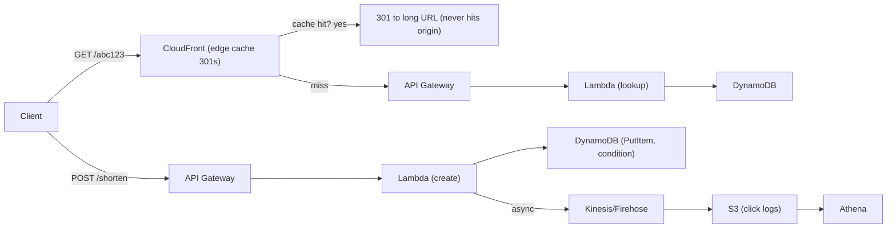
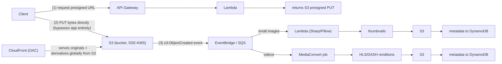
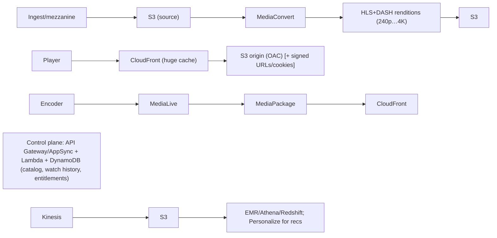
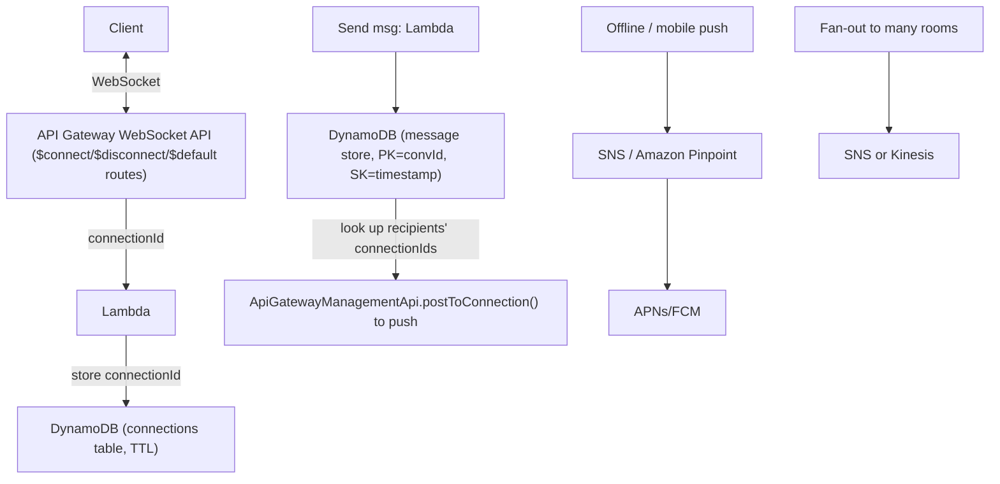
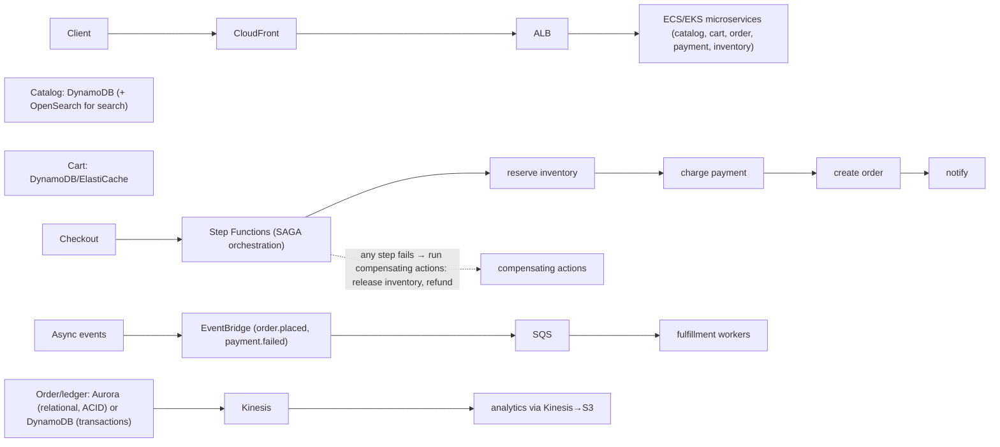
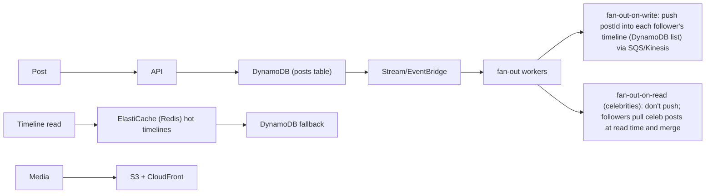
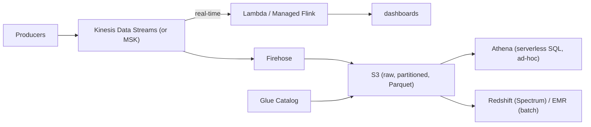

# End-to-End AWS Reference Architectures: Designing Real Systems

This topic is the capstone of the AWS System Design track. The individual service topics
(DynamoDB, S3, Lambda, Kinesis, ECS/EKS, API Gateway, CloudFront, SQS/SNS/EventBridge…)
teach you the *pieces*. Here we **assemble** them into the classic whiteboard prompts an
interviewer actually asks: "design a URL shortener," "design image/video upload,"
"design Netflix," "design a chat system," "design an order/e-commerce system," "design a
social feed," "design an analytics pipeline."

The bar in a senior/staff AWS interview is **not** "can you name services." It is: can you
reason **from requirements (scale, latency budget, consistency need, durability, budget,
team/ops maturity) to a defensible design**, and can you articulate **the trade-off of every
choice** — what you gain, what you give up, and when the alternative wins. Every section
below is layered: intuition → how the AWS services work → real-world usage → **trade-offs
and when to use what**. Memorize the numbers (limits, latency, throughput) because
interviewers probe them, and let the trade-offs drive the narrative.

A note on defaults worth stating up front (interviewers test these): **S3 has been strongly
read-after-write consistent for all operations since December 2020** (no more eventual-read
caveat). **Lambda** runs up to **15 minutes**, up to **10 GB memory**, **10 GB ephemeral
`/tmp`**, 6 MB sync / 256 KB async payload, 1000 default concurrent executions (soft).
**API Gateway** REST/HTTP have a **29-second integration timeout** (raised beyond 29 s only
by quota increase on REST regional as of 2024). **DynamoDB** items are ≤ **400 KB**; a single
partition sustains ~**3000 RCU / 1000 WCU** before you need write sharding. (An **RCU** =
Read Capacity Unit = one **strongly** consistent read of up to **4 KB/s**, or two
**eventually** consistent reads of 4 KB/s — so eventual reads are half price and strong reads
cost 2× RCU. A **WCU** = Write Capacity Unit = one write of up to **1 KB/s**; a 3 KB write
costs 3 WCU.) **Kinesis Data
Streams** shard = **1 MB/s or 1000 records/s ingest, 2 MB/s egress**. **SQS Standard** is
effectively unlimited TPS and at-least-once; **SQS FIFO** is **300 TPS (3000 with batching
of 10)** and exactly-once-processing within a dedup window.

---

## Reasoning from requirements to an AWS design

**Intuition.** Every good answer starts by converting fuzzy requirements into numbers and a
short list of forcing constraints, *then* picks services. Doing it in the other order
("I'll use Lambda and DynamoDB") is the most common failure mode.

**The method (say this out loud in the interview):**

1. **Functional requirements** — the 3–5 core use cases (create short URL / redirect;
   upload image / view thumbnail; place order / track order).
2. **Non-functional requirements + numbers** — QPS (read vs write split), payload sizes,
   p50/p99 latency budget, durability target (e.g. 11 nines), consistency need
   (strong vs eventual), retention, and cost ceiling.
3. **Back-of-envelope** — DAU × actions/day ÷ 86 400 = avg QPS; ×(5–10) for peak; storage =
   items × size × replication × growth. This decides serverless-vs-provisioned and which
   limit you hit first.
4. **Pick the data model first** (access patterns → DynamoDB single-table vs Aurora
   relational vs S3 blobs) — storage is the hardest thing to change later.
5. **Pick compute** (Lambda for spiky/event-driven, Fargate for steady containers, EC2/EKS
   for scale + control) against the latency budget and concurrency.
6. **Connect with the right integration** (sync API vs async queue vs event bus vs stream).
7. **Then** the cross-cutting concerns: caching (CloudFront/ElastiCache/DAX), resilience
   (multi-AZ default, multi-region if RTO/RPO demands), security (IAM least-privilege,
   KMS, WAF), observability, and cost.

**Serverless-first as the default posture.** For most greenfield interview prompts, lead
with a serverless design (API Gateway/AppSync + Lambda + DynamoDB + S3 + EventBridge) — it
minimizes ops burden and scales to zero. Then explicitly note **when you'd move off it**:
sustained high throughput where per-request Lambda cost > Fargate; workloads needing
>15 min or >10 GB; ultra-low-latency (sub-ms) or long-lived connections; heavy JVM/cold-start
sensitivity; or when you need fine-grained network control.

**Trade-off framing.** For each choice name the axis it trades on: *consistency vs
availability* (CAP), *latency vs cost*, *throughput vs ordering*, *ops burden vs control*,
*strong durability vs write latency*. An answer that says "DynamoDB because it scales" is
weak; "DynamoDB on-demand because writes are spiky and unpredictable, single-digit-ms with a
key-value access pattern, and I accept eventual consistency on GSIs" is strong.

---

## URL shortener on AWS

**Requirements.** Create `short → long` mapping; redirect on GET; ~**100:1 to 1000:1
read:write**; redirect p99 must be tiny (tens of ms); 11-nines durability on the mapping;
analytics on clicks is a nice-to-have.

**Architecture (serverless).**



**How the pieces work / choices:**
- **DynamoDB** table: PK = short code, attributes = long URL, ownerId, TTL. Point lookups by
  key are DynamoDB's sweet spot (single-digit-ms, and **sub-ms with DAX** if you add it).
- **Key generation:** counter-based Base62 (a monotonic ID from a sharded counter or
  Snowflake-like generator) *vs* random/hash. Counter risks a hot write partition unless you
  shard; random needs a **conditional PutItem (`attribute_not_exists`)** to avoid collisions.
- **Redirect status:** **301** is CDN/browser cacheable (skips your origin on repeat clicks)
  but you lose per-click analytics at the edge; **302** forces every click to origin so you
  can log/AB-test but costs latency and Lambda invocations. State the trade-off explicitly.
- **CloudFront** in front turns most redirects into edge hits; a **Lambda@Edge / CloudFront
  Function** can even do the lookup at the edge for ultra-low latency on hot keys.

**Failure/scale story.** DynamoDB is multi-AZ by default. On-demand capacity absorbs spikes;
a viral link is a **hot partition** on read — solve with DAX or CloudFront caching, not more
RCU. Analytics goes async (Firehose→S3→Athena) so it never slows the redirect path.

**Trade-offs.** DynamoDB vs Aurora: the access pattern is pure key lookup with no joins →
DynamoDB wins on latency, scale, and ops. Aurora would add connection-pool and scaling pain
for zero benefit. Lambda vs Fargate: redirects are spiky and short → Lambda; if you had a
constant 50k rps you'd compare Lambda cost against a small Fargate/ALB fleet.

---

## Image and video upload and processing

**Requirements.** Users upload photos/videos; system generates thumbnails / transcodes;
serve globally with low latency; store metadata; large files (GBs) must not pass through
your app servers.

**Architecture (event-driven, serverless).**



**How it works / key choices:**
- **Presigned URLs (or S3 Transfer Acceleration / multipart upload).** The client uploads
  **directly to S3**, so bytes never traverse API Gateway/Lambda — critical because API
  Gateway payload is capped (**10 MB REST**) and Lambda sync payload is **6 MB**. Multipart
  upload is required for files > 5 GB (max object 5 TB, max single PUT 5 GB).
- **S3 event → processing.** `s3:ObjectCreated` can fan out via **EventBridge** (rich
  filtering, many targets) or drop into **SQS** (buffering, retries, DLQ). Prefer
  SQS-buffered Lambda for large bursts so you don't blow Lambda concurrency.
- **Images → Lambda.** Fast, cheap, scales per-object. Constraint: **15 min / 10 GB RAM /
  10 GB `/tmp`** — fine for images, marginal for large video.
- **Video → AWS Elemental MediaConvert.** Purpose-built transcoding to **HLS/DASH adaptive
  bitrate**; handles long files, many codecs, DRM. Lambda can't transcode a 2-hour 4K film
  (time/memory). MediaConvert is job-based (async) and billed per output minute.
- **Metadata in DynamoDB.** Blob in S3, pointer + attributes (owner, dimensions, status,
  tags) in DynamoDB. Never store the blob in the DB (400 KB item cap; cost).

**Trade-offs.**
- **Lambda vs MediaConvert vs MediaLive vs Fargate/FFmpeg:** Lambda for thumbnails and short
  clips; **MediaConvert** for file-based VOD transcode; **MediaLive** for *live* streams;
  Fargate+FFmpeg when you need a custom pipeline MediaConvert can't express (control vs ops).
- **EventBridge vs SQS vs SNS off S3:** EventBridge for content-based routing to many
  consumers; SQS when you need durable buffering + DLQ + backpressure; SNS for fan-out
  pub/sub. S3→SQS gives you the smoothest handling of upload spikes.
- **Sync thumbnail vs async:** generating the thumbnail in the upload request adds latency
  and couples availability; the async S3-event pattern decouples and degrades gracefully
  (upload succeeds even if the processor is down; it retries).

---

## Video streaming platform, Netflix style

**Requirements.** Large VOD catalog; millions of concurrent viewers; adaptive quality over
varying networks; global low-latency start; content protection (DRM); minimize origin load
and egress cost.

**Architecture.**



**How it works:**
- **Adaptive bitrate (ABR):** MediaConvert produces multiple renditions + a manifest
  (`.m3u8`/`.mpd`) split into small segments (2–10 s). The player measures bandwidth and
  switches renditions per segment. This is why start-up is fast and playback adapts.
- **CloudFront is the load-bearing component.** Video is the ultimate cache-friendly
  workload: the same segments are served to millions. High cache-hit ratio protects the S3
  origin and slashes egress. Use **Origin Shield** to add a mid-tier cache and further
  collapse origin requests. Netflix's real-world answer is **Open Connect** (CDN appliances
  inside ISPs); the AWS-native analog is CloudFront + Origin Shield.
- **Protection:** **signed URLs / signed cookies** for entitlement; **DRM** (Widevine,
  FairPlay, PlayReady) via MediaPackage/SPEKE for premium content.
- **Live vs VOD:** VOD = S3 + MediaConvert; **live = MediaLive (encode) → MediaPackage
  (package/DVR/DRM) → CloudFront**.

**Trade-offs.**
- **CloudFront vs S3-direct:** never serve video straight from S3 to viewers — you'd pay full
  egress per view, hammer the origin, and get high latency. CloudFront caches at the edge.
- **HLS vs DASH:** HLS (Apple) for iOS/Safari; DASH for broad/Android/DRM flexibility.
  Produce both from one MediaConvert job.
- **Origin Shield on vs off:** on = fewer origin fetches, better cache-hit for a long-tail
  catalog, small added latency/cost per shielded request; off = simpler, fine for a hot
  short-tail catalog.
- **Cost lever:** egress dominates streaming cost. Higher cache-hit ratio and appropriate
  rendition ladder (don't ship 4K to phones) are the biggest savings.

**Worked example — where the streaming dollars go.** Say **10 M** stream views/month at an
average **2 GB** each ⇒ **20 M GB = 20 PB** of viewer egress. At CloudFront ~**$0.085/GB**
that's **~$1.7 M/month** of data transfer out — and note the compute (MediaConvert + Lambda
control plane) is a rounding error next to it. Two levers, quantified:
- **Cache-hit ratio protects the origin, not the viewer bill.** Viewer egress is paid on
  every byte regardless. What a **90%** hit ratio buys is origin offload: instead of S3
  serving all 20 PB, it serves only the **10% misses = 2 PB**, and popular segments are
  fetched from S3 *once* then reused for millions of viewers — that collapses S3 request
  counts and origin load ~**10×**, which is what actually keeps the origin from melting.
- **Rendition ladder cuts the egress volume itself.** A 2-hour movie at 4K (~18 Mbps) is
  ~**16 GB**; at 720p (~3 Mbps) it's ~**2.7 GB**. If half your 10 M views are on phones and
  you *wrongly* ship them 4K, that half costs 5 M × 16 GB × $0.085 ≈ **$6.8 M**; right-sizing
  them to 720p makes it 5 M × 2.7 GB × $0.085 ≈ **$1.15 M** — a ~**$5.6 M/month** saving from
  one ABR-ladder decision. This is why "don't ship 4K to phones" is a real cost control, not
  a slogan.

---

## Real-time chat and notifications

**Requirements.** Bi-directional low-latency messaging; presence/typing; push to offline
users; scale to millions of connections; ordered messages within a conversation.

**Architecture (WebSocket, serverless).**



**How it works:**
- **API Gateway WebSocket API** manages persistent connections and gives you a
  `connectionId`; you push with `postToConnection`. Idle connection timeout is **10 min**,
  **max connection duration 2 hours** — clients must reconnect; design for it.
- **Connection registry in DynamoDB** with a **TTL** to auto-expire stale connections.
- **Ordering:** store messages with `SK = timestamp/sequence` per conversation; DynamoDB
  keeps items sorted within a partition. For strict cross-consumer ordering use Kinesis
  (per-shard order) or SQS FIFO (per message-group).
- **Push to offline users:** SNS mobile push or **Pinpoint** (campaigns, segments, multi-
  channel: push/SMS/email).
- **Stale connection reconciliation:** when you `postToConnection` to a `connectionId` that
  has just dropped (client closed, timed out), the call returns **410 GONE** → delete that
  `connectionId` from the registry. This is the classic follow-up: it's belt-and-suspenders
  with the TTL, keeps presence accurate, and stops you pushing to ghost connections.

**Trade-offs.**
- **API Gateway WebSocket vs AppSync subscriptions vs self-managed on ECS/EKS:** WebSocket
  API = serverless, no connection servers to run, but per-message + connection-minute cost
  and the 2-hour cap. **AppSync** GraphQL subscriptions are great when the app is already
  GraphQL and you want managed real-time with auth built in. **Self-managed (ECS/EKS + ALB or
  a fleet of WebSocket servers, or IoT Core)** wins at *very* high sustained connection
  counts or when you need sub-ms and full protocol control — at the price of running the
  fleet. **AWS IoT Core** (MQTT) is a strong alternative for millions of always-on
  connections and pub/sub topics.
- **SNS vs Pinpoint for notifications:** SNS = simple, low-cost pub/sub + mobile push;
  Pinpoint = user segments, campaigns, analytics, multi-channel (more features, more setup).
- **DynamoDB vs ElastiCache for presence:** presence is ephemeral high-churn → ElastiCache
  (Redis) with pub/sub is often better than hammering DynamoDB for typing indicators.

---

## E-commerce and order systems with sagas

**Requirements.** Product catalog, cart, checkout, payment, inventory, fulfillment;
transactional correctness across services; handle payment failures/timeouts; scale for
flash sales; audit trail.

**Architecture (microservices, event-driven).**



**How it works:**
- **Saga pattern for distributed transactions.** You cannot hold a 2-phase-commit lock
  across payment + inventory + order services. Instead run a **saga**: a sequence of local
  transactions where each has a **compensating action** to undo it on failure.
  - **Orchestration (Step Functions):** a central state machine drives steps and
    compensations. Visible, easy to reason about, built-in retries/timeouts/error handling.
  - **Choreography (EventBridge):** services react to each other's events, no central
    coordinator. Looser coupling but the flow is emergent and harder to debug.
- **Idempotency + exactly-once effects:** payment must not double-charge on retry → use an
  **idempotency key**; SQS is at-least-once so consumers must dedupe. **DynamoDB conditional
  writes / transactions** or SQS FIFO help.
- **Inventory contention on flash sales:** a single hot SKU is a hot partition / row lock →
  use conditional decrements, write-sharding, or a reservation queue.

**Worked example — a saga rolling back.** Trace a checkout where step 3 fails:

```
Step 1  reserve inventory   -> OK   (SKU-42 count 10 -> 9)
Step 2  charge payment      -> OK   ($59.99 captured, txnId=pay_abc)
Step 3  create order record -> FAILS (Aurora write conflict / timeout)
```

The orchestrator (Step Functions) now runs the **compensating actions in reverse order** of
the steps that succeeded — undo the newest first:

```
Compensate 3  (nothing to undo — create-order never committed)
Compensate 2  refund payment pay_abc      ($59.99 returned)
Compensate 1  release inventory reservation (SKU-42 count 9 -> 10)
End state: customer not charged, stock restored, no dangling order.
```

Note compensations are *semantic* undos, not a transactional rollback — a refund is a new
payment event, not "un-capturing" the charge. Each compensating action must itself be
idempotent and retriable, because the orchestrator may retry it.

**Worked example — an idempotency key stopping a double charge.** The client sends
`Idempotency-Key: chk-2026-07-25-u77-o13` (deterministic per checkout attempt). The payment
Lambda does a **conditional PutItem** *before* calling the payment gateway:

```
PutItem(
  Item = { pk: "chk-2026-07-25-u77-o13", status: "charging" },
  ConditionExpression = "attribute_not_exists(pk)"
)
```

- **First delivery:** key absent ⇒ PutItem succeeds ⇒ call gateway, capture $59.99, update
  item to `status=charged, txnId=pay_abc`.
- **Retry** (SQS redelivered the same message — SQS is at-least-once): PutItem throws
  `ConditionalCheckFailedException` because the key already exists ⇒ the Lambda **skips the
  gateway call** and returns the stored `txnId`. The customer is charged **once**, not twice.

This is why "idempotency key + conditional write" is the standard answer to "SQS is
at-least-once, so how do you guarantee exactly-once payment effects?"

**Trade-offs.**
- **Aurora vs DynamoDB for orders:** Aurora for rich relational queries, multi-row ACID,
  reporting, and when the team knows SQL; DynamoDB for extreme scale, predictable key access,
  and lowest ops. Orders often land on **Aurora (financial/relational integrity)** with
  DynamoDB for cart/session. Aurora scales reads with up to 15 replicas; **Aurora Serverless
  v2** for spiky load; but connection limits and vertical write scaling are the ceiling.
- **Step Functions (orchestration) vs EventBridge (choreography):** orchestration for complex
  multi-step transactions needing visibility, retries, and compensations (checkout);
  choreography for loosely-coupled downstream reactions (send email, update analytics).
- **ECS/Fargate vs EKS:** Fargate = no node management, per-task billing, fastest to ship;
  EKS = Kubernetes ecosystem, multi-cloud portability, fine control — more ops. Pick Fargate
  unless the org standard is k8s or you need its ecosystem.
- **SQS Standard vs FIFO for order processing:** Standard = massive throughput, at-least-once,
  possible reordering/dupes; FIFO = ordering + dedup but **300 TPS (3000 batched)** ceiling.
  Use FIFO only where per-entity ordering truly matters (e.g. per-account ledger).

---

## Social feed with fan-out

**Requirements.** Users post; followers see posts in a timeline; some accounts have millions
of followers (celebrities); feed reads dominate; low-latency timeline load.

**Architecture (hybrid fan-out).**



**How it works:**
- **Fan-out-on-write (push model):** when you post, write your postId into every follower's
  precomputed timeline. Reads are cheap (one lookup) but a celebrity post triggers millions
  of writes — a **write amplification** / hot problem.
- **Fan-out-on-read (pull model):** store posts once; at read time gather posts from everyone
  you follow and merge. Cheap writes, expensive reads.
- **Hybrid (what real systems do):** push for normal users; for high-fan-out accounts, pull
  their posts at read time and merge into the pushed timeline. This is the standard answer.
- **Async fan-out** via **SQS or Kinesis** so posting stays fast and the fan-out absorbs
  spikes; **ElastiCache** holds hot timelines for sub-ms reads.

> [!KEY-TAKEAWAY]
> **Worked example — why celebrities break fan-out-on-write.** A celebrity with **50 M**
> followers makes **1** post. Push model = write that postId into 50 M timelines = **50 M
> writes** for a single post. Each timeline insert is a small item, so at 1 KB it's ~1 WCU
> each ⇒ **50 M WCU** of work. A DynamoDB partition sustains **1000 WCU/s**, so even spread
> perfectly across, say, **1000** partitions you get 1000 × 1000 = 1 M WCU/s of table
> capacity — and 50 M ÷ 1 M = **~50 seconds** of sustained max write pressure for *one*
> celebrity post (a normal user with 500 followers = 500 writes, done in the blink of an
> eye). Now multiply by dozens of celebrities posting during a live event and the fan-out
> queue backs up for minutes and followers see the post late. That is exactly why you flip
> **high-fan-out accounts to pull**: store the celeb post **once**, and merge it in at read
> time. The break-even is roughly "followers × post-rate ≫ your follower's read-rate" —
> above ~a few hundred thousand followers, pull wins.

**Trade-offs.**
- **Write-heavy fan-out vs read-heavy merge:** push optimizes the (dominant) read at the cost
  of write amplification and storage; pull optimizes writes at the cost of read latency and
  compute. The hybrid picks per-account based on follower count — say this explicitly.
- **Kinesis vs SQS for fan-out:** Kinesis for ordered, replayable, high-throughput streams
  with multiple consumers (analytics + fan-out from one stream); SQS for simple decoupled
  work distribution with per-message retries/DLQ. Kinesis shard = **1 MB/s or 1000 rec/s**;
  size shards to fan-out volume.
- **DynamoDB vs ElastiCache for timelines:** DynamoDB for durable timelines at scale;
  ElastiCache for the hot, latency-critical read layer. Usually both (cache-aside).

---

## Analytics pipeline

**Requirements.** Ingest high-volume events (clicks, IoT, logs); support both near-real-time
dashboards and batch/ad-hoc analytics; durable raw storage; cost-efficient at TB–PB scale.

**Architecture (Lambda/streaming + lake).**



**How it works:**
- **Ingest:** **Kinesis Data Streams** (ordered, replayable, per-shard 1 MB/s·1000 rec/s in,
  2 MB/s out; retention up to 365 days) or **MSK** (managed Kafka) for Kafka ecosystems /
  higher throughput / longer retention needs. **Kinesis Data Firehose** is the zero-admin
  path to S3/Redshift/OpenSearch with buffering + format conversion (to Parquet).
- **Storage (data lake):** S3 with **partitioning** (e.g. by date) and **columnar Parquet** to
  cut Athena/Redshift scan cost. Glue Data Catalog holds schema.
- **Query:** **Athena** = serverless, pay-per-TB-scanned, great for ad-hoc; **Redshift** =
  provisioned/serverless MPP warehouse for heavy, repeated BI with joins; **EMR** =
  Spark/Hadoop for custom big-data processing.
- **Real-time:** **Managed Service for Apache Flink** (formerly Kinesis Data Analytics) or
  Lambda consumers for windowed aggregations/alerts.

**Trade-offs.**
- **Kinesis vs MSK vs SQS:** Kinesis = managed, shard-based, replay, multiple consumers,
  low ops; MSK = full Kafka (ecosystem, higher throughput, longer retention) but you manage
  more; SQS = simple queue, **not** a replayable stream and no multi-consumer replay. Use a
  stream (Kinesis/MSK) when you need ordering + replay + multiple independent consumers.
- **Athena vs Redshift vs EMR:** Athena for infrequent/ad-hoc serverless SQL (cost = data
  scanned; partition + Parquet to control it); Redshift for high-concurrency repeated BI and
  complex joins on a curated warehouse; EMR for code-based Spark/ML transforms. Many pipelines
  use Athena on raw + Redshift for the serving layer.
- **Firehose vs direct Lambda consumer to S3:** Firehose is zero-ops with buffering and
  format conversion but adds up to ~60 s buffering latency; a Lambda consumer gives you more
  control and lower latency but you own batching, retries, and file sizing.
- **Parquet vs JSON/CSV in the lake:** Parquet (columnar, compressed) massively reduces
  Athena/Redshift scan cost and speeds queries; raw JSON is simpler to write but expensive to
  query at scale.

---

## Service limits and quotas that shape designs

Interviewers love "which limit does this hit first?" Know these cold:

| Service | Limit that matters | Design implication |
|---|---|---|
| **Lambda** | 15 min max, 10 GB mem, 10 GB `/tmp`, 6 MB sync / 256 KB async payload, 1000 default concurrency (soft) | Long/large jobs → Fargate/MediaConvert; big payloads → S3 + presigned; guard concurrency with reserved/provisioned |
| **API Gateway** | 29 s integration timeout; 10 MB REST payload; 10k rps default (soft) | Long ops → async (202 + poll/WebSocket/Step Functions); big uploads → S3 presigned |
| **DynamoDB** | 400 KB item; ~3000 RCU / 1000 WCU per partition; GSI eventual by default | Big blobs → S3; hot key → write-sharding/DAX/cache; design keys for even distribution |
| **SQS** | Standard: ~unlimited TPS, at-least-once, no order; FIFO: 300 TPS (3000 batched), exactly-once in dedup window; 256 KB msg; 14-day retention; 12-hour max visibility | Big payloads → S3 + claim-check; need order → FIFO but mind the TPS ceiling |
| **Kinesis Data Streams** | shard = 1 MB/s or 1000 rec/s in, 2 MB/s out; 1 MB record; up to 365-day retention | Throughput = shard count; hot shard → better partition key; many consumers → enhanced fan-out (2 MB/s each) |
| **S3** | 5 TB object, 5 GB single PUT (multipart above), 3500 PUT / 5500 GET per prefix per sec (auto-scales) | Huge files → multipart; high TPS → spread key prefixes; strong read-after-write since 2020 |
| **CloudFront** | edge caching; 30 s+ origin timeouts; Lambda@Edge/CF Functions limits | Cache-friendly content → high hit ratio; dynamic → cache policies/Origin Shield |
| **Step Functions** | Standard: 1-year max, exactly-once, full history; Express: 5-min max, at-least-once, high volume | Long sagas → Standard; high-volume short workflows → Express |

**Rule of thumb:** whenever a request could exceed **29 s** (API GW) or **15 min** (Lambda),
switch to an **async pattern** (return 202 + job id, process via SQS/Step Functions, notify
via WebSocket/SNS or let the client poll).

---

## Trade-offs and when to use what

A consolidated cheat sheet for the service-selection questions interviewers fire rapidly:

**Compute:** Lambda (spiky, event-driven, ≤15 min, scale-to-zero, per-ms cost) → Fargate
(steady containers, no server mgmt, >15 min, custom runtimes) → EKS (k8s ecosystem/portability,
most control, most ops) → EC2 (full control, GPUs, licensing, sustained cheapest with
Savings Plans). Lead serverless; move right as throughput/duration/control needs grow.

**Data store by access pattern:**

| Need | Pick | Why / trade-off |
|---|---|---|
| Key-value, extreme scale, single-digit-ms | DynamoDB | Predictable key access; no joins; eventual GSIs; hot-key care |
| Relational, joins, ACID, reporting | Aurora/RDS | SQL power; connection + write-scaling ceiling |
| Blobs / media / data lake | S3 | 11 nines, cheap, event source; not for low-latency point reads of structured data |
| Sub-ms cache / ephemeral / pub-sub / leaderboards | ElastiCache (Redis) | In-memory; not durable primary store |
| Sub-ms *in front of DynamoDB* | DAX | Write-through cache; DynamoDB-only |
| Full-text / log search | OpenSearch | Search + analytics; not a system of record |
| Graph | Neptune | Relationships; niche |
| Time-series | Timestream | Metrics/IoT; niche |

**Messaging/integration:** SQS (decouple, buffer, retries/DLQ, work queue) vs SNS (pub/sub
fan-out) vs EventBridge (event bus, content routing, SaaS/schema registry) vs Kinesis/MSK
(ordered, replayable, high-volume streaming, multiple consumers). Common combo: **SNS→SQS
fan-out** (durable per-subscriber queues) and **EventBridge** for cross-service events.

**Consistency:** DynamoDB strong reads cost 2× RCU and hit the leader (higher latency, no
cross-AZ read); eventual reads are cheaper/faster. S3 is strongly read-after-write.
Aurora replicas are eventually consistent for reads (replica lag) unless you read the writer.

**Caching layers:** CloudFront (global edge, static/cacheable) → ElastiCache (app-tier,
sub-ms, shared) → DAX (DynamoDB-specific) → in-process. Each cuts latency/origin load at the
cost of consistency (staleness) and invalidation complexity.

---

## Failure modes and resilience

**Default posture:** everything **multi-AZ** (DynamoDB, S3, Aurora Multi-AZ, ELB across AZs,
Auto Scaling across AZs). This is table stakes and mostly free architecturally.

**How designs degrade:**
- **AZ failure:** multi-AZ services ride through; single-AZ resources (one EC2, one NAT GW)
  are the weak link — spread across ≥2–3 AZs.
- **Region failure:** needs an explicit **multi-region** strategy chosen by RTO/RPO (RTO =
  how long recovery takes; RPO = how much recent data you can lose):
  backup-restore (RTO **hours**, RPO **hours** — cheapest) → pilot light (RTO **10s of
  minutes**, RPO **minutes**) → warm standby (RTO **minutes**, RPO **minutes/seconds**) →
  **active-active** (RTO **near-zero**, RPO **seconds** — DynamoDB Global Tables, Aurora
  Global Database, Route 53 failover/latency routing, S3 CRR). More availability = more cost +
  more complexity (conflict resolution).
- **Throttling / hot partitions:** DynamoDB hot key, Kinesis hot shard, Lambda concurrency
  cap → back off, shard keys, add cache, request quota increases; use SQS as a shock absorber.
- **Poison messages:** SQS/Lambda need **DLQs** and max-receive limits so one bad message
  doesn't wedge the consumer.
- **Retry storms / cascading failure:** exponential backoff + jitter, circuit breakers,
  bulkheads (isolate pools), and **cell-based architecture** to blast-radius-contain failures.

**Modern patterns to name:** serverless-first, event-driven decoupling, **cell-based /
shuffle-sharding** (partition users into independent cells so one cell's failure affects few),
idempotency everywhere, and the **claim-check pattern** (put big payloads in S3, pass a
pointer through SQS/EventBridge) to dodge message-size limits.

---

## Cost estimation and back-of-envelope

Interviewers reward candidates who reason about cost, not just correctness.

- **Serverless vs provisioned crossover:** Lambda is cheapest for spiky/low-duty-cycle load
  and scales to zero; at high, steady throughput a Fargate/EC2 fleet is cheaper per request.
  Estimate: `invocations × (duration × mem GB-s price) + per-request price` vs a fleet's
  hourly cost at target utilization.

  **Worked example — the actual break-even QPS.** Take a 200 ms, 512 MB (0.5 GB) function.
  Per invocation: compute = 0.2 s × 0.5 GB × **$0.0000166667/GB-s** ≈ **$0.00000167**, plus
  the **$0.20 per 1 M requests** = **$0.0000002** per request ⇒ ~**$0.00000187** per call.
  Now the fleet: one Fargate task at 1 vCPU / 2 GB costs ~**$0.049/hour**, and at 200 ms/req
  a single-vCPU task handles ~**5 req/s** ⇒ its per-request cost is $0.049 ÷ (5 × 3600) ≈
  **$0.00000272**. So *per request* Lambda ($1.87/M) is actually **cheaper** than a
  fully-busy Fargate task ($2.72/M) here — because this function is light. Lambda loses only
  when the fleet runs near 100% while Lambda still pays per-invoke: push duration to 1 s and
  Lambda compute alone becomes 1 × 0.5 × $0.0000166667 ≈ **$0.0000083/req = $8.3/M**, while a
  1-vCPU task now serving 1 req/s costs $0.049 ÷ 3600 ≈ **$0.0000136/req = $13.6/M** at 1 rps
  — but pack that task to ~10 concurrent 1 s requests and it drops to **~$1.36/M**, well under
  Lambda. **Takeaway:** the crossover isn't a fixed QPS — it's *utilization*. Lambda wins
  while a container would sit idle (spiky, low duty cycle); the fleet wins once you can keep
  it densely and steadily busy so its fixed hourly cost is amortized across many requests.
- **DynamoDB on-demand vs provisioned:** on-demand for unpredictable/spiky or new workloads
  (pay per request, no capacity planning); provisioned + auto scaling (or reserved capacity)
  is much cheaper for steady, predictable traffic.
- **Egress is the silent killer:** data transfer out to the internet is a top cost for media/
  streaming — CloudFront cache-hit ratio and right-sized renditions matter more than compute.
- **S3 storage classes:** Standard → Intelligent-Tiering (auto) → Standard-IA → Glacier
  (Instant/Flexible/Deep Archive) trade retrieval latency/cost for storage cost; use lifecycle
  policies for logs/raw data.
- **Athena vs Redshift cost model:** Athena bills per TB scanned (partition + Parquet to
  minimize); Redshift bills for the cluster/RPU-hours (cheaper when queries are constant).

**Quick sizing example (URL shortener):** 100 M DAU × 10 redirects = 1 B reads/day ≈ 11.6k
avg rps, ~60k peak. With a high CloudFront hit ratio, DynamoDB sees a fraction; on-demand or
DAX handles the rest. Writes (1 M/day ≈ 12 rps) are trivial. This reasoning tells you the read
path (edge cache) is where the design and money go.

---

## Common interview follow-up questions

- "Walk me from requirements to services — why each, and what would you swap under a tight
  budget / a strict-consistency requirement / a 10× traffic spike?"
- "Which service limit does this design hit first, and how do you get past it?"
- "How does this degrade during an AZ failure? A full region outage? What's your RTO/RPO and
  what does hitting a tighter one cost?"
- "Where's the hot partition / hot shard, and how do you fix it without just adding capacity?"
- "Sync vs async here — how do you handle an operation that can exceed 29 s / 15 min?"
- "Orchestration (Step Functions) vs choreography (EventBridge) for this checkout — trade-offs?"
- "How do you guarantee exactly-once payment given SQS is at-least-once?"
- "Fan-out-on-write vs on-read for the feed — and how do you handle a celebrity with 50 M
  followers?"
- "Why CloudFront in front of S3 for video, and what does Origin Shield buy you?"
- "DynamoDB vs Aurora for the order table — defend your choice."
- "Cost: where does the money go in this system and what's the biggest lever?"
- "How would you make this multi-region, and which consistency/conflict issues appear?"

## References

- AWS Well-Architected Framework and its six pillars (Operational Excellence, Security,
  Reliability, Performance Efficiency, Cost Optimization, Sustainability).
- AWS Architecture Center and AWS Reference Architecture diagrams.
- AWS Prescriptive Guidance: saga pattern, cell-based architecture, and serverless patterns.
- Amazon Builders' Library: "Avoiding fallback in distributed systems," "Timeouts, retries,
  and backoff with jitter," "Workload isolation using shuffle-sharding."
- DynamoDB developer guide (partitions, adaptive capacity, DAX, Global Tables) and the 2022
  DynamoDB paper (USENIX ATC).
- Amazon S3 developer guide (strong consistency, multipart, event notifications, storage
  classes) and S3 consistency announcement (Dec 2020).
- AWS Lambda, API Gateway (WebSocket + REST/HTTP), Step Functions, EventBridge, SQS/SNS,
  Kinesis Data Streams/Firehose, MSK, Athena, Redshift, EMR, Glue developer guides and
  Service Quotas pages.
- AWS Elemental MediaConvert / MediaLive / MediaPackage docs; CloudFront developer guide
  (Origin Shield, signed URLs/cookies, Lambda@Edge, CloudFront Functions).
- re:Invent deep-dive/advanced-design-pattern sessions (300/400-level) on DynamoDB, S3,
  serverless event-driven architectures, and building resilient multi-region systems.
