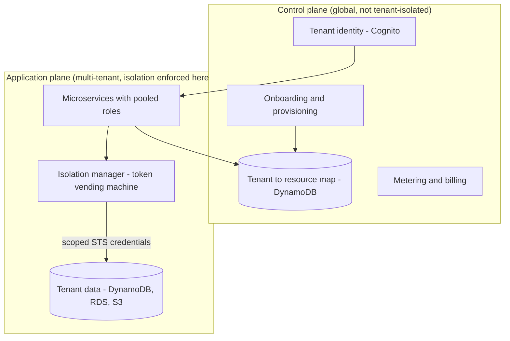
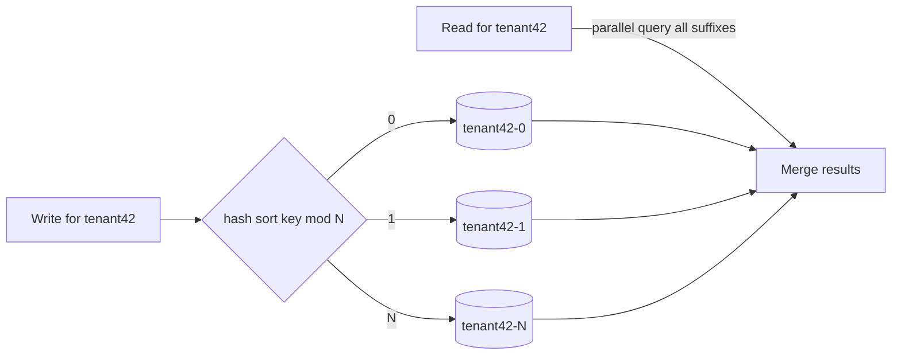
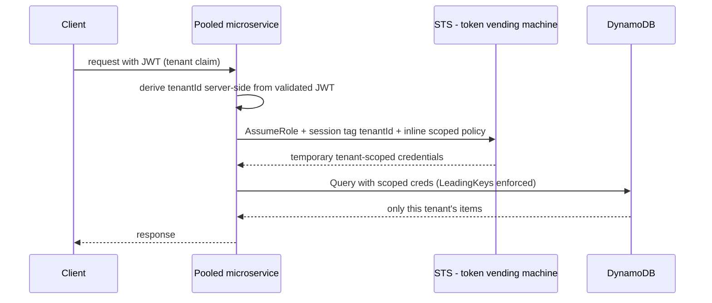

# AWS SaaS Data Partitioning and Isolation

This is the **AWS-primitive companion** to the vendor-neutral core topic
[`multi-tenancy-and-saas-isolation`](../multi-tenancy-and-saas-isolation/concepts.md)
and a sibling of [`aws-saas-multitenancy-foundations`](../aws-saas-multitenancy-foundations/concepts.md).
Those topics teach silo/pool/bridge, generic row-level security, and noisy
neighbors in the abstract. **Do not expect that theory to be re-derived here.**
This topic is about the *data tier specifically*: how you physically partition
each tenant's data on concrete AWS stores (DynamoDB, RDS/Aurora, S3, and friends)
and — the part that actually matters — how you **enforce** isolation so that a
single application bug cannot leak one tenant's data to another.

The one sentence to internalize before anything else, straight from AWS
Prescriptive Guidance and the SaaS "Tenant Isolation" deep dive:

> [!KEY-TAKEAWAY]
> **Partitioning is not isolation.** *Partitioning* is how/where you store each
> tenant's data (rows, tables, schemas, databases, clusters, accounts).
> *Isolation* is an **actively enforced, fail-closed mechanism** that prevents
> cross-tenant access. Partitioning alone buys you **zero** isolation — you must
> add an enforcement layer (an IAM condition, an RLS policy, a scoped credential)
> that denies access even when the application code has a bug. And *how* you
> choose to isolate constrains *how* you must partition: if you want IAM to
> enforce DynamoDB isolation, the tenant id **must** be the partition (leading)
> key.

---

## Partitioning is not isolation

**Intuition.** You can carefully bucket every tenant's rows behind a `tenant_id`
column and still serve Tenant A's invoices to Tenant B — all it takes is one query
that forgets `WHERE tenant_id = ?`. Partitioning organizes data; it does not
*guard* it. Isolation is the guard, and the guard has to sit somewhere that a
bug in your business logic **cannot** bypass.

**The AWS asymmetry that drives every decision on this page:** whether IAM can
enforce isolation depends on whether AWS owns the data path.

- **DynamoDB / S3:** the *only* way to reach the data is the AWS API, so **IAM can
  see and constrain every request** at the item/object level (`dynamodb:LeadingKeys`,
  `s3:prefix`). Isolation can live in infrastructure.
- **RDS / Aurora:** AWS does **not** own the SQL connection (JDBC/ODBC drivers,
  arbitrary `SELECT`s). IAM governs only *control-plane* actions (create snapshot,
  delete instance, read logs) — it **cannot filter rows**. Row isolation must come
  from the **database engine** (PostgreSQL Row-Level Security). This asymmetry is
  the single most-tested fact in this topic.

Interview-grade phrasing: *"I partitioned the data by tenant, but until I add an
enforcement mechanism that fails closed, any bug in application code is a
cross-tenant leak. On DynamoDB I get that from IAM; on RDS I have to get it from
Postgres RLS because IAM can't see the query."*

---

## Control plane versus application plane

From the *SaaS Architecture Fundamentals* whitepaper — a framing interviewers love
because it tells you *where isolation does and does not apply*:

- **Control plane** — onboarding, tenant identity, tier/config management,
  provisioning, metering/billing, aggregated metrics, the admin console. It is
  **global and NOT itself multi-tenant**: it *manages* tenants but its own tables
  don't apply tenant isolation (an admin legitimately sees all tenants). The
  **tenant→resource map** (which DB, which shard, which KMS key) lives here.
- **Application plane** — the actual multi-tenant workload where isolation,
  leading-keys, RLS, and scoped credentials live.
- **Provisioning straddles the boundary:** onboarding logic (control plane) reaches
  into the application plane to create per-tenant resources. AWS places the
  provisioning *machinery* in the application plane.

> [!TIP]
> A metadata store like DynamoDB that maps `tenant_id → {db endpoint, schema,
> shard suffixes, KMS key arn, tier}` is a **control-plane** artifact. It is read
> on every request to resolve *where* a tenant's data lives — the realization of
> the anchor article's "single instance + separate databases via a tenant map"
> sub-model.



---

## The four data-layer isolation sub-models

AWS's canonical decision matrix comes from Prescriptive Guidance
("Implementing managed PostgreSQL for multi-tenant SaaS applications"). It maps
the anchor article's four data-layer sub-models (a)/(b)/(c)/(d) onto silo /
bridge-databases / bridge-schemas / pool:

| Sub-model (AWS name) | Anchor letter | AWS structure | Best-fit use case |
|---|---|---|---|
| **Silo** | (a) full instance isolation | Separate RDS/Aurora **instance or cluster per tenant**, or **dedicated DynamoDB tables** per tenant | Full control of resource usage is key; very large or very performance-sensitive or regulated tenants |
| **Bridge — separate databases** | (b) single instance + tenant→resource map | Separate **database per tenant** inside one instance/cluster | Isolation matters; little/no cross-tenant querying |
| **Bridge — separate schemas** | (c) single DB + separate schemas | Separate **schema per tenant** in one database | Moderate tenant count and data; **preferred when you must cross-reference tenants' data** |
| **Pool** | (d) shared schema + `tenant_id` | **Shared tables**, all tenants co-mingled, `tenant_id` discriminator | Large tenant count, modest data each; best economies of scale |

The trade-off axes AWS scores in its matrix — memorize these, interviewers probe
each one:

- **Onboarding agility:** Silo = *very slow* (new instance/cluster) → Bridge-DB /
  Bridge-schema = *moderately slow* (create DB or schema) → Pool = *fastest*
  (insert a row).
- **Blast radius / availability:** Silo = tenant-scoped failure, no cross-tenant
  impact → Bridge = "all or nothing (mostly)" → Pool = "all or nothing."
- **Connection-pool efficiency:** Silo = worst (a pool per tenant) → Pool = best
  (one pool reused across all tenants).
- **Compliance fit:** Silo = strongest → Pool = weakest (pushback likely).
- **Cost / economies of scale:** Silo = worst (idle capacity, no sharing) → Pool =
  best.

> [!INTERVIEW]
> The pattern real ISVs actually ship is **tiered/bridge**: silo the handful of
> large/regulated tenants, pool the long tail of small tenants, and route by a
> tier claim in the JWT. "Silo everything" breaks at scale on account/resource
> quotas; "pool everything" fails your enterprise/compliance customers. Naming the
> mix — and *why* per tier — is the senior signal.

---

## Silo model, full instance isolation

**How it works.** Each tenant gets a dedicated resource: its own RDS/Aurora
instance or cluster, or its own set of DynamoDB tables (DynamoDB has no
"instance" — silo = tenant-id-prefixed table names like `tenant42_Orders` plus a
per-tenant IAM policy scoped to those tables). The compute can use the resource's
**instance profile / role directly** because that role only ever touches one
tenant's data — you don't need runtime credential vending in a pure silo.

**Pros:** strongest compliance story; no noisy neighbor (dedicated capacity);
trivial per-tenant cost tracking (resources map 1:1 to a tenant); smallest blast
radius (a failure is confined to one tenant); per-tenant tuning and backup.

**Cons / when it breaks:**
- **Account and resource limits cap scale.** Fine for 20 tenants, breaks at 1,000.
  DynamoDB silo tables proliferate (services × tenants); AWS explicitly recommends
  single-table design over silo tables where feasible.
- **Cost:** idle capacity per tenant, no economies of scale, no volume discounts.
- **Heavyweight onboarding automation:** every new tenant provisions
  infrastructure and per-tenant limits — slow and operationally rich.
- **Decentralized ops:** metrics/monitoring are fragmented across a large
  footprint; you must aggregate across many resources to see the whole business.

> [!WARNING]
> On DynamoDB the silo↔bridge line is "very blurry." A bridge often equals a silo
> *minus* the per-table IAM constraints. AWS recommends **keeping the IAM
> constraints even in bridge** — dropping them to save policy management is how you
> convert a partitioning boundary into a leak.

See [`aws-databases-rds-aurora`](../aws-databases-rds-aurora/concepts.md) and
[`aws-dynamodb-deep-dive`](../aws-dynamodb-deep-dive/concepts.md) for the
per-service internals.

---

## Bridge model, separate databases via a tenant map

**How it works (anchor sub-model b).** A single RDS/Aurora instance (or cluster)
hosts **one database per tenant**. A **metadata / tenant-map store** — canonically
a DynamoDB table in the control plane — maps `tenant_id → database name (and
credentials/secret arn)`. On each request the data-access layer looks up the
tenant's database and connects to it.

**Pros:** strong logical isolation (a query in Tenant A's DB physically cannot see
Tenant B's tables); one instance to operate; per-database backup/restore is clean.

**Cons / trade-offs:**
- **Connection pooling is hard:** you effectively need a pool per database, and the
  **total connection count is capped by the DB instance class** across all tenants.
  RDS Proxy helps but see the pinning caveat below.
- **Autovacuum cost at scale:** PostgreSQL starts an autovacuum worker **per
  database** after `autovacuum_naptime`; hundreds of databases → high background
  resource consumption.
- **No cross-tenant querying** without cross-database plumbing (dblink/FDW) — if
  you need analytics across tenants, prefer bridge-schemas instead.
- Onboarding is "moderately slow" (create a database, run migrations).

---

## Bridge model, separate schemas per tenant

**How it works (anchor sub-model c).** One database, **one PostgreSQL schema per
tenant** (`tenant_42.orders`). The app sets the active schema per session via
`SET search_path` / `SET SCHEMA` (or `SET ROLE` to a tenant role whose default
search_path is its schema).

**Pros:** lighter than DB-per-tenant; **the preferred model when you must
cross-reference or aggregate across tenants** (all schemas live in one database, so
a privileged admin/analytics role can query across them); one connection-pool
configuration; moderately efficient.

**Cons / trade-offs:**
- **`SET SCHEMA` / `SET ROLE` cause session pinning with RDS Proxy** — the
  connection can no longer be multiplexed/reused across tenants, which defeats the
  proxy's main benefit.
- Schema sprawl: thousands of schemas strain the catalog and migrations (every
  migration runs N times).
- "All or nothing (mostly)" blast radius — the shared instance is a single failure
  domain.

> [!TIP]
> Rule of thumb from the matrix: **need cross-tenant queries → schema-per-tenant;
> want maximum isolation with no cross-querying → database-per-tenant; want
> maximum economy at large tenant counts → pool.**

---

## Pool model, shared schema with a tenant discriminator

**How it works (anchor sub-model d).** All tenants share the same tables; every
row carries a `tenant_id` column (the discriminator). This is the cheapest, most
agile, highest-density model — and the **biggest leak risk**, because the boundary
is now a *value in a column* rather than a physical resource.

**Pros:** best economies of scale (cost scales with aggregate load, near-zero when
idle); fastest onboarding (a new tenant is a row); one connection pool, maximally
reused; centralized ops, one migration.

**Cons:** noisy neighbor; hard per-tenant cost attribution (you must instrument);
**largest blast radius** (one bad deploy or one runaway query hits everyone);
compliance pushback; and the enforcement burden — **a shared schema is only safe
with an active isolation mechanism** (RLS on Postgres; `LeadingKeys` on DynamoDB).

> [!WARNING]
> The pool model with **application-only** filtering ("we always add
> `WHERE tenant_id = ?` in the DAO") is one forgotten clause away from a breach.
> The whole point of RLS / IAM leading-keys is to make the database or the API
> **refuse** cross-tenant reads even when the app forgets.

---

## DynamoDB pooled partitioning and leading keys

DynamoDB is the crown-jewel AWS isolation pattern: because the only path to the
data is the AWS API, **IAM can enforce item-level tenant isolation**.

**Pool design:** make `tenant_id` the **partition key (the "leading key")**, then
attach an IAM policy condition on the role the compute assumes:

```json
"Condition": {
  "ForAllValues:StringEquals": { "dynamodb:LeadingKeys": ["${aws:PrincipalTag/tenantId}"] }
}
```

or with a sharded/prefixed scheme:

```json
"Condition": {
  "ForAllValues:StringLike": { "dynamodb:LeadingKeys": ["tenant42-*"] }
}
```

Effect: `GetItem`, `Query`, `BatchGetItem`, `PutItem`, `UpdateItem`, `DeleteItem`
are constrained to items whose partition key equals the tenant. The application
literally cannot read another tenant's items even if it tries.

> [!WARNING]
> **`Scan` bypasses the partition key** — `dynamodb:LeadingKeys` does not constrain
> a Scan the way it constrains Query/GetItem, so a Scan can read the whole table =
> cross-tenant leak. **Always add an explicit `Deny` on `dynamodb:Scan`** (and
> ideally `dynamodb:*` verbs you don't use) in pooled tables.

See [`aws-dynamodb-deep-dive`](../aws-dynamodb-deep-dive/concepts.md) for
partition mechanics and single-table design.

---

## DynamoDB hot tenants and write sharding

**The noisy-neighbor failure at the data tier.** A single physical partition is
capped at **3,000 RCU and 1,000 WCU** (strongly consistent; ~6,000
eventually-consistent reads). If `tenant_id` maps directly to the partition key, a
**whale tenant becomes a hot partition** → `ProvisionedThroughputExceededException`
throttling for co-located tenants, and you're forced to over-provision capacity
(higher cost for everyone).

- **Adaptive capacity** (automatic, free) isolates hot items and can push a single
  partition key up to the 3,000/1,000 ceiling; **burst capacity** retains up to
  **300 seconds** of unused capacity to smooth spikes. Neither removes the hard
  per-partition ceiling.
- **Write sharding (the real fix):** append a suffix to the tenant id
  (`tenant42-1 … tenant42-N`) — random within a range or a hash of the sort key —
  spreading a hot tenant across N partitions. Store the mapping (`ShardCount`,
  `ShardSize`, `ShardId[]`) in the **tenant lookup table**. Reads must **fan out /
  parallel-query across all suffixes and merge**. Note the real `tenant_id` may
  never appear as a bare attribute — it's embedded in the `ShardID`, and the
  `StringLike` `tenant42-*` leading-key condition still scopes it.
- **Alternatives:** on-demand capacity mode (auto-scales, pay-per-request), or
  **promote the whale to a silo table** with its own dedicated capacity.



---

## DynamoDB item collections, GSIs, and cross-tenant leaks

Data-tier gotchas that constrain a pooled tenant:

- **Item = 400 KB max.** Large tenant documents force vertical partitioning
  (split across items with sort-key prefixes).
- **Item-collection limit with an LSI = 10 GB** per partition-key value. All items
  sharing one partition key (one tenant, if tenant is the PK) cannot exceed 10 GB
  **when the table has a Local Secondary Index** → a large tenant hits write
  failures. Monitor with `ReturnItemCollectionMetrics`. (Without an LSI there is no
  10 GB collection cap.)
- **Index counts:** **20 GSIs** (default) and **5 LSIs** per table. LSIs share the
  base table's throughput; GSIs have their own.

> [!WARNING]
> **The #1 subtle DynamoDB leak: an unscoped GSI.** `dynamodb:LeadingKeys` scopes
> the *base table's* partition key. A **GSI is "global" — a Query on it spans all
> partitions across the whole base table.** If you build a GSI keyed on `email` or
> `status` (not tenant), you've created an un-scoped cross-tenant read path.
> Defenses: keep `tenant_id` as the GSI partition key, include tenant id in the GSI
> key schema, or `Deny` query actions on that index.

---

## RDS and Aurora pooled isolation with PostgreSQL row-level security

Because IAM cannot filter SQL rows, the **pool model on PostgreSQL requires
Row-Level Security (RLS)** (Prescriptive Guidance is unambiguous). RLS centralizes
isolation at the database and removes the burden from every developer — it is the
**fail-safe backstop** that catches a forgotten `WHERE tenant_id`.

**Two binding methods:**
1. Compare the tenant column to the **current DB user** — requires a DB user per
   tenant; rejected as not scalable.
2. Compare it to a **runtime session variable** the app sets each request —
   **preferred**. The app maps JWT tenant context → `SET app.current_tenant`.

Canonical setup (verbatim pattern from Prescriptive Guidance):

```sql
ALTER TABLE tenant ENABLE ROW LEVEL SECURITY;
CREATE POLICY tenant_isolation_policy ON tenant
  USING (tenant_id = current_setting('app.current_tenant')::UUID);
```

`USING` filters reads and implies a matching `WITH CHECK` for writes. **Enable RLS
on every table containing tenant data.**

> [!WARNING]
> RLS gotchas that become silent leaks: the **table owner and any role with
> `BYPASSRLS` (and superusers) bypass RLS** — the app MUST connect as a
> non-owner, non-superuser role; use `FORCE ROW LEVEL SECURITY` to apply RLS to the
> owner too. A single table where you forgot `ENABLE` is a leak. And **connection
> reuse without resetting `app.current_tenant`** serves the previous tenant's data
> to the next request.

Reference: `aws-samples/aws-saas-factory-postgresql-rls` and the blog
"Multi-tenant data isolation with PostgreSQL Row Level Security." See
[`aws-databases-rds-aurora`](../aws-databases-rds-aurora/concepts.md).

---

## Connection pooling with RDS Proxy

In the pool data model the shared connection pool is efficient (one pool, all
tenants), but the **maximum connection count is set by the DB instance class**. A
tenant spike can exhaust connections and starve everyone.

**RDS Proxy** multiplexes and queues connections in front of RDS/Aurora to prevent
exhaustion. The catch, and the recurring design tension:

> [!WARNING]
> **Session state pins the connection.** `SET ROLE`, `SET SCHEMA`, and session
> variables (`SET app.current_tenant`) cause **RDS Proxy session pinning** — the
> connection is locked to one client and can no longer be multiplexed, which
> defeats the proxy. So schema-per-tenant *and* pool-with-per-request-`SET` both
> risk pinning. Documented mitigations: minimize/avoid pinning statements, set
> variables via protocol-level parameters where possible, or (in extreme cases)
> drop the client-side pool and make direct scoped connections per request.

---

## S3 tenant data, prefix-per-tenant versus bucket-per-tenant

- **Pool (prefix-per-tenant):** one bucket, key layout
  `s3://bucket/${tenantId}/...`. Isolate with **scoped IAM / session policies**
  using `s3:prefix` conditions and resource ARNs
  `arn:aws:s3:::bucket/${tenantId}/*`, delivered via STS AssumeRole with a
  tenant-scoped policy (same dynamic-policy pattern as DynamoDB).
- **Silo (bucket-per-tenant):** a cleaner isolation boundary, but **a bounded
  per-account bucket ceiling plus per-bucket operational overhead** cap it. The
  default general-purpose-bucket quota is now **10,000 per account, raisable to
  ~1,000,000** via Service Quotas (a big jump from the old 100/1,000 limits), so
  it stretches further than it used to — but it is still a hard per-account
  ceiling, and thousands of buckets to provision/monitor/lifecycle is heavy, so
  prefix-per-tenant remains preferred for very large or fast-churning tenant sets.
- **Performance:** S3 scales **per prefix** (~3,500 PUT/COPY/POST/DELETE and ~5,500
  GET/HEAD requests per second per prefix), so many tenant prefixes actually *help*
  aggregate throughput.
- **Modern primitive: S3 Access Grants** — maps identities/tenants to
  prefix-scoped access and integrates with an IdP, a managed alternative to
  hand-rolled prefix IAM policies. Object tagging + IAM tag conditions give finer
  control.

See [`aws-storage-s3-deep-dive`](../aws-storage-s3-deep-dive/concepts.md).

---

## Enforcing isolation with scoped credentials and dynamic policies

This is the heart of **pooled compute** isolation (SaaS *Tenant Isolation
Strategies* whitepaper).

**The core problem:** a pooled Lambda/container serves *all* tenants, so its
execution role can, by construction, touch *all* tenants' data. Unlike silo, you
cannot rely on the compute's own role as the boundary. You must **narrow scope at
runtime, per request.**

**Runtime-acquired scoping ("isolation manager"):** on each request the service
asks an isolation manager for **tenant-scoped temporary credentials**, then uses
*only* those to touch data. Convention: *always acquire fresh scoped credentials
before accessing any tenant resource.*

**Two ways to produce scoped credentials:**
1. **Pre-created per-tenant IAM roles/policies** looked up at onboarding — simple,
   but **hits IAM entity limits** and doesn't scale to thousands of tenants.
2. **Dynamic policy generation ("token vending machine"):** a policy *template*
   with placeholders (table ARN, `${tenantId}` leading key) is hydrated at runtime
   with tenant context and passed as an **inline session policy to
   `sts:AssumeRole`** → transient scoped credentials. Policies live in your
   versioned pipeline, not in IAM, so you dodge entity-count limits. This is the
   recommended scalable approach (SaaS Factory "Token Vending Machine").

**ABAC / session-tag pattern (modern, and what AWS teams use internally):**
derive `tenantId` **server-side** (never trust a client claim), pass it as an **STS
session tag**, and write the IAM policy to match `dynamodb:LeadingKeys` against
`${aws:PrincipalTag/tenantId}`. Two crucial fail-closed details:

```json
{
  "Effect": "Allow",
  "Action": ["dynamodb:GetItem","dynamodb:Query","dynamodb:PutItem"],
  "Resource": "arn:aws:dynamodb:*:*:table/AppData",
  "Condition": {
    "ForAllValues:StringEquals": { "dynamodb:LeadingKeys": ["${aws:PrincipalTag/tenantId}"] },
    "Null": { "aws:PrincipalTag/tenantId": "false" }
  }
}
```

- **`Null` condition fails closed:** if the tenant tag is missing, deny → a request
  without tenant context reads *nothing* (not everything).
- Pair with an explicit **`Deny` on `dynamodb:Scan`**.



See [`aws-security-iam-deep-dive`](../aws-security-iam-deep-dive/concepts.md) for
STS, session tags, and ABAC internals.

---

## SaaS identity and tenant context propagation

Data isolation starts at login (SaaS Lens SEC-1, "SaaS Identity").

- **Bind user → tenant as a first-class construct** by injecting **custom claims
  (tenant id, tier, often the policy-store id / role)** into the **Cognito JWT** at
  registration/onboarding. This is "pooled identity."
- **Context propagation:** the JWT travels as a bearer token through every
  microservice hop, so all N services read tenant context **without a round-trip
  lookup** (no latency, no central bottleneck). The data-access layer converts JWT
  tenant context → the RLS session variable / STS session tag / DynamoDB leading
  key.
- **Cognito multi-tenancy spectrum** (most-pooled → most-siloed): custom
  attributes / user groups / custom scopes in one shared pool → **app-client per
  tenant** → **user-pool per tenant** (siloed identity, strongest) → **separate
  account/Region per tenant** (max isolation + own quota + lowest latency).

> [!WARNING]
> **Cognito quotas are per account, per Region, shared across all tenants** in a
> shared pool → a pooled identity tier can hit account-wide Cognito throttles (buy
> more quota or split across pools/accounts). The hosted-UI **session cookie is 1
> hour and not changeable**, and it authenticates across all app clients in the
> same pool — a cross-tenant sign-in concern that pushes regulated tenants toward
> per-tenant user pools or API-based sign-in.

See [`aws-security-kms-secrets-cognito-waf`](../aws-security-kms-secrets-cognito-waf/concepts.md).

---

## The catastrophic failure, cross-tenant data leak and defense in depth

AWS: *"Crossing this [tenant] boundary in any form would represent a significant
and potentially unrecoverable event for a SaaS business."* Treat this as the single
most important thing to prevent.

**Concrete leak vectors (the checklist to recite):**
1. **Forgotten tenant filter** — one missing `WHERE tenant_id = ?` (pool,
   app-enforced only).
2. **DynamoDB `Scan`** (or any op that bypasses the partition key) not explicitly
   denied.
3. **Unscoped GSI** — a global index on a non-tenant attribute reads across all
   tenants.
4. **RLS not enabled on a table**, or the app connects as owner/superuser, or
   `FORCE ROW LEVEL SECURITY` omitted.
5. **Wrong / shared cache key** — caching a result under a key that omits tenant id
   → serve Tenant A's data to Tenant B (a classic, and one IAM/RLS does *not*
   catch — the cache sits above the enforcement layer).
6. **Session/connection reuse** without resetting `app.current_tenant`, or reusing
   a broad role instead of scoped credentials.
7. **Trusting a client-supplied tenant id** (a manipulated JWT claim) instead of
   server-deriving it.
8. **Broad pooled-compute role** used directly instead of runtime-scoped
   credentials.

**Defense in depth — combine layers so no single bug is fatal:**
- **Identity:** server-derived tenant context in the validated JWT.
- **Credential:** per-request STS scoped session credentials / session tags.
- **Infrastructure (fail-closed):** IAM `LeadingKeys` + `Null` deny + `Deny Scan`
  (DynamoDB); RLS (Postgres) — *"IAM/RLS prevents the leak even if the app has a
  bug."*
- **Application:** explicit tenant filters + **tenant-aware cache keys**.
- **Detective:** CloudTrail/CloudWatch auditing, per-tenant metric anomalies.

> [!INTERVIEW]
> A great answer to "which cross-tenant failure does this design *not* prevent?"
> names the cache key and the unscoped GSI — because those sit *outside* the RLS /
> LeadingKeys enforcement plane. Interviewers use exactly these to see whether you
> understand *where* each control applies.

---

## Noisy neighbor at the data tier

- **DynamoDB:** whale tenant → hot partition (3,000 RCU / 1,000 WCU per-partition
  ceiling) → throttling for neighbors. Fixes: write sharding, adaptive capacity
  (auto), on-demand mode, promote to silo table.
- **RDS / Aurora:** shared connection-pool exhaustion (instance-class connection
  cap) + one tenant's heavy query starving CPU/IO. Fixes: RDS Proxy, read replicas,
  per-tenant query throttling, promote whale to a silo instance.
- **Tiering as protection (SaaS Lens PERF-3):** performance is a deliberate *tier
  differentiator* — you cap lower tiers even if you could serve more, to protect
  premium tenants and align cost with revenue. Tools: **API Gateway usage plans**
  (rate + burst + quota per tier), **Lambda reserved concurrency** per tier (e.g.
  Basic=100, Advanced=300, Premium=unreserved), **EKS `ResourceQuotas` /
  `LimitRanges`** per namespace with dedicated nodes (taints/tolerations) for
  premium.

See [`aws-cost-optimization-scaling`](../aws-cost-optimization-scaling/concepts.md)
and [`aws-containers-ecs-eks`](../aws-containers-ecs-eks/concepts.md).

---

## Per-tenant encryption with KMS

- **KMS key-per-tenant:** strongest crypto isolation; enables **crypto-shredding**
  (delete the tenant's key → its data is permanently unreadable, a clean answer to
  GDPR erasure and offboarding). Costs: **KMS key quotas** and per-key monthly
  cost + per-request cost; key management overhead scales with tenant count.
- **Shared key + encryption context:** cheaper; carry the tenant id in the **KMS
  encryption context** for auditable, tenant-scoped grants and CloudTrail
  attribution — but no crypto-shredding.
- **Common bridge:** key-per-tenant for premium/regulated tenants, shared key for
  the pooled tail. The tenant→key-arn mapping lives in the control-plane metadata
  store.

See [`aws-security-kms-secrets-cognito-waf`](../aws-security-kms-secrets-cognito-waf/concepts.md).

---

## Backup, restore, and export per tenant

The hidden operational cost of pooling, and a frequent interview follow-up.

- **Silo:** trivial — snapshot the tenant's instance or table; restore in place.
- **Pool:** hard — a full-table snapshot mixes all tenants, so **per-tenant
  restore requires export + filter by tenant id** (DynamoDB export-to-S3 →
  filter/reimport; or logical `pg_dump` / query filtered by `tenant_id`). A
  point-in-time restore of the whole table to fix one tenant would roll back
  everyone.
- **GDPR "delete one tenant"** in a shared table = a filtered delete (or
  crypto-shred if you used key-per-tenant), not dropping a resource. Plan for it —
  "how do you restore/erase just one tenant?" separates people who've operated pool
  from people who've only drawn it.

---

## Per-tenant cost attribution and metering

- **Silo:** easy — resources map 1:1 to a tenant; use per-account or per-resource
  billing.
- **Pool:** hard — you must **instrument**: emit tenant-tagged metrics/usage.
  Tools: **cost allocation tags** (activate in the Billing console), **AWS Cost &
  Usage Report (CUR)**, **Cost Explorer** grouped by tenant tag. Serverless: tag the
  STS session / workload identity with tenant metadata that flows to Cost Explorer
  without separate accounts.
- **Noisy-neighbor + cost detection:** alarm when a tenant's consumption exceeds
  ~**3× its historical baseline** — catch abnormal usage before it forces scaling
  that raises everyone's bill.
- **Break-even / "when to move to silo":** compute per-tenant pooled cost; when a
  tenant's pooled share exceeds what a dedicated resource would cost, offer them
  silo. This is the data-driven migration trigger.
- **Metering for billing:** AWS Marketplace Metering `UsageAllocations` supports
  per-tenant tags (limits: 5 tags, 2,500 allocation cardinality, 1 MB request).

---

## Trade-offs and when to use what

| Model | Isolation strength | Cost / density | Ops burden | Onboarding | Blast radius | Cross-tenant query | Tenant-aware app refactor | When to use |
|---|---|---|---|---|---|---|---|---|
| **Silo (instance/table per tenant)** | Strongest | Worst (idle capacity) | High, fragmented | Very slow (provision infra) | Smallest (one tenant) | Hard (cross-resource plumbing) | Low (role is the boundary) | Regulated/whale tenants; "no shared infra" contracts; small tenant count |
| **Bridge — DB per tenant** | Strong | Medium | Medium (autovacuum, N pools) | Moderate | Mostly all-or-nothing | Hard (dblink/FDW) | Low–medium (lookup + connect) | Isolation matters, no cross-tenant querying, moderate count |
| **Bridge — schema per tenant** | Strong-ish | Medium-good | Medium (schema sprawl, N migrations) | Moderate | Mostly all-or-nothing | **Easy (one DB)** | Medium (`SET search_path`) | Must aggregate across tenants; moderate count/data |
| **Pool — shared schema + `tenant_id`** | Weakest boundary (needs RLS/IAM) | Best | Low, centralized | Fastest (a row) | Largest (all tenants) | Trivial | **High (RLS + scoped creds + tenant-aware cache)** | Many tenants, modest data each; cost/agility priority |

Decision guide (turn into a flowchart in an interview):

1. **Regulated / whale / contractual "no shared infra"?** → **Silo.** Accept cost +
   slow onboarding + limited scale.
2. **Must cross-reference / aggregate across tenants?** → **Bridge-schemas**
   (Postgres, one DB).
3. **Many tenants, modest data, cost/agility priority?** → **Pool** + enforce with
   `LeadingKeys` (DynamoDB) or **RLS** (Postgres).
4. **Mixed portfolio?** → **Bridge/tiered**: silo the top, pool the tail, route by
   the JWT tier claim.
5. **Which enforcement?** DynamoDB → IAM `LeadingKeys` + STS session tags + `Deny
   Scan` + fail-closed `Null`. RDS/Aurora → **RLS session-variable method** (IAM
   can't do rows). S3 → prefix + scoped session policy / Access Grants.
6. **Pooled compute?** → runtime-scoped credentials via token-vending-machine;
   never use the broad role directly.
7. **Whale emerging in pool?** → detect via per-tenant metrics (>3× baseline) +
   break-even → migrate to silo.

---

## AWS service limits that constrain these designs

| Limit | Value | Impact on SaaS partitioning |
|---|---|---|
| AWS Organizations — accounts | Default **10**, raisable to thousands | Caps naive account-per-tenant silo |
| Organizations — OUs per org | **2,000** | Governance-model tenant grouping ceiling |
| Organizations — OU nesting depth | **5** levels | Tenant hierarchy depth |
| Organizations — SCPs per OU/account/root | **10** (SCP doc max **10,240 chars**; whitespace removed when saved via console) | Governance guardrails per group |
| Control Tower — accounts per OU | **1,000** (not adjustable); 10,000 per landing zone | Silo-account governance scale |
| VPCs per Region | **5** default (raisable) | Caps VPC-per-tenant silo |
| Subnets per VPC | **200** | Caps subnet-per-tenant |
| DynamoDB item size | **400 KB** | Vertical partitioning for large tenant docs |
| DynamoDB per-partition throughput | **3,000 RCU / 1,000 WCU** (SC); ~6,000 EC reads | Hot-tenant ceiling → write sharding |
| DynamoDB item collection (with LSI) | **10 GB** per partition-key value | Large tenant hits write failures |
| DynamoDB indexes | **20 GSI** / **5 LSI** per table | Unscoped GSI = leak risk |
| DynamoDB burst capacity | up to **300 s** unused retained | Smooths spikes, not a whale fix |
| S3 request rate | **3,500 write / 5,500 read per prefix/sec** | Prefix-per-tenant aids throughput |
| S3 buckets per account | **10,000** default / raisable to ~1M | Bounds bucket-per-tenant silo |
| Cognito quotas | per account **per Region, shared across tenants**; hosted-UI cookie **1 hr** | Pooled identity can hit account throttles |
| EventBridge | **100 buses/account/Region** (raisable), **300 rules/bus** (raisable) | Caps bus-per-tenant silo eventing |
| RDS connections | set by **DB instance class** | Pool exhaustion → RDS Proxy |

(All "default/soft" values change over time and via Service Quotas — hedge in an
interview as "default, raisable.")

---

## Common interview follow-up questions

- *Why doesn't partitioning give you isolation?* Because a value in a column (or a
  table name) is not an enforced access boundary — a bug bypasses it. You need
  RLS/IAM that fails closed.
- *Why can't IAM enforce row isolation on RDS the way it does on DynamoDB?*
  Because AWS doesn't own the SQL connection/query; IAM only sees control-plane
  RDS actions. Rows are the engine's job → PostgreSQL RLS.
- *How does `dynamodb:LeadingKeys` work, and what does it NOT cover?* It scopes
  Query/GetItem/PutItem to items whose partition key = tenant; it does **not**
  cover `Scan` or an unscoped GSI — you must `Deny` Scan and scope GSIs.
- *A whale tenant is throttling everyone on DynamoDB — walk me through the fix.*
  Confirm hot partition (3,000/1,000 ceiling), add write sharding with a
  suffix + mapping table + fan-out reads, or on-demand mode, or promote to a silo
  table.
- *How do you restore or GDPR-delete a single tenant in a pooled table?* Export +
  filter by tenant id (no whole-table PITR); or crypto-shred if key-per-tenant.
- *How do you scope a pooled Lambda that can touch all tenants' data?* Derive
  tenantId server-side → STS session tag / inline session policy (token vending
  machine) → scoped temp credentials, fail-closed `Null` condition.
- *When do you move a tenant from pool to silo?* Break-even model: pooled share of
  cost exceeds dedicated cost, or a compliance/whale trigger; detect via per-tenant
  metrics (>3× baseline).
- *What breaks first if you go account-per-tenant?* Organizations account quota /
  Control Tower 1,000-per-OU + onboarding automation + fragmented ops.
- *Schema-per-tenant with RDS Proxy — what's the catch?* `SET SCHEMA`/`SET ROLE`
  pin the connection and disable multiplexing.

---

## References

- **AWS Well-Architected SaaS Lens** (Apr 2023) — Identity & access management
  (SaaS SEC-1, SaaS Identity), Data Partitioning, Silo/Pool/Bridge isolation,
  Noisy Neighbor, Tenant Tiers, Monitoring (PERF-3 tiered throttling).
- **AWS SaaS Factory whitepaper — SaaS Tenant Isolation Strategies** (Aug 2020):
  runtime policy-based isolation, dynamic policy generation ("token vending
  machine"), DynamoDB `LeadingKeys`, PostgreSQL RLS.
- **AWS SaaS Factory whitepaper — Multi-tenant SaaS Storage Strategies:**
  Multitenancy on DynamoDB (silo table naming, tenant lookup/sharding table, hot
  partitions), Multitenancy on Amazon RDS.
- **AWS SaaS Architecture Fundamentals whitepaper:** control plane vs application
  plane.
- **AWS Prescriptive Guidance — Implementing managed PostgreSQL for multi-tenant
  SaaS applications:** partitioning models, the silo/bridge-db/bridge-schema/pool
  **decision matrix**, RLS recommendations (session-variable method, RDS Proxy
  pinning).
- **AWS Prescriptive Guidance — SaaS multi-tenant API access authorization:**
  Amazon Verified Permissions per-tenant vs shared policy store.
- **Amazon Cognito Developer Guide — Multi-tenant application best practices.**
- **Amazon DynamoDB Developer Guide** — LSI item-collection 10 GB, index counts,
  burst/adaptive capacity, write sharding, 400 KB item.
- **AWS APN Blog — "Partitioning Pooled Multi-Tenant SaaS Data with Amazon
  DynamoDB."**
- **AWS blog — "Multi-tenant data isolation with PostgreSQL Row Level Security"**
  + `aws-samples/aws-saas-factory-postgresql-rls`.
- **re:Invent SaaS talks** (ARC/SVS/SAS tracks) on tenant isolation and pooled
  storage.
- **Nagarro — "Architectural Design Patterns for AWS multi-tenancy"** (anchor;
  six-pattern isolation spectrum — used as framing, limits corroborated against
  AWS docs above).
