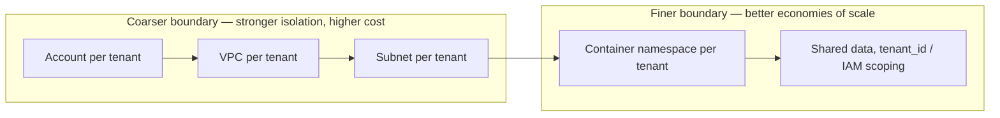
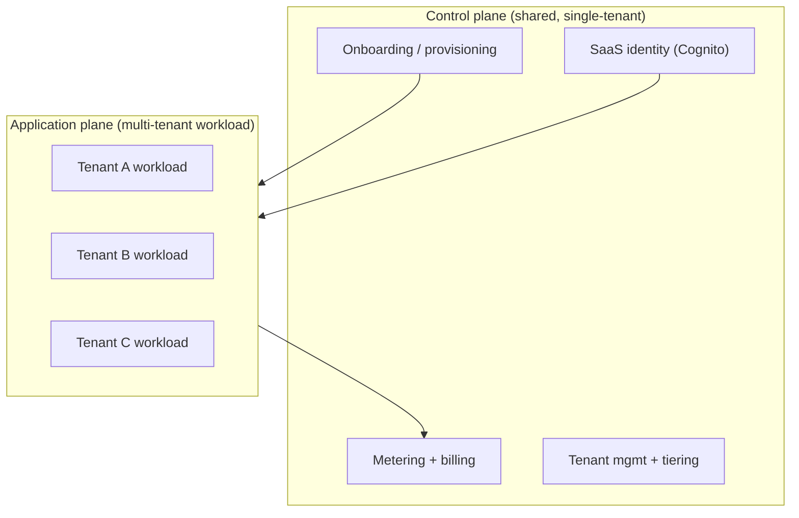
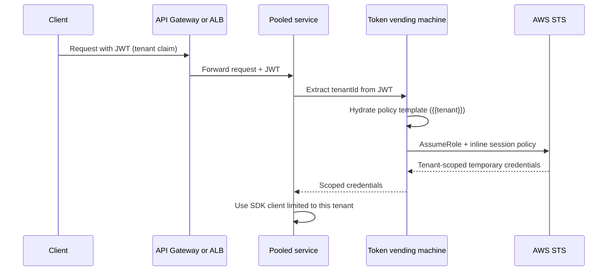

# AWS Tenant Isolation Architecture Patterns

This is the **AWS-concrete companion** to the vendor-neutral core topic
[`multi-tenancy-and-saas-isolation`](../multi-tenancy-and-saas-isolation/concepts.md)
and the foundations topic
[`aws-saas-multitenancy-foundations`](../aws-saas-multitenancy-foundations/concepts.md).
Those teach silo / pool / bridge, row-level security, and noisy neighbors in the
abstract. **Do not re-derive that theory here.** This topic expresses tenant
isolation as *concrete AWS primitives, real service quotas, and architectural
patterns*, organized around the six isolation patterns that run along the
isolation spectrum — from an account per tenant (strongest, most expensive) down
to a single shared table with a `tenant_id` column (cheapest, widest blast
radius).

Every section is built around **trade-offs**: for each isolation model, which
layer you draw the boundary at, and which AWS service or config you pick, state
what you *gain*, what you *give up*, and *when* you would choose it over the
alternative. In a SaaS interview the senior signal is treating isolation as a
per-layer, per-service, per-tier decision — not an all-or-nothing switch.

> [!KEY-TAKEAWAY]
> The "six patterns" are really *where on the stack you draw the isolation
> boundary* — account, VPC, subnet, container, or data. A real system is a
> **bridge**: you pick silo or pool **independently per layer** (compute,
> network, data, identity), **per microservice**, and **per tier**. AWS: "silo is
> not an all-or-nothing decision — apply silo to specific components and only
> absorb the challenges of silo where it's actually needed."

---

## The isolation spectrum and the per-layer bridge model

Isolation on AWS is a **spectrum**, not a binary. It runs from coarse-grained
*infrastructure* boundaries (a whole AWS account, then a VPC, then a subnet) to
fine-grained *runtime* boundaries (an IAM session policy or a Postgres row-level
security predicate inside shared infrastructure). Coarser boundaries give stronger
isolation and smaller blast radius but cost more and onboard slower; finer
boundaries give better economies of scale and faster onboarding but a wider shared
attack surface.

The six patterns below are waypoints on that spectrum:

1. **Governance model** — AWS Organizations / OUs / SCPs / consolidated billing.
2. **Account-per-tenant** — full-stack silo, one AWS account per tenant.
3. **VPC-per-tenant** — one account, network boundary per tenant.
4. **Subnet-level isolation** — one VPC, subnet plus NACL/SG per tenant.
5. **Container-layer isolation** — pooled ECS/EKS cluster, namespace/RBAC per tenant.
6. **Data-layer isolation** — pooled compute, data separated by instance/DB/table/`tenant_id`.

The interview reframe: these are not mutually exclusive whole-system choices. You
**mix** them. A typical bridge design pools compute (containers) and pools data
(shared schema) for the low-value catalog service, but silos the data layer
(RDS-per-tenant) for the billing service, and silos the *entire* account for two
regulated enterprise tenants — all under one shared control plane.

> [!INTERVIEW]
> If asked "how would you isolate tenants on AWS," never answer with one model.
> Say: "Which layer, which tier? I default to pooled compute and data, then silo
> by exception where compliance, contract, or noisy-neighbor risk demands it —
> and I enforce pooled isolation at runtime with IAM, not just network controls."

---

## Control plane versus application plane

Before choosing an isolation model, name the two planes — this is required AWS
SaaS vocabulary (SaaS Architecture Fundamentals whitepaper).

- **Control plane** — the services that **onboard, manage, operate, meter, and
  bill** tenants: onboarding/provisioning, tenant management, SaaS identity,
  metering, billing, tenant config/tiering, the admin console, and cross-tenant
  metrics/analytics. The control plane is itself **shared/single-tenant** and is
  **identical regardless of the application-plane isolation model** you pick.
- **Application plane** — the actual multi-tenant product workload. **This is
  where tenant isolation is enforced** and where tenant context is applied to
  every request.

The critical insight interviewers probe: even a fully *siloed* application plane
(an account per tenant) is only **SaaS** — as opposed to a managed-service
provider (MSP) doing one-off installs — if it is wrapped by a **shared control
plane** running **one product version** with unified onboarding, metering, and a
single operational pane of glass. Silo is a deployment choice about the
application plane, not a departure from SaaS.

---

## Governance model with AWS Organizations, OUs, SCPs, and consolidated billing

**What it is.** Not a standalone tenant-hosting pattern so much as the
*account-governance substrate* beneath account-per-tenant. Tenants (or
tenant-groups/tiers) map to member accounts organized into **Organizational Units
(OUs)**; guardrails come from **Service Control Policies (SCPs)** and **Resource
Control Policies (RCPs)**; billing is consolidated at the management account; and
cross-account resource sharing goes through **AWS RAM**.

**AWS primitives.** AWS Organizations (management/root account + member accounts),
OUs, SCPs, RCPs, consolidated billing; **AWS Control Tower** for a governed
landing zone + guardrails; **Account Factory / Account Factory for Terraform
(AFT)** for account vending; **AWS RAM** for cross-account subnet/resource
sharing; **IAM Identity Center** for workforce SSO across accounts.

**Concrete quotas that decide the design (verify against live Service Quotas —
limits drift):**

| Quota | Value |
|---|---|
| Accounts per org | default **10**, raisable up to **50,000** on qualification |
| OUs per org | **2,000** |
| Roots per org | **1** (only ever one) |
| OU nesting depth | **5 levels** under the root |
| SCPs per org | **10,000**; max **10 attached per entity**; doc size **10,240 chars** |
| RCPs | **2,000** per org; max **5 per entity** |
| `CreateAccount` rate | **~0.1 req/s (burst 3)**; only **5** concurrent creations; invites capped **20 / 24h** |
| Per-service org ceilings | Control Tower **10,000**, IAM Identity Center **7,000**, GuardDuty/Security Hub/Macie/Inspector **~10,000**, Detective **1,200**, Audit Manager **250** |

> [!WARNING]
> The real ceiling is almost never the 50,000-account Organizations limit — it is
> the **lowest per-service org limit you depend on** (e.g. Control Tower's
> **10,000**, Audit Manager's **250**). And the **account-vending rate limit**
> (~0.1/s, 5 concurrent) means account creation is minutes-to-hours and does
> **not** scale to rapid self-service onboarding of thousands of tenants.

**Trade-offs.**
- *Isolation strength:* **Highest** — an account is AWS's hardest blast-radius and
  security boundary, and SCPs cap even the root user of a member account.
- *Cost:* Loses volume discounts *at the resource level*, but consolidated billing
  still **pools Savings Plans / Reserved Instances / volume-tier discounts across
  the org** (a nuance many candidates miss). High ops overhead.
- *Blast radius:* Per-account; a compromised or misconfigured tenant account
  cannot reach another.
- *When to use:* Regulated/premium tenants; strong compliance (HIPAA/PCI/FedRAMP);
  per-tenant customization; clean per-tenant billing. Deciding constraint =
  **compliance + account/OU ceiling + onboarding speed**.
- *Failure modes:* Hitting a per-service org limit long before 50k; an SCP
  misconfiguration locking out your own automation; shared-service accounts
  (logging, networking, CI/CD) becoming a single dependency every tenant relies
  on.

See [`aws-security-iam-deep-dive`](../aws-security-iam-deep-dive/concepts.md) for
SCP evaluation logic and [`aws-networking-vpc-privatelink`](../aws-networking-vpc-privatelink/concepts.md)
for RAM subnet sharing.

---

## Account-per-tenant full silo

**What it is.** Each tenant's *entire* stack lives in a dedicated AWS account. The
strongest full-stack silo. Governance (above) is how you *manage* many such
accounts.

**AWS primitives.** Control Tower Account Factory / AFT for vending; CloudFormation
**StackSets** / CDK Pipelines / Terraform to deploy the per-account stack;
EventBridge / **PrivateLink** / VPC peering to connect the shared control plane to
each tenant account; Route 53 subdomain-per-tenant routing; **native per-account
billing** for cost attribution (no tagging required).

**Trade-offs (AWS silo pros/cons).**
- *Pros:* strongest compliance story; **no noisy neighbor**; **trivial per-tenant
  cost attribution** (the account *is* the cost boundary); **smallest blast
  radius** (a failure is contained to one tenant).
- *Cons:* **scaling** — account limits bite ("20 accounts is fine, 1,000
  undermines ops"); **cost** — idle capacity per tenant, no bin-packing, lost
  pooling efficiency; **agility** — decentralized deploys across N accounts;
  **onboarding** is heavyweight (vend an account *and* provision a full stack *and*
  configure per-account service quotas — minutes to hours); **decentralized
  monitoring** — you must aggregate logs/metrics across every account.

*Isolation:* very high. *Cost:* highest. *Ops burden:* highest. *Blast radius:*
one tenant. *Onboarding:* slowest. *Deciding constraint:* compliance / small count
of high-value tenants.

> [!TIP]
> Account-per-tenant is still SaaS (not MSP) precisely when a shared control plane
> runs **one product version** across all those accounts with unified identity,
> onboarding, metering, and ops. Drop the shared plane and you have degenerated
> into per-customer managed hosting.

---

## VPC-per-tenant isolation in a single account

**What it is.** One AWS account, **one VPC per tenant**. The *network* is the
isolation boundary. AWS calls this the "best combination of options for companies
that need a silo model" without going all the way to separate accounts.

**AWS primitives.** Route 53 subdomain-per-tenant → per-tenant VPC/ALB; Multi-AZ
VPCs; VPC peering / **Transit Gateway** / **PrivateLink** to a shared-services VPC;
**AWS RAM** to share subnets; tags on the VPC and resources for per-tenant cost.

**Concrete VPC quotas (per Region — the ones that bite):**

| Quota | Value |
|---|---|
| VPCs per Region | default **5**, raisable to "hundreds" (raises IGWs per Region by the same amount) |
| Subnets per VPC | **200** |
| Route tables per VPC | **200**; routes per table default **50** (raisable to 1,000) |
| Network ACLs per VPC | **200**; **20 rules** each (raisable to 40 in / 40 out) |
| Security groups per Region | **2,500**; **60 inbound + 60 outbound rules** each |
| SGs per ENI | **5** (up to 16); rules × SGs-per-ENI ≤ **1,000** |
| IPv4 CIDR blocks per VPC | **5** (up to 50); NAU **64,000** per VPC |

**Trade-offs.**
- *Isolation:* high (network isolation, per-tenant SGs/NACLs/route tables).
- *Cost:* better than account-silo — **shares account-level discounts and gives
  better Reserved-Instance / Savings-Plan utilization** because reservations live
  in one account and float across tenant VPCs.
- *Ops burden:* medium-high, but easier than account-silo because limits and
  monitoring are centralized in one account.
- *Blast radius:* per-VPC / per-tenant.
- *Deciding constraint:* the **VPC-per-Region ceiling** — a few hundred VPCs is
  realistic; beyond that, move to multi-account (account-per-tenant) or pool.
- *Failure modes:* hitting the VPC/Region cap; **CIDR exhaustion and overlapping
  CIDRs** breaking a peering mesh; Transit Gateway / peering complexity connecting
  N tenant VPCs to shared services; a NAT gateway cost per VPC that adds up fast.

> [!WARNING]
> A peering **mesh** of N tenant VPCs to shared services grows painfully, and VPC
> peering is non-transitive. Use a **Transit Gateway** hub, or PrivateLink for
> service-level exposure, rather than N×N peering. Overlapping tenant CIDRs make
> peering impossible — allocate non-overlapping CIDR space up front.

---

## Subnet-level isolation in a single VPC

**What it is.** One account, **one VPC**, each tenant in its own subnet(s), with
isolation enforced by route tables, **NACLs**, and **security groups**. AWS
explicitly states this is **not recommended as a preferred model**.

**AWS primitives.** Per-tenant public/private subnets, NACLs, SGs, route tables.
No VPC peering needed since everything is in one VPC.

**Trade-offs.**
- *Pros:* no peering to manage; shared VPC-level services reduce cost; fine for a
  *small, fixed* tenant set.
- *Cons:* **NACL/SG rule sprawl** — NACLs cap at **20 rules** (max 40 in / 40 out),
  SGs at 60 rules; managing per-tenant rule sets becomes unwieldy fast. Worse,
  **shared VPC-wide settings — DHCP option sets, route propagation, VPC-level
  config — affect ALL tenants**, which weakens isolation and widens the blast
  radius for any config change. Subnets cap at **200 per VPC**.

*Isolation:* medium (weaker than VPC-silo because the VPC control plane is shared).
*Cost:* lower than VPC-silo. *Ops burden:* high per-tenant rule management (low
only at small scale). *Blast radius:* a VPC-level config change hits everyone.
*Deciding constraint:* small tenant count only — **avoid at scale** per AWS
guidance.

> [!INTERVIEW]
> If a candidate proposes subnet-per-tenant for a large fleet, the follow-up is:
> "How do you change the DHCP option set or a VPC-wide route without affecting all
> tenants?" You cannot — that shared VPC control plane is exactly why AWS deprecates
> this model at scale.

---

## Container-layer isolation with ECS and EKS

**What it is.** A **pooled** compute cluster with logical tenant separation via
orchestrator constructs. The main "pool-compute" pattern. Cheap and dense, but the
security burden is real.

**Key EKS reality (from the EKS best-practices guide).**
- **Kubernetes is a single-tenant orchestrator** — one shared control plane; **the
  cluster is the only strong security boundary.** Namespaces + RBAC create only the
  *semblance* of multi-tenancy ("soft multi-tenancy").
- **Soft multi-tenancy** = Namespaces + RBAC (Roles/RoleBindings) +
  **NetworkPolicies** + **ResourceQuota / LimitRange** + Pod priority/preemption
  (premium tenants preempt lower tiers).
- **Namespaces alone are insufficient:** they are globally scoped (a tenant who can
  view one can enumerate all), and by default **all pods can talk to each other**
  and can query CoreDNS for every service. NetworkPolicies need an engine
  (**Calico / Cilium**; the VPC CNI now supports Kubernetes NetworkPolicies).
- **Pods from different tenants share a node by default** — a host compromise
  exposes all Secrets/ConfigMaps/volumes on that node plus kubelet impersonation
  and lateral movement. Mitigate with node affinity + taints/tolerations
  ("**sole-tenant nodes**"), which is costly and complex at many tenants.
- **Per-pod AWS-credential isolation:** **IRSA (IAM Roles for Service Accounts)**
  and **EKS Pod Identity** give per-workload temporary AWS credentials.
- **Hard-ish isolation:** **EKS Fargate** (sandboxed pods), Firecracker microVMs,
  Kata containers, **Bottlerocket** hardened OS; SELinux/seccomp/AppArmor security
  contexts. **Admission engines** OPA/Gatekeeper and Kyverno enforce node affinity,
  tolerations, and Pod Security.
- **ECS:** silo = a separate cluster per tenant; its namespace-style logical
  separation is weaker than EKS.
- **Hard multi-tenancy = cluster-per-tenant:** strongest, but pays a control-plane
  cost per cluster with no compute sharing → fragmentation and underutilization.

*Isolation:* medium (soft) to high (sole-tenant nodes / Fargate sandbox /
cluster-per-tenant). *Cost:* low/efficient (bin-packing shared nodes). *Ops
burden:* medium — cheap to extend but the security work is real. *Blast radius:*
**node-level** (a shared worker node compromise) — wider than VPC-silo; plus
cross-namespace traffic risk. *Onboarding:* fast (create namespace + RBAC + quota).
*Deciding constraint:* trust level of tenant code + regulatory needs.

> [!WARNING]
> Network SGs and NetworkPolicies alone are **not** tenant isolation in a pooled
> cluster. Pods still run with node/role credentials unless you scope AWS access
> per pod (IRSA / Pod Identity) and per request (see runtime IAM scoping below). A
> node compromise defeats namespace boundaries entirely.

**Serverless note.** Lambda silo = a per-tenant function + per-tenant execution
role (unwieldy at 1,000 tenants, hits Lambda limits — good only for a premium
tier). Lambda pool = one shared function that **assumes tenant-scoped credentials
at runtime** (next section).

See [`aws-containers-ecs-eks`](../aws-containers-ecs-eks/concepts.md) for
EKS/ECS depth.

---

## Data-layer isolation on AWS

Pooled compute with the **data** layer separated to whatever degree the tenant
requires. Full depth lives in the data-partitioning / storage topics — this is the
AWS summary and cross-reference.

| Nagarro sub-model | AWS realization | Silo/Pool |
|---|---|---|
| (a) Full instance isolation | RDS/Aurora instance per tenant; DynamoDB table-per-tenant + per-table IAM | Silo |
| (b) Single instance, separate DBs | One RDS instance, DB/schema per tenant; **DynamoDB tenant-map store** | Silo-ish / bridge |
| (c) Single DB, separate tables/schemas | Shared instance, table- or schema-per-tenant (Postgres schemas) | Bridge |
| (d) Shared schema + `tenant_id` | One table, tenant discriminator; **Postgres RLS**; **DynamoDB partition key = tenant** | Pool |

**Key AWS data facts.**
- **DynamoDB:** item max **400 KB**; physical-partition ceilings **~3,000 RCU /
  1,000 WCU** and ~10 GB per partition → using `tenant_id` as the partition key
  creates **hot partitions** for large tenants; fix with a **tenant-lookup table +
  secondary sharding** or write-sharding suffixes. IAM
  **`dynamodb:LeadingKeys`** condition enforces pooled item isolation. Default
  40,000 RCU/40,000 WCU per table; **2,500 tables/account** (raisable to 10,000,
  then multi-account) → table-per-tenant silo does not scale past ~10k tenants.
- **RDS/Aurora:** connection limits scale with instance memory → use **RDS Proxy**
  for connection pooling in the pooled model; **Postgres Row-Level Security**
  (`CREATE POLICY ... USING (tenant_id = current_setting('app.current_tenant'))`)
  for pool isolation — but RLS is *app-enforced* and bypassable by a DB superuser
  or a misconfiguration.
- **S3:** bucket-per-tenant (silo) or **prefix-per-tenant + IAM `s3:prefix`
  conditions** (pool); **S3 Access Grants** / access points to scale.
- **Aurora Limitless** / **Serverless v2** for pooled scale.

*Deciding constraint:* compliance + tenant count + data-size skew. See
[`aws-dynamodb-deep-dive`](../aws-dynamodb-deep-dive/concepts.md) and
[`aws-databases-rds-aurora`](../aws-databases-rds-aurora/concepts.md).

---

## Runtime IAM isolation, token vending, and tenant context

The mechanics that make pooled models (containers, data) actually *safe* — this is
what separates a senior answer from a junior one. **Network controls (SG/VPC) are
not tenant isolation in a pool model.**

**The problem.** Pooled compute runs with a *broad* role that can touch all
tenants' resources. Unlike a silo (which inherits isolation from its instance
profile/account), a pool must **narrow permissions at runtime, per request.**

**Token Vending Machine (TVM) flow.**

- The request carries a **JWT with a tenant claim** → a JWT manager extracts the
  tenant → the tenant is injected into a **policy template** (Mustache-style
  `{{tenant}}` placeholders for table, bucket, prefix) → the hydrated policy is
  passed as an **STS `AssumeRole` session (inline) policy** → you get **temporary
  credentials scoped to the intersection** of the role's permissions and the
  session policy → use them with any SDK client.
- **Dynamic policy generation** avoids per-tenant *static* IAM policies (which hit
  IAM limits and are unmanageable at scale). Policies become transient templates
  versioned in your own pipeline.
- Concrete conditions: DynamoDB
  `ForAllValues:StringEquals dynamodb:LeadingKeys [{{tenant}}]`; S3
  `StringLike s3:prefix [{{tenant}}/*]`.
- Delivered as a **Lambda layer / shared library**; a non-JWT alternative is a
  reverse proxy (NGINX/Kong) that injects a tenant header.

> [!WARNING]
> **Hard constraint: an inline STS session policy is capped at 2,048 characters.**
> Exceeding it means the role is used in too many contexts — split into
> **per-microservice roles** so each session policy stays small. This is a common
> expert-level gotcha.

See [`aws-security-iam-deep-dive`](../aws-security-iam-deep-dive/concepts.md) for
STS session-policy semantics.

---

## SaaS identity, tenant routing, and onboarding automation

**SaaS identity.** Bind the **tenant claim into the JWT**. **Pooled identity** =
one Cognito user pool with a tenant attribute on each user; **silo identity** = a
user pool per tenant (bounded by Cognito user-pool and app-client quotas, so it
does not scale to thousands). All downstream isolation, routing, and metering key
off the tenant claim.

**Tenant routing / context propagation.**
- *Silo routing:* Route 53 **subdomain-per-tenant** → the tenant's dedicated
  VPC/ALB/stack.
- *Pool routing:* inspect the JWT at API Gateway / ALB / reverse proxy and inject a
  **tenant header** that flows through every downstream call. The tenant context
  must propagate on *every* service hop or isolation and metering break.

**Onboarding / provisioning automation.** Frictionless and automated (self-service
or provider-managed): provision identity + a tenant record + (in silo) infra via
IaC. **Onboarding cost is proportional to isolation coarseness** — a namespace is
seconds, a VPC is minutes, an account is minutes-to-hours plus quota configuration.
Factor this into any self-service onboarding SLA.

See [`aws-security-kms-secrets-cognito-waf`](../aws-security-kms-secrets-cognito-waf/concepts.md)
for Cognito depth and
[`aws-api-layer-apigateway-appsync`](../aws-api-layer-apigateway-appsync/concepts.md)
for API-Gateway routing.

---

## Tier-based throttling, metering, and per-tenant cost attribution

Isolation, tiering, throttling, and cost must be designed together.

**Tier-based throttling.**
- **API Gateway usage plans + API keys** give per-tenant/per-tier **rate + burst +
  quota** (requests per day/week/month). Throttle hierarchy: per-client (usage
  plan) → per-method/stage → per-account → AWS Regional. Account-level default
  steady-state is **~10,000 RPS / 5,000 burst** per Region (adjustable). All limits
  are best-effort.
- **Lambda reserved concurrency** per tier (e.g. Basic = 100, Advanced = 300,
  Premium = unreserved) caps lower tiers and protects premium.
- **EKS ResourceQuota / LimitRange** + Pod priority per namespace/tier.

**Per-tenant cost attribution (SaaS COST 2).**
- *Silo:* native per-account billing, or **cost allocation tags** on VPCs/resources.
- *Pool:* you must **instrument the application to emit per-tenant consumption
  metrics** (CloudWatch EMF, tenant-tagged), aggregate each tenant's percentage of
  consumption, then correlate with the **AWS Cost and Usage Report (CUR)** to derive
  cost-per-tenant. Infrastructure billing alone cannot attribute pooled cost.

> [!TIP]
> Classic finding once you attribute cost: the **Basic tier (lowest revenue)
> consumes the largest share of cost** — a signal your tiering, throttling, or
> pricing is broken. Cost-per-tenant instrumentation exists to keep cost tracking
> revenue.

See [`aws-cost-optimization-scaling`](../aws-cost-optimization-scaling/concepts.md).

---

## Noisy neighbor mitigation on AWS

In pooled models one tenant's load can degrade another's. AWS-concrete mitigations:
- **API Gateway usage-plan throttling/quotas** and **Lambda reserved concurrency**
  to cap per-tenant/per-tier consumption.
- **RDS Proxy** to bound connection contention; **DynamoDB adaptive capacity +
  write-sharding** to spread hot partitions.
- **EKS ResourceQuota/LimitRange + Pod priority** so premium tenants preempt basic.
- **Sole-tenant nodes** (affinity + taints) for hot or sensitive tenants.
- **Bridge-promote** a chronically noisy or high-value tenant to a siloed tier
  (own VPC or account).

The bridge model is the durable answer: pool by default, and promote specific
tenants to silo when they justify it.

---

## Trade-offs and when to use what

Master comparison of the six patterns (add **runtime IAM scoping** as the
enforcement layer that makes patterns 5 and 6 *safe*):

| # | Pattern | Boundary | Isolation | Cost efficiency | Ops burden | Blast radius | Onboarding | Cost attribution | Deciding constraint |
|---|---|---|---|---|---|---|---|---|---|
| 1 | Governance / Organizations | Org/OU + SCP | Highest (guardrails) | Med (billing pools discounts) | High | Per-account | Slow (vend) | Native per-account | Compliance + account/OU ceiling |
| 2 | Account-per-tenant | AWS account | Very high | Lowest | Highest | 1 tenant | Slowest | Native (easiest) | Compliance / few high-value tenants |
| 3 | VPC-per-tenant | VPC (network) | High | Medium | Med-high | Per-VPC | Medium | Tags | **5 → hundreds VPCs/Region** |
| 4 | Subnet-per-tenant | Subnet + NACL/SG | Medium | Med-high | High (rule sprawl) | VPC-wide config hits all | Medium | Tags (harder) | Small count only (not recommended) |
| 5 | Container namespace | Namespace/RBAC | Med → high (sandbox) | High | Medium | Node-level | Fast | Instrumented | Tenant-code trust / regulatory |
| 6 | Data-layer pool | `tenant_id` / LeadingKeys / RLS | Lowest (app-enforced) | Highest | Medium | All tenants | Fastest | Hardest (instrument) | Data-size skew / compliance |

**When to pick which.**
- *Regulated/premium, few tenants* → account-per-tenant under a governance org.
- *Need a silo but hundreds of tenants in one account* → VPC-per-tenant (watch the
  VPC/Region ceiling).
- *Small fixed tenant set, cost-sensitive* → subnet-level (only if you accept the
  shared-VPC blast radius and rule sprawl; AWS does not recommend it at scale).
- *Many tenants, cost-driven, tenant code you trust* → pooled containers + pooled
  data, with runtime IAM scoping, sole-tenant nodes for exceptions.
- *Most real SaaS* → a **bridge**: pooled default, siloed by exception per layer,
  service, and tier.

---

## Decision guide

1. **Start pool, silo by exception.** Default to pooled compute + data for
   economies of scale; carve out silo only where compliance, noisy-neighbor, or
   contract demands it (bridge + tier-based isolation).
2. **Compliance/regulated tenant?** Silo the affected layer(s): account-per-tenant
   (strongest) or VPC-per-tenant, offered as a premium/private pricing tier running
   the same product version.
3. **Tenant count drives the coarse-grained choice.** Dozens of siloed accounts is
   fine; hundreds → VPC-per-tenant or multi-account; thousands+ → you must pool.
   Watch the real ceilings: Control Tower **10k** accounts, **5 → hundreds**
   VPCs/Region, DynamoDB **10k** tables/account.
4. **Never rely on network constructs alone for pool isolation.** Enforce with
   runtime IAM scoping (TVM / STS session policies ≤ **2 KB**), Postgres RLS, or
   DynamoDB `LeadingKeys`.
5. **Match isolation granularity per microservice and per layer** — e.g. pooled
   compute + siloed data for the billing service; pooled everything for the
   catalog service.
6. **Tie tiering to isolation + throttling + cost.** Premium = silo / sole-tenant /
   higher throttle; Basic = pool / reserved-concurrency cap. Verify cost-per-tenant
   via CUR + instrumentation so cost tracks revenue.
7. **Onboarding cost is a first-class trade-off.** Coarser isolation = heavier,
   slower onboarding automation; factor it into self-service SLAs.

---

## Common interview follow-up questions

1. **"How do you isolate tenants at the data layer in a *pooled* DynamoDB table?"**
   IAM `dynamodb:LeadingKeys` condition on the partition key + a token-vended
   session policy so the pooled service can only touch its own tenant's items.
2. **"Your per-tenant-VPC design is at 300 tenants and growing — what breaks
   first?"** The VPC-per-Region quota (default 5, raisable to hundreds, not
   thousands) and CIDR/peering-mesh management. Move to multi-account or pool.
3. **"Account-per-tenant vs pooled shared-schema — the primary trade-off?"**
   Isolation/blast-radius/compliance and trivial cost attribution vs. economies of
   scale, fast onboarding, and operational leverage. Everything else follows.
4. **"Why isn't a namespace a security boundary in EKS?"** Namespaces are globally
   scoped and pods share nodes by default; the *cluster* is the only strong
   boundary. You need NetworkPolicies, sole-tenant nodes/Fargate, and per-pod IAM.
5. **"How do you attribute cost per tenant in a pooled model?"** Instrument the app
   to emit tenant-tagged consumption metrics, aggregate percentage of consumption,
   and correlate with the CUR — infra billing alone can't do it.
6. **"What's the character limit on an STS inline session policy, and why care?"**
   2,048 chars — it forces you to split into per-microservice roles for dynamic
   tenant-scoped policies.
7. **"Is account-per-tenant still SaaS?"** Yes, if wrapped by a shared control
   plane running one version with unified onboarding/metering/ops; otherwise it's a
   managed-service provider model.
8. **"Which limit caps a governed multi-account SaaS before the 50k Organizations
   ceiling?"** The lowest per-service org limit you use — often Control Tower
   (10k), or Audit Manager (250).

---

## References

- **AWS Whitepaper — SaaS Tenant Isolation Strategies** (silo/pool/bridge,
  full-stack isolation, silo compute, runtime IAM policy-based isolation, dynamic
  policy generation + Token Vending Machine, scaling IAM-policy limits).
- **AWS Well-Architected SaaS Lens** (tenant isolation, full-stack isolation, tier-
  based isolation, onboarding, tenant tiers, monitoring, cost-per-tenant / CUR
  correlation).
- **AWS Whitepaper — SaaS Architecture Fundamentals** (control plane vs application
  plane; SaaS terminology).
- **AWS Whitepaper — SaaS Storage Strategies / Multitenancy on DynamoDB**
  (table-per-tenant + IAM, tenant-lookup/sharding table for hot partitions).
- **AWS APN Blog — "Isolating SaaS Tenants with Dynamically Generated IAM
  Policies"** (TVM flow, STS AssumeRole session policies, Mustache templates,
  `LeadingKeys` / `s3:prefix`, the 2,048-char inline-policy limit).
- **Amazon EKS Best Practices — Tenant Isolation & Multi-Account Strategy**
  (single-tenant orchestrator, soft vs hard multi-tenancy, sole-tenant nodes,
  Fargate/Firecracker, IRSA vs EKS Pod Identity).
- **AWS Organizations / Amazon VPC / Amazon DynamoDB / API Gateway Service Quotas**
  (current documented limits — re-verify against live Service Quotas).
- **Nagarro (Shantanu Sharma) — "Architectural Design Patterns for AWS
  multi-tenancy"** (the six-pattern framing).
- **re:Invent SaaS talks** (ARC/SVS/SAS tracks) on tenant isolation and SaaS on
  serverless/EKS.
