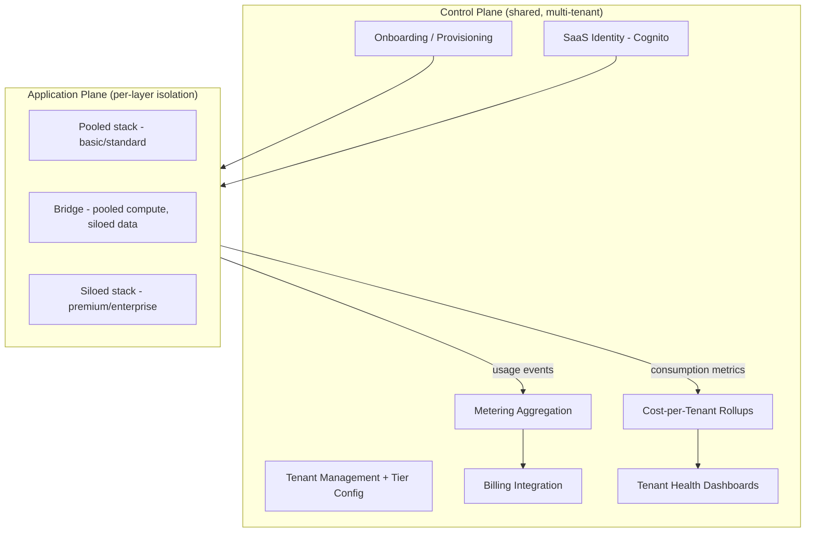
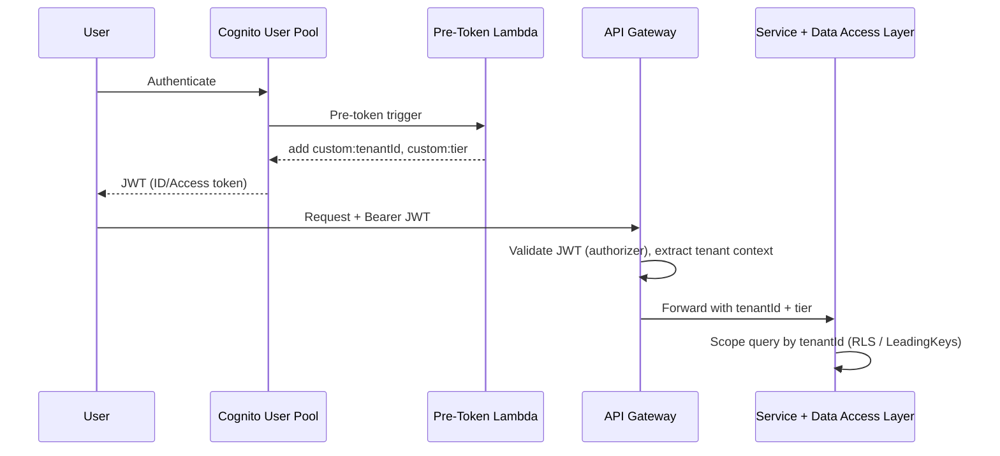
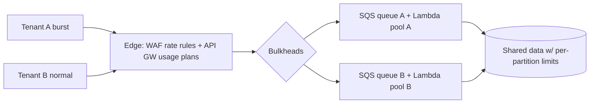
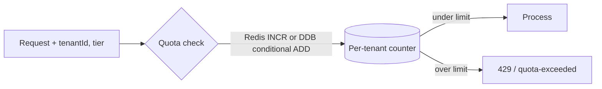
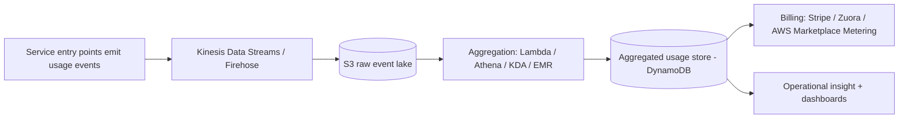

# AWS SaaS Metering, Tiering, Throttling and Cost-per-Tenant

This is the **AWS-specific companion** to the vendor-neutral core topic
[`multi-tenancy-and-saas-isolation`](../multi-tenancy-and-saas-isolation/concepts.md)
and a sibling to
[`aws-saas-multitenancy-foundations`](../aws-saas-multitenancy-foundations/concepts.md).
Those topics teach *isolation* — silo / pool / bridge, row-level security, noisy
neighbors — in the abstract and in AWS primitives. This topic answers the next
question a real SaaS business must answer: **how do you operate a multi-tenant
system on AWS fairly (no tenant starves another) and profitably (you know what
each tenant costs and charge accordingly)?** Everything here is expressed in
concrete AWS services and, above all, in **trade-offs**.

The single mental model to anchor everything is the **control plane vs
application plane** split. Metering, tiering config, throttling policy, cost
rollups, onboarding, and identity are **control-plane** capabilities — they are
themselves multi-tenant and cross-cutting, and are *the same regardless of
whether the application plane is siloed or pooled*. The **application plane** is
the running product where per-layer isolation is enforced. Interviewers reward
candidates who keep these two planes cleanly separated.

> [!KEY-TAKEAWAY]
> One construct powers isolation, routing, throttling, metering, and cost
> attribution **simultaneously**: the **tenant context** derived from a SaaS
> identity token (a JWT carrying `tenantId` and `tier`). Inject it at the edge,
> propagate it through every service call, log line, metric dimension, and
> data-access call. If you can only remember one thing, remember: *tenant context
> is the currency of multi-tenant operations on AWS.*

---

## Control plane versus application plane

The **control plane** is the shared, multi-tenant management layer that exists
once for the whole SaaS: tenant onboarding and provisioning, tenant management,
SaaS identity, tiering configuration, metering aggregation, billing integration,
per-tenant cost rollups, and tenant health dashboards. Critically, the control
plane is *the same whether your application plane is siloed or pooled* — it is
never siloed per tenant; it operates on all tenants at once.

The **application plane** is the product that serves tenant traffic. This is
where isolation (silo/pool/bridge) is chosen **per layer** — compute, network,
data, identity — and often per tenant tier.

> [!INTERVIEW]
> A common trap: the interviewer asks "how do you meter usage in a siloed
> (account-per-tenant) model?" The answer is *identical in shape* to the pooled
> case — metering is a control-plane concern. What changes is the **cost
> attribution** side (siloed = trivial via account boundary; pooled = hard, needs
> apportionment). Separating the planes lets you answer crisply.

**Trade-off.** Building a real control plane is upfront investment that a
single-tenant MVP does not need. But without it you cannot onboard tenants
self-serve, cannot bill on usage, and cannot answer "which tenant is
unprofitable?" — so you lose the operational leverage that justified SaaS in the
first place. Build the control plane as soon as you have more than a handful of
tenants.

---

## Tenant context and SaaS identity with Cognito and JWT claims

**Tenant context** = the set of attributes that identify *which tenant* a request
belongs to: `tenantId`, `tier`, sometimes `role`. On AWS the canonical source is
a **SaaS identity token** — a JWT minted at sign-in.

**Pattern (pooled identity).** Bind users to a tenant, then mint a JWT with
**custom claims** (`custom:tenantId`, `custom:tier`). With Amazon Cognito you use
a **Pre Token Generation Lambda trigger** to inject or augment these claims at
sign-in. Downstream services read the claim (never trust a client-supplied header)
to enforce isolation, route, throttle, meter, and attribute cost.

**Cognito facts that constrain design (verified 2026-07):**

- **Users per user pool: 40,000,000 default** (adjustable) → one *pooled* user
  pool scales to a huge tenant base; you do **not** need a pool per tenant for
  capacity.
- **User pools per Region: 1,000 default, 10,000 max** → **pool-per-tenant does
  NOT scale** past ~1k–10k tenants. This is a hard ceiling for a "siloed identity"
  design.
- **App clients per user pool: 1,000 default → 10,000 max.** **Groups per pool:
  10,000** (hard); **groups per user: 100.**
- **Token validity:** ID/Access **5 min–1 day**; Refresh **1 hour–3,650 days.**
- **Rate quotas are per-account, per-Region, pooled across all pools**, by
  category: `UserAuthentication` **120 RPS**, `UserCreation` 50 RPS,
  `UserFederation` 25 RPS, `UserRead`/`UserToken` 120 RPS.
  `RespondToAuthChallenge` gets **3× the UserAuthentication quota.**
- **Pre-token-generation combined claim changes: 5,000** (adjustable).

> [!WARNING]
> Do **not** call Cognito on every request to check the user — you will hit the
> per-category RPS throttles (e.g. 120 RPS `UserRead`). **Validate the JWT locally
> at the edge and cache it.** Also, do not store frequently-changing attributes in
> Cognito custom attributes; keep them in an external store (DynamoDB) and look
> them up, because custom-attribute changes are rate-limited and attributes are
> baked into tokens at mint time.

See [`aws-security-kms-secrets-cognito-waf`](../aws-security-kms-secrets-cognito-waf/concepts.md)
for Cognito depth and [`aws-security-iam-deep-dive`](../aws-security-iam-deep-dive/concepts.md)
for turning tenant claims into scoped IAM/STS credentials.

**Trade-off.** *Pooled identity* (one user pool, tenant as a claim) is cheap,
scales to tens of millions of users, and gives uniform ops — but every tenant
shares the same auth surface and the same account-level auth throttle. *Silo
identity* (pool per tenant) gives clean per-tenant auth config, custom identity
providers, and per-tenant blast radius — but caps at ~1k–10k tenants and multiplies
operational overhead. Use pooled by default; silo identity only for
enterprise tenants needing their own IdP/SAML federation.

---

## Tenant routing and context propagation

Once tenant context exists, the **edge tier** (API Gateway, ALB, CloudFront +
Lambda@Edge, or an NGINX ingress on EKS) extracts it and routes:

- **Pooled routing:** all tenants hit the *same* backend; they are differentiated
  only by the JWT claim. Cheapest, simplest.
- **Siloed / bridge routing:** premium/enterprise tenants are routed to *dedicated
  stacks* via **host-based** (`tenant.app.com` via Route 53 subdomains) or
  **path-based** routing. The EKS SaaS reference uses **NGINX ingress + ExternalDNS
  → Route 53** (or the AWS Load Balancer Controller) to create per-tenant DNS.

**Context propagation** means the `tenantId`/`tier` must travel with the request
end to end — request headers between services, structured log fields, metric
dimensions, and every data-access-layer call. Broken propagation is a top cause of
cross-tenant data leaks (a downstream service that forgets the tenant scope reads
another tenant's rows).

> [!TIP]
> Centralize tenant-context extraction and injection in **one place** — a shared
> API Gateway Lambda authorizer or a middleware/interceptor in a shared data-access
> layer — so no individual service can forget to scope by tenant. This also becomes
> the natural choke point to record per-tenant consumption for cost attribution.

**Trade-off.** Host/path-based routing to dedicated stacks buys premium tenants
isolation and predictable capacity but adds DNS/routing config, more moving parts,
and per-tenant deployment surface. Pooled routing is one target with zero
per-tenant routing state but no physical isolation. See
[`aws-dns-cdn-route53-cloudfront`](../aws-dns-cdn-route53-cloudfront/concepts.md).

---

## Tenant onboarding and provisioning automation

Onboarding is the control-plane workflow triggered at sign-up: register the tenant
in a **metadata store (DynamoDB)**, create identity (Cognito user/pool + claims),
and provision **tier-appropriate infrastructure**.

- **Pooled onboarding** = a cheap metadata insert + a Cognito user. Milliseconds,
  near-zero marginal cost. This is what makes "a new tenant is a database row"
  possible.
- **Siloed onboarding** = spin up *real* infrastructure (a stack, VPC, DB, maybe an
  account). Slow (minutes), expensive, and rate-limited by AWS provisioning APIs.
  The EKS reference used **CodePipeline/CodeBuild** to create the namespace, deploy
  microservices, and apply isolation policies.

> [!WARNING]
> Provisioning throttles bite high-velocity onboarding: `CreateApiKey` is **5 RPS**,
> Organizations `CreateAccount` is ~**0.1/sec with 5 concurrent creates**. Provision
> per-tenant resources **asynchronously** (queue the request, do the work in the
> background, flip the tenant to "active" when ready) rather than synchronously in
> the sign-up call.

**Trade-off.** Automating siloed onboarding well is significant engineering, but
without it premium onboarding becomes manual and slow. The onboarding cost itself
is a tiering consideration: you can afford slow, expensive provisioning for a few
high-ARPU enterprise tenants; you cannot for thousands of basic-tier ones — which
is exactly why basic tier must be pooled.

---

## Tiering: mapping tiers to isolation and capacity

**Tier is the master lever.** It is a JWT claim (`custom:tier`) that drives
*runtime* behavior across every cross-cutting concern: which throttle limits
apply, which isolation/capacity model backs the tenant, which features are on,
which SLA, and which routing target.

| Tier | Isolation model (per layer) | Capacity / throttle | Cost attribution ease |
|---|---|---|---|
| **Basic** | Pool everywhere (shared compute + shared DB, `tenantId` column + RLS / LeadingKeys) | Low usage-plan limits; aggressive load-shedding | Hard (proxy metrics) |
| **Standard** | Pool compute; pool DB with RLS or separate schema | Moderate limits | Hard / medium |
| **Premium** | **Bridge**: pooled compute, **siloed data** (DB/table per tenant), maybe dedicated node pool | High limits, reserved capacity | Easier (siloed resources taggable) |
| **Enterprise** | **Silo**: dedicated stack / VPC / account | Dedicated capacity, near-unmetered | Easy (account/VPC = clean cost boundary) |

Two nuances interviewers probe:

1. **Isolation is chosen per LAYER, not globally.** A tenant can be pooled at
   compute but siloed at data (that is the **bridge** model). Answer silo/pool/bridge
   *per axis* (compute, network, data, identity), never "silo everything."
2. **Tiering is an architecture decision, not just a price list.** The tier claim
   literally selects code paths, capacity pools, and routing targets at runtime.

> [!KEY-TAKEAWAY]
> The counter-intuitive result that makes this whole topic matter:
> **basic-tier tenants frequently cost the MOST to serve relative to the revenue
> they generate.** You only discover this with per-tenant cost data — which is why
> metering and cost attribution are not optional accounting chores but core product
> economics.

**Trade-off.** More tiers = more revenue capture and better fit to customer
willingness-to-pay, but each tier is a distinct isolation/capacity configuration to
build, test, and operate. Start with two (pooled basic + siloed enterprise) and add
tiers only when the business case is clear.

---

## The noisy-neighbor problem and mitigation toolkit

In a **pooled** model, tenants share compute, connections, queues, and data
partitions. The **noisy neighbor** is a tenant whose burst or abuse consumes shared
capacity and degrades everyone else's latency/availability. This is the central
operational risk of pooling and the price you pay for its cost efficiency. (The
theory lives in the core topic; here is the AWS mitigation toolkit.)

1. **Per-tenant quotas and throttles** — API Gateway usage plans; app-level token
   buckets in DynamoDB/ElastiCache (below).
2. **Bulkheads** — separate SQS queues per tenant/tier, separate Lambda concurrency
   pools, separate thread pools, separate connection pools. One tenant's spike is
   *contained* in its own compartment and cannot drain shared capacity.
3. **Tier-based capacity** — premium gets a dedicated node pool / reserved Lambda
   concurrency / provisioned DynamoDB capacity; basic gets a shared best-effort
   pool.
4. **Load shedding by tier and circuit breakers** — under pressure, shed basic-tier
   traffic first to protect premium SLAs.
5. **Data-layer hot-partition avoidance** — a single hot tenant can throttle a
   shared DynamoDB partition regardless of table capacity (see limits section).

> [!TIP]
> The mitigations compose. In interviews, name at least three *layers* — edge
> (WAF/API GW), compute (bulkhead concurrency), and data (hot-partition/RDS Proxy) —
> because a single throttle only protects one choke point.

**Trade-off.** Every noisy-neighbor control trades some pooling efficiency or
elasticity for fairness. Strict per-tenant quotas cap a tenant even when the fleet
has spare capacity (you leave elasticity on the table); loose quotas maximize
elasticity but risk one tenant hurting all. Dedicated capacity for premium wastes
money at low utilization but guarantees SLA.

---

## Tier-based throttling with API Gateway usage plans and API keys

**Amazon API Gateway** is the primary AWS mechanism for per-tenant / per-tier rate
limiting. It throttles with a **token bucket**: `rate` = tokens added per second
(steady-state), `burst` = bucket capacity (max concurrent). Exceeding the bucket
returns **HTTP 429 Too Many Requests**.

**Four setting layers, applied in this precedence:**
1. Per-client (per-API-key) / per-method limits **in a usage plan**
2. Per-method **stage** limits
3. **Account-level** per-Region limits
4. The **AWS Regional** limit

**Verified numbers:**
- **Account-level default: 10,000 RPS steady-state + 5,000 burst**, per account per
  Region, shared across REST/HTTP/WebSocket APIs (adjustable). *13 newer/smaller
  Regions default to 2,500 RPS / 1,250 burst.*
- A per-client limit **cannot exceed** the per-account limit.
- **`CreateApiKey` is capped at 5 RPS** — provision keys asynchronously for
  high-velocity onboarding.
- Throttles and quotas are **best-effort targets, not hard guarantees.**

**Worked example — tracing the token bucket (why `burst` ≠ per-second ceiling).**
Usage plan `rate = 100 RPS`, `burst = 200`. A client has been idle, so the bucket
is **full at 200 tokens**. It then fires **250 requests in the same instant**:

- Requests 1–200 each take one token → bucket drains 200 → 0. **All 200 succeed.**
- Requests 201–250 arrive with 0 tokens available → **50 requests get HTTP 429.**
- The bucket now refills at `rate` = **100 tokens/sec**. After ~1 s → 100 tokens
  back; after ~2 s → the full 200 restored. So the *sustained* throughput this
  client can hold is **100 RPS** (the refill rate); the **200** is only the
  one-time cushion for a spike on top of steady state.

Contrast with a steady 100 RPS stream: tokens are consumed and refilled at the same
rate, the bucket never empties, and **nothing is throttled** — even though 100 × 60
= 6,000 requests flow in a minute. That is the distinction students miss: `burst`
governs the size of an instantaneous spike; `rate` governs how fast you can go
forever.

**Per-tenant / per-tier pattern:** create **one usage plan per tier** (with that
tier's rate + burst + **quota**, e.g. "1,000,000 requests/month"), and attach an
**API key per tenant** to the appropriate plan. The tenant's key identifies them;
the plan enforces their tier's limits.

**Complementary layer — AWS WAF rate-based rules:** mitigate volumetric abuse at
the edge *before* it reaches API Gateway; can aggregate on IP or a custom key (a
tenant header) so a single tenant/IP is rate-limited cheaply at L7.

> [!INTERVIEW]
> "Basic tier gets 100 RPS, enterprise gets 5,000 RPS — how?" Answer: a usage plan
> per tier (rate/burst set accordingly) + an API key per tenant mapped to its tier's
> plan. Then note the ceiling: all plans together are still bounded by the
> **account-level 10,000 RPS** per Region — so at large scale you request a quota
> increase or shard tenants across accounts/Regions.

**Trade-off.** API Gateway usage plans are turnkey and need no code, but they only
express **request-rate / request-count** quotas — they cannot express business
quotas ("500 report generations/day"). For those you need application-level
counters (next section). API keys are also a coarse per-tenant identifier; they do
not by themselves isolate compute or data.

---

## Application-level quotas and token buckets with DynamoDB and ElastiCache

When you need **business-metric quotas** that API Gateway cannot express — "500 PDF
exports/day for basic tier," "10 concurrent jobs," "1 GB upload/hour" — enforce them
**in the application** with a per-tenant counter.

- **DynamoDB atomic counters / conditional writes:** a `tenantId`-keyed item with an
  `UpdateItem` `ADD` and a condition (`attribute_value < limit`). Durable, serverless,
  good for daily/monthly quotas. Use a **conditional write** so the increment and the
  limit check are atomic (no read-modify-write race).
- **ElastiCache (Redis):** `INCR`/`INCRBY` with `EXPIRE` for high-throughput
  token-bucket or fixed/sliding-window counters where DynamoDB write cost or latency is
  too high. Redis handles very high counter QPS cheaply but is not as durable.

> [!WARNING]
> **Fixed-window counters allow a 2× burst at the seam** — the classic
> distributed-rate-limit follow-up. With a per-minute limit of 100 (`INCR` + `EXPIRE`
> keyed by the minute), a client can send 100 requests at **00:59.9** and another 100
> at **01:00.1** — **200 requests inside ~0.2 s**, because the counter resets on the
> window boundary. Mitigate with a **sliding-window log** (store per-request
> timestamps, count those within the trailing 60 s — exact but memory-heavy) or a
> **sliding-window counter** (weight the previous window's count by how much of it
> still overlaps — approximate but cheap). The trade-off is precision vs memory: pick
> the log only when the seam burst genuinely matters.

**Trade-off.** DynamoDB counters are durable and serverless but every check is a
write (cost + a shared-partition hot-spot risk if the counter key is hot).
ElastiCache is far cheaper per operation and lower latency but adds a stateful
cluster to run and can lose recent counts on failover — acceptable for
rate-limiting (approximate is fine), risky for hard billing caps. Choose Redis for
high-frequency approximate limits, DynamoDB for durable billing-relevant quotas.
See [`aws-caching-elasticache-dax`](../aws-caching-elasticache-dax/concepts.md) and
[`aws-dynamodb-deep-dive`](../aws-dynamodb-deep-dive/concepts.md).

---

## Bulkheads, load shedding, and circuit breakers by tier

**Bulkheads** partition shared resources so a failure or spike in one compartment
cannot sink the ship:

- **SQS queue per tenant or per tier** + dedicated worker pools → one tenant's backlog
  cannot starve another's throughput.
- **Lambda reserved concurrency** per tier → basic-tier functions get a capped pool;
  they cannot consume all account concurrency and starve premium.
- **Separate connection pools** (and **RDS Proxy**, below) → connection exhaustion is
  contained.

**Load shedding by tier:** when the system is under pressure (queue depth, latency,
error rate crossing thresholds), **shed basic-tier traffic first** to preserve premium
SLAs. This is deliberate, tier-aware degradation rather than uniform brownout.

**Circuit breakers:** trip open when a dependency is failing so you fail fast instead
of piling load on a struggling resource; combine with per-tier fallbacks.

**RDS Proxy as a connection-level bulkhead:** pools and multiplexes DB connections,
**queues and throttles** new connections, and **sheds load** (rejects) beyond the
configured max — preserving the database for the load it can actually serve. Essential
for Lambda + relational, where naive per-invocation connections exhaust the DB.

> [!WARNING]
> RDS Proxy caveats that silently break multiplexing: statements larger than **16 KB**
> cause **session pinning** (the connection is dedicated, killing the pooling benefit);
> PostgreSQL has no session-pinning filters and no `CancelRequest` support. Limits:
> **20 proxies/account** (adjustable), **200 Secrets Manager secrets/proxy** (⇒ ≤200
> distinct DB users), writer-only (no read replica). See
> [`aws-databases-rds-aurora`](../aws-databases-rds-aurora/concepts.md).

**Trade-off.** Bulkheads guarantee isolation but *fragment* capacity — reserved
concurrency for basic sits idle when basic is quiet yet premium is busy, hurting
overall utilization. A single shared pool maximizes utilization but offers no
containment. Tier-based load shedding protects revenue-important tenants but is a
product decision (you are intentionally degrading paying customers) that needs clear
SLA backing.

---

## Tenant metering pipeline for billing and insight

**Metering** = capturing per-tenant consumption events so you can (1) bill on usage
and (2) understand which tenant drives load. Instrument **service entry points** to
emit a fine-grained **usage event** per meaningful action, always stamped with tenant
context: `{tenantId, tier, resource, quantity, timestamp}`.

**Decouple metering from billing (SaaS Lens best practice).** Emit events
**asynchronously** so application latency never depends on billing logic. Canonical
AWS pipeline:

- **Aggregation** rolls raw events into **billable units** — API calls, GB-stored,
  jobs-run, active users — per tenant per period.
- **Billing integration:** usually **do not build billing.** Integrate a third party
  (Stripe, Zuora) or the **AWS Marketplace Metering Service** for Marketplace-listed
  metered SaaS.
- Alternatives/complements: **EventBridge** for event routing; **CloudWatch Embedded
  Metric Format (EMF)** to emit metrics-as-logs with tenant dimensions.
- **Exactly-once vs at-least-once (the "don't double-charge" follow-up).** Kinesis,
  Firehose, and EventBridge all deliver **at-least-once**, so a retried or replayed
  usage event can be counted twice — and for *billing*-relevant events that means
  **over-charging a tenant**. Make aggregation **idempotent**: stamp each event with a
  unique `eventId` (UUID) and dedupe on it at the aggregation step, or aggregate into
  **idempotent per-period totals** (e.g. an upsert of "tenant T, 2026-07, 41,000 API
  calls" that a replay simply re-writes to the same value rather than adding). This
  rigor is required only on the billing path; **insight-only metering** can tolerate a
  little double-counting because approximate load numbers are fine.

> [!WARNING]
> Never meter **synchronously on the hot path** into your billing system — it couples
> request latency and availability to billing. Emit to Kinesis/Firehose (or
> EventBridge) and aggregate out of band.

**Trade-off: metering granularity vs cost and overhead.** Fine-grained per-request
events give accurate billing and rich insight but cost real money in ingestion,
storage, and processing, plus a little hot-path overhead. Coarse aggregation is cheap
but loses per-feature attribution. AWS guidance: **meter only at the granularity your
pricing model and cost decisions actually require** — do not emit an event per
micro-action if you bill per-month per-active-user.

---

## Per-tenant cost attribution for siloed resources

"What does each tenant cost me?" splits into two regimes. **Siloed resources are the
easy regime** because the AWS billing boundary *is* the tenant boundary.

- **Account-per-tenant:** use **AWS Organizations** consolidated/linked billing — each
  member account is a clean per-tenant cost boundary that rolls up to the management
  account. Cleanest attribution; you still get **volume/tiered pricing and RI/SP
  sharing** across the org via consolidated billing, at the price of account-management
  overhead and org limits.
- **VPC-per-tenant / resource-per-tenant in one account:** attribute via **cost
  allocation tags** — put a `tenantId` tag on every resource.
- **AWS Cost and Usage Report (CUR)** is the authoritative, most granular billing
  dataset (line-item, hourly/daily). Activated **cost allocation tags** become
  **columns** you can group by tenant. **Cost Explorer** gives interactive filtering by
  tag.

**Cost-allocation-tag facts (verified):**
- Two types: **user-defined** (`user:` prefix) and **AWS-generated** (`aws:` prefix).
- Tags **must be activated** in the Billing console before they appear in CUR/Cost
  Explorer, and can take **up to 24 hours** to appear.
- Only the **management account** (or a standalone account) manages the tag manager.
- **Max 50 tags per resource.** Never put sensitive data in tags.

> [!WARNING]
> A classic "attribution is broken" false alarm: you tagged everything with `tenantId`
> but see nothing in Cost Explorer. Cause: the tag was never **activated** in the
> management account, and/or you are within the **24-hour** propagation delay. Also,
> tags only apply from activation *forward*, not retroactively.

**Trade-off.** Siloed attribution is trivially accurate but rides on expensive
infrastructure (an account or VPC per tenant, with its own limits — see below). You
pay for isolation and get accounting for free. See
[`aws-cost-optimization-scaling`](../aws-cost-optimization-scaling/concepts.md) and
[`aws-networking-vpc-privatelink`](../aws-networking-vpc-privatelink/concepts.md).

---

## Per-tenant cost attribution for pooled resources

**The hard regime.** For a shared resource (one Lambda fleet, one DynamoDB table, one
Aurora cluster) **AWS gives you no native per-tenant breakdown** — the bill is for the
whole resource. You must **apportion** it. AWS guidance (Tod Golding, *Calculating
Tenant Costs in SaaS Environments*):

- **Each resource type needs its own strategy — compute ≠ storage.**
- **Compute:** instrument entry points with tenant-stamped log/metric events; use
  **proxy metrics** — share of request count, share of CPU-time, share of Lambda
  GB-seconds — to apportion the shared compute bill by that percentage.
- **Storage, two dimensions:**
  - **Size** — a periodic job analyzes per-tenant data distribution (S3 per-prefix
    bytes, DynamoDB per-partition-key item sizes).
  - **IOPS / throughput** — route all data operations through a **common data-access
    layer** that records per-tenant read/write activity.
- **Convert proportion → dollars** by correlating each tenant's consumption
  percentage against the **actual CUR dollars** for that shared resource.

**Worked example — apportioning a shared bill (compute vs storage).** Say CUR
reports the shared Lambda fleet cost **$4,000** of GB-seconds this month. Your
tenant-stamped metrics say total consumption was **4.0M GB-s**, split: Tenant A
**1.2M**, Tenant B **0.6M**, everyone else **2.2M**. Apportion by share:

- Tenant A: 1.2M / 4.0M = **30%** → 0.30 × $4,000 = **$1,200**
- Tenant B: 0.6M / 4.0M = **15%** → 0.15 × $4,000 = **$600**
- Others: 2.2M / 4.0M = **55%** → 0.55 × $4,000 = **$2,200** (sums back to $4,000 ✓)

Now the point the guidance hammers: **storage needs its own strategy — you cannot
reuse the compute percentages.** For the shared S3 bucket, apportion by *bytes
stored*, not GB-seconds of compute. If Tenant A holds **300 GB of the 1 TB**
(1,024 GB — use 1,000 for the mental model) in the bucket, A gets **~30% of the S3
line item** — a number that has nothing to do with A's 30% compute share; it just
happened to land near it here. A batch-heavy tenant can be 5% of compute but 40% of
storage. Run size-based apportionment for the storage-size line, throughput-based
(reads/writes via the common DAL) for the IOPS line, and request/GB-s share for
compute — three separate percentages against three separate CUR line items.

> [!KEY-TAKEAWAY]
> The **"good enough" principle**: unless the number directly drives an invoice, aim
> for a model that captures the *general distribution* of tenant consumption, not
> perfect accounting. Start coarse, refine where the money is. Chasing 100% precision
> on a pooled resource is usually wasted effort — the business question ("is this
> tenant/tier profitable?") needs only directional accuracy.

**Trade-off: attribution accuracy vs effort.** Silo = trivially accurate but expensive
infra. Pool = cheap infra but attribution needs custom instrumentation +
apportionment and is *never* 100% precise. The apportionment itself has cost
(instrumentation overhead, metric storage) that must not exceed the value of the
insight.

---

## Tenant-aware CloudWatch metrics and health dashboards

Beyond billing, you want **operational** per-tenant visibility: which tenant is
erroring, slow, or driving load — feeding tenant **health and operations dashboards**
and the cost apportionment above.

- Emit CloudWatch metrics with **`tenantId` / `tier` dimensions**, or use **EMF**
  (Embedded Metric Format) to emit metrics-as-logs and extract dimensions during
  ingestion.
- Dashboards surface per-tenant/per-tier latency, error rate, throttle counts, quota
  consumption, and cost — so operators can spot a noisy neighbor or an unprofitable
  tenant.

> [!WARNING]
> **Cardinality explosion.** A distinct CloudWatch **custom metric per tenant** (each
> unique dimension combination is a separate metric, billed individually) blows up cost
> at thousands of tenants. Mitigate with **EMF** (query high-cardinality dimensions
> from logs without paying per-metric), aggregation, or metrics only for top-N /
> premium tenants. This is the metrics analog of the metering granularity trade-off.

**Trade-off.** Per-tenant metrics give precise operational insight but scale cost with
tenant count. Aggregate/tier-level metrics are cheap but hide individual noisy
neighbors. Use EMF or reserve per-tenant metrics for premium tenants and
alerting-worthy signals. See
[`aws-observability-cloudwatch-xray`](../aws-observability-cloudwatch-xray/concepts.md).

---

## AWS service limits that constrain SaaS designs

Interviewers love "which limit does this design hit first?" These are the ceilings
that make **silo-everything** strategies cap out and force pooling at scale. All
verified 2026-07.

**AWS Organizations (governance / account-per-tenant):**
- **Accounts per org: default 10**, adjustable to **50,000** (with qualification);
  management account requests.
- **OUs per org: 2,000**; **OU nesting: 5 levels**; **1 root** per org.
- **SCPs: max 10 per root/OU/account**; SCP document max **10,240 chars**.
- Provisioning throttle: `CreateAccount` ~**0.1/sec, 5 concurrent** → **account-per-tenant
  is a hard-capped, slow-to-provision strategy** — viable for enterprise tier / low
  tenant counts, not thousands of pooled tenants.

**Amazon VPC (VPC-per-tenant, subnet-per-tenant):**
- **VPCs per Region: 5 default** (raise to "hundreds") → **VPC-per-tenant hits limits
  fast**; raising VPCs also raises internet gateways.
- **Subnets per VPC: 200**; **IPv4 CIDR blocks per VPC: 5 (up to 50).**
- **Security groups per Region: 2,500**; **rules per SG: 60 in / 60 out**; **SGs per
  ENI: 5 (up to 16)**; **rules × SGs per ENI ≤ 1,000.**
- **NACLs per VPC: 200; rules per NACL: 20 (max 40).** — matches the "tedious NACL/SG
  management" pain of subnet-level isolation.
- **Route tables per VPC: 200; routes/table: 500 (up to 1,000).**

**Amazon DynamoDB (pooled data with `tenantId` partition key — dominant pattern):**
- **Item size max: 400 KB** (hard).
- **Per-partition ceiling: 3,000 RCU/sec and 1,000 WCU/sec** (hard). This is the
  **DynamoDB noisy-neighbor mechanism**: a hot `tenantId` partition throttles at
  3,000 RCU / 1,000 WCU *regardless of table capacity* → mitigate with **write-sharding**
  (suffix the tenant key), good key design, on-demand + adaptive capacity.
  **Worked example:** tenant `T42` needs ~4,000 WCU but a single partition key caps
  at 1,000 WCU → it throttles. Fix: pick shard count = ⌈expected peak WCU / 1,000⌉ =
  ⌈4,000 / 1,000⌉ = **4** (use **10** for headroom), and write to a *suffixed* key
  `PK = "T42#" + (hash(itemId) % 10)`. That spreads T42 across up to 10 logical
  partitions → up to **10 × 1,000 = 10,000 WCU** of write headroom. The cost: a read
  can no longer target one key — you must **query all 10 suffixes (`T42#0`…`T42#9`)
  and merge** (scatter-gather), so you pay read amplification and lose single-key
  strong-read simplicity. Shard only the tenants that are actually hot.
- **Per-table: 40,000 RCU + 40,000 WCU** (adjustable); **per-account: 80,000 RCU +
  80,000 WCU** (provisioned). **2,500 tables/Region default → 10,000 max.**
  **20 GSIs/table, 5 LSIs/table.**
- ⇒ **table-per-tenant (silo) caps at ~2,500–10,000 tenants/account/Region**; pooled
  shared-table scales far higher but needs **IAM `dynamodb:LeadingKeys` = `${tenantId}`**
  and hot-partition management.

**Amazon Cognito:** 40M users/pool; **1,000 → 10,000 pools/Region** (pool-per-tenant
ceiling); category RPS quotas (see identity section).

**API Gateway:** **10,000 RPS + 5,000 burst** per account/Region; `CreateApiKey` 5 RPS.

**RDS Proxy:** 20 proxies/account; 200 secrets/proxy; 16 KB statement → session pinning.

> [!INTERVIEW]
> Memorize the *shape*: **silo strategies have low, hard-ish ceilings** (Orgs 10→50k
> accounts, DynamoDB 2.5k→10k tables, VPC 5→hundreds, Cognito 1k→10k pools). **Pool
> strategies scale far higher** but push the problem into isolation (LeadingKeys/RLS)
> and noisy-neighbor management. "Which limit first?" is usually the silo dimension you
> multiplied per tenant.

---

## Trade-offs and when to use what

**Isolation model per layer (the master table):**

| Model | Isolation strength | Cost efficiency | Ops burden | Blast radius | Attribution | When to use |
|---|---|---|---|---|---|---|
| **Account-per-tenant (silo)** | Highest | Lowest (no sharing of fixed costs) | Highest (many accounts) | Single tenant | Trivial (account boundary) | Regulated/enterprise; few, high-ARPU tenants; hard-isolation contracts |
| **VPC-per-tenant (silo)** | High (network) | Low | High (VPC limits, NACL/SG mgmt) | Single tenant | Easy (tags) | Network-level isolation needs within one account; hits VPC limits ~hundreds |
| **Bridge (pooled compute, siloed data)** | Medium-high at data | Medium | Medium | Data blast radius per tenant | Easier (siloed data taggable) | Premium tier; data-residency/perf per tenant while sharing compute |
| **Pooled shared-schema (`tenantId` + RLS/LeadingKeys)** | Lowest (logical only) | Highest | Lowest per tenant, high for noisy-neighbor controls | All tenants share fate | Hard (proxy metrics) | Basic/standard; high tenant count; low ARPU; cost-sensitive |

**Decision guides:**

- **Compliance / regulated / hard-isolation contract** → silo (account or VPC per
  tenant); accept cost + provisioning overhead + limit ceilings.
- **Cost efficiency / high tenant count / low ARPU** → pool (shared compute + shared DB
  with `tenantId` + RLS/LeadingKeys); invest in noisy-neighbor controls + apportioned
  cost attribution.
- **Mixed base** → **bridge/tiered**: pool basic/standard, silo premium/enterprise.
  *One* control plane serves all.

**Throttling choice:**
- Coarse per-tenant API rate/quota → **API Gateway usage plans + API keys.**
- Edge abuse / volumetric → **WAF rate-based rules.**
- Business-metric quotas (jobs/day, feature limits) → **app-level token bucket in
  DynamoDB / ElastiCache.**
- Backpressure / isolation → **SQS-per-tier bulkheads + Lambda reserved concurrency +
  RDS Proxy load-shedding.**

**Cost attribution choice:**
- Siloed resource → **cost allocation tag (`tenantId`) + CUR / Cost Explorer** (or
  account boundary + consolidated billing).
- Shared resource → **tenant-stamped consumption metrics → proxy-metric apportionment →
  correlate with CUR**; accept "good enough."

**The three standing tensions:**
1. **Metering granularity vs cost/overhead** — meter only as finely as pricing/decisions
   need.
2. **Strict quotas vs elasticity** — hard caps guarantee fairness but leave spare
   capacity unused; loose caps maximize elasticity but risk noisy neighbors.
3. **Pooled attribution accuracy vs effort** — "good enough" apportionment beats
   perfect accounting nobody will fund.

---

## Failure modes and anti-patterns

- **Pool-per-tenant identity / table / VPC / account beyond limits** — silently caps
  growth (Cognito 1k–10k pools, DynamoDB 2.5k–10k tables, VPC 5→hundreds, Orgs 10→50k
  accounts). Choose pooling *early* if you will scale to many tenants.
- **Hot tenant partition in DynamoDB** — one tenant throttled at 3,000 RCU / 1,000 WCU
  despite huge table capacity; need write-sharding.
- **No noisy-neighbor controls in a pool** — one tenant's burst degrades all; missing
  usage plans / bulkheads / load-shedding.
- **Synchronous metering on the hot path** — couples app latency/availability to
  billing; must be async (Kinesis/Firehose/EventBridge).
- **Per-tenant CloudWatch custom-metric cardinality explosion** — cost blows up; use EMF
  / aggregation.
- **Calling Cognito per request** — hits category RPS throttles; validate/cache JWT
  locally.
- **Assuming pooled cost is revenue-proportional** — basic tier is frequently
  unprofitable; only cost-per-tenant data reveals it.
- **RDS Proxy session pinning** (statements > 16 KB, certain SQL) silently defeats
  connection multiplexing.
- **Cost-allocation tags not activated / 24h delay** — attribution appears "broken"; must
  activate in the management account and wait.
- **Trusting a client-supplied `tenantId` header** — never; derive tenant context from a
  validated JWT claim only, or you invite cross-tenant access.

---

## Common interview follow-up questions

- "Metering is a control-plane concern — does its design change between a siloed and a
  pooled application plane? What *does* change?" (Metering shape is the same; **cost
  attribution** differs — trivial in silo, apportioned in pool.)
- "Basic tier gets 100 RPS, enterprise 5,000 RPS. How do you enforce that on AWS, and
  what's the hard ceiling?" (Usage plan per tier + API key per tenant; account-level
  10,000 RPS/Region caps the sum.)
- "A pooled DynamoDB table is huge but one tenant keeps getting throttled. Why, and how
  do you fix it?" (3,000 RCU / 1,000 WCU per-partition limit on a hot `tenantId`;
  write-sharding + on-demand/adaptive capacity.)
- "How do you compute what a single tenant costs when they share a Lambda fleet and one
  Aurora cluster?" (Proxy metrics per resource type — GB-seconds/request share for
  compute, size + IOPS via a common DAL for storage — correlate with CUR; 'good
  enough'.)
- "You need business quotas like '500 exports/day.' API Gateway usage plans can't do
  that — what do you use?" (App-level counter: DynamoDB conditional-write atomic counter,
  or Redis INCR + EXPIRE.)
- "Which AWS limit will an account-per-tenant design hit first at 20,000 tenants?"
  (Organizations accounts-per-org and `CreateAccount` throttle; must pool or shard.)
- "How do you keep one tenant's request spike from starving others in a pooled Lambda
  backend?" (Bulkheads: reserved concurrency per tier, SQS per tier, tier-based load
  shedding.)
- "Why might your basic tier be your least profitable tier despite the most customers?"
  (Cost-per-tenant apportionment shows shared-resource consumption often exceeds the low
  price; the whole reason to meter cost.)
- "How do you prevent per-tenant metrics from exploding your CloudWatch bill?" (EMF /
  aggregation / top-N; avoid a custom metric per tenant.)
- "Where do you extract and inject tenant context, and why there?" (Once, at the edge
  authorizer / shared DAL, so no service can forget to scope — also the natural
  metering choke point.)

## References

- **AWS Well-Architected SaaS Lens** (Apr 2023) — control plane vs application plane,
  tenant isolation, metering/billing best practices.
- **AWS SaaS Factory whitepaper — SaaS Architecture Fundamentals** (Aug 2022) — control
  plane vs application plane, tenant context, tiering vocabulary.
- **AWS whitepaper — SaaS Tenant Isolation Strategies** (2020) — silo/pool/bridge,
  per-layer isolation, IAM scoping (`dynamodb:LeadingKeys`).
- **AWS whitepaper — SaaS Storage Strategies.**
- **AWS APN blog — "Calculating Tenant Costs in SaaS Environments"** (Tod Golding) —
  silo vs pool attribution, proxy metrics, "good enough," basic-tier-costs-most.
- **AWS APN blog — "Building a Multi-Tenant SaaS Solution Using Amazon EKS"** —
  namespace-per-tenant, IRSA, Calico network policies, NGINX + ExternalDNS + Route 53,
  CodePipeline onboarding.
- **AWS docs** — API Gateway throttling & usage plans/API keys; DynamoDB service quotas
  & partition-key best practices; Cognito quotas; VPC quotas; Organizations quotas; RDS
  Proxy; Cost Allocation Tags & Cost and Usage Report.
- **AWS Marketplace Metering Service** docs — usage-based/metered SaaS listings.
- **re:Invent SaaS talks** (ARC/SVS/SAS tracks) — SaaS microservices, serverless SaaS,
  tenant isolation and cost.
- **Nagarro — "Architectural Design Patterns for AWS multi-tenancy"** (anchor article) —
  six-pattern isolation spectrum (Orgs/OU governance → account → VPC → subnet → container
  → data-layer four sub-models).
