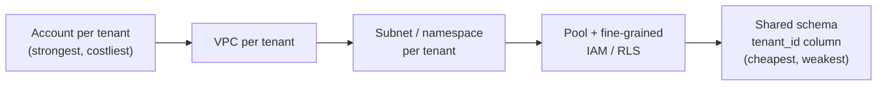
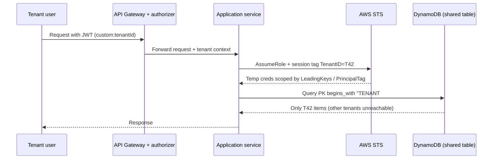
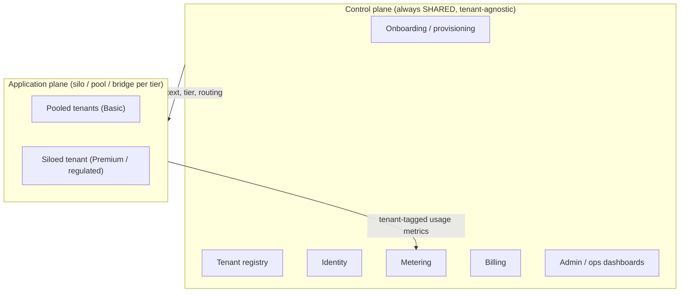
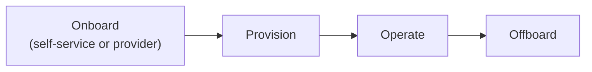

# AWS SaaS and Multi-Tenancy Foundations

This is the **AWS-specific companion** to the vendor-neutral core topic
[`multi-tenancy-and-saas-isolation`](../multi-tenancy-and-saas-isolation/concepts.md).
That topic teaches the concepts — silo/pool/bridge, row-level security, noisy
neighbors — in the abstract. Here we express *all of it in concrete AWS
primitives*: AWS Organizations and accounts, VPCs and subnets, DynamoDB
partitions, IAM/STS, Cognito, API Gateway usage plans, and the AWS
Well-Architected **SaaS Lens** vocabulary. Do not re-derive the abstract concepts
here; anchor them to AWS building blocks and, above all, to **trade-offs**.

The single sentence to internalize before anything else, straight from the SaaS
Lens general design principles: **"There is no one-size-fits-all SaaS
architecture,"** and **"SaaS is a business strategy, not a technical
implementation."** Every decision below moves along a **three-way tension:
isolation strength, cost and efficiency, and operational complexity.** There is no
free lunch — buying more isolation costs money and/or operational burden; buying
efficiency spends isolation. The senior signal in an interview is naming *which*
axis you are trading and *why*, per layer and per tenant tier.

> [!KEY-TAKEAWAY]
> You rarely pick one isolation model for the whole system. You pick
> silo / pool / bridge **per layer** (compute, network, data, identity), often
> **per service**, and often **per tenant tier**. AWS calls the mixed result the
> **bridge model**. Answering "silo everything" or "pool everything" to a broad
> SaaS design question is usually the wrong instinct.

---

## What multi-tenancy means on AWS and why SaaS

A **tenant** is the fundamental construct of a SaaS environment: any customer you
sign up to use your service is a tenant. On sign-up a tenant typically provides a
**tenant administrator**, who then adds that tenant's users. The defining
behaviour of SaaS is **unified operation**: when you ship an update, it applies to
*all* tenants at once, from one deployment, one version, one operational pane of
glass.

That unified model is what distinguishes true SaaS from a **managed-service
model**, where each customer effectively runs their own version with separate
onboarding, patching, and operations. Managed service does not scale
operationally; SaaS does.

**Why providers choose multi-tenancy:**

- **Cost efficiency / economies of scale** — one shared fleet amortized across
  many tenants beats N idle single-tenant stacks.
- **Operational leverage** — one version to patch, one deploy pipeline, one set of
  dashboards.
- **Agility and faster onboarding** — a new tenant is (ideally) a database row,
  not a project.

The price of that leverage is **isolation risk** (a bug or breach can cross tenant
boundaries) and **noisy neighbors** (one tenant's load degrades another's).
Multi-tenancy is fundamentally the act of *trading isolation for efficiency* and
then buying back exactly as much isolation as your compliance, blast-radius, and
tiering requirements demand.

> [!TIP]
> "SaaS but siloed" is still SaaS. A fully siloed deployment (dedicated stack per
> tenant) is SaaS **as long as it keeps a shared identity, onboarding, and
> operational plane**. Silo is a *deployment* choice about the application plane,
> not a departure from SaaS. If each customer instead has its own onboarding,
> version, and ops, you have a managed service, not SaaS.

---

## The isolation spectrum from silo to pool

Isolation is not binary. It is a **spectrum** running from a dedicated AWS account
per tenant (strongest isolation, highest cost) down to a single shared table with
a `tenant_id` column (cheapest, weakest boundary). The Nagarro anchor article
enumerates six waypoints on this spectrum; mapped to AWS they are:

1. **Governance via AWS Organizations / OUs + consolidated billing** — organize
   tenant accounts under organizational units with service control policies (SCPs);
   maximum isolation, constrained by Organizations quotas, typically for premium
   tenants.
2. **Account-per-tenant** — full silo; complete separation and clean per-tenant
   billing, but loses aggregate volume discounts (unless consolidated) and adds
   fleet management overhead.
3. **VPC-per-tenant** in one account — network-level logical isolation; watch the
   per-Region VPC quota.
4. **Subnet-level isolation** in a single VPC — each tenant gets subnets and
   SG/NACL boundaries, but shared VPC-wide settings (DHCP option sets, etc.) affect
   everyone, and NACL/SG management gets tedious.
5. **Container-layer isolation** — ECS services / EKS namespaces with RBAC and IAM;
   extensible, but shared worker nodes widen the attack surface (container escape,
   cross-namespace traffic).
6. **Data-layer isolation** — four sub-models: (a) instance-per-tenant, (b) one
   instance + separate databases via a tenant-map store, (c) one database +
   separate tables/schemas, (d) shared schema + `tenant_id` column (pool).



| Position | Model | Boundary | Isolation | Cost/tenant | Ops complexity | Blast radius |
|---|---|---|---|---|---|---|
| Strongest | Account-per-tenant | AWS account | Hard (IAM/SCP/account) | Highest | High (fleet of stacks) | 1 tenant |
| | VPC-per-tenant | VPC | Network-level | High | Med-high | 1 tenant |
| | Subnet / namespace | subnet / k8s ns | Logical + network | Medium | Medium | small group |
| | Pool + IAM/RLS | shared resource | Runtime-enforced | Low | Complex isolation *code* | All tenants |
| Weakest | Shared schema `tenant_id` | row / item | App logic only | Lowest | Simple infra, hard correctness | All tenants |

Note the **shape of the complexity cost changes** as you move down the spectrum:
silo complexity is *operational* (managing many stacks, quotas, deploys); pool
complexity is *code correctness* (one bug in the tenant-scoping logic leaks every
tenant's data).

---

## Silo, pool, and bridge models

These are the SaaS Lens names for the three positions:

- **Silo model** — "tenants are provided dedicated resources." A fully independent
  stack, or just a dedicated database per tenant. Strong isolation, per-tenant
  cost attribution is trivial, blast radius is one tenant; but cost and operational
  overhead scale with tenant count.
- **Pool model** — "tenants share resources," the classic notion of
  multi-tenancy: shared, scalable infrastructure for economies of scale. Cheapest
  and most agile, but isolation must be enforced in software and a hot/hostile
  tenant can affect everyone.
- **Bridge model** — the realistic middle: **mixed mode**, where some
  microservices are siloed and some pooled. A service's regulatory profile and
  noisy-neighbor sensitivity push it toward silo; agility, uniform access
  patterns, and cost push it toward pool.

**Pod / cell deployment** is a key bridge pattern: a self-contained stack serves a
*bounded set* of tenants — pooled *within* a pod, siloed *across* pods. This caps
blast radius (a bad deploy or a breach hits only the pod's tenants) and maps
cleanly to tiering (put premium tenants in smaller/dedicated pods).

> [!INTERVIEW]
> When asked "silo or pool?", the strong answer is: "Neither globally — bridge. Let
> me decompose by layer and tier." Then justify each layer's choice with its own
> trade-off. SaaS Lens design principle #2: *"Decompose each service based on its
> multi-tenant load and isolation profile."*

---

## Tenant isolation is not authentication or authorization

This is the highest-value exam point and the most common misconception. From the
Tenant Isolation whitepaper: **"the fact that a tenant user is authenticated does
not mean that your system has achieved isolation. Isolation is applied separately
from the basic authentication and authorization."** A user can be fully
authenticated *and* authorized for an action, and still reach *another tenant's*
resources — nothing in authN/authZ inherently blocks that.

- **Authentication** proves *who* the user is.
- **Authorization** decides *what actions* that user may perform (roles,
  permissions).
- **Tenant isolation** constrains *which tenant's resources* are reachable at all,
  enforced for **every user of a tenant**, independently of the app's authZ logic.

Crossing the tenant boundary is described as "a significant and potentially
unrecoverable event" — a cross-tenant data leak. So isolation must be enforced by
a mechanism that does not depend on application developers remembering to add a
`WHERE tenant_id = ?` clause on every query.

> [!WARNING]
> A `WHERE tenant_id = ?` filter that the application appends in code is **not**
> tenant isolation — it is a convention one forgotten line breaks. Real isolation
> pushes the boundary into a layer the request *cannot* escape: STS-scoped
> temporary credentials, DynamoDB `dynamodb:LeadingKeys`, Postgres Row-Level
> Security, or a separate account/VPC.

---

## Isolation enforcement mechanisms on AWS

Enforcement runs from coarse-grained (silo-oriented, simple to reason about,
expensive/quota-limited) to fine-grained (pool-oriented, cheap, but requires
careful code).

**Coarse-grained (silo):** a separate AWS **account** (org boundary + SCPs), a
**VPC**, a **subnet**, or **security group / NACL** boundaries. Strong and easy to
reason about; expensive and quota-limited.

**Fine-grained (pool):**

- **Dynamically-generated, tenant-scoped IAM policies** issued at request time via
  STS **`AssumeRole`**, returning temporary credentials scoped to one tenant's
  data. The app performs the data operation with *those* credentials, so it
  physically cannot touch another tenant's items.
- **ABAC with session tags** — pass `TenantID` as a **session tag** on
  `AssumeRole`, then reference `${aws:PrincipalTag/TenantID}` in the policy's
  `Condition`. One policy scales to all tenants without per-tenant policy
  proliferation. (Limit: **50 session tags** per session.)
- **DynamoDB `dynamodb:LeadingKeys`** IAM condition — restricts access to items
  whose **partition key begins with the caller's tenant ID**. Enforced by the
  DynamoDB service, not the app.
- **RDS / Aurora PostgreSQL Row-Level Security (RLS)** — the database filters rows
  by `tenant_id` based on a session variable; see
  [`aws-databases-rds-aurora`](../aws-databases-rds-aurora/concepts.md).
- **Kubernetes RBAC + IRSA** (IAM Roles for Service Accounts) for per-namespace /
  per-tenant scoping on EKS.



**What the enforcement actually looks like** — trace tenant `T42` through all
three layers:

*(1) The `AssumeRole` call that stamps the tenant onto the credentials* — the
service passes `TenantID` as a **session tag**, so the identity of the temporary
credentials now carries the tenant:

```python
sts.assume_role(
    RoleArn="arn:aws:iam::111122223333:role/tenant-data-access",
    RoleSessionName="req-abc123",
    Tags=[{"Key": "TenantID", "Value": "T42"}],   # <-- session tag
)
```

*(2) The IAM policy on that role* — **one** policy serves every tenant, because
the tenant value is read from the session tag at request time:

```json
{
  "Effect": "Allow",
  "Action": ["dynamodb:GetItem", "dynamodb:Query"],
  "Resource": "arn:aws:dynamodb:*:*:table/AppData",
  "Condition": {
    "ForAllValues:StringLike": {
      "dynamodb:LeadingKeys": ["TENANT#${aws:PrincipalTag/TenantID}#*"]
    }
  }
}
```

At request time `${aws:PrincipalTag/TenantID}` resolves to `T42`, so the
condition effectively becomes `dynamodb:LeadingKeys` must start with
`TENANT#T42#`. A `Query` for `PK = "TENANT#T99#order-1"` with these credentials is
**denied by DynamoDB itself** — the application never gets a chance to leak
another tenant's items, even if a developer forgot a filter.

*(3) The Postgres equivalent — Row-Level Security (RLS)* for the relational pool
model, set up once and then enforced on every statement:

```sql
ALTER TABLE orders ENABLE ROW LEVEL SECURITY;
CREATE POLICY tenant_isolation ON orders
  USING (tenant_id = current_setting('app.tenant_id'));

-- per request, before running any tenant query:
SET app.tenant_id = 'T42';
```

Now a plain `SELECT * FROM orders` — with **no** `WHERE tenant_id` clause —
silently returns only `T42` rows, because the database appends the predicate. In
all three layers the tenant value lands in a place the request *cannot* rewrite (a
session tag, a resolved principal tag, a session variable), not in hand-written
query text.

See [`aws-security-iam-deep-dive`](../aws-security-iam-deep-dive/concepts.md) for
the ABAC/STS mechanics in depth.

---

## Control plane versus application plane

This is the **central SaaS architecture idea** and the concept that most
distinguishes a SaaS design from "a multi-tenant app."

- **Control plane** — tenant-*agnostic*, **always shared** services that run *the
  business of SaaS*: onboarding/provisioning, the **tenant registry** (tenant
  management), identity, **metering**, **billing**, tiering, admin, and operational
  dashboards/analytics. It exists regardless of how tenants are isolated. It is
  **not** multi-tenant application functionality.
- **Application plane** — where the actual multi-tenant application runs and serves
  tenant workloads. **This is the layer where silo/pool/bridge is applied**, and it
  can vary by tier and by layer.

Why the split matters: it decouples "run the business of SaaS" from "run the tenant
workload." It is precisely what lets you offer a *siloed* enterprise tenant and a
*pooled* SMB tenant through **one uniform operational experience** — the thing that
makes it SaaS and not N managed installs. The tenant context (`TenantId`)
**originates in the control plane** (at onboarding) and **flows into the
application plane** to drive isolation, routing, metering, and logging.



AWS ships reference implementations of this split: the **SaaS Builder Toolkit
(SBT)** and the **EKS SaaS** and **serverless SaaS** reference architectures.

> [!KEY-TAKEAWAY]
> If a design has a shared control plane (onboard/identity/meter/bill/operate) and
> an application plane whose isolation you can vary per tenant, you have described
> a SaaS architecture. The control plane is shared *even when every tenant's
> application plane is fully siloed*.

---

## SaaS identity and tenant context with Cognito

The binding of a user to a tenant is called the **SaaS identity**. On
authentication the identity provider yields a token that carries **both the user
identity and the tenant identity**. That token then flows into every microservice
to create tenant-aware logs, record per-tenant metrics, meter for billing, and
enforce isolation.

Design principle: **"Bind user identity to tenant identity."** Tenant context must
be a **first-class construct resolvable without calling another service** — a
standalone user→tenant lookup service "can undermine security and creates
bottlenecks."

**AWS mechanics with Amazon Cognito:**

1. A **Cognito user pool** authenticates the user and issues a **JWT**.
2. A **Pre-Token-Generation Lambda trigger** injects custom claims —
   `custom:tenantId`, tier, etc. — into the token.
3. **API Gateway** (Cognito authorizer or Lambda authorizer) validates the JWT and
   extracts the tenant claim, passing tenant context to the backend.
4. The backend uses that context to call **STS** for tenant-scoped credentials.

**Pooled vs siloed identity:**

- **Pooled identity** — one shared user pool for all tenants, tenant encoded as a
  claim. Cheapest; but per-tenant IdP federation, branding, and vanity domains are
  harder.
- **Siloed identity** — a **user pool per tenant**. Supports per-tenant SAML/OIDC
  federation, custom domains, and isolation; but you burn user-pool quota and add
  management overhead.
- **Bridge identity** — pooled pool for Basic tier; dedicated pools only for
  enterprise tenants that require their own IdP federation.

**Cognito quotas that constrain identity strategy (defaults unless noted):**

| Quota | Default | Notes |
|---|---|---|
| User pools per Region | 1,000 | max 10,000 |
| App clients per user pool | 1,000 | max 10,000 |
| Identity providers per user pool | 300 | federation limit |
| Users per user pool | 40,000,000 | matters for B2C scale |
| Groups per user pool | 10,000 | user can belong to 100 groups |
| **Custom attributes per user pool** | **50** | **non-adjustable** — caps tenant metadata encoded as attributes |
| **Custom domains per Region** | **4** | **non-adjustable** — blocks per-tenant vanity domains at scale |
| `UserAuthentication` request rate | 120 RPS | per Region/account, **pooled across tenants** |
| `UserCreation` request rate | 50 RPS | per Region/account |

> [!WARNING]
> Request-rate quotas (e.g. `UserAuthentication` 120 RPS) are **per-Region,
> per-account, and shared across all tenants in a pooled user pool** — one
> tenant's auth spike is a **noisy neighbor at the identity layer**. The
> non-adjustable **4 custom domains per Region** quota is a hard wall for giving
> thousands of tenants vanity login domains.

**Gotcha — a user who belongs to more than one tenant** (a common B2B follow-up:
a consultant or MSP admin spanning several client orgs). The token must carry the
**active** tenant — a single `custom:tenantId` claim for the tenant the user is
currently acting as — not a list of every tenant they can access. Do **not** stuff
all of a user's tenant memberships into the JWT: it bloats the token, and it goes
stale the moment membership changes (the token is valid until it expires).
**Switching tenant** means minting a new token for the new active tenant — a
re-auth or a token exchange against the membership store — so isolation is always
driven by exactly one authoritative tenant claim per request.

See [`aws-security-kms-secrets-cognito-waf`](../aws-security-kms-secrets-cognito-waf/concepts.md)
for Cognito internals.

---

## Compute isolation on AWS

- **Silo compute** — dedicated EC2 Auto Scaling group, dedicated ECS service or EKS
  node group, or per-tenant Lambda functions. Strong isolation and per-tenant
  scaling/cost; but idle capacity per tenant and a large fleet to operate.
- **Pool compute** — shared ECS tasks / EKS deployments / shared Lambda, tenant
  context per request, data-layer isolation enforced via STS-scoped credentials.
  Best utilization; noisy-neighbor and blast-radius exposure.

**EKS specifics** (see
[`aws-containers-ecs-eks`](../aws-containers-ecs-eks/concepts.md)):
namespace-per-tenant (silo-ish: RBAC + NetworkPolicies + ResourceQuotas) or a
shared namespace (pool). **Shared worker nodes widen the attack surface** —
container escape and cross-namespace traffic are real risks. Harden with **IRSA**
(per-service-account IAM roles), **NetworkPolicies**, policy engines
(Kyverno/OPA), and node-level isolation (dedicated node groups or **Fargate**) for
premium tiers.

**Serverless SaaS** — Lambda + API Gateway; tenant context resolved in the
authorizer; STS `AssumeRole` per invocation for data-layer scoping. Watch the
**account-level Lambda concurrency limit** (shared across all tenants) — a runaway
tenant can starve others; mitigate with **reserved concurrency** per tenant/tier.

---

## Network isolation and VPC quotas

- **Silo network** — VPC-per-tenant, or subnet-per-tenant with SG/NACL boundaries.
- **Pool network** — one shared VPC; tenant separation lives above the network
  layer (data/identity).

The VPC quotas below **force architecture** — they are common "which limit does
this hit first?" interview questions (defaults, per Region unless noted; most
adjustable):

| Quota | Default | Consequence |
|---|---|---|
| **VPCs per Region** | **5** | Hard blocker for naive VPC-per-tenant; raising it also raises Internet Gateways per Region |
| **Subnets per VPC** | **200** | Caps subnet-per-tenant density |
| Security groups per Region | 2,500 | |
| Rules per SG | 60 in / 60 out | Per IPv4 and IPv6 separately |
| SGs per ENI | 5 (up to 16) | `(rules/SG) × (SGs/ENI)` cannot exceed 1,000 |
| **NACLs per VPC** | **200** | |
| Rules per NACL | 20 (max 40 in / 40 out) | The article's "tedious NACL management," quantified |
| Route tables per VPC | 200 | routes per table 500 (max 1,000) |

> [!WARNING]
> Subnet-per-tenant does **not** give each tenant independent VPC configuration:
> the **DHCP option set and other VPC-wide settings are shared across all
> subnets**, so a change affects every tenant. If a tenant needs truly independent
> networking, that is a VPC-per-tenant (or account-per-tenant) requirement.

See [`aws-networking-vpc-privatelink`](../aws-networking-vpc-privatelink/concepts.md).

---

## Data isolation strategies and quotas

Data is where isolation matters most (a leak here is the unrecoverable event) and
where the four sub-models from the anchor article live. Mapped to AWS:

- **(a) Full instance isolation** — RDS/Aurora instance or DynamoDB table **per
  tenant** (silo). Strongest; per-tenant tuning, backup, and restore;
  per-tenant cost is trivial to attribute. Expensive and quota-limited.
- **(b) Single instance + separate databases/schemas** — DB-per-tenant or
  **schema-per-tenant** on one Aurora cluster; a **tenant-map / metadata store
  (DynamoDB)** resolves `tenant → DB/schema`. Bridge.
- **(c) Single database + separate tables** per tenant.
- **(d) Shared schema + `tenant_id` column** (pool) — best economies of scale,
  shared attack surface; enforce with **Postgres RLS**.

**DynamoDB partitioning:** pool = one shared table, partition key prefixed
`TENANT#<id>#...` guarded by `dynamodb:LeadingKeys`; silo = table-per-tenant.

**S3:** bucket-per-tenant (silo) vs one shared bucket with a per-tenant **prefix**
+ IAM policy scoped to that prefix (pool).

**DynamoDB limits that shape the design** (see
[`aws-dynamodb-deep-dive`](../aws-dynamodb-deep-dive/concepts.md)):

| Limit | Value | Why it matters |
|---|---|---|
| Item size | 400 KB max | |
| **Per physical partition throughput** | **~3,000 RCU / 1,000 WCU** | The real **hot-tenant / noisy-neighbor** ceiling; adaptive capacity + burst help but a hot tenant partition still throttles |
| Table-level throughput | 40,000 RCU & 40,000 WCU default | adjustable |
| Account-level throughput | 80,000 RCU/WCU | adjustable |
| **Tables per Region** | **2,500 default (→10,000)** | **Caps table-per-tenant silo density**; beyond 10,000 you need multiple accounts |
| GSIs / LSIs per table | 20 / 5 | |

**RDS/Aurora:** connection limits scale with instance size (`max_connections`); a
pool with many tenants can exhaust connections — use **RDS Proxy** for connection
pooling/multiplexing. Schema-per-tenant multiplies schema objects; DB-per-tenant
multiplies instances and cost. See
[`aws-databases-rds-aurora`](../aws-databases-rds-aurora/concepts.md).

**Worked example — "40,000 RCU table, one tenant still throttled":** the shared
table `AppData` is provisioned for **40,000 RCU**. Tenant `T42` all keys on the
prefix `TENANT#T42#...`, so every one of T42's items hashes to the **same
partition key** and lands on **one physical partition**. That partition is capped
at **~3,000 RCU**. T42 drives **5,000 RCU** of reads:

- Partition ceiling = 3,000 RCU → 3,000 RCU served.
- Remaining 5,000 − 3,000 = **2,000 RCU throttled** (HTTP 400
  `ProvisionedThroughputExceededException`) — even though the table has
  40,000 − 5,000 = **35,000 RCU of unused headroom**. The table isn't the
  bottleneck; the single partition is.

*The fix, quantified:* write-shard the key into `TENANT#T42#<0-9>` (10 suffixes).
The 5,000 RCU now spreads across up to 10 partitions ≈ **500 RCU each**, well
under the 3,000 ceiling → nothing throttles. (Reads must now fan out across the 10
shards.) Or move T42 to a **silo table**, giving it its own 40,000 RCU and its own
partition budget. On-demand mode + adaptive capacity soften transient spikes but
do **not** raise the ~3,000 RCU per-partition physical ceiling.

> [!TIP]
> A hot-tenant DynamoDB problem is a **partition-key design** problem. If one
> tenant's `TENANT#<id>` prefix concentrates all traffic on one physical
> partition, you hit the ~3,000 RCU / 1,000 WCU ceiling regardless of the
> table-level provisioned throughput. On-demand mode + write sharding + good key
> design mitigate it; moving the hot tenant to a silo table removes it.

---

## Tenant tiers, throttling, metering, and cost attribution

**Tenant tiers** (Basic/Standard/Premium) are market segments with different
price and experience that "influence the cost, operations, management, and
reliability footprint." Tiers commonly map to isolation — **pool for Basic, silo
(or dedicated pods/nodes) for Premium** — and are the primary lever behind the
bridge model.

**Tier-based throttling — API Gateway.** Four throttle layers stack:
AWS Regional (fixed) → per-account per-Region → per-API/stage/method → **per-client
via Usage Plans + API keys**. A **Usage Plan** sets:

- **rate** — steady-state RPS (token-bucket refill rate),
- **burst** — the token bucket size (max concurrent burst),
- **quota** — requests per day/week/month.

Map a usage plan per tier (or per tenant) to get per-tenant throttling and
noisy-neighbor containment **at the edge**. Throttled requests receive **HTTP 429
Too Many Requests**. Throttle values are best-effort **targets**, not hard
ceilings. See [`aws-api-layer-apigateway-appsync`](../aws-api-layer-apigateway-appsync/concepts.md).

**Worked example — token bucket with `rate=100`, `burst=200`:** the bucket holds
at most 200 tokens (burst) and refills at 100 tokens/sec (rate). One token is
spent per request.

- *Idle then spike:* the bucket is full at 200 tokens. A tenant fires **200
  requests in one instant** → all 200 pass (drains the bucket to 0). That is the
  burst allowance — a short spike above the steady rate is absorbed.
- *Immediately after:* the bucket is empty; it refills at 100/sec. So the next
  second the tenant can do at most ~100 requests. Sustained throughput settles to
  the **rate = 100 RPS**; burst only buys a one-time cushion, not a higher
  long-run rate.
- *Sustained 150 RPS load:* refill adds 100 tokens/sec but the client spends 150 →
  net **−50 tokens/sec**. Starting full (200), the bucket empties in 200 / 50 =
  **4 seconds**; after that ~50 RPS get **429**ed every second (100 served, 50
  rejected) until the client backs off to ≤100 RPS. Burst delays the throttling by
  4 seconds; it does not prevent it.

**Metering.** Capture tenant-level usage/load ("Tenant Activity and
Consumption") to feed scaling decisions *and* billing. Emit tenant-tagged metrics
(**CloudWatch EMF** with a `TenantId` dimension, or Kinesis/Firehose aggregation
into DynamoDB/Timestream) → billing system. Enables consumption / pay-as-you-go
pricing alongside subscription.

**Per-tenant cost attribution:**

- **Silo** — trivial: tag the whole stack/account; use **Organizations
  consolidated billing** per account. Account-per-tenant gives the cleanest cost
  picture.
- **Pool** — hard: shared resources can't be split by resource tags alone. Use
  **cost allocation tags** (`user:TenantId`), activate them in the Billing console
  (not retroactive, ~24h to appear), and query the **Cost and Usage Report (CUR)**
  via Athena (column `resource_tags_user_tenant_id`). For **truly shared infra**
  (one DynamoDB table, shared Lambda, a NAT gateway), tags fail entirely — you need
  **application-level metering** and proportional allocation (attribute by consumed
  RCU/WCU, invocations, request counts). For containers, enable **Split Cost
  Allocation Data** in the CUR for pod-level cost.

  *Worked example — proportional allocation:* one shared DynamoDB table bills
  **$1,000** for the month. AWS cannot tell you who drove it — the tag is on the
  table, not the item. But your application metered consumed capacity per
  `TenantId`: tenant A = 60%, B = 30%, C = 10% of total RCU/WCU. Allocate the bill
  by those fractions: A = 0.60 × $1,000 = **$600**, B = 0.30 × $1,000 = **$300**,
  C = 0.10 × $1,000 = **$100** (sums to $1,000). The metering data — not a cost
  tag — is what makes chargeback possible in the pool model.

Limits: 50 user-defined tags per resource; tag keys are case-sensitive in the CUR
(enforce `TenantId` consistently); enforce with **Organizations tag policies /
SCPs**. SaaS Lens principles: *"Measure the cost impact of individual tenants"* and
*"Create tenant-aware operational views."*

> [!INTERVIEW]
> "How do you attribute cost per tenant in a pooled DynamoDB table?" — Cost
> allocation tags **do not work** for a single shared table; you must **meter at
> the application level** (sum consumed capacity per `TenantId`) and allocate
> proportionally. Naming cost allocation tags here is the trap answer.

See [`aws-cost-optimization-scaling`](../aws-cost-optimization-scaling/concepts.md).

---

## AWS Organizations governance model

The account-per-tenant silo is operated through **AWS Organizations** — the
article's pattern #1. Verified quotas (defaults):

| Quota | Value |
|---|---|
| **Accounts per organization** | **10 default**, adjustable up to **50,000** (qualification-based) |
| OUs per organization | 2,000 |
| OU nesting depth | 5 levels under one root |
| Roots | 1 |
| SCPs per org | 10,000 |
| SCPs attached per entity | max 10 (root/OU/account) |
| SCP document size | 10,240 chars |
| Tags per root/OU/account | 50 |
| Concurrent account creations | 5 |
| `CreateAccount` rate | ~0.1 RPS |

The low `CreateAccount` throughput (5 concurrent, ~0.1 RPS) matters for
**onboarding automation** that provisions an account per tenant at scale — you
cannot spin up thousands quickly. Use **AWS Control Tower** (limit 10,000
accounts) / **Account Factory** to automate the account-per-tenant silo.
**Consolidated billing preserves volume discounts** across siloed accounts, which
rebuts the anchor article's "loses volume discounts" claim *when consolidated*.

---

## Tenant lifecycle onboard provision operate offboard

SaaS Lens principle: **"Onboard tenants through a single, automated, repeatable
process."** The control plane orchestrates the full lifecycle:



- **Onboard** — a frictionless entry point (self-service sign-up or
  provider-initiated) that triggers provisioning.
- **Provision** — control-plane orchestration: create the tenant record in the
  registry → set up identity (user pool / claims) → provision infrastructure. For
  **silo**: a CloudFormation/CDK stack, or a new account via Control Tower, or a new
  pod — **minutes to hours**, and under quota pressure. For **pool**: just register
  the tenant and apply tier config — **seconds**. Then wire routing and set
  tier/throttle/quota.
- **Operate** — tenant-aware logging/metrics/dashboards; per-tenant SLA and
  noisy-neighbor monitoring; metering → billing.
- **Offboard** — deprovision, export/delete tenant data, stop billing, revoke
  identity. **Data deletion is a compliance requirement** (GDPR right-to-erasure)
  and it is **much easier in silo** (drop the account/DB) than in pool (delete
  every row by `tenant_id` across shared tables, which is error-prone and slow).

> [!KEY-TAKEAWAY]
> Onboarding cost is itself a first-class trade-off: silo onboarding is heavy
> (provision stacks/accounts, quota pressure, minutes-to-hours), pool onboarding
> is a lightweight registry insert (seconds). A B2C product signing up thousands of
> tenants a day cannot afford silo onboarding.

---

## Noisy neighbors and blast radius

A **noisy neighbor** is when one tenant places load on shared resources that
degrades another tenant's experience — amplified in pool models with unpredictable
multi-tenant load. **Blast radius** is how many tenants a single failure, bug, or
breach can affect.

**AWS-specific noisy-neighbor risks:**

- DynamoDB **hot partition** (3,000 RCU / 1,000 WCU per partition ceiling).
- **Lambda concurrency exhaustion** (account limit shared across tenants).
- RDS connection/CPU contention.
- Cognito category request-rate quotas pooled across tenants.
- API Gateway per-account throttle shared across tenants.

**Mitigations:**

- Per-tenant/tier **API Gateway usage-plan throttling and quotas**.
- **Lambda reserved / provisioned concurrency** per tenant or tier.
- DynamoDB good partition-key design + **on-demand mode** + adaptive capacity.
- **RDS Proxy** for connection pooling.
- **Shuffle-sharding / pod (cell) isolation** to bound blast radius.
- Move noisy or premium tenants to a **silo**.

**Blast radius by model:** account-per-tenant → a failure/compromise is contained
to one tenant; full pool → one bug or breach can hit **all** tenants; pods/cells
are the middle ground.

---

## B2B versus B2C tenancy

The tenant definition drives *everything* — establish it **first** in any design
answer.

- **B2B** — tenant = a company/organization (few, large, high-value). Fewer tenants
  make silo/bridge affordable; demands strong isolation, per-tenant SLA /
  compliance / data residency, per-tenant IdP federation (SAML/OIDC), often a
  per-tenant custom domain. A tenant admin manages many end-users. Cost
  attribution and tiering matter for enterprise contracts.
- **B2C** — the tenant boundary is fuzzy; often the "tenant" is effectively the
  whole app and "users" are millions of consumers. Pool everywhere for economics;
  pooled identity; **scale is the dominant constraint** (Cognito 40M users/pool,
  RPS quotas). Some B2C-flavored SaaS treats each *user* as a lightweight tenant.

This definition sets tenant count, isolation feasibility, identity strategy, and
cost model. Answering a design question without pinning down B2B-vs-B2C and tenant
count first is a red flag.

---

## Trade-offs and when to use what

The through-line: **isolation strength ↔ cost/efficiency ↔ operational
complexity**. Buy isolation and you spend money and/or ops burden; buy efficiency
and you spend isolation. Decide **per layer, per service, and per tier** — not once
for the whole system.

| Factor | Silo (account/VPC/instance per tenant) | Pool (shared, `tenant_id` + IAM/RLS) |
|---|---|---|
| Isolation strength | Hard (infra boundary) | Runtime-enforced (code correctness) |
| Cost per tenant | High (idle capacity per tenant) | Low (shared, high utilization) |
| Ops complexity | Operational (fleet of stacks, quotas, deploys) | Code correctness (one bug leaks all) |
| Blast radius | 1 tenant | All tenants |
| Onboarding speed | Minutes–hours (provision infra) | Seconds (registry insert) |
| Cost attribution | Trivial (tag the stack/account) | Hard (needs app-level metering) |
| Offboarding / GDPR erasure | Easy (drop account/DB) | Hard (delete by `tenant_id`) |
| Noisy-neighbor risk | None (dedicated) | High (mitigate with throttling/sharding) |
| Scale ceiling | Quota walls (VPCs=5, DDB tables=2,500→10k, accounts=10→50k) | Very high |

**Choose silo when:** strict compliance / regulatory isolation, data residency,
per-tenant SLA, few high-value B2B tenants, premium-tier differentiation,
blast-radius intolerance, or easy per-tenant cost/offboarding is required.

**Choose pool when:** many tenants, cost/scale is dominant, agility matters,
workloads are uniform, margins are thin (B2C or SMB B2B).

**Bridge is the realistic default:** pool compute + siloed data for a regulated
microservice; pool everything for Basic tier, silo data (or dedicated pods) for
Premium; pooled identity with dedicated user pools only for enterprise-federation
tenants.

**Watch the quota walls that force architecture:** VPCs per Region (5), DynamoDB
tables per Region (2,500 → 10,000), Organizations accounts (10 → 50,000), Cognito
custom domains per Region (4, non-adjustable), subnets per VPC (200).

> [!INTERVIEW]
> A complete senior answer sequence: (1) B2B or B2C and how many tenants? (2)
> compliance / data-residency / SLA / tiers? (3) decompose the stack and assign
> silo/pool **per layer and per tier**, naming the trade-off each time; (4) call
> out the specific AWS quota that will bite first and the noisy-neighbor
> mitigation; (5) describe the shared control plane and how tenant context flows.

---

## Common interview follow-up questions

1. **"A user is authenticated and authorized — is tenant isolation guaranteed?"**
   No. Isolation is enforced separately; an authorized user can still reach another
   tenant's data unless a mechanism (STS-scoped creds, LeadingKeys, RLS,
   account/VPC boundary) blocks it.
2. **"You need VPC-per-tenant for 500 tenants. What breaks first?"** The default
   **5 VPCs per Region** quota; even raised, per-Region IGW and other network
   quotas and the operational overhead make VPC-per-tenant at that scale a poor
   fit — reconsider subnet/namespace pooling or accounts.
3. **"How do you attribute cost in a single shared DynamoDB table?"** Cost
   allocation tags don't split a shared resource; meter consumed RCU/WCU per
   `TenantId` at the application level and allocate proportionally.
4. **"How does tenant context get from login to the database query?"** Cognito JWT
   with a `custom:tenantId` claim (Pre-Token-Generation Lambda) → API Gateway
   authorizer extracts it → backend calls STS `AssumeRole` with a `TenantID`
   session tag → scoped creds → `LeadingKeys`/RLS-filtered data access.
5. **"Premium tenant wants their own login domain and SAML."** Siloed identity: a
   dedicated Cognito user pool for that tenant — but only 4 custom domains per
   Region (non-adjustable), so vanity domains don't scale to many tenants.
6. **"Why is the control plane always shared even in a full-silo design?"** Because
   onboarding, identity, metering, billing, and operations are what make it SaaS
   (unified operation) rather than N managed installs.
7. **"Cheapest way to bound blast radius without full silo?"** Pods/cells:
   pool within a cell, silo across cells; caps failure/breach to one cell's
   tenants.
8. **"Which is easier to offboard for GDPR — silo or pool, and why?"** Silo — drop
   the account/database. Pool requires deleting every row by `tenant_id` across
   shared tables.

---

## References

- **AWS Well-Architected SaaS Lens** (2023-04-04) — General Design Principles;
  Silo/Pool/Bridge Models; Tenant Isolation; Data Partitioning; Noisy Neighbor;
  Tenant Tiers; Tenant Onboarding; Tenant Activity and Consumption (Metering &
  Billing). `docs.aws.amazon.com/wellarchitected/latest/saas-lens/`
- **AWS Whitepaper — SaaS Architecture Fundamentals** (2022-08-03) — SaaS Identity,
  Tenant Isolation. `docs.aws.amazon.com/whitepapers/latest/saas-architecture-fundamentals/`
- **AWS Whitepaper — SaaS Tenant Isolation Strategies** (2020-08-01).
- **AWS Whitepaper — Multi-tenant SaaS Storage Strategies** (2021-05-06).
- **Amazon Cognito / DynamoDB / VPC / Organizations Service Quotas** (AWS docs).
- **API Gateway request throttling and usage plans** (developer guide).
- **AWS Cost Allocation Tags and Cost and Usage Report** (Cost Management guide).
- **AWS SaaS Factory** reference architectures; **SaaS Builder Toolkit (SBT)**;
  **Amazon EKS SaaS** and **serverless SaaS** reference architectures.
- **AWS Prescriptive Guidance — SaaS multi-tenant on EKS** (namespace/IRSA patterns).
- re:Invent SaaS deep-dive talks (ARC/SVS/SAS tracks).
- Nagarro, "Architectural Design Patterns for AWS multi-tenancy" (anchor article —
  the six-pattern isolation spectrum).
