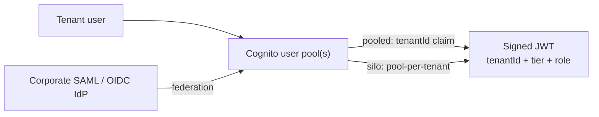
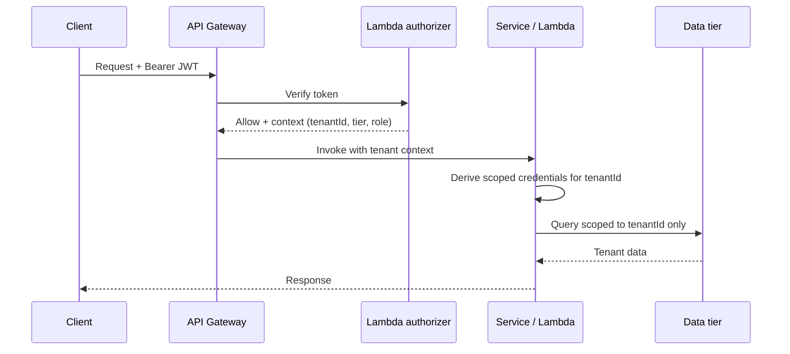
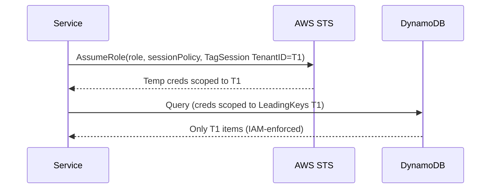
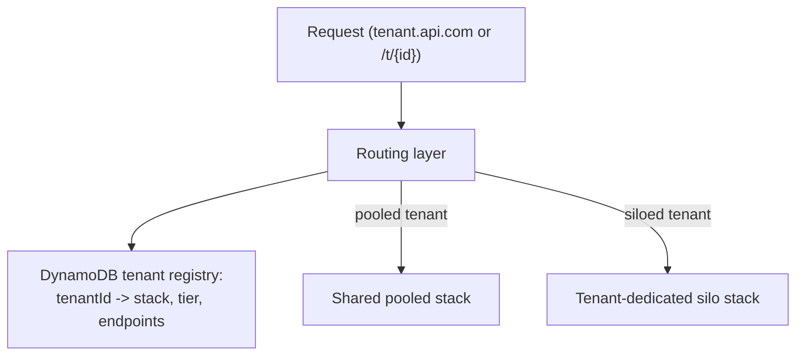
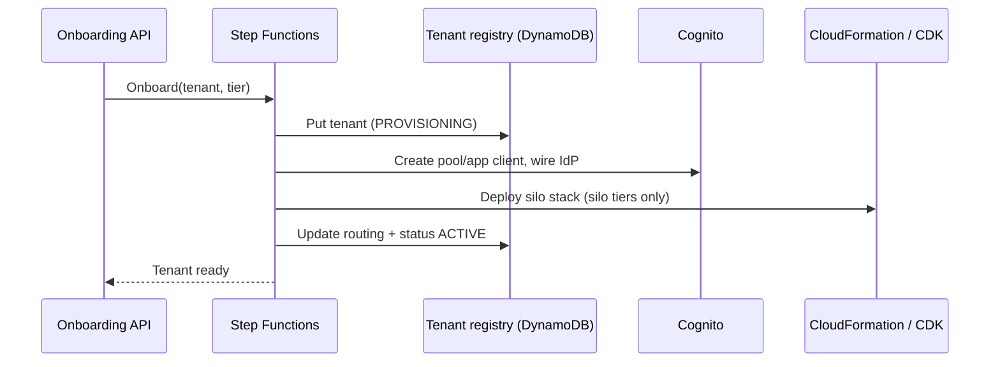

# AWS SaaS Tenant Identity, Context and Routing

This is the **AWS-concrete companion** to the vendor-neutral core topic
[`multi-tenancy-and-saas-isolation`](../multi-tenancy-and-saas-isolation/concepts.md)
and the sibling AWS topics
[`aws-saas-multitenancy-foundations`](../aws-saas-multitenancy-foundations/concepts.md),
[`aws-saas-isolation-patterns`](../aws-saas-isolation-patterns/concepts.md) and
[`aws-saas-data-partitioning`](../aws-saas-data-partitioning/concepts.md).
Where those teach silo / pool / bridge in the abstract, this topic answers the
question every SaaS interview eventually reaches: **"once a request arrives, how
does the system know which tenant it belongs to, prove it, scope it to that
tenant's data, route it to the right stack, and how did that tenant get created
in the first place?"**

The through-line is **tenant context**: a small, trustworthy, cryptographically
signed bundle of `tenantId` + `tier` + `role` that is *minted at authentication*,
*validated at the edge*, *propagated end-to-end*, and *converted into least-
privilege AWS credentials* so the data tier can physically only touch that
tenant's data. This is what AWS SaaS Factory calls **SaaS Identity** and
**tenant isolation enforced through IAM**.

> [!KEY-TAKEAWAY]
> Authentication answers *"who are you"*; **tenant context** answers *"which
> tenant are you acting for, at what tier, with what role."* A user identity that
> is not bound to a tenant is useless in SaaS. The whole design exists to carry
> `tenantId` from the login all the way to a scoped-down `AssumeRole` session so
> that a forgotten `WHERE tenant_id = ?` cannot leak another tenant's data.

---

## SaaS identity and mapping users to tenants

**Intuition.** In a single-tenant app a user *is* the account. In SaaS, a user
**belongs to a tenant**, and the same email may even exist under two tenants
(B2B: `alice@corp.com` could be an admin at Tenant A and a read-only user at
Tenant B). So identity must resolve **user -> tenant(s) -> tier -> role**, not
just authenticate a person.

**On AWS**, the default building block is **Amazon Cognito user pools** (an OIDC-
compliant identity provider that issues signed JSON Web Tokens). A user pool
authenticates users and returns three tokens: an **ID token** and **access token**
(both JWTs, validity 5 minutes to 1 day) and a **refresh token** (validity 1 hour
to 3,650 days). Federation (SAML/OIDC to a corporate IdP like Okta or Entra ID,
or social providers) is layered on top for B2B tenants that bring their own
directory.

The core modeling decision is **how the tenant is attached to the user**:

- **Custom attribute on the user** — store `custom:tenantId` (and often
  `custom:tier`, `custom:role`) on the Cognito user. Simple, but a user record
  lives in exactly one tenant.
- **Cognito groups** — put the user in a `tenant-<id>` group; the group can even
  carry an IAM role for the identity-pool flow.
- **External tenant registry** — keep the authoritative user-to-tenant mapping in
  a **DynamoDB tenant/user table** and merge it into the token at mint time (see
  the pre-token-generation trigger below). This scales past Cognito's per-pool
  limits and supports one user in many tenants.

> [!WARNING]
> Cognito custom attributes are **capped at 50 per user pool**, each custom
> attribute **name is ≤ 20 characters** and each value ≤ 2,048 bytes, and the set
> of custom attributes **cannot be deleted or renamed** once created (you can only
> add). Do not treat custom attributes as a general-purpose per-tenant config
> store — put rich tenant metadata in a DynamoDB **tenant registry** and keep only
> the routing-critical claims (`tenantId`, `tier`, `role`) on the token.

---

## Pooled, siloed and federated identity models

The identity layer is itself a silo/pool/bridge decision, just like compute and
data. Three models, each with sharp trade-offs:

| Identity model | How it looks on AWS | Isolation | Cost / ops | When to use |
|---|---|---|---|---|
| **Pooled identity** (one shared user pool, tenant is a claim) | Single Cognito user pool; `tenantId` as a custom attribute or group; tenant context injected into the JWT | Weakest — all tenants' users in one directory; a token bug can cross tenants | Cheapest, one pool to operate, easy global search, scales to millions of MAUs | Default for B2C and high-volume B2B pooled SaaS |
| **Silo identity** (user pool per tenant) | One Cognito user pool per tenant, provisioned at onboarding | Strong — hard directory boundary, per-tenant password/MFA policy, per-tenant IdP | Higher — hits **1,000 user pools per Region** (raisable to 10,000); onboarding must create a pool; cross-tenant admin harder | Regulated/enterprise tenants; tenants demanding their own IdP or data-residency of the directory |
| **Federated identity** (tenant brings its own IdP) | Corporate SAML/OIDC IdP federated into a shared or per-tenant pool | Depends on host pool; auth lives in the customer's directory | Per-tenant IdP config; onboarding wires the federation | B2B enterprise SSO ("log in with your company account") |

With federation you also have to decide **which** corporate IdP a given login goes
to — **home-realm discovery**. Typically you route on the email **domain** (send
`@acme.com` users to Acme's Okta, `@globex.com` to Globex's Entra ID) or a tenant
hint in the login URL (`app.com/login?tenant=acme`), *not* the full email address:
in a pooled directory the same person may exist under two tenants, so the email
alone cannot tell you which tenant's IdP to trust. This also splits **SP-initiated**
(user starts at your app, you bounce them to their IdP) from **IdP-initiated**
(user starts in their corporate portal and lands on you with a SAML assertion)
flows — both must resolve to the same tenant mapping.

> [!INTERVIEW]
> A classic trap: "just make a user pool per tenant, it's the cleanest isolation."
> The senior answer weighs the **1,000-user-pools-per-Region soft quota** (10,000
> max), the onboarding cost of provisioning a pool per tenant, and the loss of a
> single global user search — then usually lands on **pooled identity with a
> tenant claim** for the bulk of tenants and **silo pools only for the premium/
> regulated tier** (a bridge). Pool-per-tenant is not free "obvious" isolation.



---

## Injecting tenant context into the JWT

**How it works.** The tenant claims must be **inside the signed token** so every
downstream service can trust them without a database lookup. Cognito's
**pre-token-generation Lambda trigger** runs during authentication and lets you
add/override claims: it reads the user's tenant from Cognito attributes or the
DynamoDB registry and stamps `tenantId`, `tier`, and `role` into the ID/access
token. Because the pool signs the token, these claims are tamper-evident.

- The newer **pre-token-generation trigger (V2/V3)** can customize the **access
  token** (add/suppress claims and scopes, modify group membership), not just the
  ID token — important because APIs usually authorize on the access token.
- The **total combined added claims + scopes** in one token-generation
  transaction must stay within Cognito's limit (**5,000**, adjustable), which is
  generous; the practical cap is JWT size, not this quota.

**Worked example — what the decoded token actually looks like.** After the
pre-token trigger runs, the base64url-decoded **access token** payload that a
downstream API receives (and authorizes on) looks like this:

```json
{
  "sub": "3b9c...-uuid",
  "token_use": "access",
  "scope": "aws.cognito.signin.user.admin",
  "custom:tenantId": "t-8421",
  "custom:tier": "premium",
  "custom:role": "admin",
  "iss": "https://cognito-idp.us-east-1.amazonaws.com/us-east-1_AbC123",
  "client_id": "6f2k...",
  "iat": 1721800000,
  "exp": 1721803600
}
```

Reading it: `token_use: "access"` marks this as the access token (the ID token
would say `"id"`); `iss` is the pool the authorizer pins for signature/issuer
checks; `exp - iat = 1721803600 - 1721800000 = 3600` seconds = a 1-hour validity.
The three `custom:*` claims are exactly what the pre-token **V2/V3** trigger
stamped in. Note the placement: V1 could only enrich the **ID token**, so an API
authorizing on the access token would not see `custom:tenantId`; **V2/V3** writes
the same claims into the **access token**, which is why modern designs use it —
the access token is the one the API Gateway JWT authorizer validates.

> [!TIP]
> Keep the token **small and stable**: `tenantId`, `tier`, `role`, maybe a
> `tenantTierVersion`. Do **not** stuff per-tenant feature flags or entitlements
> into the JWT — they change faster than the token TTL and bloat every request.
> Look those up from the tenant registry / a cache, keyed by the `tenantId` claim.

> [!WARNING]
> Never trust a `tenantId` sent in a request **header or body** from the client —
> it is attacker-controlled. The only trustworthy tenant context is a **claim in a
> validated, signature-verified JWT** (or something derived server-side from it).

---

## Validating and propagating tenant context end to end

Once minted, the tenant context must survive the whole request path and be
**re-derived, never re-trusted blindly** at each hop.

1. **Edge / API Gateway** — a **Lambda authorizer** (or the built-in **Cognito
   authorizer** / a **JWT authorizer** on HTTP APIs) verifies the token signature,
   issuer, audience and expiry, extracts `tenantId`/`tier`/`role`, and rejects the
   request if the token is invalid. The authorizer can return the tenant context
   in its **authorizer context**, which API Gateway forwards to the integration.
2. **Service / Lambda** — reads tenant context from the authorizer context (or re-
   verifies the JWT if it is a downstream service), and threads it through as an
   explicit **tenant-context object**, not a global. In async paths, the
   `tenantId` must be carried on the **SQS/SNS/EventBridge message** (message
   attribute) so workers stay tenant-aware.
3. **Data tier** — the tenant context is turned into a **scoped credential**
   (next section) or a query predicate, so isolation is enforced physically.



> [!WARNING]
> The most common cross-tenant leak is **context loss on an async or cache hop**:
> a queue message without a `tenantId`, a cache key that omits the tenant, or a
> background job that runs "for all tenants" and forgets the filter. Propagation is
> not just the synchronous request path.

**Staleness and revocation.** Because tenant context lives *inside* the JWT, the
claims are only as fresh as the token TTL. If you downgrade a tenant from
`premium` to `basic`, or suspend/offboard them mid-session, a token minted 20
minutes ago still carries the old `custom:tier`/`custom:role` and keeps working
until it expires — up to the 1-day max validity. Concretely: with a 1-hour access
token, an offboarded tenant can keep calling your API for up to ~60 minutes after
you flip their registry status to `SUSPENDED`. Three ways to force it sooner:

- **Short access-token TTL** (e.g. 5–15 min) so stale claims self-heal quickly —
  the simplest lever, at the cost of more refresh-token round trips.
- **Explicit revocation** — Cognito **global sign-out** / token revocation
  invalidates refresh tokens so no *new* access tokens are issued.
- **Server-side status check** — on sensitive operations, re-read the tenant's
  `status` from the registry (cheap, cached) and reject if `SUSPENDED`, rather than
  trusting the token alone. This is the belt-and-suspenders answer that closes the
  window entirely and ties directly to the `SUSPENDED` offboarding state.

---

## Enforcing isolation with scoped IAM credentials

This is the crown jewel of AWS SaaS identity: **turn tenant context into runtime
credentials that can only touch one tenant's resources.** Instead of hoping every
query includes `WHERE tenant_id = ?`, you make the *credential itself* incapable
of reaching another tenant.

**The dynamic policy / `AssumeRole` pattern:** the service calls **`sts:AssumeRole`**
on a per-tenant-scoped role and passes:

- A **session policy** (`Policy` inline JSON, limited to **2,048 characters** of
  plaintext, or up to **10 managed policy ARNs** via `PolicyArns`) that further
  restricts what the session can do — the effective permissions are the
  **intersection** of the role's identity policy and the session policy. A session
  policy can only *narrow*, never widen.
- **Session tags** (`sts:TagSession`, up to **50 tags**, key ≤ 128 / value ≤ 256
  chars) such as `TenantID=<id>`. The resource policy or IAM policy then uses
  `${aws:PrincipalTag/TenantID}` in conditions (e.g., a DynamoDB
  `dynamodb:LeadingKeys` condition, or an S3 prefix condition) so access is scoped
  to that tenant's item collection or key prefix **automatically**.

The resulting temporary credentials (valid 15 minutes to 12 hours; **1 hour** if
`DurationSeconds` is omitted) are handed to the data-access code. A leaked filter
in application code no longer leaks data, because IAM denies the cross-tenant
access.

**Worked example — the policy that makes it click.** The service assumes the
shared role and tags the session with the tenant from the *verified JWT* claim:

```python
sts.assume_role(
    RoleArn="arn:aws:iam::111122223333:role/PooledTenantDataRole",
    RoleSessionName="tenant-t-8421",
    Tags=[{"Key": "TenantID", "Value": "t-8421"}],  # from the JWT, never the client
    Policy=json.dumps(SESSION_POLICY),               # inline session policy below
)
```

where the inline session policy scopes DynamoDB access to only that tenant's
partition keys:

```json
{
  "Version": "2012-10-17",
  "Statement": [{
    "Effect": "Allow",
    "Action": ["dynamodb:Query", "dynamodb:GetItem"],
    "Resource": "arn:aws:dynamodb:us-east-1:111122223333:table/AppData",
    "Condition": {
      "ForAllValues:StringEquals": {
        "dynamodb:LeadingKeys": ["${aws:PrincipalTag/TenantID}"]
      }
    }
  }]
}
```

**Trace it.** The session is tagged `TenantID=t-8421`, so at request time
`${aws:PrincipalTag/TenantID}` resolves to `t-8421`. Now suppose the app code has
a bug and issues `Query` with partition key `t-9999` (another tenant):

1. DynamoDB evaluates the `dynamodb:LeadingKeys` condition against the request's
   partition key `t-9999`.
2. The condition requires every leading key to equal `t-8421` — but `t-9999 !=
   t-8421`, so `ForAllValues:StringEquals` is **false**.
3. IAM denies the request with `AccessDeniedException` **before** any data is read.

Even if the developer forgot the `WHERE tenant_id = ?` predicate entirely, a
`Query` for `t-8421`'s own keys succeeds and a `Query` for anyone else's is
rejected by IAM — the credential is *physically incapable* of reading another
tenant's items. That is layer (3) in the defense-in-depth answer below.



**Trade-offs.**

- **Latency and cost:** an `AssumeRole` per request adds a network round trip and
  consumes the **STS 600 requests/sec per account per Region** quota (shared
  across `AssumeRole`, `GetCallerIdentity`, etc.; raisable via support). At scale
  you **cache** the scoped credentials per tenant (keyed by `tenantId`) for their
  TTL, or assume the role at Lambda **cold start** for single-tenant-per-invoke
  patterns, rather than per request.

  **Worked example — why caching is mandatory, not optional.** Say you serve
  **2,000 req/s** and each request does a fresh `AssumeRole`. That is 2,000 STS
  calls/s against a 600/s quota: `2000 / 600 = 3.33x` over the limit, so ~70% of
  requests get throttled (`ThrottlingException`). Now cache the 1-hour credentials
  per tenant. With **500 active tenants**, each tenant's creds are minted once and
  reused for the full hour, so you make ~500 `AssumeRole` calls **per hour** =
  `500 / 3600 = 0.14 calls/s`. You dropped from 2,000/s to 0.14/s — about a
  **14,000x reduction** (roughly four orders of magnitude), landing you at ~0.02%
  of the quota with enormous headroom. The cache TTL must be *shorter* than the
  credential expiry (e.g. refresh at 50 minutes for 1-hour creds) so you never hand
  out an expired session.
- **Cross-account note:** for a cross-account `AssumeRole`, only the **calling**
  account's STS quota is consumed, not the target account's.
- **Granularity vs. blast radius:** session tags let **one role** serve all
  tenants (fewer IAM roles to manage) while still isolating per request — versus a
  **role-per-tenant** which is simpler to reason about but multiplies IAM roles
  toward the **1,000 roles per account** soft quota (10,000 max).

> [!INTERVIEW]
> "How do you *guarantee* one tenant can't read another's data in a pooled table?"
> Strong answer: defense in depth — (1) tenant claim in a verified JWT, (2)
> application always scopes by `tenantId`, and (3) **the credential itself is
> scoped via session policy / `PrincipalTag` conditions** so even a code bug can't
> cross tenants. Layer (3) is the AWS-specific differentiator interviewers look for.

---

## Tenant routing

**Routing** decides *where* a request goes: to a **shared pooled stack** (the
common case) or to a **tenant-specific silo stack**. Options, coarse to fine:

- **DNS / Route 53** — subdomain per tenant (`acme.app.com`) via a wildcard record
  or per-tenant records; Route 53 can route to different endpoints. Good for
  branding and silo routing.
- **Host-based routing (ALB / CloudFront)** — the `Host` header selects a target
  group/stack. Natural fit for subdomain-per-tenant.
- **Path-based routing** — `/t/{tenantId}/...` selects a backend. Simple, but the
  tenant is in the URL (log/PII considerations) and it is still only a *hint* —
  authorization still comes from the JWT.
- **API Gateway custom domain names** — map `tenant.api.com` to an API/stage.
  **Quota: custom domain names are limited (default in the low hundreds per
  account, raisable), and Cognito hosted-UI custom domains are limited to 4 per
  Region** — so **domain-per-tenant does not scale to thousands of tenants**; use
  it only for premium/silo tenants.
- **Header-based / context-based routing** — a lightweight **routing service**
  reads `tenantId` from the validated token, looks up the tenant's stack in a
  **DynamoDB tenant-mapping table**, and forwards accordingly. This is the most
  flexible for **bridge** deployments where some tenants are pooled and some are
  siloed.



> [!WARNING]
> **Routing is not authorization.** A path or host tells you where to send the
> request; it must never *grant* tenant access. The `tenantId` from the routing
> hint must match (or be subordinate to) the `tenantId` in the verified JWT, or the
> request is rejected — otherwise a user could reach another tenant's stack by
> editing the URL.

---

## Tenant onboarding and provisioning automation

Onboarding is a **control-plane** workflow (the control plane is shared/single-
tenant; the application plane is per-tenant or pooled — see foundations). A robust
onboarding flow, typically an **AWS Step Functions** state machine:

1. **Register the tenant** — write a record to the **DynamoDB tenant registry**
   (tenantId, name, tier, status=`PROVISIONING`).
2. **Provision identity** — create the Cognito resources (a pooled app client, or
   a dedicated user pool for silo/federated tenants), wire any corporate IdP.
3. **Provision resources by tier** — for **siloed** tenants, deploy a dedicated
   stack via **CloudFormation / AWS CDK / Service Catalog** (or an account via
   **Control Tower Account Factory**); for **pooled** tenants, just seed pooled
   config (no new infra) — this is why pooled onboarding is near-instant and
   siloed onboarding takes minutes.
4. **Seed configuration** — tenant defaults, admin user, entitlements.
5. **Wire routing** — add the tenant-to-stack mapping to the registry / DNS.
6. **Activate** — set status=`ACTIVE`.



> [!TIP]
> Make onboarding **idempotent and automated end-to-end**. Manual steps do not
> scale and are the #1 cause of "tenant stuck half-provisioned." Tier drives the
> branch: pooled tenants skip infra provisioning entirely.

**Trade-off:** silo onboarding gives strong isolation and per-tenant blast radius
but couples tenant sign-up to a slow CloudFormation deploy and consumes account/
stack quotas; pooled onboarding is instant and cheap but every tenant shares the
blast radius. Most SaaS uses tier-based **bridge** onboarding.

---

## Tenant offboarding and data lifecycle

Offboarding is the mirror image and is often under-designed:

- **Disable then delete** — first set status=`SUSPENDED`/`DISABLED` (block auth,
  stop routing) so you can reverse an accidental or non-payment offboard, then
  hard-delete after a retention window.
- **Data export** — many contracts require a **per-tenant export** before deletion
  (easier with siloed data; in pooled data you must query by `tenantId`).
- **Resource teardown** — for siloed tenants, delete the CloudFormation stack /
  vend-back the account; for pooled tenants, delete the tenant's rows/items and
  revoke identity (delete users / user pool).
- **Key deletion** — if you used a **KMS key per tenant**, scheduling key deletion
  cryptographically shreds that tenant's data (a strong compliance story).

> [!WARNING]
> In a **pooled** model, deletion is a *filtered delete*, not "drop the table."
> Getting the tenant filter wrong here deletes the wrong tenant — the same
> `tenant_id` discipline that prevents leaks prevents catastrophic deletes.

---

## The tenant registry and metadata store

The **tenant registry** is the control plane's source of truth: a **DynamoDB
table** keyed by `tenantId` holding tier, status, routing/stack mapping, identity
config, entitlements, and onboarding state. It is read on nearly every control-
plane operation and often on the routing path, so it is a **hot, critical
dependency**.

- **Design:** partition key `tenantId`; the table is small (one item per tenant)
  and read-heavy — cache it (DAX / in-memory) and treat it as high-availability.
- **Separation:** keep the registry (control plane) **separate** from tenant
  application data (application plane); they have different access patterns,
  owners, and blast radius.
- **Consistency:** onboarding/offboarding mutate it via the control-plane workflow
  only; application code reads it (via cached lookups keyed by the JWT's
  `tenantId`) but should not mutate tenant lifecycle state.

---

## Trade-offs and when to use what

| Decision | Option A | Option B | Pick A when / Pick B when |
|---|---|---|---|
| Identity topology | Pooled (one pool, tenant claim) | Silo (pool per tenant) | A: high tenant count, B2C, cost-sensitive. B: regulated/enterprise, per-tenant IdP, directory data-residency. |
| Tenant claim source | Cognito custom attribute | DynamoDB registry via pre-token trigger | A: one tenant per user, simple. B: user-in-many-tenants, rich mapping, past Cognito attribute limits. |
| Data-tier isolation | App-level `WHERE tenant_id` only | + Scoped IAM session (session tags / policy) | Always add B for pooled data — defense in depth against code bugs; A alone is fragile. |
| AssumeRole frequency | Per request | Cached per tenant for TTL | A: strict/rare access, simplest. B: high RPS (respect the 600 STS RPS/Region quota). |
| Routing | Custom domain per tenant | Header/context routing via registry | A: a few premium/branded silo tenants (domain quotas). B: thousands of tenants, bridge deployments. |
| Onboarding | Silo (deploy a stack) | Pooled (seed config) | A: isolation/compliance, tolerable minutes-long onboard. B: instant, cheap, shared blast radius. |

> [!KEY-TAKEAWAY]
> There is rarely one right answer — it is a **bridge**: pooled identity + shared
> stack + IAM-scoped data for the mass of tenants, and silo identity + dedicated
> stack + per-tenant KMS key for the premium/regulated few, all coordinated by a
> single control plane and one tenant registry. The signal is choosing **per tier**
> and justifying each choice with an AWS quota, a cost number, or a blast-radius
> argument.

---

## Common interview follow-up questions

- "A user belongs to two tenants with different roles — how do you model that in
  Cognito, and what breaks if you used a single `custom:tenantId` attribute?"
- "Walk me through how a `tenantId` gets from login to a DynamoDB query that
  *cannot* return another tenant's items. Where exactly is isolation enforced?"
- "You're at 50k tenants and considering a Cognito user pool per tenant. What
  quotas and operational costs make you reconsider?"
- "Per-request `AssumeRole` is adding latency and you're hitting STS throttling.
  What do you change, and what's the risk of your fix?"
- "How do you route so some tenants hit a shared pool and two enterprise tenants
  hit dedicated stacks, without leaking a way to reach the wrong stack via URL?"
- "Design the onboarding state machine. Which steps differ for a pooled vs. a
  siloed tenant, and how do you make it idempotent?"
- "A tenant churns and demands GDPR deletion. How do you delete their data in a
  pooled table vs. a siloed stack, and how does per-tenant KMS help?"

## References

- AWS Well-Architected Framework — **SaaS Lens** (identity, tenant isolation,
  control plane vs. application plane).
- AWS SaaS Factory — **"SaaS Identity and Isolation with Amazon Cognito"**,
  **"Tenant Isolation Strategies"**, **"Multi-tenant SaaS authentication and
  authorization"** whitepapers and blog series.
- Amazon Cognito Developer Guide — user pools, pre-token-generation Lambda trigger,
  and **Quotas** (custom attributes, user pools per Region, token validity).
- AWS IAM/STS documentation — `AssumeRole`, **session policies**, **session tags**
  (`${aws:PrincipalTag}`), and **IAM/STS quotas**.
- Amazon API Gateway Developer Guide — custom domain names, Lambda/JWT authorizers,
  and quotas.
- AWS re:Invent SaaS talks (SAS/ARC/SVS tracks) on SaaS identity, tenant context,
  and control-plane onboarding automation.
