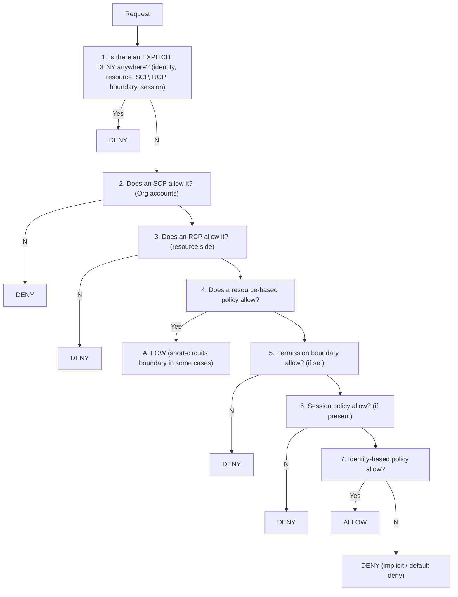
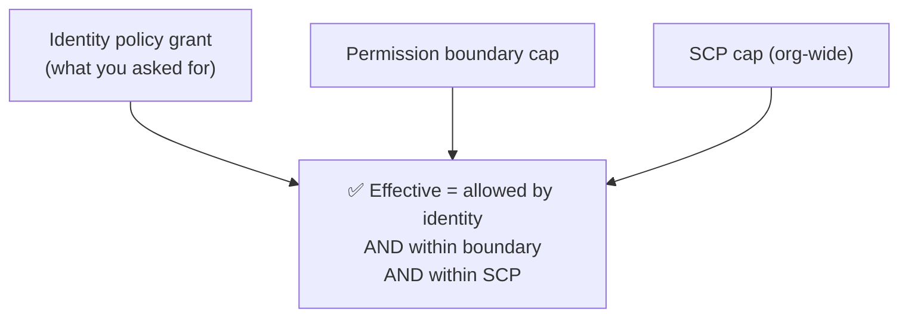

# AWS IAM Deep Dive: Identities, Policies and Access Control

IAM (Identity and Access Management) is the control plane for *who can do what*
across every AWS service. It is a global, free, and — critically — **eventually
consistent** distributed system that fronts almost every AWS API call with an
authorization decision. In an interview, IAM is rarely the headline topic; it is
the thing a strong candidate weaves through every design: "the service assumes a
role scoped to this table," "we isolate blast radius with an SCP at the OU," "the
third-party integration uses an external ID to avoid the confused-deputy problem."
The bar is not "can you write a policy" — it is "can you reason about the *trust
model*, the *evaluation logic*, and the *trade-offs* of coarse vs fine-grained
access, long-lived keys vs short-lived STS credentials, and account isolation vs
in-account IAM."

The mental model that unlocks IAM: **every request is DENY by default, and access
is granted only if some policy explicitly allows it AND no policy explicitly denies
it AND every applicable "guardrail" (SCP, RCP, permission boundary, session policy)
also allows it.** Identity-based and resource-based policies *grant*; SCPs, RCPs,
permission boundaries, and session policies *cap*. Grants are a union; caps are an
intersection; an explicit `Deny` beats everything. If you internalize "default
deny, allow is additive, deny and boundaries are subtractive," most IAM design
questions become mechanical.

---

## IAM users, groups, and roles

The three core identity primitives — and knowing when each is appropriate is a
frequent screening question.

- **IAM user** = a *persistent* identity for a single human or a legacy
  application. A user has a name, optional console password, and up to **two**
  long-lived **access keys** (an access key ID + secret). Users are the classic
  source of security incidents because their keys never expire unless someone
  rotates them.
- **IAM group** = a *collection of users* used purely to attach policies at scale
  (e.g. `Developers`, `Admins`). Groups are **not** an identity — you cannot make a
  group a principal, you cannot nest groups, and a role cannot be "in" a group. A
  user can belong to up to **10** groups (default quota).
- **IAM role** = an identity with **no long-lived credentials**. Instead it has a
  **trust policy** (who may assume it) and one or more **permissions policies**
  (what it can do). Anyone/anything the trust policy allows calls `sts:AssumeRole`
  and receives **temporary credentials** that expire (15 min – 12 h). Roles are how
  EC2 instances, Lambda functions, ECS tasks, EKS pods, federated users, and
  cross-account principals get permissions.

**Why roles beat users for workloads.** A role's credentials are short-lived and
auto-rotated, so a leaked credential is useful only until it expires; there is no
secret sitting in an environment variable or a checked-in `.env` waiting to be
exfiltrated. This is the single most-repeated IAM best practice: **prefer roles and
STS over IAM users with access keys.** The modern guidance goes further — use **IAM
Identity Center** for human access and **roles** for workloads, and treat IAM users
as a legacy escape hatch (e.g. an on-prem system that genuinely cannot federate).

**Trade-offs.**
- *IAM user with access keys*: simplest to wire up (just export two env vars), works
  from anywhere with no federation setup. You give up rotation hygiene, auditability
  (keys don't tell you *who* used them), and you accept indefinite blast radius on
  leak. Pick only when the caller truly cannot obtain temporary credentials.
- *IAM role*: no standing secret, automatic rotation, session-scoped, fully audited
  by session name in CloudTrail. You give up simplicity — you must set up a trust
  relationship and the caller must be able to `AssumeRole` (or run on a service that
  injects credentials). Pick this by default for anything running inside or
  federating into AWS.

Quotas worth remembering: up to **5,000 IAM users** per account (a **hard cap** that
cannot be raised — hitting it is a signal to federate, not to file a limit increase)
and a default of **1,000 IAM roles** per account (adjustable via a quota increase),
**10 managed policies** attachable per identity (adjustable to 20), and an
inline/managed policy character budget. When you approach the user cap you are
usually being told to **move to federation / multi-account with Organizations**,
not to raise the limit.

---

## Roles, STS, and temporary credentials

**STS** (Security Token Service) mints the temporary credentials that make roles
work. The core operation is `sts:AssumeRole`: the caller presents its own identity,
STS checks the target role's **trust policy**, and — if allowed — returns an
`AccessKeyId`, `SecretAccessKey`, and a `SessionToken` valid for a bounded time.

**Key STS limits (memorize these — interviewers probe them):**
- Session duration: **15 minutes minimum, 12 hours maximum**. The role's
  `MaxSessionDuration` setting (1–12 h) caps it; default requested duration is
  **1 hour** (3600 s).
- **Role chaining** (using one role's credentials to assume another role) is
  **capped at 1 hour** regardless of `MaxSessionDuration`, and it resets the
  session — a common gotcha.
- You can pass **session policies**: up to **10 managed policy ARNs** plus one inline
  policy, with the combined plaintext limited to **2,048 characters** (and a separate
  *packed* binary limit surfaced as `PackedPolicySize`).
- **Session tags**: up to **50**; **transitive** tags persist across role chaining.

**How workloads get role credentials without ever calling AssumeRole themselves:**
- **EC2 instance profile** — a container that attaches a role to an EC2 instance.
  The instance retrieves rotating credentials from the **Instance Metadata Service
  (IMDS)**. Always use **IMDSv2** (session-token, hop-limit) to defend against SSRF
  credential theft — the classic Capital One-style attack vector.
- **Lambda execution role** — assumed by the Lambda service on your behalf; the
  credentials appear as env vars inside the function. No keys to manage.
- **ECS task role** — per-task credentials delivered via a link-local endpoint;
  distinct from the EC2 instance role so tasks don't inherit host permissions.
- **IRSA (IAM Roles for Service Accounts) / EKS Pod Identity** — maps a Kubernetes
  service account to an IAM role via an **OIDC** provider (IRSA) or an EKS add-on
  (Pod Identity). Each pod gets its own scoped, short-lived credentials instead of
  sharing the node's instance-profile role — a huge least-privilege win in
  multi-tenant clusters.

**Other STS operations:** `AssumeRoleWithWebIdentity` (OIDC — Cognito, Google,
mobile apps, IRSA), `AssumeRoleWithSAML` (enterprise IdP), `GetSessionToken` (MFA for
an IAM user), `GetFederationToken`. `GetCallerIdentity` is the harmless "whoami" that
even a fully-denied principal can call.

**Trade-offs.**
- *Short session (15 min)* minimizes leak window but increases `AssumeRole` call
  volume and forces refresh logic; STS has generous but real throttling limits.
- *Long session (12 h)* is convenient for interactive/batch work but widens the
  window a stolen token is valid — and you **cannot revoke an issued STS token**
  early except by attaching an `AWSRevokeOlderSessions`-style deny using
  `aws:TokenIssueTime`, or by deleting/denying the role. This "you can't un-issue a
  token" fact is a favorite gotcha.
- *Instance profile role* vs *baking keys into the AMI*: the instance profile is
  strictly better (rotation, no secret at rest) — there is essentially never a good
  reason to bake long-lived keys into an image.

---

## Policy types and structure

An IAM policy is a JSON document of one or more **statements**, each with:
`Effect` (`Allow`/`Deny`), `Action` (service:operation), `Resource` (ARN(s)),
optional `Principal` (only in resource-based/trust policies), and optional
`Condition`. There are **six** policy types, and knowing what each *does to the
decision* is the crux of the whole topic:

| Policy type | Attached to | Effect on decision | Grants or caps |
|---|---|---|---|
| **Identity-based** | user, group, role | what the identity may do | Grant |
| **Resource-based** | resource (S3 bucket, SQS, KMS key, role trust) | who may touch the resource | Grant (+ cross-account) |
| **SCP** (Service Control Policy) | OU/account in Organizations | max permissions for principals in the account | Cap |
| **RCP** (Resource Control Policy) | OU/account in Organizations | max permissions *on resources* in the account | Cap |
| **Permission boundary** | user or role | max permissions that identity's policies can grant | Cap |
| **Session policy** | passed at `AssumeRole` time | further narrows this session | Cap |

Two more structural facts interviewers like: **managed policies** (AWS-managed or
customer-managed, reusable, versioned, up to 5 versions) vs **inline policies**
(1:1 embedded, deleted with the identity, no reuse). Prefer customer-managed for
reuse and central change; use inline only when you need a strict 1:1 lifecycle.

**Trust policy = a resource-based policy on a role.** This is why "who can assume
this role" and "what can this role do" are *two separate documents*. A common
mistake is putting the permissions in the trust policy or vice versa.

**What a real identity policy looks like.** Prose hides the shape; here is a
minimal, tightly-scoped identity policy (attached to a role or user). Note there is
**no `Principal`** — identity policies say only *what*, never *who*:

```jsonc
{
  "Version": "2012-10-17",          // the policy language date, NOT "today" — always this literal
  "Statement": [{
    "Effect": "Allow",              // Allow or Deny
    "Action": ["s3:GetObject",      // exact operations, not s3:*
               "s3:PutObject"],
    "Resource": "arn:aws:s3:::acme-reports/2026/*",  // one prefix, not "*"
    "Condition": {                  // extra guardrail: only over TLS
      "Bool": { "aws:SecureTransport": "true" }
    }
  }]
}
```

Read it as: *this identity may Get/Put objects under the `2026/` prefix of the
`acme-reports` bucket, and only over HTTPS.* Every load-bearing field (`Action`
list, ARN prefix, the `Condition`) is a lever for least privilege — widening any
one of them widens blast radius.

---

## Policy evaluation logic

The exact order matters and is a top expert-level question. AWS evaluates a request
by gathering **all** applicable policies and applying this decision flow:



> [!WARNING]
> This flowchart is a **simplified linearization** — a memory aid, not the wire
> protocol. AWS actually evaluates *all* applicable policies together; there is no
> guaranteed left-to-right ordering you can quote. In particular, the "resource-based
> allow short-circuits the boundary/identity check" step only holds cleanly for a
> **same-account** principal; for **cross-account**, and differently for an IAM user
> vs an assumed-role session, the identity side must *also* allow. If an interviewer
> pushes, say "AWS gathers everything and applies these rules" — don't assert a fixed
> numeric order.

The rules distilled:

1. **Default deny.** No policy → denied.
2. **Explicit `Deny` always wins** — it can never be overridden by any `Allow`,
   in any policy type. This is the primary tool for hard guardrails.
3. **Grants are a UNION.** Within the same account, if the identity-based policy OR
   the resource-based policy allows an action, it's allowed.
4. **Caps are an INTERSECTION.** SCPs, RCPs, permission boundaries, and session
   policies each independently *reduce* the effective set — the action must be
   allowed by the identity policy AND survive every applicable cap.
5. **SCPs/RCPs don't grant.** An SCP allowing `s3:*` does nothing on its own; you
   still need an identity-based allow. SCPs only ever *remove* permissions from
   principals in member accounts (they don't apply to the management account's root
   in the same way, and don't affect service-linked roles).

**Cross-account subtlety.** For a same-account request, a resource-based `Allow` is
enough by itself. For a **cross-account** request, you need **both** an allow in the
*caller's* account (identity policy allowing the action) **and** an allow in the
*resource's* account (resource-based policy naming the caller) — because each account
independently authorizes. This "both sides must say yes across accounts" rule is a
staple advanced question.

### Three requests, worked end-to-end

Nothing cements the rules like running concrete requests through the machine. In
each, the request is `s3:GetObject` on `arn:aws:s3:::acme-reports/q3.csv`.

**Request 1 — same account, identity allows but an SCP denies.**
- Identity policy on the role: `Allow s3:GetObject` on the bucket. ✅
- SCP on the account's OU: `Deny s3:*` outside region `us-east-1`; the call targets
  `eu-west-1`. ❌
- Trace: is there an explicit deny anywhere? **Yes — the SCP's `Deny`.** Explicit
  deny wins before we ever confirm the identity allow matters.
- **Outcome: DENY.** The identity allow is irrelevant; a cap that *denies* is
  absolute. (Had the SCP merely *not allowed* the region, same result — SCPs
  intersect, so anything they don't permit is implicitly denied for member accounts.)

**Request 2 — cross-account, only one side says yes.**
- Caller is a role in account **A**; bucket lives in account **B**.
- A's identity policy: `Allow s3:GetObject` on B's bucket. ✅ (caller side)
- B's bucket policy: does **not** name account A as a principal. ❌ (resource side)
- Trace: cross-account needs an allow in *both* accounts. B never granted A anything,
  so B's side is an implicit (default) deny.
- **Outcome: DENY.** Fix it by adding a bucket-policy statement in B naming A's role
  (or account) as `Principal`. Only when *both* A-allows and B-allows is it ALLOW.

**Request 3 — same account, explicit deny beats a grant union.**
- Identity policy: `Allow s3:GetObject` on the bucket. ✅
- Bucket policy: `Allow s3:GetObject` to this account too (grants are a union, so
  either alone would do). ✅✅
- But a second bucket-policy statement: `Deny s3:GetObject` when
  `aws:SecureTransport` is `false`, and this request came over plain HTTP. ❌
- Trace: two allows would normally union to ALLOW — but the explicit `Deny` matches,
  and **explicit deny can never be overridden**.
- **Outcome: DENY.** Retry over HTTPS and the deny no longer matches, leaving two
  allows → ALLOW. This is exactly why `aws:SecureTransport` denies are a cheap,
  bullet-proof TLS mandate.

---

## Least privilege and policy conditions

**Least privilege** = grant only the actions, on only the resources, under only the
conditions actually needed. IAM gives you three axes to tighten:

1. **Action scoping** — list explicit actions (`s3:GetObject`, not `s3:*`).
2. **Resource scoping** — name specific ARNs (a bucket, a key prefix, one table),
   not `Resource: "*"`.
3. **Condition scoping** — the `Condition` block with **condition keys** and
   operators, the sharpest tool for real least privilege.

**Condition keys** you should be able to name:
- `aws:SourceIp` / `aws:VpcSourceIp` — network fencing.
- `aws:SourceVpc`, `aws:SourceVpce` — restrict to a specific VPC / VPC endpoint.
- `aws:PrincipalOrgID` — allow only principals from **your** Organization (a
  powerful, one-line way to prevent access from outside accounts).
- `aws:SourceArn` / `aws:SourceAccount` — the confused-deputy defenses.
- `aws:MultiFactorAuthPresent`, `aws:MultiFactorAuthAge` — require MFA.
- `aws:RequestTag`/`aws:ResourceTag`/`aws:PrincipalTag` — the basis of **ABAC**
  (Attribute-Based Access Control): grant access when a tag on the principal matches
  a tag on the resource, so one policy scales to thousands of resources without edits.
- `aws:SecureTransport` — force TLS.
- `aws:CurrentTime`, `s3:prefix`, `dynamodb:LeadingKeys` (row-level security).

**ABAC in one concrete policy.** The "tag on principal matches tag on resource"
idea is worth seeing as an actual `Condition`. This single statement lets *any*
principal act on *any* table whose `team` tag equals the caller's own `team` tag:

```jsonc
{
  "Effect": "Allow",
  "Action": ["dynamodb:GetItem", "dynamodb:PutItem"],
  "Resource": "*",                              // scoping is done by the tag, not the ARN
  "Condition": {
    "StringEquals": {
      // resource's team tag == the principal's team tag
      "aws:ResourceTag/team": "${aws:PrincipalTag/team}"
    }
  }
}
```

Trace it: a principal tagged `team=payments` calling `GetItem` on a table tagged
`team=payments` → `payments == payments` → **Allow**. The same principal hitting a
table tagged `team=fraud` → `fraud == payments` is false → **implicit deny**. One
policy, unchanged, correctly gates thousands of tables — but note the whole thing
collapses if someone can mislabel a resource's `team` tag, which is why ABAC lives
or dies by tag governance.

**ABAC vs RBAC trade-off.** RBAC (a role/policy per job function) is explicit and
easy to audit but explodes in policy count as teams and resources grow. ABAC scales
to huge fleets with a *single* policy ("you may act on resources tagged with your
team"), enabling self-service — but it is only as trustworthy as your **tag
governance**; a mis-applied or attacker-controlled tag becomes a privilege
escalation. Use ABAC when you have disciplined, enforced tagging (often paired with
SCPs that lock tag keys); use RBAC when auditability and a small, stable set of roles
matter more.

---

## Permission boundaries

A **permission boundary** is a managed policy attached to a *user or role* that sets
the **maximum** permissions that identity's own policies can ever grant. Effective
permissions = **intersection** of (identity-based policies) ∩ (permission boundary).
It never grants anything by itself.

**Worked intersection.** Say a role's identity policy allows `s3:*` **and**
`ec2:*`, but its permission boundary allows `s3:*` only:

```
identity policy : { s3:*, ec2:* }
boundary        : { s3:* }
effective       : { s3:*, ec2:* } ∩ { s3:* }  =  { s3:* }
```

So a call to `s3:GetObject` → in identity ✅ and in boundary ✅ → **Allow**. A call
to `ec2:RunInstances` → in identity ✅ but **not** in boundary ❌ → **Deny**. The
boundary clipped away `ec2:*` even though the identity policy tried to grant it —
and if instead the boundary allowed `ec2:*` but the identity policy didn't, the
answer is still Deny (intersection needs *both* sides to allow). A boundary only
ever shrinks the set, never enlarges it.

Because the identity grant, the boundary, and the SCP all intersect, the effective
set is only the region where all three overlap:



The killer use case is **safe permission delegation**: you let developers create
roles and attach policies (self-service, fast), but you require — via an SCP or a
condition on `iam:CreateRole`/`iam:PutRolePolicy` using `iam:PermissionsBoundary` —
that every role they create carries a specific boundary. Now a developer *cannot*
create a role more powerful than the boundary, even if they attach `AdministratorAccess`
to it. This is how platform teams give autonomy without handing out escalation.

**Boundary vs SCP.** Both are caps and both use intersection, but:
- SCP applies to **all** principals in an **account/OU** (org-wide guardrail).
- Boundary applies to **one specific** user/role (delegation guardrail).
- SCPs require AWS Organizations; boundaries work in a standalone account.
Use SCPs for org-wide "these accounts may never use region X / disable CloudTrail";
use boundaries for "this dev-created role may never exceed these permissions."

---

## Service control policies and resource control policies

**SCPs** and **RCPs** are **AWS Organizations** features that apply org-wide
guardrails. Neither grants access — both only *filter*.

- **SCP** filters what **principals in member accounts** can do. Classic uses:
  deny leaving the org, deny disabling CloudTrail/GuardDuty/Config, deny actions
  outside approved regions (data residency), deny root user actions, enforce
  encryption. An SCP attaches at the **root**, an **OU**, or an **account**, and the
  effective SCP is the *intersection* down the tree (an allow must exist at every
  level from root to the account).
- **RCP** (launched Nov 2024) filters what can be done **to resources** in member
  accounts, *regardless of who the principal is* — including external principals and
  even AWS service principals. The flagship use: enforce `aws:PrincipalOrgID` on
  **every** S3 bucket and SQS/KMS/STS resource in the org at once, so no data can be
  accessed from outside your org even if someone writes a sloppy bucket policy.

**What a region-lock SCP looks like.** The canonical guardrail — "these accounts
may only operate in approved regions" — is a `Deny` with a `NotEquals` on the
request's region:

```jsonc
{
  "Version": "2012-10-17",
  "Statement": [{
    "Sid": "DenyOutsideApprovedRegions",
    "Effect": "Deny",
    "NotAction": [ "iam:*", "sts:*", "cloudfront:*" ], // global services have no region — don't trap them
    "Resource": "*",
    "Condition": {
      "StringNotEquals": {
        "aws:RequestedRegion": [ "us-east-1", "eu-west-1" ]
      }
    }
  }]
}
```

Trace it: an `ec2:RunInstances` in `us-east-1` → requested region *is* in the
allowed list → the `StringNotEquals` is false → the `Deny` does **not** fire → the
call proceeds (subject to the account's other allows). The same call in `ap-south-1`
→ region not in the list → `StringNotEquals` true → **Deny fires → blocked
org-wide**, unbypassable by any identity policy. The `NotAction` carve-out matters:
without it you'd also deny global services like IAM (whose requests carry no region),
locking the account out of itself.

**SCP vs RCP mental model:** SCP = a cap on your *identities* (the caller side);
RCP = a cap on your *resources* (the resource side). Together they let you assert
"only my org's principals, and only from approved contexts, can ever touch my org's
data" — the backbone of a data-perimeter / zero-trust posture.

**Trade-offs and pitfalls.** SCPs are blunt — a too-broad deny can break
service-linked roles or lock out automation, and because they *only subtract*, an
empty/`FullAWSAccess`-only SCP is the safe default. The `FullAWSAccess` policy AWS
attaches by default is what makes accounts usable; if you replace it with a
restrictive allow-list SCP you must enumerate every needed service or you'll break
things. There is a limit of **5 SCPs per entity** and document-size limits, so
guardrails must be composed carefully.

---

## Resource-based policies and the confused deputy problem

**Resource-based policies** live on the *resource* and name a `Principal`. The most
common are **S3 bucket policies** and **KMS key policies**; others include SQS
queue policies, SNS topic policies, Lambda resource policies, ECR, Secrets Manager,
API Gateway, and the **role trust policy**.

Two properties make them special:
1. They can grant **cross-account** access directly (the resource says "account B
   may read me") — no role assumption needed for the resource side.
2. **KMS is unusual:** a KMS key's **key policy is authoritative** — IAM identity
   policies do **not** grant access to a key unless the key policy also delegates to
   IAM (the standard `"Enable IAM policies"` statement with the account root as
   principal). Forget that statement and you can lock everyone (including yourself)
   out of the key. This is a frequent gotcha.

**What an org-fenced bucket policy looks like.** The single most useful resource
policy pattern — allow the whole org, deny everyone else — is one `Condition` key:

```jsonc
{
  "Version": "2012-10-17",
  "Statement": [{
    "Effect": "Allow",
    "Principal": "*",                    // "anyone" — but the Condition below fences it hard
    "Action": "s3:GetObject",
    "Resource": "arn:aws:s3:::acme-reports/*",
    "Condition": {
      "StringEquals": { "aws:PrincipalOrgID": "o-abc123def4" } // ONLY principals in this org
    }
  }]
}
```

Trace it: a role in one of your org's accounts calls `GetObject` →
`aws:PrincipalOrgID` on the request is `o-abc123def4` → matches → **Allow**. A
principal in a stranger's account (or an anonymous internet request) → its
`aws:PrincipalOrgID` is absent or different → `StringEquals` fails → **Deny**. That
`Principal: "*"` looks scary in isolation but is safe *because* the condition
collapses it to "my org only" — which is exactly why the pitfalls section warns
never to write `Principal: "*"` *without* such a condition.

**S3 access control precedence:** among bucket policy, IAM policy, and (legacy) ACLs,
an explicit deny anywhere wins; grants are a union. Modern best practice is **Block
Public Access on by default**, disable ACLs (bucket owner enforced), and control
everything through bucket + IAM policies.

### The confused deputy problem

A **confused deputy** is a privileged intermediary tricked into using its authority
on behalf of an attacker. In AWS, the canonical case: you grant a **third-party
SaaS** a role in your account so it can, say, read your S3 metrics. The vendor uses
one shared role ARN pattern for all customers. If an attacker learns your account/
role, they could ask the vendor's service to assume *your* role — the vendor is the
confused deputy.

**Defenses:**
- **External ID** — the vendor requires a unique, per-customer secret string in the
  trust policy `Condition` (`sts:ExternalId`). The attacker doesn't know your
  external ID, so they can't get the vendor to assume your role. This is the standard
  cross-account third-party pattern. The role's **trust policy** (a resource-based
  policy — note it *does* carry a `Principal`) looks like:

  ```jsonc
  {
    "Version": "2012-10-17",
    "Statement": [{
      "Effect": "Allow",
      "Principal": { "AWS": "arn:aws:iam::444455556666:root" }, // the SaaS vendor's account
      "Action": "sts:AssumeRole",
      "Condition": {
        "StringEquals": {
          "sts:ExternalId": "acme-tenant-9f3c1"   // YOUR unique secret; the vendor must send it
        }
      }
    }]
  }
  ```

  Trace the attack with this in place: attacker knows your role ARN and asks the
  vendor's shared service to assume it — but the vendor only presents *its other
  customer's* external ID (or none), so `sts:ExternalId` fails the `StringEquals`
  match → **AssumeRole denied**. Only a request carrying `acme-tenant-9f3c1`
  succeeds, and that value never leaves the you↔vendor setup.
- **`aws:SourceArn` / `aws:SourceAccount` conditions** — on service-to-service
  resource policies (e.g. an S3 bucket policy allowing CloudTrail, or a KMS key used
  by SNS), pin the *specific* source resource/account so another customer's resource
  can't induce the service to act on your resource.

**Trade-off:** external IDs and source conditions add setup friction and must be
kept secret/consistent, but they are the difference between a scoped integration and
an org-wide breach. Never trust just the service principal alone for cross-account
service integrations.

---

## Cross-account access patterns

Three main patterns, each with distinct trade-offs:

1. **AssumeRole (role in the target account).** Account B creates a role trusting
   account A; A's principals assume it and act *as* B. Pros: temporary creds, single
   place to manage, full CloudTrail attribution via session name, works for any
   service. Cons: caller must support role assumption; role chaining caps at 1 h.
   **The default and recommended pattern.** Both sides must say yes:

   ```mermaid
   sequenceDiagram
       participant P as Principal in Account A
       participant STS
       participant Role as Role in Account B
       P->>P: 1. A's identity policy allows sts:AssumeRole on B's role ARN? (caller side)
       P->>STS: 2. AssumeRole(arn of B's role)
       STS->>Role: 3. Role's trust policy in B allows Principal = A? (resource side)
       Role-->>STS: yes
       STS-->>P: 4. temporary creds (AccessKeyId, SecretAccessKey, SessionToken)
       P->>Role: 5. act as B, scoped by B-role's permissions policies
   ```

   If step 1 fails, A never gets to call; if step 3 fails, STS returns
   `AccessDenied`. Only when *both* the caller-side allow and the resource-side trust
   line up does A receive credentials — the same "both sides say yes" invariant as
   the cross-account resource-policy case.
2. **Resource-based policy (grant the external account directly).** The S3
   bucket/SQS queue/KMS key policy names account A as principal. Pros: no assumption
   step, A uses its *own* credentials; good for data sharing (S3, SNS→SQS fan-out).
   Cons: only works for services that support resource policies; access is scoped to
   that one resource; **cross-account requires an allow on both sides**.
3. **IAM Identity Center / RAM / VPC sharing** for human access and network-level
   sharing — outside pure IAM but often the right answer for "how do humans get into
   many accounts."

**Guardrail:** wrap all of the above with `aws:PrincipalOrgID` conditions or RCPs so
"cross-account" means "cross-account *within my org*," not "anyone on the internet
who guesses an ARN."

---

## Federation with SAML, OIDC, and IAM Identity Center

**Federation** lets identities from an external IdP get AWS access **without IAM
users**. Three flavors:

- **SAML 2.0 federation** — enterprise IdP (Active Directory via ADFS, Okta, Ping).
  The IdP asserts the user; AWS maps the SAML assertion to a role via
  `AssumeRoleWithSAML`. Good for classic corporate SSO to the AWS console/CLI.
- **OIDC / Web Identity federation** — for web/mobile apps and Kubernetes (IRSA).
  `AssumeRoleWithWebIdentity` exchanges an OIDC token (Cognito, Google, your own
  OIDC provider) for role credentials. Avoids embedding AWS keys in client apps.
- **IAM Identity Center** (formerly AWS SSO) — the **modern, recommended** front door
  for **human** access across an Organization. It connects to your IdP once,
  provisions users/groups (SCIM), and grants **permission sets** (which are just
  managed role definitions replicated into member accounts). Users get short-lived
  credentials via the access portal or `aws sso login`. It replaces per-account IAM
  users and hand-rolled SAML for the common case.

**Trade-offs.** Raw SAML/OIDC federation is flexible and works when you can't adopt
Identity Center, but you manage the trust and role mappings per account — tedious at
scale. Identity Center centralizes this (one place to assign "who gets which
permission set in which accounts") at the cost of adopting Organizations and its
model. For workloads, OIDC (IRSA/web identity) beats any long-lived key; for humans,
Identity Center beats IAM users.

---

## IAM Access Analyzer

**Access Analyzer** uses **automated reasoning** (provable security, based on the
Zelkova engine) to answer "who can access this?" It has three main capabilities:

- **External access findings** — continuously scans resource-based policies (S3,
  IAM roles, KMS, Lambda, SQS, Secrets Manager, etc.) and flags any resource
  reachable by a principal **outside your account or organization** (your **zone of
  trust**). This catches the accidental public bucket or over-broad trust policy.
- **Unused access findings** — flags roles, users, access keys, and permissions that
  haven't been used in a configurable window, driving least-privilege cleanup.
- **Policy generation and validation** — generates a least-privilege policy from
  **CloudTrail** activity, and **validates** policies against 100+ checks and
  security warnings (including finding policies that grant broader access than
  intended). It can also do **custom policy checks** in CI/CD (e.g. "fail the build
  if this change grants new external access").

**Why it matters in design:** it operationalizes least privilege. Instead of humans
eyeballing wildcards, provable-security tooling mathematically confirms whether a
policy permits external access. **Trade-off:** it detects and advises but doesn't
enforce — you still need SCPs/RCPs/boundaries for prevention; Access Analyzer is
detection + right-sizing, not a control.

---

## Coarse-grained versus fine-grained policies

A core design tension.

- **Coarse-grained** (`s3:*` on `*`, one big admin-ish role per team): fewer
  policies to write, fast to move, rarely blocks legitimate work. But it maximizes
  blast radius — a compromised or buggy workload can do far more than it should — and
  it fails audits. Sometimes correct for a throwaway sandbox account.
- **Fine-grained** (explicit actions, specific ARNs, conditions, per-workload
  roles): minimizes blast radius, satisfies compliance, and makes CloudTrail
  meaningful. Costs more effort to author/maintain, and over-tightening causes
  `AccessDenied` fire drills and slows delivery.

**How to resolve it in practice (and in interviews):** *segment blast radius with
accounts, then use fine-grained IAM inside each account, and enforce the outer
bounds with SCPs/RCPs/boundaries so mistakes can't escape the guardrail.* Start from
AWS-managed policies or Access Analyzer-generated policies and tighten from real
usage rather than hand-authoring from scratch. Reserve coarse grants for genuinely
low-value, isolated accounts.

---

## How IAM enables zero-trust

**Zero-trust** = never trust based on network location alone; authenticate and
authorize every request with strong identity and continuous verification. IAM is the
AWS enforcement point:

- **Identity on every call.** Every AWS API request is signed (SigV4) and
  authorized individually — there is no "inside the VPC so it's trusted" bypass for
  the AWS control plane.
- **Short-lived credentials** (roles/STS) instead of standing secrets shrink the
  window of compromise.
- **Conditions** enforce context: require MFA (`aws:MultiFactorAuthPresent`), pin to
  a VPC endpoint (`aws:SourceVpce`), require your org (`aws:PrincipalOrgID`), require
  TLS (`aws:SecureTransport`).
- **Data perimeter**: SCPs (identities can only act within the org) + RCPs (resources
  only accept the org's principals) + VPC endpoint policies (network path) together
  assert "trusted identities, trusted resources, trusted networks."
- **Least privilege + continuous verification** via Access Analyzer unused-access
  findings.

**Trade-off:** a strict data perimeter can break legitimate third-party integrations
and cross-org sharing, so you carve deliberate exceptions (specific external IDs,
specific accounts) rather than loosening the whole guardrail.

---

## Common pitfalls

The mistakes interviewers love to hear you avoid:

- **Wildcards** (`Action: "*"`, `Resource: "*"`, `Principal: "*"`). A `Principal:
  "*"` on a resource policy without a tight `Condition` (e.g. `aws:PrincipalOrgID`)
  is effectively public. Wildcards in actions grant future permissions you never
  reviewed.
- **`iam:PassRole` abuse.** To let a service (EC2, Lambda, ECS, CodeBuild) *use* a
  role, a principal needs `iam:PassRole` for that role. If you grant `iam:PassRole`
  on `Resource: "*"`, a user who can launch compute can pass **any** role — including
  admin — to a service they control and escalate to full admin. Always scope
  `PassRole` to specific role ARNs and use the `iam:PassedToService` condition.
- **Overly broad `AssumeRole` trust** (trusting a whole account, or `Principal:
  {"AWS": "*"}`) — combine with `sts:ExternalId` / `aws:PrincipalOrgID`.
- **Long-lived access keys** in code, CI, laptops, or AMIs; not rotating them; not
  using IMDSv2.
- **Forgetting the KMS key policy** delegation and locking yourself out.
- **Confusing trust policy with permissions policy.**
- **Relying on SCPs to grant** (they only cap) or forgetting SCPs don't restrict the
  management account the same way.
- **Assuming IAM changes are instant** — IAM is eventually consistent; a new
  policy/role/key can take seconds to propagate globally, so retry `AccessDenied`
  right after creation.
- **Privilege-escalation actions** beyond PassRole: `iam:CreatePolicyVersion`,
  `iam:AttachUserPolicy`, `iam:PutUserPolicy`, `iam:UpdateAssumeRolePolicy`,
  `sts:AssumeRole` chains — a principal with these can grant itself more.

---

## Trade-offs and when to use what

A consolidated decision guide.

| Question | Use this | Instead of | Because |
|---|---|---|---|
| App running on AWS needs perms | Role (instance profile / task role / Lambda role / IRSA) | IAM user + keys | short-lived, auto-rotated, no secret at rest |
| Human access to many accounts | IAM Identity Center permission sets | IAM users per account | central assignment, SSO, short-lived creds |
| Third-party SaaS into your account | Cross-account role + **external ID** | IAM user handed to vendor | prevents confused deputy, no shared secret |
| Org-wide "never allowed" rule | SCP (identities) / RCP (resources) | editing every policy | one guardrail, can't be escaped |
| Let devs self-serve roles safely | Permission boundary (required via SCP) | trusting them not to over-grant | caps what created roles can do |
| Share one bucket with account B | Bucket policy naming B (+ org condition) | building a role assumption flow | simpler for pure data access |
| Scale access to 10k tagged resources | ABAC with tag conditions | a policy per resource (RBAC) | one policy, self-service; needs tag governance |
| Find accidental external access | Access Analyzer external-access findings | manual policy review | provable security, continuous |
| Encrypt with cross-account KMS | Key policy + grants, key policy authoritative | IAM policy alone | KMS key policy must delegate first |
| Data residency / region lock | SCP denying non-approved regions | per-role region conditions | enforced org-wide, can't be bypassed |

**The through-line for interviews:** *isolate blast radius with multiple accounts;
grant least privilege with fine-grained, role-based, condition-scoped policies;
prefer short-lived STS credentials over any long-lived key; enforce the outer bounds
with SCPs, RCPs, and permission boundaries; and verify continuously with Access
Analyzer and CloudTrail.* Then, for any specific choice, be ready to state what you
gain, what you give up, and when the alternative wins.

---

## Common interview follow-up questions

- Walk me through exactly how AWS decides to allow or deny an API call when there's
  an identity policy, a resource policy, an SCP, and a permission boundary all in
  play. Where does an explicit deny fit?
- Why are IAM roles preferred over IAM users for applications? What specifically do
  you lose by shipping long-lived access keys?
- A third party wants a role in your account to read metrics. How do you set the
  trust policy safely, and what is the confused-deputy problem?
- What's the difference between an SCP, a permission boundary, and a session policy?
  All three "restrict" — when do you reach for each?
- How would you let application teams create their own IAM roles without letting them
  create admin roles?
- Explain `iam:PassRole` and how it becomes a privilege-escalation path if scoped to
  `*`.
- Cross-account access: what has to be true in *both* accounts, and how do RCPs and
  `aws:PrincipalOrgID` build a data perimeter?
- Why can a KMS key lock you out even when your IAM policy grants `kms:*`?
- When would you choose ABAC over RBAC, and what's the risk of ABAC?
- Design human access across a 200-account org. Where do IAM Identity Center, SCPs,
  and permission boundaries each fit?
- What are the STS session duration limits, and why can you not revoke an
  already-issued temporary credential?

## References

- AWS IAM User Guide — *Policy evaluation logic* and *Determining whether a request
  is allowed or denied within an account*.
- AWS STS API Reference — *AssumeRole*, *AssumeRoleWithSAML*,
  *AssumeRoleWithWebIdentity* (session duration, session policies, session tags).
- AWS IAM User Guide — *Permissions boundaries for IAM entities*, *Session policies*.
- AWS Organizations User Guide — *Service control policies (SCPs)* and *Resource
  control policies (RCPs)*.
- AWS IAM User Guide — *The confused deputy problem*, *How to use an external ID*.
- AWS IAM Access Analyzer documentation — external access, unused access, policy
  generation, custom policy checks; the *Zelkova / provable security* automated
  reasoning background.
- AWS Well-Architected Framework — *Security Pillar* (identity and access
  management, permissions management).
- AWS Prescriptive Guidance — *Data perimeter* and *IAM best practices*.
- AWS Builders' Library and re:Invent deep-dive sessions on IAM policy evaluation,
  data perimeters, and scaling permissions with ABAC.
- EKS User Guide — *IAM roles for service accounts (IRSA)* and *EKS Pod Identity*.
