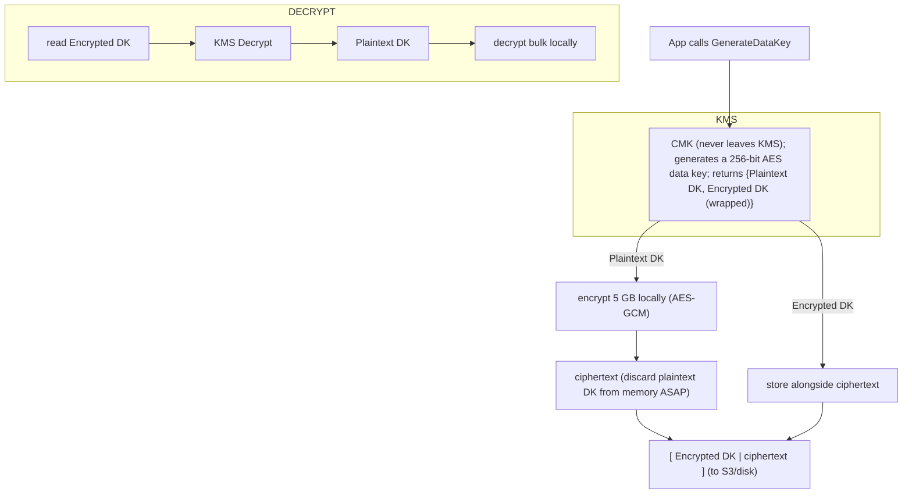
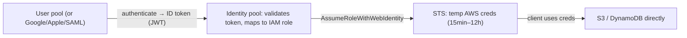

# Data Protection and App Security: KMS, Secrets, Cognito, and WAF

Security in a system-design interview is rarely "is it encrypted?" — it is a chain of
**deliberate trade-offs**: which key custody model, which secret store, which identity
service, which edge defense, and *what you give up* for each. AWS gives you managed
building blocks (KMS, Secrets Manager, Cognito, WAF, Shield, ACM, GuardDuty) so you can
buy security instead of building it — but each block has a cost dimension, a blast
radius, a latency/throughput ceiling, and an ops burden. The senior bar is to reason
about **defense in depth** (layers that fail independently), **least privilege**, and
**where the security control physically lives** relative to your data and your users.

The mental model that unlocks this domain: **security is layered custody.** At rest,
you push encryption down to a key you control the *policy* on (KMS), and you almost
never let a raw key touch your app (envelope encryption). In transit, TLS terminates
somewhere (ACM cert on an ALB/CloudFront) and you decide how far encryption travels
past that point. Secrets are just small pieces of sensitive data with a *rotation
lifecycle*. Identity splits cleanly into **authentication** (who are you — Cognito user
pools, issuing JWTs) and **authorization to AWS** (what AWS resources may you touch —
Cognito identity pools, vending temporary STS credentials). And the edge (WAF + Shield)
filters malicious traffic *before* it costs you compute. Get those five planes straight
and most questions become mechanical.

---

## Encryption at rest versus in transit

**Encryption at rest** protects data sitting on disk (S3 objects, EBS volumes, RDS/Aurora
storage, DynamoDB tables, EFS, snapshots, backups). The threat model is a stolen disk, a
mis-shared snapshot, or an operator reading raw storage. Nearly every AWS storage service
integrates with KMS for server-side encryption (SSE): S3 (SSE-S3 with AWS-owned keys,
SSE-KMS with your keys, or SSE-C with keys you supply per request), EBS (KMS-backed volume
encryption), RDS/Aurora, DynamoDB (encryption at rest is **on by default and cannot be
disabled**), and so on. S3 now applies SSE-S3 as a **default baseline on all new objects**
even if you request nothing.

**Encryption in transit** protects data moving over the network (TLS/HTTPS between client
and ALB/CloudFront/API Gateway, between microservices, to the database). The threat model
is a network eavesdropper or an on-path attacker. You provision certificates (ACM) and
enforce TLS 1.2+/1.3, and you decide **how far** TLS travels: terminate at the edge and go
plaintext inside the VPC (cheaper, simpler, relies on VPC isolation), or re-encrypt to the
backend for true end-to-end (higher CPU, needed for PCI/HIPAA-grade zero-trust).

**Trade-off — where does encryption stop?** Terminating TLS at the ALB and speaking HTTP
to targets is common and acceptable *inside* a trusted VPC, but it means traffic between
the load balancer and your app is plaintext — a compromised host or a mirrored ENI can
read it. Re-encrypting (ALB → HTTPS target, or mTLS between services via App Mesh /
service mesh) gives defense in depth at the cost of extra TLS handshakes and CPU. Pick
end-to-end when regulation or a zero-trust posture demands it; otherwise edge termination
is the pragmatic default.

**Trade-off — at rest is cheap and non-negotiable; in transit needs enforcement.** At-rest
encryption is essentially free performance-wise (AES-NI hardware acceleration, ~single-digit
% overhead) and should always be on. In-transit encryption is only as good as your
*enforcement*: without an `aws:SecureTransport` deny policy on the bucket, or an HTTP→HTTPS
redirect, clients can still connect in the clear. "Encrypted at rest" alone is a common
false comfort — it does nothing against a stolen credential that can call GetObject, which
is why IAM + KMS key policy are the real access control, not the disk cipher.

---

## KMS keys: customer managed, AWS managed, and AWS owned

**AWS Key Management Service (KMS)** is a managed service that creates and controls the
cryptographic keys used to encrypt your data, backed by FIPS 140-2/140-3 validated hardware
security modules. The key material for a symmetric KMS key **never leaves KMS unencrypted**;
you send small payloads to KMS to encrypt/decrypt, or (far more common) you ask KMS for a
*data key* and do bulk crypto yourself (envelope encryption, next section).

Three custody models — this distinction is a favorite interview probe:

| Key type | Who controls the key policy | Rotation | Visible in your account | Cost | Use when |
|---|---|---|---|---|---|
| **Customer managed key (CMK)** | You | Optional auto (default 365d, configurable 90–2560d) or on-demand | Yes (you create it) | $1/key/month + API calls | You need control over policy, rotation, auditing, cross-account grants, or key deletion |
| **AWS managed key** (`aws/service`) | AWS (you can view, not edit policy) | Automatic every ~365 days (was 3 yrs before May 2022) | Yes (auto-created per service) | No monthly key charge; you pay API calls | You want KMS encryption with zero setup and don't need custom policy |
| **AWS owned key** | AWS (invisible) | Managed by AWS | No | Free | The service default; you don't care about key custody at all |

**Symmetric vs asymmetric vs HMAC.** The default symmetric encryption key (256-bit AES-GCM)
covers virtually all "encrypt my data" use cases and supports envelope encryption. Asymmetric
KMS keys (RSA, ECC) are for signing/verification or encryption where the private key must stay
in KMS but the public key is distributed. HMAC keys generate/verify MACs. Only **symmetric
encryption keys with AWS-generated material** support automatic rotation.

**Encrypt API payload limit: 4 KB (4096 bytes).** The KMS `Encrypt` operation only takes up
to 4 KB of plaintext. This is *the* reason you cannot use KMS to directly encrypt a 5 MB file
— you must use envelope encryption. Interviewers use this limit to test whether you actually
understand how KMS is used at scale.

**Trade-off — CMK vs AWS managed key.** CMKs cost $1/month each and add operational surface
(policy, rotation, deletion windows), but they are the only way to: restrict who can decrypt
via a key policy, share encryption cross-account, get per-key CloudTrail auditing, and *revoke
access instantly by disabling the key* (a powerful kill switch). AWS managed keys are free and
zero-touch but you cannot change their policy or use them cross-account. Default to AWS managed
for low-stakes data; use a CMK the moment you need policy control, cross-account sharing, or
compliance evidence of key management.

---

## Envelope encryption and data keys

**Envelope encryption** is the pattern that makes KMS scale to any data size while keeping the
master key in the HSM. The intuition: use a cheap, fast local key to encrypt the bulk data,
then encrypt *that* key with a KMS master key. You store the encrypted data key next to the
ciphertext.

`GenerateDataKey` returns both a **plaintext** data key (use it immediately, then wipe from
memory) and an **encrypted** copy (persist it). To decrypt later, you send only the encrypted
data key to KMS `Decrypt`, get back the plaintext key, and decrypt your bulk data locally.
Data keys are up to 1024 bytes (typically AES-256, 32 bytes).

**Why this matters for design:** the KMS API is only called once per data key, not once per
byte — so a 5 GB object needs *one* KMS call, not millions. This keeps you well under KMS
request quotas and keeps latency low (the expensive network round-trip to KMS happens once).
The **KMS Encryption SDK** and **S3 SSE-KMS with S3 Bucket Keys** automate this. **S3 Bucket
Keys** are a critical cost optimization: instead of calling KMS per object, S3 generates a
short-lived bucket-level key, cutting KMS request costs by up to ~99% for high-object-count
buckets — a common cost-optimization interview answer.

**Trade-off — DEK caching.** Reusing one data key for many objects reduces KMS calls and cost
but violates "use a data key few times" and widens the blast radius if that key leaks. The KMS
SDK's data-key caching lets you bound reuse (max messages / max bytes / max age). Tighter caps
= more KMS calls + cost; looser caps = fewer calls but more exposure. This is the crypto
equivalent of a connection pool sizing decision.

---

## Key policies, grants, and access control

Access to a KMS key is governed by a **key policy** (a resource policy attached to the key) —
and unlike most AWS resources, for KMS the key policy is *authoritative*: IAM policies alone
cannot grant access unless the key policy delegates to IAM (the common `"Enable IAM policies"`
statement that trusts the account root). This is a frequent gotcha: giving a role
`kms:Decrypt` in its IAM policy does **nothing** if the key policy doesn't allow the account
to use IAM for that key.

Three access mechanisms:
- **Key policy** — the primary door; defines key administrators (manage the key) separately
  from key users (use it for crypto). Least privilege means separating these.
- **Grants** — programmatic, temporary, fine-grained delegations (e.g., EBS creates a grant to
  decrypt a volume when attaching). Up to **50,000 grants per key**. Grants are how AWS services
  get scoped, revocable permission on your behalf.
- **IAM policies + grant/encryption context** — `EncryptionContext` is additional authenticated
  data (AAD) bound to the ciphertext; you can require a specific context via policy conditions,
  so a decrypt only succeeds for, say, a specific tenant ID. This is a lightweight multi-tenant
  isolation control.

**Trade-off — key granularity (blast radius vs ops).** One CMK for the whole app is simple but
a single leaked/over-permissioned role can read everything, and disabling the key is
all-or-nothing. A key per tenant / per data class gives tight blast radius and per-tenant kill
switches, but multiplies the $1/month/key cost and the policy-management burden, and you can
hit the 100,000 keys-per-region quota at extreme multi-tenancy. Encryption context is the
middle ground: one key, but cryptographically enforced per-tenant separation without N keys.

---

## Key rotation and multi-Region keys

**Automatic rotation** creates new backing key material on a schedule while keeping the **same
key ID and ARN** — so applications need no code changes and old ciphertext still decrypts
(KMS retains all prior key material and picks the right version automatically). Rotation does
**not** re-encrypt existing data and does **not** rotate the data keys you already generated;
it only changes which material future encrypts use. Default rotation period is 365 days,
configurable **90 to 2560 days**. Only symmetric CMKs with AWS-generated material qualify;
asymmetric/HMAC/custom-key-store keys must be rotated manually (create a new key, repoint
aliases). AWS managed keys rotate every ~365 days automatically (was every 3 years pre-2022).

**Multi-Region keys (MRK)** are a set of interoperable keys — a **primary** in one Region and
**replicas** in others — that share the same key ID (prefixed `mrk-`) and key material.
Ciphertext encrypted in Region A can be decrypted in Region B **without a cross-Region KMS
call**, because both keys share material. Rotation is a shared property managed on the primary
and synced to replicas.

**Trade-off — MRK vs single-Region key.** MRKs are essential for cross-Region DR, active-active
multi-Region apps, and cross-Region backup/replication (e.g., S3 CRR of SSE-KMS objects,
DynamoDB global tables), because otherwise a replica Region cannot decrypt without a call back
to the origin Region (added latency, cross-Region dependency, and a failure coupling — if the
origin Region is down you can't decrypt). The cost: MRKs weaken single-Region isolation (the
same material lives in multiple Regions, so a policy mistake has wider reach) and add sync
considerations. Use single-Region keys by default; adopt MRKs specifically for multi-Region
data mobility. **Alias-based manual rotation across separate per-Region keys** is an
alternative but breaks cross-Region decrypt of the same ciphertext.

---

## CloudHSM versus KMS and custom key stores

**AWS CloudHSM** gives you **single-tenant**, dedicated HSMs (FIPS 140-2 Level 3) that *you*
fully control — you manage users, keys, and the cluster; AWS manages hardware and HA. You
access it via standard PKCS#11, JCE, or CNG/KSP libraries. **KMS** is **multi-tenant** managed
crypto with a simple API and deep AWS-service integration, but AWS operates it and you never
touch the HSM directly.

| Dimension | KMS | CloudHSM |
|---|---|---|
| Tenancy | Multi-tenant, managed | Single-tenant, dedicated cluster |
| FIPS level | 140-2/140-3 validated (Level 3 on newer) | 140-2 Level 3 |
| Who controls keys | AWS operates; you set policy | You fully control (AWS has no access) |
| Integration with AWS services | Native (S3, EBS, RDS, etc.) | Only via KMS custom key store or app code |
| API | Simple AWS API | PKCS#11 / JCE / CNG |
| Ops burden | Minimal | You run/scale the cluster, users, backups |
| Cost | $1/key/mo + calls | ~$1.40+/hr per HSM (much pricier) |
| Use when | 99% of cases | Regulatory requirement for sole custody, custom crypto, offload of non-AWS workloads |

**KMS custom key store** bridges them: KMS is the API front door, but key material lives in
**your CloudHSM cluster** (CloudHSM key store) or a **third-party external HSM** (external key
store / XKS). You keep AWS-service integration *and* sole custody. Up to 10 custom key stores
per account per Region.

**Trade-off.** CloudHSM's benefit is exclusive control and meeting contractual "keys never in a
shared HSM" requirements; its cost is real dollars ($1+/hr/HSM, need ≥2 for HA), operational
responsibility, and *no native service integration* unless you front it with a custom key
store. Reach for CloudHSM/XKS only when a regulator or contract mandates it; otherwise KMS is
strictly less work.

---

## Secrets Manager versus SSM Parameter Store

Both store configuration and secrets, but they trade cost against features.

| Dimension | Secrets Manager | SSM Parameter Store (Standard) | SSM Parameter Store (Advanced) |
|---|---|---|---|
| Primary purpose | Secrets with lifecycle/rotation | Config + secrets (SecureString) | Same, larger/more |
| Built-in rotation | **Yes** (managed Lambda, RDS/Redshift/DocDB native) | **No** (DIY) | No |
| Value size | up to 64 KB (65,536 bytes) | up to 4 KB | up to 8 KB |
| Encryption | KMS (always) | KMS for SecureString | KMS for SecureString |
| Cost | **$0.40/secret/mo + $0.05/10k API calls** | **Free** (standard params) | $0.05/advanced param/mo + API |
| Cross-account/cross-Region | Yes (replication, resource policy) | Limited | Limited |
| Versioning | Yes (staging labels) | Yes (history) | Yes + policies (TTL/expiration) |
| Max count | 500,000 secrets/region | 10,000 standard params | higher |
| Default read TPS | GetSecretValue 10,000/s | ~40 TPS (raise to higher-throughput) | same |

**Trade-off — the classic cost/feature decision.** Parameter Store SecureString is *free* and
perfectly good for storing an encrypted secret you rotate manually or rarely. Secrets Manager
costs $0.40/secret/month but gives you **automated rotation** (including one-click integration
for RDS/Aurora/Redshift/DocumentDB credentials via a managed Lambda), cross-Region replication,
and larger values. The interview answer: "If I need automatic rotation and native DB credential
integration, Secrets Manager; if it's static config or a secret I rotate out-of-band and I want
zero cost, Parameter Store SecureString. At thousands of secrets the cost difference is real, so
I'd only pay for Secrets Manager where rotation genuinely adds value." Note Parameter Store can
even *reference* a Secrets Manager secret, letting you standardize on one read API.

**Anti-pattern:** environment variables and hardcoded secrets. Both services exist so secrets
never land in code, AMIs, or plaintext env vars; instead the app fetches at runtime with an IAM
role, and access is audited in CloudTrail. Cache the fetched value (respecting rotation) to stay
under API TPS and cost.

---

## Secrets rotation and cross-service integration

**Rotation** replaces a secret's value on a schedule and updates every consumer without downtime.
Secrets Manager rotation uses a Lambda with a four-step state machine over versions labeled by
**staging labels**: `createSecret` (make a new value, label it `AWSPENDING`), `setSecret` (set it
on the target service, e.g., change the DB password), `testSecret` (verify the new value works),
`finishSecret` (move `AWSCURRENT` to the new version, retiring the old to `AWSPREVIOUS`). Because
the old value stays live as `AWSPREVIOUS` during the swap, in-flight clients don't break — this
graceful cut-over is the whole point.

**Two rotation strategies:** single-user (rotate the one credential in place — brief window where
a client holding the old value may fail until it re-fetches) vs **alternating-users** (two users
DB roles; rotate the inactive one and flip — zero failed connections, but requires two DB users
and the app must tolerate the swap). Alternating-users is the zero-downtime choice for
high-throughput databases.

**Trade-off — rotation frequency vs risk.** Frequent rotation shrinks the window a leaked
credential is useful, but each rotation is a small availability risk (a bad `setSecret` can lock
you out of the DB) and adds Lambda/API cost. AWS guidance: don't call `PutSecretValue`/`UpdateSecret`
faster than once per 10 minutes (you'll blow the 100-versions-per-secret quota). Rotate on the
order of 30–90 days for most credentials; rotate immediately (on-demand) on suspected compromise.

**Cross-service integration:** ECS/Lambda inject secrets at launch via the task/execution role;
RDS Proxy pulls DB creds from Secrets Manager so Lambda never sees them; CloudFormation/CDK
reference secrets with dynamic references so they never appear in templates.

---

## Cognito user pools for authentication

A **Cognito user pool** is a fully managed **user directory and OIDC/OAuth2 identity provider**.
Its job is **authentication** — proving *who a user is* — and issuing standards-based **JSON Web
Tokens (JWTs)**. It handles sign-up/sign-in, password policies, MFA (SMS, TOTP, and email),
account recovery, a **Hosted UI** (managed login pages), and **federation** with external IdPs
(Google, Apple, Facebook, SAML 2.0, and OIDC) so users can "sign in with X."

On successful auth the pool returns three tokens:
- **ID token** (JWT) — claims about the user's identity (sub, email, `cognito:groups`). Used by
  *your app* to know who the user is.
- **Access token** (JWT) — OAuth2 scopes; used to authorize calls to APIs (API Gateway JWT
  authorizer, your resource servers, the Cognito userInfo endpoint).
- **Refresh token** — opaque, used to get new ID/access tokens without re-login.

**Default expirations (design-relevant):** ID and access tokens default to **1 hour**
(configurable 5 minutes to 24 hours); refresh tokens default to **30 days** (configurable
60 minutes to 3650 days / 10 years). Shorter access-token TTL limits stolen-token damage but
forces more refreshes; longer refresh TTL is convenient but a stolen refresh token is a long-lived
liability (mitigate with token revocation, which adds `jti`/`origin_jti` claims).

**Trade-off — Cognito vs Auth0/Okta vs DIY.** Cognito is cheap at scale (priced per monthly
active user, generous free tier) and integrates natively with API Gateway/ALB/AppSync
authorizers, but its customization, admin UX, and advanced enterprise SSO features lag dedicated
IdPs (Auth0, Okta, Entra ID). Rolling your own auth is almost never justified — you'd rebuild
MFA, federation, password hashing, and breach detection. Use Cognito when you're AWS-native and
want managed JWT issuance; use a dedicated IdP when you need rich enterprise SSO, deep
customization, or multi-cloud identity.

---

## Cognito identity pools for authorization to AWS resources

A **Cognito identity pool** (a.k.a. Federated Identities) does something *different* from a user
pool, and confusing the two is the single most common Cognito interview mistake. An identity pool
takes an identity token (from a Cognito user pool, or Google/Facebook/SAML/OIDC, or even
"guest"/unauthenticated access) and **exchanges it for temporary, limited-privilege AWS
credentials via STS** so the client can call AWS services (S3, DynamoDB) directly.

- **User pool = authentication** (issues JWTs; "who are you"). Analogous to an OIDC IdP.
- **Identity pool = authorization to AWS** (vends IAM-role-scoped temporary credentials; "what
  AWS resources may you touch"). Supports **role-based** and **attribute-based (ABAC)** access
  control, and distinct authenticated vs unauthenticated (guest) roles.

**Trade-off — direct AWS access vs an API tier.** Identity pools let a mobile/web client hit
S3/DynamoDB directly with per-user IAM policies (e.g., each user can only read
`s3://bucket/${cognito-identity.amazonaws.com:sub}/*`), removing a proxy tier — lowest latency
and cost, great for photo apps or per-user object stores. The cost: your data model's security
now lives in IAM policy variables (harder to reason about, easy to over-permit), and you can't
do server-side business logic/validation. When you need request validation, rate limiting, or
complex authZ, put API Gateway + a Cognito **user pool authorizer** (validating the JWT) in
front instead — you don't even need an identity pool in that pattern. Use identity pools
specifically when clients must call AWS services directly.

---

## AWS WAF: managed rules, rate-based rules, and bot control

**AWS WAF** is a **Layer 7** web-application firewall that inspects HTTP(S) requests and lets you
allow, block, count, or CAPTCHA/challenge them via a **web ACL** attached to CloudFront, ALB,
API Gateway, AppSync, Cognito user pools, or App Runner. Rules match on headers, body, URI,
query string, method, IP, geo, and more.

Rule types:
- **Managed rule groups** — AWS-curated (Core rule set/OWASP-ish, Known Bad Inputs, SQLi, IP
  reputation, Anonymous IP) and Marketplace vendor rules. Fast way to get broad coverage.
- **Rate-based rules** — count requests per source (or per custom key) over a window and block
  when a threshold is exceeded. The evaluation window is **60 seconds by default** (also
  configurable to 120/300/600s); minimum rate is 10. Up to 10 rate-based rules per web ACL, up to
  10,000 IPs rate-limited per rule. This is the primary defense against L7 floods and brute force.
- **Bot Control / Fraud Control (ATP, Account Creation)** — managed intelligence to detect
  scrapers, scanners, and credential-stuffing/fake-account bots (extra cost).
- **CAPTCHA / Challenge** actions — interpose a challenge instead of a hard block.

**Capacity:** rules cost **Web ACL Capacity Units (WCUs)**; a web ACL can go up to **5,000 WCUs**
(anything over **1,500 WCUs incurs additional cost**). **Body inspection** defaults to 16 KB for
CloudFront/API Gateway/Cognito (raisable up to 64 KB), and is 8 KB for ALB/AppSync — so a payload
attack in a large body past that limit can slip through unless you handle it.

**Trade-off — WAF placement.** On **CloudFront**, WAF filters at the edge (global, closest to the
attacker, cheapest because bad traffic never reaches your Region) but only protects
CloudFront-fronted traffic. On the **regional ALB/API Gateway**, WAF protects direct-to-origin
traffic but the request already traveled into your Region. Best practice: WAF on CloudFront *and*
restrict the origin to only accept CloudFront traffic, so attackers can't bypass the edge WAF.
Pricing is per web ACL + per rule + per million requests — over-broad managed rule sets add cost
and latency and can cause false positives, so start in **Count** mode and tune before **Block**.

---

## AWS Shield Standard versus Shield Advanced

**AWS Shield** is DDoS protection, operating mainly at Layers 3/4 (and L7 in combination with WAF).

- **Shield Standard** — **free and automatic for every AWS customer**, always on. Defends against
  common network/transport (L3/L4) attacks like SYN/UDP floods and reflection, at the edge
  (CloudFront, Route 53, Global Accelerator). No configuration, no cost, no dashboards.
- **Shield Advanced** — a paid subscription (**$3,000/month per organization, 1-year commitment**,
  plus data transfer) that adds: enhanced/near-real-time attack detection and visibility, protection
  for ELB/CloudFront/Route 53/Global Accelerator/Elastic IPs, **24×7 access to the Shield Response
  Team (SRT)**, **DDoS cost protection** (credits for scaling charges incurred during a documented
  attack), automatic application-layer (L7) mitigation, and **WAF at no additional charge** on
  protected resources.

**Trade-off.** Standard covers the vast majority of volumetric attacks for free — most workloads
need nothing more. Shield Advanced is justified for high-value/high-visibility targets (payments,
gaming, media) that need SLA-backed protection, the SRT on call, financial protection against
attack-driven autoscaling bills, and centralized protection management via Firewall Manager. It's
expensive and org-wide, so the decision is essentially "is a DDoS on us a business-critical event
worth $36k/year of insurance and expert support?" L7 attacks still need **WAF rate-based rules**
regardless of Shield tier — Shield is not a substitute for WAF at Layer 7.

---

## ACM for TLS certificates

**AWS Certificate Manager (ACM)** provisions, manages, and **auto-renews** TLS/SSL certificates.
Public certificates are **free** and integrate with CloudFront, ALB, API Gateway, and other AWS
services; ACM handles renewal automatically (as long as DNS validation records stay in place), so
you never suffer a "the cert expired" outage. You validate domain ownership via **DNS (CNAME,
recommended for auto-renewal)** or email.

Key design facts:
- The private key of a **public ACM certificate cannot be exported** — it stays in AWS and can only
  be used by integrated services. If you need the key on an EC2 instance or on-prem, use **ACM
  Private CA** (issue exportable certs) or import a third-party cert.
- **CloudFront requires the certificate in `us-east-1`** (N. Virginia), regardless of where your
  origin lives — a classic gotcha. Regional services (ALB/API Gateway) use the cert in their own
  Region.
- **ACM Private CA (AWS Private CA)** issues private certs for internal services/mTLS; it costs
  ~$400/month per CA plus per-certificate fees, so it's for internal PKI needs, not public sites.

**Trade-off.** ACM public certs are free and auto-renewing but locked to AWS integrations (no key
export) — perfect for internet-facing endpoints. When you need certs on hosts you manage or a
private CA for service-to-service mTLS, you pay for Private CA or manage certs yourself (more ops,
renewal risk). Almost always use ACM for public endpoints; reach for Private CA only for internal
PKI/mTLS at scale.

---

## Threat detection: Macie, GuardDuty, and Inspector

These are the "detect" pillar of defense in depth — they don't block, they *find* problems.

- **Amazon Macie** — data security. Uses ML + pattern matching to **discover and classify
  sensitive data (PII, credentials, PHI) in S3**, flagging public/unencrypted buckets and where
  sensitive data lives. Use for data privacy/compliance and to answer "where is our PII?"
- **Amazon GuardDuty** — **threat detection**. Continuously analyzes CloudTrail management/S3 data
  events, VPC Flow Logs, and DNS logs (plus EKS/RDS/Lambda/malware protection add-ons) to detect
  compromised instances, credential exfiltration, crypto-mining, reconnaissance, and anomalous API
  calls. No agents, no logs to enable manually. Use as your always-on intrusion detection.
- **Amazon Inspector** — **vulnerability management**. Continuously scans EC2, ECR container
  images, and Lambda functions for CVEs and network reachability. Use to find unpatched software
  and known vulnerabilities.

**Trade-off / how to pick.** They answer different questions and are complementary: Macie = "is
sensitive data exposed?", GuardDuty = "is someone attacking or inside?", Inspector = "are my
workloads vulnerable?". They're detective, not preventive — pair with Security Hub to aggregate
findings and EventBridge to auto-remediate. The cost model is usage-based (data scanned/analyzed),
so enable broadly for security posture but watch Macie/GuardDuty costs on very high-volume S3/log
estates.

---

## PII, compliance, and tokenization

For regulated data (PCI-DSS card data, HIPAA PHI, GDPR PII) encryption at rest/in transit is
necessary but not sufficient — you also minimize *where* sensitive data lives.

- **Tokenization** replaces a sensitive value (a card number) with a non-sensitive **token**; the
  real value lives in a small, tightly controlled **token vault** (or a service like a payment
  processor). Downstream systems only ever see tokens, so they fall *out of scope* for PCI-DSS —
  dramatically shrinking your compliance boundary. Contrast with **encryption**, where the
  ciphertext is still the data (anyone with the key sees it) and every system touching it is in
  scope.
- **Field-level / client-side encryption** (e.g., the AWS Encryption SDK, DynamoDB client-side
  encryption) encrypts specific fields *before* they reach the store, so even a compromised
  database or an AWS operator never sees plaintext — stronger than SSE at the cost of losing
  server-side query/index on those fields.
- **Data residency** — keep regulated data in-Region; use Region-scoped keys and avoid
  replicating PII across borders unless MRKs and policy explicitly allow it.

**Trade-off — tokenization vs encryption.** Tokenization removes systems from compliance scope and
is irreversible without the vault, but adds a vault dependency (availability, latency of
detokenize) and only fits well-structured values (cards, SSNs). Encryption is general-purpose but
keeps data (and every keyholder) in scope. Field-level/client-side encryption maximizes
confidentiality but breaks server-side search/indexing on encrypted fields. Choose tokenization to
shrink PCI scope, client-side encryption for "AWS must never see plaintext," and SSE-KMS as the
always-on baseline.

---

## Trade-offs and when to use what

A consolidated cheat sheet of the service-selection decisions interviewers probe:

| Decision | Pick A when… | Pick B when… |
|---|---|---|
| **CMK vs AWS managed key** | need policy control, cross-account, audit, kill switch, compliance | low-stakes data, want zero setup and no monthly key fee |
| **KMS vs CloudHSM** | want managed crypto + native service integration (99% of cases) | contractual sole-custody, custom crypto, FIPS L3 single-tenant mandate |
| **Single-Region vs multi-Region key** | default; strongest isolation | cross-Region DR/active-active, cross-Region backup decrypt |
| **Envelope encryption vs direct KMS Encrypt** | any payload > 4 KB, or high throughput | tiny secrets < 4 KB, low call volume |
| **Secrets Manager vs Parameter Store SecureString** | need automatic rotation, DB creds, replication, >4 KB | static/manually-rotated config, want free, high volume of params |
| **Cognito user pool vs identity pool** | authenticate users / issue JWTs / API auth | vend temp AWS creds so clients call S3/DynamoDB directly |
| **Cognito vs Auth0/Okta** | AWS-native, cost-sensitive, standard flows | rich enterprise SSO, deep customization, multi-cloud |
| **API Gateway + JWT authorizer vs identity-pool direct access** | need validation/rate-limit/business logic | lowest latency direct AWS access with per-user IAM |
| **WAF on CloudFront vs on ALB** | edge filtering, global, cheapest (block before Region) | protecting direct-to-origin/regional-only traffic |
| **Shield Standard vs Advanced** | most workloads (free, automatic L3/L4) | high-value target needing SRT, cost protection, L7 auto-mitigation |
| **ACM public cert vs Private CA / imported** | internet-facing AWS-integrated endpoints (free, auto-renew) | need key export, on-host certs, internal mTLS PKI |
| **Tokenization vs encryption** | shrink PCI/PII compliance scope, structured values | general data confidentiality with the ciphertext in scope |
| **TLS edge-terminate vs end-to-end** | trusted VPC, cost/CPU sensitive | zero-trust/regulated, defense in depth to the backend |

**Defense in depth, layered:** WAF/Shield at the edge (filter bad traffic) → ACM TLS (encrypt in
transit) → Cognito/IAM (authenticate + authorize) → KMS envelope encryption (encrypt at rest) →
Secrets Manager (no plaintext credentials) → GuardDuty/Macie/Inspector (detect) → CloudTrail
(audit). Each layer fails independently; a single control breach shouldn't hand over the data.

---

## Common interview follow-up questions

- Why can't you use KMS to directly encrypt a 100 MB file, and what do you do instead?
  (4 KB Encrypt limit → envelope encryption with `GenerateDataKey`.)
- A role has `kms:Decrypt` in its IAM policy but decrypt fails with AccessDenied — why?
  (KMS key policy is authoritative; it must delegate to IAM/allow the principal.)
- How do you decrypt, in Region B, data that was encrypted in Region A, without a cross-Region
  call at read time? (Multi-Region keys sharing key material.)
- Explain the difference between a Cognito user pool and an identity pool with a concrete flow.
- When would you choose Parameter Store SecureString over Secrets Manager, and what do you give up?
- Design zero-downtime database credential rotation. (Alternating-users strategy + staging labels.)
- Where should WAF sit, and how do you prevent attackers from bypassing the edge WAF?
- Is Shield Advanced worth $3,000/month for your workload? What does it give over Standard?
- How does S3 Bucket Keys reduce KMS cost, and what's the trade-off of DEK caching?
- How would you take a payment card flow out of PCI-DSS scope? (Tokenization / vault.)
- Where does CloudFront require its ACM certificate and why can't you export a public ACM key?
- Which service finds PII in S3, which detects a compromised instance, which finds CVEs?
  (Macie / GuardDuty / Inspector.)

## References

- AWS Key Management Service Developer Guide — Concepts, Envelope encryption, Rotating keys,
  Multi-Region keys, Resource quotas, Request quotas.
- AWS Key Management Service Cryptographic Details (whitepaper).
- AWS Secrets Manager User Guide — Rotation, Quotas, Compare to Parameter Store.
- AWS Systems Manager Parameter Store documentation (Standard vs Advanced parameters).
- Amazon Cognito Developer Guide — User pool JWTs, Identity pools (federated identities), MFA,
  Hosted UI, Token expiration and caching.
- AWS WAF Developer Guide — Managed rule groups, Rate-based rules, Bot Control, WCUs, Quotas.
- AWS Shield Developer Guide — Shield Standard and Shield Advanced, DDoS Response Team.
- AWS Certificate Manager User Guide — Public vs private certificates, CloudFront region
  requirement, AWS Private CA.
- Amazon Macie, Amazon GuardDuty, and Amazon Inspector user guides.
- AWS Well-Architected Framework — Security Pillar (data protection, identity, detection,
  infrastructure protection).
- AWS Prescriptive Guidance — Encryption best practices; Tokenization for PCI-DSS scope reduction.
- re:Invent deep-dive sessions on KMS, Cognito, and edge security (WAF/Shield).
