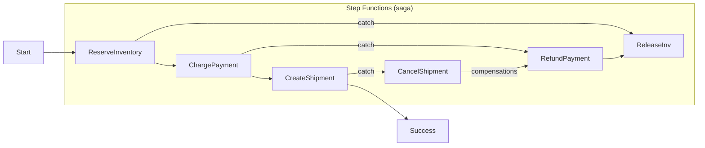
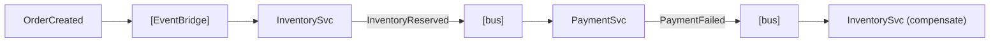
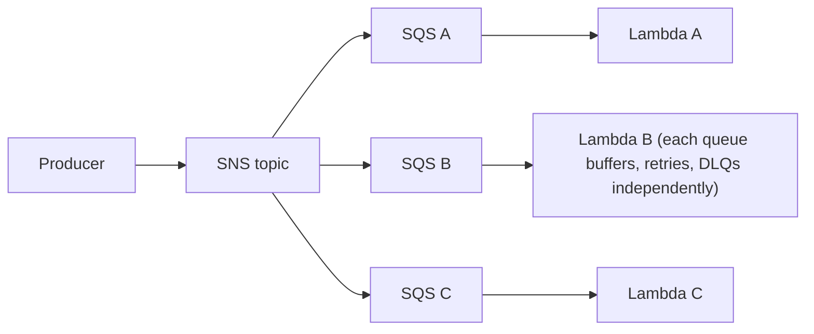

# Serverless Architecture: Lambda, Step Functions and Event-Driven Design

Serverless on AWS means you assemble managed, event-driven, pay-per-use building
blocks (Lambda, API Gateway, EventBridge, SQS, SNS, Step Functions, DynamoDB, S3,
Kinesis) instead of running and scaling servers yourself. In an interview the value
is never "no servers" — it is the **trade-offs**: you trade control, per-request cost
at high scale, long-running work, and portability for near-zero idle cost, automatic
scaling, fine-grained resiliency, and lower operational burden. This note goes deep
on *when serverless wins, when it loses, which service to pick, and which limit each
design hits first.*

---

## Serverless-first architecture and when it wins or loses

**Intuition.** "Serverless-first" is a decision heuristic: reach for a managed,
scale-to-zero, event-driven service before you provision a server or container.
Netflix-scale spiky traffic, glue/integration code, async pipelines, and low-baseline
APIs are the sweet spot. It is *not* a religion — steady high-throughput workloads or
sub-millisecond latency needs often belong on containers or EC2.

**How it works.** You compose *functions* (Lambda) and *managed integrations*
(EventBridge Pipes, Step Functions SDK integrations, API Gateway service proxies) so
that a lot of "code" becomes configuration. The platform owns capacity, patching, AZ
spreading (Lambda automatically runs across multiple AZs in a Region), and scaling.

**When serverless WINS:**
- Spiky, unpredictable, or bursty traffic (marketing spikes, cron jobs, event storms).
- Low or zero baseline load — you pay nothing when idle (scale to zero).
- Event-driven glue: S3 → transform, DynamoDB Streams → index, queue → worker.
- Small teams that want to minimize undifferentiated ops (no OS patching, no autoscaling groups).
- Fan-out / parallel batch (thousands of concurrent Lambdas for a few seconds).

**When serverless LOSES (pick containers/EC2/ECS/EKS instead):**
- **Sustained high throughput** where per-invocation pricing beats out a always-on box.
  A Lambda running 24/7 at high RPS is usually more expensive than an equivalently
  sized EC2/Fargate task.
- **Long-running work** > 15 min (Lambda hard cap) — use Fargate, ECS, Batch, or Step Functions to coordinate.
- **Ultra-low, predictable p99 latency** with no tolerance for cold starts — provisioned
  concurrency helps but adds always-on cost; sometimes a warm container fleet is simpler.
- **Heavy stateful / in-memory workloads** (large caches, big ML models loaded once) —
  statelessness fights you; a long-lived process amortizes load cost.
- **Deep OS / kernel / GPU control** or exotic runtimes — Lambda is constrained (though
  container images up to 10 GB and custom runtimes ease this).

**Trade-off summary.** Serverless optimizes for *time-to-market, elasticity, and idle
cost*; it costs you *per-unit price at scale, execution-duration ceilings, cold-start
tail latency, and some portability*. The break-even question interviewers love: "at
what utilization does always-on compute get cheaper than Lambda?" — roughly when a
function is busy a large fraction of the day at steady load.

---

## Lambda execution model, cold starts and mitigation

**Intuition.** A Lambda function runs inside an **execution environment** (a
Firecracker microVM). The lifecycle: **INIT** (download code, start runtime, run
init/static code) → **INVOKE** (run handler) → environment is frozen and reused for
subsequent invocations → eventually torn down. A **cold start** is any invocation that
must first pay INIT; a **warm** invocation reuses a frozen environment.

**Key facts and limits (current):**
- Max timeout: **15 minutes** (900 s). Memory: **128 MB to 10,240 MB (10 GB)**, and CPU
  scales linearly with memory (~1 vCPU at 1,769 MB, up to ~6 vCPUs at 10 GB).
- **/tmp ephemeral storage: 512 MB default, configurable up to 10,240 MB (10 GB).**
- Deployment package: **50 MB zipped / 250 MB unzipped** for zip; **container images up to 10 GB.**
- Payload: **6 MB** synchronous (request+response), **256 KB** asynchronous (event) invocation.
- Environment variables total size 4 KB.

**Cold-start cost drivers:** runtime (JVM/.NET slower to init than Node/Python/Go),
package size, VPC ENI attach (largely mitigated since 2019 by Hyperplane ENIs — VPC
cold starts are no longer the multi-second penalty they once were), and heavy static
init. Typical cold start ranges from ~100–400 ms for Node/Python up to seconds for
large JVM apps.

**Mitigations & trade-offs:**
- **Provisioned Concurrency (PC):** keeps N environments pre-initialized (INIT already
  paid) → no cold starts up to N concurrent. *Cost:* you pay for PC whether used or not,
  so it erodes the scale-to-zero benefit. Use for latency-sensitive, predictable-traffic
  endpoints; combine with Application Auto Scaling to schedule PC around traffic.
- **SnapStart** (Java, and now other runtimes): snapshots an initialized environment and
  restores from it, cutting Java cold starts dramatically at *no extra runtime charge*
  (you pay for caching/restore). Caveat: uniqueness/randomness and network connections
  must be re-initialized post-restore.
- **Keep it small and lean:** trim dependencies, lazy-load, move heavy work out of init.
- **Right-size memory:** more memory = more CPU = faster execution; sometimes a
  higher-memory function is *cheaper* because it finishes faster (use AWS Lambda Power Tuning).

**Trade-off:** PC removes cold starts but reintroduces idle cost and capacity planning —
if you need PC at high, steady scale, question whether containers are simpler/cheaper.

---

## Lambda triggers and event sources, poll versus push

**Intuition.** How a function is invoked determines retry, ordering, batching, error
handling, and back-pressure semantics. There are two families: **push (event)** sources
that call Lambda's Invoke API, and **poll (stream/queue)** sources where the Lambda
service's **event source mapping (ESM)** polls on your behalf.

**Three invocation types:**
- **Synchronous (request/response):** API Gateway, ALB, Cognito, direct `Invoke`. Caller
  waits; *no automatic retries by Lambda* — the caller owns retry. API Gateway has a
  **29-second integration timeout** (recently raised beyond 29 s as a configurable option
  for REST APIs, but 29 s is the classic default to design around).
- **Asynchronous (event):** S3, SNS, EventBridge, SES. Lambda queues the event internally
  and returns immediately (202). Lambda **retries twice** (3 attempts total) on function
  error with delays, then sends to a **DLQ or on-failure destination.** You configure
  max event age and max retry attempts.
- **Poll-based / event source mapping (stream & queue):** SQS, Kinesis Data Streams,
  DynamoDB Streams, Amazon MSK/Kafka, Amazon MQ. The ESM polls, forms **batches**, and
  invokes synchronously. Retry/ordering depends on source.

**Push vs poll comparison:**

| Source | Model | Ordering | Retry semantics | Batching | Notes |
|---|---|---|---|---|---|
| API Gateway / ALB | Push, sync | n/a | Caller retries | no | 29 s (APIGW) / user timeout |
| SNS | Push, async | none | 3 attempts then DLQ | no (per-msg) | fan-out pub/sub |
| EventBridge | Push, async | none | 24 h retry w/ backoff, then DLQ | no | routing/filtering bus |
| S3 events | Push, async | none | 3 attempts then DLQ | no | at-least-once |
| SQS (standard) | Poll (ESM) | none | redrive to DLQ after maxReceiveCount | up to 10k/batch window | scales by concurrent pollers |
| SQS FIFO | Poll (ESM) | per message group | same | batch, ordered per group | 300 TPS (3,000 w/ batching) |
| Kinesis / DynamoDB Streams | Poll (ESM) | per shard | retries until success/expiry (blocking) | batch per shard | 1 concurrent invoke per shard (or per parallelization factor) |

**Trade-offs of poll vs push:**
- **Push (SNS/EventBridge/S3)** is simplest and fully decoupled but gives you *at-least-once*
  delivery, no ordering, and only 3 retry attempts before DLQ — you must design idempotency.
- **Poll from SQS** gives durable buffering + back-pressure (great shock absorber in front
  of a downstream that can't scale), tunable batch size/window, and DLQ via redrive.
- **Poll from Kinesis/DynamoDB Streams** gives *ordering per shard/partition* and replay,
  but a poison-pill record can **block the shard** (head-of-line blocking) until it
  expires — mitigate with `BisectBatchOnFunctionError`, `MaximumRetryAttempts`,
  `MaximumRecordAgeInSeconds`, and an **on-failure destination** for failed batches.

**EventBridge Pipes** (modern pattern) connects a source (SQS/Kinesis/DDB Streams/MQ)
directly to a target with optional filtering and enrichment — often removing a "glue
Lambda" entirely (less code, less cost).

---

## Concurrency and scaling, reserved versus provisioned concurrency

**Intuition.** Lambda scales by adding **execution environments**, one per concurrent
invocation. **Concurrency = number of in-flight executions**, not requests/sec. By
Little's Law: `concurrency ≈ request_rate × avg_duration`. 100 req/s × 200 ms = 20
concurrent.

**Account limits and scaling behavior (current):**
- Default **account concurrency limit: 1,000** per Region (soft limit, raise via support).
- **Burst scaling:** Lambda now scales at up to **1,000 new execution environments every
  10 seconds per function** (the modern per-function burst behavior that replaced the
  older account-wide 500–3,000 burst pool). Beyond that, throttling (429) kicks in.
- **Reserved concurrency (RC):** *caps and guarantees* a slice of the account pool for a
  function. It both (a) guarantees the function can reach that many concurrent, and (b)
  prevents it from exceeding it (protecting downstream and other functions). Set RC=0 to
  effectively disable a function. RC is **free** — it just partitions the pool.
- **Provisioned concurrency (PC):** pre-initialized environments (see cold starts). PC is
  a subset that can be carved out of a function's reserved concurrency.

**Reserved vs Provisioned — the classic confusion (know this cold):**

| | Reserved Concurrency | Provisioned Concurrency |
|---|---|---|
| Purpose | Limit/guarantee max concurrent | Eliminate cold starts |
| Cold start | Still cold | Pre-warmed, no cold start |
| Cost | Free | Pay per GB-s for provisioned amount, always |
| Protects downstream | Yes (throttles overflow) | No (that's not its job) |
| Typical use | Cap a function hitting a fragile DB; isolate a noisy function | Latency-critical sync API |

**Failure modes:**
- **Throttling (429):** exceed account/reserved concurrency → sync callers get errors,
  async events retry then DLQ, poll sources back off. Fix: raise limit, add RC, or buffer with SQS.
- **Downstream overwhelm:** Lambda scales faster than your RDS/3rd-party API → use RC to
  cap, or SQS + maximum concurrency on the ESM.

**Trade-off:** RC protects but can starve; PC removes cold starts but costs money 24/7.
Over-provisioning RC on one function reduces the pool available to others in the same account.

---

## Error handling, retries, DLQ and idempotency

**Intuition.** In an at-least-once, auto-retrying, distributed system, *your code will be
invoked more than once for the same event, and some events will fail permanently.* Design
for both: idempotency for duplicates, DLQs for poison messages.

**Retry behavior by invocation type:**
- **Sync:** no Lambda retries; caller decides. SDK default retries + your API's retry policy.
- **Async:** 2 retries (3 total) with backoff; then **on-failure destination** (preferred,
  richer than DLQ — can be SQS/SNS/Lambda/EventBridge) or a **DLQ** (SQS/SNS). Configure
  `MaximumRetryAttempts` (0–2) and `MaximumEventAge` (60 s–6 h).
- **SQS (ESM):** message returns to queue on failure and is retried until
  `maxReceiveCount`, then redriven to the **DLQ** attached to the queue. Use **partial
  batch response** (`ReportBatchItemFailures`) so one bad message doesn't fail the whole batch.
- **Kinesis/DDB Streams:** retries block the shard; tune `MaximumRetryAttempts`,
  `MaximumRecordAgeInSeconds`, `BisectBatchOnFunctionError`, and set an **on-failure
  destination** so failed batch metadata goes to SQS/SNS without blocking forever.

**Idempotency patterns:**
- Use an **idempotency key** (event id, message dedup id, or business key) and record
  processed keys in DynamoDB with a conditional write / TTL. The **AWS Lambda Powertools**
  idempotency utility does exactly this.
- SQS **FIFO** provides content-based or explicit **deduplication within a 5-minute window**
  — helps but is not a full idempotency guarantee across longer windows.
- Make writes idempotent: conditional `PutItem`, upserts, or natural keys.

**Trade-offs:**
- DLQ vs on-failure destination: destinations capture full invocation context (request,
  response, error) and support more targets; prefer them for async. DLQ is simpler/older.
- Idempotency store adds a DynamoDB read/write per invocation (cost + latency) but is
  usually mandatory for correctness in at-least-once systems.

---

## Step Functions Standard versus Express and orchestration

**Intuition.** Step Functions is a managed **state machine** (workflow) service. It
orchestrates steps (Lambda, ECS, SQS, SNS, DynamoDB, and 200+ AWS SDK integrations) with
built-in retry, catch, parallel, map, choice, and wait — moving orchestration logic out of
code into a declarative Amazon States Language (ASL) definition. Great for sagas,
long-running processes, and human-in-the-loop.

**Standard vs Express (the key decision):**

| | Standard | Express (async) | Express (sync) |
|---|---|---|---|
| Max duration | **1 year** | **5 minutes** | 5 minutes |
| Execution model | Exactly-once, durable, each state persisted | At-least-once, in-memory | at-least-once |
| Pricing | Per **state transition** | Per **request + duration (GB-s)** | same |
| Throughput | Lower start rate (~thousands/s soft) | **Very high (100k+ starts/s)** | high |
| Execution history | Full, visible in console, 90 days | Sent to CloudWatch Logs only | returned inline |
| Best for | Long, auditable, saga, human approval | High-volume, short, idempotent event processing | sync APIs / orchestrating within a request |

**How pricing bites:** Standard charges **per state transition** — a chatty workflow with
many small states run millions of times gets expensive; there Express (charged by
duration/GB-s) is far cheaper. Conversely a low-volume, long-running, must-audit workflow
is cheap on Standard and impossible on Express (5-min cap, at-least-once).

**Patterns:**
- **Task tokens (`.waitForTaskToken`)** — pause a workflow until an external system /
  human calls back with success/failure. Enables human approval and async callbacks.
- **Map state** — dynamic parallelism over a collection; **Distributed Map** scales to
  **10,000 parallel child executions** and can iterate over millions of S3 objects
  (large-scale fan-out/data processing without managing shards).
- **Parallel state** — fixed fan-out of branches, join on completion.
- **Retry/Catch** — per-state exponential backoff and error routing declaratively.
- **Express inside Standard** — nest high-volume short work as an Express child of a
  durable Standard parent.

**Trade-offs:** Step Functions vs orchestrating in code — you gain visibility, built-in
retry, and no "orchestrator Lambda that runs 14 min then times out," but you pay per
transition, learn ASL, and add a service. Express loses per-execution history (harder to
debug; rely on CloudWatch Logs) and exactly-once (needs idempotent steps).

---

## Choreography versus orchestration and the saga pattern

**Intuition.** In distributed transactions without 2-phase commit you use a **saga**: a
sequence of local transactions, each with a **compensating action** to undo prior work on
failure. Two coordination styles:
- **Choreography (event-driven):** services react to each other's events (via
  EventBridge/SNS/SQS). No central brain. Loose coupling, easy to add consumers.
- **Orchestration:** a central coordinator (Step Functions) tells each service what to do
  and drives compensation on failure.

**ASCII — order saga, orchestrated (Step Functions):**

**Choreography (events):**

**Trade-offs:**

| Aspect | Choreography (events) | Orchestration (Step Functions) |
|---|---|---|
| Coupling | Loosest; add consumers freely | Coordinator knows all steps |
| Visibility | Hard — flow is emergent across services | Excellent — one place to see state |
| Compensation logic | Scattered across services | Centralized, explicit |
| Failure/debug | Distributed tracing needed | Execution history shows exactly where |
| Risk | "Event spaghetti" at scale | Coordinator can become a bottleneck/monolith |
| Best for | Simple, additive, high-fan-out flows | Complex multi-step transactions needing audit |

**Rule of thumb:** few steps + many independent reactors → choreography. Complex,
stateful, must-audit, needs-compensation business transaction → orchestration with Step
Functions. Real systems mix both (orchestrate a bounded context, choreograph between them).

---

## Fan-out, fan-in and messaging service selection

**Intuition.** Fan-out delivers one event to many consumers; fan-in aggregates many into
one. The service you pick sets ordering, durability, throughput, and cost.

**Canonical fan-out: SNS → multiple SQS (fan-out with buffering).**

Why SQS between SNS and Lambda: each subscriber gets its own durable buffer, independent
retry/DLQ, and back-pressure — one slow consumer doesn't drop messages.

**Messaging service comparison (know the limits):**

| | SQS Standard | SQS FIFO | SNS | EventBridge | Kinesis Data Streams |
|---|---|---|---|---|---|
| Model | Queue (1 consumer group) | Ordered queue | Pub/sub push | Event bus + routing/filtering | Ordered stream, replayable |
| Ordering | Best-effort, none | Per message group | none | none | Per shard |
| Delivery | At-least-once | Exactly-once processing (dedup) | At-least-once | At-least-once | At-least-once |
| Throughput | Nearly unlimited | **300 TPS (3,000 with batching)** | very high | high (soft quotas) | **1 MB/s or 1,000 rec/s in per shard; 2 MB/s out** |
| Retention | up to 14 days | 14 days | none (fire-and-forget) | archive/replay | up to 365 days |
| Replay | no (once consumed) | no | no | yes (archive) | **yes (re-read shard)** |
| Best for | Decouple, buffer, work queue | Ordered/dedup work | Fan-out notifications | Routing, SaaS integration, schema | High-volume ordered analytics/CDC |

**Message size limits:** SQS/SNS message max **256 KB** (use S3 + claim-check for larger,
via the Extended Client). Kinesis record max **1 MB**. EventBridge event max **256 KB**.

**Trade-offs:**
- **SQS vs Kinesis** for a stream of events: SQS = simple, scales pollers, no ordering, one
  logical consumer; Kinesis = ordered, multiple independent consumers (fan-out via Enhanced
  Fan-Out at 2 MB/s per consumer per shard), replay — but you manage shards and pay per shard-hour.
- **SNS vs EventBridge:** SNS is high-throughput, low-latency pub/sub (and now supports
  message filtering); EventBridge adds content-based routing rules, schema registry,
  archive/replay, and 20+ SaaS sources — richer but slightly higher latency and lower raw throughput.
- **FIFO throughput ceiling** (300/3,000 TPS) is a design trap: if you need ordering *and*
  huge throughput, shard by many message-group IDs or move to Kinesis (order per shard).

---

## Serverless data stores, DynamoDB and Aurora Serverless

**Intuition.** Serverless compute needs serverless-friendly data: connectionless,
horizontally scalable, pay-per-use. DynamoDB is the default; Aurora Serverless v2 covers
relational needs; the classic anti-pattern is thousands of Lambdas each opening a DB
connection.

**DynamoDB — facts that drive design:**
- Item max **400 KB**. Single-partition throughput ceiling: **3,000 RCU and 1,000 WCU per
  partition** — exceed it and you get a **hot partition** (throttling even if table
  capacity is high). Design partition keys for high cardinality / even access.
- **On-demand vs provisioned:** on-demand scales instantly, pay per request (great for
  spiky/unknown); provisioned + auto scaling is cheaper for steady, predictable load.
- **Consistency:** eventually consistent reads by default (~1 RCU/4 KB); strongly consistent
  reads cost 2× and can't be served from all replicas. Global tables = multi-Region,
  **last-writer-wins**, eventual across Regions.
- **DynamoDB Streams** → Lambda for CDC/materialized views; **single-table design** for
  access-pattern-driven modeling.
- **DAX** for microsecond cached reads. **Latency:** single-digit ms typical.

**Aurora Serverless v2:**
- Scales in fine-grained **ACUs** (0.5 ACU increments) up and down with load, can be
  configured to scale to zero (auto-pause) — but scaling and resume aren't instantaneous,
  so cold-ish latency on wake.
- Relational (Postgres/MySQL compatible), ACID, joins — when you truly need relational.
- **The connection problem:** Lambda concurrency can open thousands of DB connections and
  exhaust the DB. Fix with **RDS Proxy** (connection pooling/multiplexing) or the **Data
  API** (HTTP, connectionless).

**DynamoDB vs Aurora Serverless v2:**

| | DynamoDB | Aurora Serverless v2 |
|---|---|---|
| Model | Key-value / document, NoSQL | Relational SQL |
| Scaling | Horizontal, instant (on-demand) | Vertical (ACUs), seconds to scale |
| Connections | Connectionless (HTTPS API) | Connection pool (needs RDS Proxy) |
| Latency | Single-digit ms (µs w/ DAX) | Low ms, but connection setup cost |
| Consistency | Eventual/strong per read; LWW global | Strong, ACID transactions, joins |
| Best fit | Known access patterns, huge scale, spiky | Complex queries, joins, transactions, moderate scale |

**Trade-off:** DynamoDB forces you to model for access patterns up front (rigid but scales
limitlessly and pairs perfectly with Lambda); Aurora gives query flexibility and ACID but
reintroduces connection management and vertical scaling limits.

---

## Observability, cost and other trade-offs at scale

**Observability (harder in serverless — no host to SSH into):**
- **CloudWatch Logs** (one log group per function), **CloudWatch Metrics** (Invocations,
  Errors, Throttles, Duration, ConcurrentExecutions, IteratorAge for streams), and
  **AWS X-Ray** for distributed tracing across functions/services. **IteratorAge** rising
  on a stream ESM = consumer falling behind (key alarm).
- Distributed tracing is essential because a request fans across many short-lived
  functions; correlation IDs + structured logging (Powertools) are best practice.
- **CloudWatch Lambda Insights**, and third-party (Datadog, Lumigo) for deeper serverless APM.

**Cost model & estimation:**
- Lambda charges **per request** (~$0.20 per 1M requests) **+ GB-seconds** of
  memory×duration (with ms billing granularity). Provisioned concurrency adds a separate
  always-on GB-s charge.
- Back-of-envelope: 100M invocations/month, 200 ms each, 512 MB →
  GB-s = 100M × 0.2 s × 0.5 GB = 10M GB-s. Plus 100M requests. This is where you compare
  vs an always-on fleet: if the same load could saturate a handful of EC2/Fargate tasks
  24/7, containers may be cheaper.
- **Cost cliffs:** high steady RPS, chatty Step Functions Standard (per-transition), high
  provisioned concurrency, and NAT Gateway data charges for VPC Lambdas talking to the internet.

**Statelessness & vendor lock-in trade-offs:**
- **Statelessness:** no in-memory session across invocations; externalize state
  (DynamoDB/ElastiCache/S3). You *can* reuse init-scope objects (DB clients, cached config)
  across warm invocations — but never rely on it for correctness.
- **Vendor lock-in:** deep use of proprietary services (Step Functions ASL, DynamoDB,
  EventBridge) increases switching cost. Mitigate with hexagonal architecture (business
  logic isolated from handlers), the Serverless Framework/SAM/CDK for IaC, and portable
  runtimes/container images — accepting that some lock-in is the price of the managed value.

**Failure modes and degradation:**
- **AZ failure:** Lambda auto-spreads across AZs — largely transparent. VPC functions need
  subnets in multiple AZs.
- **Region failure:** serverless is regional; multi-Region needs active/active or
  active/passive design (DynamoDB Global Tables, Route 53 failover, replicated event buses).
- **Throttling / limit exhaustion:** account concurrency, downstream DB, FIFO TPS, Kinesis
  shard, or partition RCU/WCU — identify *which limit hits first* for the given load.
- **Poison messages:** block streams / spin retries — DLQ + idempotency + partial batch response.

---

## Trade-offs and when to use what

A consolidated decision cheat-sheet (interview gold):

- **Sync API, low/spiky traffic, ok with rare cold start** → API Gateway + Lambda + DynamoDB.
- **Sync API, strict p99, no cold starts allowed** → Lambda + **Provisioned Concurrency**
  (or SnapStart for Java); if steady high RPS, reconsider Fargate/ECS.
- **Absorb traffic spikes / protect a fragile downstream** → **SQS** buffer + Lambda with
  capped concurrency (or ESM maximum concurrency).
- **Fan-out one event to many independent consumers** → **SNS → SQS per consumer** (or EventBridge rules).
- **Ordered, replayable, high-volume stream (CDC, clickstream)** → **Kinesis Data Streams**;
  DynamoDB change capture → **DynamoDB Streams**.
- **Ordering + moderate throughput + dedup** → **SQS FIFO** (mind 300/3,000 TPS).
- **Complex multi-step transaction, needs audit + compensation** → **Step Functions
  Standard** (saga, task tokens for human approval).
- **High-volume, short, idempotent workflow** → **Step Functions Express** (or just events).
- **Massive parallel data processing over S3/collections** → **Distributed Map** (10k child executions).
- **Relational queries / ACID / joins, variable load** → **Aurora Serverless v2 + RDS Proxy**;
  known key-value access patterns at any scale → **DynamoDB**.
- **Work > 15 min** → not Lambda: **Fargate/ECS/Batch**, optionally orchestrated by Step Functions.
- **Steady, high, predictable throughput where per-request cost dominates** → containers/EC2.

The meta-trade-off: serverless trades **per-unit cost at scale, duration limits, cold-start
tail latency, and portability** for **elasticity, near-zero idle cost, built-in resiliency,
and minimal ops.** Name the specific constraint (latency budget, throughput, ordering,
consistency, budget, ops maturity, run time) and the right choice usually follows.

---

## Common interview follow-up questions

- "You have 100 req/s at 250 ms average — how much concurrency do you need, and will the
  default 1,000 account limit hold?" (Little's Law: ~25; plenty of headroom.)
- "Your Lambda reads from Kinesis and one record keeps failing — what happens and how do
  you fix it?" (Shard blocks; use bisect, max retries/age, on-failure destination.)
- "Sync API p99 spikes to 3 s intermittently — diagnose." (Cold starts; PC/SnapStart, or
  containers if steady.)
- "Design an order-processing saga that can compensate on payment failure." (Step Functions
  Standard, catch → compensation states, task tokens for manual review.)
- "One event must reach 5 teams' services independently and durably." (SNS→SQS fan-out or
  EventBridge rules; per-consumer DLQ.)
- "Explain reserved vs provisioned concurrency and when each matters."
- "Your Lambda fleet exhausts RDS connections — fix without rearchitecting the DB." (RDS Proxy / Data API.)
- "When would you NOT go serverless?" (Steady high throughput, >15 min jobs, strict low
  latency at scale, heavy stateful/GPU workloads, deep OS control, cost at scale.)
- "Which limit does this design hit first?" (concurrency / FIFO TPS / shard / partition RCU / 29 s APIGW / 15 min.)
- "Standard vs Express Step Functions for 50M short executions/day — which and why?" (Express: per-duration pricing, high start rate; Standard's per-transition cost explodes.)

## References

- AWS Lambda Developer Guide — execution environment lifecycle, concurrency, event source
  mappings, invocation types, limits/quotas.
- AWS Lambda — Reserved vs Provisioned Concurrency; SnapStart documentation.
- AWS Step Functions Developer Guide — Standard vs Express, Distributed Map, task tokens,
  ASL, saga pattern examples.
- Amazon SQS Developer Guide — Standard vs FIFO, throughput quotas, DLQ/redrive.
- Amazon SNS, Amazon EventBridge (incl. Pipes) developer guides — fan-out, routing, archive/replay.
- Amazon Kinesis Data Streams Developer Guide — shard limits, Enhanced Fan-Out, retention.
- Amazon DynamoDB Developer Guide — partition throughput, item size, on-demand vs
  provisioned, Streams, global tables; Aurora Serverless v2 & RDS Proxy docs.
- AWS Well-Architected Framework — Serverless Applications Lens.
- The Amazon Builders' Library — "Reliability, constant work, and a good cup of coffee";
  timeouts, retries, backoff and jitter.
- AWS re:Invent deep-dive sessions on Lambda internals, event-driven architecture, and
  Step Functions design patterns; AWS Prescriptive Guidance — serverless patterns.
