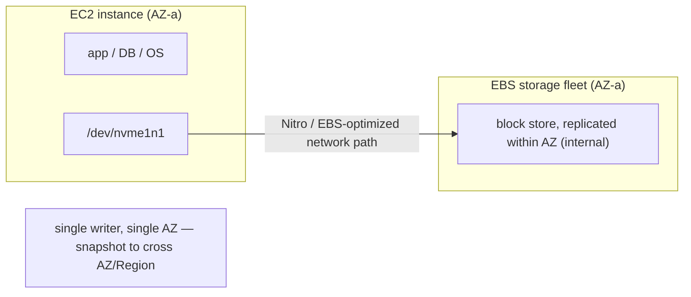

# Block and File Storage: EBS, EFS and FSx Trade-offs

Storage selection is one of the highest-signal parts of an AWS system-design
interview because it forces you to reason simultaneously about **access
pattern** (random block I/O vs shared file semantics vs object GETs), **blast
radius** (single-AZ device vs Regional service), **durability**, **latency
budget**, **throughput/IOPS ceilings**, **cost model**, and **operational
burden**. The interviewer is rarely testing whether you memorized that io2
does 256,000 IOPS; they are testing whether you can say *"this workload needs
POSIX shared writes from 200 containers, so EBS is out and EFS or FSx is in,
and here is the specific trade-off I accept by choosing one."*

The mental spine of the whole topic is the three storage **primitives** and
the one rule that follows:

> **Block** = a raw disk you format and mount, attached to one instance (an
> arm's length below the filesystem). **File** = a shared, network-mounted
> POSIX/SMB filesystem many clients read and write concurrently. **Object** =
> flat key→blob store with an HTTP API, no in-place edits, effectively
> infinite scale. Pick the *lowest-level primitive that still satisfies the
> access pattern*, because each step up (block → file → object) trades some
> latency and control for more sharing, scale, and durability.

Every service below is a managed implementation of one of these primitives:
EBS is block; EFS, FSx (Windows, ONTAP, OpenZFS, Lustre) are file; S3 is
object. The rest of this document goes primitive by primitive and service by
service, and for **every** design choice states what you gain, what you give
up, and when to pick it over the alternative.

---

## Block, file, and object storage: picking the right primitive

**Intuition.** Ask three questions in order:

1. **Does one instance own the data and need low-latency random reads/writes
   at the block level (a database, a boot volume, a filesystem you control)?**
   → **Block / EBS** (or instance store for ephemeral speed).
2. **Do many instances need to read/write the *same* files concurrently with
   POSIX or SMB semantics (shared home dirs, CMS assets, ML training sets,
   lift-and-shift file servers, HPC scratch)?** → **File / EFS or FSx**.
3. **Is the data write-once/read-many blobs addressed by key, tolerant of
   HTTP-level latency, and you want 11 nines and infinite scale cheaply
   (backups, media, data lake, static assets, logs)?** → **Object / S3**.

**Comparison at a glance:**

| Dimension          | EBS (block)                  | EFS / FSx (file)                    | S3 (object)                         |
|--------------------|------------------------------|-------------------------------------|-------------------------------------|
| Access API         | Block device (NVMe/SCSI)     | NFS / SMB / Lustre client           | HTTP REST (GET/PUT/list)            |
| Sharing            | 1 instance (Multi-Attach=16) | Thousands of clients concurrent     | Unlimited concurrent HTTP clients   |
| Scope / blast area | Single AZ                    | EFS Regional (multi-AZ); FSx varies | Regional (multi-AZ), 11 nines       |
| Latency            | sub-ms (io2 <500 µs)         | ~1 ms read (EFS); FSx sub-ms        | 10s of ms first byte (S3 Std)       |
| In-place edit      | Yes (blocks)                 | Yes (POSIX)                         | No (whole-object replace)           |
| Max size           | 64 TiB/volume                | Petabytes, elastic                  | Effectively unlimited               |
| Typical cost order | $$ (provisioned)             | $$$ per GB (EFS Std)                | $ cheapest per GB                   |

**Trade-off.** The temptation is to default to the primitive you know. The
discipline is: object is cheapest and most durable but cannot be mounted or
edited in place, so you cannot run a database or a POSIX app on it directly;
block is fastest and cheapest-per-IOPS but is single-attach and single-AZ, so
it cannot be a shared filesystem; file bridges the gap (shared + mountable)
but costs more per GB and adds network-filesystem latency. **When in doubt,
name the access pattern out loud and let it pick the primitive** — that single
sentence wins most storage-selection questions.

---

## Amazon EBS architecture and how volumes attach

**How it works.** An EBS volume is network-attached block storage that
*behaves* like a local disk but lives on a separate storage fleet reached over
the Nitro card / EBS-optimized network path. Each volume is **automatically
replicated within a single Availability Zone** to survive component (drive)
failure — but it does **not** span AZs. A volume attaches to an EC2 instance
**in the same AZ**; you cannot attach an `us-east-1a` volume to an
`us-east-1b` instance. To move a volume across AZs you snapshot it (snapshots
are Regional, stored in S3) and restore in the target AZ.

**Real-world usage.** EBS is the boot volume and the database volume of choice:
RDS, self-managed PostgreSQL/MySQL, Kafka brokers, Elasticsearch data nodes,
anything that wants a private, low-latency block device it fully controls.

**Trade-offs.**
- *Gain:* sub-millisecond, consistent, provisionable performance; durable
  within the AZ; snapshots for backup/clone; live resize and type change.
- *Give up:* single-AZ blast radius (an AZ outage takes the volume offline —
  your HA story must come from replicating *data* across AZs, e.g. Multi-AZ
  RDS or app-level replication, not from EBS itself); single-writer by default;
  network hop means it is slower than instance store.
- *When EBS vs instance store:* pick instance store only when the data is
  reconstructable and you need the absolute lowest latency / highest IOPS
  (see the instance-store section). Otherwise EBS, because instance store
  evaporates on stop/terminate/host failure.

---

## EBS volume types: gp3, io2 Block Express, st1, sc1

**SSD (IOPS-oriented) vs HDD (throughput-oriented)** is the first fork. SSD
types serve small random I/O (databases, boot); HDD types serve large
sequential streaming (logs, big-data scans) cheaply.

| Type   | Media | Size        | Max IOPS         | Max throughput | Durability (AFR)      | Multi-Attach | Notes                                   |
|--------|-------|-------------|------------------|----------------|-----------------------|--------------|-----------------------------------------|
| gp3    | SSD   | 1 GiB–64 TiB| 80,000 (baseline 3,000) | 2,000 MiB/s (base 125) | 99.8–99.9% (0.1–0.2%) | No           | IOPS/throughput **decoupled** from size (500 IOPS/GiB) |
| gp2    | SSD   | 1 GiB–16 TiB| 16,000           | 250 MiB/s      | 99.8–99.9%            | No           | 3 IOPS/GiB, bursts to 3,000 (legacy)    |
| io2 Block Express | SSD | 4 GiB–64 TiB | 256,000       | 4,000 MiB/s    | **99.999% (0.001%)**  | **Yes**      | sub-500 µs latency; up to 1,000 IOPS/GiB|
| io1    | SSD   | 4 GiB–16 TiB| 64,000           | 1,000 MiB/s    | 99.8–99.9%            | **Yes**      | legacy provisioned-IOPS                 |
| st1    | HDD   | 125 GiB–16 TiB | 500           | 500 MiB/s      | 99.8–99.9%            | No           | throughput-optimized; big sequential    |
| sc1    | HDD   | 125 GiB–16 TiB | 250           | 250 MiB/s      | 99.8–99.9%            | No           | cold, cheapest; infrequent access       |

(gp3 reaches its 80,000 IOPS max at 160 GiB or larger — 500 IOPS/GiB — and its
2,000 MiB/s max at 8,000+ provisioned IOPS. The io2 Block Express 256,000 IOPS
ceiling requires a Nitro-based instance; other instance types cap at 32,000
IOPS. As of April 30, 2025, all io2 volumes are io2 Block Express.)

> [!WARNING]
> The st1/sc1 "Max IOPS" figures (500/250) are **not comparable to SSD IOPS**.
> AWS measures HDD I/O against a **1 MiB I/O unit** (it counts sequential 1 MiB
> reads/writes), whereas SSD IOPS are measured at small 4/8/16 KiB block sizes.
> So sc1's "250 IOPS" is really "250 × 1 MiB/s of sequential streaming," not 250
> small random operations — HDD is throughput-provisioned, and lining its IOPS
> number up next to gp3's 80,000 small-random IOPS is a category error a sharp
> interviewer will catch.

**Trade-offs.**
- **gp3 vs gp2:** gp3 is the modern default. With gp2 you bought IOPS *by
  buying capacity* (3 IOPS/GiB), so a workload needing 10,000 IOPS forced a
  ~3.3 TiB volume you didn't need. gp3 **decouples** IOPS/throughput from size,
  so you provision 3,000 baseline IOPS + 125 MiB/s **free**, then dial IOPS and
  throughput independently — typically ~20% cheaper for the same performance.
  Migrate gp2→gp3 almost always.
- **gp3 vs io2 Block Express:** io2 buys you (a) far higher IOPS/throughput,
  (b) **99.999% durability** (two orders of magnitude better AFR), and (c)
  Multi-Attach and NVMe reservations. You pay meaningfully more per provisioned
  IOPS. Pick io2 Block Express for tier-1 databases (large SAP HANA, Oracle,
  high-TPS SQL) where either the IOPS ceiling or the durability SLA matters;
  otherwise gp3.
- **SSD vs st1/sc1:** HDD types are cheap per GB and stream fast sequentially
  but are terrible at small random I/O (500/250 IOPS ceilings). Use st1 for
  big, sequential, throughput-bound workloads (Kafka log segments, EMR/Hadoop
  scans, log processing); sc1 for cold, rarely touched data. **Never** put a
  transactional database or boot volume on HDD.

---

## EBS IOPS and throughput provisioning and burst behavior

**How it works.** With gp3 you explicitly provision IOPS (from 3,000 baseline
up to the ceiling) and throughput (from 125 MiB/s) as **separate dials**,
independent of the 1 GiB–64 TiB capacity. With **gp2** performance is a
function of size: 3 IOPS/GiB baseline, and small volumes (<1 TiB) get a
**burst bucket** to 3,000 IOPS funded by I/O credits — great for spiky boot
volumes, dangerous for sustained load because credits deplete and you fall
back to baseline (a classic "why did my small gp2 DB volume suddenly get
slow?" incident). io1/io2 let you provision IOPS directly with a ratio cap
(io2 Block Express up to 1,000 IOPS/GiB; io1 50:1).

**HDD burst:** st1 baseline is 40 MiB/s per TiB, bursting to 250 MiB/s per TiB;
sc1 baseline 12 MiB/s per TiB, bursting to 80 MiB/s per TiB — so HDD throughput
also scales with provisioned size.

**Trade-offs / gotchas.**
- To actually *reach* provisioned IOPS you need an **EBS-optimized / Nitro**
  instance with enough EBS bandwidth — the instance's aggregate EBS throughput,
  not the volume, is often the real ceiling. Naming this ("the r6i has X Gbps
  EBS bandwidth so a single 4,000 MiB/s volume can't be saturated") is a strong
  signal.
- gp2 burst credits are a hidden cliff; gp3's flat provisioned performance
  removes the surprise but you must remember to *set* the IOPS (default 3,000).
- Over-provisioning io2 IOPS is a common cost sink — measure first.

---

## EBS Multi-Attach and clustered workloads

**How it works.** EBS **Multi-Attach** lets a single **io1/io2** volume attach
to **up to 16 Nitro instances in the same AZ** simultaneously, all with
read/write access. It does **not** give you a distributed filesystem — the
block device is shared raw, so you **must** run a **cluster-aware filesystem or
application** (GFS2, OCFS2, or a DB with its own I/O fencing) that coordinates
writes. Standard filesystems (xfs, ext4) will corrupt data if mounted
read/write by two hosts. io2 Block Express additionally supports **NVMe
reservations** for proper fencing.

**Trade-offs.**
- *Gain:* shared block device for HA clustered apps that expect SAN-style
  shared LUNs (e.g. certain Oracle RAC-style or clustered legacy apps).
- *Give up:* single-AZ only (no cross-AZ HA), max 16 instances, gp3/HDD not
  supported, and **you own the concurrency correctness** — this is not EFS.
- *When to use vs EFS/FSx:* only when the app demands raw shared block with its
  own clustering. If you want a shared *filesystem* the answer is almost always
  EFS (Linux/NFS) or FSx (Windows/SMB, ONTAP, Lustre), which mediate concurrent
  *file* access across AZs (though even they don't serialize byte-level writes —
  see the EFS section).

**Kubernetes access-mode vocabulary (say this in a container interview).** The
primitives map directly onto the PersistentVolume **access modes** k8s and the
CSI drivers use:
- **EBS CSI → `ReadWriteOnce` (RWO)**: the volume mounts read/write on **one
  node** at a time (Multi-Attach can widen this to `ReadWriteMany` on a few Nitro
  nodes in one AZ, but you still own concurrency). A pod using an EBS PVC can't be
  rescheduled to another AZ, and two nodes can't share it in the normal case.
- **EFS CSI → `ReadWriteMany` (RWX)**: **many nodes** across AZs mount the same
  volume read/write — this is why "shared dataset across many pods" points to EFS.
- **FSx** varies by flavor (Lustre and the SMB/NFS FSx drivers can offer RWX).

The interviewer is listening for "EBS is RWO, EFS is RWX" — it's the exact
language the k8s docs and platform teams use.

---

## EBS snapshots, backup, and encryption

**How it works.** A snapshot is a **point-in-time, incremental** backup of a
volume stored **in Amazon S3** (in an AWS-managed bucket you don't see) at the
**Region** level — so a snapshot survives AZ loss and can be **copied
cross-Region** for DR. "Incremental" means only blocks changed since the last
snapshot are written, but each snapshot is independently restorable (deleting
an old snapshot never breaks a newer one). Restoring creates a new volume;
blocks are **lazily loaded** from S3 on first access, so a freshly restored
volume has a latency hit until warmed — **Fast Snapshot Restore (FSR)**
pre-warms it for a fee. The **EBS direct APIs** let you read snapshot blocks
without restoring (for backup tools); **Recycle Bin** protects against
accidental deletion.

**Crash-consistent vs application-consistent (the classic gotcha).** A snapshot
of a **live, mounted** volume is only **crash-consistent** by default — it
captures the on-disk bytes at that instant exactly as if the machine had lost
power, *including* writes still buffered in the OS page cache or the database's
in-memory buffers that had not yet been flushed to the block device. Restoring
such a snapshot is like booting after a power cut: the filesystem journal
replays, but a database may find a **torn/inconsistent** state (half-written
pages, uncommitted transactions). For an **application-consistent** backup you
must quiesce first: flush and freeze the filesystem (`fsfreeze`, or `xfs_freeze`)
and/or tell the DB to flush and briefly hold writes (e.g. MySQL
`FLUSH TABLES WITH READ LOCK`, or a Postgres checkpoint) before triggering the
snapshot, then release. **AWS Backup** with pre/post scripts (or its Windows VSS
integration) automates this, and its **multi-volume consistent snapshot** groups
a RAID/striped set so all member volumes are captured at the same instant.

**Encryption.** EBS encryption uses **KMS** (AES-256). Encrypting is per-volume
at creation; you can't encrypt an existing unencrypted volume in place — you
snapshot, copy the snapshot with encryption enabled, and restore. Snapshots of
an encrypted volume are encrypted; sharing an encrypted snapshot requires
sharing the CMK. Account-level "encryption by default" is best practice.

**Trade-offs.**
- Incremental snapshots make backups cheap (pay only for changed blocks in S3)
  but the *first* full snapshot is large; cross-Region copy adds transfer cost
  and is the backbone of a cheap DR posture (RPO = snapshot frequency).
- FSR removes the cold-restore latency cliff but costs per snapshot per AZ —
  only enable for volumes where fast RTO matters.
- Use **AWS Backup** to centralize/automate snapshot lifecycle and cross-Region/
  cross-account copy instead of hand-rolled Lambda + CloudWatch Events.

---

## Instance store versus EBS for databases

**How it works.** **Instance store** (a.k.a. ephemeral) is NVMe SSD **physically
attached to the host**. It delivers the **lowest latency and highest IOPS**
available on EC2 (no network hop) — but the data is **ephemeral**: it is lost
on **stop, terminate, or underlying-hardware failure** (it *does* survive a
reboot). You cannot snapshot it or detach/reattach it.

**Trade-off — the key interview call.**
- Put a database's **primary durable storage** on **EBS (gp3 or io2)** because
  EBS survives instance stop/terminate and gives you snapshots and Multi-AZ
  replication paths. Only if the workload needs extreme IOPS/latency AND the
  data is reconstructable do you use instance store.
- The idiomatic pattern: **use instance store as a cache/scratch/tmp or for a
  replicated distributed store** where the *cluster* provides durability (e.g.
  Cassandra/ScyllaDB, Elasticsearch hot tier, Aerospike, Kafka with replication
  ≥3) — any node can die and the replica set rebuilds. Never use instance store
  for a single-copy system of record.
- io2 Block Express narrows the gap: it now offers sub-500 µs latency and up to
  256,000 IOPS with 99.999% durability, so many workloads that once demanded
  instance store can run on io2 and keep persistence + snapshots.

---

## Amazon EFS: elastic multi-AZ NFS file storage

**How it works.** EFS is a fully managed **NFS v4.1/4.0** filesystem with
**POSIX** semantics. A **Regional** file system stores data **redundantly
across multiple AZs**, so it survives an AZ failure; a **One Zone** file system
keeps data in a single AZ (cheaper, but AZ loss = downtime, backed by AWS
Backup). It is **elastic** — it grows and shrinks automatically to petabytes,
you pay for what you store, no pre-provisioning of capacity. Thousands of EC2
instances / containers (ECS, EKS via the EFS CSI driver), Lambda functions, and
on-prem servers (via Direct Connect/VPN) can mount it concurrently. You access
it through **mount targets** (one ENI per AZ); **Access Points** enforce a
POSIX user/root directory per application.

**Latency:** first-byte ~**1 ms reads**, ~**2.7 ms writes** on the Standard
(SSD) class — slower than local/EBS block because it is a network filesystem,
but consistent and shared.

**"Shared mount" is not "safe concurrent writes" (the #1 EFS interview trap).**
A very common follow-up is *"what happens when two pods write the same file on
EFS?"* The wrong answer is "it just works like a database." NFS gives you
**close-to-open consistency**: a client's writes are only *guaranteed* visible
to another client after the writer **closes** the file and the reader
subsequently **opens** it. Between open and close, each client works partly
against its own local cache, so a reader can see **stale** data and two writers
can silently **clobber** each other. NFS does offer **byte-range locks** (via the
NLM/`lockd` protocol, `fcntl`/`flock`), but they are **advisory** — they only
serialize processes that *voluntarily* take the lock; a process that just writes
without locking ignores them entirely. There is **no automatic byte-level write
serialization** the way an RDBMS serializes concurrent transactions.

> [!INTERVIEW]
> Worked trace — two EKS pods appending to the same 100-byte file on EFS with
> **no locking**:
> - t0: file on the server = 100 bytes. Pod A opens it, seeks to end (offset
>   100). Pod B opens it, also computes end = offset 100 (both cached size = 100).
> - t1: Pod A writes 20 bytes at offset 100 → its local view: 120 bytes.
> - t2: Pod B writes 30 bytes at offset 100 (its stale idea of "end") → this
>   covers bytes 100–129, overwriting the 100–119 region A just wrote.
> - t3: both close. Server file = 130 bytes (original 100 + B's 30). A's 20 bytes
>   are **completely lost** — a classic lost-update / clobbered-append, and
>   neither pod gets an error.
>
> Fix in the answer: use `O_APPEND` (append is atomic per write only up to the
> pipe/PIPE_BUF-style guarantees, still racy across NFS for large writes), or
> take an explicit advisory **byte-range lock** before each write, or — the
> senior answer — **don't use a shared file as a coordination primitive**: give
> each writer its own file (one file per pod, e.g. `log.<podname>`) and merge
> later, or put the mutable shared state in a database/queue built for
> concurrent writers. Contrast with **EBS Multi-Attach**, which is raw block with
> **zero** coordination — even worse, so it demands a cluster-aware filesystem.

**Trade-offs.**
- *Gain:* shared POSIX filesystem across AZs with zero capacity planning; ideal
  for **Linux** shared workloads — CMS/WordPress media, shared home directories,
  container persistent volumes, CI/CD artifacts, ML datasets, lift-and-shift
  Linux apps expecting a mount.
- *Give up:* higher per-GB cost than S3/EBS-HDD, and per-operation latency (~1
  ms) far above local block (µs) — a latency-critical single-instance database
  belongs on EBS, not EFS. Small-file/metadata-heavy workloads can be
  throughput-limited (every NFS op is metered as ≥4 KB).
- *EFS vs FSx:* EFS is Linux/NFS only. Need **SMB/Windows**? → FSx for Windows.
  Need **HPC/ML extreme throughput**? → FSx for Lustre. Need **NetApp features
  (multi-protocol, dedup, SnapMirror)**? → FSx for ONTAP.

---

## EFS throughput modes and performance modes

**Throughput modes** (how much aggregate bandwidth the FS can drive):
- **Elastic** (default, recommended): auto-scales up/down; pay per data
  read/written; no provisioning, no burst credits. Best for spiky/unpredictable
  workloads or average-to-peak ≤ 5%. Regional Elastic can reach ~**20–60 GiBps
  read, 1–5 GiBps write**, up to 250,000 read IOPS (frequently accessed) and
  50,000 write IOPS by default.
- **Provisioned**: you fix a throughput level independent of size (up to 55,000
  read / 25,000 write IOPS). Use when you know your needs and drive throughput
  at ≥ 5% average-to-peak, or need more than Bursting gives for a small FS.
- **Bursting**: throughput scales with stored size — 50 KiBps/GiB baseline,
  bursting to 100 MiBps/TiB via burst credits (min 100 MiBps). Cheapest for
  workloads whose throughput naturally tracks data size, but a small FS with a
  spiky heavy workload will exhaust credits and throttle.

**Performance modes:**
- **General Purpose** (default): lowest per-op latency; use for essentially
  everything, including latency-sensitive and the vast majority of workloads.
- **Max I/O** (legacy): higher aggregate parallel throughput but **higher
  per-operation latency**; not supported with One Zone or Elastic. AWS now
  recommends General Purpose for all cases.

**Trade-offs.** Elastic removes the burst-credit foot-gun of Bursting and the
over/under-provisioning risk of Provisioned, at a per-GB-transferred price. A
mistake to avoid: choosing Bursting for a tiny-but-hot file system, then being
throttled to ~50 KiBps/GiB baseline once credits drain — the classic EFS
performance incident. Monitor `BurstCreditBalance` / `PercentIOLimit`.

---

## EFS storage classes, lifecycle, and cost

**Storage classes:** **Standard** (SSD, ~1 ms reads) for hot data; **Infrequent
Access (IA)** and **Archive** for colder data at much lower per-GB cost but
tens-of-ms first-byte latency and a per-access **retrieval charge**. Regional
FS can mirror across AZ; One Zone classes are cheaper single-AZ variants.

**Lifecycle management (EFS Intelligent-Tiering):** policies transition files
between Standard/IA/Archive based on last-access time (e.g. → IA after 30 days,
→ Archive after 90, back to Standard on access). This mirrors S3
Intelligent-Tiering for filesystems.

**Trade-offs.**
- *Gain:* IA/Archive can cut storage cost dramatically for the long tail of
  rarely touched files while keeping a single mount and namespace.
- *Give up:* per-request retrieval fees + higher latency on cold reads — bad if
  "cold" files are actually re-read in bursts (you pay retrieval repeatedly).
- Cost reasoning: EFS Standard is one of the pricier per-GB stores (multiples of
  S3 Standard and of EBS gp3). If data doesn't need shared-POSIX access, S3 is
  far cheaper; EFS earns its price only when many clients need concurrent file
  semantics. Right-size by tiering + Elastic throughput.

---

## Amazon FSx for Windows File Server

**How it works.** Fully managed **native Windows** file system on **Windows
Server**, exposed over **SMB**, with **NTFS**, **Active Directory** integration
(self-managed AD or AWS Managed Microsoft AD), ACLs, **DFS Namespaces**, shadow
copies, and **Single-AZ or Multi-AZ** deployment (Multi-AZ keeps a standby in a
second AZ with automatic failover). SSD (sub-ms) or HDD storage; supports data
dedup.

**Use it for:** lift-and-shift Windows apps needing SMB shares — home
directories, CRM/ERP, .NET apps, SQL Server file shares, media workflows on
Windows.

**Trade-offs.**
- *Gain:* the only turnkey managed **SMB + AD + NTFS** option; drop-in for
  Windows workloads that would otherwise need self-managed file servers on EC2.
- *Give up:* Windows-centric (Linux can mount SMB but it's not the sweet spot);
  Multi-AZ costs ~2× Single-AZ. If you need NFS *and* SMB from the same data,
  ONTAP is a better fit; for pure Linux/NFS, EFS is simpler and elastic.

---

## Amazon FSx for NetApp ONTAP

**How it works.** Fully managed **NetApp ONTAP**. It is the Swiss-army file
service: **multi-protocol** access to the *same* data over **NFS, SMB, and
iSCSI** (so Linux, Windows, macOS, and block clients share it); **Single-AZ or
Multi-AZ**; enterprise NetApp features — **thin provisioning, deduplication &
compression** (big cost saver), **snapshots**, **FlexClone** (instant
zero-copy clones), **SnapMirror** (replication to on-prem/other Regions for DR
and migration), and automatic **tiering** of cold data to a cheaper
capacity-pool tier.

**Use it for:** migrating existing NetApp estates to AWS unchanged; workloads
needing multi-protocol access, dedup/compression economics, or NetApp-native
DR/cloning tooling.

**Trade-offs.**
- *Gain:* the richest feature set (multi-protocol + dedup + SnapMirror +
  FlexClone) — often the *only* option that preserves an on-prem NetApp
  workflow; iSCSI gives block semantics too.
- *Give up:* the most complex/expensive of the file services and requires
  ONTAP know-how (SVMs, volumes, tiering policies). If you don't need NetApp
  features, EFS (Linux) or FSx for Windows (SMB) is simpler and cheaper.

---

## Amazon FSx for OpenZFS

**How it works.** Fully managed **OpenZFS** over **NFS** (v3/v4.x). Very high
IOPS with **sub-millisecond latency**, powerful **snapshots** and **instant
zero-copy clones**, in-line compression, and per-volume tunables (record size,
etc.). Simpler and cheaper than ONTAP for teams that just want fast NFS with
ZFS features and don't need SMB/iSCSI/SnapMirror.

**Trade-offs.**
- *Gain:* fast, low-latency NFS with ZFS snapshots/clones and compression; a
  strong fit for dev/test environments (clone a dataset instantly), Linux
  workloads wanting more control/perf than EFS.
- *Give up:* NFS-only (no native SMB), single-protocol vs ONTAP; not elastic
  the way EFS is (you provision capacity/throughput). Choose EFS when you want
  zero capacity management and multi-AZ elasticity; choose OpenZFS when you want
  ZFS features and higher deterministic performance.

---

## Amazon FSx for Lustre and HPC

**How it works.** Managed **Lustre**, the parallel filesystem behind many of
the world's fastest supercomputers, built for **HPC, ML training, genomics,
seismic, video/media, and financial modeling**. It delivers **sub-millisecond
latency**, **hundreds of GB/s up to multiple TB/s of throughput**, and
**millions of IOPS**, scaling out across many storage servers. It is
**POSIX-compliant** (Linux Lustre client), integrates with EC2/ECS/EKS and
SageMaker/AWS Batch/ParallelCluster.

**S3 data-repository integration:** you link the FS to an S3 bucket; objects
appear as files (metadata imported at creation, data **lazy-loaded** on first
access), and results can be exported back to S3 via **data repository tasks**.
This is the canonical pattern: durable data lives cheaply in S3, you spin up a
Lustre FS as a fast scratch layer for the compute job, then tear it down.

**Deployment types / storage classes:**
- **Scratch**: **not replicated**, temporary — highest performance per dollar
  for short-lived processing; if a file server fails the data is lost. Use for
  transient compute runs where S3 holds the source of truth.
- **Persistent**: **replicated within an AZ**, file servers auto-replaced on
  failure — for longer-lived, throughput-focused workloads. Storage classes
  (SSD / Intelligent-Tiering / HDD) trade latency vs cost.

**Trade-offs.**
- *Gain:* the only service that hits HPC-class throughput/IOPS with sub-ms
  latency and native S3 linkage — pair it with S3 for durable/cheap + fast.
- *Give up:* Linux/Lustre-client only; scratch offers no durability (by design
  — lean on S3); not a general-purpose corporate file share. For everyday
  shared Linux files use EFS; Lustre is for the compute-bound extreme.

---

## Durability and availability across storage services

Durability (will I lose the bytes) and availability (can I reach them right
now) are distinct axes; interviewers probe both.

| Service                     | Durability design           | AZ scope / availability                 |
|-----------------------------|-----------------------------|-----------------------------------------|
| EBS gp3/gp2/io1/st1/sc1     | 99.8–99.9% (0.1–0.2% AFR)   | **Single AZ** (replicated within AZ)    |
| EBS io2 / io2 Block Express | **99.999% (0.001% AFR)**    | **Single AZ**                           |
| EBS snapshot                | S3-backed                   | **Regional** (survives AZ loss)         |
| Instance store              | **None** (ephemeral)        | Host-local; lost on stop/terminate      |
| EFS Regional                | Multi-AZ redundant          | **Multi-AZ** (survives AZ loss)         |
| EFS One Zone                | Single-AZ                   | Single AZ                               |
| FSx (Single-AZ)             | Within one AZ               | Single AZ                               |
| FSx (Multi-AZ, Win/ONTAP)   | Replicated + standby        | **Multi-AZ** auto-failover              |
| FSx Lustre scratch          | **Not replicated**          | Ephemeral compute layer                 |
| FSx Lustre persistent       | Replicated within AZ        | Single AZ (+ S3 as durable backstop)    |
| S3 Standard                 | **11 nines (99.999999999%)**| **Multi-AZ**, ≥3 AZs                     |

**Trade-off framing.** EBS's single-AZ scope is the number-one gotcha: a volume
is durable *within* its AZ but an AZ outage takes it offline, so **AZ-level HA
must come from the layer above** (Multi-AZ RDS, app replication, or restoring a
snapshot in another AZ). EFS Regional and FSx Multi-AZ *build in* AZ tolerance
at higher cost. S3 gives Regional 11-nines durability but isn't mountable.

---

## Latency, throughput, and IOPS ballparks

Carry these numbers into the interview:

| Store                       | First-byte latency      | Throughput ceiling            | IOPS ceiling            |
|-----------------------------|-------------------------|-------------------------------|-------------------------|
| Instance store (NVMe)       | ~tens of µs             | very high (host-local)        | highest on EC2          |
| EBS io2 Block Express        | **< 500 µs**            | 4,000 MiB/s / volume          | 256,000 / volume        |
| EBS gp3                     | sub-ms                  | up to 2,000 MiB/s             | up to 80,000            |
| EBS st1 (HDD)               | ms (sequential)         | 500 MiB/s                     | 500                     |
| EFS Standard                | **~1 ms read / 2.7 ms write** | 20–60 GiBps read / FS   | 250k read / 50k write   |
| FSx Lustre                  | **sub-ms**              | 100s GB/s → TB/s              | millions                |
| S3 Standard                 | ~tens of ms first byte  | scales horizontally (parallel)| 3,500 PUT / 5,500 GET per prefix/s |

**Reasoning tips.** Block (µs–sub-ms) < file (~1 ms EFS, sub-ms FSx) < object
(tens of ms S3). Object storage compensates for per-request latency with
**massive parallelism** (fan out across prefixes/connections). A single EBS
volume's throughput is capped and also gated by the instance's EBS bandwidth;
EFS/FSx aggregate across many clients so per-client caps (EFS ~1,500 MiBps/
client with the v2 client) matter for single-threaded apps.

---

## Cost models and back-of-envelope estimation

Each service bills on **different dimensions** — knowing which is a frequent
interview probe:

- **EBS:** pay per **provisioned GB-month** (whether used or not) + provisioned
  **IOPS** and **throughput** above baseline (gp3/io1/io2) + snapshot GB in S3.
  You pay for capacity you allocate, not what you write.
- **EFS:** pay per **GB-month actually stored** (elastic, no provisioning) per
  storage class + Elastic throughput per **GB transferred** (or Provisioned
  MiBps) + IA/Archive **retrieval** fees. Standard is expensive per GB; IA/
  Archive much cheaper.
- **FSx:** pay per provisioned **capacity** + **throughput capacity** (+ backups,
  + ONTAP capacity-pool tiering, etc.). More knobs, more to right-size.
- **S3:** per **GB-month** (cheapest) + **requests** + **data transfer/retrieval**
  by class.

**Worked example.** 10 TB shared across 300 Linux containers, ~10% hot:
- On EBS: impossible to share across 300 hosts (Multi-Attach caps at 16, same
  AZ) — wrong primitive.
- On S3: cheapest per GB but not a mount; only works if you refactor to object
  access.
- On EFS: keep 1 TB hot on Standard + 9 TB on IA via lifecycle, Elastic
  throughput. You pay Standard rates only for the hot slice and IA (a fraction)
  for the rest, plus per-GB-transferred throughput. This is usually the right
  answer for shared POSIX at that fan-out — the *design* insight is tiering +
  Elastic to control the otherwise-high EFS per-GB cost.

**Order-of-magnitude rule:** S3 cheapest, EBS HDD (sc1/st1) next, EBS gp3
middle, EFS Standard and io2 provisioned IOPS at the pricey end, FSx varying by
flavor. Choose the cheapest store the access pattern allows, then tier.

---

## Data migration: DataSync, Storage Gateway, and Snow

**AWS DataSync** — online, agent-based bulk transfer/sync between NFS/SMB/HDFS/
object stores and AWS (S3, EFS, FSx), and between AWS storage services. Handles
incremental sync, integrity checks, scheduling, and parallelism; the go-to for
**one-time migrations and recurring replication** over network/Direct Connect.

**AWS Storage Gateway** — **hybrid** appliance (VM/hardware) giving on-prem apps
low-latency local access backed by AWS: **File Gateway** (NFS/SMB → S3),
**Volume Gateway** (iSCSI block, cached or stored, → EBS snapshots), **Tape
Gateway** (VTL → S3/Glacier). Use when on-prem apps must **keep running against
a local endpoint** while data lands in AWS (backup, tiering, bursting).

**AWS Snow Family** — offline, physical devices for **petabyte-scale** transfers
where the network would take too long (the "truck beats the wire" math).

**Trade-offs.** DataSync = fast *online* migration/sync, but bounded by your
link bandwidth. Storage Gateway = *ongoing hybrid* access with a local cache,
not a one-shot move. Snow = *offline* for huge datasets or poor connectivity.
Pick by (data size ÷ bandwidth) vs deadline, and whether on-prem needs
continued local access during/after the move.

**Presenting S3 as files — and why it's not a POSIX filesystem.** You can mount
S3-like paths through **Mountpoint for Amazon S3** (a file client over S3) or
**File Gateway** (NFS/SMB → S3), and **Amazon File Cache** provides a fast,
transient high-throughput cache in front of S3/on-prem NFS. But underneath you
still have **object semantics**: there are **no efficient in-place partial
writes** (changing one byte rewrites the whole object), no true **POSIX byte-range
locking**, and metadata operations (rename, list) behave like object operations,
not directory operations. So treat these as a **read-heavy / write-whole-file /
append convenience** layer — great for serving a model or dataset out of S3 as
files — **not** a drop-in POSIX filesystem for databases or file-locking apps.
That's the honest rebuttal to "why not just mount S3?" beyond latency.

---

## Failure modes and how designs degrade

- **AZ outage.** EBS volume (and single-AZ FSx / EFS One Zone / Lustre scratch)
  becomes unreachable → app must fail over to another AZ using replicated data
  or a restored snapshot. EFS Regional and FSx Multi-AZ keep serving from the
  surviving AZ. S3 rides through (≥3 AZs). **Design lesson:** never let a
  single-AZ block volume be your only copy of a system of record.
- **Instance/host failure.** EBS survives (reattach elsewhere in AZ or restore
  snapshot); **instance store data is gone** — only safe if the cluster
  replicates. Multi-Attach volumes stay attached to surviving nodes.
- **Throttling / performance cliffs.** gp2 or EFS-Bursting burn burst credits →
  throttled to baseline (looks like a mysterious slowdown). Instance EBS
  bandwidth caps hide behind "the volume can do 4,000 MiB/s but I only get X."
  EFS small-file/metadata storms hit IOPS limits. Mitigate with gp3/io2,
  Elastic throughput, and monitoring credit/limit metrics.
- **Region failure.** Only cross-Region snapshot copy (EBS), EFS/FSx replication
  (DataSync/SnapMirror/EFS replication), or S3 Cross-Region Replication give
  you a recovery path — nothing is cross-Region by default.
- **Data corruption from misuse.** Mounting a non-cluster-aware filesystem on a
  Multi-Attach volume from two writers → corruption. This is an
  operator/architecture failure, not a service failure.

---

## Trade-offs and when to use what

A decision cheat-sheet you can recite:

- **Single instance, low-latency block, boot/DB volume** → **EBS gp3** (default),
  **io2 Block Express** if you need >80k IOPS, <500 µs latency, or 99.999%
  durability.
- **Cheap, big, sequential block (logs, big-data scans)** → **st1**; cold rarely
  read → **sc1**. Never for random/transactional I/O.
- **Ephemeral ultra-fast scratch or replicated distributed store** → **instance
  store** (Cassandra/Kafka/ES with in-cluster replication). Never the sole copy.
- **Shared Linux/NFS filesystem across many hosts/AZs, zero capacity mgmt** →
  **EFS Regional** (Elastic throughput, General Purpose). One Zone to save cost
  if AZ-loss tolerable.
- **Windows/SMB/AD file shares** → **FSx for Windows File Server** (Multi-AZ for
  HA).
- **Multi-protocol (NFS+SMB+iSCSI), dedup, SnapMirror, NetApp migration** →
  **FSx for NetApp ONTAP**.
- **Fast NFS with ZFS snapshots/clones/compression** → **FSx for OpenZFS**.
- **HPC/ML extreme throughput, S3-linked scratch** → **FSx for Lustre**
  (scratch for transient, persistent for durable).
- **Durable, cheap, infinitely scalable blobs, no mount needed** → **S3**
  (tier with Intelligent-Tiering/IA/Glacier).
- **Shared block for legacy clustered app** → **io1/io2 Multi-Attach** + cluster
  filesystem (last resort; prefer a managed file service).

The meta-trade-off is just the opening spine applied end-to-end: **pick the
lowest-level primitive the access pattern allows, scope durability to the
required blast radius (AZ vs Region), then tier storage classes for cost.**
Delivery order in the interview: access pattern → primitive → specific
service/mode → HA and cost tiering.

---

## Common interview follow-up questions

- "Your Postgres on a small gp2 volume is fast then suddenly slow — why, and
  what do you change?" (Burst-credit depletion → move to gp3 with provisioned
  IOPS.)
- "300 EKS pods need a shared read-write dataset — EBS, EFS, or S3?" (EFS —
  EBS Multi-Attach caps at 16 + single AZ; S3 isn't a mount.)
- "How do you make an EBS-backed database survive an AZ outage?" (Data
  replication above EBS: Multi-AZ RDS / app replication / snapshot restore in
  another AZ — EBS itself is single-AZ.)
- "You need 200,000 IOPS at <500 µs for SAP HANA — which volume?" (io2 Block
  Express; also check instance EBS bandwidth.)
- "Cheapest way to run ML training that reads a 50 TB S3 dataset fast,
  repeatedly?" (FSx for Lustre linked to the S3 bucket; scratch if transient.)
- "Windows app needs an SMB share with AD auth and HA — what and why?" (FSx for
  Windows, Multi-AZ.)
- "Migrate 500 TB from an on-prem NAS to AWS with the app still serving
  locally?" (Storage Gateway for continued local access; DataSync for the bulk
  sync; Snow if bandwidth-bound.)
- "Why not just put everything on S3?" (No in-place edits, no POSIX mount,
  tens-of-ms latency — wrong primitive for databases and file-locking apps.)
- "io2 has 99.999% durability — do you still need backups?" (Yes: durability ≠
  protection from deletion, corruption, ransomware, or region loss — snapshots +
  AWS Backup + cross-Region copy.)

## References

- Amazon EBS User Guide — *Amazon EBS volume types* (gp3/gp2/io2 Block Express/
  io1/st1/sc1 limits, durability, Multi-Attach).
- Amazon EBS User Guide — *EBS volume performance*, *Multi-Attach*, *Snapshots*,
  *Encryption*, *Fast Snapshot Restore*, *EBS direct APIs*, *Recycle Bin*.
- Amazon EFS User Guide — *EFS performance specifications* (throughput modes:
  Elastic/Provisioned/Bursting; performance modes; latency/IOPS/throughput),
  *Storage classes and lifecycle management*, *Quotas*.
- Amazon FSx documentation — *FSx for Windows File Server*, *FSx for NetApp
  ONTAP*, *FSx for OpenZFS*, *FSx for Lustre* (scratch vs persistent, storage
  classes, S3 data repository integration, performance).
- AWS Whitepaper — *Overview of Amazon Web Services: Storage services* (EBS,
  EFS, FSx family, S3, Storage Gateway, File Cache).
- AWS Decision Guide — *Choosing an AWS storage service*.
- Amazon S3 — *S3 durability (11 nines)*, *storage classes*, *strong
  read-after-write consistency (since Dec 2020)*, *request rate per prefix*.
- AWS Well-Architected Framework — *Performance Efficiency* and *Reliability*
  pillars (storage selection, backup/DR).
- AWS DataSync, AWS Storage Gateway, and AWS Snow Family user guides
  (migration patterns).
- AWS re:Invent deep-dive sessions on Amazon EBS, EFS, and FSx.
