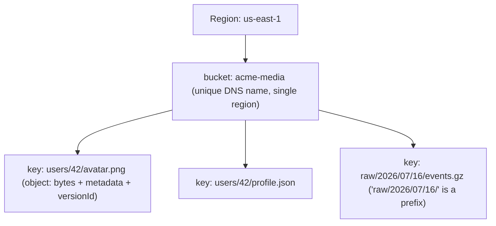
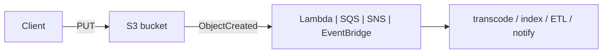

# Amazon S3 Deep Dive: Object Storage at Scale

Amazon Simple Storage Service (S3) is a fully managed, regional **object store**. It
is the default durable-storage substrate for most AWS architectures: data lakes,
static websites, backups, media, log sinks, ML training sets, and the landing zone
for event-driven pipelines. In a system-design interview S3 is rarely the "hard part"
by itself — the interesting answers are about **which storage class, which access
pattern, which consistency and durability guarantee, and what it costs**, versus block
(EBS) and file (EFS) storage. This note is organized around those trade-offs.

Mental model: S3 is a giant, flat, distributed key-value map from `(bucket, key)` to
an immutable blob of bytes plus metadata. It is **not** a filesystem (no true
directories, no in-place partial writes, no POSIX locking) and **not** a database
(no cross-object transactions, no secondary indexes, no server-side joins beyond a
single-object S3 Select). Everything else follows from that.

---

## S3 object model, buckets, keys, and prefixes

**Object.** The unit of storage. An object = the data (0 bytes up to **5 TiB**), a
**key** (UTF-8 name, up to 1024 bytes), a version ID (if versioning is on), plus
system and user metadata. Objects are **immutable**: you cannot append or edit in
place — a "modification" is a full re-`PUT` (or a copy) that replaces the object. Max
size in a **single PUT is 5 GiB**; beyond that (and recommended above ~100 MB) you use
multipart upload up to the 5 TiB ceiling.

**Bucket.** A globally-unique-named container that lives in exactly **one Region**.
The name is part of the global DNS namespace, so `my-bucket` must be unique across all
AWS accounts worldwide. Data never leaves the Region unless you replicate it. Default
soft limit is **10,000 buckets per account** (raisable to ~1 million via a quota
increase), which is why you should model tenants/users as **key prefixes inside one
bucket**, not one bucket per tenant.

**Key and "prefix".** The key is the full path-like string, e.g.
`logs/2026/07/16/app.log`. S3 has **no real folders** — the console fakes them by
splitting on `/`. A **prefix** is any leading substring of keys; it is the unit that
`ListObjectsV2` filters on (with `prefix=` and `delimiter=/`) and, crucially, the unit
S3 uses to **auto-partition for throughput** (see request-rate section).

**Trade-off — one bucket vs many.** Prefer **few buckets, many prefixes**. Bucket
policies, default encryption, replication, and lifecycle rules are configured
per-bucket, so buckets are the natural boundary for *coarse* policy/compliance
separation (e.g. PII vs non-PII, prod vs dev). But per-tenant buckets hit the account
limit and multiply operational surface. Use prefixes + IAM policy conditions
(`s3:prefix`, `${aws:PrincipalTag}`) or **S3 Access Points** (named network endpoints,
each with its own policy) for per-tenant isolation within a shared bucket.

---

## Strong read-after-write consistency

Since **December 2020**, S3 provides **strong read-after-write consistency** for all
GET, PUT, LIST, and metadata (HEAD) operations, in **all Regions, at no extra cost and
with no performance penalty**. Before that, S3 was eventually consistent for overwrite
PUTs and for LISTs, which forced designs like "write a manifest" or DynamoDB-based
consistency layers (e.g. the old EMRFS/S3Guard). Those workarounds are now obsolete.

What strong consistency **does** cover:
- A successful `PUT` of a **new** object → a subsequent GET immediately returns it.
- An **overwrite** PUT → a subsequent GET returns the new data (no stale reads).
- A `DELETE` → a subsequent GET returns 404 (no phantom object).
- `LIST` immediately reflects the changes above (list-after-write is consistent).

What it does **NOT** cover — common interview traps:
- **Cross-Region Replication** is still **asynchronous and eventually consistent**;
  the destination bucket lags the source (RTC gives an SLA, see replication section).
- **S3 does not offer read-your-writes across the CDN**: if CloudFront (or any cache)
  fronts the bucket, the cache TTL, not S3, governs staleness.
- **No conditional-transaction / compare-and-swap across objects.** There is no
  multi-object transaction. (S3 does support conditional writes via
  `If-None-Match: *` to prevent overwrites, and precondition headers like
  `If-Match`/ETag for single-object optimistic concurrency, but not multi-key ACID.)
- Consistency is **per key**, not a global snapshot; a LIST + GET of many keys is not
  an atomic view of the bucket.

**Conditional writes (2024 GA) — "can S3 be a lock?"** S3 now supports
**`If-None-Match: *` on PUT**: the write succeeds only if the key does **not** already
exist, otherwise it fails with `412 Precondition Failed`. Two writers racing to create
the same key → exactly one wins, the other gets 412 — a real **compare-and-swap on a
single key** that prevents overwrite races (e.g. "first uploader claims this slot")
without a separate lock table. **But the honest caveat interviewers want:** it is
**single-key only** — it is *not* a multi-object transaction, not a mutex you can hold
and release, and not a fencing token. For anything spanning multiple objects or needing
lease/heartbeat semantics, coordination still belongs in **DynamoDB conditional
writes** or a real lock table.

**Trade-off / design impact.** Strong consistency means you can use S3 as the source
of truth in a pipeline without a separate coordination store — e.g. a Lambda triggered
by an event notification can immediately read the object. But you still must not treat
S3 as a lock service or a transactional DB; put coordination in DynamoDB (conditional
writes) or a lock table.

---

## Storage classes and cost latency trade-offs

Most classes share the same **11 nines (99.999999999%) durability** — *except the
single-AZ classes*, **One Zone-IA** and **Express One Zone**, which store data in just
one Availability Zone: still highly durable *within* that AZ, but data is lost if that AZ
is destroyed (no multi-AZ redundancy). What otherwise differs across classes is
**availability SLA, minimum billing constraints, per-GB price, and retrieval latency/cost**.

| Class | Use case | Availability (design) | Min duration | Min billable size | Retrieval latency | Retrieval fee |
|---|---|---|---|---|---|---|
| **Express One Zone** | Latency-critical, high-QPS, single-AZ | 99.95% (single AZ) | none | none | single-digit ms (~10x faster) | none (higher per-request price) |
| **Standard** | Hot, frequently accessed | 99.99% | none | none | ms (immediate) | none |
| **Standard-IA** | Infrequent, needs instant access | 99.9% | 30 days | 128 KB | ms (immediate) | per-GB retrieval |
| **One Zone-IA** | Re-creatable, infrequent | 99.5% | 30 days | 128 KB | ms (immediate) | per-GB retrieval |
| **Intelligent-Tiering** | Unknown/changing access | 99.9% | none* | none | ms (frequent/IA tiers) | none for freq/IA; monitoring fee |
| **Glacier Instant Retrieval** | Archive, rare, needs ms | 99.9% | 90 days | 128 KB | milliseconds | per-GB retrieval |
| **Glacier Flexible Retrieval** | Archive, minutes-hours OK | 99.99% (after restore) | 90 days | none | 1–5 min (expedited) to 3–5 h (standard); bulk 5–12 h | per-GB + per-request |
| **Glacier Deep Archive** | Cold, ≤2x/yr, hours OK | 99.99% (after restore) | 180 days | none | 12 h (standard), up to 48 h (bulk) | per-GB + per-request |

\*Intelligent-Tiering has no minimum duration but has a small **per-object monitoring
fee**; objects auto-move between Frequent, Infrequent (30d), and optional Archive
Instant (90d), Archive Access (90–730d), and Deep Archive Access (180d+) tiers based
on observed access.

**Cost intuition (rough, us-east-1 order of magnitude):** Standard ~$0.023/GB-mo;
Standard-IA ~$0.0125; Glacier Instant ~$0.004; Glacier Flexible ~$0.0036; Deep Archive
~$0.00099. Deep Archive is ~20x cheaper than Standard for storage — but you pay for
retrieval and wait hours.

**S3 Express One Zone + directory buckets (know it exists in 2026).** Launched Nov
2023, this is the newest class and the one a senior interviewer expects on a "deep
dive." It targets **latency-sensitive, high-request-rate** workloads — ML training
shuffle, analytics scratch/spill, interactive session data — delivering **single-digit
millisecond, ~10x lower request latency** than Standard and hundreds of thousands of
requests/sec per bucket. The trade-offs:
- **Single AZ.** You pick the AZ (co-locate it with your compute to kill network hops).
  That means **no multi-AZ durability protection** — treat it like One Zone-IA for
  data you can regenerate, not your only copy of crown-jewel data.
- **Different bucket type + API model.** It uses **directory buckets**, not the flat
  general-purpose namespace: a distinct bucket type with a hierarchical/directory key
  model and a session-token-based auth (`CreateSession`) for the fast path — you don't
  just flip a storage class on an existing bucket.
- **Inverted cost shape.** **Lower per-GB storage than Standard-IA** but **higher
  per-request price** — the opposite of the archive classes. It wins when requests-per-
  GB is high (many small hot reads), loses for cold bulk.
- **Pick it when** latency and QPS dominate and the data is co-located with compute and
  re-creatable; **skip it** for durable multi-AZ storage of record (use Standard) or
  cheap cold data (use Glacier tiers).

**Key trade-offs / gotchas interviewers probe:**
- **Standard-IA/One Zone-IA min 128 KB, 30-day floor.** Storing millions of tiny
  (e.g. 4 KB) objects in IA is a classic mistake: you're billed as if each were 128 KB
  and for 30 days minimum, so IA can cost *more* than Standard. IA is for large,
  infrequently accessed objects.
- **One Zone-IA** saves ~20% vs Standard-IA but sacrifices AZ redundancy — only for
  **re-creatable** data (e.g. transcoded thumbnails, secondary copies).
- **Intelligent-Tiering** is the safe default when access patterns are unknown or
  spiky, because it has **no retrieval fees** for the frequent/infrequent tiers and
  auto-optimizes — you trade a tiny monitoring fee for not having to guess. Bad for
  huge numbers of tiny objects (monitoring fee is per object) or for data you *know*
  is always hot (just use Standard).
- **Glacier Flexible vs Deep Archive vs Instant:** pick by *retrieval latency
  tolerance*. Need milliseconds but rare access → Glacier Instant. Minutes-to-hours OK
  → Flexible. Effectively never, hours-to-days OK, cheapest → Deep Archive.
- **Early-deletion charges:** deleting/transitioning IA before 30d, Glacier before
  90d, Deep Archive before 180d incurs a pro-rated charge. Churny data should stay in
  Standard or Intelligent-Tiering.

> [!WARNING]
> **Worked example — the IA tiny-file trap (why "cheaper per GB" backfires).** You
> have **10,000,000 objects × 5 KB each** and move them to Standard-IA to save money.
> - *Actual data:* 10,000,000 × 5 KB = 50,000,000 KB ≈ **50 GB**.
> - *What IA bills:* IA rounds each object up to a **128 KB minimum**, so
>   10,000,000 × 128 KB = 1,280,000,000 KB = **1,280 GB (1.28 TB) billable** — 25.6× the
>   real bytes.
> - *IA cost:* 1,280 GB × $0.0125 = **$16.00/mo** (plus a 30-day-minimum floor, so
>   deleting early buys you nothing).
> - *Standard cost for the same real data:* 50 GB × $0.023 = **$1.15/mo**.
> - **Result: IA costs ~14× more than Standard here** ($16.00 vs $1.15). IA only wins on
>   *large* objects; for a swarm of tiny objects, pack them into fewer big files (gzip/
>   Parquet) or keep them in Standard / Intelligent-Tiering.

---

## Lifecycle policies and Intelligent-Tiering

**Lifecycle policies** are per-bucket (optionally per-prefix or per-tag) rules that
**transition** objects between classes and **expire** (delete) them on an age
schedule. This is how you implement tiered retention declaratively instead of writing
cron jobs.

Example policy: keep logs in Standard 30 days → transition to Standard-IA at 30d →
Glacier Flexible at 90d → Deep Archive at 365d → expire at 7 years. Separately,
**expire noncurrent versions** after N days and **abort incomplete multipart uploads**
after 7 days (a must-have rule — orphaned multipart parts silently accrue storage
cost forever otherwise).

**Trade-off — lifecycle rules vs Intelligent-Tiering:**
- **Lifecycle** is deterministic and free to run, but you must *know* the access curve
  (great for logs/backups with a predictable cooling pattern). If your guess is wrong,
  you pay retrieval fees to bring data back.
- **Intelligent-Tiering** reacts to *actual* access and never charges retrieval for
  frequent/IA tiers, at the cost of a per-object monitoring fee — better when access
  is unpredictable. You can even set Intelligent-Tiering to include the archive tiers,
  combining auto-tiering with deep-archive economics.
- **Transition cost:** each lifecycle transition is a **per-object request charge**.
  Transitioning billions of tiny objects can cost more in request fees than you save
  in storage. Aggregate small objects (e.g. into Parquet/gz) before archiving.

---

## Durability, availability, and multi-AZ design

S3 Standard is designed for **99.999999999% (11 nines) durability** and **99.99%
availability**. Eleven nines means for 10 million objects you'd expect to lose one
object roughly every 10,000 years — durability so high it is effectively "never lose
data" in interview terms.

**How S3 achieves it:** every object (in multi-AZ classes) is **redundantly stored
across a minimum of three Availability Zones** within the Region. S3 uses erasure
coding / replication under the hood, continuously verifies data with checksums, and
self-heals from bit rot and device/AZ failure. **Erasure coding intuition:** instead
of keeping 3 full copies (200% overhead), S3 splits an object into *N* data shards plus
*M* parity shards (Reed-Solomon math, like RAID) and spreads all *N+M* across AZs; the
original is reconstructable from *any N* of the shards, so it tolerates losing *M*
shards (or a whole AZ's worth) while paying only ~*M/N* extra storage instead of a full
2x–3x — durability of many-way replication at a fraction of the byte overhead. Because AZs are physically separate
data centers with independent power/network, the loss of an entire AZ does not cause
data loss or (for multi-AZ classes) unavailability.

**Durability vs availability — the distinction interviewers want:**
- **Durability** = will the bytes survive (not be lost/corrupted). S3 = 11 nines
  everywhere except One Zone-IA's single-AZ exposure.
- **Availability** = can you access them *right now* (SLA). Standard 99.99%, IA 99.9%,
  One Zone-IA 99.5%. Lower availability classes may occasionally return 500/503 and
  need retries, but the data is still durable.
- **One Zone-IA** is the trap: still 11 nines of durability *by design*, but if that
  single AZ is destroyed the data is **permanently lost** — so its effective
  durability against AZ loss is far lower. Only for re-creatable data.

**Region-level failure:** S3 is regional; an entire-Region outage or a
compliance/DR requirement is handled with **Cross-Region Replication** (async). S3
does not automatically span Regions. Multi-Region Access Points can route requests to
the nearest healthy replica.

**Integrity:** S3 supports MD5 (`Content-MD5`) and additional checksum algorithms
(CRC32, CRC32C, SHA-1, SHA-256, and CRC64NVME) on upload so it can reject corrupted
transfers end-to-end.

---

## Request rate scaling and key-prefix design

S3 automatically scales to very high request rates. The documented per-prefix ceiling
is **3,500 PUT/COPY/POST/DELETE requests per second** and **5,500 GET/HEAD requests
per second**, **per partitioned prefix**. There is **no limit to the number of
prefixes** in a bucket, so aggregate throughput is effectively unbounded: parallelize
reads/writes across many prefixes and you can reach tens or hundreds of thousands of
requests per second.

**Key insight (post-2018):** S3 partitions by key **prefix**, and these limits are
**per prefix**, not per bucket. So a bucket with 10 prefixes each doing 5,500 GET/s can
sustain 55,000 GET/s. When S3 sees sustained load on a prefix it **automatically
splits the partition** — but that adaptation takes time (you may see 503 SlowDown
during ramp).

**Hot-partition / key-design trade-off:**
- **Old advice (pre-2018):** add a random hash prefix to avoid sequential keys
  creating one hot partition. This is **largely obsolete** — S3 now handles sequential
  keys better and randomizing hurts LIST/prefix queries.
- **Current advice:** design prefixes that distribute load and match your access
  pattern. For extreme write bursts on date-partitioned data (e.g.
  `2026/07/16/...`), the leading date is the same for all writers → one hot prefix.
  Introduce a distributing component *early* in the key (e.g.
  `shard=07/2026/07/16/...` or a leading hash bucket) so writes fan across partitions,
  while still keeping prefixes queryable.
- **Handling 503 SlowDown:** use **exponential backoff with jitter** and spread the
  key space; S3 will repartition to catch up. This is a throughput-shaping problem,
  not a hard cap.

**Back-of-envelope:** need 100k GET/s? That's ~19 prefixes at 5,500/s each. Structure
keys so requests naturally distribute across ≥ that many prefixes.

---

## Multipart upload, byte-range, and Transfer Acceleration

**Multipart upload (MPU).** Splits a large object into parts (each 5 MiB–5 GiB, up to
**10,000 parts**, max object **5 TiB**) uploaded **in parallel and independently**,
then assembled server-side with a final `CompleteMultipartUpload`. Benefits: higher
throughput (parallelism), resilience (retry a single failed part, not the whole file),
and the ability to start uploading before you know the total size. AWS recommends MPU
for objects **> 100 MB** and requires it above 5 GiB.
- **Gotcha:** if you never call Complete or Abort, the uploaded parts **persist and are
  billed** as storage forever. Always set a lifecycle rule to **abort incomplete
  multipart uploads** after N days.
- **Worked example — "you're uploading a 5 TB file, what part size?"** The cap is
  **10,000 parts**, so the minimum part size is total size ÷ 10,000:
  5 TiB / 10,000 = (5 × 1024 × 1024 MiB) / 10,000 = 5,242,880 MiB / 10,000 ≈
  **524 MiB per part** (round up to ~525 MiB+ to leave headroom). Flip it around: if you
  naively keep the **default 5 MiB** part size, 10,000 × 5 MiB = 50,000 MiB ≈ **50 GiB**
  is the largest object you can finish before you hit the 10,000-part wall — the
  `CompleteMultipartUpload` fails past that. **Takeaway: scale part size with object
  size** (a common rule is ~part size = max(5 MiB, objectSize/10,000)), don't hard-code
  a tiny constant.

**Byte-range GET.** `Range: bytes=start-end` fetches only part of an object. Enables
parallel downloads (fetch ranges concurrently), resumable downloads, and reading just a
header/footer (e.g. Parquet footer) without pulling the whole file. Pairs with
range-based retries for large objects.

**S3 Transfer Acceleration.** Routes uploads through the nearest **CloudFront edge
location** onto the AWS backbone to the bucket's Region, speeding **long-distance**
transfers. Trade-off: extra per-GB fee; only worth it when clients are far from the
bucket Region and you're moving large volumes over the public internet. For
same-Region or already-fast paths it can be *slower* (AWS's speed comparison tool tells
you). Alternatives: **multipart + parallelism** (free, often enough), **Snowball**
for petabyte offline transfer, **DataSync** for large online migrations, **Direct
Connect** for a dedicated pipe.

**Trade-off summary for big uploads:** parallel multipart first (free); add Transfer
Acceleration for far-away clients; use Snow family for offline bulk when bandwidth or
time is the constraint (a full Snowball beats the internet past a break-even
data-size/bandwidth point).

---

## Versioning, MFA delete, and Object Lock (WORM)

**Versioning.** When enabled on a bucket, every PUT/overwrite creates a **new version
ID**; a DELETE inserts a **delete marker** (the object appears gone but prior versions
remain, recoverable). Protects against accidental overwrite/delete and is a
**prerequisite for replication**. Once enabled it can be **suspended but never fully
disabled**.
- **Trade-off / cost:** you pay for **every** version's storage. Without a lifecycle
  rule to expire noncurrent versions, churny/overwritten objects silently balloon
  storage cost. Always pair versioning with noncurrent-version expiration.

**MFA Delete.** Optional hardening on a versioned bucket requiring an **MFA token** to
permanently delete a version or to change the bucket's versioning state. Strong
protection against malicious/accidental permanent deletion, but can only be enabled by
the **root account** and complicates automation — reserve for high-value buckets.

**Object Lock (WORM — Write Once Read Many).** Prevents object versions from being
deleted or overwritten for a fixed **retention period** or under a **legal hold**.
Requires versioning. Two modes:
- **Governance mode:** users with a special IAM permission
  (`s3:BypassGovernanceRetention`) can still delete/shorten — for internal controls.
- **Compliance mode:** **no one, not even the root account**, can delete or shorten the
  retention until it expires — for regulatory WORM (SEC 17a-4, FINRA, etc.).
- **Legal hold:** independent of a retention period; blocks deletion until explicitly
  removed.

**Trade-off:** Compliance-mode Object Lock is genuinely immutable — powerful for
ransomware protection and audit, but you **cannot** get the storage back until
retention expires, so a mistake in the retention period is expensive and
irreversible. Test with Governance mode first.

---

## Encryption with SSE-S3, SSE-KMS, and SSE-C

S3 encrypts **all new objects at rest by default** (since Jan 2023, SSE-S3 minimum).
Options differ by **who controls the keys** and the resulting audit/cost/perf profile:

| Option | Key ownership | Audit trail | Cost | Perf / limits | When to use |
|---|---|---|---|---|---|
| **SSE-S3** (AES-256) | AWS-managed keys | none per-object | free | no throttling | Default; no compliance need for key control |
| **SSE-KMS** | Your KMS CMK | CloudTrail per decrypt | KMS request $ + key $ | KMS API limits (throttling at scale) | Need key rotation policy, access audit, key isolation |
| **SSE-KMS + S3 Bucket Keys** | Your KMS CMK | reduced (bucket-level) | much lower KMS cost | fewer KMS calls | High-throughput KMS workloads |
| **SSE-C** | Customer-supplied key on each request | none | free (S3 side) | you manage keys | You must hold keys outside AWS |
| **Client-side** | You, before upload | n/a | your compute | you do crypto | Zero trust in AWS for plaintext |

**Trade-offs:**
- **SSE-KMS** gives you an auditable, revocable, rotatable key and per-request
  CloudTrail decrypt logs — the compliance favorite — but every GET/PUT calls KMS,
  which has **account/region request-rate limits** and per-request cost. A high-QPS S3
  workload can get **throttled by KMS**, not S3. **S3 Bucket Keys** solve this by
  generating a short-lived bucket-level data key, cutting KMS calls by orders of
  magnitude (and cost) — enable them for any high-throughput KMS-encrypted bucket.
- **SSE-C:** you send the key with every request over TLS; S3 uses it and forgets it.
  Full key control without KMS, but you bear all key management and lose S3-side
  rotation — rarely the right answer unless you have a hard "AWS must never store our
  keys" requirement.
- Encryption in transit is enforced separately with a bucket policy denying
  `aws:SecureTransport = false` (require HTTPS).

---

## Access control, bucket policies, and Block Public Access

S3 access is governed by a layered model; **the effective permission is the
intersection of all of them** (an explicit Deny anywhere wins):
- **IAM identity policies** — what a principal (user/role) can do.
- **Bucket policies** — resource-based policy on the bucket (cross-account access,
  conditions like source VPC, IP, `aws:SecureTransport`, prefix).
- **ACLs (legacy)** — object/bucket-level grants; AWS now **disables ACLs by default**
  (Bucket Owner Enforced / Object Ownership), and best practice is to keep ACLs off and
  use policies exclusively.
- **Block Public Access (BPA)** — account- and bucket-level master switch that, when
  on (the default since 2023), **overrides** any policy/ACL that would grant public
  access. This is the single most important safety control against the classic "public
  S3 bucket data leak."
- **S3 Access Points** — named endpoints each with their own policy, to manage access
  for shared data sets at scale (per-app/per-tenant policies without one giant bucket
  policy). **VPC-only access points** restrict a dataset to a VPC.

**Trade-offs / best practices:**
- Prefer **bucket policies + IAM over ACLs**; disable ACLs (Object Ownership = Bucket
  Owner Enforced).
- Keep **Block Public Access ON**; serve public content via **CloudFront + Origin
  Access Control (OAC)** with a private bucket, not a public bucket. Cheaper egress,
  caching, TLS, WAF, and no accidental exposure.
- Use **VPC gateway endpoints for S3** so traffic stays on the AWS network (no NAT
  gateway data-processing cost, and you can restrict the bucket to that endpoint).

---

## Presigned URLs and static website hosting

**Presigned URLs.** A time-limited URL, signed with an IAM principal's credentials,
that grants a specific operation (usually `GET` or `PUT`) on a specific key **without
the client having AWS credentials or the bucket being public**. Ideal for
browser-direct upload/download: your backend signs the URL, the client
uploads/downloads directly to S3, offloading bandwidth from your servers.
- Expiry: up to **7 days** when signed with SigV4 IAM user creds; **≤ 36 hours** when
  signed with temporary credentials (STS/role) because the URL can't outlive the
  session token. The URL's power is bounded by the **signer's** permissions.
- **Trade-off:** presigned PUT is great for offloading uploads, but you can't easily
  enforce content size/type after signing beyond policy conditions; for stricter
  browser uploads use **POST policy** (form upload with content-length-range
  conditions) or validate post-upload via an event notification.

**Static website hosting.** S3 can serve a static site directly (index/error
documents). But the recommended production pattern is **CloudFront in front of a
private S3 bucket via OAC**, because:
- S3 website endpoints are **HTTP only** (no HTTPS on the raw S3 website endpoint);
  CloudFront gives TLS, custom domains, caching, and lower egress cost.
- CloudFront + private bucket keeps Block Public Access on.

---

## S3 event notifications and event-driven patterns

S3 can emit events (`s3:ObjectCreated:*`, `ObjectRemoved:*`, `ObjectRestore:*`,
replication events, lifecycle events, etc.) to **Lambda, SQS, SNS**, and to
**Amazon EventBridge**. This makes S3 the front door of serverless, event-driven
pipelines (upload → process → store).

**Delivery semantics / gotchas:**
- Event notifications are **at-least-once** and typically delivered in seconds, but
  **no strict ordering** and occasional duplicates — consumers must be **idempotent**.
- Direct S3 → Lambda/SQS/SNS supports **one destination per event-type+prefix
  configuration** and limited filtering (prefix/suffix). **EventBridge** is the modern
  choice: richer content-based filtering, multiple targets/fan-out, archive/replay,
  and cross-account routing — at slightly higher cost/latency.
- **Fan-out pattern:** S3 → SNS → multiple SQS queues → multiple consumers, or
  S3 → EventBridge → multiple targets.
- **Buffering / spikes:** put **SQS between S3 and compute** to absorb bursts and
  decouple, so a flood of uploads doesn't overwhelm downstream (and gives retries +
  DLQ). Direct S3 → Lambda scales but can hit Lambda concurrency limits under a spike.

**Lambda-relevant limits for S3 processing:** Lambda max **15-minute** timeout, up to
**10 GB memory**, **10 GB ephemeral `/tmp`**, 6 MB synchronous / 256 KB async payload.
So a Lambda can't hold a 50 GB object in memory/tmp — stream it with byte-range GETs,
or use Fargate/EMR for large objects. API Gateway's **29-second** integration timeout
means you can't proxy a long S3 processing job synchronously through it — return a
job id and go async.

---

## S3 Select and data querying

**S3 Select** lets you run a **SQL SELECT (with WHERE/projection)** over a **single
object** (CSV, JSON, or Parquet, optionally gzip/bzip2) so S3 returns **only the
matching rows/columns** instead of the whole object. This cuts data transferred and
client-side parsing — useful when you repeatedly read a small slice of large files.

**Trade-offs / when to use what:**
- **S3 Select** = single object, simple predicate/projection, no joins/aggregations
  across files. Cheap, low latency for "grab a few columns/rows from this one file."
- **Amazon Athena** = serverless Presto SQL across **many** objects/partitions in a
  bucket (a whole data lake), with joins, aggregations, and the Glue Data Catalog. Pay
  per TB scanned — reduce cost with **columnar Parquet + partitioning + compression**.
- **Redshift Spectrum / EMR** = heavier, for large recurring analytical workloads.
- Rule of thumb: filtering one big file → S3 Select; querying a partitioned dataset →
  Athena; petabyte recurring pipelines → EMR/Redshift.

Also note **S3 Object Lambda**: run your own Lambda to transform object data *on the
GET path* (redact PII, reformat, resize) without duplicating the object.

---

## Cross-Region and Same-Region Replication

**Replication** asynchronously copies objects from a source bucket to one or more
destination buckets. Requires **versioning on both** source and destination.
- **CRR (Cross-Region Replication):** different Region — for DR, lower-latency reads
  near users, and compliance/data-residency.
- **SRR (Same-Region Replication):** same Region — for log aggregation across
  accounts, prod→test data, and separating access controls/ownership.

**Key facts / trade-offs:**
- Replication is **asynchronous and eventually consistent** — the destination lags. It
  replicates **new** objects after you enable it; existing objects need **S3 Batch
  Replication**.
- **S3 Replication Time Control (RTC)** adds an **SLA to replicate 99.99% of objects
  within 15 minutes** (with replication metrics) — pay extra for a bounded RTO/lag.
  Without RTC, lag is best-effort (usually seconds-minutes but unbounded).
- You can replicate to a **different storage class** and **change ownership**
  (bidirectional replication for active-active is possible with replica modification
  sync).
- **Delete markers**: by default delete markers can be replicated (configurable);
  actual version deletes are **not** replicated (protects against propagating
  destructive deletes).
- **Cost:** you pay for the destination storage, the replication PUT requests, **and
  inter-Region data transfer** for CRR — replicating a large hot bucket cross-Region is
  expensive; replicate selectively (prefix/tag filters) if you can.
- **Multi-Region Access Points** put a single global endpoint over replicated buckets
  with automatic failover routing.

---

## S3 versus EBS versus EFS

The classic "which storage" question. All three are AWS-managed but solve different
problems:

| Dimension | **S3 (object)** | **EBS (block)** | **EFS (file)** |
|---|---|---|---|
| Abstraction | Objects via HTTP API (`GET`/`PUT`) | Raw block volume attached to **one** EC2 (io2 supports multi-attach) | POSIX filesystem (NFS) |
| Access | Anywhere, any client, massively concurrent | Single instance (usually), same AZ | Many instances, many AZs, concurrent |
| Scope | **Regional**, 11 nines, multi-AZ | **Single AZ** (snapshot to S3 for durability) | Regional, multi-AZ |
| Mutation | Immutable, full-object replace | In-place random read/write (real disk) | In-place random read/write, POSIX locks |
| Capacity | Effectively unlimited; 5 TB/object | Provisioned per volume (up to 64 TiB) | Elastic, petabytes, pay-per-use |
| Latency | ~tens of ms first byte (HTTP) | sub-ms (local block) | low-ms (network file) |
| Throughput | Very high via parallelism/prefixes | High, provisioned IOPS (io2 Block Express) | Scales with size / provisioned mode |
| Typical use | Data lake, backups, media, static assets, logs | Boot volumes, databases needing block I/O | Shared app files, home dirs, CMS, lift-and-shift NFS |
| Cost model | Per GB + requests + egress | Per provisioned GB + IOPS (paid even if idle) | Per GB used (+ throughput mode) |

**How to decide (interview framing):**
- Need a **filesystem with random in-place writes / low latency for a DB or boot
  disk**, single instance → **EBS**.
- Need a **shared POSIX filesystem** many instances mount concurrently (legacy apps,
  shared content) → **EFS**.
- Need **durable, cheap, massively scalable, internet-accessible blob storage** with
  no filesystem semantics (analytics, media, backup, static hosting) → **S3**.
- **Trade-off nuance:** S3 is cheapest per GB and infinitely scalable but has
  higher/HTTP latency and no in-place edits; EBS is fastest but single-AZ, single-
  attach, and you pay for provisioned capacity whether used or not; EFS is the
  convenience choice for shared POSIX but costs more per GB than S3 and than EBS
  general-purpose. Don't put a transactional DB on S3, and don't use EBS/EFS as a data
  lake.

---

## Egress and data transfer economics

Storage price is often *not* the dominant cost — **data transfer out (egress)** is.
- **Ingress (upload) to S3 is free.** **Egress to the internet is charged per GB**
  (roughly ~$0.09/GB for the first tier in us-east-1, tiered down at volume).
- **Same-Region S3 → EC2/other AWS services is free**; **cross-Region** transfer and
  **cross-AZ** traffic are charged.
- **S3 → CloudFront → internet** is usually cheaper than S3 → internet directly
  (origin-to-CloudFront transfer is free, and CloudFront egress is lower + cached), so
  fronting S3 with CloudFront both speeds delivery and cuts egress cost.
- **VPC Gateway Endpoint for S3** is free and keeps S3 traffic off the NAT gateway,
  avoiding NAT **data-processing** charges — a common hidden cost when private-subnet
  instances hit S3 through NAT.
- **Cross-Region Replication** and **Transfer Acceleration** add transfer fees — model
  them before enabling on large buckets.
- **Requester Pays** buckets shift request+egress cost to the caller — useful for
  sharing large public datasets without footing the download bill.

**Cost estimation checklist for a design:** storage GB × class price + request counts
(PUT/GET/lifecycle transitions) × per-request price + egress GB × transfer price +
(KMS requests, replication transfer, monitoring/analytics fees). At scale, request and
egress costs frequently dwarf raw storage.

**Worked example — egress dwarfs storage.** Say you host **100 TB** in S3 Standard and
serve **500 TB/month** of downloads straight to the internet:
- *Storage:* 100 TB = 100 × 1024 GB = 102,400 GB × $0.023 = **~$2,355/mo**.
- *Egress:* 500 TB = 500 × 1024 GB = 512,000 GB × ~$0.09/GB = **~$46,080/mo**
  (before tiered volume discounts).
- **Egress is ~20× the storage bill.** This is why "just store it in S3" is the easy
  part and *serving* it is the cost driver — and why fronting the bucket with CloudFront
  (S3-origin transfer is free, CloudFront per-GB is lower and cached) or using a VPC
  gateway endpoint for in-AWS consumers is where the real savings live, not shaving the
  per-GB storage class.

---

## Trade-offs and when to use what

A consolidated decision guide for the choices interviewers push on:

- **Storage class:** hot → Standard; unknown/spiky → Intelligent-Tiering; large +
  infrequent + instant → Standard-IA; re-creatable + infrequent → One Zone-IA; archive
  needing ms → Glacier Instant; archive minutes-hours OK → Glacier Flexible; coldest,
  hours-days OK → Deep Archive. Watch 128 KB / 30-90-180-day minimums.
- **Consistency:** rely on strong read-after-write within a Region; do **not** rely on
  it across CRR or a CDN, and never use S3 as a lock/transaction store (use DynamoDB
  conditional writes).
- **Throughput:** distribute keys across prefixes (3,500 PUT / 5,500 GET per prefix),
  parallelize with multipart and byte-range; back off with jitter on 503 SlowDown.
- **Big transfers:** multipart-parallel first (free) → Transfer Acceleration for
  far clients → Snow family offline for petabytes / limited bandwidth.
- **Security:** Block Public Access ON; disable ACLs; private bucket + CloudFront OAC
  for public content; SSE-KMS + Bucket Keys for auditable encryption at scale; VPC
  endpoint to keep traffic private and cut NAT cost.
- **Immutability/compliance:** versioning + noncurrent expiration for accident
  recovery; Object Lock Compliance mode for regulatory WORM/ransomware; MFA delete for
  crown-jewel buckets.
- **Event processing:** EventBridge for rich routing/fan-out; SQS buffer before
  compute to absorb spikes + retries/DLQ; keep consumers idempotent (at-least-once).
- **Querying:** S3 Select for one file; Athena for a partitioned lake; EMR/Redshift for
  heavy recurring analytics; Object Lambda to transform on read.
- **S3 vs EBS vs EFS:** blob/lake → S3; block/DB/boot → EBS; shared POSIX → EFS.
- **Cost:** egress and requests often dominate storage; front with CloudFront, use VPC
  endpoints, batch small objects, and set lifecycle + abort-incomplete-MPU rules.

---

## Common interview follow-up questions

- "S3 gave you strong consistency in 2020 — what does that *not* cover?" (CRR, CDN
  caches, cross-object transactions.)
- "A tenant uploads millions of 5 KB files and you moved them to Standard-IA to save
  money — what happened to the bill?" (128 KB min + 30-day floor → costs more.)
- "You're seeing 503 SlowDown at peak — walk me through the fix." (Prefix distribution
  + exponential backoff with jitter; S3 auto-repartitions.)
- "High-QPS reads on a KMS-encrypted bucket start failing — why and fix?" (KMS request
  throttling, not S3; enable S3 Bucket Keys.)
- "Design a resumable large-file upload from a mobile app with far clients." (Presigned
  multipart URLs + Transfer Acceleration + abort-incomplete lifecycle rule.)
- "Public website on S3 — how do you serve it securely and cheaply?" (Private bucket +
  CloudFront OAC + BPA on; not the HTTP-only S3 website endpoint.)
- "You need immutable audit logs a regulator accepts." (Object Lock Compliance mode +
  versioning; even root can't delete before retention.)
- "S3 vs EBS vs EFS for <scenario>?" (Map to abstraction: object/block/file.)
- "How do you keep S3 traffic off the internet and avoid NAT charges?" (VPC gateway
  endpoint + endpoint policy.)
- "Ensure a downstream Lambda processes each uploaded object exactly once." (Events are
  at-least-once/unordered → idempotent consumer; SQS buffer + DLQ.)
- "Replicate to another Region with a lag guarantee." (CRR + Replication Time Control
  15-min SLA; Batch Replication for existing objects.)

## References

- AWS S3 Developer Guide — Buckets, Objects, Keys; Storage classes; Lifecycle;
  Replication; Versioning; Object Lock; Encryption; Access management; Event
  notifications; S3 Select; Performance design patterns.
- AWS "Amazon S3 Update – Strong Read-After-Write Consistency" (Dec 2020 announcement).
- AWS S3 Best Practices Design Patterns (performance) — request rate, prefixes,
  multipart, byte-range, backoff.
- AWS re:Invent deep-dive sessions on Amazon S3 (STG "Deep dive" and "Advanced design
  patterns" 300/400-level talks).
- AWS Builders' Library — "Reliability, constant work, and a good cup of coffee" and
  patterns on durability/self-healing.
- AWS Well-Architected Framework — Cost Optimization and Reliability pillars (storage
  tiering, data transfer, multi-AZ/Region).
- AWS KMS Developer Guide — S3 Bucket Keys and request quotas.
- AWS pricing pages — S3 storage classes, requests, data transfer; CloudFront; KMS.
- AWS docs — S3 vs EBS vs EFS storage comparison; VPC endpoints for S3; Snow family &
  DataSync migration guidance.
