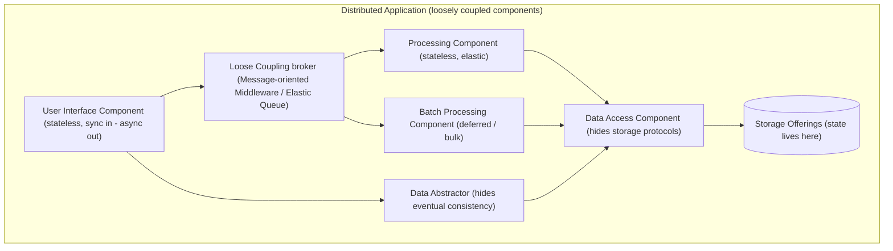
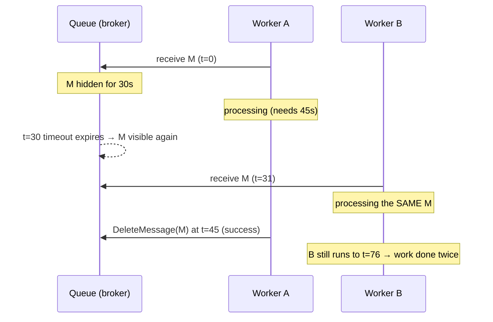

# Cloud Application Architectures: Components & Coupling

How do you slice a cloud application into components that scale out, tolerate failure, and
survive an unreliable network? This topic covers the **Cloud Computing Patterns** of Fehling,
Leymann, Retter, Schupeck & Arbitter (*Cloud Computing Patterns*, Springer 2014;
catalogued at [cloudcomputingpatterns.org](https://www.cloudcomputingpatterns.org/)) that
describe cloud application **architecture** — how to decompose an application into loosely
coupled, mostly **stateless** components, and how those components should process messages
**reliably** in a world of at-least-once delivery.

These are **vendor-neutral, abstract patterns** — the reusable solutions that underpin
cloud-native design regardless of AWS/Azure/GCP. Each section gives the pattern's **intent**
(usually a "How can…?" question), the **problem/context**, the **abstract solution**, a
**Modern equivalent** line (cross-cloud illustrations), **trade-offs / when-to-use**, and
**related patterns**. Products are named only as illustrations — keep the altitude at the
pattern level.

> [!KEY-TAKEAWAY]
> Two ideas thread through every component here: **statelessness** (push session/state to
> external storage so instances are interchangeable and horizontally scalable) and
> **idempotency** (make re-processing harmless so at-least-once delivery is safe). They are
> the cornerstones of cloud-native decomposition.

**Cross-reference boundary (do not re-teach here — link out):**

- Elasticity, load balancing, horizontal scale-out mechanics → `scalability-and-load-balancing`
- Capacity / workload modelling & tail latency → `capacity-modeling-and-tail-latency`
- Strict vs eventual consistency (CAP) → `cap-theorem-and-consistency`
- Messaging middleware, delivery guarantees, queue mechanics → `message-queues-and-async`
- Event-driven / CQRS / Saga / CDC, transactional outbox → `event-driven-cqrs-saga-cdc`
- Relational / key-value / sharding / replication internals → `databases-sql-nosql-sharding-replication`
- Resiliency / watchdog / failure handling depth → `resilience-tradeoffs-deep-dive`, `failure-theory-advanced`
- Microservice boundaries & loose-coupling-in-practice → `microservices-ddd-and-boundaries`, `microservices-monolith-api-design`
- Provider-specific depth (ELB/ASG, SQS/SNS/EventBridge, storage) → the `aws-*` group.

For any overlapping topic, this page gives the **pattern-level** treatment (intent / solution /
trade-off + the pattern vocabulary) and points to the deep dive.



---

## Loose Coupling

Think of it as **mailing a letter vs. making a phone call**. A phone call is tight coupling: both
people must be present at the same moment, each must know the other's number, and if one hangs up
the conversation dies. Mailing a letter is loose coupling: you drop it in the box and walk away, the
recipient reads it whenever they're up, and neither of you needs the other online right now. The
mailbox (broker) absorbs all the assumptions you'd otherwise make about each other.

**Intent.** *How can dependencies between distributed applications — and between the
components within one application — be minimized?*

**Problem / context.** If component A calls component B directly, A must know B's location,
platform, data format, and must assume B is available *right now*. That web of assumptions
makes it hard to scale, update, replace, or fail-over any single component independently.

**Solution.** Route communication through an **intermediary (broker)** rather than
partner-to-partner. The broker **encapsulates the assumptions** the partners would otherwise
make about each other — location, platform, timing (availability), and data format — so each
side can be scaled, changed, and recovered independently. Asynchronous messaging is the
canonical realization: senders and receivers need not be up at the same time.

**Modern equivalent.** Message brokers / queues (SQS/SNS, Azure Service Bus, Google Pub/Sub,
Kafka, RabbitMQ); service meshes and API gateways as intermediaries; event buses (EventBridge).

**Trade-offs / when to use.** Loose coupling buys independent scaling/evolution and failure
isolation, but adds latency, eventual consistency, and operational complexity (a broker to run,
harder end-to-end debugging). Don't broker two components that are truly one transactional unit.

**Related patterns.** Distributed Application, Message-oriented Middleware, Eventual
Consistency, Watchdog. **Deep dive:** see `message-queues-and-async` (broker mechanics) and
`microservices-monolith-api-design` (coupling in service design).

---

## Distributed Application

**Intent.** *How can application functionality be decomposed to be handled by separate
application components?*

**Problem / context.** Cloud environments are scale-out and often guarantee availability of
the *environment*, not of any single IT resource (Environment-based Availability). An
application must be structured to exploit many, possibly redundant, resources rather than one
big node.

**Solution.** Split functionality into **independent components**, each providing a specific
function (a *logical* decomposition), then group components into **tiers** that are deployed
together (a *physical* grouping). The book gives three decomposition styles:

- **Layer-based** — logical layers (e.g. presentation / business / data); a component may
  access only its own layer or the one directly below.
- **Process-based** — components organized around business processes and their ordered activities.
- **Pipes-and-filters-based** — data-centric: each *filter* transforms input to output, filters
  interconnected by *pipes* (messaging).

> [!TIP]
> **Tier ≠ layer.** A *layer* is a logical grouping of responsibility; a *tier* is a physical
> deployment grouping (a server/cluster). Two layers can live in one tier, and one layer can be
> spread across tiers.

**Modern equivalent.** Microservices; n-tier web/app/data deployments; serverless function
composition; data pipelines (Kafka Streams, Flink, Spark) as pipes-and-filters.

**Trade-offs / when to use.** Decomposition enables independent scaling and elasticity but
introduces network calls, partial failure, and distributed-data problems. Decompose along
stable functional/business seams, not arbitrarily.

**Related patterns.** Loose Coupling, Elastic Infrastructure, Watchdog, Environment-based
Availability, Update Transition Process. **Deep dive:** `microservices-ddd-and-boundaries`.

---

## Stateless Component

Picture a supermarket checkout. If any open cashier can ring up any customer, the manager can open
and close lanes at will as the queue grows or shrinks — because everything that matters (the cart,
the receipt) travels *with the customer*, not inside a specific register. That is a stateless
component. The opposite — a lane where only *your* cashier knows *your* running total — means you
can't switch lanes and the whole line collapses if that cashier walks off. Push the "running total"
out to the customer (request/token) or to a shared ledger (external store) and every lane becomes
interchangeable.

**Intent.** *How can the elasticity and robustness of an application component be increased?*

**Problem / context.** When you scale out by adding/removing instances, the biggest obstacle is
**internal state** held in an instance: you can't freely move load to a new instance (it lacks
the state), and if an instance dies its in-memory state is lost.

**Solution.** Build the component with **no internal session/application state**. State and
configuration are **stored externally** (in storage offerings) or **passed in with every
request**. Instances become **interchangeable** — any instance can serve any request — which is
exactly what makes horizontal scaling and failure recovery trivial.

> [!KEY-TAKEAWAY]
> Statelessness is *the* enabler of elasticity. A stateless instance can be added, removed, or
> replaced with no data loss and no session drain. This is why cloud guidance pushes state to
> databases, caches, and token/cookie payloads.

**Modern equivalent.** Stateless containers/pods behind a load balancer; 12-factor "processes
are stateless"; JWT/cookie session tokens instead of server-side sessions; external session
stores (Redis/ElastiCache, DynamoDB, Memcached).

**Trade-offs / when to use.** Externalizing state adds a storage round-trip per request and load
on the state store; some workloads (long-lived connections, in-memory game state) are inherently
stateful — then confine and replicate state deliberately (**Stateful Component**). Prefer
stateless wherever the domain allows.

**Related patterns.** Relational Database, Key-Value Storage, Blob Storage, Message-oriented
Middleware, Stateful Component. **Deep dive:** `scalability-and-load-balancing` (scale-out &
session handling).

---

## User Interface Component

**Intent.** *How can User Interface Components be accessed interactively by humans while being
configurable and decoupled from the rest of the application?*

**Problem / context.** The UI faces synchronous, human-driven traffic (spiky, latency-sensitive)
yet must be added/removed freely for scaling without disrupting the user, and must not be tightly
bound to back-end components.

**Solution.** The UI component acts as an **intermediary that translates synchronous user
interactions into asynchronous messaging** with the rest of the application (supporting Loose
Coupling). It is kept **stateless** — session state is attached to requests, stored on the user's
device, or held in external storage — and it **scales by the volume of incoming synchronous
requests**, fronted by an Elastic Load Balancer.

**Modern equivalent.** SPA/BFF and web front-ends behind ALB/NLB, Azure LB, GCP LB; the UI tier
enqueues work (SQS/Service Bus/Pub-Sub) rather than calling processing synchronously; sessions in
cookies/JWT or Redis.

**Trade-offs / when to use.** Sync-to-async translation gives responsiveness + decoupling, but the
user must be shown async progress (see Data Abstractor). Load-balancer-driven scaling suits the
bursty, latency-sensitive nature of interactive traffic.

**Related patterns.** Elastic Load Balancer, Managed Configuration, Processing Component, Data
Abstractor, Idempotent/Transaction-based/Timeout-based Processor. **Deep dive:**
`scalability-and-load-balancing`.

---

## Processing Component

**Intent.** *How can processing be scaled out elastically among distributed resources while being
configurable regarding the supported functions to meet different customers' requirements?*

**Problem / context.** The application's *work* (business logic) must run on independent instances
that are cheap to attach/detach during scaling, and configurable so one codebase can serve
different customers/functions.

**Solution.** Divide processing into **discrete function blocks**, each handled by its own
independent, **stateless** Processing Component. Each component scales **independently**, and
scaling is driven by an **Elastic Queue** (queue depth → number of instances). Data needed for
processing is passed in the request or read from storage offerings.

> [!TIP]
> Contrast with **User Interface Component**: the UI scales on *synchronous request rate* via a
> **load balancer**; a Processing Component scales on *asynchronous queue depth* via an **Elastic
> Queue**. Same statelessness principle, different scaling trigger.

**Modern equivalent.** Queue-triggered workers/consumers; Lambda/Azure Functions/Cloud Functions
with SQS/Service-Bus/Pub-Sub triggers; Kubernetes workers scaled by KEDA on queue length; ECS/EKS
service auto-scaled on queue depth.

**Trade-offs / when to use.** Elastic, resilient, independently scalable — at the cost of
asynchrony and the need for idempotency (at-least-once delivery). Use for the async business-logic
tier of a distributed app.

**Related patterns.** Elastic Queue, User Interface Component, Data Access Component, Batch
Processing Component, Managed Configuration, the three Processor patterns. **Deep dive:**
`scalability-and-load-balancing`, `message-queues-and-async`.

---

## Batch Processing Component

**Intent.** *How can asynchronous processing requests be delayed so they are handled when
conditions for their processing are optimal?*

**Problem / context.** Sometimes handling a request *the instant it arrives* is wasteful or
impossible: functionality is accessed infrequently, high-powered instances are kept continuously
busy for efficiency, or resource cost/time-of-day makes immediate processing uneconomical.

**Solution.** **Accept requests whenever they arrive, but hold them** until conditions are
favorable. Components spin up to drain the accumulated work based on **how many requests have
queued, environmental factors, and configurable rules**. Only when a request *cannot be delayed
any longer* does the system process under sub-optimal conditions.

**Modern equivalent.** Batch/bulk workers: AWS Batch, Azure Batch, GCP Batch/Dataflow; scheduled
or accumulation-triggered draining of a queue; Spot/preemptible fleets that run when capacity is
cheap; nightly ETL windows.

**Trade-offs / when to use.** Trades **latency for efficiency/cost** — great for non-urgent bulk
work (reports, ETL, media transcoding), wrong for interactive or time-critical requests. Contrast
with a normal Processing Component, which aims to process promptly.

**Related patterns.** Message-oriented Middleware, Elastic Queue, Processing Component, the three
Processor patterns. **Deep dive:** `message-queues-and-async` (queue-based load leveling),
`design-job-scheduler-task-queue`.

---

## Data Access Component

**Intent.** *How can the complexity of data storage — access protocols and data consistency — be
hidden and isolated while keeping data structure configurable?*

**Problem / context.** Authorization, querying, error handling, and storage-specific quirks bleed
into every component that touches storage, creating **tight coupling** to a particular storage
offering. It gets worse when data spans multiple providers that must be unified behind one view.

**Solution.** A **dedicated component consolidates and coordinates all data manipulation**. Other
components talk only to it, through a single consistent interface. When a storage offering is
swapped or its interface changes, **only this one component changes** — the rest of the app is
shielded. (A variant, **Restricted Data Access Component**, additionally enforces access/authorization
policy.)

**Modern equivalent.** Repository / DAO layer; the "database-per-service" access module; an ORM or
data-access microservice; a provider adapter unifying multi-cloud storage; DynamoDB/RDS access
encapsulated behind one service.

**Trade-offs / when to use.** Isolates and centralizes storage concerns (swap-ability, testability)
but can become a bottleneck or a "god" data layer if it absorbs business logic. Keep it thin — data
coordination, not domain rules.

**Related patterns.** Restricted Data Access Component, Data Abstractor, Provider Adapter, the
storage patterns (Relational/Key-Value/Blob). **Deep dive:**
`databases-sql-nosql-sharding-replication`, `dp-enterprise-application` (Repository/DAO).

---

## Data Abstractor

**Intent.** *How can eventually consistent data be presented so that possible inconsistencies are
hidden from other application components and from users?*

**Problem / context.** A distributed app often uses **eventually consistent** storage for
performance/availability, but was written expecting *consistent* data. If components try to
enforce strong consistency themselves, they **void the very performance and availability benefits**
eventual consistency provided.

**Solution.** Change **how the data is represented** so that eventually-consistent values are
acceptable: **approximate or generalize** the value rather than showing an exact figure. Convey
data through **progress bars, traffic lights, or trend/tendency indicators (increase/decrease)** —
representations that remain meaningful even when the exact consistent value is momentarily unknown.

**Modern equivalent.** "About 1.2k likes", "trending up", star-rating averages, "delivery arriving
soon" progress, approximate view/follower counts — UI affordances that stay correct under eventual
consistency; read-model/materialized-view projections presented as approximations.

**Trade-offs / when to use.** Preserves the performance/availability of eventual consistency and
avoids user confusion from flickering exact numbers — but only where **approximate presentation is
acceptable**. Do not use it where exact, up-to-the-moment values are contractually required (e.g. a
bank balance at settlement) — there you need strict consistency.

**Related patterns.** Data Access Component, Loose Coupling, Stateful/Stateless Component, Eventual
Consistency. **Deep dive:** `cap-theorem-and-consistency` (strict vs eventual).

---

## Idempotent Processor

**Intent.** *How can an application component cope with message duplicates or data inconsistencies
that could lead to duplicate function execution?*

**Problem / context.** Two sources cause the same work to run twice:

- **At-least-once delivery** from message-oriented middleware — the same message can be delivered
  more than once, and duplicate messages cause duplicate processing.
- **Eventual consistency** in storage — a component may read *stale* data (a change already
  processed isn't visible yet) and re-process it.

Exactly-once delivery is expensive/often impractical at scale, so the pragmatic cloud default is
**at-least-once + idempotent processing**.

**Solution.** Make repeated messages / inconsistent reads harmless via one of two approaches:

1. **Deduplication (inconsistency detection)** — the processor detects duplicate messages or
   inconsistent data (e.g. via a stored set of processed message IDs / a dedup table) and
   **filters them out** before processing.
2. **Idempotent semantics** — design the operation so that executing it multiple times with the
   same input yields the same result (e.g. "set status = SHIPPED" rather than "increment count"),
   so accidental re-execution is a no-op.

**Worked example — the same message delivered twice.** A `ChargeOrder` message arrives with
`idempotency-key = abc-123`, amount `$10`, starting balance `$100`.

*Approach 1 — deduplication (dedup table).* The handler does a conditional insert of the key before
doing work:

```
delivery 1: INSERT key 'abc-123' ... IF attribute_not_exists(key)  → succeeds
            → run charge: balance 100 → 90
delivery 2: INSERT key 'abc-123' ... IF attribute_not_exists(key)  → FAILS (key already present)
            → skip the charge → balance stays 90   ✅
```

Net effect: charged once, balance `$90`, regardless of how many copies arrive.

*Approach 2 — idempotent semantics (no dedup table).* Design the write so re-running it is a no-op.
`SET status = 'SHIPPED'` run twice still lands on `SHIPPED`. But a *non-idempotent* write betrays you:

```
non-idempotent:  balance = balance - 10
  delivery 1: 100 → 90
  delivery 2: 90 → 80   ❌ double-charged, customer out $20 for one order
```

The lesson: `balance = balance - 10` and `count = count + 1` are **not** safe under at-least-once —
either dedup on the key, or reshape the operation (absolute set, or "apply payment `abc-123`" keyed
on the payment id) so a replay can't move the number twice.

> [!WARNING]
> "At-least-once delivery" almost always means your consumers **must** be idempotent. Assuming
> exactly-once from a broker is a classic production bug.

> [!WARNING]
> **Dedup is bounded by a retention window.** A dedup table needs a TTL (you can't remember every
> key forever), and managed dedup is finite: SQS FIFO content-based deduplication only covers a
> **5-minute** window. A duplicate that arrives *after* the window (a message stuck in a retry
> backlog, a redrive hours later) is treated as new and re-processed. For correctness that must hold
> beyond the window, back it with a durable idempotency key in your own datastore.

**Modern equivalent.** SQS message dedup / dedup tables, idempotency keys (Stripe-style
`Idempotency-Key`), conditional writes (DynamoDB `attribute_not_exists`, optimistic concurrency),
Kafka idempotent producers + consumer dedup.

**Trade-offs / when to use.** Idempotency is cheaper and more scalable than exactly-once delivery;
dedup adds storage/lookup cost and a retention window. Essentially mandatory for any at-least-once
consumer.

**Related patterns.** Exactly-once Delivery, Timeout-based Delivery, Eventual Consistency, Data
Access Component. **Deep dive:** `event-driven-cqrs-saga-cdc` (idempotent consumer, transactional
outbox), `message-queues-and-async` (delivery guarantees).

---

## Transaction-based Processor

**Intent.** *How can an application component guarantee that every message it receives is processed
successfully and any modified data is reliably persisted?*

**Problem / context.** **Transaction-based Delivery** guarantees a message is *received* (read +
delete in one transaction), but delivery success ≠ **processing** success — if the receiver crashes
mid-work, the message is already gone and the data change may be half-applied.

**Solution.** **Widen the transactional boundary** to cover the *processing work*, not just the
read-and-delete. The processor **reads the message, processes it, and writes the resulting data in a
single transactional context**, then removes the message — all commit or all roll back. On failure,
the transaction rolls back, the **message stays in the queue for re-processing**, and data stays
consistent.

> [!TIP]
> Transaction-based vs Timeout-based Processor: the transaction-based approach relies on a **shared
> transaction** across queue + database (strong, but needs transactional/coordinated resources —
> often same-vendor or XA-style); the timeout-based approach relies only on a **visibility
> timeout + delayed ack** (works with plain cloud queues, but yields at-least-once, so pair it with
> an Idempotent Processor).

**Modern equivalent.** Transactional messaging where broker and DB share a transaction; the
**transactional outbox** pattern as the common cloud substitute when the broker can't join the DB
transaction; JMS/Service Bus sessions with transactional receive.

**Why not just use a distributed transaction (2PC)?** Two-phase commit needs every participant to
speak a shared transaction protocol (XA) and to *hold locks* through the network round-trip of the
prepare phase; if the coordinator crashes after "prepare" but before "commit," participants stay
**blocked** holding those locks until it recovers. Worse, commodity cloud queues (SQS, most Pub/Sub)
simply can't enrol in a DB transaction at all — there's no XA to join. The **transactional outbox**
is the standard substitute: the processor writes the outbound event into an `outbox` table *in the
same local DB transaction* as the state change, so both commit or neither does — one ordinary local
commit, no distributed coordinator. A separate relay then reads the outbox and publishes to the
broker with at-least-once delivery. You've converted a distributed commit into (local commit) +
(idempotent relay), which is why outbox always travels with idempotent consumers.

**Trade-offs / when to use.** Gives the strongest processing guarantee and consistency, but requires
resources that can participate in a transaction and adds coordination cost/latency; distributed
transactions across heterogeneous cloud services are often impractical (hence outbox + idempotency).

**Related patterns.** Transaction-based Delivery, Relational Database, Watchdog, Timeout-based
Message Processor. **Deep dive:** `event-driven-cqrs-saga-cdc` (outbox/saga),
`distributed-transactions-advanced`.

---

## Timeout-based Message Processor

**Intent.** *How can an application process messages while guaranteeing that all messages handled
by the application are processed at-least-once?*

**Problem / context.** Built on **Timeout-based Delivery**: the middleware ensures at least one
client *receives* each message, but the application also needs assurance each message is fully
**processed** — even if a worker crashes mid-processing.

**Solution.** **Delay the acknowledgement until after processing completes.** The mechanism:

1. **Message locking / visibility timeout** — on retrieval the message becomes temporarily invisible
   (locked) to other clients for a defined timeout.
2. **Reappearing message** — if the client doesn't acknowledge before the timeout expires (crash /
   stall / slow work), the message **reappears** and another client can process it.
3. **Successful acknowledgement** — only after processing succeeds does the client ack, which
   permanently deletes the message.

This guarantees no message is lost to a crashed processor — i.e. **at-least-once processing** — but
by construction it can process a message **more than once** (slow worker + timeout expiry), so it
must be paired with an **Idempotent Processor**.

**Worked example — watch the clock cause a duplicate.** Visibility timeout is set to **30s**; the
message legitimately takes **45s** to process (a slow-but-not-crashed worker):

```
t=0s    Worker A receives msg M. Broker hides M for 30s (invisible to others).
t=30s   Timeout expires. A is still working (only 30 of 45s done) but hasn't acked.
        → Broker makes M visible again.
t=31s   Worker B receives the very same M. Now A and B are both processing M.  ⚠️
t=45s   Worker A finishes, calls DeleteMessage(M) → M removed.
t=76s   Worker B finishes its copy (started t=31, +45s), calls DeleteMessage(M)
        → already gone; B's work already ran. The job executed TWICE.
```

Nobody crashed — a timeout shorter than the real processing time was enough to double-execute. Two
fixes, usually both: **(a)** set the visibility timeout above the **p99** processing time (e.g. 90s,
not 30s) so honest slow workers finish before M reappears; **(b)** make the handler **idempotent**
(dedup on message id / idempotency key) so the second run is a harmless no-op even if the timeout is
ever exceeded. This is precisely why timeout-based processing is *at-least-once* and must be paired
with an **Idempotent Processor** — you can shrink the duplicate window but never fully close it.



> [!KEY-TAKEAWAY]
> This is exactly how SQS/Service-Bus visibility-timeout consumers work: receive → (message hidden)
> → process → delete. Miss the timeout and the message comes back. Hence "at-least-once, so be
> idempotent."

> [!WARNING]
> **Poison messages loop forever.** If a message *always* fails (bad payload, unhandled exception),
> timeout-based redelivery keeps handing it back indefinitely, burning worker capacity and blocking
> progress. The remedy is a **dead-letter queue** with a **maxReceiveCount**: after, say, 5 failed
> receives the broker moves M to the DLQ instead of redelivering, where you can inspect and replay
> it out of band. Always pair a visibility-timeout consumer with a DLQ.

**Modern equivalent.** SQS visibility timeout + `DeleteMessage` on success; Azure Service Bus peek-lock
+ complete; Google Pub/Sub ack deadline + `ack()`; RabbitMQ consumer ack with redelivery.

**Trade-offs / when to use.** Works with commodity cloud queues (no distributed transaction needed)
and is the default cloud consumer model — but yields at-least-once (tune the timeout to the p99
processing time, and make the consumer idempotent). Contrast with the stronger Transaction-based
Processor.

**Related patterns.** Timeout-based Delivery, Watchdog, Transaction-based Processor, Idempotent
Processor. **Deep dive:** `message-queues-and-async` (visibility timeout & redelivery),
`aws-messaging-sqs-sns-eventbridge`.

---

## Common Interview Follow-ups

- **"Why is statelessness so central to cloud scaling?"** Interchangeable instances → add/remove/
  replace with no data loss or session drain, so a load balancer or elastic queue can freely
  distribute work. State moves to external storage or the request payload.
- **"Your queue guarantees at-least-once. What must the consumer do?"** Be **idempotent** — either
  deduplicate (idempotency keys / dedup table / conditional writes) or use idempotent operations.
  Don't assume exactly-once.
- **"Compare Timeout-based vs Transaction-based Processor."** Timeout-based = visibility timeout +
  delayed ack, works with plain queues, at-least-once (needs idempotency). Transaction-based =
  shared transaction over consume+process+write, exactly-once processing but needs transactional
  resources (or the outbox pattern as a substitute).
- **"How does a UI Component differ from a Processing Component in scaling?"** UI scales on
  synchronous request rate behind a **load balancer**; Processing scales on asynchronous queue depth
  behind an **Elastic Queue**. Both are stateless.
- **"When would you defer work with a Batch Processing Component?"** Non-urgent, bulk, or
  cost-sensitive work where latency can be traded for efficiency (ETL, transcoding, reports); keep
  a max-delay so requests aren't held forever.
- **"How do you show eventually-consistent data without confusing users?"** Data Abstractor —
  present approximations/trends (progress bars, "~1.2k", trending up) rather than exact figures.
- **"Where does Loose Coupling live in a microservice architecture?"** The broker/intermediary —
  message queue, event bus, or gateway — that hides location/timing/format so services scale and
  evolve independently.

## References

- Christoph Fehling, Frank Leymann, Ralph Retter, Walter Schupeck, Peter Arbitter.
  *Cloud Computing Patterns: Fundamentals to Design, Build, and Manage Cloud Applications.*
  Springer, 2014.
- Cloud Computing Patterns catalogue — [cloudcomputingpatterns.org](https://www.cloudcomputingpatterns.org/):
  Loose Coupling, Distributed Application, Stateless Component, User Interface Component,
  Processing Component, Batch Processing Component, Data Access Component, Data Abstractor,
  Idempotent Processor, Transaction-based Processor, Timeout-based Message Processor.
- Cross-references within this library: `scalability-and-load-balancing`,
  `cap-theorem-and-consistency`, `message-queues-and-async`, `event-driven-cqrs-saga-cdc`,
  `databases-sql-nosql-sharding-replication`, `microservices-ddd-and-boundaries`.
